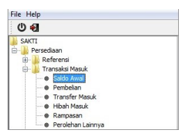
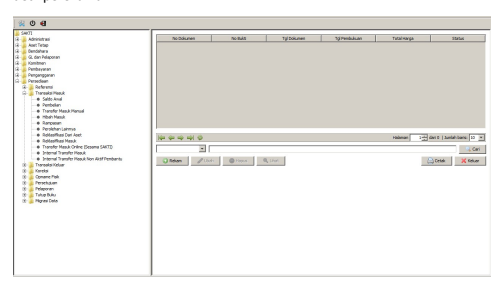

♦
♦
→
Petunjuk Teknis Aplikasi SAKTI
→
PERÉKAMAN PERSEDIAAN MASUK –
SALDO AWAL
→
♦

# Daftar Isi

| HALAMAN JUDUL  DAFTAR ISI 2  DESKRIPSI SINGKAT 3  1. Penyiapan ADK Migrasi dari Aplikasi Persediaan Error! Bookmark not defined. 3. Proses Migrasi pada SAKTI Error! Bookmark not defined. 4. Analisa Hasil Proses Migrasi Error! Bookmark not defined. 5. Persetujuan dan Tutup Periode Hasil Migrasi Error! Bookmark not defined.   |
|---------------------------------------------------------------------------------------------------------------------------------------------------------------------------------------------------------------------------------------------------------------------------------------------------------------------------------------|

# Deskripsi Singkat

Transaksi Masuk Saldo Awal

| No.   | Uraian                  |                                                                                                                                                                                                                                                                               |
|-------|-------------------------|-------------------------------------------------------------------------------------------------------------------------------------------------------------------------------------------------------------------------------------------------------------------------------|
| 1     | Modul                   | PER                                                                                                                                                                                                                                                                           |
| 2     | Role User               | OPR dan APR                                                                                                                                                                                                                                                                   |
| 3     | Modul Lain yang Terkait | GLP                                                                                                                                                                                                                                                                           |
| 4     | Transaksi yang Tekait   | Saldo Awal                                                                                                                                                                                                                                                                    |
| 5     | Dokumen Input           | Berita Acara Pencatatan Saldo Awal                                                                                                                                                                                                                                            |
| 6     | Output                  | Transaksi Saldo Awal disini dipergunakan untuk memasukan  data yang secara dokumen merupakan data tahun sebelumnya  tetapi dimasukan tanggal pembukuan sesuai tahun anggaran  login. Yang dapat melakukan Transaksi Masuk Saldo Awal  adalah pengguna sebagai Operator UAKPB. |
| 7     | Validasi                | - Tanggal dokumen harus pada tahun  anggaran sebelumnya  - Periode persediaan harus belum di tutup                                                                                                                                                                            |

Transaksi Saldo Awal disini dipergunakan untuk memasukan data yang secara dokumen merupakan data tahun sebelumnya tetapi dimasukan tanggal pembukuan sesuai tahun anggaran login. Yang dapat melakukan Transaksi Masuk Saldo Awal adalah pengguna sebagai Operator **UAKPB. Langkah** yang dilakukan adalah dengan memilih menu **Persediaan >> Transaksi Masuk >> Saldo**
Awal. 

Setelah itu akan muncul form pilihan perekaman seperti dibawah ini, klik tombol rekam untuk isikan 

detil perekaman Form detil perekaman akan tampil seperti gambar dibawah, silahkan isilan parameter perekaman dan 

 klik tombol tambah disebelah kanan untuk mengisikan detil barang persediaan yang akan direkam, jika sudah silahkan klik simpan pada tombol dibawah dan perekaman transaksi sudah siap untuk disetujui oleh Approvall. 