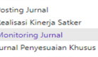
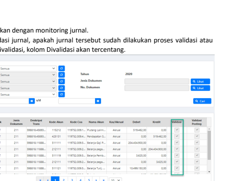

''
VIIII
→
✦
Petunjuk Teknis Aplikasi SAKTI)
♦
. ^GL dan PELAPORAN
MONITORING JURNAL
kementerian keuangan ri DITJEN PERBENDAHARAAN
♦
♦

## Deskripsi Singkat

MONITORING **JURNAL**
Semua transaksi data jurnal yang telah masuk ke modul GL dan Pelaporan dapat di lihat melalui fitur ini, monitoring jurnal dapat juga berfungsi untuk melakukan penelusuran data transaksi ke dokumen sumber dari semua modul dalam rangka melakukan telaah Laporan Keuangan

| 1                               | Modul                | GLP   |
|---------------------------------|----------------------|-------|
| Role User                       | OPR                  |       |
| Modul Lain yang                 | KOM;PER;MAT;BEN;PEM; |       |
| Terkait  Transaksi yang  Tekait |                      |       |

Dokumen Input Output Validasi A. **Langkah-langkah melakukan monitoring jurnal.**

1. **Login menggunakan user operator GLP pada menu GL dan Pelaporan >Proses>Monitoring** 
Jurnal 2. **Muncul form seperti dibawah ini, pilih parameter untuk mempermudah pencariaan jurnal** 

transaksi. 

1.

B.  Hal-hal yang dapat dilakukan dengan monitoring jurnal.

belum. Jika sudah divalidasi, kolom Divalidasi akan tercentang.
2.

Melihat status posting, apakah jurnal tersebut sudah dilakukan proses posting atau belum.

Jika sudah diposting, kolom Posting akan tercentang.

| 2020       |             |               |        |              |
|------------|-------------|---------------|--------|--------------|
| No Do      |             |               |        |              |
| 00011      | 211         | 1001845591    | 115255 | 19752.009.1. |
| 0000       | 21          | .425121       |        |              |
| 609-110757 | 20016,45101 | 119752.009.4. |        |              |
| 2011       | 211         | 11            | 51111  |              |
| 011        | 21          | 9010.11000    | 212111 |              |
| 21         |             |               |        |              |
| 211        |             |               |        |              |
| 211        | 511121      | .             |        |              |

Melihat detil-histori jurnal, detil jurnal terutama yang berasal dari submodul dapat telusuri datanya. Klik baris jurnal kemudian klik detil, aplikasi akan membawa ke form sumber data transaksi.

| Daftar Jumal   | Jenis        | Deskripsi         | Volidas      |               |                         |          |                |    |    |
|----------------|--------------|-------------------|--------------|---------------|-------------------------|----------|----------------|----|----|
| No Dok         | Kode Akun    | Kode Cod          | Kas/Norve    | Debet         | Kredi                   | Validasi |                |    |    |
| Volog          |              |                   |              |               |                         |          |                |    |    |
| .2M-119752     | ..           | 211               | 5881845891   | 15212         | 19752.003.1 Perface La  | A000     | 51946200       | .. | s  |
| M99999         | sin          | 2333333333333333. | स्ट्रास         | 19520034. Pe  | Kous                    |          |                |    |    |
| SPM-119752-    | 001T         | 211               | 535518.1188. | 51111         | 19752.009.5... Relation | Aous     | 204.424.500.00 |    |    |
| 21             | 0,00         |                   |              |               |                         |          |                |    |    |
| 01T            | 598815.11888 | 212111            | Belan        |               |                         |          |                |    |    |
| 001T           | 211          | 55515.1188.       | 51119        | 19752.0095    | A00                     | 3,625,00 | 00             |    |    |
| 0011           | 21           | 55515.1188.       | 212111       | Aous          | 00                      | 3.625.00 |                |    |    |
| 21             | 55515.1188   | 51112             | AAA          | 10.499.150.00 | 0.00                    |          |                |    |    |

m.

## 4. Menampilkan Data Jurnal Permodul, Per-Kelompok Jurnal Hinga Yang Lebih Detil.

| Daftar Jumal   | Kode Buku      |  No Dok                      | Dolumer   | Deskripsi     | Kode Alexn   | Kode Coa                      | Nama Akan   |  Kas/Akraal   |  Detet   | Kredit   | Validasi   |
|----------------|----------------|------------------------------|-----------|---------------|--------------|-------------------------------|-------------|---------------|----------|----------|------------|
| Tgl Jumal      | Besen          | Trans                        |           |               |              |                               |             |               |          |          |            |
| 01-01-2020     | SPM-119752-... | 001T                         | 211       | 593318.45893. | 15212        | 119752.029.1... Piutarg Laim. | Aval        | 519.462.00    | 00       | s        |            |
| 001T           | 211            | 598818.45893.                | 425131    |               |              |                               |             |               |          |          |            |
| 01-01-2020     | SPM-1197S2.    | 119752.009.4.. Pendapeten S. | Acust     | 00            | $19.462.00   | >                             |             |               |          |          |            |

| Validasi   |
|------------|
| Posting    |
| <          |
| s          |

## 5. Mencari Data Jurnal Berdasarkan Jenis Dan Nomor Dokumen.

| Filter Pencarian    |            |
|---------------------|------------|
| Sumber Data/Modul   | Plin Senta |
| Kolompok Jumal      | Pith Semua |
| Sub Kelompok Jurnal | Plih Senua |
| Tipe Jumai          | Pith Semus |
| Periode             | Ph Service |
| Tanggal Jurnal      | _s/d       |

 9. Lhat Q. Linet
Q Cari Daftar Jurnal

| Kode Buku                    | Janis   | Deskripsi   | Validasi       |           |                               |       |        |            |    |
|------------------------------|---------|-------------|----------------|-----------|-------------------------------|-------|--------|------------|----|
| Tgl Jumal                    | No Dok  | Kode Aloun  | Kode Coa       | Nama Akun | Kas/Akrusl                    | Debet | Kredit | V2 I dasi  |    |
| Besar                        | Dokunen | Trans       | Posting        |           |                               |       |        |            |    |
| 01-01-2020 SPM-119752-.      | 001T    | 21          | 59881845993.   | 15212     | 519.462.00                    | 0,00  | <      |            |    |
| 119752.009.1.. Piutang Laim. | Acust   | v           |                |           |                               |       |        |            |    |
| 01-01-2020 SPN-119752-.      | 011     | 211         | 593313.45893.. | 43131     | 119752.009.4... Pendapatan S. | Akrua | 000    | 519,462,00 | -  |
