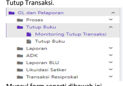
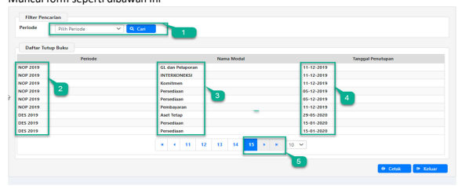

4111111 CONSIDER
♦
Petunjuk Teknis Aplikasi SAKTI
♦
. V GL dan PELAPORAN
MONITORING TUTUP
TRANSAKSI
→
♦

## Deskripsi Singkat

Monitoring Tutup **Transaksi**
Menu ini digunakan untuk melakukan monitoring tutup periode masing-masing modul **untuk**
memastikan submodul telah tutup sebelum melakukan tutup periode GLP. 

No.

1 Modul GLP

Role User OPR Modul Lain yang Terkait 

Transaksi yang 

Tekait 

Dokumen Input Output Validasi Langkah-langkah melakukan monitoring tutup transaksi:
1. **Login menggunakan user operator GLP pada menu GL dan Pelaporan >Tutup Buku>Monitoring** 

2. **Muncul form seperti dibawah ini** 

1. **Monitoring tutup transaksi perperiode** 
2. **Menunjukkan periode yang diitutup** 3. **Menunjukkan Modul yang ditutup** 4. **Menunjukkan tanggal dilakukan tutup buku** 5. Halaman terakhir menunjukkan monitoring tutup buku paling terakhir 