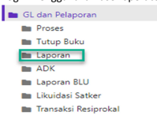
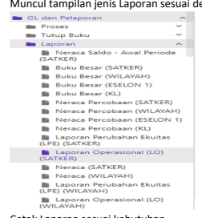

♦
→
Petunjuk Teknis Aplikasi SAKTI
→
♦
. * GL dan PELAPORAN
LAPORAN
♦
♦

## Deskripsi Singkat Laporan

Laporan di GL merupakan laporan keuangan berdasarkan periode buku tertentu, Menu Laporan terdiri dari laporan tingkat satker, laporan tingkat wilayah, laporan tingkat eselon1 dan laporan tingkat kementerian, tingkatan laporan tersebut ditentukan pada saat setup user-login dan setup hak akses yang diberikan kepada masing-masing user.

No.

1 Modul GLP
Role User OPR Modul Lain yang Terkait Transaksi yang Tekait Dokumen Input Output Validasi A. **Transaksi Resiprokal Pendapatan.**

Langkah-langkah merekam Transaksi Resiprokal Pendapatan: 1. **Login menggunakan user operator GLP GL dan Pelaporan >Laporan.** 
2. **Muncul tampilan jenis Laporan sesuai dengan tingkatannya** 

 3. Cetak Laporan sesuai kebutuhan 