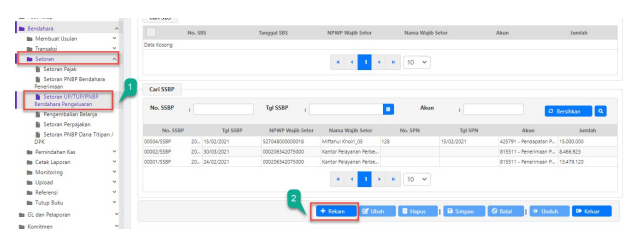

Petunjuk Teknis Aplikasi SAKTI
�
→
PEREKAMAN SETORAN SISA UP/TUP
BENDAHARA PENGELUARAN
kementerian keuangan ri DITJEN PERBENDAHARAAN
→

| No. 1   | Modul                   | BEN                                                                   |
|---------|-------------------------|-----------------------------------------------------------------------|
| 2       | Role User               | OPR                                                                   |
| 3       | Modul Lain yang Terkait | GLP                                                                   |
| 4       | Transaksi yang Tekait   | --                                                                    |
| 5       | Dokumen Input           | Dokumen bukti setoran UP/TUP yang memuat kode billing, NTPN,  dan NTB |
| 6       | Output                  | Nomor SSBP                                                            |
| 7       | Validasi                | -                                                                     |

Perekaman Setoran Sisa UP/TUP Bendahara Pengeluaran

## Pengantar

Petunjuk teknis ini menjelaskan tentang bagaimana langkah yang harus dilakukan jika pada akhir tahun anggaran terdapat sisa saldo UP/TUP di kas bendahara pengeluaran yang harus disetorkan kembali ke kas negara (mengingat saldo pada kas bendahara di akhir tahun harus bersaldo 0). Adapun langkah yang perlu dilakukan dalam pencatatan setoran sisa UP/TUP adalah sebagai berikut:
1. Satker/Penyetor melakukan penyetoran sisa saldo UP/TUP terlebih dahulu melalui bank persepsi/pos/
2. Satker mencatat kelengkapan setoran yang teridiri dari NTPN, NTB, kode billing, akun, dan nominal atas setoran sisa UP/TUP tersebut pada aplikasi SAKTI modul bendahara.

3. Satker melakukan pengecekan sisal saldo kas bendahara dengan menekan tombol Saldo Detail pada menu Pemindahan Kas Bank/Tuinai modul bendahara serta melakukan monitoring jurnal pada modul GLP untuk memastikan bahwa perekaman setoran sisa UP/TUP berhasil membentuk jurnal.

# Petunjuk Perekaman Setoran Sisa Up/Tup Bendahara Pengeluaran

Langkah-langkah dalam perekaman setoran sisa UP/TUP pada modul bendahara SAKTI adalah sebagai berikut:

1. Sebelum melakukan pencatatan setoran UP/TUP, terlebih dahulu pastikan bahwa memang masih ada sisa saldo UP/TUP untuk disetorkan. Pengecekan dapat dilakukan dengan cara menekan tombol Saldo Detail atau Saldo Per Kategori pada menu Pemindahan Kas Bank/Tunai.

1. Selanjutnya, pilih menu Setoran pada Modul Bendahara, kemudian pilih sub menu Setoran UP/TUP/PNBP Bendahara Pengeluaran.

2.  Klik tombol Tambah.

1. Kolom Nomor DIPA akan terisi secara otomatis oleh sistem berdasarkan data DIPA yang tersedia 

pada satker.

2. Pilih Jenis Pengembalian/Setoran "UP/UPKP" jika akan menyetorkan sisa UP atau "TUP" jika akan menyetorkan sisa TUP.

3. Isikan Program dan Kegiatan sesuai dengan data riil penyetoran.

4. Isikan Tanggal SSBP sesuai dengan tanggal dilakukannya penyetoran.

5. Kolom nomor SPN dan tanggal SPN tidak wajib diisi (opsional). Jika tidak ada, bisa dikosongkan saja atau ditulis tanda strip "-".

6. Pilih jenis UP/TUP "Rupiah". Jika satker mengelola UP valas dan ingin melakukan penyetoran sisa UP valas, maka pilih "Valas". Untuk satker yang mengelola UP valas, lanjutkan dengan menigisi kolom Mata Uang dan Kurs sesuai dengan kondisi/data riil pada satker masing-masing.

7. Cara penyetoran dipilih "Tunai" jika bendahara melakukan penyetoran secara tunai atau dipilih 
"Non Tunai" jika bendahara melakukan penyetoran secara non tunai.

8. Isikan keterangan setoran.

1. Selanjutnya, lanjutkan pengisian Sumber Dana. Klik tombol *dropdown* dan pilih jenis sumber dana yang sudah tersedia.

2. Isikan kolom NPWP wajib setor dengan cara mengklik tombol kaca pembesar dan kemudian pilih data NPWP bendahara pengeluaran.

3. Isikan jumlah setoran dalam nominal rupiah. 4. Pilih kode akun yang akan disetorkan. Untuk penyetoran sisa UP tahun berjalan, akun yang dipilih adalah 815111 dan untuk penyetoran sisa TUP tahun berjalan, akun yang dipilih adalah 815511.

5. Pilih rekening bank yang digunakan untuk menyetorkan sisa UP/TUP (jika jenis setorannya non tunai. Apabila jenis setorannya tunai, maka lewati langkah ini).

6. Kolom saldo bank akan menampilkan sisa saldo UP/TUP 

1. Selanjutnya, isikan data-data pada kolom Pengesahan Setoran yang terdiri dari:
- Tanggal diterima bank; diisi dengan tanggal dilakukannya setoran UP/TUP pada Bank/Pos 
- NTPN, NTB; diisi sesuai dengan data pada surat bukti setoran UP/TUPBank; 2. Isikan juga nama bank yang digunakan sebagai tempat menyetorkan sisa UP/TUP 3. Klik tombol simpan.

1. Setoran UP/TUP yang berhasil tersimpan akan muncul pada kolom Cari SSBP seperti pada gambar diatas. Perlu diingat bahwa setoran UP/TUP yang sudah berhasil disimpan tidak dapat dilakukan ubah/edit. Jika ada kesalahan perekaman, silahkan user melakukan hapus kemudian rekam ulang. 

Hal ini bertujuan untuk meghindari anomali pembentukan jurnal pada sisi modul GLP.

Petunjuk Teknis Aplikasi SAKTI)
KEMENTERIAN KEUANGAN RI
DITJEN PERBENDAHARAAN
→
→
PENIHILAN GUP
Perekaman Pengambalian Belanja 

| No. 1   | Modul                   | BEN                                                |
|---------|-------------------------|----------------------------------------------------|
| 2       | Role User               | OPR                                                |
| 3       | Modul Lain yang Terkait | PEM                                                |
| 4       | Transaksi yang Tekait   | PEM - Upload nomor SP2D otomatis                   |
| 5       | Dokumen Input           | Kuitansi/bukti pembelian serta data SP2D GUP Nihil |
| 6       | Output                  | SSBP (Setoran UP)                                  |
| 7       | Validasi                | -                                                  |

## Pengantar

Petunjuk teknis ini menjelaskan tentang tata cara/siklus penihilan GUP yang biasanya dilakukan oleh Bendahara Pengeluaran di akhir tahun anggaran. Pada juknis ini, akan dijelaskan dua cara penihilan saldo GUP, yaitu dengan cara pembuatan SPM GUP Nihil dan dengan cara penyetoran sisa GUP. Pada dasarnya, siklus penhilan GUP ini sama saja dengan siklus penihilan TUP (PTUP). Perbedaannya hanya ada pada jenis SPM yang dipilih, dimana pada penihilan GUP jika menggunakan SPM maka jenis SPM yang dipilih adalah GUP Nihil (kode SPM 313) dan pada penihilan TUP nihil menggunakan jenis SPM PTUP/TUP Nihil (kode SPM 322) dan jika pemilihan menggunakan metode setoran, maka jenis setoran yang dipilih pada form setoran sisa UP/TUP/PNBP Bendahara Pengeluaran adalah "TUP".

- **Menggunakan Metode Setoran** -

1. Pada kolom jenis pengembalian/setoran, pilih UP/UPKP (jika ingin menihilkan sisa TUP, pilih TUP).

2. Pilih sumber dana sesuai dengan yang tersedia pada tombol *drop down*, kemudian pada kolom NPWP 
wajib setor pilih NPWP satker/bendahara pengeluaran.

3. Isikan tanggal SSBP sesuai dengan tanggal setor riil. 4. Pilih jenis UP/TUP rupiah atau valas. Pada simulasi ini, yang dipilih adalah rupiah dikarenakan satker tidak memiliki UP dengan jenis valas. Pilih cara penyetoran tunai/non tunai (pada simulasi ini menggunakan cara penyetoran tunai).

5. Isikan kolom keterangan, jumlah sisa UP yang akan disetorkan, dan akun untuk penyetoran sisa UP 
(815111 jika disetorkan di tahun anggaran berjalan).

1. Lengkapi kolom Pengesahan Setoran (tanggal penyetoran, NTPN, Kode Billing, NTB/NTP, dan nama 

bank/pos tempat menyetorkan sisa UP sesuai dengan transaksi riil). Jika sudah, klik Simpan.

- **Menggunakan Metode Penihilan dengan SPM GUP Nihil** -

1. Pada modul bendahara, pilih menu transaksi  membuat kuitansi.

2. Pada gambar diatas, diasumsikan bahwa satker memiliki dua buah kuitansi senilai 20.000.000 dan 9.774.278 yang keduanya akan dilakukan penihilan GUP. Pada konsisi riil, silahkan sesuaikan jumlah saldo/nominal kuitansi yang akan dilakukan transaksi penihilan GUP.

1. Lanjutkan dengan membuat DRPP pada menu Membuat usulan  Membuat DRPP
2. Klik tombol Tambah.

1. Pastikan kolom Nomor DIPA sudah terisi 2. Pilih PPK, Sumber Dana, KPPN, Cara Penarikan, dan Nomor Register.

3. Pilih tanggal DRPP. 4. Pilih jenis kuitansi UP.

5. Klik tombol Cari PKO, akan muncul *pop up* seperti pada gambar dibawah ini:

1. Pilih Program, Kegiatan, dan Output sesuai dengan yang telah direkam pada Kuitansi sebelumnya. 2. Jika sudah, klik tombol Pilih.

2. Akan muncul data kuitansi pada kolom Kuitansi yang Dipertanggungjawabkan. Klik centang pada kuitansi-

1. Gambar diatas adalah contoh DRPP yang sudah disimpan atas dua kuitansi yang bernilai 20.000.000 dan 9.774.278. 

1. Langkah selanjutnya adalah perekaman SPP GUP Nihil. Langkah ini dilakukan oleh operator modul pembayaran atau staf PPK. Pilih modul pembayaran  Catat/Ubah SPP.

2. Pada kolom jenis SPP, piilh jenis SPP 313 (GUP Nihil).

3. Klik tombol Tambah, akan muncul *pop up* box seperti pada gambar berikut:

2. Klik tombol Pilih. Selanjutnya akan muncul form SPP. Isikan sesuai dengan ketentuan peraturan yang berlaku (terkait tata cara perekaman SPP dapat dilihat pada juknis modul pembayaran).

3. Lanjutkan perekaman SPP sampai dengan menjadi SP2D dan pencatatan nomor SP2D otomatis pada modul pembayaran  Mencatat/Upload Nomor SP2D.

1. Jika operator modul pembayaran telah mencatat nomor SP2D atas SP2D GUP Nihil, langkah terakhir yang harus dilakukan operator modul bendahara adalah mengakses menu Pemindahan Kas  Kas Bank Bendahara Pengeluaran.

2. Klik tombol rekam, kemudian isikan tanggal sesuai dengan tanggal transaksi SP2D GUP Nihil tercatat di rekening BPG. Pada kolom Jenis Aktifitas, pilih Terima SP2D dan pilih kategori kas UP/GUP/GUP NIHIL.

3. Klik tombol Cari, kemudian pilih nomor SP2D GUP Nihil. Pastikan kolom Jenis SP2D dan jumlah terisi secara otomatis kemudian klik Simpan.

Untuk memastikan bahwa saldo UP sudah nihil, satker dapat melakukan pengecekan pada menu Pemindahan Kas  Kas Bank/Tunai Bendahara Pengeluaran  klik tombol Saldo Detail. Akan muncul tampilan Informasi Sisa Saldo Kas Detail seperti pada gambar diatas.