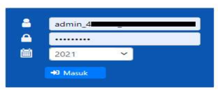
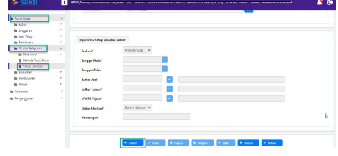
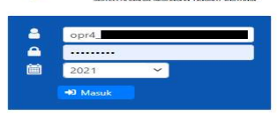
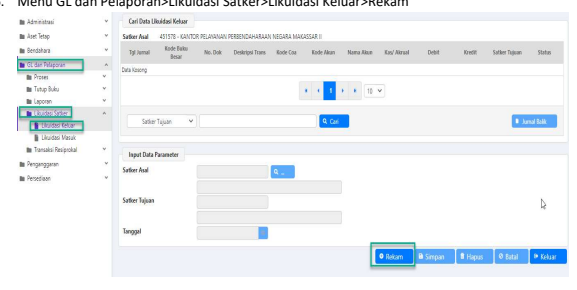
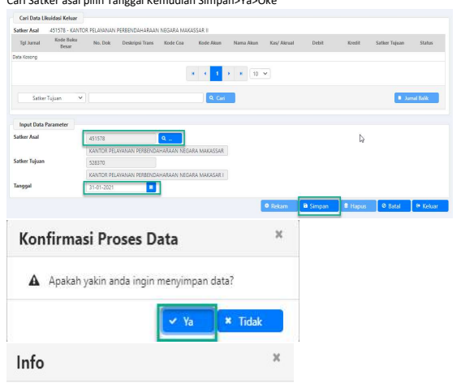
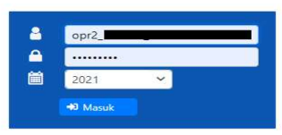
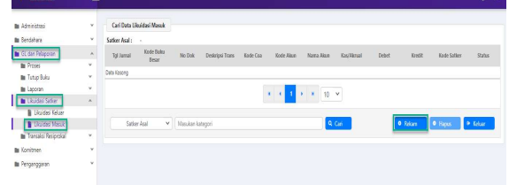
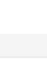
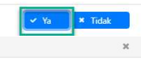

→
♦
♦
♦
Petunjuk Teknis Aplikasi SAKTI)
.

→
e XLP Likuidasi Satker

## Likuidasi Satker

Menu Likuidasi Satker pada modul GLP digunakan untuk melakukan Likuidasi Keluar dan Likuidasi Masuk Neraca sebagai akibat pengakhiran/pembubaran Satker 

| Modul                   | GLP                                                               |
|-------------------------|-------------------------------------------------------------------|
| Role User               | OPR                                                               |
| Modul Lain yang         | Pesediaan, Aset Tetap, dan Piutang                                |
| Terkait  Transaksi yang | Likuidasi Modul Persediaan, Likuidasi Modul Aset Tetap            |
| Tekait  Dokumen Input   | BA Likuidasi                                                      |
| Output                  | Laporan Keuangan                                                  |
| Validasi                | Modul Persediaan, Aset Tetap,  Piutang telah dilakukan  Likuidasi |

## A. **Likuidasi Keluar** 

Langkah-langkah melakukan Likuidasi Keluar: 1. **Pastikan Modul Persediaan, Modul Aset Tetap, dan Modul Piutang telah dilakukan likuidasi** 
2. **Login sebagai Admin** 
3. **Login sebagai user Modul Administrasi>GL dan Pelaporan>Setup Likuidasi>Rekam** 

## 4. **Input Data Setup Likuidasi Satker Lalu Simpan** 

1) **Periode : diisi dengan periode bulan saat dilakukan likuidasi keluar** 2) Tanggal Mulai dan Tanggal Akhir : diisi dengan range **tanggal yang dapat dipilih sebagai tanggal** 
buku transaksi likuidasi keluar, selama dalam periode bulan yang telah dipilih pada kolom sebelumnya 3) **Satker Asal : dipilih satker asal atau satker pengirim atau satker yang akan dilikuidasi keluar** 4) **Satker Tujuan : dipilih satker tujuan** 5) **UAKPB Tujuan : dipilih UAKPB tujuan** 6) **Status Likuidasi : dipilih belum selesai** 
Keterangan : diisi dengan penjelasan tambahan 5. **Login sebagai user operator GLP Satker yang dilikuidasi** 

## Menu Gl Dan Pelaporan>Likuidasi Satker>Likuidasi Keluar>Rekam

6.

## Cari Satker Asal Pilih Tanggal Kemudian Simpan>Ya>Oke 7.

A Data Likuidasi berhasil disimpan!

 Oke B.

## Likuidasi Masuk

Pastikan telah dilakukan Likuidasi Keluar Modul GLP Satker asal dan periode GLP Satker Likuidasi Masuk terbuka.

Langkah-langkah melakukan Likuidasi Masuk:
1. Login sebagai user operator GLP Satker Likuidasi Masuk

2. Menu GL dan Pelaporan>Likuidasi Satker>Likuidasi Masuk>Rekam

<
ANAN PERSENDAHAGAN NEGARA MAKASAR (SOUTIN) - SOUTION - OFFERING

## 3.   Proses Likuidasi Masuk

Form Lookup data yang berasal dari LIKUIDASI Keluar

| Debit       | Kredit   | Setker Tujua   |                |
|-------------|----------|----------------|----------------|
| 17476950    | 528370   |                |                |
| 31-01-202   | 44113000 | 528370         | Blum different |
| 1464000     |          |                |                |
| 31.01.202   | o        | 528370         |                |
| 31-01-202   | 44115000 | 528370         |                |
| o           |          |                |                |
| 31-01-202   | o        | 528370         | Belum of terms |
| 31-21-202   | 500000   | 528370         |                |
| 500000      | 528370   |                |                |
| 31-01-2021  |          |                |                |
| 31-21-202   | 500000   | 528375         |                |
| 31.01.202   | 528370   |                |                |
| Satker Asal |          |                |                |

## Konfirmasi

x A Apakah yakin anda ingin memproses data?

A
Data Likuidasi berhasil disimpan!

✔ Oke Proses Likuidasi Masuk Modul GLP Selesai