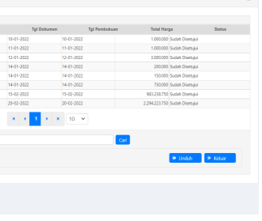
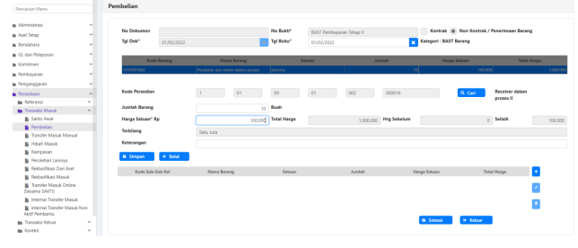
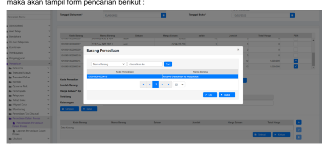

Petunjuk Teknis Aplikasi SAKTI
MODUL PERSEDIAAN
♦
♦
♦

# Petunjuk Teknis Transaksi Persediaan Juknis Persediaan Dalam Proses

## Deskripsi Singkat Menu

Menu persediaan dalam proses ini, digunakan untuk melakukan perekaman pembelian barang persediaan diserahkan ke masyarakat ( kode barang 10105 XXXXX ) yag diperoleh bukan dari pembelian langsung, melainkan pembeliaanya terdidi dari beberapa termin.

## Contoh Simulasi

Terdapat pembelian Receiver diserahkan ke masyarakat ( kode 10105 XXXXX ), yang diperoleh dari 2 kali pembayaran, ada 2 BAST. Untuk tiap-tiap pembayaran, harus didetilkan dahulu ke kode barang dalam proses ( 10109 XXXXX ) terlebih dahulu. Pendetilan BAST pertama akan didetilkan sebagai Receiver Tahap I dan pendetilan BAST kedua akan didetilkan sebagai Reicever Tahap II. Jika sudah, baru nanti diselesaikan pada menu Penyelesaian persediaan dalam proses untuk dijadikan ke kode barang diserahkan ke masyarakat ( 10105 XXXXX ).

## Langkah Perekaman Bast Di Modul Komitmen

Perekaman pada Modul Komitmen saat membuat BAST. Pada BAST pastikakn kode barng yang dipilih dan jumlah barang disesuaikan dengan proporsi sesuai pembayaran tahap I-nya

Tentukan pengisian jumlah barang dan harga satuan

## Langkah Perekaman Di Modul Persediaan Sakti

Membuat Refrensi Kode Barang Pada user opr satker induk. Silahkan masuk ke menu refrensi, mengelola barang persediaan

Untuk Barang persediaan dalam proses, menggunakan kode barang khusus ( 10109 XXXXX )

Kita buat kode barang dalam proses I ( untuk pembayaran pertama )

 Buat kode barang dalam proses II ( untuk pembayaran kedua )

Masuk ke menu pembelian untuk mendetilkan masing2 BAST di barang dalam proses

Kita pilih kode barang ( tahap I )

 Lanjut diisikan jumlah barang dan harga satuan, disesuaikan eprrti yang di BAST
Pembelian Men

Pada User Appoval lakukan persetujuan an Transaksi Persediaan Tables Build econ Masuk pada menu pembelian, klik tombol rekam

Lanjut diisikan jumlah barang dan harga satuan, disesuaikan eprrti yang di BAST

Pada User Appoval lakukan persetujuan

## Penyelesaian Persediaan Dalam Proses

Pada tahap ini kita sudah merekam semua termin pembayaran ( BAST I dan BAST II ) dalam bentuk kode barang dalam proses I dan kode barang dalam proses II ( 10109 XXXXX). Sampai di tahap ini, mash berupa barang dalam proses dan perlu lankah selanjutnya untuk memproses menjadi barang di serahkan ke masyarakat ( 10105 XXXXX ). Masuk pada menu Persediaan dalam proses > penyelesaian persediaan dalam proses, klik tombol rekam maka akan muncul form berikut. Silahkan isikan No Bukti dasar transaksi, tanggal dokumen dan tanggal buku

Lalu pilih kode barang dalam proses ( 10109 XXXX ) yang akan dijadikan menjadi barang yang akan diserahkan ke masyarakat, dalam contoh ini, dipilih kode barang Receiver Dalam Proses I. 

Dalam form berikutnya yang muncul ( form input jumlah ) silahakn diisikan jumlah barnag dalam proses yang akan dijadikan menjadi barang diserahkan ke masyarakat. Dalam contoh ini semua kode barang Receiver dalam proses I ( 10 buah ) akan dijadikan menjadi barang diserahkan ke masyarakat ( kode barang 10105XXXXX ), lalu klik simpan.

ii
Berikutnya kita pilih kode barang receiver dalam proses II dan kita isikan jumlahnya yang akan dijadikan barang diserahkan ke masyarakat ( kode 10105 XXXXX ), setelah itu klik simpan

Pada Langkah berikutnya, kita isikan jumlah barang yang diserahkan ke masyarakat ( kode 10105XXXXX ). Dalam contoh ini akan dijadikan kode barang Receiver Diserahkan ke Masyarakat dengan cara klik tombol tambah di sisi kanan dan pilih barangnya dengan cara klik tombol cari 

Pilih kode barang Receiver Diserahkan ke Masyarakat, lalu isikan jumlah yang akan dijadikan menjadi Receiver Diserahkan ke Masyarakat seperti form dibawah ini ( dalam contoh ini Reicever Diserahkan ke Masyarakat ada 20 buah ). SIlahkan isikan kolom keterangan jika dibutuhkan keterangan yang lebih jelas. 

