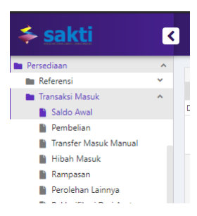
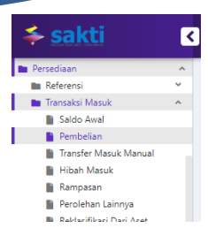
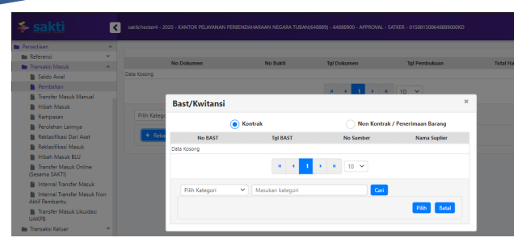
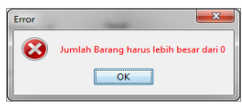
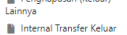
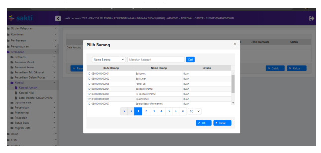

2020

Petunjuk Teknis

# Aplikasi Sakti

Modul Persediaan

# Daftar Isi

| HALAMAN JUDUL                                                                                                        |
|----------------------------------------------------------------------------------------------------------------------|
| DAFTAR ISI                                                                                                           |
| Transaksi Masuk Saldo Awal .                                                                                         |
| Transaksi Masuk Pembelian.                                                                                           |
| Transaksi Transfer Masuk Manual                                                                                      |
| Transaksi Masuk Hibah Masuk.                                                                                         |
| T Transaksi Rampasan                                                                                                 |
| Transaksi Perolehan Lainnya.                                                                                         |
| Transaksi Reklasifikasi dari Aset tetap                                                                              |
| Transaksi Reklasifikasi Masuk                                                                                        |
| Transaksi Internal Transfer Masuk Online .                                                                           |
| Transaksi Transfer Masuk (Non Aktif Pembantu)                                                                        |
| Transaksi persediaan keluar - Pemakaian (Penjualan/penyerahan ke masyarakat) .................................... 27 |
| Transaksi persediaan keluar - Transfer Keluar Manual                                                                 |
| Transaksi persediaan keluar - Hibah Keluar .                                                                         |
| Transaksi persediaan keluar - Penghapusan (keluar) Lainya                                                            |
| Transaksi persediaan keluar - Internal Transfer Keluar .                                                             |
| Transaksi persediaan keluar - Usang/Rusak.                                                                           |
| Transaksi persediaan keluar - Penghapusn Usang/Rusak .                                                               |
| Transaksi Reklasifikasi Keluar ke Aset tetap .                                                                       |
| Transaksi Reklasifikasi Keluar ke Aset tetap .                                                                       |
| Transaksi Transfer Keluar Online .                                                                                   |
| Transaksi Koreksi                                                                                                    |
| Transaksi Batal Transfer Keluar Online .                                                                             |
| Opname Fisik                                                                                                         |
| Tutup Periode Persediaan                                                                                             |
| Migrasi Persediaan                                                                                                   |

# Transaksi Masuk Saldo Awal Deskripsi Singkat

Transaksi Masuk Saldo 

Awal

| Awal   |                         |                                                                                                                                                                                                                                                                             |
|--------|-------------------------|-----------------------------------------------------------------------------------------------------------------------------------------------------------------------------------------------------------------------------------------------------------------------------|
| No.    | Uraian                  |                                                                                                                                                                                                                                                                             |
| 1      | Modul                   | PER                                                                                                                                                                                                                                                                         |
| 2      | Role User               | OPR dan APR                                                                                                                                                                                                                                                                 |
| 3      | Modul Lain yang Terkait | GLP                                                                                                                                                                                                                                                                         |
| 4      | Transaksi yang Tekait   | Saldo Awal                                                                                                                                                                                                                                                                  |
| 5      | Dokumen Input           | Berita Acara Pencatatan Saldo Awal                                                                                                                                                                                                                                          |
| 6      | Output                  | Transaksi Saldo Awal disini dipergunakan untuk memasukan data yang secara dokumen merupakan data tahun sebelumnya tetapi dimasukan tanggal pembukuan sesuai tahun anggaran  login. Yang dapat melakukan Transaksi Masuk Saldo Awal  adalah pengguna sebagai Operator UAKPB. |
| 7      | Validasi                | - Tanggal dokumen harus pada tahun  anggaran sebelumnya - Periode persediaan harus belum di tutup                                                                                                                                                                           |

Transaksi Saldo Awal disini dipergunakan untuk memasukan data yang secara dokumen merupakan data tahun sebelumnya tetapi dimasukan tanggal pembukuan sesuai tahun anggaran login. Yang dapat melakukan Transaksi Masuk Saldo Awal adalah pengguna sebagai *Operator* UAKPB. Langkah yang dilakukan adalah dengan memilih menu Persediaan >> Transaksi Masuk >> **Saldo**
Awal.

Form detil perekaman akan tampil seperti gambar dibawah, silahkan isilan parameter perekaman dan 

klik tombol tambah disebelah kanan untuk mengisikan detil barang persediaan yang akan direkam, jika sudah silahkan klik simpan pada tombol dibawah dan perekaman transaksi sudah siap untuk disetujui oleh Approvall.

3

Setelah itu akan muncul form pilihan perekaman seperti dibawah ini, klik tombol rekam untuk isikan detil perekaman
# Transaksi Masuk Pembelian

## Deskripsi Singkat

Transaksi Masuk Pembelian

| Pembelian   |                         |                                                                                                                                                                                                                                                          |
|-------------|-------------------------|----------------------------------------------------------------------------------------------------------------------------------------------------------------------------------------------------------------------------------------------------------|
| No.         | Uraian                  |                                                                                                                                                                                                                                                          |
| 1           | Modul                   | PER                                                                                                                                                                                                                                                      |
| 2           | Role User               | OPR dan APR                                                                                                                                                                                                                                              |
| 3           | Modul Lain yang Terkait | GLP, Bendahara dan Komitmen                                                                                                                                                                                                                              |
| 4           | Transaksi yang Tekait   | Perekaman Kuitansi, Perekaman BAST, Pendetilan Pembelian  Persediaan                                                                                                                                                                                     |
| 5           | Dokumen Input           | Kuitansi, BAST Kontraktual dan BAST non  Kontraktual                                                                                                                                                                                                     |
| 6           | Output                  | Semua Laporan pada modul Persediaan                                                                                                                                                                                                                      |
| 7           | Validasi                | - Harus sudah ada transaksi pembelian  persediaan pada modul Bendahara dan  Komitmen - Pada Kuitansi dan BAST harus dipilih kode  barang persediaan. - Validasi urutan tanggal transaksi atas barang  yang sejenis (tidak bisa sisip tanggal  transaksi) |

Sub menu transaksi Pembelian ini merupakan transaksi masuk Persediaan dari hasil pembelian baik dari modul Komitmen maupun dari modul Bendahara. Yang dapat melakukan Transaksi Masuk Pembelian adalah pengguna sebagai *Operator* UAKPB atau *Operator* UAPKPB.

Langkah yang dilakukan adalah dengan memilih menu Persediaan >> Transaksi Masuk >> 
Pembelian.

5

Setelah itu akan muncul form pilihan perekaman seperti dibawah ini, klik tombol rekam untuk isikan detil perekaman
Maka akan diikuti pilihan dari dokumen sumber mana pembelian yang akan didetilkan, dalam hal ini akan terdapat 3 (tiga) pilihan yaitu :
a. Komitmen b. Non-Kontraktual Silahkan klik kode sub-sub kel yang sudah dipilih oleh operator bendahara dan atau operator komitmen 

untuk kemudian didetilkan oleh operator persediaan dan bila sudah klik tombol simpan yang ada di bawah kanan.

# Transaksi Transfer Masuk Manual Deskripsi Singkat

Transaksi Transfer Masuk Manual

| No.   | Uraian                  |                                                |
|-------|-------------------------|------------------------------------------------|
| 1     | Modul                   | PER                                            |
| 2     | Role User               | OPR dan APR                                    |
| 3     | Modul Lain yang Terkait | GLP                                            |
| 4     | Transaksi yang Tekait   | Transfer Masuk Manual                          |
| 5     | Dokumen Input           | BAST Serah Terima Barang                       |
| 6     | Output                  | Semua Laporan pada modul Persediaan            |
| 7     | Validasi                | - Tanggal Urutan transaksi atas barang sejenis |

## Transfer Masuk

Sub menu transaksi Transfer Masuk ini merupakan transaksi perolehan Persediaan dari hasil transfer masuk dari UAKPB atau Satker lain. Yang dapat melakukan Transaksi Transfer Masuk adalah pengguna sebagai *Operator* UAKPB. Langkah yang dilakukan adalah dengan memilih menu Persediaan >> Transaksi Masuk >> **Transfer** Masuk.

8

Setelah itu akan muncul form pilihan perekaman seperti dibawah ini, klik tombol rekam untuk isikan detil perekaman
Form detil perekaman akan tampil seperti gambar dibawah, silahkan isilan parameter perekaman dan klik tombol tambah disebelah kanan untuk mengisikan detil barang persediaan yang akan direkam, jika sudah silahkan klik simpan pada tombol dibawah dan perekaman transaksi sudah siap untuk disetujui oleh Approvall.

# Transaksi Masuk Hibah Masuk

DESKRIPSI SINGKAT 
Transaksi Masuk Hibah Masuk

| Masuk   |                         |                                                                                                                                                                                                                               |
|---------|-------------------------|-------------------------------------------------------------------------------------------------------------------------------------------------------------------------------------------------------------------------------|
| No.     | Uraian                  |                                                                                                                                                                                                                               |
| 1       | Modul                   | PER                                                                                                                                                                                                                           |
| 2       | Role User               | OPR dan APR                                                                                                                                                                                                                   |
| 3       | Modul Lain yang Terkait | GLP dan Komitmen                                                                                                                                                                                                              |
| 4       | Transaksi yang Tekait   | Perekaman BAST hibah B/J/S modul Komitmen                                                                                                                                                                                     |
| 5       | Dokumen Input           | BAST hibah B/J/S modul Komitmen                                                                                                                                                                                               |
| 6       | Output                  | Semua Laporan pada modul Persediaan                                                                                                                                                                                           |
| 7       | Validasi                | - Harus sudah ada transaksi hiah persediaan  pada modul Komitmen - Pada BAST B/J/S harus dipilih kode barang  persediaan. - Validasi urutan tanggal transaksi atas barang  yang sejenis (tidak bisa sisip tanggal  transaksi) |

Sub menu transaksi Hibah Masuk ini merupakan transaksi perolehan Persediaan dari hasil penerimaan hibah dari Organisasi lain di luar Pemerintahan. Yang dapat melakukan Transaksi Hibah Masuk adalah pengguna sebagai *Operator* UAKPB. langkah yang dilakukan adalah dengan memilih menu Persediaan >> Transaksi Masuk >> **Hibah**

Masuk.

Maka akan diikuti pilihan dokumen BAST Hibah mana yang akan didetilkan Silahkan pilih dari dokumen 

 sumber mana yang akan didetilkan dan klik dokumen sumber yang dimaksud, kemudian akan muncul form sebagai berikut :
Silahkan klik kode sub-sub kel yang sudah dipilih oleh operator bendahara dan atau operator komitmen untuk kemudian didetilkan oleh operator persediaan dan bila sudah klik tombol simpan yang ada di bawah kanan.

Setelah itu akan muncul form pilihan perekaman seperti dibawah ini, klik tombol rekam untuk isikan 

detil perekaman

# Transaksi Rampasan

## Deskripsi Singkat

Transaksi Rampasan

| Transaksi Rampasan   |                         |                                                |
|----------------------|-------------------------|------------------------------------------------|
| No.                  | Uraian                  |                                                |
| 1                    | Modul                   | PER                                            |
| 2                    | Role User               | OPR dan APR                                    |
| 3                    | Modul Lain yang Terkait | GLP                                            |
| 4                    | Transaksi yang Tekait   | Rampasan                                       |
| 5                    | Dokumen Input           | BAST Serah Terima Barang                       |
| 6                    | Output                  | Semua Laporan pada modul Persediaan            |
| 7                    | Validasi                | - Tanggal Urutan transaksi atas barang sejenis |

## Rampasan

Sub menu transaksi Rampasan ini merupakan transaksi perolehan Persediaan dari hasil penerimaan rampasan. Yang dapat melakukan Transaksi Rampasan adalah pengguna sebagai *Operator* UAKPB. Langkah yang dilakukan adalah dengan memilih menu **Persediaan >> Transaksi Masuk >>** 
Rampasan.

PEREKAM AN 
Setelah itu akan muncul form pilihan perekaman seperti dibawah ini, klik tombol rekam untuk isikan 

detil perekaman Form detil perekaman akan tampil seperti gambar dibawah, silahkan isilan parameter perekaman dan 

 klik tombol tambah disebelah kanan untuk mengisikan detil barang persediaan yang akan direkam, jika sudah silahkan klik simpan pada tombol dibawah dan perekaman transaksi sudah siap untuk disetujui oleh Approvall.

# Transaksi Perolehan Lainnya Deskripsi Singkat

Transaksi Perolehan Lainya

| No.   | Uraian                  |                                                |
|-------|-------------------------|------------------------------------------------|
| 1     | Modul                   | PER                                            |
| 2     | Role User               | OPR dan APR                                    |
| 3     | Modul Lain yang Terkait | GLP                                            |
| 4     | Transaksi yang Tekait   | Perolehan Lainya                               |
| 5     | Dokumen Input           | BAST Rampasan                                  |
| 6     | Output                  | Semua Laporan pada modul Persediaan            |
| 7     | Validasi                | - Tanggal Urutan transaksi atas barang sejenis |

## Perolehan Lainnya

Sub menu Transaksi Perolehan Lainnya ini merupakan transaksi perolehan Persediaan dari hasil penerimaan selain saldo awal, pembelian, transfer masuk, hibah masuk dan rampsan. Yang dapat melakukan Transaksi Perolehan Lainnya adalah pengguna sebagai *Operator* UAKPB. Langkah yang dilakukan adalah dengan memilih menu Persediaan >> Transaksi Masuk >> **Perolehan**
Lainnya.

 Setelah itu akan muncul form pilihan perekaman seperti dibawah ini, klik tombol rekam untuk isikan 

detil perekaman Form detil perekaman akan tampil seperti gambar dibawah, silahkan isilan parameter perekaman dan 

klik tombol tambah disebelah kanan untuk mengisikan detil barang persediaan yang akan direkam, jika sudah silahkan klik simpan pada tombol dibawah dan perekaman transaksi sudah siap untuk disetujui oleh Approvall.

# Transaksi Reklasifikasi Dari Aset Tetap Deskripsi Singkat

Transaksi Reklasifikasi 

dari Aset tetap

| dari Aset tetap   |                         |                                                                                                                                                                                                                                                                                              |
|-------------------|-------------------------|----------------------------------------------------------------------------------------------------------------------------------------------------------------------------------------------------------------------------------------------------------------------------------------------|
| No.               | Uraian                  |                                                                                                                                                                                                                                                                                              |
| 1                 | Modul                   | PER                                                                                                                                                                                                                                                                                          |
| 2                 | Role User               | OPR dan APR                                                                                                                                                                                                                                                                                  |
| 3                 | Modul Lain yang Terkait | GLP dan Modul Aset tetap                                                                                                                                                                                                                                                                     |
| 4                 | Transaksi yang Tekait   | Reklasifikasi dari Aset ke Persediaan                                                                                                                                                                                                                                                        |
| 5                 | Dokumen Input           | BAST Reklasifikasi                                                                                                                                                                                                                                                                           |
| 6                 | Output                  | Semua Laporan pada modul Persediaan                                                                                                                                                                                                                                                          |
| 7                 | Validasi                | - Tanggal Urutan transaksi atas barang sejenis - Harus sudah dilakukan approve transaksi di  modul aset tetap yaitu transaksi reklasifikasi  dari aset ke persediaan - Harus dilakukan dalam jangka waktu 1  periode yang sama dnegan transaksi  reklasifikasi keluar di modul aset tetapnya |
| Reklasifikasi     | dari                    | Aset                                                                                                                                                                                                                                                                                         |

Sub menu Transaksi Reklasifikasi dari aset tetap ini adalah sub menu yang digunakan untuk merubah klasifikasi barnag yang sebelumnya sudah terlanjur diklasifikasikan (didetilkan) 
sebagai aset tetap menjadi klasifikasi barang persediaan. Menu ini harus digunakan secara bermsamaan dengan menu reklasifikasi aset tetap ke persediaan dalam periode yang sama. 

Silahkan pilih menu reklasifikasi masuk dari aset tetap seperti gambar dibawah ini :

Silahkan diikuti dengan memilih barang apa yang akan direklasifikasi ke persediaan dari modul aset tetap. 

Form detil perekaman akan tampil seperti gambar dibawah, silahkan isilan parameter perekaman dan klik tombol tambah disebelah kanan untuk mengisikan detil barang persediaan yang akan direkam, jika sudah silahkan klik simpan pada tombol dibawah dan perekaman transaksi sudah siap untuk disetujui oleh Approvall.

# Transaksi Reklasifikasi Masuk

DESKRIPSI SINGKAT

Transaksi Reklasifikasi 

Masuk

| Masuk               |                         |                                                                                                                                                                                                                                  |
|---------------------|-------------------------|----------------------------------------------------------------------------------------------------------------------------------------------------------------------------------------------------------------------------------|
| No.                 | Uraian                  |                                                                                                                                                                                                                                  |
| 1                   | Modul                   | PER                                                                                                                                                                                                                              |
| 2                   | Role User               | OPR dan APR                                                                                                                                                                                                                      |
| 3                   | Modul Lain yang Terkait | GLP                                                                                                                                                                                                                              |
| 4                   | Transaksi yang Tekait   | Reklasifikasi masuk sesama barang persediaan                                                                                                                                                                                     |
| 5                   | Dokumen Input           | BAST Reklasifikasi                                                                                                                                                                                                               |
| 6                   | Output                  | Semua Laporan pada modul Persediaan                                                                                                                                                                                              |
| 7                   | Validasi                | - Tanggal Urutan transaksi atas barang sejenis - Harus sudah dilakukan approve transaksi di  transaksi reklasifikasi keluarnya - Harus dilakukan dalam jangka waktu 1  periode yang sama dnegan transaksi  reklasifikasi keluar. |
| Reklasifikasi Masuk |                         |                                                                                                                                                                                                                                  |

Sub menu Transaksi Reklasifikasi dari aset tetap ini adalah sub menu yang digunakan untuk merubah klasifikasi barnag yang sebelumnya sudah terlanjur diklasifikasikan (didetilkan) 
sebagai barang persediaan tertentu diubah menjadi klasifikasi barang persediaan yang lain. Menu ini harus digunakan secara bermsamaan dengan menu reklasifikasi keluarnya ke persediaan dalam periode yang sama. Silahkan pilih menu reklasifikasi masuk seperti gambar dibawah ini :

 Silahkan diikuti dengan memilih barang apa yang akan direklasifikasi ke persediaan dari modul aset tetap. 

Form detil perekaman akan tampil seperti gambar dibawah, silahkan isilan parameter perekaman dan klik tombol tambah disebelah kanan untuk mengisikan detil barang persediaan yang akan direkam, jika sudah silahkan klik simpan pada tombol dibawah dan perekaman transaksi sudah siap untuk disetujui oleh Approvall.

# Transaksi Internal Transfer Masuk Online Deskripsi Singkat

Transaksi Internal Transfer Masuk Online

| No.   | Uraian                  |                                                                                                                                                                                                                                                                                                                                                                                                                                                                                                                                                                                                                                                                                                                                                                                           |
|-------|-------------------------|-------------------------------------------------------------------------------------------------------------------------------------------------------------------------------------------------------------------------------------------------------------------------------------------------------------------------------------------------------------------------------------------------------------------------------------------------------------------------------------------------------------------------------------------------------------------------------------------------------------------------------------------------------------------------------------------------------------------------------------------------------------------------------------------|
| 1     | Modul                   | PER                                                                                                                                                                                                                                                                                                                                                                                                                                                                                                                                                                                                                                                                                                                                                                                       |
| 2     | Role User               | OPR dan APR                                                                                                                                                                                                                                                                                                                                                                                                                                                                                                                                                                                                                                                                                                                                                                               |
| 3     | Modul Lain yang Terkait | GLP                                                                                                                                                                                                                                                                                                                                                                                                                                                                                                                                                                                                                                                                                                                                                                                       |
| 4     | Transaksi yang Tekait   | Internal Transfer Masuk Online (satker induk dan satker anak)                                                                                                                                                                                                                                                                                                                                                                                                                                                                                                                                                                                                                                                                                                                             |
| 5     | Dokumen Input           | BAST Serah Terima Barang                                                                                                                                                                                                                                                                                                                                                                                                                                                                                                                                                                                                                                                                                                                                                                  |
| 6     | Output                  | Semua Laporan pada modul Persediaan                                                                                                                                                                                                                                                                                                                                                                                                                                                                                                                                                                                                                                                                                                                                                       |
| 7     | Validasi                | - Tanggal Urutan transaksi atas barang sejenis - Transaksi Transfer Keluar dan Transfer  Masuk Online hanya dapat di lakukan  dalam satu periode tahun anggaran.  Artinya setiap transaksi Transfer Masuk  Online hanya dapat direkam pada satker  penerima maksimal pada tanggal 31  Desember pada tahun Transfer Keluar  Online dibukukan. Sangat dianjurkan  TKTM online dibukukan pada bulan  /periode yang sama untuk menghindari  adanya selisih TKTM. - Apabila Transfer Masuk Online Belum  direkam di satker penerima dan telah  melewati periode bulan dokumen  Transfer Keluar Online dibukukan oleh  satker pengirim, maka akan muncul  peringatan yang bersifat informatif pada  saat tutup periode di satker pengirim dan penerima, namun tutup buku masih  dapat dilakukan |
| 1.    | Transfer Masuk Online   |                                                                                                                                                                                                                                                                                                                                                                                                                                                                                                                                                                                                                                                                                                                                                                                           |

## C. Proses

1. Pemilihan Dokumen Internal Transfer Keluar Online dan Suggest Referensi Kode Barang Proses perekaman transaksi Internal Transfer Masuk Online diawali dengan melakukan pemilihan dokumen internal transfer keluar yang sudah di rekam dan disetujui oleh satker pengirim. 

Dikarenakan kode barang persediaan pada setiap satker bersifat unik, maka pada bagian bawah jendela terdapat pilihan *suggest*/saran pencocokan menurut nama 

20 b. **Tampilan**
Tampilan form transaksi Internal Transfer Masuk Online berbeda dengan tampilan menu Transfer Masuk biasa. Yang membedakan dengan form yang lain adalah terdapat jendela *lookup* pemilihan dokumen internal transfer keluar online yang sudah dibuat dan 

Pilihan suggest menentukan pemasangan referensi kode barang dari satker pengirim, dengan referensi kode barang di satker tujuan.

2. Perekaman transaksi
- Setelah dokumen dan suggest dipilih, akan muncul form pendetilan/perekaman Internal Transfer Masuk Online.

- Apabila pencocokan referensi kode barang dianggap tidak sesuai, maka dapat 

dilakukan ubah kode referensi barang persediaan yang cocok dengan menekan tombol ubah.

- Barang persediaan yang tidak memiliki suggest tidak dapat dipilih untuk 

disimpan.

- Setiap Barang Persediaan yang akan di Rekam di transfer Masuk Online **harus**
di pilih dengan **mencentang kotak pilihan** pada bagian paling kanan form. 

Apabila terdapat pada kolom pilihan tidak dicentang, maka barang persediaan tidak akan tersimpan kedalam data barang persediaan satker penerima dan dapat dilakukan pembatalan oleh satker pengirim.

- Apabila di satker tujuan tidak memiliki referensi barang yang sama dengan referensi dari satker pengirim, maka dokumen dapat disimpan terlebih dahulu, lalu kemudian merekam referensi kode barang yang sesuai pada menu Persediaan > Referensi > Mengelola Barang Persediaan.

INTERNAL TRANSFER MASUK NON 

# Transaksi Transfer Masuk (Non Aktif Pembantu)

DESKRIPSI SINGKAT 
Transaksi Transfer Masuk (Non Aktif Pembantu)

| No.   | Uraian                  |                                                |
|-------|-------------------------|------------------------------------------------|
| 1     | Modul                   | PER                                            |
| 2     | Role User               | OPR dan APR                                    |
| 3     | Modul Lain yang Terkait | GLP                                            |
| 4     | Transaksi yang Tekait   | Internal Transfer Masuk Non Aktif Pembantu     |
| 5     | Dokumen Input           | BAST Serah Terima Barang                       |
| 6     | Output                  | Semua Laporan pada modul Persediaan            |
| 7     | Validasi                | - Tanggal Urutan transaksi atas barang sejenis |

Transfer Masuk Inaktif Pembantu Transaksi transfer masuk digunakan untuk menginput transaksi persediaan masuk yang berasal dari anak satker ke induk satker sesama pengguna aplikasi SAKTI dengan kondisi adanya likuidasi di anak satker. Dokumen sumber yang dapat digunakan untuk merekam transaksi ini adalah Berita Acara Transfer. Syarat bisa internal transfer masuk non aktif pembantu harus sudah ada transaksi internal transfer keluar non aktif dari anak satker. Langkah-langkah perekaman transfer masuk online sebagai berikut :
d. **Menu**
Menu Internal Transfer Masuk Non Aktif terdapat pada sub menu**Persediaan** 
>Transaksi Masuk> Internal Transfer Masuk Non Aktif

24 e. **Tampilan**
Tampilan form transaksi Internal Transfer Masuk Non Aktif Pembantu berbeda dengan tampilan menu Transfer Masuk biasa. Yang membedakan dengan form yang lain adalah terdapat jendela *lookup* pemilihan dokumen internal transfer keluar online yang sudah 

## F. Proses

3. Pemilihan Dokumen Internal Transfer Keluar pembantu non aktif dan Suggest Referensi Kode Barang. Proses perekaman transaksi Internal Transfer Masuk non aktif pembantu diawali dengan melakukan pemilihan dokumen internal transfer keluar non aktif pembantu yang sudah di rekam dan disetujui oleh satker pengirim. 

Dikarenakan kode barang persediaan pada setiap satker bersifat unik, maka pada bagian bawah jendela terdapat pilihan *suggest*/saran pencocokan menurut nama barang atau kode barang.

Pilihan suggest menentukan pemasangan referensi kode barang dari satker 

pengirim, dengan referensi kode barang di satker tujuan.

4. Perekaman transaksi
- Setelah dokumen dan suggest dipilih, akan muncul form pendetilan/perekaman 

- .

- Barang persediaan yang tidak memiliki suggest tidak dapat dipilih untuk disimpan.

- Setiap Barang Persediaan yang akan di Rekam di transfer Masuk Online **harus**
di pilih dengan **mencentang kotak pilihan** pada bagian paling kanan form. 

Apabila terdapat pada kolom pilihan tidak dicentang, maka barang persediaan tidak akan tersimpan kedalam data barang persediaan satker penerima dan dapat dilakukan pembatalan oleh satker pengirim.

- Apabila di satker tujuan tidak memiliki referensi barang yang sama dengan referensi dari satker pengirim, maka dokumen dapat disimpan terlebih dahulu, lalu kemudian merekam referensi kode barang yang sesuai pada menu Persediaan > Referensi > Mengelola Barang Persediaan.

# Transaksi Persediaan Keluar - Pemakaian (Penjualan/Penyerahan Ke Masyarakat)

DESKRIPSI SINGKAT 
Transaksi persediaan keluar - *Pemakaian* 
(Penjualanjual/penyerahan ke masyarakat)

| 1   | Modul                   | PER                                                                                  |
|-----|-------------------------|--------------------------------------------------------------------------------------|
| 2   | Role User               | OPR dan APR                                                                          |
| 3   | Modul Lain yang Terkait | GLP                                                                                  |
| 4   | Transaksi yang Tekait   | -                                                                                    |
| 5   | Dokumen Input           | Dokumen permintaan barang persediaan                                                 |
| 6   | Output                  | Semua Laporan pada modul Persediaan                                                  |
| 7   | Validasi                | - Tanggal Urutan transaksi dengan transaksi  pembelian barang sejenis - Validasi HST |

Transaksi persediaan keluar - **Pemakaian (Penjualanjual/penyerahan ke masyarakat)**
Transaksi Transaksi persediaan keluar - Pemakaian (Penjualanjual/penyerahan ke masyarakat) merupakan transaksi pengeluaran persediaan karena pemakaian. Yang dapat melakukan Transaksi Habis Pakai adalah pengguna sebagai *Operator* UAKPB atau *Operator* UAPKPB.

28

Maka aka nada tampilan form seperti dibawah ini, kemudian lanjutkan mengklik tombol rekam di 

Setelah di klik tombol rekam dari form diatas, maka akan muncul form berikut yang mengharuskan dilakukan pengisian parameter tanggal, kode barang persediaan, jumlah dan kolom keterangan 29

Untuk perekaman tanggal buku harus sama dengan tanggal dokumen dari transaksi tersebut karena metode pencatatan perpetual. Setelah selesai menginput isian kode barang, jumlah dan keterangan bisa dilakukan klik simpan di tombol simpan yang berada di kanan bawah utnuk mengakhiri perekaman satu dokumen ini. Maka data sudah siap dilakukan persetujuan oleh user approvall.

# Transaksi Persediaan Keluar - Transfer Keluar Manual

DESKRIPSI SINGKAT 
Transaksi persediaan keluar - Transfer Keluar Manual

| 1   | Modul                   | PER                                 |
|-----|-------------------------|-------------------------------------|
| 2   | Role User               | OPR dan APR                         |
| 3   | Modul Lain yang Terkait | GLP                                 |
| 4   | Transaksi yang Tekait   | -                                   |
| 5   | Dokumen Input           | BAST serah terima barang            |
| 6   | Output                  | Semua Laporan pada modul Persediaan |
| 7   | Validasi                | - Validasi HST                      |

Transaksi persediaan keluar - **Transfer Keluar Manual**
Transaksi Transaksi persediaan keluar - Sub menu transaksi Transfer Keluar ini merupakan transaksi pengeluaran Persediaan yang dikirim ke UAKPB atau Satker lain. Yang dapat melakukan Transaksi Transfer Keluar adalah pengguna sebagai Operator UAKPB.

Langkah yang dilakukan adalah dengan memilih menu Persediaan >> Transaksi Keluar >> Transfer Keluar.

31 Maka aka nada tampilan form seperti dibawah ini, kemudian lanjutkan mengklik tombol rekam di

Setelah di klik tombol rekam dari form diatas, maka akan muncul form berikut yang mengharuskan dilakukan pengisian parameter tanggal, kode barang persediaan, jumlah dan kolom keterangan 32

Untuk perekaman tanggal buku harus sama dengan tanggal dokumen dari transaksi tersebut karena metode pencatatan perpetual. Setelah selesai menginput isian kode barang, jumlah dan keterangan bisa dilakukan klik simpan di tombol simpan yang berada di kanan bawah utnuk mengakhiri perekaman satu dokumen ini. Maka data sudah siap dilakukan persetujuan oleh user approvall.

# Transaksi Persediaan Keluar - Hibah Keluar Deskripsi Singkat

Transaksi persediaan keluar - *HIbah Keluar*

| 1   | Modul                   | PER                                 |
|-----|-------------------------|-------------------------------------|
| 2   | Role User               | OPR dan APR                         |
| 3   | Modul Lain yang Terkait | GLP                                 |
| 4   | Transaksi yang Tekait   | -                                   |
| 5   | Dokumen Input           | BAST serah terima barang            |
| 6   | Output                  | Semua Laporan pada modul Persediaan |
| 7   | Validasi                | - Validasi HST                      |

Transaksi persediaan keluar - **HIbah Keluar**
Sub menu transaksi Hibah Keluar ini merupakan transaksi pengeluaran Persediaan sebagai hibah ke Organisasi Tujuan di luar Pemerintahan. Yang dapat melakukan Transaksi Hibah Keluar adalah pengguna sebagai *Operator* UAKPB atau *Operator* UAPKPB.

Langkah yang dilakukan adalah dengan memilih menu Persediaan >> Transaksi Keluar >> Hibah Keluar.

34 Maka aka nada tampilan form seperti dibawah ini, kemudian lanjutkan mengklik tombol rekam di 

Setelah di klik tombol rekam dari form diatas, maka akan muncul form berikut yang mengharuskan dilakukan pengisian parameter tanggal, kode barang persediaan, jumlah dan kolom keterangan 35

Untuk perekaman tanggal buku harus sama dengan tanggal dokumen dari transaksi tersebut karena metode pencatatan perpetual. Setelah selesai menginput isian kode barang, jumlah dan keterangan bisa dilakukan klik simpan di tombol simpan yang berada di kanan bawah utnuk mengakhiri perekaman satu dokumen ini. Maka data sudah siap dilakukan persetujuan oleh user approvall.

# Transaksi Persediaan Keluar - Penghapusan (Keluar) Lainya

DESKRIPSI SINGKAT 
Transaksi persediaan keluar - Penghapusan 
(keluar) Lainya

| 1   | Modul                   | PER                                 |
|-----|-------------------------|-------------------------------------|
| 2   | Role User               | OPR dan APR                         |
| 3   | Modul Lain yang Terkait | GLP                                 |
| 4   | Transaksi yang Tekait   | -                                   |
| 5   | Dokumen Input           | BAST serah terima barang            |
| 6   | Output                  | Semua Laporan pada modul Persediaan |
| 7   | Validasi                | - Validasi HST                      |

Transaksi persediaan keluar - **Penghapusan (keluar) Lainya**
Sub menu transaksi Penghapusan (Keluar) Lainnya ini merupakan transaksi pengeluaran Persediaan selain Habis Pakai, Transfer Keluar, dan Hibah Keluar. Yang dapat melakukan Transaksi Keluar Lainnya adalah pengguna sebagai *Operator* UAKPB atau *Operator* UAPKPB. Langkah yang dilakukan adalah dengan memilih menu Persediaan >> Transaksi Keluar >> **Keluar**

Lainnya.

Setelah di klik tombol rekam dari form diatas, maka akan muncul form berikut yang mengharuskan 

 dilakukan pengisian parameter tanggal, kode barang persediaan, jumlah dan kolom keterangan

37 Maka aka nada tampilan form seperti dibawah ini, kemudian lanjutkan mengklik tombol rekam di 

Untuk perekaman tanggal buku harus sama dengan tanggal dokumen dari transaksi tersebut karena metode pencatatan perpetual. Setelah selesai menginput isian kode barang, jumlah dan keterangan bisa dilakukan klik simpan di tombol simpan yang berada di kanan bawah utnuk mengakhiri perekaman satu dokumen ini. Maka data sudah siap dilakukan persetujuan oleh user approvall.

# Transaksi Persediaan Keluar - Internal Transfer Keluar

DESKRIPSI SINGKAT 
Transaksi persediaan keluar - Internal Transfer Keluar

| No.                                                    | Uraian                  |                                                                                             |
|--------------------------------------------------------|-------------------------|---------------------------------------------------------------------------------------------|
| 1                                                      | Modul                   | PER                                                                                         |
| 2                                                      | Role User               | OPR dan APR                                                                                 |
| 3                                                      | Modul Lain yang Terkait | GLP                                                                                         |
| 4                                                      | Transaksi yang Tekait   | -                                                                                           |
| 5                                                      | Dokumen Input           | BAST serah terima barang                                                                    |
| 6                                                      | Output                  | Semua Laporan pada modul Persediaan                                                         |
| 7                                                      | Validasi                | - Validasi HST - Hanya bisa dilakukan oleh satker induk ke  satker pembantu atau sebaliknya |
| Transaksi persediaan keluar - Internal Transfer Keluar |                         |                                                                                             |

Sub menu transaksi internal transfer keluar ini merupakan transaksi pengeluaran Persediaan selain Habis Pakai, Transfer Keluar, dan Hibah Keluar. Yang dapat melakukan Transaksi Keluar Lainnya adalah pengguna sebagai *Operator* UAKPB atau *Operator* UAPKPB. Dan hanya bisa dilakukan dari satker induk ke satker pembantu ataupun sebaliknya.

Langkah yang dilakukan adalah dengan memilih menu Persediaan >> Transaksi Keluar >> Internal transfer keluar

39

Maka aka nada tampilan form seperti dibawah ini, kemudian lanjutkan mengklik tombol rekam di 

Setelah di klik tombol rekam dari form diatas, maka akan muncul form berikut yang mengharuskan dilakukan pengisian parameter tanggal, isian kode UAKPB/UAPKPB tujuan **(pengisian kode** 
UAKPB/UAPKPB ini harus benar-benar diperhatikan bila terjadi kesalahan maka barang persediaan yang ditransfer internal keluar tidak akan ada di kode UAKPB/UAPKPB tujuan, kode barang persediaan, jumlah dan kolom keterangan 40

Untuk perekaman tanggal buku harus sama dengan tanggal dokumen dari transaksi tersebut karena metode pencatatan perpetual. Setelah selesai menginput isian kode barang, jumlah dan keterangan bisa dilakukan klik simpan di tombol simpan yang berada di kanan bawah utnuk mengakhiri perekaman satu dokumen ini. Maka data sudah siap dilakukan persetujuan oleh user approvall.

# Transaksi Persediaan Keluar - Usang/Rusak Deskripsi Singkat

Transaksi persediaan keluar - *Usang/Rusak*

| 1   | Modul                   | PER                                 |
|-----|-------------------------|-------------------------------------|
| 2   | Role User               | OPR dan APR                         |
| 3   | Modul Lain yang Terkait | GLP                                 |
| 4   | Transaksi yang Tekait   | -                                   |
| 5   | Dokumen Input           | SK Penetapan barang using/Rusak     |
| 6   | Output                  | Semua Laporan pada modul Persediaan |
| 7   | Validasi                | -                                   |

Transaksi persediaan keluar - **Usang/Rusak**
Persediaan yang telah using/Rusak adalah persediaan yang tidak dapat dimanfaatkan untuk kegiatan operasional bukan hanya karena usianya tapi juga karena sudah ketinggalan teknologi atau ketidaksesuaian spesifikasi. Langkah yang dilakukan adalah dengan memilih menu Persediaan >> Transaksi **Keluar** >>

Usang/Rusak Setelah di klik tombol rekam dari form diatas, maka akan muncul form berikut yang mengharuskan 

dilakukan pengisian parameter tanggal, kode barang persediaan, jumlah dan kolom keterangan

42 Maka aka nada tampilan form seperti dibawah ini, kemudian lanjutkan mengklik tombol rekam di 

Untuk perekaman tanggal buku harus sama dengan tanggal dokumen dari transaksi tersebut karena metode pencatatan perpetual. Setelah selesai menginput isian kode barang, jumlah dan keterangan bisa dilakukan klik simpan di tombol simpan yang berada di kanan bawah utnuk mengakhiri perekaman satu dokumen ini. Maka data sudah siap dilakukan persetujuan oleh user approvall.

# Transaksi Persediaan Keluar - Penghapusan Usang/Rusak

DESKRIPSI SINGKAT 
Transaksi persediaan keluar - Penghapusn Usang/Rusak

| 1   | Modul                   | PER                                 |
|-----|-------------------------|-------------------------------------|
| 2   | Role User               | OPR dan APR                         |
| 3   | Modul Lain yang Terkait | GLP                                 |
| 4   | Transaksi yang Tekait   | -                                   |
| 5   | Dokumen Input           | SK Penghapusan barang usang/Rusak   |
| 6   | Output                  | Semua Laporan pada modul Persediaan |
| 7   | Validasi                | -                                   |

Transaksi persediaan keluar - **Penghapusan Usang/Rusak**
Penghapusan Barang Rusak/Usang digunakan untuk merekam penghapusan barang persediaan yang rusak/usang dan barang-barang persediaan yang rusak/usang tersebut sudah pernah dicatat melalui transaksi persediaan keluar rusak atau using.

Langkah yang dilakukan adalah dengan memilih menu Persediaan >> Transaksi Keluar >>
Penghapusan Usang/Rusak

Maka aka nada tampilan form seperti dibawah ini, kemudian lanjutkan mengklik tombol rekam di

Dan akan muncul form seperti dibawah ini :

## Zona Header Form Detil:

1) No Dokumen Diisi otomatis oleh sistem pada saat Transaksi selesai.

2) No Bukti Diisi nomor bukti dokumen pendukung.

## 3) Tanggal Dokumen

Tanggal dari pada dokumen pendukung transaksi. Tanggal dokumen mesti jatuh pada tahun anggaran login. Untuk mengisi/edit tanggal, tekan: maka akan muncul Kalendar, seperti berikut:

4) Tanggal Buku Tanggal transaksi dibukukan. Tahun pada Tanggal Buku harus sama dengan Tahun Anggaran Login. Untuk mengisi/edit tanggal, tekan: maka akan muncul Kalendar, seperti pada Tanggal Dokumen diatas.

## 2. Zona Barang:

1) Transaksi Persediaan Radio Button untuk memilih Persediaan yang akan dihapuskan. Persediaan Usang atau Rusak.

2) Kode Persediaan Penjelasan Kolom Kode Persediaan bisa dilihat di subbab 5.1.3 Penjelasan Form Detil

Transaksi Masuk bagian Zona Barang > Kode *Persediaan* Jika Kombinasi Kode Barang tersebut tidak tercatat sebagai barang yang usang atau rusak, maka akan muncul pesan seperti berikut:

Untuk mempermudah menampilkan barang yang Usang atau Rusak, maka dengan 

 menekan combo lookup: maka akan muncul lookup Barang Persediaan yang 

 tercatat Usang atau Rusak, sbb:
Untuk melakukan pencarian, masukan nilai yang akan dicari pada kolom nilai pencarian seperti pada gambar lookup Barang Persediaan diatas. Pencarian bisa dilakukan berdasarkan Nama Barang atau Kode Barang sesuai kategori yang dipilih.

Tekan baris grid yang akan dipilih lalu tekan tombol .

## 3) Jumlah Barang

Diisi dengan jumlah barang yang dihapus. Diisi dengan angka. *Enabled*.

4) Saldo Usang/Rusak Otomatis terisi dengan jumlah saldo barang yang tercatat usang atau rusak yang belum dihapus. *Disabled*.

5) Harga Satuan Otomatis terisi dengan harga satuan terakhir. Disabled.

## 6) Total Harga

Otomatis dihitung dan diisi oleh sistem. *Disabled*.

7) Terbilang Otomatis diisi oleh sistem. *Disabled*.

8) Keterangan Diisi dengan keterangan yang diperlukan.

3. Tombol-Tombol *Form* **Detil:**
1) Simpan Untuk menyimpan data penghapusan barang yang telah diinputpan. Menekan tombol
<Simpan>, maka data yang telah dimasukan akan disimpan ke dalam database setelah lolos validasi.

Jika Detil Barang belum diisi, maka akan muncul pesan sbb:

Jika Jumlah Barang belum diisi atau 0, maka akan muncul pesan sbb:

Jika Jumlah Barang melebih jumlah saldo barang, maka akan muncul pesan sbb:

lebih besar dari Jumlah Barang Persediaan yang ada

X

Jika tanggal buku lebih kecil dari tanggal dokumen, maka akan muncul pesan:
 Error

X
Tanggal Dokumen tidak boleh lebih dari tanggal Pembukuan

Jika tanggal buku lebih kecil dari tanggal transaksi sebelumnya, maka akan muncul 

pesan:
Jika tanggal buku jatuh pada Periode yang sudah tutup, maka muncul pesan seperti 

berikut:
Jika transaksi sudah lengkap, maka akan muncul pesan konfirmasi sbb:

- Tekan <*Cancel>* untuk membatalkan penyimpanan data ke dalam basis data dan tampilan tetap di Form Detil.

- Tekan <No> untuk membatalkan penyimpanan data ke dalam basis data dan muncul konfirmasi keluar modul.

- Tekan <*Yes>* untuk melakukan penyimpanan data ke dalam basis data, maka akan muncul pesan berhasil sbb:

Kemudian muncul pesan konfirmasi keluar modul.

2) Batal Untuk membatalkan penyimpanan data penghapusan barang.

3) Keluar Akan muncul pesan konfirmasi keluar modul Transaksi sbb:

- Tekan <Ya> untuk keluar *form* Transaksi atau
- Tekan <Tidak> untuk membatalkan keluar dari form.

# Transaksi Reklasifikasi Keluar Ke Aset Tetap Deskripsi Singkat

Transaksi Reklasifikasi 

Keluar ke *Aset tetap*

| Keluar ke Aset tetap   |                         |                                                                                                                                                                                                                                                                                                   |
|------------------------|-------------------------|---------------------------------------------------------------------------------------------------------------------------------------------------------------------------------------------------------------------------------------------------------------------------------------------------|
| No.                    | Uraian                  |                                                                                                                                                                                                                                                                                                   |
| 1                      | Modul                   | PER                                                                                                                                                                                                                                                                                               |
| 2                      | Role User               | OPR dan APR                                                                                                                                                                                                                                                                                       |
| 3                      | Modul Lain yang Terkait | GLP dan Modul Aset tetap                                                                                                                                                                                                                                                                          |
| 4                      | Transaksi yang Tekait   | Reklasifikasi keluar ke Aset TEtap                                                                                                                                                                                                                                                                |
| 5                      | Dokumen Input           | BAST Reklasifikasi                                                                                                                                                                                                                                                                                |
| 6                      | Output                  | Semua Laporan pada modul Persediaan                                                                                                                                                                                                                                                               |
| 7                      | Validasi                | - Tanggal Urutan transaksi atas barang sejenis - Harus sudah dilakukan approve transaksi di  modul aset tetap yaitu transaksi reklasifikasi dari persediaan ke aset tetap - Harus dilakukan dalam jangka waktu 1  periode yang sama dengan transaksi  reklasifikasi keluar di modul aset tetapnya |
| Reklasifikasi          | ke                      | Aset                                                                                                                                                                                                                                                                                              |

Sub menu Transaksi Reklasifikasi ke aset tetap ini adalah sub menu yang digunakan untuk merubah klasifikasi barang yang sebelumnya sudah terlanjur diklasifikasikan (didetilkan) 
sebagai persediaan menjadi klasifikasi barang aset tetap. Menu ini harus digunakan secara bersamaan dengan menu reklasifikasi Aset Tetap ke persediaan dalam periode yang sama. 

Persediaan

Form detil perekaman akan tampil seperti gambar dibawah, silahkan isilan parameter perekaman dan klik tombol tambah disebelah kanan untuk mengisikan detil barang persediaan yang akan direkam, jika sudah silahkan klik simpan pada tombol dibawah dan perekaman transaksi sudah siap untuk disetujui oleh Approvall.

# Transaksi Reklasifikasi Keluar Ke Aset Tetap Deskripsi Singkat

Transaksi Reklasifikasi 

Keluar ke *Aset tetap*

| Keluar ke Aset tetap   |                         |                                                                                                                                                                                                                                                                                                    |
|------------------------|-------------------------|----------------------------------------------------------------------------------------------------------------------------------------------------------------------------------------------------------------------------------------------------------------------------------------------------|
| No.                    | Uraian                  |                                                                                                                                                                                                                                                                                                    |
| 1                      | Modul                   | PER                                                                                                                                                                                                                                                                                                |
| 2                      | Role User               | OPR dan APR                                                                                                                                                                                                                                                                                        |
| 3                      | Modul Lain yang Terkait | GLP dan Modul Aset tetap                                                                                                                                                                                                                                                                           |
| 4                      | Transaksi yang Tekait   | Reklasifikasi keluar ke Aset TEtap                                                                                                                                                                                                                                                                 |
| 5                      | Dokumen Input           | BAST Reklasifikasi                                                                                                                                                                                                                                                                                 |
| 6                      | Output                  | Semua Laporan pada modul Persediaan                                                                                                                                                                                                                                                                |
| 7                      | Validasi                | - Tanggal Urutan transaksi atas barang sejenis - Harus sudah dilakukan approve transaksi di  modul aset tetap yaitu transaksi reklasifikasi  dari persediaan ke aset tetap - Harus dilakukan dalam jangka waktu 1  periode yang sama dengan transaksi  reklasifikasi keluar di modul aset tetapnya |
| Reklasifikasi          | ke                      | Aset                                                                                                                                                                                                                                                                                               |

Sub menu Transaksi Reklasifikasi ke aset tetap ini adalah sub menu yang digunakan untuk merubah klasifikasi barang yang sebelumnya sudah terlanjur diklasifikasikan (didetilkan) 
sebagai persediaan menjadi klasifikasi barang aset tetap. Menu ini harus digunakan secara bersamaan dengan menu reklasifikasi Aset Tetap ke persediaan dalam periode yang sama. 

Form detil perekaman akan tampil seperti gambar dibawah, silahkan isilan parameter perekaman dan klik tombol tambah disebelah kanan untuk mengisikan detil barang persediaan yang akan direkam, jika sudah silahkan klik simpan pada tombol dibawah dan perekaman transaksi sudah siap untuk disetujui oleh Approvall.

# Transaksi Transfer Keluar Online Deskripsi Singkat

Transaksi Transfer Keluar Online

| No.                    | Uraian                  |                                                                                                                                                                                                                                                                                                                                                                                                                                                                                                                                                                                                                                                                                                                                                                                           |
|------------------------|-------------------------|-------------------------------------------------------------------------------------------------------------------------------------------------------------------------------------------------------------------------------------------------------------------------------------------------------------------------------------------------------------------------------------------------------------------------------------------------------------------------------------------------------------------------------------------------------------------------------------------------------------------------------------------------------------------------------------------------------------------------------------------------------------------------------------------|
| 1                      | Modul                   | PER                                                                                                                                                                                                                                                                                                                                                                                                                                                                                                                                                                                                                                                                                                                                                                                       |
| 2                      | Role User               | OPR dan APR                                                                                                                                                                                                                                                                                                                                                                                                                                                                                                                                                                                                                                                                                                                                                                               |
| 3                      | Modul Lain yang Terkait | GLP                                                                                                                                                                                                                                                                                                                                                                                                                                                                                                                                                                                                                                                                                                                                                                                       |
| 4                      | Transaksi yang Tekait   | Transfer Keluar Online (sesama satker pengguna SAKTI)                                                                                                                                                                                                                                                                                                                                                                                                                                                                                                                                                                                                                                                                                                                                     |
| 5                      | Dokumen Input           | BAST Serah Terima Barang                                                                                                                                                                                                                                                                                                                                                                                                                                                                                                                                                                                                                                                                                                                                                                  |
| 6                      | Output                  | Semua Laporan pada modul Persediaan                                                                                                                                                                                                                                                                                                                                                                                                                                                                                                                                                                                                                                                                                                                                                       |
| 7                      | Validasi                | - Tanggal Urutan transaksi atas barang sejenis - Transaksi Transfer Keluar dan Transfer  Masuk Online hanya dapat di lakukan  dalam satu periode tahun anggaran.  Artinya setiap transaksi Transfer Masuk  Online hanya dapat direkam pada satker  penerima maksimal pada tanggal 31  Desember pada tahun Transfer Keluar  Online dibukukan. Sangat dianjurkan  TKTM online dibukukan pada bulan  /periode yang sama untuk menghindari  adanya selisih TKTM. - Apabila Transfer Masuk Online Belum  direkam di satker penerima dan telah  melewati periode bulan dokumen  Transfer Keluar Online dibukukan oleh  satker pengirim, maka akan muncul  peringatan yang bersifat informatif pada  saat tutup periode di satker pengirim dan penerima, namun tutup buku masih  dapat dilakukan |
| Transfer Keluar Online |                         |                                                                                                                                                                                                                                                                                                                                                                                                                                                                                                                                                                                                                                                                                                                                                                                           |

Transaksi transfer keluar digunakan untuk menginput transaksi persediaan keluar dari satu satker ke satker lain sesama pengguna aplikasi SAKTI. Dokumen sumbar yang dapat digunakan untuk merekam transaksi ini adalah Berita Acara Transfer. Langkah-langkah perekamannya sebagai berikut :
g. **Menu**
Menu Transfer Keluar Online terdapat pada sub menuPersediaan >Transaksi Keluar > Transfer Keluar Online

## H. Tampilan

Tampilan form transaksi Transfer Keluar Online sama dengan tampilan menu Transfer Keluar biasa. Yang membedakan dengan form yang lain adalah terdapat tombol

i.

Proses perekaman transaksi Transfer Keluar hanya bersifat R/U/H, dan tidak ada hubungan dengan modul lain pada aplikasi SAKTI, sehingga proses perekaman kurang lebih sama dengan menu transfer keluar manual.

# Transaksi Koreksi

DESKRIPSI SINGKAT

| Transaksi Koreksi   |                         |                                        |
|---------------------|-------------------------|----------------------------------------|
| No.                 | Uraian                  |                                        |
| 1                   | Modul                   | PER                                    |
| 2                   | Role User               | OPR dan APR                            |
| 3                   | Modul Lain yang Terkait | GLP                                    |
| 4                   | Transaksi yang Tekait   | -                                      |
| 5                   | Dokumen Input           | Surat Dasar Koreksi / Memo Penyesuaian |
| 6                   | Output                  | Semua Laporan pada modul Persediaan    |
| 7                   | Validasi                | - Validasi HST dan tanggal pembukuan   |

## Koreksi

Koreksi persediaan digunakan untuk melakukan koreksi terhadap pencatatan barang persediaan, baik jumlah maupun nilainya. Koreksi ini dilakukan tanpa melalui kegiatan opname fisik.

## 1 Koreksi Jumlah

Yang dapat melakukan Koreksi Jumlah adalah pengguna sebagai *Operator* UAKPB atau *Operator* UAPKPB.

Langkah yang dilakukan adalah dengan memilih menu Persediaan >> Koreksi >> Koreksi Jumlah. tampilan *Form* Daftar Koreksi Jumlah adalah sbb :

Untuk Koreksi Jumlah ini dapat dilakukan proses Rekam, Ubah dan Hapus. 

Untuk Ubah dan Hapus, harus diklik baris/row yang dipilih terlebih dahulu.

## Penjelasan Form Detil Koreksi Jumlah

1. Zona Header *Form Detil*:
1) No Dokumen Diisi otomatis oleh sistem pada saat Transaksi selesai.

2) No Bukti Diisi nomor bukti dokumen pendukung.

61

## 3) Tanggal Dokumen

Tanggal dari pada dokumen pendukung transaksi. Tanggal dokumen mesti jatuh pada tahun anggaran login. Untuk mengisi/edit tanggal, tekan: maka akan muncul Kalendar, seperti berikut:
4) Tanggal Buku Tanggal transaksi dibukukan. Tahun pada Tanggal Buku harus sama dengan Tahun Anggaran Login. Untuk mengisi/edit tanggal, tekan: maka akan muncul Kalendar, seperti pada Tanggal Dokumen diatas.

## 2. Zona Barang:

1) Transaksi Persediaan Radio Button untuk memilih Transaksi Koreksi Masuk atau Keluar. Jika Transaksi Persediaan dipilih Masuk maka transaksi akan menambah persediaan. Kolom Harga Satuan akan hidup (*enabled*). Jika dipilih Keluar maka transaksi akan mengurangi persediaan. Kolom Harga Satuan akan mati (*disabled*).

2) Kode Persediaan Penjelasan Kolom Kode Persediaan bisa dilihat di subbab 5.1.3 Penjelasan Form Detil

Transaksi Masuk bagian Zona Barang > Kode *Persediaan* 3) Jumlah Barang Diisi dengan jumlah barang yang dikoreksi. Diisi dengan angka. *Enabled*.

4) Saldo Barang Otomatis terisi dengan jumlah saldo barang yang tercatat disistem. *Disabled*.

5) Harga Satuan Jika Transaksi Koreksi Jumlah Masuk, maka Harga Satuan harus diisi (*enabled*). Jika Koreksi Jumlah Keluar, maka otomatis terisi dengan harga satuan terakhir (d*isabled*).

6) Total Harga Otomatis dihitung dan diisi oleh sistem. *Disabled*.

7) Terbilang Otomatis diisi oleh sistem. *Disabled*.

8) Keterangan Diisi dengan keterangan yang diperlukan.

3. Tombol-Tombol *Form* **Detil:**
1) Simpan Untuk menyimpan data penghapusan barang yang telah diinputpan. Menekan tombol
<Simpan>, maka data yang telah dimasukan akan disimpan ke dalam database setelah lolos validasi. Jika Detil Barang belum diisi, maka akan muncul pesan sbb:

Jika Jumlah Barang belum diisi atau 0, maka akan muncul pesan sbb:
Jika Jumlah Barang melebih jumlah saldo barang, maka akan muncul pesan sbb:

 Jika tanggal buku lebih kecil dari tanggal dokumen, maka akan muncul pesan:

Jika tanggal buku lebih kecil dari tanggal transaksi sebelumnya, maka akan muncul 

pesan: Jika tanggal buku jatuh pada Periode yang sudah tutup, maka muncul pesan seperti 

 berikut:

- Tekan <*Cancel>* untuk membatalkan penyimpanan data ke dalam basis data dan 

tampilan tetap di Form Detil.

- Tekan <No> untuk membatalkan penyimpanan data ke dalam basis data dan muncul konfirmasi keluar modul.

- Tekan <*Yes>* untuk melakukan penyimpanan data ke dalam basis data, maka 

Kemudian muncul pesan konfirmasi keluar modul.

2) Batal Untuk membatalkan penyimpanan data koreksi jumlah barang.

## 2 Koreksi Nilai

Yang dapat melakukan Koreksi Nilai adalah pengguna sebagai *Operator* UAKPB.

Langkah yang dilakukan adalah dengan memilih menu Persediaan >> Koreksi >> Koreksi **Nilai**

 Tampilan *Form* Daftar Koreksi Nilai adalah sbb :

Gambar 7.2.2 Form Daftar Transaksi Koreksi Nilai

## Penjelasan Form Daftar Transaksi Koreksi Nilai

1. Zona Grid *Form* **Daftar:**
1) No Dokumen No Dokumen transaksi. Di-*generate* oleh system pada saat Rekam. *Disabled*.

2) No Bukti No Bukti Transaksi. *Disabled*.

3) Tgl Dokumen Tanggal dari pada dokumen pendukung transaksi. Tanggal dokumen mesti sebelum tahun anggaran login. *Disabled*.

4) Tgl Pembukuan Tanggal transaksi dibukukan. Disabled.

5) Kode Barang Kode barang yang dikoreksi. *Disabled*.

6) Nama Barang Nama barang yang dikoreksi. *Disabled*.

7) Harga Satuan Harga Satuan hasil koreksi. *Disabled*.

8) Status Status dari pada transaksi, terdiri atas:
- Belum Disetujui
- Sudah Disetujui
- Perlu Persetujuan Ulang

## 2. Zona Pencarian:

Combo Lookup Pencarian Lookup Pencarian, terdiri dari:

Penjelasan Form *Detil* Koreksi **Nilai**
Untuk Transaksi Koreksi Nilai baru, tekan tombol pada *Form* Daftar maka akan 

 muncul form

## 1. Zona Header Form Detil:

1) No Dokumen Diisi otomatis oleh sistem pada saat Transaksi selesai.

2) No Bukti Diisi nomor bukti dokumen pendukung.

3) Tanggal Dokumen Tanggal dari pada dokumen pendukung transaksi. Tanggal dokumen mesti jatuh pada tahun anggaran login. Untuk mengisi/edit tanggal, tekan: maka akan muncul Kalendar, seperti berikut:

## 4) Tanggal Buku

Tanggal transaksi dibukukan. Tahun pada Tanggal Buku harus sama dengan Tahun Anggaran Login. Untuk mengisi/edit tanggal, tekan: maka akan muncul Kalendar, seperti pada Tanggal Dokumen diatas.

## 2. Zona Barang:

1) Kode Persediaan Penjelasan Kolom Kode Persediaan bisa dilihat di subbab 5.1.3 Penjelasan Form Detil Transaksi Masuk bagian Zona Barang > Kode *Persediaan* 2) Saldo Barang Otomatis terisi dengan jumlah saldo barang yang tercatat disistem. *Disabled*.

3) Harga Satuan Harga Satuan yang diinput sebagai Harga Satuan Baru hasil koreksi. *Enabled*.

4) Total Harga Otomatis dihitung dan diisi oleh sistem. *Disabled*.

5) Terbilang Otomatis diisi oleh sistem. *Disabled*.

6) Keterangan Diisi dengan keterangan yang diperlukan.

1) Simpan Untuk menyimpan data penghapusan barang yang telah diinputpan. Menekan tombol
<Simpan>, maka data yang telah dimasukan akan disimpan ke dalam database setelah lolos validasi.

Jika Detil Barang belum diisi, maka akan muncul pesan sbb:

 Jika Harga Satuan sama dengan Harga Satuan Barang yang disistem, maka akan muncul 

70 3. Tombol-Tombol *Form* **Detil:**

Jika tanggal buku lebih kecil dari tanggal dokumen, maka akan muncul pesan:

Jika tanggal buku lebih kecil dari tanggal transaksi sebelumnya, maka akan muncul pesan:

Jika tanggal buku jatuh pada Periode yang sudah tutup, maka muncul pesan seperti berikut:

Jika transaksi sudah lengkap, maka akan muncul pesan konfirmasi sbb:

- Tekan <*Cancel>* untuk membatalkan penyimpanan data ke dalam basis data dan tampilan tetap di Form Detil.

- Tekan <No> untuk membatalkan penyimpanan data ke dalam basis data dan muncul konfirmasi keluar modul.

- Tekan <*Yes>* untuk melakukan penyimpanan data ke dalam basis data, maka 

Kemudian muncul pesan konfirmasi keluar modul.

2) Batal Untuk membatalkan penyimpanan data koreksi nilai barang.

# Transaksi Batal Transfer Keluar Online Deskripsi Singkat

Transaksi Batal Transfer Keluar Online

| No.   | Uraian                  |                                                                                                                                                                                                                                                                                                                                                                                                                                                                                                                                                                                                                                                                                                                                                                                           |
|-------|-------------------------|-------------------------------------------------------------------------------------------------------------------------------------------------------------------------------------------------------------------------------------------------------------------------------------------------------------------------------------------------------------------------------------------------------------------------------------------------------------------------------------------------------------------------------------------------------------------------------------------------------------------------------------------------------------------------------------------------------------------------------------------------------------------------------------------|
| 1     | Modul                   | PER                                                                                                                                                                                                                                                                                                                                                                                                                                                                                                                                                                                                                                                                                                                                                                                       |
| 2     | Role User               | OPR dan APR                                                                                                                                                                                                                                                                                                                                                                                                                                                                                                                                                                                                                                                                                                                                                                               |
| 3     | Modul Lain yang Terkait | GLP                                                                                                                                                                                                                                                                                                                                                                                                                                                                                                                                                                                                                                                                                                                                                                                       |
| 4     | Transaksi yang Tekait   | Batal Transfer Keluar Online (sesama satker pengguna SAKTI)                                                                                                                                                                                                                                                                                                                                                                                                                                                                                                                                                                                                                                                                                                                               |
| 5     | Dokumen Input           | BAST Serah Terima Barang                                                                                                                                                                                                                                                                                                                                                                                                                                                                                                                                                                                                                                                                                                                                                                  |
| 6     | Output                  | Semua Laporan pada modul Persediaan                                                                                                                                                                                                                                                                                                                                                                                                                                                                                                                                                                                                                                                                                                                                                       |
| 7     | Validasi                | - Tanggal Urutan transaksi atas barang sejenis - Transaksi Transfer Keluar dan Transfer  Masuk Online hanya dapat di lakukan  dalam satu periode tahun anggaran.  Artinya setiap transaksi Transfer Masuk  Online hanya dapat direkam pada satker  penerima maksimal pada tanggal 31  Desember pada tahun Transfer Keluar  Online dibukukan. Sangat dianjurkan  TKTM online dibukukan pada bulan  /periode yang sama untuk menghindari  adanya selisih TKTM. - Apabila Transfer Masuk Online Belum  direkam di satker penerima dan telah  melewati periode bulan dokumen  Transfer Keluar Online dibukukan oleh  satker pengirim, maka akan muncul  peringatan yang bersifat informatif pada  saat tutup periode di satker pengirim dan penerima, namun tutup buku masih  dapat dilakukan |

## Batal Transfer Keluar Online

Menu Batal Transfer Keluar Online dapat digunakan untuk membatalkan transaksi Transfer Keluar Online yang telah disetujui oleh satker pengirim tetapi belum dilakukan transfer masuk oleh satker penerima. Pembatalan transaksi Transfer Keluar Online dapat dilakukan untuk kondisi seperti : adanya kesalahan pemilihan barang yang dikirim oleh satker pengirim atau ketidak sesuaian antara fisik barang yang sampai di satker penerima dengan Berita Acara Transfer. Pembatalan transfer keluar hanya dapat dilakukan oleh satker yang telah melakukan Transfer Keluar Online. Langkah-langkah transaksi batal transfer online sebagai berikut :

## B. Tampilan

Tampilan form transaksi BatalTransfer Keluar Online juga mengharuskan melakukan 

73 a. **Menu**
Menu Transfer Keluar Online terdapat pada sub menu **Persediaan >Koreksi>Batal** 

## C. Proses

1. Pemilihan Dokumen Transfer Keluar Online yang akan dibatalkan Proses perekaman Batal Transfer Keluar Online diawali dengan melakukan pemilihan dokumen transfer keluar yang sudah di rekam dan disetujui oleh satker pengirim namun tidak direkam sebagai transfer masuk oleh satker penerima.

2. Perekaman transaksi
- Setelah dokumen yang akan dibatalkan dipilih, akan muncul form Batal Transfer Online.

- Dalam form detail dokumen akan tampil daftar barang-barang persediaan yang akan di batalkan. Operator hanya perlu menentukan tanggal buku saat transaksi 

- Klik tombol selesai untuk merekam koreksi transfer keluar online
# Opname Fisik

DESKRIPSI SINGKAT

| Opname Fisik   |                         |                                      |
|----------------|-------------------------|--------------------------------------|
| No.            | Uraian                  |                                      |
| 1              | Modul                   | PER                                  |
| 2              | Role User               | OPR dan APR                          |
| 3              | Modul Lain yang Terkait | GLP                                  |
| 4              | Transaksi yang Tekait   | -                                    |
| 5              | Dokumen Input           | Berita Acara Hasil Opname FIsik      |
| 6              | Output                  | Semua Laporan pada modul Persediaan  |
| 7              | Validasi                | - Validasi HST dan tanggal pembukuan |

## Opname Fisik

Setiap akhir periode perlu diadakan opname fisik persediaan untuk menentukan kuantitas dari setiap jenis barang persediaan dan selanjutnya catatan persediaan disesuaikan berdasarkan hasil opname fisik tersebut.

Berikut alur proses Opname Fisik:

## 1 Cetak Bahan Opname Fisik

Sebelum melakukan opname fisik, dapat dicetak bahan opname fisik yang berisi daftar barang sesuai dengan pencatatan sistem. Yang dapat melakukan Cetak Bahan Opname Fisik adalah pengguna sebagai *Operator* UAKPB atau Operator UAPKPB.

Langkah yang dilakukan adalah dengan memilih menu Persediaan >> Opname Fisik >> Cetak **Bahan** Opname Fisik.

Tampilan Form Daftar Cetak Bahan Opname adalah sbb :

Penjelasan Form Cetak Bahan Opname Fisik 1.   Zona Grid Form Daftar:
1)   Kode Barang Persediaan Kodifikasi Barang Persediaan. Disabled.

76 2) Deskripsi Nama Barang Persediaan. *Disabled.*
3) Satuan Satuan Barang Persediaan. *Disabled.*
4) Saldo Barang Jumlah Barang saat ini yang ada di system. *Disabled.*
2. Penjelasan Tombol-Tombol Form Daftar Cetak Bahan **Opname Fisik**
1) Combo Lookup Pencarian Lookup Pencarian, terdiri dari:

 Tuliskan nilai yang akan dicari sesuai criteria pencarian di atas. 

Kemudian tekan tombol .

2) Cari Untuk melakukan pencarian data dan akan ditampilkan di *grid*. Pencarian berdasarkan combo lookup pencarian.

## 3) Cetak

Untuk mencetak Bahan Opname Fisik. Jika masih ada transaksi yang belum selesai atau 

masih *pending*, maka akan muncul pesan sbb:
Jika tidak ada transaksi yang pending, maka akan tayangan Bahan Opname Fisik seperti 

berikut:
Bahan Opname Fisik ini siap dicetak.

4) Keluar Untuk Keluar dari *Form.* Ada pesan konfirmasi:

- Tekan <Ya> untuk keluar *form* Cetak Bahan Opname Fisik atau - Tekan <Tidak> untuk membatalkan keluar dari form.

## Rekam Hasil Opname Fisik

Setelah penghitungan barang secara fisik selesai dan dicatat di Bahan Opname Fisik, maka hasil peghitungan tersebut di masukan ke aplikasi melalui menu Rekam Hasil Opname Fisik ini.

Yang dapat melakukan Rekam Hasil Opname Fisik adalah pengguna sebagai *Operator* UAKPB atau Operator UAPKPB.

Catatan Penting: "Sebelum melakukan Rekam Hasil Opname Fisik, perlu diselesaikan semua transaksi yang pending pada UPKPB tersebut".

Langkah yang dilakukan adalah dengan memilih menu Persediaan >> Opname Fisik >> Rekam **Hasil** Opname Fisik.

Tampilan *Form* Daftar Rekam Hasil Opname Fisik adalah sbb dan silahkan klik tombol rekam:

## 8.3 Persetujuan Opname Fisik

Submenu Persetujuan Hasil Opname Fisik dipergunakan untuk memberikan persetujuan terhadap hasil opname fisik yang telah dientry kedalam sistem. Fungsi ini akan membuat transaksi baru bila ada perbedaan antara hasil opname fisik dengan catatan sistem. Disamping itu fungsi ini akan membuat jurnal sesuai dengan transaksinya, dan mengirimkan jurnal tersebut ke buku besar. Yang dapat melakukan Persetujuan Hasil Opname Fisik adalah pengguna sebagai *Approver* UAKPB
atau *Approver* UAPKPB
Catatan Penting: "Sebelum melakukan Persetujuan Opname Fisik, perlu dilakukan Tutup Buku periode sebelumnya pada UAPKPB tersebut".

Langkah yang dilakukan adalah dengan memilih menu Persediaan >> Opname Fisik >> Persetujuan Hasil Opname Fisik.

Tampilan *Form* Daftar Persetujuan Opname Fisik adalah sbb :

Penjelasan Tombol-Tombol *Form* Persetujuan **Opname Fisik**
1) Lihat Untuk melihat detil transaksi yang sudah ada, akan muncul layar Detil Transaksi seperti pada: Gambar 8.3.2 Tampilan Form Detil Persetujuan **Opname Fisik**. Disabled.

Gambar 8.3.2 Tampilan Form Detil Persetujuan Opname Fisik

## 2) Setuju

Untuk melakukan persetujuan atau *approval* terhadap Opname Fisik yang sudah direkam. Dengan melakukan persetujuan ini, maka saldo barang secara fisik akan sama dengan saldo barang yang ada di sistem. Dan jika login sebagai *Approver* UAKPB, maka akan ada jurnal Opname Fisik yang di kirim ke Modul GLP.

3) Keluar Untuk keluar dari form persetujuan. Ada pesan konfirmasi:

- Tekan <Ya> untuk keluar *form* Detil Persetujuan Opname Fisik atau
- Tekan <Tidak> untuk membatalkan keluar dari form

# Tutup Periode Persediaan Deskripsi Singkat

| Tutup Periode Persediaan                                                                                                                                                                                                                                                                                                                                                                                                                                                                                                              |
|---------------------------------------------------------------------------------------------------------------------------------------------------------------------------------------------------------------------------------------------------------------------------------------------------------------------------------------------------------------------------------------------------------------------------------------------------------------------------------------------------------------------------------------|
| Menu ini digunakan untuk melakukan penutupan periode persediaan pada modul  persediaan SAKTI No. Uraian 1 Modul PER 2 Role User APR 3 Modul Lain yang Terkait GLP 4 Transaksi yang Tekait Tutup Periode 5 Dokumen Input - 6 Output Untuk menyusun saldo akhir (Periode Balance) persediaan per periode. Informasi Periode Balance ini  digunakan pada saat pengiriman data persediaan ke Aset Tetap dan untuk bahan rekonsiliasi dengan modul GLP 7 Validasi - Seluruh transaksi sudah selesai dilakukan  di disetujui oleh approvall |

## Tutup Periode Persediaan

Tutup Periode Persediaan merupakan salah satu proses yang penting di modul persediaan. Selain untuk menjaga transaksi supaya tidak terjadi salah periode, juga untuk menyusun saldo akhir (*Periode Balance*) persediaan per periode. Informasi Periode *Balance* ini digunakan pada saat pengiriman data persediaan ke Aset Tetap dan untuk bahan rekonsiliasi dengan modul GLP. Yang bisa melakukan Tutup Periode Persediaan adalah *Approver* UAKPB atau *Approver* UAPKPB. Catatan Penting: "Sebelum melakukan persetujuan atau melakukan transaksi persediaan, perlu dilakukan Tutup Buku periode sebelumnya".

Tutup buku persediaan bisa dibuka dengan cara membuka tutup sementara modul GLP di periode yang sama Langkah yang dilakukan adalah dengan memilih menu Persediaan >> Tutup Buku >> Tutup Periode Persediaan.

|  Administrasi            |    |
|----------------------------|----|
| - Aset Tetap               |    |
|  Bendahara               |    |
| lm  GL dan Pelaporan       |    |
|  Komitmen                |    |
| II Pembayaran              |    |
|  Penganggaran            |    |
| - Persediaan               | 1  |
|  Referensi               |    |
| In Transaksi Masuk         |    |
| In Transaksi Keluar        | -  |
|  Persediaan Tak Dikuasai | >  |
|  Persediaan Dalam Proses |    |
|  Koreksi                 |    |
| llll Opname Fisik          |    |
| m  Persetujuan             |    |
| - Monitoring               |    |
| - Pelaporan                |    |
| Tutup Buku                 | >  |
| - Tutup Periode Persediaan |    |

Tampilan layar Tutup Periode Persediaan adalah sbb:

| A                 |                   |                         |
|-------------------|-------------------|-------------------------|
| 01506150064888    |                   |                         |
| (1505150064)      | 012-11            | sp_64000_19680750192501 |
| 29,1968075019991  |                   |                         |
| 25 2070           |                   |                         |
| U.2018            | 29,1968073019991. |                         |
| 29.19600730199221 |                   |                         |
| 073019921.        |                   |                         |

Dan jika masih ada transaksi yang belum selesai, akan muncul pesan:

- Tekan <No> jika tidak ingin mencetak laporan transaksi yang *pending*. - Tekan <Yes> untuk menampilkan laporan transaksi yang *pending* seperti berikut 

ini:

## 4) Keluar

Untuk Keluar dari *Form.* Ada pesan konfirmasi:

- Tekan <Ya> untuk keluar form Tutup Periode Persediaan atau
- Tekan <Tidak> untuk membatalkan keluar dari form.

# Migrasi Persediaan

DESKRIPSI SINGKAT 
Proses Migrasi Persediaan Menu ini digunakan untuk melakukan migrasi data dari aplikasi Persediaan eksisting ke Modul Persediaan SAKTI

| No.   | Uraian                  |                                                                                                                           |
|-------|-------------------------|---------------------------------------------------------------------------------------------------------------------------|
| 1     | Modul                   | PER                                                                                                                       |
| 2     | Role User               | OPR, APR                                                                                                                  |
| 3     | Modul Lain yang Terkait | ADM                                                                                                                       |
| 4     | Transaksi yang Tekait   | Tutup Periode                                                                                                             |
| 5     | Dokumen Input           | ADK Migrasi Persediaan                                                                                                    |
| 6     | Output                  | Laporan Hasil Migrasi, detil log error migrasi                                                                            |
| 7     | Validasi                | - Data ADK Migrasi adalah data audited tahun  anggaran sebelumnya - Data ADK dibuat dengan aplikasi persediaan  eksisting |

## Migrasi Modul Persediaan Aplikasi Sakti

Proses migrasi data persediaan bertujuan untuk mengambil data referensi dan saldo transaksi Persediaan dari aplikasi Persediaan sampai dengan tanggal 31 Desember 201X untuk dimasukkan sebagai **saldo awal** di modul Persediaan SAKTI untuk tahun anggaran 201Y. Proses ini harus dilaksanakan bagi Satker yang sudah memiliki data transaksi pada aplikasi Persediaan sebelumnya. Bagi Satker baru yang belum memiliki data transaksi persediaan tidak perlu melakukan migrasi. Beberapa hal yang harus dilakukan adalah sebagai berikut.

1. **Penyiapan ADK Migrasi dari Aplikasi Persediaan**
a. Masuk Aplikasi Persediaan sebagai level user operator.

b. Pastikan semua transaksi Saldo tahun lalu sudah terinput semua dalam aplikasi Persediaan dan pastikan untuk data aplikasi Persediaan eksisting adalah data audited 201X **sesuai** 
data pada di apliaksi e-rekon dan LK posisi per 31 Desember 201X **yang digunakan untuk** 
menyusun laporan keuangan 201X.

c. Masuk Aplikasi Persediaan dengan setup tahun anggaran berjalan. Misal jika kita akan melakukan Migrasi data tahun 201X maka **login sistem menggunakan tahun 201Y**.

d. Buat ADK Saldo Awal dari Aplikasi Persediaan dengan masuk menu :
Utility => Pengiriman ke SAKTI

e. Proses Pengiriman akan membentuk 2 buah ADK yang ada **di folder kirim (C:\psedia10\kirim)**
yakni :
1. ADK Referensi : MGR_PSD_REF_(Kode UAKPB)_(tanggal migrasi).csv 2. ADK Data Transaksi : MGR_PSD_DAT_(Kode UAKPB)_(tanggal migrasi).csv 2. Set Up Metode Pencatatan a. Login ke Aplikasi SAKTI dengan role user operator persediaan pada Tahun Anggaran yang Lalu 
(Tahun Anggaran 201X D).

88

b. Masuk pada menu **Persediaan > Refrensi > Metode Pencatatan Persediaan**
c. Klik Tombol Rekam di kiri bawah, lalu isikan metode pencatatanya **"PERPETUAL"** dan tahun mulai berlaku **"201**X"

pada kiri bawah. 

89

e. Masuk sub menu berikutnya > Metode Penilaian Persediaan, lalu klik tombol rekam yang ada 
Habis), Metode Penilaian HST dan Tahun Mulai Berlaku 201X, lalu klik simpan.

90 f. Pada Kolom Sub-sub kelompok barang, isikan pada kolom pertama saja **"01" (Barang Pakai** 
g. Lanjutkan untuk sub kelompok kedua **"Barang Tak habis Pakai", isikan Metode Penilaian HST** 
dan Tahun Mulai Berlaku 201X, lalu klik simpan.

h. Lanjutkan untuk sub kelompok ketiga **"Barang Bekas Pakai", isikan Metode Penilaian HST dan** 
Tahun Mulai Berlaku 201X, lalu klik simpan. a. Masuk Aplikasi SAKTI Modul Persediaan dengan Role Operator dengan login menggunakan tahun 201X.

b. Terdapat dua ADK yang harus di unggah untuk melakukan migrasi, yakni migrasi referensi dan migrasi data transaksi persediaan.

c. Setelah login, migrasi data Referensi dengan menu Persediaan => Migrasi Data **=> Terima** 
ADK Referensi Persediaan 

91

3. **Proses Migrasi pada SAKTI**
d. Lakukan langkah-langkah proses unggah ADK Migrasi Referensi seperti yang tertera pada gambar diatas.

e. Proses ini akan memasukkan data kode detil barang, deskripsi barang dan satuan barang persediaan yang sebelumnya ini telah direkam di aplikasi Persediaan ke dalam Aplikasi SAKTI.

f. Untuk migrasi data Transaksi masuk ke menu Persediaan => Migrasi Data => Migrasi Data g. Lakukan langkah-langkah proses unggah ADK Migrasi Data Transaksi seperti yang tertera 

pada gambar diatas.

h. Proses ini akan memasukkan data transaksi barang persediaan yang sebelumnya ini telah direkam di aplikasi Persediaan eksisting ke dalam Aplikasi SAKTI sebagai saldo awal.

i. Apabila terdapat kesalahan dalam melakukan migrasi akan terlihat pada kolom status batch pada bagian paling kanan form. Untuk melihat penyebab kesalahan yang timbul, dapat dilakukan dengan melihat log hasil migrasi data dengan menekan tombol **LOG** pada bagian bawah form seperti terlihat pada gambar berikut:

j. Setelah diketahui penyebab kegagalan migrasi, dan dilakukan perbaikan data transaksi aplikasi Persediaan maka proses migrasi unggah ADK dapat diulangi kembali. 

4. **Analisa Hasil Proses Migrasi**
a. Lakukan *Review* Hasil Migrasi i. Untuk melakukan *review* hasil migrasi, harus dilakukan pencocokan data melalui hasil cetakan laporan dari masing-masing aplikasi.

ii. Masuk aplikasi Persediaan dengan **login 201X** kemudian cetak Laporan Rincian Persediaan melalui menu Laporan => Laporan Rincian Persediaan => Laporan Rincian Persediaan UAKPB

iii. Jalankan modul Persediaan aplikasi SAKTI dengan login 201X **sebagai operator** 
Persediaan dan cetak Laporan Hasil Migrasi melalui menu **Persediaan => Migrasi Data** => Migrasi Data

Lakukan pencocokan antara kedua laporan tersebut. Apabila data setiap barang sudah sama antara kedua laporan, maka dapat dilanjutkan ke proses persetujuan hasil migrasi di level pengguna APPROVER (APRLAP)
b. Dalam hal terdapat perbedaan antara Laporan Rincian Persediaan UAKPB dan Laporan Hasil Migrasi, maka harus di analisa perbedaannya dan lakukan perbaikan kemudian dilakukan upload ulang ADK Migrasi dengan ADK yang telah diperbaiki. Jika ada perbedaan data laporan rincian persediaan dan Laporan hasil migrasi, segera hubungi Hai.djpbn.

c. Contoh *troubleshooting* kegagalan migrasi data persediaan :
- Dilakukan perbaikan ADK kiriman migrasi terkait barang persediaan yang sudah di transaksikan usang / rusak di aplikasi persediaan eksisting. Dimana pada aplikasi eksisting, barang yang sudah usang /rusak harga satuan terakhirnya mengikuti pada saat barang persediaan tsb di transaksikan usang/rusak. Apabila ada pembelian setelah barang persediaan tersebut di transaksikan usang/rusak di aplikasi persediaan eksisting maka barang persediaan usang/rusak dengan harga satuan terakhir. <Diperlukan Penjelasan/Perubahan di aplikasi>
- Apabila dari aplikasi Persediaan eksisting sudah terdapat barang persediaan dengan uraian NULL, maka barang persediaan tersebut juga akan tertolak saat migrasi di modul Persediaan SAKTI, solusi yang bisa dilakukan adalah dengan melakukan perbaikan data di aplikasi Persediaan eksisting. 

## 5. Persetujuan Dan Tutup Periode Hasil Migrasi

a. Persetujuan Hasil Migrasi i. Setelah semua data diyakini **sama** dapat dilakukan persetujuan atas transaksi migrasi saldo awal tersebut. Proses persetujuan ini hanya **dapat** dilakukan oleh pengguna dengan level **APPROVER**. SIlahkan log in SAKTI di user approver dengan parameter tahun 201X. Menu persetujuan transaksi terdapat di Persetujuan => Persetujuan Transaksi ii. Sebelum melakukan persetujuan, pengguna level approver dapat melihat transaksi yang 

akan disetujui dengan menekan tombol **LIHAT**. Setelah diyakini data yang akan disetujui telah benar, maka dapat dilakukan persetujuan dengan memilih data-data transaksi yang akan disetujui kemudian dilakukan persetujuan dengan menekan tombol **SETUJU**. Setelah transaksi disetujui maka data transaksi tersebut akan hilang dari form. Hal ini menandakan bahwa tidak ada lagi transaksi yang harus disetujui oleh pengguna level approver.

## B. Tutup Periode

Apabila persetujuan telah dilakukan, maka dapat dilakukan proses tutup periode persediaan Desember 201X untuk membawa data hasil migrasi tersebut untuk dijadikan saldo awal Tahun Anggaran 201Y. SIlahkan log in di user approver dengan **parameter tahun** 
201X. Menu Tutup Periode transaksi terdapat di menu Tutup Buku => Tutup Periode.

KEMENTERIAN KEUANGAN RI

DITJEN PERBENDAHARAAN