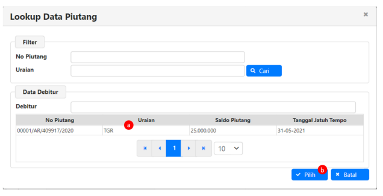
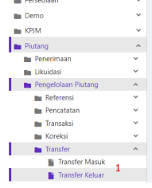
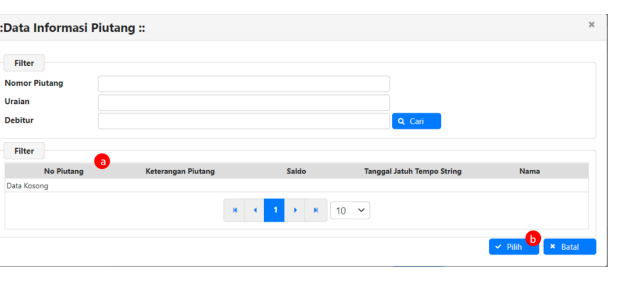

1
2020 Petunjuk Teknis Aplikasi SAKTI
Modul Persediaan Modul Piutang

 

# Daftar Isi

HALAMAN JUDUL 
DAFTAR ISI................................................................................................ **Error! Bookmark not defined.**
A. Pengertian dan Ruang Lingkup Piutang **Error! Bookmark not defined.**
1. Pengertian **Piutang** Error! Bookmark not defined.

2. Ruang Lingkup Modul **Piutang** 6 B. Keterkaitan Modul Piutang dengan Modul Lain 7 C. Menu- menu pada modul Piutang 8 1. Perekaman Referensi Debitur Piutang 8 2. Pencatatan Piutang/ Tagihan10 3. Pencatatan Pembayaran / Settlement Piutang 14 a. Settlement SBS 14 b. Settlement SSBP Non SBS 17 c. Settlement Data Pot SPM 20 d. Settlement Data Upload 23 4. Koreksi Piutang 26 5. Restrukturisasi Piutang 29 6. Surat Peringatan (SP Piutang) Error! Bookmark not defined.1 7. Penyisihan Piutang Error! Bookmark not defined.3 8. TKTM Piutang Error! Bookmark not defined.7 9. Penghapusan Piutang 41 D. Bagian Lancar Piutang 42 2

## A. Pengertian Piutang Dan Ruang Lingkup Modul Piutang 1. Pengertian Piutang

A. Piutang Piutang adalah jumlah uang yang wajib dibayar kepada Kementerian Negara/Lembaga atau Bendahara Umum Negara dan/atau hak Kementerian Negara/Lembaga atau Bendahara Umum Negara yang dapat dinilai dengan uang sebagai akibat perjanjian atau akibat lainnya berdasarkan peraturan perundang-undangan yang berlaku atau akibat lainnya yang sah.

## B. Piutang Jangka Pendek

1. Definisi Sesuai Kebijakan Akuntansi Pemerintah Pusat (PMK 219/PMK.05/2013), Piutang adalah jumlah uang yang akan diterima oleh Pemerintah dan/atau hak Pemerintah yang dapat dinilai dengan uang sebagai akibat perjanjian, kewenangan pemerintah berdasarkan peraturan perundang-undangan yang berlaku atau akibat lainnya yang sah, yang diharapkan diterima Pemerintah dalam waktu 12 (dua belas) bulan sejak tanggal pelaporan 2. Jenis-jenis Piutang Jangka Pendek a) Piutang Pajak Piutang Pajak adalah piutang yang timbul akibat adanya pendapatan pajak pusat yang diatur dalam peraturan perundang-undangan di bidang perpajakan dan peraturan perundang-undangan di bidang kepabanan dan cukai, yang belum dilunasi sampai dengan batas akhir periode pelaporan keuangan.

b) Piutang Bukan Pajak Piutang Bukan Pajak adalah piutang yang berasal dari penerimaan negara bukan pajak yang belum dilunasi sampai dengan akhir periode laporan keuangan. 

Piutang Bukan Pajak mencakup:
1. Piutang dari Penerimaan Sumber Daya Alam; 2. Piutang dari Pendapatan Laba BUMN; 3. Piutang dari Pendapatan PNBP Lainnya.

c) Bagian Lancar Tagihan Penjualan Angsuran (TPA)
Bagian Lancar TPA adalah bagian tagihan penjualan angsuran yang akan jatuh tempo dalam 12 (dua belas) setelah tanggal pelaporan keuangan.

d) Bagian Lancar Tagihan Tuntutan Perbendaharaan/Tuntuan Ganti Rugi (TP/TGR)
Bagian Lancar TP/TGR adalah bagian TP/TGR yang jatuh tempo dalam waktu 12 bulan setelah tanggal pelaporan keuangan.

e) Bagian Lancar Piutang Jangka Panjang Bagian Lancar Piutang Jangka Panjang adalah bagian piutang jangka panjang yang akan jatuh tempo dalam waktu 12 (dua belas) bulan setelah tanggal pelaporan f) Beban Dibayar di Muka/Uang Muka Belanja Beban Dibayar di Muka/Uang Muka Belanja adalah piutang yang timbul akibat Pemerintah telah melakukan pembayaran lebih dahulu tetapi barang/jasa dari pihak lain tersebut sampai pada akhir periode pelaporan belum diterima/dinikmati oleh Pemerintah g) Piutang BLU
3 Piutang BLU adalah piutang yang timbul dari kegiatan operasional dan non operasional BLU
h) Piutang Transfer ke Daerah Piutang Transfer ke Daerah adalah piutang yang timbul akibat dana Transfer ke Daerah yang dibayarkan oleh Pemerintah Pusat melebihi dari yang menjadi hak pemerintah daerah pada tahun anggaran yang bersangkutan yang akan dibayarkan kembali oleh pemerintah daerah kepada pemerintah pusat atau yang akan dikompensasi dengan penyaluran dana transfer pada tahun anggaran berikutnya

## C. Piutang Jangka Panjang

1. Definisi Piutang Jangka Panjang adalah piutang yang diharapkan/dijadwalkan akan diterima dalam jangka waktu lebih dari 12 (dua belas) bulan setelah tanggal pelaporan 2. Jenis-Jenis Piutang Jangka Panjang a) Piutang Tagihan Penjualan Angsuran (TPA)
Piutang TPA adalah piutang yang timbul karena adanya penjualan aset pemerintah secara angsuran kepada pegawai pemerintah yang mempunyai jatuh tempo lebih dari 12 (dua belas) setelah tanggal pelaporan.

b) Tagihan Tuntutan Perbendaharaan/Tuntutan Ganti Rugi (TP/TGR)
Tagihan tuntutan perbendaharaan merupakan suatu proses penagihan yang dilakukan terhadap bendahara dengan tujuan untuk menuntut penggantian atas suatu kerugian yang diderita oleh negara sebagai akibat langsung ataupun tidak langsung dari suatu perbuatan melanggar hukum yang dilakukan oleh bendahara tersebut atau kelalaian dalam pelaksanaan tugas kewajibannya. Tagihan tuntutan ganti rugi merupakan suatu proses penagihan yang dilakukan terhadap bukan bendahara dengan tujuan untuk menuntut penggantian atas suatu kerugian yang diderita oleh negara sebagai akibat langsung ataupun tidak langsung dari suatu perbuatan melanggar hukum yang dilakukan oleh bendahara tersebut atau kelalaian dalam pelaksanaan tugas kewajibannya c) Piutang Jangka Panjang Penerusan Pinjaman Piutang Penerusan Pinjaman adalah aset yang dimiliki Pemerintah sehubungan dengan adanya penerusan pinjaman yang berasal dari pinjaman/hibah baik yang bersumber dari dalam dan/atau luar negeri kepada Pemda/BUMN/BUMD/penerima lainnya yang penyelesaiannya mengakibatkan aliran masuk sumber daya ekonomi Pemerintah di kemudian hari.

d) Piutang Jangka Panjang Kredit Pemerintah Piutang Jangka Panjang Kredit Pemerintah adalah aset yang dimiliki Pemerintah sehubungan dengan pemberian kredit oleh pemerintah kepada masyarakat/kelompok masyarakat yang penyelesaiannya mengakibatkan aliran masuk sumber daya ekonomi Pemerintah di kemudian hari.

e) Piutang Jangka Panjang Lainnya Piutang Jangka Panjang Lainnya adalah Piutang Jangka Panjang yang tidak dapat diklasifikasikan sebagai jenis piutang sebagaimana telah dijelaskan di atas dikategorikan sebagai Piutang Jangka Panjang Lainnya.

D. Piutang yang dikelola oleh Kementerian Negara/Lembaga selain Piutang Perpajakan meliputi:
1. Piutang PNBP Sumber Daya Alam Non Migas 2. Piutang PNBP Lainnya 3. Piutang Tagihan Penjualan Angsuran 4. Piutang Tagihan Tuntutan Perbendaharaan/Tuntutan Ganti Rugi 5. Piutang dari kegiatan Operasional BLU
6. Belanja dibayar di Muka/Uang Muka Belanja

## E. Penentuan Kualitas Piutang

1. Kualitas Piutang ditetapkan menjadi 4 (empat) golongan, yaitu kualitas lancar, kualitas kurang lancar, kualitas diragukan, dan kualitas macet. Penentuan kualitas piutang dimaksud dilakukan berdasarkan kondisi piutang pada tanggal laporan keuangan; atau umum Piutang pada tanggal laporan keuangan.

2. Penentuan Kualitas Piutang yang dikelola Kementerian Negara/Lembaga tidak termasuk piutang perpajakank dilakukan dengan ketentuan:
a) Kualitas lancar apabila belum dilakukan pelulnasan sampai dengan tanggal jatuh tempo yang ditetapkan; b) Kualitas kurang lancar apabila dalam jangka waktu 1 (satu) bulan terhitung sejak tanggal Surat Tagihan Pertama tidak dilakukan pelunasan c) Kualitas diragukan apabila dalam jangka waktu 1 (satu) bulan terhitung sejak tanggal Surat Tagihan Kedua tidak dilakukan pelunasan d) Kualitas macet apabila:
1. Dalam jangka waktu 1 (satu) bulan terhitung sejak tanggal Surat Tagihan Ketiga tidak dilakukan pelunasan; atau 2. Piutang telah diserahkan pengurusannya kepada Panitia Urusan Piutang Negara/Direktorat Jenderal Kekayaan Keuangan.

## F. Penyisihan Piutang Tidak Tertagih

1. Kebijakan akuntansi atas penyisihan piutang tidak tertagih Nilai piutang di neraca harus terjaga agar nilainya sama dengan nilai bersih yang dapat direalisasikan (net realizable value). Agar nilai piutang tetap menggambarkan nilai bersih yang dapat direalisasikan, maka piutang-piutang yang diperkirakan tidak tertagih perlu disisihkan dari pos piutang. Metode untuk menghitung piutang yang tidak tertagih adalah metode pencadangan/penyisihan piutang tidak tertagih (allowance method). Metodi ini mengestimasi besarnya piutang-piutang yang tidak akan tertagih dan kemudian mencatat dan menyajikan nilai estimasi tersebut sebagai penyisihan piutang tidak tertagih, yang akan mengurangi nilai piutang bruto. Beban yang timbul atas pembentukan penyisihan piutang tidak tertagih tersebut pada akhir periode pelaporan dicatat sebagai beban penyisihan piutang tidak tertagih dan disajikan di Laporan Operasional. Penyisihan piutang tidak tertagih dibentuk berdasarkan kualitas/umur piutang. Penyisihan piutang tidak tertagih tidak dilakukan untuk jenis piutang berupa Uang Muka Belanja/Beban Dibayar di Muka dan piutang yang penyelesaiannya dilakukan melalui metode kompensasi dengan pembayaran belanja/transfer pada periode berikutny, seperti piutang kelebihan transfer ke daerah.

2. Kementerian Negara/Lembaga wajib melakukan Penyisihan Piutang Tidak Tertagih berdasarkan prinsip kehati-hatian. Dalam rangka melaksanakan prinsip kehatihatian tersebut, Kementerian Negara/Lembaga wajib menilai dan menentukan kualitas piutang yang dikelola Kementerian Negara/Lembaga yang dipimpinnya. 

Penilaian kualitas piutang dilakukan dengan mempertimbangkan sekurangkurangnya atas jatuh tempo piutang dan upaya penagihan. 

5

## 

3. Penyisihan Piutang pada Kementerian Negara/Lembaga ditetapkan sebesar:
a. 5 ‰ (lima permil) dari piutang yang memiliki kualitas lancar; b. 10% (sepuluh persen) dari Piutang dengan kualitas kurang lancar setelah dikurangi dengan nilai agunan atau nilai barang sitaan c. 50% (lima puluh persen) dari piutang dengan kualitas diragukan setelah dikurangi dengan nilai agunan atau nilai barang sitaan d. 100% (seratus persen) dari piutang dengan kualitas macet setelah dikurangi dengan nilai agunan atau nilai barang sitaan.

## 2. Ruang Lingkup Modul Piutang

Piutang yang dicatat dalam modul Piutang adalah sebagai berikut:
1. Piutang PNBP Sumber Daya Alam Non Migas 2. Piutang PNBP Lainnya 3. Piutang Tagihan Penjualan Angsuran 4. Piutang Tagihan Tuntutan Perbendaharaan/Tuntutan Ganti Rugi 6

# B. Keterkaitan Modul Piutang Dengan Modul Lain

1. Keterkaitan Modul Piutang dengan Modul Admin Kaitan dengan modul admin adalah memberikan informasi terkait referensi akun piutang maupun pendapatan yang digunakan dalam pencatatan piutang pada modul piutang.

2. Keterkaitan Modul Piutang dengan Modul Pembayaran Salah satu cara pembayaran/pelunasan piutang pada Modul Piutang adalah dengan melakukan settlement via potongan SPM. Pada menu ini modul pembayaran memberikan informasi potongan SPM akun PNBP 42XXXX yang telah menjadi SP2D pada satker bersangkutan.

Saat data potongan SPM sudah dilakukan settlement, maka akun yang digunakan untuk settlement tadi tidak bisa diubah sehingga harus melakukan penghapusan transaksi settlement terlebih dahulu sebelum melakukan perubahan/koreksi data potongan SPM tersebut.

## 3. Keterkaitan Modul Piutang Dengan Modul Bendahara

Keterkaitan dengan modul bendahara juga terjadi pada transaksi settlement, yaitu settlement via data upload yang berasal dari pencatatan upload data simponi pada modul bendahara, settlement SBS yang berasal dari pencatatan uang masuk oleh bendahara dan settlement SSBP non SBS yang berasal dari pencatatan SSBP pada modul bendahara.

Semua pencatatan tersebut dapat diambil datanya oleh modul piutang saat melakukan settlement. Dan apabila data tersebut telah dilakukan settlement, maka setoran yang digunakan untuk settlement tadi tidak bisa diubah sehingga harus melakukan penghapusan transaksi settlement terlebih dahulu sebelum melakukan perubahan/koreksi data setoran tersebut.

## 4. Keterkaitan Modul Piutang Dengan Modul Glp

Keterkaitan dengan modul GLP adalah modul piutang mengirimkan informasi transaksi untuk terbentuk jurnal pada transaksi- transaksi yang terjadi pada modul piutang sehingga penambahan maupun pengurangan piutang maupun penyisihan piutang tidak perlu dicatat menggunakan jurnal manual.

7

## C. Menu- Menu Pada Modul Piutang

Transaksi Perekaman Referensi Debitur Piutang

| No.   | Uraian                  |                                                                        |
|-------|-------------------------|------------------------------------------------------------------------|
| 1     | Modul                   | ARE                                                                    |
| 2     | Role User               | OPR                                                                    |
| 3     | Modul Lain yang Terkait | -                                                                      |
| 4     | Transaksi yang Tekait   | -                                                                      |
| 5     | Dokumen Input           | Data debitur                                                           |
| 6     | Output                  | Daftar referensi debitur                                               |
| 7     | Validasi                | - Nama wajib diisi - Nomor Telepon/HP wajib diisi - Alamat wajib diisi |

## 1. Perekaman Referensi Debitur Piutang

Sub menu Transaksi Perekaman Referensi Debitur Piutang ini adalah sub menu yang digunakan untuk merekam data referensi debitur piutang. 

1. Langkah yang dilakukan adalah dengan memilih menu **Piutang >> Pengelolaan Piutang >>** 
Referensi >> Debitur 8

 

9

3. Isikan Nama Debitur 4. Isikan NPWP Debitur 5. Isikan Nomor Identitas Debitur, bisa berupa NIK untuk Perorangan atau Nomor Akta Perusahaan untuk debitur Perusahaan atau nomor identitas lain yang sah 6. Isikan Nomor telepon Debitur (bila ada) 7. Isikan Nomor Handphone Debitur 8. Isikan Alamat Debitur 9. Isikan Provinsi sesuai dengan alamat yang ada 10. Isikan Kabupaten sesuai dengan alamat yang ada 11. Isikan Kecamatan sesuai dengan alamat yang ada 12. Isikan Kode Pos sesuai dengan alamat yang ada 13. Isikan Email Debitur (bila ada)
14. Isikan Website Debitur (bila ada)
15. Simpan

Pencatatan Piutang/ Tagihan

| Tagihan   |                         |                                                                                                                                                                       |
|-----------|-------------------------|-----------------------------------------------------------------------------------------------------------------------------------------------------------------------|
| No.       | Uraian                  |                                                                                                                                                                       |
| 1         | Modul                   | ARE                                                                                                                                                                   |
| 2         | Role User               | OPR                                                                                                                                                                   |
| 3         | Modul Lain yang Terkait | GLP                                                                                                                                                                   |
| 4         | Transaksi yang Tekait   | -                                                                                                                                                                     |
| 5         | Dokumen Input           | SK Penetapan Piutang, Surat Penagihan Piutang                                                                                                                         |
| 6         | Output                  | Laporan- laporan Piutang                                                                                                                                              |
| 7         | Validasi                | - Tanggal buku harus lebih dari sama dengan  tanggal mulai dan tanggal SK - Piutang baru dan Piutang dari hapus buku  memilik tanggal SK pada periode tahun  berjalan |

## 2. Pencatatan Piutang/ Tagihan

Sub menu Transaksi Pencatatan Piutang/Tagihan ini adalah sub menu yang digunakan untuk merekam data yang bersumber dari piutang baru, saldo awal piutang, dan piutang dari hapus buku.

## 1. Piutang Baru

Digunakan untuk mencatat piutang yang baru ditetapkan pada periode berjalan 2. Saldo awal piutang Digunakan untuk mencatat piutang tahun-tahun sebelumnya yang belum dicatat di aplikasi SAKTI. Menu ini juga yang digunakan untuk pencatatan data piutang saat pertama kali menggunakan aplikasi SAKTI.

## 3. Piutang Dari Hapus Buku

Digunakan untuk mencatat piutang yang setelah dihapusbukukan terjadi pembayaran oleh debitur atas piutang tersebut MODUL PIUTANG

| m  Administrasi     |    |
|---------------------|----|
| - Aset Tetap        |    |
| - Bendahara         | >  |
| - GL dan Pelaporan  | <  |
| - Komitmen          | >  |
| Pembayaran          | >  |
| s                   |    |
| Penganggaran        |    |
| - Persediaan        |    |
| Demo                | <  |
| KPJM                |    |
| Piutang             | ^  |
| - Penerimaan        | -  |
| Likuidasi           | v  |
| Pengelolaan Piutang | >  |
|                     |    |
| Referensi           |    |
| Pencatatan          | <  |
| Pencatatan          | 1  |
| Piutang/Tagihan     |    |

1. Langkah yang dilakukan adalah dengan memilih menu Piutang >> Pengelolaan Piutang
> Pencatatan >> Pencatatan Piutang/Tagihan Form detil perekaman akan tampil seperti gambar dibawah Klik tombol Rekam untuk mengisikan data detail perekaman piutang 2.

 
3. Isikan sumber pencatatan piutang dengan pilihan sebagai berikut:

- Piutang Baru Saat memilih Sumber pencatatan dengan piutang baru, isian kualitas piutang terisi Lancar dan tidak dapat diubah, isian nilai penyisihan kosong dan tidak dapat diubah

## - Saldo Awal Piutang

Saat memilih Sumber pencatatan piutang dengan Saldo awal piutang, isian kualitas piutang dapat diubah, dan isian nilai penyisihan kosong wajib diisi
- Piutang dari Hapus Buku Saat memilih Sumber pencatatan piutang dengan Piutang dari hapus buku, isian kualitas piutang dapat diubah, dan isian nilai penyisihan kosong wajib diisi 4. Pilih debitur piutang dengan klik tombol lookup pada Identitas, debitur yang muncul adalah semua debitur piutang yang terdapat pada aplikasi SAKTI baik yang direkam oleh satker bersangkutan maupun satker lain 5. Isikan tanggal mulai dan tanggal jatuh tempo piutang sesuai yang ditetapkan dalam Dokumen sumber 6. Isikan Jenis Piutang dengan pilihan Perorangan dan Coorporate (untuk perusahaan)
7. Isikan Nilai piutang sesuai yang telah ditetapkan dan isian keterangan piutang bisa diisi dengan penjelasan atas piutang apabila diperlukan, apabila tidak ada maka cukup disii dengan tanda "-"
8. Isikan informasi agunan berupa nilai agunan, keterangan agunan, nilai agunan yang diperhitungakan serta bentuk agunan bila ada 9. Isikan akun pendapatan atas piutang yang ditagihkan 10. Isikan tanggal pembukuan pada periode yang masih terbuka 11. Isikan Nomor dan tanggal Surat penagihan bila ada atau bisa dikosongkan apabila tidak ada 12 12. Isikan Nomor dan tanggal Dokumen sesuai dengan dokumen sumber penetapan piutang bisa berupa SK atau surat penetapan lainnya 13. Klik Simpan untuk menyimpan data perekaman yang sudah diisi Untuk perekaman saldo awal piutang:
a. Isikan Kwalitas piutang dengan pilihan: Lancar, Kurang Lancar, Ragu-ragu, dan macet b. Isikan nilai penyisihan sesuai saldo penyisihan pada periode pelaporan sebelumnya Untuk perekaman piutang dari hapus buku:
c. Isikan No. Piutang Lama sesuai data piutang yang sudah dihapusbukukan

## Catatan:

Apabila terdapat kesalahan perekaman, menu ubah dan hapus masih bisa digunakan apabila belum tutup buku atau belum ada transaksi lanjutan, sedangkan apabila sudah tutup buku atau ada transaksi lanjutan perbaikannya melalui menu koreksi

# Pencatatan Pembayaran/ Settlement Piutang

| Settlement Piutang   |                                           |                                                                                                                                                                   |
|----------------------|-------------------------------------------|-------------------------------------------------------------------------------------------------------------------------------------------------------------------|
| No.                  | Uraian                                    |                                                                                                                                                                   |
| 1                    | Modul                                     | ARE                                                                                                                                                               |
| 2                    | Role User                                 | OPR                                                                                                                                                               |
| 3                    | Modul Lain yang Terkait                   | GLP                                                                                                                                                               |
| 4                    | Transaksi yang Tekait                     | -                                                                                                                                                                 |
| 5                    | Dokumen Input                             | Potongan SPM, SSBP, Billing, SBS                                                                                                                                  |
| 6                    | Output                                    | Laporan- laporan Piutang                                                                                                                                          |
| 7                    | Validasi                                  | - Tanggal buku harus lebih dari sama dengan  tanggal setoran - Jumlah Settlement harus lebih kecil sama  dengan saldo piutang dan saldo sisa  matching setorannya |
| 3.                   | Pencatatan Pembayaran/ Settlement Piutang |                                                                                                                                                                   |

Sub menu Transaksi Pembayaran / Settlement Piutang ini adalah sub menu yang digunakan untuk mencatat transaksi pembayaran/pelunasan piutang dengan mengambil data dari 4 sumber data setoran sebagai berikut:

## - Settlement Sbs

Pencatatan ini dilakukan atas setoran pembayaran piutang melalui bendahara satuan kerja yang sudah dicatat pada modul bendahara pada menu mencatat uang masuk bendahara.

1. Langkah yang dilakukan adalah dengan memilih menu **Piutang >> Pengelolaan Piutang** 

>> Transaksi **>> Settlement SBS**

14 MODUL PIUTANG

## 2. Klik Rekam

3. Selanjutnya pilih Identitas Debitur dengan mengklik lihat sehingga tampil data seperti di bawah ini

a.   Pilih data debitur yang membayar piutang b. Klik pilih 4.  Selanjutnya pilih Nomor Piutang dengan mengklik lihat sehingga tampil data seperti di bawah ini MODUL PIUTANG

a.

Pilih Nomor piutang yang dibayar cicilan atau pelunasannya b. Klik pilih 5. Isikan tanggal settlement sesuai dengan tanggal buku pembayaran piutang 6. Ambil data SBS yang digunakan dalam pembayaran piutang dengan klik tombol lihat sehingga tampil data seperti di bawah ini

Pilih data SBS yang digunakan untuk pembayaran atas piutang yang sudah dipilih a.

b. Klik pilih 7. Isikan jumlah pembayaran piutang 8. Isikan uraian keterangan sebagai tambahan informasi yang diperlukan 16 MODUL PIUTANG
9. Simpan
.

## Settlement Ssbp Non Sbs

Pencatatan ini dilakukan atas setoran pembayaran piutang yang dicatat pada modul bendahara pada menu Setoran UP/TUP/PNBP Bendahara.

1. Langkah yang dilakukan adalah dengan memilih menu Piutang >> Pengelolaan Piutang
> Transaksi >> Settlement via potongan SPM dan data upload

| - Komitmen                |        |    |
|---------------------------|--------|----|
| Pembayaran                |        |    |
| Penganggaran              |        |    |
| Persediaan                |        |    |
| Demo                      |        |    |
| KPJM                      | <      |    |
| Piutang                   | >      |    |
| n Penerimaan              |        |    |
| Likuidasi                 |        |    |
| Pengelolaan Piutang       |        |    |
| - Referensi               |        |    |
| Pencatatan                |        |    |
| Transaks                  |        |    |
| Settlement SBS            |        |    |
| Settlement S              | BP Non | 1  |
| i Settlement via Potongan |        |    |

 

18

2. Klik Rekam
3. Selanjutnya pilih Identitas Debitur dengan mengklik lihat sehingga tampil data seperti di bawah ini

a. Pilih data debitur yang membayar piutang b. Klik pilih

19

4. Selanjutnya pilih Nomor Piutang dengan mengklik lihat sehingga tampil data seperti di bawah ini
a. Pilih Nomor piutang yang dibayar cicilan atau pelunasannya b. Klik pilih 5. Isikan tanggal settlement sesuai dengan tanggal buku pembayaran piutang 6. Ambil data SSBP yang digunakan dalam pembayaran piutang dengan klik tombol lihat sehingga tampil data seperti di bawah ini

a. Pilih data SSBP yang digunakan untuk pembayaran atas piutang yang sudah dipilih sebelumnya b. Klik pilih 7. Isikan jumlah pembayaran piutang 8. Isikan uraian keterangan sebagai tambahan informasi yang diperlukan 9. Simpan

## - Settlement Via Potongan Spm

Pencatatan ini dilakukan atas potongan SPM yang digunakan sebagai pembayaran piutang yang dicatat pada modul pembayaran sampai dengan menjadi SP2D.

1. Langkah yang dilakukan adalah dengan memilih menu **Piutang >> Pengelolaan Piutang** 

>> Transaksi **>> Settlement via Potongan SPM dan data upload**

20 a. Pilih data debitur yang membayar piutang b. Klik pilih 4. Selanjutnya pilih Nomor Piutang dengan mengklik lihat sehingga tampil data seperti 

di bawah ini

21

3. Selanjutnya pilih Identitas Debitur dengan mengklik lihat sehingga tampil data seperti di bawah ini
a. Pilih Nomor piutang yang dibayar cicilan atau pelunasannya b. Klik pilih 5. Isikan tanggal settlement sesuai dengan tanggal buku pembayaran piutang 6. Klik pada tombol via pot. SPM pada pilihan Sumber Data Settlement

22

7. Ambil data Pot. SPM yang digunakan dalam pembayaran piutang dengan klik tombol lihat sehingga tampil data seperti di bawah ini
a. Pilih data Pot. SPM yang digunakan untuk pembayaran atas piutang yang sudah dipilih sebelumnya b. Klik pilih 8. Isikan jumlah pembayaran piutang 9. Isikan uraian keterangan sebagai tambahan informasi yang diperlukan 10. Simpan

 

## - Settlement Via Data Upload

Pencatatan ini dilakukan atas setoran pembayaran piutang melalui bendahara satuan kerja yang dicatat pada modul bendahara pada menu upload data dari simponi 1. Langkah yang dilakukan adalah dengan memilih menu Piutang >> Pengelolaan **Piutang** 
>> Transaksi **>> Settlement via Potongan SPM dan data upload**

2. Klik Rekam

a. Pilih data debitur yang membayar piutang b. Klik pilih 4. Selanjutnya pilih Nomor Piutang dengan mengklik lihat sehingga tampil data seperti di bawah ini

24

3. Selanjutnya pilih Identitas Debitur dengan mengklik lihat sehingga tampil data seperti di bawah ini
a. Pilih Nomor piutang yang dibayar cicilan atau pelunasannya b. Klik pilih 5. Isikan tanggal settlement sesuai dengan tanggal buku pembayaran piutang 6. Klik pada tombol via data hasil upload pada pilihan Sumber Data Settlement

25

7. Ambil data upload yang digunakan dalam pembayaran piutang dengan klik tombol lihat sehingga tampil data seperti di bawah ini
a. Pilih data hasil upload yang digunakan untuk pembayaran atas piutang yang sudah dipilih sebelumnya b. Klik pilih 8. Isikan jumlah pembayaran piutang 9. Isikan uraian keterangan sebagai tambahan informasi yang diperlukan 10. Simpan Catatan: Untuk melakukan settlement harus terlebih dahulu data setoran sudah dicatat oleh modul bendahara atau pembayaran, 1 setoran dapat digunakan untuk settlement beberapa debitur maupun id piutang dengan total tidak boleh lebih dari nilai setorannya

| Koreksi Piutang   |                         |                          |                                                                                                            |
|-------------------|-------------------------|--------------------------|------------------------------------------------------------------------------------------------------------|
| No.               | Uraian                  |                          |                                                                                                            |
| 1                 | Modul                   | ARE                      |                                                                                                            |
| 2                 | Role User               | OPR                      |                                                                                                            |
| 3                 | Modul Lain yang Terkait | GLP                      |                                                                                                            |
| 4                 | Transaksi yang Tekait   | -                        |                                                                                                            |
| 5                 | Dokumen Input           | Dokumen Koreksi Piutang  |                                                                                                            |
| 6                 | Output                  | Laporan- laporan Piutang |                                                                                                            |
| 7                 | Validasi                | -                        | Koreksi hanya bisa digunakan untuk data  yang sudah dilakukan tutup buku atau  terdapat transaksi lanjutan |

## 4. Koreksi Piutang

Sub menu Transaksi Koreksi Piutang ini adalah sub menu yang digunakan untuk melakukan pencatatan perbaikan atas kesalahan pencatatan piutang yang telah tutup buku atau sudah ada transaksi lanjutannya. Sub menu ini juga bisa digunakan untuk melakukan koreksi nilai piutang atas adanya pembayaran tahun sebelumnya yang belum dilakukan settle piutang.

1. Langkah yang dilakukan adalah dengan memilih menu **Piutang >> Pengelolaan Piutang >>** 
Koreksi **>> Koreksi Piutang**

 

3. Selanjutnya pilih Pilih No Piutang dengan mengklik tombol look up sehingga tampil data seperti di bawah ini (setelah data piutang dipilih maka kolom informasi piutang terisi secara otomatis)

a. Pilih data piutang yang dilakukan koreksi b. Klik pilih 4. Isikan tanggal koreksi piutang 5. Isikan uraian keterangan sebagai tambahan informasi yang diperlukan 6. Isikan Nomor Dokumen sesuai dengan nomor dokumen koreksi yang ada 7. Berikan centang pada Kualitas Piutang hanya apabila koreksi piutang yang akan dilakukan hanya untuk mengubah kualitas piutangnya 8. Pilih Jenis Koreksi yang akan dilakukan apakah **Normal** untuk melakukan koreksi biasa pada piutang atau **Selisih Kurs** untuk koreksi akibat perubahan kurs pada piutang valas 27

 
9. Isikan nilai koreksi piutang yang benar sehingga pada kolom Nilai Jurnal otomatis terisi nilai perubahannya 10. Koreksi terhadap status piutang hanya bisa dilakukan atas kesalahan pencatatan saldo awal piutang 11. Koreksi nilai penyisihan piutang hanya bisa dilakukan atas kesalahan pencatatan saldo awal piutang 12. Simpan 28

| Restrukturisasi Piutang   |                                                         |                          |                                                                    |
|---------------------------|---------------------------------------------------------|--------------------------|--------------------------------------------------------------------|
| No.                       | Uraian                                                  |                          |                                                                    |
| 1                         | Modul                                                   | ARE                      |                                                                    |
| 2                         | Role User                                               | OPR                      |                                                                    |
| 3                         | Modul Lain yang Terkait                                 | GLP                      |                                                                    |
| 4                         | Transaksi yang Tekait                                   | -                        |                                                                    |
| 5                         | Dokumen Input                                           | Dokumen Reklas Piutang   |                                                                    |
| 6                         | Output                                                  | Laporan- laporan Piutang |                                                                    |
| 7                         | Validasi                                                | -                        | Piutang Macet dapat direklas menjadi  Ragu-Ragu atau Kurang Lancar |
| -                         | Piutang Ragu-Ragu dapat direklas menjadi  Kurang Lancar |                          |                                                                    |

## 5. Restrukturisasi Piutang

Sub menu Transaksi Restrukturisasi Piutang ini adalah sub menu yang digunakan untuk melakukan pencatatan perubahan kualitas Piutang sesuai dengan dokumen penetapan restrukturisasi piutang.

1. Langkah yang dilakukan adalah dengan memilih menu Piutang >> Pengelolaan Piutang >> 
Transaksi **>> Restrukturisasi Piutang**

29

 

3. Selanjutnya pilih Pilih No Piutang dengan mengklik tombol look up sehingga tampil data seperti di bawah ini (setelah data piutang dipilih maka kolom informasi piutang terisi secara otomatis)

a. Pilih data piutang yang dilakukan restrukturisasi b. Klik pilih 4. Isikan tanggal restrukturisasi piutang 5. Isikan uraian keterangan sebagai tambahan informasi yang diperlukan 6. Isikan perubahan Kualitas piutang 7. Isikan Nomor Dokumen sesuai dengan nomor dokumen restrukturisasi yang ada 8. Simpan Surat Peringatan

## (Sp Piutang)

| No.   | Uraian                    |                          |                                           |
|-------|---------------------------|--------------------------|-------------------------------------------|
| 1     | Modul                     | ARE                      |                                           |
| 2     | Role User                 | OPR                      |                                           |
| 3     | Modul Lain yang Terkait   | GLP                      |                                           |
| 4     | Transaksi yang Tekait     | -                        |                                           |
| 5     | Dokumen Input             | Surat Peringatan Piutang |                                           |
| 6     | Output                    | Laporan- laporan Piutang |                                           |
| 7     | Validasi                  | -                        | SP1 > 30 hari setelah tanggal jatuh tempo |
| -     | SP2 > 30 hari setelah SP1 |                          |                                           |
| -     | SP3 > 30 hari setelah SP2 |                          |                                           |

## 6. Surat Peringatan (Sp Piutang)

Sub menu Transaksi Surat Peringatan ini adalah sub menu yang digunakan untuk melakukan pencatatan transaksi atas surat peringatan yang diterbitkan satker kepada debitur piutang yang selanjutnya dapat mempengaruhi kualitas piutang saat proses penyisihan semesteran.

1. Langkah yang dilakukan adalah dengan memilih menu **Piutang >> Pengelolaan Piutang >>** 
Transaksi **>> Surat Peringatan (SP)**

31

 

3. Selanjutnya pilih SP ke berapa sesuai dengan dokumen surat peringatan yang dibuat dengan pilihan SP 1, SP2, dan SP3 4. Selanjutnya pilih Pilih No Piutang dengan mengklik tombol look up sehingga tampil data seperti di bawah ini (setelah data piutang dipilih maka kolom informasi piutang terisi secara otomatis)

a. Pilih data piutang yang dilakukan restrukturisasi b. Klik pilih 5. Isikan tanggal SP piutang 6. Isikan uraian keterangan sebagai tambahan informasi yang diperlukan 7. Simpan

| Penyisihan Piutang 1 Modul   | ARE                     |                                                         |
|------------------------------|-------------------------|---------------------------------------------------------|
| 2                            | Role User               | OPR                                                     |
| 3                            | Modul Lain yang Terkait | GLP                                                     |
| 4                            | Transaksi yang Tekait   | -                                                       |
| 5                            | Dokumen Input           | Data Piutang                                            |
| 6                            | Output                  | Laporan- laporan Piutang                                |
| 7                            | Validasi                | - Harus sudah tutup buku pada bulan sebelum  penyisihan |

## 7. Penyisihan Piutang

Sub menu Transaksi Penyisihan Piutang ini adalah sub menu yang digunakan untuk melakukan transaksi penyisihan piutang setiap semesteran dengan terlebih dahulu menutup buku piutang sampai dengan sebelum bulan dilakukan penyisihan (penyisihan semester I minimal harus sudah tutup buku bulan 5, sedangkan penyisihan semester II minimal harus sudah tutup buku bulan 11).

1. Langkah yang dilakukan adalah dengan memilih menu Piutang >> Pengelolaan Piutang >> 
Transaksi **>> Penyisihan Piutang**

33

 

## 2. Klik Sisihkan

3. Setelah itu maka muncul parameter penyisihan piutang dengan tanggal yang sudah otomatis terisi sesuai dengan periode penyisihan terdekat dengan tutup buku terakhir

4. Klik Proses 5. Maka penyisihan terbentuk per akun piutang, untuk melihat secara detail silahkan klik pada salah satu penyisihan piutang yang sudah ada 6. Data detail penyisihan ditampilkan per nomor piutang pada kolom ini

| TKTM Piutang   |                                                                    |                          |                                                                       |
|----------------|--------------------------------------------------------------------|--------------------------|-----------------------------------------------------------------------|
| No.            | Uraian                                                             |                          |                                                                       |
| 1              | Modul                                                              | ARE                      |                                                                       |
| 2              | Role User                                                          | OPR                      |                                                                       |
| 3              | Modul Lain yang Terkait                                            | GLP                      |                                                                       |
| 4              | Transaksi yang Tekait                                              | -                        |                                                                       |
| 5              | Dokumen Input                                                      | BAST Transfer            |                                                                       |
| 6              | Output                                                             | Laporan- laporan Piutang |                                                                       |
| 7              | Validasi                                                           | -                        | Tanggal Transfer masuk harus lebih besar  sama dengan transfer keluar |
| -              | Periode semester Transfer masuk harus  sama dengan transfer keluar |                          |                                                                       |

## 8. Tktm Piutang A. Transfer Keluar

Sub menu Transaksi Transfer Keluar Piutang ini adalah sub menu yang digunakan untuk melakukan pencatatan transaksi transfer keluar piutang oleh satker pemberi.

1. Langkah yang dilakukan adalah dengan memilih menu **Piutang >> Pengelolaan Piutang >>** 
Transfer **>> Transfer Keluar**

35

 

3. Isikan tanggal transfer keluar piutang 4. Isikan uraian keterangan sebagai tambahan informasi yang diperlukan 5. Pilih satker tujuan

a. Isikan kode satker tujuan b. Klik Cari c. Pilih satker yang muncul sesuai dengan yang diinginkan d. Klik Pilih 6. Isikan Nomor Dokumen sesuai dengan nomor dokumen koreksi yang ada 36 7. Selanjutnya pilih Pilih No Piutang dengan mengklik tombol look up sehing ga tampil data seperti di bawah ini (setelah data piutang dipilih maka kolom debitur dan nilai transfer piutang terisi secara otomatis)

a. Pilih data piutang yang dilakukan transfer keluar b. Klik pilih 8. Simpan

## B. Transfer Masuk Piutang

Sub menu Transaksi Transfer Masuk ini adalah sub menu yang digunakan untuk melakukan pencatatan transaksi transfer masuk piutang oleh satker penerima.

1. Langkah yang dilakukan adalah dengan memilih menu **Piutang >> Pengelolaan Piutang >>** 

Transfer >> Transfer Masuk 37

 
2. Klik Rekam

 3. Pilih data transfer yang sudah ada berdasarkan pencatatan transfer keluar yang dilakukan oleh satker pemberi (data yang dipilih bisa lebih dari satu dengan syarat tanggal transfer pada periode semester yang sama)

4. Isikan tanggal buku transfer masuk pada periode semester yang sama dengan tanggal transfer keluar 5. Klik Transfer masuk untuk menyimpan data perekaman

| Penghapusan Piutang   |                         |                                                                                                                                                                                                    |
|-----------------------|-------------------------|----------------------------------------------------------------------------------------------------------------------------------------------------------------------------------------------------|
| No.                   | Uraian                  |                                                                                                                                                                                                    |
| 1                     | Modul                   | ARE                                                                                                                                                                                                |
| 2                     | Role User               | OPR                                                                                                                                                                                                |
| 3                     | Modul Lain yang Terkait | GLP                                                                                                                                                                                                |
| 4                     | Transaksi yang Tekait   | -                                                                                                                                                                                                  |
| 5                     | Dokumen Input           | Dokumen Penghapusan Piutang                                                                                                                                                                        |
| 6                     | Output                  | Laporan- laporan Piutang                                                                                                                                                                           |
| 7                     | Validasi                | - Piutang yang bisa dihapus buku adalah  piutang yang memiliki kualitas macet atau  sudah mendapatkan SP3 selama 30 hari - Piutang yang bisa dihapus tagih adalah  piutang yang sudah dihapus buku |
| 9.                    | Penghapusan Piutang     |                                                                                                                                                                                                    |

Sub menu Transaksi Penghapusan Piutang ini adalah sub menu yang digunakan untuk melakukan transaksi penghapusan piutang yang terdiri dari hapus buku dan hapus tagih.

1. Langkah yang dilakukan adalah dengan memilih menu **Piutang >> Pengelolaan Piutang >>** 
Transaksi >> Penghapusan Piutang

 

3. Selanjutnya pilih status hapus buku 4. Selanjutnya pilih No Piutang dengan mengklik tombol look up sehingga tampil data seperti di bawah ini (apabila status hapus yang dipilih adalah hapus buku maka data yang muncul adalah data piutang yang memiliki kualitas macet dan data piutang yang telah mendapatkan SP3 lebih dari 30 hari sedangkan bila yang dipilih hapus tagih maka dat a yang muncul adalah data piutang yang sudah dihapusbukukan)

a. Pilih data piutang yang dilakukan penghapusan b. Klik pilih 5. Isikan tanggal penghapusan piutang 6. Isikan uraian keterangan sebagai tambahan informasi yang diperlukan 7. Isikan Nomor Dokumen sesuai dengan nomor dokumen penghapusan yang ada 8. Simpan 40

## 10. Penyerahan Piutang Ke Djkn/Pupn

Sub Menu Pelimpahan Piutang ke DJKN ini digunakan untuk mencatat piutang yang diserahkan ke DJKN dengan syarat piutang tersebut harus memiliki kualitas macet. Saat piutang direkam pada menu ini, piutang macet yang ada *settlement*-nya saat disisihkan akan tetap macet.

1. Langkah yang dilakukan adalah dengan memilih menu **Piutang >> Pengelolaan Piutang** 
>> Transaksi >> Pelimpahan Piutang ke DJKN/PUPN

2. Klik Rekam

3. Selanjutnya pilih Pilih No Piutang dengan mengklik tombol look up sehingga tampil data seperti di bawah ini (setelah data piutang dipilih maka kolom informasi piutang terisi secara otomatis)
41

 
b. Klik pilih 4. Isikan tanggal pelimpahan piutang 5. Isikan uraian keterangan sebagai tambahan informasi yang diperlukan 6. Isikan Nomor Dokumen sesuai dengan nomor dokumen pelimpahan piutang yang ada 7. Simpan

## D. Bagian Lancar Piutang

42

a. Pilih data piutang yang dilakukan pelimpahan Pencatatan saldo bagian lancar piutang tidak disediakan dalam modul piutang, sehingga harus dicatat melalui jurnal pada modul GLP sesuai dengan perhitungan yang sudah dilakukan.

Misal, Piutang TGR memiliki kualitas Lancar sebesar Rp 50.000.000 sudah dicatat pada modul piutang, maka otomatis sudah terbentuk nilai saldo sebagai berikut:
Saldo Piutang TGR (D) Rp 50.000.000 Saldo Beban Penyisihan Piutang Tak Tertagih - TGR (D) Rp 250.000 Saldo Penyisihan Piutang Tak Tertagih - TGR (K) Rp 250.000 Ditentukan bahwa bagian lancarnya adalah Rp 10.000.000

| SAKTI MODUL PIUTANG                                                         |               |
|-----------------------------------------------------------------------------|---------------|
| Maka, harus dilakukan jurnal sebagai berikut: (D) Bagian Lancar Tagihan TGR | Rp 10.000.000 |
| (K) Piutang TGR                                                             | Rp 10.000.000 |
| (D) Beban Penyisihan Piutang Tak Tertagih - Bagian Lancar TGR               | Rp 50.000     |
| (K) Beban Penyisihan Piutang Tak Tertagih –TGR                              | Rp 50.000     |
| (D) Penyisihan Piutang Tak Tertagih - TGR                                   | Rp 50.000     |
| (K) Penyisihan Piutang Tak Tertagih - Bagian Lancar TGR                     | Rp 50.000     |

43 KEMENTERIAN KEUANGAN RI

DITJEN PERBENDAHARAAN