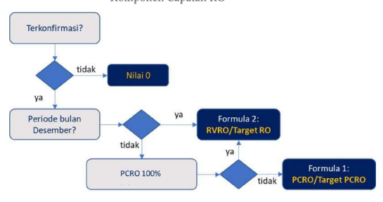
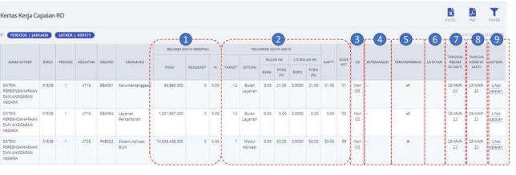
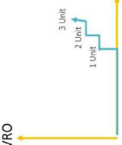

SATKER
Ver. 1.0

Tahun 2022 KEMENTERIAN KEUANGAN RI 
DITJEN PERBENDAHARAAN

DESKRIPSI SINGKAT

| No.                |                         |                                          |
|--------------------|-------------------------|------------------------------------------|
| 1                  | Modul                   | KOM                                      |
| 2                  | Role User               | OR                                       |
| 3                  | Modul Lain yang Terkait | KM, PEM, ANG                             |
| 4                  | Transaksi yang Tekait   | KOM - Perekaman Capaian Output           |
| PM - Realisasi     |                         |                                          |
| SP2D               |                         |                                          |
| ANG - Data Pagu,   |                         |                                          |
| Volume, dan Target |                         |                                          |
| RO                 |                         |                                          |
| 5                  | Dokumen Input           | Data Realisasi Kinerja Satker/Capaian RO |
| 6                  | Output                  | Data Kumulatif                           |
| Realisasi Kinerja  |                         |                                          |
| Satker dan Cetakan |                         |                                          |

Perekaman Data Realisasi Kinerja Satker Pentunjuk Teknis ini digunakan sebagai panduan untuk mengisi/merekam Data Realisasi Kinerja (Capaian Output) Satker i

| Daftar Isi                                                                                                 |                                                                     |
|------------------------------------------------------------------------------------------------------------|---------------------------------------------------------------------|
| DESKRIPSI SINGKAT                                                                                          |                                                                     |
| FREQUENTLY ASKED QUESTION (FAQ).                                                                           |                                                                     |
| LANDASAN REGULASI                                                                                          |                                                                     |
| -                                                                                                          |                                                                     |
| =                                                                                                          | RUANG LINGKUP                                                       |
| KEWENANGAN PEREKAMAN DATA DAN PELAPORAN                                                                    |                                                                     |
| I.                                                                                                         |                                                                     |
| IV.                                                                                                        | DAFTAR ISTILAH .                                                    |
| proses bisnis pengisian, pelaporan , dan konfirmasi data capaian output                                    |                                                                     |
| V.                                                                                                         |                                                                     |
| VI.                                                                                                        | PENGISIAN DATA CAPAIAN OUTPUT PADA APLIKASI SAKTI.                  |
| 1.  Periode Pengisian dan Kirim Data Capaian Output                                                        |                                                                     |
| 2. Jadwal Posting Data Capaian Output.                                                                     |                                                                     |
| 3.  Periode Pelaporan Data Capaian Output Tahun 2022 .                                                     |                                                                     |
| 4.  Otomasi Pengisian Data Rincian Output Dukungan Manajemen - Output 1 Layanan……………………………………………………………………… |                                                                     |
| 5.  Mekanisme Pengisian dan Koreksi/Penyesuaian Data .                                                     |                                                                     |
| 6. Penilaian IKPA Capaian Output .                                                                         |                                                                     |
| VII.                                                                                                       | PENGUKURAN DATA CAPAIAN OUTPUT .                                    |
|                                                                                                            |                                                                     |
|                                                                                                            |                                                                     |
| 3.  Referensi  Keterangan                                                                                  |                                                                     |
| 4. Kriteria pengisian keterangan yang memadai.                                                             |                                                                     |
| 5.  Validasi pada Aplikasi Sakti - Validasi By System.                                                     |                                                                     |
| 6.  Validasi pada Aplikasi OMSPAN                                                                          |                                                                     |
| VIII.                                                                                                      | PETUNJUK PENGISIAN DATA CAPAIAN OUTPUT SATKER K/L– APLIKASI SAKTI . |
| MONITORING DATA CAPAIAN OUTPUT APLIKASI OMSPAN - LEVEL SATKER …                                            |                                                                     |
| I.                                                                                                         |                                                                     |
| x.                                                                                                         | MONITORING DATA CAPAIAN OUTPUT APLIKASI OMSPAN - LEVEL ESELON I     |
| MONITORING DATA CAPAIAN OUTPUT APLIKASI OMSPAN - LEVEL K/L                                                 |                                                                     |
| XI.                                                                                                        |                                                                     |
| BOX 1: Metode Pengukuran Data Capaian Output .                                                             |                                                                     |
| BOX 2:  Contoh Perhitungan dan Perekaman Capaian Output…                                                   |                                                                     |
| XII.                                                                                                       | CONTOH SURAT .                                                      |

i

## Frequently Asked Question (Faq)

1. Apa yang berbeda dari pengisian data capaian output tahun 2022 di aplikasi SAKTI?

Beberapa perubahan dalam pengisian data antara lain:
a.   Proses Pengiriman Data. Interkoneksi data capaian output dari Aplikasi SAKTI ke Aplikasi OMSPAN tidak lagi melalui proses penarikan data otomatis, namun melalui proses KIRIM DATA oleh Operator PPK Umum b.   Periode Reguler Pengisian dan Pengiriman Data. Pengisian data capaian output dapat dilakukan sejak awal bulan berkenaan s.d. hari kerja kelima bulan berikutnya. Sementara pengiriman data dapat dilakukan sejak tanggal 1 s.d. hari kerja kelima bulan berikutnya.

Penambahan fitur Otomasi Pengisian Data. Penambahan fitur pengisian data otomatis C.

untuk RO pada Program Dukman dengan target 1 Layanan.

2. Siapa yang punya kewajiban untuk MENGISI data capaian output pada aplikasi SAKTI?

Kewajiban pengisian terdapat pada Operator Komitmen Satker sesuai dengan pembagian kewenangan pagu.

3. Siapa yang punya kewenangan untuk MENGIRIM data capaian output pada Aplikasi SAKTI
Operator PPK Umum 4. Saya telah melakukan proses KIRIM data, lalu memperbaiki isian data dan KIRIM ulang data namun muncul notifikasi "CAPAIAN KINERJA BELUM BISA DIKIRIM". Apa yang harus saya lakukan?

Capaian Kinerja belum bisa dikirim karena data yang dikirim sebelumnya menunggu proses
.

posting pada Aplikasi OMSPAN.  Proses posting dilakukan sesuai skedul updating data pada aplikasi OMSPAN, yakni tiap pukul 06.00, 09.00, 12.00, 15.00, 18.00, 21.00 (WIB).

Apabila user ingin melakukan pengiriman ulang data, dapat dilakukan setelah data diposting
.

pada OMSPAN.

5. Untuk pengisian data pertama kali, apakah Satker cukup mengisi data periode bulan Maret saja atau mulai dari bulan Januari? Kapan batas akhir pengisian dan pelaporannya? Lalu untuk data periode bulan April dan seterusnya, kapan batas akhir pengisian dan pelaporannya?

Pengisian data pertama dilakukan secara berurutan/sekuensial untuk data bulan Januari,
.

Februari, dan Maret 2022.

Batas akhir pengisian data periode Januari - Maret 2022 adalah tanggal 21 April 2022.

. .

Pengisian data periode selanjutnya (open period reguler) adalah 5 hari kerja pertama setelah bulan berkenaan berakhir.

# Petunjuk Teknis (Juknis) Pengisian, Pelaporan, Dan Monitoring Realisasi Kinerja (Capaian Otput) Satker

## L. Landasan Regulasi

1.   Undang-Undang Nomor 1 Tahun 2004 tentang Perbendaharaan Negara.

2.   Peraturan Pemerintah (PP) Nomor 45 Tahun 2013 tentang Tata Cara Pelaksanaan Anggaran dan Belanja Negara jo. PP 50 Tahun 2018.

3.  Peraturan Menteri Keuangan (PMK) Nomor 195/PMK.05/2018 tentang Monitoring dan Evaluasi Pelaksanaan Anggaran Belanja Kementerian Negara/Lembaga.

4. PMK Nomor 2/PMK.02/2021 tentang Tata Cara Pemberian Penghargaan dan/atau Pengenaan Sanksi Atas Kinerja Anggaran Kementerian Negara/Lembaga.

5.   PMK Nomor 171/PMK.05/2021 tentang Pelaksanaan Sistem Sakti.

6. Perdirjen Perbendaharaan Nomor PER-5/PB/2022 tentang Petunjuk Teknis Penilaian Indikator Kinerja Pelaksanaan Anggaran Belanja K/L.

## =. Ruang Lingkup

Petunjuk Teknis ini mengatur tentang tata cara pengisian capaian output oleh Operator Komitmen Satker pada aplikasi SAKTI,  serta tata cara pelaporan dan monitoringnya pada aplikasi OMSPAN.

## I. Kewenangan Perekaman Data Dan Pelaporan

1. Pengisian data capaian output dilakukan oleh Operator Komitmen sesuai dengan kewenangan pagu masing-masing.

2.   Pengiriman data capaian output Satker dilakukan oleh Operator PPK Umum.

## Iv. Daftar Istilah

Beberapa istilah yang muncul dalam Juknis ini antara lain: 1.

| Rincian Output      |    |
|---------------------|----|
| (RO)                |    |
| Klasifikasi Rincian | .  |
| Output (KRO)        |    |

:    Keluaran (output) riil yang sangat spesifik yang dihasilkan oleh unit kerja K/L yang berfokus pada isu dan/atau lokasi tertentu serta berkaitan langsung dengan tugas dan fungsi unit kerja tersebut dalam mendukung pencapaian sasaran kegiatan yang ditetapkan.

2.

Kumpulan atas output (Rincian Output) K/L yang disusun dengan mengelompokkan atau mengklasifikasikan muatan keluaran u

| (output) yang sejenis/serumpun berdasarkan sektor/bidang/jenis   |                                                                     |                                                                         |                                                                |            |
|------------------------------------------------------------------|---------------------------------------------------------------------|-------------------------------------------------------------------------|----------------------------------------------------------------|------------|
| tertentu secara sistematis.                                      |                                                                     |                                                                         |                                                                |            |
| 3.                                                               | Progres Capaian                                                     | :                                                                       | Persentase yang menunjukkan tingkat penyelesaian dari berbagai |            |
| Rincian Output                                                   | tahapan atau aktivitas yang dilakukan Satker dalam mencapai         |                                                                         |                                                                |            |
| (CRO)                                                            | suatu output riil/spesifik berupa barang/jasa.                      |                                                                         |                                                                |            |
| 4.                                                               | Realisasi Volume                                                    | :    Capaian keluaran (output) riil berupa jumlah barang atau jasa yang |                                                                |            |
| Rincian Output                                                   | dihasilkan oleh Satker atas penggunaan anggarannya.                 |                                                                         |                                                                |            |
| (RVRO)                                                           |                                                                     |                                                                         |                                                                |            |
| 5.                                                               | Persentase                                                          | : Persentase yang                                                       | menunjukkan perbandingan                                       | penyerapan |
| Penyerapan                                                       | terhadap pagu anggaran Satker.                                      |                                                                         |                                                                |            |
| Anggaran (PPA)                                                   |                                                                     |                                                                         |                                                                |            |
| 6.                                                               | Gap                                                                 | :  Angka yang menunjukkan selisih antara PCRO dengan PPA pada           |                                                                |            |
| suatu RO tertentu.                                               |                                                                     |                                                                         |                                                                |            |
| 7.                                                               | Target Rincian                                                      | :    Angka yang menunjukkan jumlah/kuantitas dari output di level RO    |                                                                |            |
| Output                                                           | yang direncanakan untuk dicapai dalam satu tahun anggaran pada      |                                                                         |                                                                |            |
| DIPA.                                                            |                                                                     |                                                                         |                                                                |            |
| 8.                                                               | Rincian Output                                                      | :  Selanjutnya disebut RO PN, yakni RO yang dikelola oleh Satker        |                                                                |            |
| Prioritas Nasional                                               | Kementerian Negara/Lembaga yang termasuk dalam 7 prioritas          |                                                                         |                                                                |            |
| nasional dalam sasaran pembangunan dan arah kebijakan dalam      |                                                                     |                                                                         |                                                                |            |
| Rencana Kerja Pemerintah (RKP) Tahun 2022.                       |                                                                     |                                                                         |                                                                |            |
| 9.                                                               | Non Rincian Output    :                                             | Selanjutnya disebut non RO PN, yakni RO yang dikelola oleh Satker       |                                                                |            |
| Prioritas Nasional                                               | Kementerian Negara/Lembaga yang tidak termasuk kategori RO          |                                                                         |                                                                |            |
| PN.                                                              |                                                                     |                                                                         |                                                                |            |
| 10.   RO Terkonfirmasi                                           | :                                                                   | Data RO yang dinilai wajar oleh sistem (by system) atau oleh            |                                                                |            |
| petugas berwenang sesuai dengan kriteria pengisian data yang     |                                                                     |                                                                         |                                                                |            |
| memadai.                                                         |                                                                     |                                                                         |                                                                |            |
| 1. RO Tidak                                                      | Data RO yang dinilai tidak wajar karena tidak memenuhi sejumlah     |                                                                         |                                                                |            |
| .                                                                |                                                                     |                                                                         |                                                                |            |
| Terkonfirmasi                                                    | kriteria pengisian data yang memadai.                               |                                                                         |                                                                |            |
| 12.   Anomali kuantitatif                                        | :   Data RO yang terindikasi tidak selaras pengisiannya berdasarkan |                                                                         |                                                                |            |
| perbandingan antar komponen data yang bersifat kuantitatif       |                                                                     |                                                                         |                                                                |            |
| seperti PCRO, RVRO, dan PPA.                                     |                                                                     |                                                                         |                                                                |            |
| 13. Anomali                                                      | :   Data RO yang termasuk dalam kategori anomali kuantitatif yang   |                                                                         |                                                                |            |
| keterangan                                                       | tidak disertai dengan penjelasan yang memadai. Data yang bersifat   |                                                                         |                                                                |            |
| anomali keterangan akan dikonfirmasi oleh KPPN ke Satker K/L     |                                                                     |                                                                         |                                                                |            |
| untuk diperbaiki.                                                |                                                                     |                                                                         |                                                                |            |
| 14                                                               | Operator PPK                                                        | .                                                                       | Operator Komitmen yang di-mapping ke user PPK Umum             |            |
| Umum                                                             | 2                                                                   |                                                                         |                                                                |            |

# Proses Bisnis Pengisian, Pelaporan , Dan Konfirmasi Data Capaian Output

Proses Pelaporan Data Capaian Output oleh Satker dan Konfirmasi oleh KPPN dapat diuraikan
Gambar 1. Proses Bisnis Pengisian, Pelaporan, dan Konfirmasi Data Capaian Output sebagai berikut:
1.   Operator Komitmen mengakses menu Realisasi Kinerja dan merekam data capaian output, antara lain: (a) RVRO, (b) PCRO, dan (c) Keterangan. Pengisian data dapat dilakukan sesuai periode pengisian yang telah ditentukan.

2.   Operator PPK Umum mengirim data capaian RO ke Aplikasi OMSPAN.

3.   Aplikasi OMSPAN akan melakukan posting data capaian output sesuai skedul dan melakukan validasi untuk menentukan status konfirmasi.

4.   User PDMS/MSKI memonitor data capaian output pada Modul Konfirmasi Capaian Output. 5.   User PDMS/MSKI kemudian melakukan identifikasi kewajaran data, khususnya untuk data capaian output yang Tidak Terkonfirmasi, dengan membandingkan komponen data yang ada (Penyerapan Anggaran, RVRO, PCRO, dan Keterangan).

6.   Berdasarkan hasil analisis tersebut, maka akan ada 2 kondisi:
6a. Seluruh data capaian output telah valid dengan status Terkonfirmasi; atau 6b. Terdapat satu atau lebih data yang belum valid dengan status Tidak Terkonfirmasi. Dalam hal masih terdapat output yang dinilai belum valid/memadai, maka user PDMS/MSKI mengisi catatan penolakan data dan menyampaikan pemberitahuan ke Satker untuk melakukan perbaikan data. Catatan: User PDMS/MSKI dapat mengubah status data capaian output yang sudah Terkonfirmasi by system menjadi Tidak Terkonfirmasi apabila data dinilai masih tidak wajar.

7.  Data capaian output yang telah melalui proses validasi akan tersimpan pada database OMSPAN.

8.  Isian dan log history pelaporan data capaian output pada OMSPAN akan menjadi basis perhitungan IKPA Indikator Capaian Output sesuai formula perhitungan yang ditetapkan.

## V.

3

## Vi. Pengisian Data Capaian Output Pada Aplikasi Sakti

1.   Periode Pengisian dan Kirim Data Capaian Output Gambar 2. Periode Pengisian dan Kirim Data Capaian Output

llustrasi: penginputan data caput bulan Mei 20

Pengaturan periodisasi pengisian dan pengiriman data capaian output (open period) pada Menu Realisasi Kinerja adalah sebagai berikut:
a.  Pengisian data capaian output dapat dilakukan:
1)  sejak awal bulan sampai dengan hari kerja ke-5 (lima) bulan berikutnya (buka sistem otomatis); dan 2)   setelah hari kerja ke-5 bulan berikutnya sampai dengan akhir bulan berikutnya, sepanjang telah dibuka periode pelaporan tambahan oleh KPPN pada Aplikasi OMSPAN.

Pengisian data capaian output baru dapat dilakukan apabila data periode sebelumnya telah dinput.

b.  Pengiriman data capaian output dapat dilakukan:
1)   sejak awal bulan berikutnya sampai dengan hari kerja ke-5 bulan berikutnya; dan 2)   setelah hari kerja ke-5 bulan berikutnya sampai dengan akhir bulan berikutnya, sepanjang telah dibuka periode pelaporan tambahan oleh KPPN pada Aplikasi OMSPAN.

Pengiriman data capaian output dapat dilakukan apabila data periode sebelumnya telah dikirim.

c. Tombol KIRIM data hanya tersedia pada Operator PPK Umum. Tombol KIRIM aktif apabila seluruh RO telah diisi dan valid.

## Pentingiii

Kecuali diatur lain, open period tambahan hanya dapat diberikan s.d. akhir bulan berikutnya. Misalnya, untuk pelaporan data bulan Juni 2022 yang dilakukan pada bulan Juli 2022, maka open period tambahan dapat diberikan s.d. 31 Juli 2022.

4

## 2.   Jadwal Posting Data Capaian Output

Proses KIRIM ulang data pada Aplikasi Sakti dapat dilakukan apabila data capaian output sebelumnya telah diposting. Selanjutnya, data yang diposting pada Aplikasi OMSPAN akan menjadi basis penilaian indikator Capaian Output. Jadwal posting data capaian output pada Aplikasi Sakti ke Aplikasi OMSPAN adalah sebagai berikut:

| Update Capaian Output -   |                          |           |
|---------------------------|--------------------------|-----------|
| Input Data Capaian Output | Posting Capaian Output - |           |
| Menu KCO OMSPAN           | Menu IKPA OMSPAN         |           |
| SAKTI                     |                          |           |
| 21.01 s.d. 06.00 WIB      | 06.00 WIB                | 07.00 WIB |
| 06.01 s.d. 09.00 WIB      | 09.00 WIB                | 10.00 WIB |
| 09.01 s.d. 11.00 WIB      | 12.00 WIB                | 13.00 WIB |
| 16.00 WIB                 |                          |           |
| 11.01 s.d. 14.00 WIB      | 15.00 WIB                |           |
| 14.01 s.d. 18.00 WIB      | 18.00 WIB                | 19.00 WIB |
| 18.01 s.d. 21.00 WIB      | 2.00 WIB                 | 2.00 WIB  |

Sebagai ilustrasi, apabila Operator PPK Umum melakukan pengiriman data capaian output pada pukul 08.12 WIB, maka data tersebut akan terposting pada aplikasi OMSPAN pada pukul 09.00 WIB. Proses Kirim ulang data hanya dapat dilakukan apabila data telah terposting, sehingga Operator PPK Umum baru dapat melakukan kirim ulang data setelah pukul 09.00 WIB.

Selanjutnya, untuk data capaian output yang telah terposting di OMSPAN pada pukul 09.00 WIB akan mengupdate nilai IKPA Capaian Output di pukul 10.00 WIB.

## 3.   Periode Pelaporan Data Capaian Output Tahun 2022

Pengisian dan pelaporan data capaian output tahun 2022 pada Aplikasi Sakti pertama kali dibuka untuk data bulan Januari, Februari, dan Maret, dengan batas waktu sampai dengan 21 April 2022. Sementara untuk periode selanjutnya mengikuti ketentuan yang diatur pada bagian sebelumnya (lihat gambar 2). Batas akhir pelaporan data capaian output tahun 2022 (open period reguler) adalah sebagai berikut:

| Batas Akhir Periode Pelaporan   |                           |                                |
|---------------------------------|---------------------------|--------------------------------|
| No.                             | Data Capaian Output Bulan | Buka Sistem Pelaporan Nasional |
| (Open Period Reguler)           |                           |                                |
| 1                               | Jan 2022                  | 21 Apr 2022                    |
| 2                               | Feb 2022                  | 21 Apr 2022                    |
| 3                               | 21 Apr 2022               |                                |
| Mar 2022                        |                           |                                |
| 4                               | Apr 2022                  | 10 May 2022                    |
| 5                               | May 2022                  | 8 Jun 2022                     |
| 6                               | Jun 2022                  | 7 Jul 2022                     |
| 7                               | Jul 2022                  | 5 Aug 2022                     |
| 8                               | Aug 2022                  | 7 Sep 2022                     |
| 9                               | Sep 2022                  | 7 Okt 2022                     |

5

| 10                                                                               | Ot 2022   | 7 Nov 2022   |
|----------------------------------------------------------------------------------|-----------|--------------|
| 1                                                                                | Nov 2022  | 7 Des 2022   |
| 12                                                                               | Dec 2022  | 6 Jan 2023   |
| 4.   Otomasi Pengisian Data Rincian Output Dukungan Manajemen - Output 1 Layanan |           |              |

Aplikasi Sakti memberikan fitur HITUNG OTOMATIS untuk pengisian data RO Dukungan Manajemen dengan target 1 Layanan. Pengukuran untuk RO tersebut pada dasarnya telah terstandardisasi sehingga dapat diotomasi untuk mempermudah proses pengisian data capaian output. Otomasi pengisian data capaian output dilakukan dengan menekan tombol HITUNG

## Omatis.

Logika otomasi pengisian data adalah sebagai berikut:
a.

Kriteria RO yang pengisian datanya dapat dilakukan secara otomatis adalah RO 1 Layanan yang terdapat pada Program Dukungan Manajemen:
-
Kode Program: WA
-
Kode KRO: Exx
-

## Target Output: 1 Layanan (Satuan Dapat Tertulis "Layanan" Atau "Layanan")

Apabila user menekan tombol HITUNG OTOMATIS, maka isian data pada RO tertentu (RO 1 b.

Layanan) untuk periode tersebut akan terisi secara otomatis sebagaimana kondisi pada Gambar 4. Isian data yang dilakukan secara terotomasi dapat diubah secara manual oleh user.

Gambar 4. Logika Otomasi Pengisian RO Dukungan Manajemen (Target 1 Layanan)

## 5.   Mekanisme Pengisian Dan Koreksi/Penyesuaian Data A.   Pengisian Data Non Kumulatif

Pengisian data capaian output dilakukan dengan menginput penambahan capaian pada bulan tersebut (sifatnya non kumulatif). Ilustrasi pengisian datanya adalah sebagai berikut: Operator Komitmen akan mengisi data capaian output bulan Juli pada aplikasi SAKTI.

Berdasarkan perhitungan, PCRO kumulatif sampai dengan bulan Juli adalah 60,00% dengan RVRO sebesar 3 dokumen. Adapun sampai dengan bulan Juni, PCRO kumulatif yang telah tercapai adalah 50,00% dengan RCVO kumulatif 2 dokumen.

6

b.   Mekanisme Penyesuaian Data atas Pengisian Data Bulan Sebelumnya Apabila pada saat periode berjalan Operator Komitmen menemukan kekeliruan dalam pengisian data bulan-bulan yang lalu, maka penyesuaiannya dilakukan cukup pada periode pelaporan berikutnya. Operator Komitmen tidak dapat mengubah data capaian output pada

| Periode   |
|-----------|
| Jan       |
| Feb       |
| Mar       |
| Apr       |

periode sebelumnya yang telah direkam dan dilaporkan ke aplikasi OMSPAN. Ilustrasinya adalah sebagai berikut:
-
Satker telah merekam dan melaporkan data capaian output bulan Jan s.d. April sebagai berikut:
-

| PCRO      |
|-----------|
| Kumulatif |
| 5%        |
| 20%       |
| 30%       |
| 38%       |

-
Pada saat Operator Komitmen hendak melakukan pengisian data periode bulan Mei, dihitung bahwa PCRO kumulatif bulan Mei sebesar 35%.

Operator Komitmen menemukan bahwa terdapat kesalahan pada saat melaporkan

| PCRO Non   |
|------------|
| Kumulatif  |
| 5%         |
| 15%        |
| 10%        |
| 8%         |

capaian bulan Maret, yaitu PCRO non kumulatif yang seharusnya dilaporkan adalah 3%
(bukan 10%) sehingga nilai yang seharusnya dilaporkan adalah sebagai berikut:

| Periode   | PCRO Non   |
|-----------|------------|
| Kumulatif |            |
| Jan       | 5%         |
| 15%       |            |
| Feb       |            |
| Mar       | 3%         |
| Apr       | 8%         |
| Mei       | 4%         |

| PCRO      |
|-----------|
| Kumulatif |
| 5%        |
| 20%       |
| 2%        |
| 31%       |
| 35%       |

-
Atas hal tersebut, maka Operator Komitmen saat melakukan pengisian data capaian output bulan Mei tidak dapat mengubah data capaian output bulan Maret. Operator 7

| Periode   | PCRO Non   | PCRO   |
|-----------|------------|--------|
| Kumulatif | Kumulatif  |        |
| Jan       | 5%         | 5%     |
| Feb       | 15%        | 20%    |
| Mar       | 10%        | 30%    |
| Apr       | 8%         | 38%    |
| Mei       | -3%        | 35%    |

Komitmen cukup melakukan penyesuaian pada bulan Mei, dengan menginput PCRO
non kumulatif sebesar -3% (minus tiga persen) agar capaian kumulatifnya sebesar 35%.

-
Operator Komitmen menambahkan penjelasan pada kolom keterangan yang menjelaskan kondisi tersebut, misalnya "Penambahan PCRO bulan Mei senilai -3%
adalah penyesuaian untuk kesalahan Pengisian data bulan Maret yang seharusnya sebesar 3% (sebelumnya diisi 10%)".

## 6.   Penilaian Ikpa Capaian Output

Sesuai dengan Perdirjen Perbendaharaan Nomor PER-5/PB/2022, penilaian indikator Capaian Output dihitung berdasarkan 2 komponen penilaian, yakni komponen (1) Ketepatan Waktu (bobot 30%), dan (2) Capaian RO (bobot 70%). Ketentuan perhitungannya adalah sebagai berikut:
Nilai Kinerja Komponen Ketepatan Waktu:
a.

1)
Dihitung berdasarkan jumlah poin yang diperoleh dari ketepatan waktu penyampaian data capaian output paling lambat 5 hari kerja pada bulan berikutnya.

2)
Poin yang diberikan untuk setiap RO yang dilaporkan tepat waktu adalah sebesar 100
(seratus).

3)
Poin yang diberikan untuk setiap RO yang dilaporkan terlambat adalah sebesar 0 (nol).

Nilai Kinerja Komponen Capaian RO dihitung dengan ketentuan sebagai berikut:
b.

1)
Dihitung berdasarkan rasio antara capaian atau realisasi RO terhadap target capaian RO.

2)
Ketentuan target capaian RO adalah sebagai berikut:
Target capaian RO triwulan I sampai dengan triwulan III berdasarkan target PCRO
a)
yang diproksikan sama dengan target penyerapan anggaran triwulanan. Target capaian RO triwulan IV sebesar target RO dalam DIPA.

b)
Apabila dalam triwulan I sampai dengan triwulan III PCRO yang dilaporkan bernilai c)
100, maka target yang digunakan adalah target RO dalam DIPA.

Terhadap capaian RO yang melebihi target, maka nilai kinerja Capaian Output diberikan 3)
maksimal sebesar 100 (seratus).

RO yang dihitung nilai kinerjanya adalah RO dengan status Terkonfirmasi.

4)
Penentuan formula untuk Nilai Kinerja Komponen Capaian RO adalah sebagai berikut:

## Vii. Pengukuran Data Capaian Output 1.   Pengakuan Rvro Dan Pengukuran Pcro

Dalam pelaporan data capaian RO, akurasi data menjadi hal yang sangat penting untuk menghasilkan data yang berkualitas dan bermanfaat, sehingga dapat digunakan untuk memenuhi kebutuhan Monev kinerja pelaksanaan anggaran. Akurasi data berkaitan dengan kebenaran dan kelengkapan data. Data dapat dikategorikan sebagai data yang benar apabila isian datanya menggambarkan kondisi riil yang terjadi. Sementara data dikategorikan lengkap apabila seluruh komponen data telah diisi dan dilaporkan, serta mampu memberikan nilai kemanfaatan.

Selanjutnya, dalam mengukur capaian RO, terdapat 2 prinsip utama yang harus diperhatikan oleh Satker, antara lain:

## (1) Tentukan Kapan Manfaat Dari Barang/Jasa Yang Dihasilkan Telah Diterima Oleh Stakeholder (Rvro)

Prinsip ini penting dalam menentukan titik tolak bagi Satker dalam mengakui suatu RO
(pengakuan RVRO). Pada dasarnya, RVRO dapat diakui pada saat RO berupa barang/jasa dapat dimanfaatkan oleh stakeholder. Indikator kemanfaatan suatu RO beragam, sesuai dengan substansi dan proses bisnisnya.

RO berupa barang (fisik) baru dapat dimanfaatkan apabila pengadaan atau pekerjaan atas barang tersebut telah selesai dan barang dapat dimanfaatkan. Misalnya untuk RO berupa gedung, jalan, peralatan komputer, kendaraan bermotor, dokumen, dsb.. Sementara itu, untuk output berupa layanan, misalnya Layanan Angkutan Laut Perintis (target 1 layanan), atau penyaluran bansos (target 10.000.000 KPM, disalurkan tiap triwulanan), di mana manfaatnya disampaikan secara berulang dalam suatu periode tertentu, maka RVRO-nya dapat diakui pada periode pertama manfaat dari suatu layanan diterima.

RVRO hendaknya diisi dengan satu satuan utuh, misalnya: - RO dengan target 5 bangunan dapat diisi sebesar 3 bangunan, bukan 3,5 bangunan
- RO dengan target 100 orang dapat diisi sebesar 50 orang, bukan 10,5 orang

## (2) Tentukan Basis Aktivitas Untuk Mengukur Progres (Pcro)

Dalam mencapai suatu output riil berupa barang/jasa, Satker harus melaksanakan berbagai aktivitas yang relevan. Tingkat penyelesaian dari berbagai aktivitas/tahapan dalam mencapai suatu output riil tersebut terkuantifikasi pada nilai PCRO. PCRO merupakan komponen data yang sifatnya saling melengkapi dengan data RVRO, serta dapat memberikan makna secara utuh untuk melihat sejauh mana progres aktivitas dan ketercapaian manfaat dari suatu RO. Pengukuran PCRO dilakukan berdasarkan basis aktivitas tertentu, misalnya mengacu pada komponen atau aktivitas lainnya yang relevan. Dalam menghitung PCRO, Satker mengidentifikasi bobot untuk tiap-tiap aktivitas. Bobot tersebut ditetapkan berdasarkan beberapa pertimbangan misalnya signifikansi aktivitas tersebut terhadap pencapaian output, besaran alokasi anggaran untuk masing-masing komponen, atau pertimbangan lainnya. Dengan demikian, Satker dapat menghitung PCRO-nya berdasarkan aktivitas yang telah dicapai/diselesaikan sesuai bobotnya masing-masing. Sebagai ilustrasi, Satker A memiliki RO berupa Pembangunan Jalan Bebas Hambatan, dengan target sebesar 16,7 Km. Basis aktivitas dan bobotnya adalah sebagai berikut:

| Bobot                                                                                        |                            |                        |    |
|----------------------------------------------------------------------------------------------|----------------------------|------------------------|----|
| Basis Aktivitas                                                                              |                            |                        |    |
| RO                                                                                           | Target                     | Komponen               |    |
| (Tahapan)                                                                                    | (%)                        |                        |    |
| Pembangunan                                                                                  | 16,7 Km                    | 1. Uang muka pekerjaan | 20 |
| Jalan Bebas                                                                                  | 2. Pekerjaan Pembersihan   | 10                     |    |
| Hambatan                                                                                     | 3. Penggalian drainase dan | 20                     |    |
| pengurugan                                                                                   |                            |                        |    |
| 4. Pengerasan Badan Jalan                                                                    | 25                         |                        |    |
| 5. Pemadatan Jalan                                                                           | 20                         |                        |    |
| 6. BAST                                                                                      | 5                          |                        |    |
| Total Bobot                                                                                  | 100                        |                        |    |
| Misalnya, pada bulan September 2022, aktivitas untuk RO tersebut sudah melewati tahap 1,2,3, |                            |                        |    |

dan 4, maka PCRO kumulatifnya dapat diakui sebesar 75%.

## 2.   Anomali Data Capaian Output

Anomali data capaian output (RO) dapat diidentifikasi dari ketidakwajaran data dengan membandingkan komponen data, yakni PCRO, persentase penyerapan anggaran (PPA), RVRO, target RO, dan keterangan. Anomali data dapat dikelompokkan menjadi dua bagian, yakni: a.    Anomali kuantitatif, yakni ketidakselarasan data capaian output dilihat dari data yang bersifat kuantitaif, misalnya ketidakselarasan antara PCRO dengan PPA, PCRO dengan RVRO, RVRO dengan target RO. Beberapa contoh anomali kuantitatif adalah sebagai berikut:
1) Anomali gap, yakni ketidakselarasan data capaian output yang ditunjukkan dengan adanya gap (selisih) yang terlalu tinggi antara PCRO dengan PPA. Adanya gap yang cukup tinggi menjadi salah satu indikasi ketidaktepatan dalam pengisian data capaian output. Hal ini didasari pemikiran bahwa pada prinsipnya tingkat penyerapan anggaran seharusnya selaras dengan tingkat penyelesaian output (RO). Semakin tinggi anggaran yang sudah terserap, semakin banyak tahapan aktivitas yang telah dilaksanakan untuk mencapai suatu output sehingga seharusnya berimplikasi pada progres pencapaian otput yang semakin tinggi. Ada dua kondisi anomali gap yang umumnya terjadi dalam pengisian data capaian output, yakni (1) gap dengan capaian kinerja yang terlalu tinggi, dan (2) gap dengan capaian kinerja yang terlalu rendah. Batasan gap untuk output yang dinilai anomali adalah apabila gap antara PCRO dengan PPA lebih besar dari 20% (5% untuk RO strategis) atau kurang dari -20% (-5% untuk RO strategis).

## - Capaian Kinerja Terlalu Tinggi

Kondisi ini dapat diidentifikasi apabila gap antara PCRO dengan PPA (PCRO - PPA > 20%) untuk non RO PN. Khusus untuk RO PN, anomali kuantitatif diidentifikasi apabila gap antara PCRO dengan PPA (PCRO - PPA >5%).  Contoh:

| Belanja (dalam miliar)                                                         | Keluaran   |            |    |        |      |      |     |
|--------------------------------------------------------------------------------|------------|------------|----|--------|------|------|-----|
| Uraian RO                                                                      | Pagu       | Penyerapan | PA | Target | RVRO | PCRO | GAP |
| (kum)                                                                          |            |            |    |        |      |      |     |
| (kum)                                                                          |            |            |    |        |      |      |     |
| Layanan                                                                        |            |            |    |        |      |      |     |
| pengembangan                                                                   | 60,1       | 1,5        | 0  | 2,51%  |      |      |     |
| 2,49%                                                                          | 100 kali   | 2,00%      |    |        |      |      |     |
| hubungan                                                                       | kerja      |            |    |        |      |      |     |
| sama LN                                                                        |            |            |    |        |      |      |     |
| Karena terdapat gap antara PCRO dengan PPA sebesar 22,51% (25,00%-2,49%), maka |            |            |    |        |      |      |     |

output di atas diidentifikasi sebagai output anomali kuantitatif dengan capaian kinerja terlalu tinggi.

| Belanja (dalam miliar)   | Keluaran   | GAP        |        |        |       |      |
|--------------------------|------------|------------|--------|--------|-------|------|
| Uraian RO                | Pagu       | Penyerapan | PA     | Target | RVRO  | PCRO |
| (kum)                    |            |            |        |        |       |      |
| (kum)                    |            |            |        |        |       |      |
| Sarana                   | 500        | 120        |        |        |       |      |
| pascapanen               | 139,4      | 2,3        | 15,27% | 25,00% | 9,73% |      |
| unit                     | unit       |            |        |        |       |      |
| tanaman pangan           |            |            |        |        |       |      |

Karena output di atas merupakan RO PN dan gap PCRO dengan PPA lebih dari 5%, yakni sebesar 9,73% (25,00% - 15,27%), maka output tersebut diidentifikasi sebagai output anomali kuantitatif.

## - Capaian Kinerja Terlalu Rendah

Kondisi ini dapat diidentifikasi apabila gap antara PCRO dengan PPA kurang dari -20%
(PCRO - PPA < -20%) untuk non RO strategis. Khusus untuk RO strategis, anomali kuantitatif diidentifikasi apabila gap antara PCRO dengan PPA kurang dari -5% (PCRO –
PPA <-5%). Contoh: Anomali pada Non RO strategis

| Belanja (dalam miliar)                                                               | Keluaran   |            |     |        |      |      |     |
|--------------------------------------------------------------------------------------|------------|------------|-----|--------|------|------|-----|
| Uraian RO                                                                            | Pagu       | Penyerapan | PPA | Target | RVRO | PCRO | GAP |
| (kum)                                                                                |            |            |     |        |      |      |     |
| (kum)                                                                                |            |            |     |        |      |      |     |
| Dokumen tata                                                                         | 20         | -          |     |        |      |      |     |
| 10,3                                                                                 | 8,5        | 82,52%     | 5   | 50,00% |      |      |     |
| beracara                                                                             | dokumen    | 32,52%     |     |        |      |      |     |
| Pada output di atas, selisih antara PCRO dengan PPA adalah sebesar -32,52% (50,00% - |            |            |     |        |      |      |     |

82,52%) yang menunjukkan capaian kinerjanya jauh lebih rendah dari penyerapan anggarannya. Gap tersebut tersebut menjadi indikasi adanya anomali kuantitatif dengan capaian kinerja terlalu rendah.

Anomali pada RO Strategis

| Belanja (dalam miliar)                                                                | Keluaran   |            |           |        |        |      |     |
|---------------------------------------------------------------------------------------|------------|------------|-----------|--------|--------|------|-----|
| Uraian RO                                                                             | Pagu       | Penyerapan | PA        | Target | RVRO   | PCRO | GAP |
| (kum)                                                                                 |            |            |           |        |        |      |     |
| (kum)                                                                                 |            |            |           |        |        |      |     |
| Laporan                                                                               | Hasil      | -          |           |        |        |      |     |
| 20,0                                                                                  | 10,0       | 50,00%     | 3 laporan | 1      | 42,00% |      |     |
| Pemeriksaan                                                                           | 8,00%      |            |           |        |        |      |     |
| Pada RO strategis di atas, selisih antara PCRO dengan PPA adalah sebesar -8% (42,0% - |            |            |           |        |        |      |     |

50,0%), atau lebih kecil dari -5%, sehingga diidentifikasi sebagai anomali kuantitatif dengan capaian kinerja terlalu rendah.

## 2)   Anomali Kuantatif Lainnya

Selain anomali gap, anomali kuantitatif lainnya yang sering terjadi adalah adanya ketidakselarasan antara PCRO dengan RVRO. Misalnya PCRO telah diisi sebesar 100%,
tapi RVRO-nya diisi 0 (nol) atau diisi lebih rendah dari target RO. Contoh:

| Belanja (dalam miliar)   | Keluaran   |            |     |        |      |      |     |
|--------------------------|------------|------------|-----|--------|------|------|-----|
| Uraian RO                | Pagu       | Penyerapan | PPA | Target | RVRO | PCRO | GAP |
| (kum)                    |            |            |     |        |      |      |     |
| (kum)                    |            |            |     |        |      |      |     |

| Dokumen    | 100   |    |        |    |         |       |
|------------|-------|----|--------|----|---------|-------|
| pembahasan | 13    | 12 | 92,31% | 90 | 100,00% | 7,69% |
| kputusan   |       |    |        |    |         |       |
| anggaran   |       |    |        |    |         |       |

Dari contoh di atas, anomali data diidentifikasi karena meskipun gap-nya masih dalam, namun isian RVRO tidak selaras dengan isian PCRO yang sudah diisi senilai 100%. Isian PCRO sebesar 100% seharusnya menunjukkan ketercapaian output sesuai targetnya sebesar 100 keputusan.

b. Anomali keterangan, yakni ketidakselarasan data capaian output yang bersifat anomali kuantitatif dengan isian keterangan atau penjelasannya. Anomali kuantitatif mungkin saja terjadi dan menggambarkan kondisi capaian output yang sebenarnya. Namun, RO dengan anomali kuantitatif harus dapat dijelaskan secara memadai melalui pengisian informasi dalam kolom isian keterangan. Sehingga output tersebut bisa dinilai benar dalam pengisiannya (Terkonfirmasi).

## Harap Diperhatikan

Output anomali kuantitatif merupakan early warning adanya ketidakwajaran pengisian data capaian output. Namun, output anomali kuantitatif dapat diterima sebagai data yang wajar (Terkonfirmasi) sepanjang dapat dijelaskan secara memadai. Untuk data anomali kuantitatif yang tidak disertai referensi yang sesuai dan/atau keterangan yang memadai, maka data tersebut bersifat anomali keterangan.

## 3.   Referensi Keterangan

Apabila PPK mengisi data output yang bersifat anomali kuantitatif, maka dalam aplikasi akan muncul field Referensi Keterangan. Referensi merupakan kelompok keterangan yang sudah disediakan oleh aplikasi yang dapat berfungsi sebagai keterangan tambahan untuk menjelaskan output yang bersifat anomali kuantitatif. Referensi digunakan untuk membantu proses validasi data by system.

Terdapat 9 referensi yang saat ini tersedia dalam aplikasi, yakni:

| Kode                                            | Referensi                                    | Kondisi anomali kuantitatif   |                |                                |
|-------------------------------------------------|----------------------------------------------|-------------------------------|----------------|--------------------------------|
| Referensi                                       |                                              |                               |                |                                |
| 01                                              | Adanya efisiensi anggaran                    |                               |                |                                |
| Kegiatan                                        | sudah                                        | dilaksanakan,                 | namun          |                                |
| 02                                              | pertanggungjawaban                           | kuangan                       | belum          | Capaian Kinerja Terlalu Tinggi |
| dilakukan/masih dalam proses                    |                                              |                               |                |                                |
| Alokasi                                         | Anggaran                                     | terlalu                       | besar/melebihi |                                |
| 03                                              | kbutuhan                                     |                               |                |                                |
| Tidak/belum dilakukan revisi penyesuaian target | Capaian Kinerja Terlalu Tinggi               |                               |                |                                |
| 04                                              | otput                                        | + Terlalu Rendah              |                |                                |
| Penilaian                                       | Progress Output dilakukan secara             |                               |                |                                |
| 05                                              | periodik. Saat ini belum dilakukan penilaian | Capaian Kinerja Terlalu       |                |                                |
| otput.                                          | Rendah                                       |                               |                |                                |
| Adanya                                          | Pembayaran   Uang   Muka   Pekerjaan,        |                               |                |                                |
| 06                                              | sementara pekerjaan belum/baru dilakukan.    | 13                            |                |                                |

| Adanya pembayaran untuk tunggakan/tagihan        |                             |                       |
|--------------------------------------------------|-----------------------------|-----------------------|
| 08                                               | tahun lalu                  |                       |
| Output telah tercapai, hanya menunggu finalisasi |                             |                       |
| 07                                               | Anomali kuantitatif Lainnya |                       |
| laporan/serah terima.                            |                             |                       |
| 9                                                | Linnya                      | Semua kondisi anomali |
| kuantitatif                                      |                             |                       |

## 01) Adanya Efisiensi Anggaran

Efisiensi anggaran menggambarkan tercapainya suatu output dengan jumlah input yang lebih sedikit. Misalnya, pada akhir tahun, efisiensi dapat ditunjukkan dengan tingkat penyerapan anggaran yang tidak mencapai 100% dari alokasi pagu DIPA-nya, namun outputnya tercapai sesuai target RO. Kondisi tersebut dapat menyebabkan data isian capaian output bersifat anomali kuantitatif, yang menunjukkan capaian kinerja terlalu tinggi. Apabila Satker memiliki RO dengan anomali kuantitatif karena adanya efisiensi anggaran, maka user PK dapat memilih referensi 01 untuk menjelaskan anomali kuantitatif tersebut.

## 02) Kegiatan Sudah Dilaksanakan, Namun Pertanggungjawaban Keuangan Belum Dilakukan/Masih Dalam Proses

Aktivitas/tahapan mungkin saja sudah dilaksanakan namun pembayaran atau pertanggungjawaban keuangannya belum dilakukan atau masih dalam proses pembayaran sampai dengan akhir periode pelaporan output. Hal tersebut memungkinkan terjadinya kondisi di mana PCRO melebihi PPA karena aktivitas sudah dilaksanakan dan diperhitungkan sebagai progres dalam mencapai output sementara penyerapan anggarannya belum tercatat dalam sistem. Apabila Satker memiliki output anomali kuantitatif serupa dengan kasus tersebut, maka user PPK dapat memilih referensi 02 untuk menjelaskan anomali tersebut.

## 0) Alokasi Anggaran Terlalu Besar/Melebihi Kebutuhan

Pada saat eksekusi anggaran belanja, alokasi anggaran yang ditetapkan dapat terlalu besar sehingga tidak sesuai dengan kebutuhan. Salah satu penyebabnya adalah perencanaan anggaran yang cenderung bersifat top down. Alokasi yang terlalu besar karena tidak sesuai kebutuhan ataupun tidak dikalkulasi secara matang memungkinkan terjadinya kondisi di mana PCRO-nya kemudian melebihi PPA karena anggaran yang diserap tidak sebesar yang dialokasikan.

Contoh, untuk RO berupa "jumlah pameran wisata yang diselenggarakan" dengan target 10 kali (frekuensi), alokasi anggarannya adalah sebesar Rp10 miliar. Pada saat pelaksanaan, ternyata komponen biayanya tidak sebesar yang diestimasikan sebelumnya, sehingga dari alokasi sebesar 10 miliar hanya terserap Rp7 miliar, sementara di sisi lain pameran yang dilaksanakan bisa mencapai target 10 pameran. Untuk kasus yang serupa dengan contoh tersebut, user PPK dapat memilih referensi 03 untuk menjelaskan anomali data kuantitatif.

0) Penilaian progres output dilakukan secara periodik. Saat ini belum dilakukan penilaian output.

Penilaian capaian output membutuhkan pengumpulan data dan informasi yang memadai.

Proses pengumpulan data dan informasi mungkin baru dapat dilakukan pada periode tertentu. Sehingga apabila sepanjang periode pengumpulan data tersebut telah terjadi penyerapan anggaran yang cukup signifikan, sementara output belum selesai dihitung, maka dapat berakibat pada munculnya gap antara PCRO dengan PPA. Dalam kasus ini, PCRO yang dilaporkan lebih rendah dari progres riilnya maupun PPA-nya karena penilaian output belum terupdate. User PPK dapat memilih referensi 04 untuk menjelaskan anomali data kuantitatif.

0) Adanya pembayaran uang muka pekerjaan, sementara pekerjaan belum/baru dilakukan.

Pada beberapa Satker, pembayaran uang muka pekerjaan tidak dihitung sebagai progres pencapaian suatu output. Dalam hal demikian, maka pembayaran uang muka pekerjaan dapat mengakibatkan gap antara PPA dengan PCRO cukup besar karena telah terjadi pembayaran namun belum ada pengakuan atas progres outputnya. Untuk kasus tersebut, maka user PPK dapat memilih referensi 05 untuk menjelaskan anomali data kuantitatif. 

## 08) Adanya Pembayaran Untuk Tunggakan/Tagihan Tahun Lalu.

Kegiatan yang belum selesai di tahun sebelumnya dapat dibayarkan di tahun berikutnya sesuai ketentuan yang berlaku. Pembayaran tunggakan tersebut mengakibatkan terjadinya kenaikan PPA namun tidak disertai dengan kenaikan progres capaian, karena tidak ada pengakuan output atas pembayaran tunggakan tahun lalu. Untuk kasus tersebut, maka PPK
dapat memilih referensi 08 untuk menjelaskan anomali data kuantitatif.

## 07) Output Telah Tercapai, Hanya Menunggu Finalisasi Laporan/Serah Terima.

Beberapa Satker memiliki pandangan yang berbeda dalam menentukan batasan kapan suatu output dihitung sebagai output yang utuh atau selesai. Misalnya, output berupa "pembangunan sarana dan prasarana pasar" terdapat pada Satker A dan Satker B di mana masing-masing memiliki target output sebanyak 1 pasar. Pada akhir tahun, progres penyelesaian output tersebut pada Satker A dan B adalah sama, di mana proses pembangunannya sudah selesai namun belum diserahterimakan kepada pemda. 

Atas kasus tersebut, Satker A melaporkan PCRO dan RVRO masing-masing 100% dan 1 unit pasar, sementara Satker B melaporkan PCRO 100% namun RVRO masih 0. Satker A
beranggapan bahwa secara prinsip, sarana pasar telah selesai dibangun sehingga diakui sebagai output sejumlah 1 unit pasar. Di sisi lain, Satker B beranggapan bahwa kewenangan pelaksanaannya adalah adalah sampai dengan pasar tersebut siap digunakan oleh masyarakat. Di sisi lain, proses serah terima lebih ditentukan oleh proses yang dilaksanakan di pemda, bukan di Satker itu sendiri. Kembali kepada prinsip bahwa metode perhitungan capaian output merupakan kewenangan masing-masing Satker, maka pengisian data output pada kedua Satker tersebut dapat diterima, namun khusus untuk Satker B, karena pengisiannya termasuk pada anomali data kuantitatif lainnya, maka Satker B dapat memilih referensi 07 untuk menjelaskan anomali kuantitatif tersebut.

## 9) Lainnya

Referensi yang dikembangkan saat ini masih terbatas dan mungkin saja belum dapat menangkap semua varian yang dapat menjelaskan anomali kuantitatif. Untuk itu, Satker dapat memilih untuk menambahkan penjelasan lainnya di luar referensi 01 - 08 yakni dengan memilih referensi "99) Lainnya". Setelah memilih referensi 99, maka Satker dapat menambahkan informasi pada kolom keterangan. Harap diperhatikan bahwa pengisian keterangan agar tetap memperhatikan ketentuan pengisian keterangan yang memadai.

Contohnya penggunaan referensi 99 yang disertai dengan keterangan yang memadai adalah sebagai berikut:

| Pengisian data capaian output bulan April   |          |            |      |        |      |      |     |
|---------------------------------------------|----------|------------|------|--------|------|------|-----|
| Belanja (dalam miliar)                      | Keluaran |            |      |        |      |      |     |
| Uraian Output                               | Pagu     | Penyerapan | PA   | Target | RVRO | PCRO | GAP |
| (kum)                                       |          |            |      |        |      |      |     |
| (kum)                                       |          |            |      |        |      |      |     |
| Layanan Sarana dan                          | 1        | -          |      |        |      |      |     |
| 0,75                                        | 0,45     | 60,00%     | 0,00 | 3,33%  |      |      |     |
| Prasarana Internal                          | layanan  | 26,67%     |      |        |      |      |     |
| lsian keterangan:                           |          |            |      |        |      |      |     |

s.d. April, progres layanan mencapai 33,33% (4/12 bulan*100%) dengan realisasi volume RO sebesar 0 layanan . gap yg cukup tinggi karena adanya realisasi yang besar untuk peralatan dan mesin, sementara PCRO diihitung progresif sesuai bulan yang dilalui.

## 4.   Kriteria Pengisian Keterangan Yang Memadai

Kolom keterangan dapat diisi informasi tambahan yang dapat menjelaskan capaian output periode tersebut. Data capaian output akan semakin berkualitas apabila dapat diisi dengan informasi terkait capaian, tahapan aktivitas yang sudah dilaksanakan, permasalahan, tindak lanjut, metode perhitungan, dan/atau penjelasan lainnya. Isian keterangan bersifat mandatory dan wajib diisi untuk seluruh data RO. Terutama dalam proses validasi manual oleh KPPN, isian keterangan menjadi bagian penting proses validasi, yakni untuk validasi data yang bersifat anomali kuantitatif yang memilih referensi
"99) Lainnya". Kriteria minimal agar suatu keterangan dapat dinilai memadai adalah:
1)   Mencantumkan ulang progres (PCRO) kumulatif dan realisasi (RVRO) kumulatif sesuai isian data serta periode pengisian.

2)   Menyajikan tahapan atau aktivitas yang sudah dilalui.

Agar data anomali kuantitatif dengan referensi "99) Lainnya" dapat diterima kewajarannya sehingga berstatus "Terkonfirmasi", maka kedua elemen informasi tersebut harus disajikan dalam keterangan. Apabila isian data RO tersebut tidak menyajikan kedua elemen di atas, maka KPPN akan akan meminta Satker untuk melakukan perbaikan data. Satker dapat memantau status konfirmasi data capaian outputnya melalui aplikasi OMSPAN.

Berikut beberapa contoh pengisian keterangan yang dinilai memadai maupun tidak memadai.

## Contoh 1. Keterangan Yang Memadai

Pada bulan April, Satker A melakukan pengisian data untuk RO berupa Layanan Sarana dan Prasarana Internal (non RO PN). Satker A mengisi data RO dan dikategorikan sebagai output anomali kuantitatif karena angka gap yang tinggi. Satker A memilih untuk menambahkan keterangan secara manual dengan memilih Referensi 99) karena alasan anomali tidak tersedia di referensi.

| Uraian RO   | Belanja (dalam miliar)   | Keluaran   | GAP   |
|-------------|--------------------------|------------|-------|

| Pagu                | Penyerapan   | PA     | Target   | RVRO   | PCRO   |
|---------------------|--------------|--------|----------|--------|--------|
| (kum)               |              |        |          |        |        |
| (kum)               |              |        |          |        |        |
| Layanan Sarana dan  | 1            |        |          |        |        |
| 60,00%              | 0,00         | 3,33%  |          |        |        |
| 7,5                 | 4,5          |        |          |        |        |
| Prasarana Internal. | layanan      | 26,67% |          |        |        |
| Isian keterangan:   |              |        |          |        |        |

s.d. April, PCRO mencapai 33,33% (4/12 bulan*100%) dengan RVRO sebesar 0 layanan. gap yg cukup tinggi karena adanya realisasi yang besar untuk peralatan dan mesin (Rp2,5 miliar), sementara PCRO diihitung progresif sesuai bulan yang dilalui.

| Identifikasi dalam uraian                                                              | Komponen keterangan                     |
|----------------------------------------------------------------------------------------|-----------------------------------------|
| - s.d. April                                                                           | -   Sudah mencantumkan periode yang     |
| sesuai dan menyajikan tahapan                                                          |                                         |
| - PCRO mencapai 33,3%, RVRO sebesar 0                                                  |                                         |
| layanan.                                                                               | - Angka PCRO dan RVRO pada keterangan   |
| sudah sesuai dengan isian data.                                                        |                                         |
| - gap yg cukup tinggi karena adanya                                                    |                                         |
| realisasi yang besar untuk peralatan                                                   | -   Menambahkan penjelasan mengenai gap |
| dan mesin (Rp2,5 miliar)                                                               | yang tinggi                             |
| Pengisian data capaian RO oleh Satker A telah memenuhi elemen keterangan yang memadai, |                                         |

bahkan menambahkan informasi tambahan yang mampu memperjelas mengapa terjadi anomali kuantitatif. Oleh karena itu, validasi manual oleh KPPN akan membuat status output tersebut menjadi Terkonfirmasi.

## Contoh 2. Keterangan Yang Memadai

Pada bulan Oktober, Satker B melakukan pengisian data untuk RO strategis berupa Laporan Pemantauan Evaluasi dan Kinerja. Satker B mengisi data RO  dan dikategorikan sebagai output anomali kuantitatif karena angka gap kurang dari 5%. Satker B memilih Referensi 99) karena merasa referensi yang tersedia tidak ada yang sesuai dengan kondisi riil capaian outputnya.

Untuk itu, Satker B menambahkan keterangan sebagaimana berikut:

| Belanja (dalam miliar)   | Keluaran   |            |     |        |      |      |     |
|--------------------------|------------|------------|-----|--------|------|------|-----|
| Uraian RO                | Pagu       | Penyerapan | PPA | Target | RVRO | PCRO | GAP |
| (kum)                    |            |            |     |        |      |      |     |
| (kum)                    |            |            |     |        |      |      |     |
| Laporan Pemantauan       | 1          |            |     |        |      |      |     |
| 20,5                     | 14,0       | 68,29%     | 0   | 60,00% |      |      |     |
| Evaluasi dan Kinerja     | laporan    | 8,29%      |     |        |      |      |     |
| Isian keterangan:        |            |            |     |        |      |      |     |

s.d. Oktober, penyusunan laporan sedang dim tahap pembahasan, dengan progres 60%
dan belum ada laporan yang terbit. Identifikasi dalam uraian

| Komponen keterangan   |
|-----------------------|

| s.d. Oktober                          |  Periode sudah sesuai dan menyajikan    |
|---------------------------------------|-----------------------------------------|
| tahapan                               |                                         |
| - penyusunan laporan sedang dim tahap |                                         |
| pmbahasan,                            | - Angka PCRO dan RVRO pada keterangan   |
| sudah sesuai dengan isiannya.         |                                         |
| - progres 60% dan belum ada laporan   |                                         |
| yang terbit.                          |                                         |

Pengisian data capaian output oleh Satker B telah memenuhi standar minimal elemen keterangan yang memadai. Oleh karena itu, validasi manual oleh KPPN akan membuat status otput tersebut menjadi Terkonfirmasi.

## Contoh 3. Keterangan Tidak Memadai - Angka Dalam Keterangan Berbeda

Pada bulan November, Satker C melakukan pengisian data untuk RO (non RO strategis) berupa Dokumen Pembahasan Anggaran. Satker C mengisi data RO dan dikategorikan sebagai output anomali kuantitatif. Satker C memilih Referensi 99) dan menambahkan keterangan sebagai berikut:

| Belanja (dalam miliar)   | Keluaran   | GAP        |        |        |        |        |
|--------------------------|------------|------------|--------|--------|--------|--------|
| Uraian RO                | Pagu       | Penyerapan | PA     | Target | RVRO   | PCRO   |
| (kum)                    | (kum)      |            |        |        |        |        |
| Dokumen                  | 15         |            |        |        |        |        |
| Pembahasan               | 13,0       | 12,0       | 92,30% | 70     | 60,86% | 31,44% |
| kputusan                 |            |            |        |        |        |        |
| Anggaran                 |            |            |        |        |        |        |
| Isian Keterangan:        |            |            |        |        |        |        |

s.d. Oktober, telah diterbitkan 70 dokumen terkait keputusan dengan progres keseluruhan 68,60%

| Identifikasi dalam uraian                                                               | Komponen keterangan                         |             |
|-----------------------------------------------------------------------------------------|---------------------------------------------|-------------|
| - s.d. Oktober,                                                                         | -   Uraian Periode penilaian dengan periode |             |
| dalam keterangan tidak sesuai.                                                          |                                             |             |
| - telah diterbitkan 70 dokumen                                                          | -   Angka PCRO berbeda antara isian dengan  |             |
| -                                                                                       | dengan progres output 68,60%.               | keterangan. |
| Pengisian data capaian output oleh Satker C tidak memadai. Oleh karena itu, RO tersebut |                                             |             |

statusnya adalah Tidak Terkonfirmasi, dan KPPN akan melakukan konfirmasi ke Satker untuk perbaikan data.

## Contoh 4. Keterangan Tidak Memadai - Elemen Keterangan Tidak Sesuai Standar

Pada bulan November, Satker D melakukan pengisian data untuk RO strategis berupa Tenaga Kerja Industri Kompeten Lulusan Diklat. Satker D mengisi data output dan dikategorikan sebagai output anomali kuantitatif dan memilih Referensi 99. Tambahan keterangan yang diinput oleh Satker D sebagai berikut:
Uraian RO
Belanja (dalam miliar)
Keluaran GAP

| Pagu                  | Penyerapan   | PA   | Target   | RVRO   | PCRO   |        |
|-----------------------|--------------|------|----------|--------|--------|--------|
| (kum)                 |              |      |          |        |        |        |
| (kum)                 |              |      |          |        |        |        |
| Tenaga Kerja Industri | 2.200        |      |          |        |        |        |
| Kompeten              | Lulusan      | 13,8 | 12,0     | 86,95% | 1000   | 80,00% |
| orang                 | 6,95%        |      |          |        |        |        |
| Diklat                |              |      |          |        |        |        |
| Isian Keterangan:     |              |      |          |        |        |        |

## Isian Keterangan:

Diklat telah dilaksanakan untuk 1000 orang. Sisanya ditargetkan selesai bulan Desember.

| Identifikasi dalam uraian                                                               | Komponen keterangan                    |
|-----------------------------------------------------------------------------------------|----------------------------------------|
| -   Diklat telah dilaksanakan untuk 1000                                                | -   RVRO dicantumkan ulang dan sesuai, |
| namun PCRO tidak.                                                                       |                                        |
| orang.                                                                                  |                                        |
| -   Sisanya ditargetkan selesai bulan                                                   | -   Sudah mencantumkan tahapan yang    |
| Desember.                                                                               | telah dilalui                          |
| -   Tidak menyebutkan ulang periode                                                     |                                        |
| pengisian data.                                                                         |                                        |
| Pengisian data capaian RO oleh Satker D tidak memadai karena tidak mencantumkan periode |                                        |

pengisian data untuk bulan November. Selain itu, dalam komponen keterangan tidak menyebutkan ulang progresnya. Oleh karena itu, RO tersebut statusnya adalah Tidak Terkonfirmasi, dan KPPN akan melakukan konfirmasi ke Satker untuk perbaikan data.

## 5.    Validasi Pada Aplikasi Sakti - Validasi By System.

Validasi by system pada Aplikasi Sakti ditujukan untuk memberikan peringatan (wɑrning) atas pengisian data yang dinilai tidak wajar. Peringatan tersebut dapat berupa konfirmasi ulang maupun penolakan atas data yang diinput.  Pada saat user Operator Komitmen melakukan pengisian data capaian output di aplikasi Sakti, sistem akan memberikan peringatan apabila terdapat kondisi-kondisi pengisian data yang berpotensi tidak wajar. Peringatan tersebut dapat berupa penolakan isian data atau peringatan untuk melanjutkan action atau tidak (tabel 2).

| No                                                | Kondisi                      | Waning box     |
|---------------------------------------------------|------------------------------|----------------|
| 1                                                 | Jika PCRO kumulatif nilainya | Input Ditolak  |
| > 100%                                            | Warning Box:                 |                |
| Isian data tidak valid. PCRO tidak boleh melebihi |                              |                |
| 100%                                              |                              |                |
| 2                                                 | Jika RVRO kumulatif nilainya | Input Ditolak  |
| > 3 kali target RO                                | Warning Box:                 |                |
| Isian data tidak valid. RVRO tidak boleh melebihi |                              |                |
| 3 kali Target RO                                  |                              |                |
| 3                                                 | Jika 1x target < RVRO        | Input diterima |
| Kumulatif ≤3x target RO                           | Warning Box:                 |                |
| RO telah melebihi Target Rincian Output,          |                              |                |
| apakah anda yakin?                                |                              |                |

| 4                                                | Jika field KETERANGAN                           | Input Ditolak                             |
|--------------------------------------------------|-------------------------------------------------|-------------------------------------------|
| kosong (tanpa isian karakter                     | Warning Box:                                    |                                           |
| Isian data tidak valid. Kolom Keterangan harus   |                                                 |                                           |
| teks atau angka)                                 | disi.                                           |                                           |
| 5                                                | Jika GAP >20% untuk RO                          | Input Diterima                            |
| Non PN, dan GAP >5% untuk                        | Warning Box:                                    |                                           |
| RO PN.                                           | Gap Progres Kinerja dengan Persentase Realisasi |                                           |
| terlalu tinggi (Capaian Kinerja Terlalu Tinggi). |                                                 |                                           |
| Apakah anda yakin dengan isian datanya?          |                                                 |                                           |
| 6                                                | Jika GAP <-20% untuk RO                         | Input Diterima                            |
| Non PN, dan GAP <-5%                             | Warning Box:                                    |                                           |
| untuk RO PN.                                     | Gap Persentase Realisasi dengan Progres Kinerja |                                           |
| terlalu tinggi (Capaian Kinerja Terlalu Rendah). |                                                 |                                           |
| Apakah anda yakin dengan isian datanya?          |                                                 |                                           |
| 7                                                | Jika terdapat RO yang belum                     | Input Ditolak                             |
| terisi dan user Operator PPK                     | Warning Box:                                    |                                           |
| Umum melakukan proses                            | Terdapat RO yang belum diisi (Kode Prog/Kode    |                                           |
| KIRIM data.                                      | Keg/Kode KRO/Kode RO)                           |                                           |
| 8                                                | KIRIM Data                                      | Setiap kali user PPK Umum melakukan KIRIM |
| data, maka akan dilakukan validasi ulang         |                                                 |                                           |
| (validasi nomor 1-7) untuk seluruh RO.           |                                                 |                                           |

## 6.   Validasi Pada Aplikasi Omspan

Proses validasi pada Aplikasi OMSPAN dilakukan dengan dua pendekatan, yakni validasi by sstem maupun validasi manual. Proses validasi by system merupakan proses di mana OMSPAN akan memberikan status data (status konfirmasi) untuk seluruh RO yang telah terposting pada Aplikasi OMSPAN berupa status "Terkonfirmasi" atau "Tidak Terkonfirmasi".  Logika penentuan status konfirmasi sebagaimana disajikan pada gambar 6. Selanjutnya, proses validasi manual, yakni proses yang dilakukan oleh Seksi PDMS/MSKI (KPPN) dilakukan oleh KPPN untuk RO yang statusnya "Tidak Terkonfirmasi". KPPN akan mengecek isian keterangan dan menilai apakah isiannya memadai atau tidak. Apabila isian keterangannya sudah memadai, maka KPPN dapat melakukan approval atau mengubah status data dari Tidak Terkonfirmasi menjadi Terkonfirmasi. Namun, apabila isian keterangan belum memadai, maka KPPN akan melakukan konfirmasi ke Satker dan meminta Satker untuk melakukan perbaikan data.

Gambar 6. Validasi By System dan Validasi Manual pada Aplikasi OMSPAN

## Viii.

PETUNJUK PENGISIAN DATA CAPAIAN OUTPUT SATKER K/L— APLIKASI SAKTI
Masuk dengan user Operator Komitmen.

1. Login

2.   Tampilan Menu Realisasi Kinerja Satker

a.   Pilih menu RUH → Realisasi Kinerja Satker b.   Layar akan menampilkan tabel dengan penjelasan sebagai berikut:
1)   Parameter data: menampilkan parameter Periode, Program, Kegiatan, KRO, dan RO.

User dapat memilih parameter tertentu untuk menampilkan data RO pada Grid Data.

2)  Informasi Data Kumulatif: menampilkan informasi mengenai target, satuan, RVRO,
dan capaian PCRO dan RVRO kumulatif untuk RO yang dipilih.

3) Form Input Data: menampilkan field data yang digunakan untuk merekam penambahan RVRO, penambahan PCRO, bukti dokumen, Referensi, dan Keterangan.

4)  Grid Data: Menampilkan data kumulatif terkait belanja (Pagu dan Realisasi), dan capaian output (target, Satuan, PCRO, RVRO, GAP,
5)  Tombol Action: menampilkan tombol untuk merekam, menyimpan, mengubah, menghitung otomatis, dan mengirim data capaian output, serta mencetak laporan kinerja.

## 3.   Memilih Parameter Dan Ro Yang Akan Direkam

a.  Klik Periode, lalu pilih bulan yang akan direkam datanya. Pengisian/perekaman data agar dilakukan secara berurutan mulai dari bulan pertama.

Klik tombol Program, lalu pilih program yang tersedia.

c.

Klik tombol Kegiatan, lalu pilih kegiatan yang tersedia.

d.   Klik tombol Klasifikasi Rincian Output, kemudian pilih KRO.

Klik tombol Rincian Output, kemudian pilih RO yang akan direkam datanya.

e.

f.

Untuk memilih Rincian Output yang hendak direkam datanya, operator dapat juga langsung memilih data RO yang terdapat pada grid data setelah memilih Periode.

## 4.   Hitung Data Otomatis

Fitur HITUNG OTOMATIS hanya dapat digunakan untuk RO Dukman dengan target 1 Layanan.

1) Tekan Tombol HITUNG OTOMATIS.

2) Tekan Tombol YA.

Isian data pada RO Dukman dengan target 1 Layanan akan otomatis terisi.

## 5.   Mengisi/Merekam Data Capaian Output

1) Setelah memilih RO, klik tombol Tambah Realisasi.

2) Lakukan pengisian data pada field:

.

Penambahan Realisasi Volume RO, diisi tambahan capaian riil yang diperoleh pada bulan berkenaan.

.

Penambahan Progres Capaian RO, diisi tambahan progres aktivitas (persentase) yang diperoleh pada bulan berkenaan.

.

Bukti dokumen, diisi dengan nama atau uraian dokumen yang menjadi dasar penambahan Realisasi Volume RO dan Progres Capaian RO pada bulan berkenaan.

.

Referensi Capaian, dipilih apabila terdapat kondisi anomali kuantitatif pada saat melakukan pengisian data. Tombol Referensi Capaian bersifat mandatory/atau harus dipilih apabila terdapat kondisi anomali kuantitatif.

3) Setelah melakukan pengisian data, tekan tombol Simpan.

Apabila pengisian data berhasil, maka kolom Ref Capaian (Grid Data) akan terisi dengan angka (misalnya terisi 00,01,99, dll.). Untuk mengisi data RO lainnya, tekan tombol Refresh RO dan pilih data pada Grid Data, atau dengan memilih ulang parameter RO. User juga dapat mengubah isian data yang telah disimpan sebelumnya dengan menggunakan tombol UBAH REALISASI.

## 6.   Mengirim Data

1) Operator PPK Umum dapat mengirim data setelah seluruh RO telah diisi dengan menekan tombol KIRIM.

2) Akan muncul notifikasi konfirmasi pengiriman data. Tekan tombol YA untuk melanjutkan proses.

## Pentingiii

Perekaman dan Pengiriman data hanya dapat dilakukan sepanjang periode pelaporan bulan berkenaan masih dibuka.  Operator Komitmen agar memperhatikan ketentuan dan periode input data capaian output dan jadwal buka sistem pelaporan.

## I. Monitoring Data Capaian Output Aplikasi Omspan - Level Satker

Untuk mengakses Modul Konfirmasi Capaian Output, login dengan user masing-masing dan masuk ke Aplikasi Monev PA, OMSPAN.

## 1.   Monitoring Kiriman Data - History Pengiriman Data

a. Untuk melihat history pengiriman data, pilih menu Konfirmasi Capaian Output →  Monitoring Kiriman Data Sakti

Keterangan:
1) PERIODE: periode/bulan yang dipilih 2) TANGGAL KIRIM SAKTI: Tanggal pengiriman data capaian output dari Aplikasi Sakti.

3) CREATION DATE: Tanggal posting data capaian output pada Aplikasi OMSPAN. 4) KIRIM KE-: Frekuensi pengiriman data pada periode yang dipilih 5) JUMLAH DATA: Jumlah baris data (RO) yang dilaporkan dari Aplikasi Sakti 6) KERTAS KERJA: Tombol untuk menuju ke menu Kertas Kerja KCO

## 2.   Kertas Kerja Kco

a. Untuk melihat status pengiriman data capaian output pada menu Kertas Kerja KCO, pilih menu Konfirmasi Capaian Output → Kertas Kerja KCO. Menu tersebut juga dapat diakses dari Menu Monitoring Kiriman Data → Kertas Kerja.

Keterangan:
JUMLAH OUTPUT DIPA: jumlah RO pada DIPA Satker yang wajib dilaporkan di OMSPAN.

1)
2)
KONFIRMASI CAPAIAN OUTPUT: jumlah RO yang telah dilaporkan dan divalidasi pada OMSPAN, yang terbagi menjadi jumlah RO yang a) Terkonfirmasi, b) Tidak Terkonfirmasi, dan c) total yang sudah dilaporkan.

3)
% DATA MASUK/UPLOAD: persentase jumlah RO yang sudah dilaporkan dibandingkan dengan jumlah RO yang wajib dilaporkan.

4)
TERAKHIR KIRIM DATA: tanggal pengiriman data terakhir dari aplikasi Sakti 5)
ACTION: tombol untuk masuk ke Detil Kertas Kerja Konfirmasi.

PERIODE UPLOAD DATA: menunjukkan informasi mengenai apakah periode upload 6)
reguler sedang dibuka (Open) atau ditutup (Closed).

## 3.   Detil Kertas Kerja Konfirmasi

a. Untuk melihat detil data capaian output sesuai isian data pada Aplikasi Sakti, pilih kolom Detail pada menu Kertas Kerja Konfirmasi.

b. Layar akan menampilkan tabel sebagaimana berikut:

## Keterangan:

BELANJA (DATA OMSPAN): menunjukkan angka a) pagu DIPA, b) Realisasi Anggaran, dan 1)
c) % (Persentase Realisasi Anggaran). - Pagu DIPA bersumber dari OMSPAN.

- Realisasi level RO bersumber dari Sakti. - Persentase Realisasi Anggaran merupakan realisasi kumulatif bulan berkenaan dibagi Pagu DIPA

## 2)

KELUARAN (DATA SAKTI) RENCANA, SATUAN, PCRO, RVRO, GAP, KODE KET: Target dan Satuan menunjukkan target output dan satuannya sesuai DIPA, RVRO menunjukkan capaian keluaran non kumulatif dan kumulatif, PCRO menunjukkan progres capaian non kumulatif dan kumulatif, GAP menunjukkan selisih antara PCRO dengan persentase penyerapan anggaran (PPA) di level RO, Kode Ket menunjukkan opsi keterangan yang dipilih di SAS dalam hal pengisiannya berupa output anomali kuantitatif.

- PCRO dan RVRO bulan ini, menunjukkan penambahan capaian PCRO dan RVRO bulan berkenaan saja
- PCRO dan RVRO s.d. bulan ini, menunjukkan capaian PCRO dan RVRO sampai dengan bulan berkenaan.

3)
4)
PN: menunjukkan identifikasi apakah output tersebut merupakan RO PN atau non RO PN. KETERANGAN: menunjukkan isian keterangan dari SAS atas RO tertentu.

5)
TERKONFIRMASI: menunjukkan status data RO hasil peninjauan by system dan/atau manual oleh KPPN.

6)
7)
CATATAN: menyajikan catatan dari KPPN atas hasil verifikasi data capaian output.

TANGGAL REKAM DI SAKTI: menyajikan tanggal dan jam perekaman data capaian output dari aplikasi SAKTI.

 TANGGAL KIRIM DI SAKTI: menyajikan tanggal dan jam data capaian output dikirim dari Aplikasi Sakti.

8)
9)
 ACTION: tombol untuk melihat history catatan dari KPPN atas isian data capaian output.

## X. Monitoring Data Capaian Output Aplikasi Omspan - Level Eselon I 1.   Kertas Kerja Kco

a. Untuk melihat status pengiriman data capaian output Satker lingkup Eselon I pada menu

Kertas Kerja KCO, pilih menu Konfirmasi Capaian Output → Kertas Kerja KCO.

c. Layar akan menampilkan data sebagaimana berikut:
Keterangan:
JUMLAH OUTPUT DIPA: jumlah RO pada DIPA Satker yang wajib dilaporkan di OMSPAN.

1)
KONFIRMASI CAPAIAN OUTPUT: jumlah RO yang telah dilaporkan dan divalidasi pada 2)
OMSPAN, yang terbagi menjadi jumlah RO yang a) Terkonfirmasi, b) Tidak Terkonfirmasi, dan c) total yang sudah dilaporkan.

% DATA MASUK/UPLOAD: persentase jumlah RO yang sudah dilaporkan dibandingkan 3)
dengan jumlah RO yang wajib dilaporkan.

TERAKHIR KIRIM DATA: tanggal pengiriman data terakhir dari aplikasi Sakti 4)
ACTION: tombol untuk masuk ke Detil Kertas Kerja Konfirmasi.

5)
2.   Detil Kertas Kerja Konfirmasi

a. Untuk melihat detil data capaian output sesuai isian data pada Aplikasi Sakti, pilih kolom Detail pada menu Kertas Kerja Konfirmasi.

b. Layar akan menampilkan tabel sebagaimana berikut:

Keterangan:
Juknis Pengisian, Pelaporan, dan Monitoing Data Capalan Output  - Aplikasi SAKTI Tahun 2022

## 1)

BELANJA (DATA OMSPAN): menunjukkan angka a) pagu DIPA, b) Realisasi Anggaran, dan c) % (Persentase Realisasi Anggaran).

- Pagu DIPA bersumber dari OMSPAN. - Realisasi level RO bersumber dari Sakti. - Persentase Realisasi Anggaran merupakan realisasi kumulatif bulan berkenaan dibagi Pagu DIPA
2)
KELUARAN (DATA SAKTI) RENCANA, SATUAN, PCRO, RVRO, GAP, KODE KET: Target dan Satuan menunjukkan target output dan satuannya sesuai DIPA, RVRO menunjukkan capaian keluaran non kumulatif dan kumulatif, PCRO menunjukkan progres capaian non kumulatif dan kumulatif, GAP menunjukkan selisih antara PCRO dengan persentase penyerapan anggaran (PPA) di level RO, Kode Ket menunjukkan opsi keterangan yang dipilih di SAS dalam hal pengisiannya berupa output anomali kuantitatif.

- PCRO dan RVRO bulan ini, menunjukkan penambahan capaian PCRO dan RVRO bulan berkenaan saja - PCRO dan RVRO s.d. bulan ini, menunjukkan capaian PCRO dan RVRO sampai dengan bulan berkenaan.

3) 4) 5)
PN: menunjukkan identifikasi apakah output tersebut merupakan RO PN atau non RO PN. KETERANGAN: menunjukkan isian keterangan dari SAS atas RO tertentu. TERKONFIRMASI: menunjukkan status data RO hasil peninjauan by system dan/atau manual oleh KPPN.

CATATAN: menyajikan catatan dari KPPN atas hasil verifikasi data capaian output.

6)
7)    TANGGAL REKAM DI SAKTI: menyajikan tanggal dan jam perekaman data capaian output dari aplikasi SAKTI.

8)   TANGGAL KIRIM DI SAKTI: menyajikan tanggal dan jam data capaian output dikirim dari Aplikasi Sakti.

9)    ACTION: tombol untuk melihat history catatan dari KPPN atas isian data capaian output.

## Xi. Monitoring Data Capaian Output Aplikasi Omspan - Level K/L

1.   Kertas Kerja KCO
a. Untuk melihat status pengiriman data capaian output Satker lingkup K/L pada menu Kertas Kerja KCO, pilih menu Konfirmasi Capaian Output → Kertas Kerja KCO.

Keterangan:
JUMLAH OUTPUT DIPA: jumlah RO pada DIPA Satker yang wajib dilaporkan di OMSPAN.

1)
2)
KONFIRMASI CAPAIAN OUTPUT: jumlah RO yang telah dilaporkan dan divalidasi pada OMSPAN, yang terbagi menjadi jumlah RO yang a) Terkonfirmasi, b) Tidak Terkonfirmasi, dan c) total yang sudah dilaporkan.

% DATA MASUK/UPLOAD: persentase jumlah RO yang sudah dilaporkan dibandingkan 3)
dengan jumlah RO yang wajib dilaporkan.

TERAKHIR KIRIM DATA: tanggal pengiriman data terakhir dari aplikasi Sakti 4) 5)
ACTION: tombol untuk masuk ke Detil Kertas Kerja Konfirmasi.

2.   Detil Kertas Kerja Konfirmasi a. Untuk melihat detil data capaian output sesuai isian data pada Aplikasi Sakti, pilih kolom Detail pada menu Kertas Kerja Konfirmasi.

b. Layar akan menampilkan tabel sebagaimana berikut:

## Keterangan:

1)
BELANJA (DATA OMSPAN): menunjukkan angka a) pagu DIPA, b) Realisasi Anggaran, dan c) % (Persentase Realisasi Anggaran).

- Pagu DIPA bersumber dari OMSPAN. - Realisasi level RO bersumber dari Sakti.

- Persentase Realisasi Anggaran merupakan realisasi kumulatif bulan berkenaan dibagi Pagu DIPA
2)
KELUARAN (DATA SAKTI) RENCANA, SATUAN, PCRO, RVRO, GAP, KODE KET: Target dan Satuan menunjukkan target output dan satuannya sesuai DIPA, RVRO menunjukkan capaian keluaran non kumulatif dan kumulatif, PCRO menunjukkan progres capaian non kumulatif dan kumulatif, GAP menunjukkan selisih antara PCRO dengan persentase penyerapan anggaran (PPA) di level RO, Kode Ket menunjukkan opsi keterangan yang dipilih di SAS dalam hal pengisiannya berupa output anomali kuantitatif. - PCRO dan RVRO bulan ini, menunjukkan penambahan capaian PCRO dan RVRO bulan berkenaan saja - PCRO dan RVRO s.d. bulan ini, menunjukkan capaian PCRO dan RVRO sampai dengan bulan berkenaan.

3)
4) 5)
6)
7)
8)
PN: menunjukkan identifikasi apakah output tersebut merupakan RO PN atau non RO PN.

KETERANGAN: menunjukkan isian keterangan dari SAS atas RO tertentu.

TERKONFIRMASI: menunjukkan status data RO hasil peninjauan by system dan/atau manual oleh KPPN.

CATATAN: menyajikan catatan dari KPPN atas hasil verifikasi data capaian output.

TANGGAL REKAM DI SAKTI: menyajikan tanggal dan jam perekaman data capaian output dari aplikasi SAKTI.

TANGGAL KIRIM DI SAKTI: menyajikan tanggal dan jam data capaian output dikirim dari Aplikasi Sakti.

9)
ACTION: tombol untuk melihat history catatan dari KPPN atas isian data capaian output.

Metode Pengukuran Data Capaian Ou una untuk menentukan metode pengukuran capaian RO antara lain (1) jenis output, berupa barang atau jasa, (2) bentuk k n capaian RO akan sangat bergantung pada karakteristik atau proses bisnis dari masing-masing RO. Beberapa karakteris ntraktual atau non kontraktual, dan (3) status pemanfaatan, berupa pemanfaatan bertahap atau selesai seluru Output: Barang atau Jasa.  Karakteristik ini ditentukan berdasarkan apakah output riil yang dihasilkan oleh Satker berupa bara g infrastruktur, berupa barang berwujud dan/ atau berupa jaringan. Contoh: jalan, jembatan, bangunan, dan jaring
ran (output) barang non-infrastruktur, yaitu Keluaran (Outpu ud yang tidak berupa jaringan. Contoh: program aplikasi dan benih padi un utput dalam DIPA dapat dibagi dalam dua kelompok, ya berupa barang, yang terdiri atas upa jasa, yang terdiri atas
(e
(q
(T

gulasi, yaitu output yang dihasilkan dalam rangka pembuatan peraturan  atau pendukung administrasi birokrasi. Di
rma, standar, prosedur dan ketentuan. Contoh: Undang-Undang, dan Peraturan Menter
  
on regulasi, yaitu output kegiatan yang merupakan wujud dari suatu layanan dari suatu instansi terkait dengan 
(2
(satuan target: Unit) yang dilaksanakan secara kontraktual, progres outputnya (PCRO) dapat diakui berdasa IPA dilaksanakan secara kontraktual atau non kontraktual.
traktual. Yaitu kegiatan yang melibatkan pihak ketiga dimana dalam pelaksanaannya memerlukan proses pengadaan b ilaksanakan sesuai dengan ketentuan mengenai pengadaan barang/jasa pemerintah. Misalnya untuk ipan/termin pekerjaan yang sudah dilaksanakan
(e pemasaran, navigasi pelayaran, komunikasi, dll, di mana layanan diberikan secara terus menerus sepanjang pelab dll.). Namun, komponen dan item tersebut dalam rangka menunjang output riilnya yang berupa pemberian layanan ntraktual. Misalnya RO Fasilitas Pelabuhan Laut (satuan target: Layanan). Perlu diperhatikan bahwa di dalam berbagai komponen dan item yang sifatnya kontraktual (misal pembangunan fasilitas operasional, pembangu eroperasi. Sehingga karakteristik outputnya merupakan pemberian layanan yang tidak bersifat kontrak
(q a
(3 tatus Pemanfaatan. Bertahap atau Menunggu Selesai Seluruhnya. Karaseran berdasarkan bagaimana bagaimana cara pemaneubelai
lidakan atau diserahterimakan secara bertahap oleh p

| Des              |         |
|------------------|---------|
| Nov              | 05      |
| OKT              | 10      |
| Sep              |         |
| Jun              | 10      |
| Mei              |         |
| Apr              |         |
| Mar              | 10      |
| Feb              |         |
| Jan              |         |
| Target
50 unit                  | 50 unit |
| Karakteristik 1: Bertaha
Karakteristik 2: Selesai                  |         |
| tatus Pemanfaata |         |

ara umum, terdapat dua metode dalam pengukuran capaian RO, yakni 1) Metode Non Tahapan, dan 2) Metode Tahapan. Pengukuran at dilakukan dengan salah satu dari dua pendekatan tersebut apabila RO memiliki karakteristik terte

## Letode Non Tahapar

e Non Tahapan digunakan untuk RO yang penyampaian manfaatnya berulang
triwulan/semester pada tahun berjalan. Metode tersebut digunakan untuk R
mpaian manfaatnya cenderung tet an untuk RO dengan karakteris RO yang dapat diukur dengan metode Non Tahapa utput: Umumnya berupa jasa (layanar)
 komitmen: kontraktual atau non kont
 bemanfaatan: Bertahap.

isian, Pelaporan, dan Monitolng Data Capalan Output  - Aplikasi SAKTI Tahu te

## Yang Memperoleh Bantuan Sosial Pangan Sembako Pada Direktorat Penanganan Fakir Miskin Wilayah I (Target 6,9 Juta Kelu

RVRO

rsebut, target RO dengan satuan "Keluarga" merepresentasikan jumlah oran ukuran PCRO: Secara umum aktivitas penyaluran Program Sembako dilaksa ang dialokasikan dalam RO tersebut ditujukan untuk pembayaran Program Se a bantuan Program Sembako setiap bulannya. Sehingga, dapat dikatakan juta keluarga. Adapun pengukuran PCRO dan RVRO-nya adalah sebagai ulan sehingga PCRO tiap bulannya dapat dihitung secara pro rata sebesa
(1/12 engukuran RVRO: RVRO langsung diakui sebesar 6,9 juta orang di bulan Januari
besar jumlah orang yang disalurkan bantuan Program Sembako nya setiap bulan.

## Metode Tahapar

hapan digunakan untuk RO yang penyampaian manfaatnya diakui pada saat baran t telah selesai sepenuhnya. Barang/jasa dapat selesai dan dimanfaatkan dalam periode alam 1 bulan) dan jangka menengah atau panjang (lebih dari 1 bula ahapan umumnya digunakan untuk RO yang pembentukan dan penyampaian manfaat uhkan proses yang panjang (lebih dari 1 bulan). Misalnya, dalam mencapai output b
diperlukan 4 aktivitas yang berurutan yakni: 1) Pengumpulan data, 2) Penyusunan embahasan, dan 4) Finalisa in, Metode Tahapan juga dapat bersifat proporsional. Misalnya RO dengan target proporsional di mana PCRO dihitung berdasarkan RVRO dibagi dengan target RO
tiap laporannya dijadwalkan selesai setiap bulannya. Maka pengakuan PCRC
ade Tahapan dapat digunakan untuk RO dengan karakt

SE
nis Output: Barang/Jasa. Umumnya berupa baran T
z tuk komitmen: kontraktual, seluruh output yang pembayarannya menggunakan termin dan/atau uang muka diukur dengan u tahapan s pemanfaatan: bertahap atau menunggu target selesai seluru
  
Contoh RO pada Sektor Infrastruktur yang dapat diukur dengan metode Tahapa Rumah Susun Asrama Pendidikan Tinggi (Target: 3 L
umah Susun yang digunakan sebagai asrama dosen/pegawai/mahasiswa. RVRO d Pembangunan Rumah Susun Asrama Pendidikan Tinggi dengan output akhir b da saat unit rumah susun telah selesai dibangun dan diserahterimakan. Pekerjaan m
asing unit dilaksanakan dalam 4 tahap, yaitu Desain/Rancangan, Pembangunan R
isun, Pengadaan Mebel, dan PSU Penduku

RVRO
PCRO
36 ntoh Perhitungan dan Perekaman Capaian Ou hitungan  dan  perekaman  data  capaian  output  yang  disajikan  di bawah  hanya  sebagai  ilustrasi  dan  bukan  merupakan
ang harus digunakan oleh PPK/Operator PPK. Perhit

## Emeliharaan Gedung (Target 2 U

tersebut, target dengan satuan "Unit" merepresentasikan jumlah gedung yang dipeliharaan pemeliharaan gedung ditujukan agar
a dapat berfungsi secara optimal, sehingga pekerjaa uran PCRO: PCRO diukur dengan basis aktivitas berupa kegiatan pemeliharaan
, diproyeksikan akan terdapat 8 kali kegiatan pemeliharaan rutin dan 1 kali ung B: 5 kali pemeliharaan rutin, 1 kali pemeliharaan be aan berkala, dengan rincian sebagai beri A: 3 kali pemeliharaan rut o o Keluarga yang Mendapat Bantuan Sosial Bersyarat dengan target 10.000.000 P

| Dec           |         |         |           |
|---------------|---------|---------|-----------|
| Nov           | 1/4*100 |         |           |
| Tahap 4       |         |         |           |
| Oct           | 25,00   | 100,00  |           |
| Sep           | -       |         |           |
| Aug           | ahap 3  | 1/4*100 |           |
| 2,00          | 75,00   |         |           |
| I             |         |         |           |
| Jun           | -       |         |           |
| May           | -       |         |           |
| "ahap 2       | /4*100  |         |           |
| 2,00          | 50,00   |         |           |
| Apr           |         |         |           |
| Mar           |         |         |           |
| Feb           | 'ahap 1 | 1/4*100 | 0.000.000 |
| 25,00         |         |         |           |
| Jan           | 25,00   |         |           |
| CRO (%) (Kun  |         |         |           |
| Iraian Kinerj | RVRO
(Non Kum         |         |           |
| PCRO (%)
 Non Kum               |         |         |           |

| utput di atas berupa penyaluran bantuan kepada 10 juta keluarga penerima manfaat yang disalurkan dalam 4 tahap di bulan Januar   |
|----------------------------------------------------------------------------------------------------------------------------------|
| 0.000                                                                                                                            |
| IVRO (Kum                                                                                                                        |

, dan Oktober. Skedul realisasi penyaluran bantuan dalam 4 tahap tersebut dapat diuraikan sebagai berik

LE
T
anuari, disalurkan kepada 10 juta KPM sesuai target. Maka pengisian PCRO sebesar 25,00% dan RVRO dapat langsung dia 0.000.000 atau sejumlah KPM yang secara riil telah menerima bantuan tahap 1. Kombinasi nilai PCRO dan RVRO tersebut menunju
ahwa barang/jasa telah tersampaikan sesuai dengan 2,00%
:z an April, disalurkan kepada 10 juta KPM sesuai target. Pengisian PCRO sebesar 25,00% dan RVRO senilai 0 karena sebelumnya telah esar 10.000.000 m an Juli, disalurkan kepada 9,8 juta KPM karena adanya pemutakhiran data penerima di bulan Juli. Pengisian PCRO sebesar 25,00%.
RO tetap senilai 0 sehingga nilai RVRO kumulati dengan penyaluran tahap keti kober, disalurkan kepada 9,8 juta KPM. Pengisian PCRO sebesar 25,00% dan RVRO tetap 0 sebagaimana prinsip pengis
iada periode Oktober, PCRO kumulatif sebesar 100,00% dengan R
ahapannya telah selesai dilakuk t perupa Norma/Standar/Prosedur/Kriteria (NSPK) dengan target berupa lam mengukur progres untuk RO tersebut, PPK telah membreakdown tahapan/aktivitas yang akan dilakukan serta sebagai dasar PCRO yakni sunan konsep dengan bobot aktivitas nasan dengan bobot aktivitas konsep dengan bobot aktivita netapan dengan bobot aktivitas Sementara skedul pelaksanaan aktivitas dan pencapaiannya adalah sebagai beri

| Nov            |        |
|----------------|--------|
| Oct            | 20,00  |
| Sep            | 30,00  |
| Aug            |        |
| in             | 30,00  |
| Jun            |        |
| May            | 20,00  |
| Apr            |        |
| Mar            |        |
| Feb            |        |
| up             |        |
| Iraian Kinerja | NSPK 1 |

ngisian, Pelaporan, dan Monitoing Data Capaian Output - Aplikasi SAKTI Tahun

B

| penetapan   | 20,00/3=     |              |          |                                                                                                                              |       |
|-------------|--------------|--------------|----------|------------------------------------------------------------------------------------------------------------------------------|-------|
| 20,00       | 10,00        |              |          |                                                                                                                              |       |
| 6,67        | T            |              |          |                                                                                                                              |       |
| i           | .            |              | 3        | a contoh di atas, setiap aktivitas yang dilaksanakan untuk masing-masing NSPK memiliki kontribusi terhadap PCRO. Sementara i |       |
| benetapa    | inalisasi    | 50,00/3-     |          |                                                                                                                              |       |
| 20,00       | 30,00        | konsep       | 16,67    | 93,34                                                                                                                        |       |
|             | T            | z            |          |                                                                                                                              |       |
| benetapan   | 20,00/3
   6,67              | 76,67        |          |                                                                                                                              |       |
| -           | n            | T            | T        |                                                                                                                              |       |
| 80,00/3=    |              |              |          |                                                                                                                              |       |
| 30,00       | inalisasi    | 70,00        |          |                                                                                                                              |       |
| konsep      | 10,00        |              |          |                                                                                                                              |       |
|             | penyusunan   | 50,00/3=     |          |                                                                                                                              |       |
| inalisasi   | konsep       | 30,00        | konsep   | 20,00                                                                                                                        | 60,00 |
| -           |              |              |          |                                                                                                                              |       |
| enyusunan   | pembahasa    | 50,00/3:     |          |                                                                                                                              |       |
| konsep      | 20,00        | 40,00        |          |                                                                                                                              |       |
| 16,67       |              |              |          |                                                                                                                              |       |
| -           |              |              |          |                                                                                                                              |       |
| penyusunan  | 30,00/3=     |              |          |                                                                                                                              |       |
| 30,00       | konsep       | 10,00        | 23,34    |                                                                                                                              |       |
|             |              |              |          |                                                                                                                              |       |
| mbahasa     | 20,00/3=
   6,67              | 13,34        |          |                                                                                                                              |       |
| embahasar   | 20,00/3=     |              |          |                                                                                                                              |       |
| 20,00       | 6,67         |              |          |                                                                                                                              |       |
| 6,67        |              |              |          |                                                                                                                              |       |
| -           | r            | r            | -        | -                                                                                                                            |       |
| ,           | -            | .            |          |                                                                                                                              |       |
| CRO Gabungan
%) (Non Kum)             | VRO (Non Kum | CRO Gabungan | VRO (Kum |                                                                                                                              |       |
| %) (Kum     |              |              |          |                                                                                                                              |       |
| ahapan      | ahapan       | ahapan       |          |                                                                                                                              |       |
| NSPK 2      | ISPK 3       |              |          |                                                                                                                              |       |

ama kali diakui pada bulan Oktober karena telah ada 1 NSPK yang telah ditetapk RO berupa Edukasi Satker Terkait dengan Pengelolaan Keuangan dengan target berupa 250 Satk Secara natural, layanan tersebut terlaksana/tersampaikan kepada seluruh Satker mitra kerja setiap bulan, sehin ada Satker mitra kerja. 

gisian, Pelaporan, dan Monitoing Data Capaian Output  - Aplikasi SAKTI Tahu 6

| 100) (1/12*100   | 100,00   | dukasi Satker Terkait dengan Pengelolaan Keuangan terbagi dalam aktivitas layanan bimbingan, supervisi, dan konsultasi, yang diber   |      |     |
|------------------|----------|--------------------------------------------------------------------------------------------------------------------------------------|------|-----|
| Dec              | 8,33     | 250                                                                                                                                  |      |     |
| Nov              | 91,67    |                                                                                                                                      |      |     |
| 8,33             | 250      |                                                                                                                                      |      |     |
| OCT              | 8,33     | 83,33                                                                                                                                | 250  |     |
| 75,00            |          |                                                                                                                                      |      |     |
| Sep              | 8,33     | 250                                                                                                                                  |      |     |
| Aug              | 8,33     | 66,67                                                                                                                                | 250  |     |
| 8,33             | 58,33    |                                                                                                                                      |      |     |
| in               | 250      |                                                                                                                                      |      |     |
| 50,00            |          |                                                                                                                                      |      |     |
| Jun              | 8,33     | 250                                                                                                                                  |      |     |
| May              | 8,33     | 41,67                                                                                                                                | 250  |     |
| 3,33             |          |                                                                                                                                      |      |     |
| Apr              | 8,33     | 250                                                                                                                                  |      |     |
| Mar              | 8,33     | 2,00                                                                                                                                 | 250  |     |
| 16,67            |          |                                                                                                                                      |      |     |
| Feb              | 8,33     | 250                                                                                                                                  |      |     |
| up               | 8,33     | 250                                                                                                                                  | 8,33 | 250 |
| CRO (%) (Kum     |          |                                                                                                                                      |      |     |
| raian Kinerj     | VRO (Kum |                                                                                                                                      |      |     |
| Non Kum          |          |                                                                                                                                      |      |     |
| PCRO (%)
 Non Kum                  | RVRO     |                                                                                                                                      |      |     |

PPK menghitung PCRO-nya dengan basis pro rota. Sementara itu, RVRO telah diakui sebesar 250 Satker sejak bulan Januari karena Satker telah
menyampaikan layanan bimbingan/supe iknis Pengisian, Pelaporan, dan Monitoing Data Capaian Output - Aplikasi SAKTI Tahun 202 4

## Xii.

# Contoh Surat Permohonan Dispensasi & Persetujuan

1.    PERMOHONAN DISPENSASI BUKA PERIODE TAMBAHAN
KP SURAT
Nomor:
tanggal/bulan/tahun Sifat
.

Hal
:  Permohonan Buka Periode Tambahan Upload Data Capaian Output Yth. Kepala KPPN (Nama KPPN)
Sehubungan dengan kewajiban pelaporan data capaian output Satker ............. periode bulan ……, tahun ……. dimohon bantuannya untuk dapat membuka periode pelaporan tambahan pada tanggal (tanggal/bulan/tahun) sampai dengan (tanggal/bulan/tahun).

Permohonan ini kami ajukan dalam rangka perbaikan data capaian output sehingga data yang kami laporkan ke aplikasi OMSPAN valid.

Demikian disampaikan, atas perhatian dan kerja samanya diucapkan terima kasih.

Kepala ........,
NIP. .

# 2.    Persetujuan Buka Periode Tambahan

KP SURAT
Nomor:
Sifat
.

Hal
:  Pemberian Buka Periode Tambahan Upload Data Capaian Output Yth. Kepala (Nama Satker)
Sehubungan dengan surat Saudara Nomor: ............................................... tanggal
(tanggal/bulan/tahun) hal ....................., dengan ini diberikan tambahan waktu unggah data capaian output periode (bulan pelaporan) mulai tanggal (tanggal/bulan/tahun) sampai dengan tanggal (tanggol/bulan/tahun). Satker agar segera melakukan perekaman/unggah data capaian otput pada periode yang telah ditentukan.

Demikian disampaikan, atas perhatian dan kerja samanya diucapkan terima kasih.

Kepala ........,
NIP. .

Tembusan:
Direktur Pelaksanaan Anggaran, Ditjen Perbendaharaan; 1)
2)
Kepala Kanwil DJPb Provinsi (Kanwil DJPb yang membawahi KPPN).

tanggal/bulan/tahun