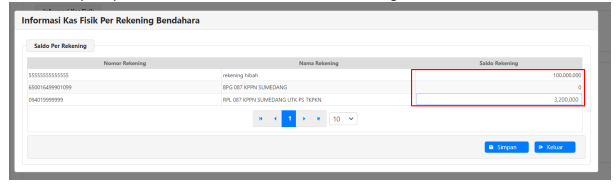
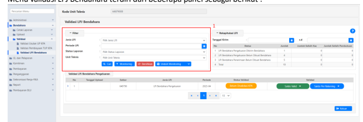

→
�
Petunjuk Teknis Aplikasi SAKTI)
�
→
Laporan Pertanggungjawaban Bendahara Pengeluaran Konsep Baru Versi tanggal : 21/09/2023
�
→

# Daftar Isi

Bagian 1 - Setup Referensi Satker LPJ di KPPN
Bagian 2 - Penyusunan LPJ Bendahara Pengeluaran Konsep Baru Bagian 3 - Validasi LPJ Bendahara oleh KPA/PPK Satker Bagian 4 - Validasi LPJ Bendahara KPPN Pada Staff KPPN
Bagian 5 - Validasi LPJ Bendahara KPPN Pada Kasi KPPN
Bagian 6 - Validasi Tolak LPJ Bendahara oleh KPPN dan KPA/PPK BAGIAN 1 Setup Referensi Satker LPJ di KPPN KPPN dapat melakukan pengaturan aktif/inaktif satker wajib LPJ pada menu KPPN - Verifikasi dan Akuntasi - Referensi - Referensi Satker LPJ. Tampilan dengan filter mode tampilan bulanan adalah 

1. Ceklis pada satker yang dipilih.

2. Klik tombol "Ubah". 3. Klik "Pilih Semua" untuk memilih seluruh jenis LPJ pada satker yang diceklis untuk 1 tahun penuh.

4. Ceklis pada bulan dan jenis LPJ tertentu jika akan melakukan pemilihan secara manual satu per satu sebagaimana berikut :

BAGIAN 2 Penyusunan LPJ Bendahara **Pengeluaran Konsep Baru**
Agar mempermudah penjelasan, pada juknis ini **diasumsikan** LPJ konsep baru mulai diimplementasikan pada **Bulan April 2023**. Maka LPJ untuk bulan Maret tetap dapat dicetak dengan 

1. Informasi Kas Fisik pada kolom Kas Tunai diisi angka.

 2. Informasi Kas Fisik pada kolom Kas Bank diisikan per detail rekening dengan klik tombol 
"Tampilkan Saldo Rekening". Nilai kumulatif akan ditampilkan pada kolom Kas Bank. Berikut tampilan pada sub menu Informasi Kas Fisik Per Rekening. 

Jika terdapat selisih Kas/UP lakukan perekaman penjelasan selisih sebagai berikut. Setelah informasi kas fisik dan hasil pemeriksaan kas diisi, selanjutnya klik "Simpan". 

Akan muncul sub-menu Form Cari Penandatangan. Silahkan pilih KPA/PPK penandatangan LPJ, 

 

1. Status LPJ akan ditampilkan "Belum Dikirim Bendahara". 2. Status validasi data "Dalam Antrian Pembuatan Konsep". Klik berkala tombol ini untuk melakukan refresh status pembuatan konsep LPJ. Setelah proses antrian selesai, maka tombol berubah menjadi "Antrian Diproses" sebagai berikut :
3. Status Upload rekening koran "Belum Upload 3 Rek Koran" mengindikasikan jumlah rekening 

koran yang belum diupload sesuai jumlah rekening yang dikelola Bendahara Pengeluaran.

4. Status file konsep LPJ beserta lampirannya "Diproses".

1. Tombol Validasi saldo akan menampilkan "Saldo Valid" dan berwarna hijau jika pengujian saldo dengan data LPJ bulan lalu telah valid. Tombol validasi saldo akan menampilkan "Saldo Tidak Valid" dan berwarna merah jika masih terdapat saldo yang belum valid.

2. Pada kolom "Keterangan Validasi" akan ditampilkan keterangan saldo yang belum valid, maupun keterangan tolakan dari KPA/PPK atau dari KPPN.

3. File LPJ Bendahara Pengeluaran, hasil pemeriksaan kas dan Laporan Detail Rekening menjadi berstatus "Konsep". Status ini berarti file cetakan PDF telah selesai dihasilkan SAKTI namun masih berupa konsep yang belum divalidasi oleh KPA/PPK. File Konfirmasi Penerimaan negara dan suplemen LPJ berstatus "Generated" berarti telah selesai dihasilkan SAKTI.

1. Klik tombol "Saldo Valid" (atau "Saldo Tidak Valid") untuk membuka sub-menu "Verifikasi 

Laporan Pertanggung Jawaban PER-3/PB/2014 pasal 11 Ayat 3"

hasil perbandingan data sebagai berikut : - Jika hasil perbandingan antar saldo sama maka akan ditampilkan keterangan "Nilai Sama" dengan warna hijau dan LPJ dapat dikirimkan ke KPA/PPK. 

- Jika hasil perbandingan antar saldo berbeda namun perbedaan tersebut dapat dilanjutkan 
(contohnya perbedaan hasil rekonsiliasi internal kas lainnya dengan saldo UAKPA, atau perbedaan saldo kas tunai dengan hasil pemeriksaan) maka akan ditampilkan keterangan "Nilai Tidak Sama" dan LPJ tetap dapat dikirimkan ke KPA/PPK. 

- Jika hasil perbandaingan antar saldo berbeda dan tidak dapat dilanjutkan (contohnya perbedaan hasil rekonsiliasi internal TUP dengan UAKPA atau perbedaan saldo kas bank dengan hasil pemeriksaan) maka akan ditampilkan keterangan "Nilai Tidak Sama" dan LPJ tidak dapat dikirimkan ke KPA/PPK. Lakukan perbaikan transaksi pada pencatatan bendahara dan "Simpan" ulang untuk membentuk data LPJ Kembali.

Klik "Tutup" untuk kembali ke menu LPJ Bendahara.

1. Klik pada tombol "Belum Upload Rek Koran" untuk membuka panel daftar rekening.

2. Akan terbuka daftar rekening yang wajib dlaporkan Bendahara Pengeluaran ke KPPN (Jenis BPg dan RPL). Lakukan upload masing-masing rekening koran dengan klik tombol "Upload" sebagai 

3. Klik tombol "Choose" untuk memilih. File yang dapat diupload hanya dalam format **.pdf**. 

Rekening koran dalam format **.pdf** yang dapat diunggah maksimal sebesar **5 MB**. Terdapat 

6. Setelah seluruh rekening koran di unggah, maka statusnya akan menjadi "Rek Koran Uploaded" 

Setelah unggah rekening koran selesai langkah selanjutnya yaitu cetak LPJ beserta lampiranlampirannya untuk disampaikan ke KPA/PPK. Langkah-langkah pencetakan dokumen sebagai berikut :

1. Pilih dokumen yang akan dipilih, dalam contoh diatas dipilih konsep LPJ Bendahara Pengeluaran.

2. Klik "Preview" untuk membuka "menu Preview Konsep".

3. Pada menu "Preview Konsep" ditampilkan konsep LPJ bendahara Pengeluaran. Bendahara dapat melakukan pengecekan pada saldo yang ditampilkan. Klik daftar dokumen untuk melihat konsep dokumen lainnya sebagai berikut :
Preview Konsep LPJ Bendahara Pengeluaran/00001/LPJ/64879000/04/2023 a Dultar Dokume g d aporan pertanggung jawaban bendahara pengeluaran Bulan: April 2023

Provinsi/Kabupaten/Kota : (02.13) JAWA BARAT / KAB. SUMEDANG

: (00) DITJEN PERDENGA

Keadaan Pembukuan bulan pelaporan dengan terakhir Nomor. 00004/SSP/640790/2023
aporan dengan saldo pada BKU sebesar Rp.  103.300.000.00 Dan Nomor Bukti

| Saldo Awal           | Penambahan
         (Rp.)                    | Pengurangan
                | Saldo Akhir   |                |
|----------------------|--------------------|----------------|---------------|----------------|
| Jeris Buku Pertbarn. | (Ro.)              | (Pp.)          |               |                |
| 3                    | a                  | s              | 6             |                |
| 1.617.901.00         | 103.300.000.00     |                |               |                |
| A                    | BP Kas, BPP dan UM | 104.000.000.00 | 2.317.901.00  |                |
| BP Kas (Turai & Ra   | 104.000.00.00      | 617.901.00     | 1.417.901.00  | 103.200.000.00 |
| BP UM (Voucher)      | 0,00               | 0,00           | 0,00          | 0,00           |
| 0,00                 | 1.000.000,00       | 900.000,00     | 100.000,00    |                |
| BP BPI               |                    |                |               |                |
| BP Selain Kas        | 104.000.000.00     | 17.901.00      | 817.901.00    | 103.300.000,00 |

 Jika konsep cetakan dianggap sudah sesuai, klik "Unduh" untuk mengunduh dokumen 4.

cetakan. Klik "Unduh" pula pada masing-masing dokumen.

 Proview K

/00001/LPJ/64879000/04/2021 ang

aporan pertanggungjawaban bendahara pengeluaran Bulan: April 2023

Keadaan Pembukuan bulan pelaporan dengan saldo pada BKU sebesar Rp.  103.300.000.00 Dan Nomor Bukti

| terakhir Nomor. 0004/SSP/648790/2023   | Penan..
                    |              |                |                |    |
|----------------------------------------|--------------------|--------------|----------------|----------------|----|
| Seldo Awal                             | mbahan             | Pengurangan  | Soldo Akhir    |                |    |
| Jenis Buku Pembantu                    | (Po.)              | (Pp.)        |                |                |    |
| 1                                      | 2                  | 3            | a              | 5              | a  |
| 104.000.000.00                         | 1.617.901.00       | 2.317.901.00 | 103,300,000,00 |                |    |
| A                                      | BP Kes, BPP den UM |              |                |                |    |
| FP Kas (Tunai & Bark                   | 104.000.000.00     | 617.901.00   | 1.417.901.00   | 103.200.000,00 |    |
| BP UM (Voucher)                        | 0.00               | 0.00         | 0.00           | 0.00           |    |
| . BP BPP                               | 0,00               | 1.000.00,00  | 900.000,00     | 100.000,00     |    |
| BP Sebin Kas                           | 104.000.000.00     | 117.901.00   | 017.901.00     | 103.300.000.00 |    |

5.   Klik tombol "Tutup" di sudut kanan bawah atau tombol "x" di sudut kanan atas untuk keluar

Langkah terakhir setelah dokumen diunduh, Bendahara Pengeluaran melakukan kirim LPJ ke KPA/PPK

2. Setelah kirim berhasil, maka status LPJ akan berubah menjadi "Dikirim Bendahara". 3. Kirim LPJ ke KPA masih dapat dibatalkan jika KPA/PPK belum melakukan validasi setuju atau 

BAGIAN 3 Validasi LPJ Bendahara oleh KPA/PPK Satker Pada konsep baru, LPJ harus di validasi oleh KPA/PPK Satker. Validasi LPJ dapat dilakukan pada menu 

Bendahara - Validasi - Validasi LPJ Bendahara, sebagai berikut : 
Menu validasi LPJ Bendahara terdiri dari beberapa panel sebagai berikut :

1. Panel "Filter" digunakan untuk menerapkan filter tampilan data LPJ yang akan ditampilkan. 

Secara *default* LPJ akan ditampilkan untuk semua jenis LPJ di satker tersebut dalam 1 tahun anggaran login. Pada tahap awal hanya LPJ Bendahara Pengeluaran yang ditampilkan. Filter yang dapat diterapkan yaitu Jenis LPJ, Periode LPJ, Status Laporan, dan Unit Teknis. Terdapat juga tombol "Unduh Monitoring" yang dapat mencetak lembar monitoring dalam format .pdf 

Tahun Tanggal/Jam Cetak :  28-08-2023  14:41 Halaman : 1/1

| NO   |    |
|------|----|
|      | 2  |
| 3    |    |

Halaman : 1/1

| JENIS LPJ                 |
|---------------------------|
| LPJ Bendahara Pengeluaran |
| LPJ Bendahara Pengeluaran |
| LPJ Bendahara Penerimaan  |

| DESKRIPSI              | JUMLAH   | SELISIH BUKU   |
|------------------------|----------|----------------|
| Belum Dibuat Bendahara | 4        |                |
| Dikirim Bendahara      | 1        |                |
| Belum Dibuat Bendahara | s        |                |
| Total                  | 10       |                |

| SELISIH KAS   |    |
|---------------|----|
| 0             | 0  |
| 0             |    |

| NO   |
|------|
| 2    |
| a    |

| 0   |
|-----|
| o   |
| o   |

Tanggal/Jam Cetak :  28-08-2023  14:41

| o   | o   |
|-----|-----|
| o   |     |
| 0   |     |

2.

 Panel "Rekapitulasi LPJ" berisi informasi seluruh LPJ per status masing-masing pada tahun

| Detail Monitoring LPJ   |             |                        |                                    |        |              |
|-------------------------|-------------|------------------------|------------------------------------|--------|--------------|
| Tahun                   | : 2023      |                        |                                    |        |              |
| Jenis LPJ               | Kode Satker | Deskripsi              | Periode                            | Jumlah | Selisih Buku |
| LPJ Bendahara           | 64879000    | Dikirim Bendahara      | 2023-04                            |        |              |
| Pengeluaran             |             |                        |                                    |        |              |
| LPJ Bendahara           | 64879000    | Belum Dibuat Bendahara | 2023-05, 2023-06, 2023-            | a      |              |
| Pengeluaran             | 07. 2023-08 |                        |                                    |        |              |
| LPJ Bendahara           | 64879000    | Belum Dibuat Bendahara | 2023-04, 2023-06, 2023-08, 2023-08 | s      |              |
| Penengaan               | Total       | 10                     |                                    |        |              |

|  Solisih Kas   |
|----------------|
| 0              |
| 0              |
| o              |

Panel "Validasi LPJ Bendahara Pengeluaran" berisi LPJ bendahara pengeluaran pada tahun 3.

4.

Terdapat tombol "Saldo Valid" dan "Saldo Per Rekening". Kedua tombol ini memiliki fungsi yang sama dengan tombol pada menu bendahara. Tombol "Saldo Valid" dapat di klik untuk membuka sub-menu "Verifikasi Laporan Pertanggung Jawaban PER-3/PB/204 pasal 11 Ayat 3".

Saldo Per Rekening dapat di klik untuk menampilkan saldo rekening dan mengunduh rekening 

Untuk melakukan validasi dan membuka detail lampiran LPJ, KPA/PPK dapat melakukan *expand* data 

Klik slider validasi ke warna hijau untuk menyetujui, atau ke warna merah untuk tolak.

Tanggal validasi secara *default* ditampilkan hari ini (*sysdate*). Tanggal validasi dapat diubah dan keterangan dapat diisi sebagai berikut :
Untuk menampilkan cetakan LPJ dapat dilakukan dengan memilih (*select*) konsep LPJ Bendahara 

 dilanjutkan klik preview sebagai berikut : 

Diproses", untuk mengetahui jika proses validasi KPA/PPK sudah selesai dan tombol berubah menjadi 

Setelah antrian LPJ diproses LPJ bendahara, buku pemeriksaan kas dan laporan detail rekening berstatus konsep akan dihapus otomatis. Tersisa suplemen LPJ dan konfirmasi penerimaan negara tidak dihapus otomatis berstatus "generated". Kedua dokumen ini tidak memerlukan tanda tangan sehingga 

Sedangkan LPJ bendahara, buku pemeriksaan kas dan laporan detail rekening yang sudah ditandatangani oleh KPA/PPK harus di *upload* kembali.

 2. Pilih jenis dokumen dukung "LPJ bendahara Pengeluaran".

 3. Klik "Choose" untuk memilih dokumen. Jenis dokumen yang dapat di unggah hanya **.pdf**

6. Lakukan proses unggah juga untuk hasil pemeriksaan kas dan laporan detail rekening yang telah ditandatangani PPK/KPA. Terdapat juga pilihan dokumen "Lainnya" untuk mengunggah dokumen lain yang diperlukan/dipersyaratkan KPPN. Jika terdapat lebih dari 1 dokumen 

7. Selain dari menu Validasi LPJ Bendahara pada *user* KPA/PPK, unggah dokumen bertanda 

8. Setelah seluruh dokumen bertanda tangan di unggah, klik "Kirim ke KPPN" untuk mengirim LPJ 

9. Status validasi akan berubah menjadi "Dikirim ke KPPN". 

Jika status validasi LPJ sudah "Dikirim Ke KPPN", maka satker tidak dapat melakukan batal kirim. KPPN harus melakukan tolak LPJ terlebih dahulu. BAGIAN 4 Validasi LPJ Bendahara KPPN **Pada Staff KPPN**
Validasi LPJ Bendahara di KPPN dilakukan 2 tahap yaitu oleh staff KPPN dan kepala seksi KPPN. Akses di SAKTI dilakukan melalui menu KPPN - Verifikasi dan Akuntasi - Validasi Persetujuan LPJ sebagai  Menu "Validasi Persetujuan LPJ KPPN" terdiri dari 3 panel utama sebagai berikut :

1. Panel "Filter" digunakan untuk menerapkan filter tampilan data LPJ yang akan ditampilkan. 

Secara *default* LPJ ditampilkan untuk jenis LPJ Bendahara Pengeluaran satker-satker dalam lingkup KPPN dalam 1 tahun anggaran login. Pada tahap awal hanya LPJ Bendahara Pengeluaran yang ditampilkan. Filter yang dapat diterapkan yaitu Jenis LPJ, Periode LPJ, Status Laporan, dan satker. Terdapat juga tombol "Unduh Monitoring" yang dapat mencetak lembar monitoring dalam format .pdf dan .xlsx.

2. Panel "Rekapitulasi LPJ" berisi informasi seluruh LPJ per status masing-masing pada tahun anggaran login. Pada tahap awal hanya LPJ Bendahara Pengeluaran yang ditampilkan. 

3. Panel "Validasi LPJ Bendahara Pengeluaran" berisi LPJ Bendahara Pengeluaran satker-satker di lingkup KPPN pada tahun anggaran login. 

Untuk melakukan validasi LPJ, klik "*Assign*" agar data LPJ tersebut dikunci dan tidak dapat di validasi oleh *user* staff KPPN yang lainnya.

Tombol "Assign" akan menjadi warna hijau dan pada kolom "Diproses" ditampilkan nama staf serta 

 

Pada sisi kanan panel menu terdapat tombol "Jadikan ZIP". Tombol ini dapat digunakan untuk 

 mengunduh dokumen .pdf LPJ dalam 1 file ZIP tunggal. Untuk mengunduh file ZIP lengkap dengan lampiran rekening koran dapat klik "Rekening Koran". Sedangkan untuk mengunduh file ZIP berisi LPJ, 
buku pemeriksaan kas dll tanpa rekening koran dapat klik "Selain Rekening Koran" .

Berikut contoh isi file ZIP lengkap dengan rekening koran yang di unggah satker :
Name rol Suplemen LPJ_0004_LPJ_64879000_04_2023-SATKERKPA.pdf tp://LPJ_0004_LPJ_64879000_04_2023-SATKERKPA.pdf tt roll Konfirmasi Penerimaan Negara_0004_LPJ_64879000_04_2023-SATKERKPA.pdf II HASIL PEMERIKSAAN KAS_0004_LPJ_64879000_04_2023-SATKERKPA.pdf ron 650016499901099_BP_64879000_04_2023-SATKERKPA.pdf ron 5555555555_RPL_64879000_04_2023-SATKERKPA.pdf roll 0940199999_RPL_64879000_04_2023-SATKERKPA.pdf Untuk melakukan validasi dan membuka detail lampiran LPJ, staff KPPN dapat melakukan expand data

Klik slider validasi ke warna hijau untuk menyetujui, atau ke warna merah untuk tolak.

Untuk menampilkan cetakan LPJ ataupun lampirannya secara satu per satu dapat dilakukan dengan 

Tanggal validasi secara *default* ditampilkan hari ini (*sysdate*). Tanggal validasi dapat diubah dan 

BAGIAN 5 Validasi LPJ Bendahara KPPN Pada Kasi KPPN
Validasi LPJ Bendahara pada kepala seksi KPPN dapat diakses melalui menu KPPN - Verifikasi dan 

Akuntasi - Validasi Persetujuan LPJ KPPN sebagai berikut.

Tampilan menu validasi persetujuan LPJ KPPN pada user kasi KPPN sama dengan pada user staff KPPN. 

 Untuk melakukan validasi dan membuka detail lampiran LPJ, kasi KPPN dapat melakukan *expand* data dengan klik sebagai berikut : Tanggal validasi secara *default* ditampilkan hari ini (*sysdate*). Tanggal validasi dapat diubah dan keterangan dapat diisi sebagai berikut :

Untuk menampilkan cetakan LPJ ataupun lampirannya secara satu per satu dapat dilakukan dengan memilih (select) file LPJ Bendahara dilanjutkan klik preview sebagai berikut :

Jika memilih validasi setuju, maka status validasi akan berubah dari "Divalidasi Staf KPPN" menjadi

BAGIAN 6 Validasi Tolak LPJ Bendahara oleh KPPN **dan KPA/PPK**
Beberapa hal terkait validasi tolak LPJ Bendahara adalah sebagai berikut :
A. Staff atau Kasi KPPN dapat melakukan validasi tolak saat LPJ satker masih berstatus "Dikirim Satker", "Divalidasi Staff KPPN", ataupun ditolak kembali setelah sudah berstatus "Divalidasi 

1. Klik slider validasi ke warna merah untuk tolak.

2. Kolom keterangan wajib diisi jika melakukan validasi tolak.

3. Klik "Simpan".

Validasi tolak yang dilakukan oleh staff KPPN atau kasi KPPN sama-sama menghasilkan status validasi "Ditolak KPPN".

B. KPA/PPK satker dapat melakukan validasi tolak saat LPJ satker masih berstatus "Belum Divalidasi KPA". Validasi tolak oleh KPA/PPK dilakukan sebagai berikut :
1. Klik slider validasi ke warna merah untuk tolak.

 2. Kolom keterangan wajib diisi jika melakukan validasi tolak. 3. Klik "Simpan".

C. Jika status LPJ "Ditolak KPPN" atau "Ditolak KPA/PPK" maka Bendahara Pengeluaran dapat 

1. Status LPJ berubah Kembali menjadi "Belum Dikirim Bendahara" 2. Penomoran *sequence* LPJ berubah naik. Pada contoh diatas berubah dari 00005 menjadi 00006. Data LPJ pada *sequence* 0006 ini adalah data LPJ yang dibentuk atas kondisi perekaman transaksi terkini pada periode yang dipilih.

D. Jika satker melakukan perubahan data LPJ pada periode yang telah disetujui sebelumnya, KPPN 
harus melakukan validasi tolak secara berurutan. Sebagai contoh, LPJ satker telah diterima KPPN dari periode 2023-01 sampai dengan 2023-07. Satker akan melakukan perubahan transaksi dan LPJ pada periode 2023-02, maka KPPN perlu memberikan validasi tolak pada LPJ 
periode 2023-07 sampai dengan 2023-02 secara berurutan. 