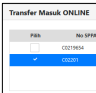
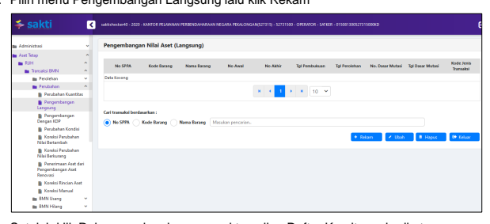
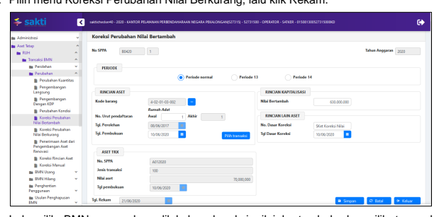

1
2020 Petunjuk Teknis Aplikasi SAKTI
Modul Persediaan Modul Aset Tetap

 

# Daftar Isi

| KONSEP PEREKAMAN TRANSAKSI MODUL ASET TETAP 1 PETUNJUK TEKNIS TRANSAKSI BMN 3 PEROLEHAN BMN 3 Saldo Awal (Kode Transaksi 100) 3 Pembelian (Kode Transaksi 101) 4 Transfer Masuk Online (Kode Transaksi 102) 6 Transfer Masuk Manual (Kode Transaksi 102) 7 Hibah Masuk (Kode Transaksi 103) 8 Rampasan (Kode Transaksi 104) 10 Penyelesaian Pembangunan Langsung (Kode Transaksi 113) 11 Penyelesaian Pembangunan Dengan KDP (Kode Transaksi 105) 13 Reklasifikasi Masuk (Kode Transaksi 107) 14 Perolehan Lainnya (Kode Transaksi 112) 15 Reklas Aset dari Persediaan (Kode Transaksi 115) 16 PERUBAHAN BMN 18 Perubahan Kuantitas (Kode Transaksi 201) 18 Pengembangan Langsung (Kode Transaksi 202) 19 Pengembangan dengan KDP (Kode Transaksi 208) 21 Perubahan Kondisi (Kode Transaksi 203) 23 Koreksi Perubahan Nilai Bertambah (Kode Transaksi 204) 23 Koreksi Perubahan Nilai Berkurang (Kode Transaksi 264) 25 Penerimaan Aset dari Pengembangan Aset Renovasi (Kode Transaksi 206) 26 Koreksi Manual (Kode Transaksi 209) 28 BMN HILANG 29 Pencatatan Barang Hilang (Kode Transaksi 901) 29 Pencatatan Pembatalan Barang Hilang (Kode Transaksi 902) 29 PENGHENTIAN PENGGUNAAN BMN 30 Penghentian Penggunaan (Kode Transaksi 401) 30 Penggunaan Kembali (Kode Transaksi 402) 31 USULAN PENGHAPUSAN BMN 32 Pencatatan Barang yang Akan Dihapuskan (Usulan Penghapusan) (Kode  Transaksi 911) 32   |
|------------------------------------------------------------------------------------------------------------------------------------------------------------------------------------------------------------------------------------------------------------------------------------------------------------------------------------------------------------------------------------------------------------------------------------------------------------------------------------------------------------------------------------------------------------------------------------------------------------------------------------------------------------------------------------------------------------------------------------------------------------------------------------------------------------------------------------------------------------------------------------------------------------------------------------------------------------------------------------------------------------------------------------------------------------------------------------------------------------------------------------------------------------------------------------------------------------------------------------------------------------------------------------------------------------------------------------------------------------------------------------------------------------|

i

| SAKTI MODUL ASET TETAP                                                                                                                                                                                                                                                                                                                                                                                                                                                                                                                                                                                                                                                                                                                                                                                                                                                                                                                                                                                            |
|-------------------------------------------------------------------------------------------------------------------------------------------------------------------------------------------------------------------------------------------------------------------------------------------------------------------------------------------------------------------------------------------------------------------------------------------------------------------------------------------------------------------------------------------------------------------------------------------------------------------------------------------------------------------------------------------------------------------------------------------------------------------------------------------------------------------------------------------------------------------------------------------------------------------------------------------------------------------------------------------------------------------|
| Pencatatan Pembatalan Barang yang Akan Dihapuskan (Kode Transaksi 912) ... 33                                                                                                                                                                                                                                                                                                                                                                                                                                                                                                                                                                                                                                                                                                                                                                                                                                                                                                                                     |
| PENGHAPUSAN BMN 34 Penghapusan BMN (Kode Transaksi 301) 34 Transfer Keluar (Barang Aktif) (Kode Transaksi 302) 34 Transfer Keluar (Henti Guna) (Kode Transaksi 302) 35 Transfer Keluar (ATR) (Kode Transaksi 302) 36 Hibah Keluar (Kode Transaksi 303) 37 Reklasifikasi Keluar (Kode Transaksi 304) 38 Reklasifikasi Keluar Persediaan (Kode Transaksi 315) 39 Koreksi Pencatatan (Kode Transaksi 305) 40 TRANSFER INTERNAL 41 Transfer Internal Keluar (Kode Transaksi 921) 41 Transfer Internal Masuk (Kode Transaksi 922) 42                                                                                                                                                                                                                                                                                                                                                                                                                                                                                   |
| PETUNJUK TEKNIS TRANSAKSI KONSTRUKSI DALAM PENGERJAAN (KDP) 44 Saldo Awal KDP (Kode Transaksi 501) 44 Perolehan KDP (Kode Transaksi 502) 44 Transfer Masuk KDP (Kode Transaksi 506) 47 Hibah Masuk KDP (Kode Transaksi 508) 48 Pengembangan KDP (Kode Transaksi 503) 50 Koreksi Perubahan Nilai Bertambah KDP (Kode Transaksi 504) 52 Koreksi Perubahan Nilai Berkurang KDP (Kode Transaksi 504) 53 Transfer Keluar KDP (Kode Transaksi 507) 54 Hibah Keluar KDP (Kode Transaksi 509) 55 Penghapusan/Penghentian KDP (Kode Transaksi 505) 56 Perolehan Lainnya KDP (Kode Transaksi 510) 57 Reklasifikasi KDP (Kode Transaksi 513) 57 PETUNJUK TEKNIS TRANSAKSI BMN BERSEJARAH 59 BMN BERSEJARAH 59 Saldo Awal BMN Bersejarah (Kode Transaksi 601) 59 Perolehan BMN Bersejarah (Kode Transaksi 602) 60 Penghapusan BMN Bersejarah (Kode Transaksi 604) 61 PETUNJUK TEKNIS TRANSAKSI BARANG PIHAK KETIGA 63 Perolehan BMN Pihak Ketiga (Kode Transaksi 701) 63 Penghapusan BMN Pihak Ketiga (Kode Transaksi 702) 64 |

ii

| SAKTI                                                                                                                         |
|-------------------------------------------------------------------------------------------------------------------------------|
| MODUL ASET TETAP                                                                                                              |
| MENU PENCATATAN BMN                                                                                                           |
| Pencatatan Kartu IdentitasBarang (KIB) ................................................................................... 65 |
| Pencatatan Daftar Barang Ruangan (DBR) ........................................................................ 66            |
| Pencatatan Daftar Barang Lainnya (DBL) ............................................................................. 6        |
| Perubahan DBL - DBR                                                                                                           |
| MENU MONITORING STATUS TRANSAKSI, SUMMARY DAN TUTUP BUKU………. 68                                                               |
| Monitoring Status Transaksi                                                                                                   |
| Summary                                                                                                                       |
| Tutup Buku .                                                                                                                  |

ii

# Konsep Perekaman Transaksi Modul Aset Tetap

Untuk menjaga kebenaran dan keabsahan data, maka transaksi asset tetap direkam dalam 3 (tiga) jenjang keamanan berupa status perekaman. Dengan demikian setiap transaksi mempunyai status perekaman. 1. Status "Rekam", yakni ketika transaksi untuk pertama kali direkam. Perekaman awal ini dilakukan oleh operator. Pada status ini transaksi masih dapat diubah dan dihapus oleh user operator.

2. Status "Validasi", yakni setelah dilakukan pemeriksaan/validasi atas transaksi yang berstatus Rekam. Pemeriksaan/validasi dilakukan oleh Validator. Pada status ini transaksi tidak dapat diubah atau dihapus. Bila ternyata diperlukan perubahan, maka transaksi ini harus dibatalkan validasinya sehingga statusnya kembali menjadi "Rekam".

3. Status "Setuju", yakni setelah dilakukan persetujuan / approval atas transaksi yang berstatus Validasi. Persetujuan dilakukan oleh Kuasa Pengguna Barang (KPB). Pada status ini transaksi tidak dapat diubah atau dihapus dan tidak dapat dilakukan batal persetujuan oleh satker. Transaksi yang masuk didalam laporan hanya transaksi dengan status "**Setuju**".

Transaksi Modul Aset Tetap yang perlu di-*triger* dari Modul Komitmen sebagaimana gambar di bawah ini:
MODUL ASET TETAP
Transaksi yang dapat dilakukan secara mandiri tanpa perlu triger dari Modul Komitmen sebagaimana gambar di bawah ini:
Transaksi Modul Aset Tetap

| SELAIN          | Modul Aset Tetap   |          |           |
|-----------------|--------------------|----------|-----------|
| Jenis Transaksi |                    |          |           |
| .               | Pembelian          |          |           |
| - Penyelesaian  |                    |          |           |
| Pembangunan     |                    |          |           |
| Langsung        |                    |          |           |
| .               | Pengembangan       | OPERATOR | VALIDATOR |
| Langsung        |                    |          |           |
| .               | Perolehan KDP      |          |           |
| .               | Pengembangan       |          |           |
| KDP             |                    |          |           |
| .               | Menu Pencatatan    |          |           |

# Petunjuk Teknis Transaksi Bmn

## Perolehan Bmn

Saldo Awal (Kode Transaksi *100)* Menu Saldo Awal (100) merupakan saldo BMN pada awal tahun anggaran berjalan atau awal tahun mulai diimplementasikannnya SAKTI yang merupakan akumulasi dari seluruh transaksi BMN tahun sebelumnya. Atau dapat digunakan untuk merekam data-data yang diperoleh sebelum tahun anggaran berjalan, yang belum dibukukan. Dokumen yang dipergunakan oleh Unit Akuntansi Kuasa Pengguna Barang (UAKPB)
pada proses pemasukan saldo awal dapat diperoleh dari Buku Barang, Hasil Opname Fisik Barang atau Laporan Tahunan UAKPB.

Berdasarkan temuan BPK atas audit Laporan Keuangan Tahun 2019, ditemukan aset berupa peralatan mesin senilai Rp 100.000.000,- yang diperoleh tanggal 15 Desember 2019, tetapi belum direkam di Aplikasi SAKTI di tahun 2019. Atas rekomendasi tersebut, operator Modul Aset Tetap menginput pada Modul Aset Tetap dengan tanggal buku 2 Januari 2020 menggunakan menu Saldo Awal. Nama menu : **RUH >> Transaksi BMN >> Perolehan >> Saldo Awal** Langkah perekaman transaksi ini adalah : 1. Pilih menu Saldo Awal dan klik Rekam

 2. Lalu isikan kolom-kolom sebagai berikut :
1) Pilih kode barang dan jumlah barang 2) Tanggal pembukuan diisi pada periode bulan yang masih buka 3 3) Tanggal perolehan diisi sesuai dengan tanggal dokumen sumber yaitu sebelum tahun anggaran berjalan Pembelian (Kode Transaksi *101)* Menu ini digunakan untuk menginput BMN yang diperoleh dengan pembelian dari dana DIPA/APBN pada Tahun Anggaran Berjalan yang tanpa melalui proses Konstruksi dalam Pengerjaan (KDP). Dasar pencatatan pembelian adalah dari transaksi Modul Komitmen yang terdiri dari: 1. Pencatatan Berita Acara Serah Terima (BAST) baik kontraktual maupun non kontraktual 2. Pencatatan BAST dari hibah barang 3. Pencatatan penerimaan barang KKP 4. Pencatatan penerimaan barang valas 5. Pencatatan penerimaan barang UP/TUP Tunai/Bank 6. Pencatatan penerimaan barang hibah Ilustrasi : 1. Satker melakukan pembelian mobil dinas senilai Rp200 juta pada tanggal 17 Agustus 2020, menggunakan SPM LS Sekaligus. Maka, operator Modul Komitmen merekam BAST dan pilih kode barang 3xxxxxxxxx (mini bus) dan operator Modul Aset Tetap melakukan pendetailan melalui menu Pembelian 2. Satker melakukan pembelian Lap Top senilai Rp10 juta pada tanggal 17 Agustus 2020 menggunakan sumber dana UP. Maka, operator Modul Komitmen merekam Pencatatan penerimaan barang UP/TUP Tunai/Bank dan memilih kode aset 3xxxxxxxxx (Lap Top), lalu operator Modul Aset Tetap melakukan pendetailan melalui menu Pembelian Penginputan pada saat BAST tanpa menunggu terbitnya dokumen pembayaran/pengesahan (SPM/SP2D/SP3B-BLU/SP2B-BLU/SP3/SP2HL/SPHL, dll). Nama menu : RUH >> Transaksi BMN >> Perolehan >> **Pembelian**. Langkah perekaman transaksi Pembelian adalah : 1. Pilih menu Pembelian, lalu klik Rekam 

 2. Setelah klik Rekam, akan muncul tampilan Daftar Komitmen sebagai berikut :

Lalu pilih jenis dokumen : Kontrak atau Non Kontrak/Penerimaan Barang, lalu pilih dokumen BAST atau penerimaan barang yang ada didetailkan, lalu klik Catat 3. Setelah klik Catat, akan muncul tampilan Daftar Barang dalam Komitmen/Bendahara 

sebagai berikut : Lalu pilih BMN yang akan didetailkan dan klik Catat lagi 4. Setelah klik Catat, akan muncul tampilan sebagai berikut :

Lalu pilih tanggal pembukuan pada periode bulan yang masih buka dan isian yang lain sesuai dokumen sumber dan klik Simpan.

5

## Transfer Masuk Online (Kode Transaksi 102)

Menu ini digunakan untuk merekam BMN dari hasil kiriman (transfer) satker lainnya dalam lingkup Pemerintah Pusat yang satker pengirimnya sama-sama sudah menggunakan aplikasi SAKTI. Pencatatan transaksi ini dilakukan berdasarkan BAST satker pemberi dan satker penerima BMN.

Ilustrasi :
Satker Kantor Pusat DJPb (pengguna SAKTI) mengirimkan Sepeda Motor sebanyak 1 unit senilai Rp7.000.000,- kepada KPPN Palu (pengguna SAKTI). Maka, setelah satker Kantor Pusat DJPb merekam dan menyetujui transaksi Transfer Keluar Online, lalu KPPN Palu merekam penerimaan kiriman Sepeda Motor tersebut melalui menu Transfer Masuk Online. Nama menu : **RUH >> Transaksi BMN >> Perolehan >> Transfer Masuk Online** Langkah perekaman transaksi ini adalah : 1. Pilih menu Transfer Masuk Online, lalu klik Rekam

 2. Setelah klik Rekam, akan muncul tampilan BMN yang dikirim ke satker kita sebagai berikut:
6

Lalu centang transaksi Transfer Keluar dari satker pengirim dan klik Transfer Masuk 

 dan klik Ya.

Transfer Masuk Manual (Kode Transaksi *102)* Menu ini digunakan untuk merekam data BMN dari hasil kiriman (transfer) satker lain dalam lingkup Pemerintah Pusat yang satker pengirimnya belum menggunakan aplikasi SAKTI. Pencatatan transaksi ini dilakukan berdasarkan BAST satker pemberi dan satker penerima BMN.

Satker Kantor Pusat Setjen Kementerian Agama (belum pengguna SAKTI) mengirimkan BMN kepada satker KPPN Palu (pengguna SAKTI) berupa panci sebanyak 1 unit dengan data : 1) Tanggal awal pemakaian : 14 Juni 2017 2) Tanggal pembukuan dan tanggal perolehan : 10 Juni 2020 3) Nilai aset bruto : Rp50.000.000,- 4) Nilai total akumulasi penyusutan : Rp10.000.000,- 5) Nilai buku/neraca : Rp40.000.000,- 6) Sisa masa manfaat : 10 semester Maka, satker Kantor Pusat Setjen Kementerian Agama merekam transaksi Transfer Keluar, lalu KPPN Pekalongan merekam penerimaan kiriman Panci tersebut melalui menu Transfer Masuk Manual. Nama menu : **RUH >> Transaksi BMN >> Perolehan >> Transfer Masuk Manual** Langkah perekaman transaksi ini adalah : 1. Pilih menu Transfer Masuk Manual, lalu klik Rekam

 
Hal-hal yang perlu diperhatikan dalam perekaman transaksi ini adalah :

 1) Tanggal Pembukuan diisi dengan tanggal dokumen sumber 2) Tanggal Awal Pemakaian diisi dengan tanggal awal pertama kali BMN diperoleh yaitu bisa tanggal pembelian atau perolehan pertama kali oleh satker sebelumsebelumnya.

3) Tanggal Perolehan diisi dengan tanggal BAST. 4) Nilai Per Satuan diisi dengan nilai total aset bruto sampai dengan transaksi Transfer Masuk.

5) Nilai Buku/Neraca diisi dengan nilai buku aset, yaitu nilai aset bruto dikurangi dengan total akumulasi penyusutan sampai dengan transaksi Transfer Masuk.

6) Sisa Masa Manfaat diisi dengan masa manfaat dikurangi dengan umur aset sampai dengan transaksi Transfer Masuk, dengan memperhitungkan adanya tambah/kurang masa manfaat sampai dengan transaksi Transfer Masuk.

7) Rincian Lain Aset diisi sesuai dengan dokumen sumber pendukungnya

## Hibah Masuk (Kode Transaksi 103)

Menu ini digunakan untuk mencatat perolehan aset yang bersumber dari hibah yaitu diterima dari entitas di luar Pemerintah **Pusat**, misalnya dari Pemerintah Daerah, perusahaan, perorangan, BUMN/D maupun dari swasta.

## Perlu Diperhatikan :

1. Hibah BMN yang dicatat pada Aplikasi SAKTI merupakan hibah BMN yang nantinya akan ditindak lanjuti dengan proses register ke DJPPR dan pengesahan ke KPPN mitra kerja. 

2. Pencatatan aset tersebut sebagai BMN dilakukan berdasarkan BAST, tanpa menunggu adanya register ke DJPPR dan pengesahan ke KPPN (MPHL-BJS)
8

Satker KPPN Pekalongan menerima hibah BMN dari Pemerintah Kota Pekalongan berupa 10 unit Jeep senilai masing-masing Rp500.000.000,- Nama menu : **RUH >> Transaksi BMN >> Perolehan >> Hibah Masuk** Langkah perekaman transaksi ini adalah :
1. Pilih menu Hibah Masuk, lalu klik Rekam

 2. Setelah klik Rekam, akan muncul tampilan Daftar BAST Hibah, lalu pilih nomor 

dokumen BAST Hibah, lalu klik Catat 3. Setelah klik Catat, muncul tampilan Daftar Barang dalam Hibah Masuk/Hibah, lalu pilih kodefikasi BMN dan klik Catat

4. Setelah klik Catat, akan muncul tampilan berikut dan pilih tanggal pembukuan lalu klik Simpan 9

## Rampasan (Kode Transaksi 104)

Menu ini digunakan untuk menginput transaksi perolehan BMN hasil rampasan berdasarkan putusan pengadilan. Dari aturan yang selama ini ada, hanya beberapa Kementerian dan Lembaga Negara yang mempunyai wewenang untuk menginput perolehan barang rampasan. Pada umumnya setelah ada putusan pengadilan yang menyatakan bahwa barang rampasan/gratifikasi tersebut dirampas untuk negara, maka barang tersebut akan dilelang dan hasil lelang tersebut disetor ke Kas Negara. Dengan demikian, aset tersebut dimasukkan sebagai Persediaan (walaupun bentuk aset tersebut berupa aset tetap, seperti misalnya tanah, bangunan, kendaraan, dll). Prosedur mengikuti PMK Nomor 03/PMK.06/2011 tentang Pengelolaan BMN yang berasal dari Barang Rampasan Negara dan Barang Gratifikasi.

Nama menu : RUH >> Transaksi BMN >> Perolehan >> **Rampasan** Langkah perekaman transaksi ini adalah : Pilih menu Rampasan, lalu klik Rekam, lalu pilih BMN dan NUP BMN, isikan jumlah item, pilih tanggal pembukuan, tanggal awal pemakaian dan tanggal perolehan, isikan kuantitas dan nilai total, lalu klik Simpan.

## Penyelesaian Pembangunan Langsung (Kode Transaksi 113)

Merupakan transaksi perolehan BMN dari pengadaan pembangunan gedung/bangunan dan BMN lainnya dengan menggunakan metode pembayaran sekaligus 100% (baik pembayaran Langsung (LS) maupun dari sumber dana UP/GUP/TUP). Pembangunan tersebut menggunakan pembayaran sekaligus (bukan menggunakan pembayaran bertahap/termin) dalam satu dokumen pembayaran (misal SP2D). Dasar pencatatan untuk transaksi penyelesaian pembangunan langsung adalah dari transaksi Modul Komitmen yang dapat terdiri dari: 1. Pencatatan Berita Acara Serah Terima (BAST) baik kontraktual maupun non kontraktual 2. Pencatatan BAST dari hibah barang 3. Pencatatan penerimaan barang KKP 4. Pencatatan penerimaan barang valas 5. Pencatatan penerimaan barang UP/TUP Tunai/Bank 6. Pencatatan penerimaan barang hibah

Satker KPPN Pekalongan membangun pos satpam 1 unit menggunakan metode pembayaran sekaligus 100% secara LS Non Kontraktual senilai Rp30.000.000,-. Maka operator Modul Komitmen merekam BAST Non Kontraktual dengan memilih BMN Gedung Pos Jaga Permanen, lalu operator MAT melakukan pendetailan pada menu Penyelesaian Pembangunan Langsung. Nama menu : RUH >> Transaksi BMN >> Perolehan >> **Penyelesaian** Pembangunan Langsung. Langkah perekaman transaksi ini adalah : 1. Pilih menu Penyelesaian Pembangunan Langsung, lalu klik Rekam

 2. Setelah klik Rekam, akan muncul tampilan Daftar Komitmen berikut :

Lalu pilih Jenis Dokumen : Kontrak atau Non Kontrak/Penerimaan Barang dan pilih nomor dokumen, lalu klik Catat 3. Setelah klik Catat, akan muncul tampilan Daftar Barang Dalam Komitmen/Bendahara 

sebagai berikut :
Lalu pilih BMN yang akan didetailkan dan klik Catat 4. Setelah klik catat akan muncul tampilan berikut, lalu isikan tanggal pembukuan dan klik Simpan. 

12

## Penyelesaian Pembangunan Dengan Kdp (Kode Transaksi 105)

Menu ini digunakan untuk merekam BMN baru yang diperoleh pada tahun anggaran berjalan, yang berasal dari aset yang telah selesai proses pembangunan melalui mekanisme KDP (telah selesai 100% pekerjaan fisiknya), dan dalam hal ini biasanya pencairan dananya melalui beberapa termin pembayaran. Untuk dapat menggunakan menu ini, terlebih dahulu harus ada saldo KDP yang sejenis, baik itu berasal dari transaksi Saldo Awal KDP atau Perolehan KDP dan/atau Pengembangan KDP atau Perolehan Lainnya KDP. Pada menu ini, BMN yang tercatat sebagai aset KDP (misalnya : Gedung dan Bangunan Dalam Pengerjaan) akan direklasifikasi menjadi Aset Tetap (misalnya : Bangunan Gedung Kantor Permanen) baru, yaitu akan menambah NUP baru untuk BMN dimaksud.

Satker KPPN Pekalongan membangun gedung kantor senilai Rp50.000.000,- dengan sistem pembayaran bertahap/termin, dengan rincian sebagai berikut:

| Pembayaran                                                                       | Tgl BAST   | Nilai      | BMN di BAST     | Transaksi di MAT   |
|----------------------------------------------------------------------------------|------------|------------|-----------------|--------------------|
| Ke-1 : Uang Muka                                                                 | 10-06-2020 | 10.000.000 | Gedung Bangunan | Perolehan KDP      |
| Dalam Pengerjaan                                                                 |            |            |                 |                    |
| Ke-2 : Termin I                                                                  | 20-06-2020 | 15.000.000 | Gedung Bangunan | Pengembangan       |
| Dalam Pengerjaan                                                                 | KDP        |            |                 |                    |
| Ke-3 : Termin II                                                                 | 22-06-2020 | 25.000.000 | Gedung Bangunan | Pengembangan       |
| Dalam Pengerjaan                                                                 | KDP        |            |                 |                    |
| Setelah pekerjaan pembangunan gedung kantor telah selesai 100% dan telah ditanda |            |            |                 |                    |

Setelah pekerjaan pembangunan gedung kantor telah selesai 100% dan telah ditanda tangani BAST gedung baru, maka gedung baru tersebut dicatat sebagai Penyelesaian Pembangunan Dengan KDP. Nama menu : RUH >> Transaksi BMN >> Perolehan >> **Penyelesaian** Pembangunan Dengan KDP. Langkah perekaman transaksi ini adalah : 1. Pilih menu Penyelesaian Pembangunan Dengan KDP dan klik Rekam. 

 2. Lalu isikan data-data sebagai berikut :
1) Pilih BMN definitif yang telah selesai pembangunannya 2) Pilih tanggal pembukuan dan tanggal perolehan sesuai dengan dokumen sumber 3) Pilih asal KDP dan NUP KDP yang sudah selesai menjadi BMN definitif, lalu klik Simpan 

## Reklasifikasi Masuk (Kode Transaksi 107)

Menu ini digunakan :
1. Untuk mencatat perubahan transaksi BMN atas jenis penggolongan dan kodefikasi BMN yang sebelumnya telah dicatat dengan penggolongan dan kodefikasi BMN yang lain (Kode Barang terdiri dari golongan, bidang, kelompok, sub kelompok dan sub-sub kelompok);
2. Untuk mencatat perubahan transaksi BMN yang sebelumnya telah dicatat sebagai aset intrakomtabel menjadi aset ekstrakomtabel atau sebaliknya.

Operator Modul Aset Tetap (MAT) terlanjur melakukan kesalahan perekaman kodefikasi BMN dan telah disetujui pendetailan BMN sebagai Sepeda Motor, padahal seharusnya dipilih kodefikasi BMN sebagai Scooter. Atas kesalahan di atas, operator MAT membuat transaksi reklasifikasi keluar atas BMN Sepeda Motor. Setelah transaksi reklasifikasi keluar ini dilakukan persetujuan oleh approver, maka perlu dilanjutkan dengan melakukan perekaman transaksi reklasifikasi masuk dengan memilih jenis BMN yang seharusnya yaitu Scooter. Perlakuan transaksi pada Aplikasi SAKTI : 1. Menu RUH >> Transaksi BMN >> Penghapusan >> **Reklasifikasi Keluar** :
untuk mengeluarkan BMN yang salah rekam tersebut 2. Menu RUH >> Transaksi BMN >> Perolehan >> **Reklasifikasi Masuk :** untuk merekam nama dan kodefikasi BMN yang benar Nama menu : RUH >> Transaksi BMN >> Perolehan >> **Reklasifikasi Masuk.**

## Untuk Perhatian :

1. Sebelum melakukan perekaman reklasifikasi masuk BMN yang seharusnya, harus dipastikan bahwa telah dilakukan persetujuan oleh approve untuk transaksi reklasifikasi keluar BMN yang salah.

2. Dibuat dasar pencatatan berupa Surat Keterangan Perbaikan Pencatatan Laporan Barang Milik Negara yang ditandatangani KPB.

3. Total nilai bruto aset yang direklasifikasi masuk dengan yang direklasifikasi keluar harus sama.

4. Transaksi Reklasifikasi Keluar dengan Reklasifikasi Masuk harus dilaksanakan dalam periode semester yang sama.

Langkah perekaman transaksi ini adalah : 1. Pilih menu Reklasifikasi Masuk dan klik Rekam. 

 2. Selanjutnya pilih Kode barang Asal, Kode barang Tujuan dan tanggal pembukuan, lalu klik Simpan

## Perolehan Lainnya (Kode Transaksi 112)

Menu ini digunakan untuk merekam BMN yang diperoleh pada tahun anggaran berjalan, yang berasal dari transaksi selain Pembelian, Transfer Masuk, Hibah (Masuk), 
15 Rampasan, Penyelesaian Pembangunan, Pembatalan Penghapusan, Reklasifikasi Masuk, Pertukaran, dan Perolehan dari Reklasifikasi BPYBDS. Contoh transaksi ini adalah bertambahnya tanaman langka yang dikembangbiakkan sendiri oleh Kementerian Lingkungan Hidup dan Kehutanan. Nama menu : RUH >> Transaksi BMN >> Perolehan >> **Perolehan Lainnya** Langkah perekaman transaksi ini adalah : 1. Pilih menu Perolehan Lainnya, lalu klik Rekam.

 2. Selanjutnya pilih kode barang, isikan jumlah item, tanggal pembukuan, tanggal awal pemakaian dan nilai per satuan, lalu klik Simpan.

## Reklas Aset Dari Persediaan (Kode Transaksi 115)

Menu ini digunakan untuk mencatat BMN yang berasal dari perubahan penggolongan atau kodefikasi BMN, yaitu sebelumnya telah dicatat sebagai barang persediaan (kode 1xxxxxxxxx), lalu diubah menjadi kodefikasi BMN (kode selain 1xxxxxxxxx).

Operator Modul Persediaan terlanjur melakukan kesalahan perekaman jenis barang dan telah disetujui sebagai perekaman Keset (kode 1010305004000001), padahal seharusnya memilih kodefikasi BMN sebagai Keset Kaki (kode 3050206061). Atas kesalahan di atas, operator Modul Persediaan membuat transaksi reklasifikasi ke aset atas barang keset (kode 1010305004000001) . Setelah transaksi reklasifikasi ke aset ini dilakukan persetujuan oleh approver, maka perlu dilanjutkan oleh operator MAT dengan melakukan perekaman transaksi reklasifikasi aset dari persediaan dengan memilih jenis BMN yang seharusnya yaitu Keset Kaki (kode 3050206061). Perlakuan transaksi pada Aplikasi SAKTI : 1. Modul Persediaan >> Menu **Transaksi Keluar >> Reklasifikasi ke Aset** : untuk mengeluarkan barang persediaan yang salah rekam tersebut 16 2. Modul MAT >> Menu RUH >> Transaksi BMN >> Perolehan >> **Reklas Aset** 
dari Persediaan : untuk merekam nama dan kodefikasi BMN yang benar Nama menu : RUH >> Transaksi BMN >> Perolehan >> **Reklas Aset dari** 
Persediaan

## Untuk Perhatian :

1. Sebelum melakukan perekaman reklasifikasi aset dari persediaan untuk mencatat BMN yang seharusnya, harus dipastikan bahwa telah dilakukan persetujuan oleh approve di Modul Persediaan untuk transaksi reklasifikasi ke aset.

2. Dibuat dasar pencatatan berupa Surat Keterangan Perbaikan Pencatatan Laporan Barang Milik Negara yang ditandatangani KPB
3. Total nilai bruto aset yang direklasifikasi aset dari persediaan, harus sama dengan nilai bruto yang direklasifikasi ke aset (Modul Persediaan)
4. Transaksi **Reklas Aset dari Persediaan** (MAT) dengan **Reklasifikasi ke Aset**
(Modul Persediaan) dilaksanakan dalam periode semester yang sama.

Langkah perekaman transaksi ini adalah : 1. Pilih Reklas dari Persediaan lalu klik Rekam, akan muncul daftar Reklas Masuk dari 

Persediaan berikut dan centang salah satu kode barang persediaan yang akan direklasifikasi menjadi BMN, lalu klik Lanjutkan

2. Setelah klik Lanjutkan, akan muncul tampilan berikut

3. Lalu isikan data-data sebagai berikut :
1) Pilih tanggal perolehan, tanggal pembukuan dan tanggal awal pemakaian sesuai dengan dokumen sumber 2) Pilih kodefikasi BMN, jumlah NUP dan harga satuan BMN yang seharusnya, lalu Klik Simpan Detail 3) Terakhir klik Simpan yg di bawah

## Perubahan Bmn

Perubahan Kuantitas (Kode Transaksi *201)* Menu ini digunakan untuk koreksi atas kesalahan perekaman kuantitas BMN tertentu, misalnya luas tanah, luas gedung dan bangunan, luas jalan, irigasi dan jembatan, dll Menu ini bukan digunakan untuk koreksi jumlah NUP BMN, tetapi melakukan koreksi kuantitas satuan BMN, misalnya luasnya, dll.

Operator MAT pada Satker KPPN Pekalongan salah merekam luas tanah bangunan kantor, semula dicatat luas tanah 3.500 M2, padahal seharusnya luas tanah adalah 4.000 M2. Maka perlu dilakukan koreksi pencatatan sebesar penambahannya yaitu 500 M2. Nama menu : RUH >> Transaksi BMN >> Perubahan >> Perubahan Kuantitas Langkah perekaman transaksi ini adalah : 1. Pilih menu Perubahan Kuantitas lalu klik Rekam

 2. Lalu isikan data-data sebagai berikut :
1) Pilih BMN dan NUP BMN yang dikoreksi kuantitasnya 2) Pilih tanggal pembukuan sesuai tanggal dokumen sumber 3) Pada Rincian Kapitalisasi, pilih salah satu pilihan yaitu Berkurang atau Bertambah 4) Isikan kolom Perubahan Kuantitas sebesar penambahan atau pengurangan kuantitas (bukan sebesar kuantitas menjadinya)
5) Isikan nomor dokumen pendukung dan klik Simpan 

## Pengembangan Langsung (Kode Transaksi 202)

Menu ini digunakan untuk merekam pengembangan atas suatu BMN yang sudah dimiliki
(sudah tercatat) sampai dengan tahun anggaran berjalan. Untuk dapat dicatat sebagai Pengembangan Langsung harus memenuhi syarat yaitu : 1. Nilai pengembangan harus memenuhi syarat/ketentuan untuk **dapat** 
dikapitalisasi.

2. **Pembayaran menggunakan metode pembayaran sekaligus 100% langsung** 
selesai (bukan pembayaran bertahap/termin).

Dasar pencatatan untuk transaksi Pengembangan Langsung adalah dari transaksi Modul Komitmen yang dapat terdiri dari: 1. Pencatatan Berita Acara Serah Terima (BAST) baik kontraktual maupun non kontraktual 2. Pencatatan BAST dari hibah barang 3. Pencatatan penerimaan barang KKP 4. Pencatatan penerimaan barang valas 19 5. Pencatatan penerimaan barang UP/TUP Tunai/Bank 6. Pencatatan penerimaan barang hibah

## Untuk Perhatian :

1. Ketika merekam BAST atau penerimaan barang pada Modul Komitmen, harus memilih BMN sesuai dengan BMN yang akan dikembangkan, misalnya apabila hendak pengembangan Bangunan Gedung Kantor Permanen, maka BAST atau Penerimaan Barang harus memilih BMN kode Bangunan Gedung Kantor Permanen juga.

2. Untuk pengisian Ubah Masa Manfaat agar melakukan konsultasi dengan Direktorat Jenderal Kekayaaan Negara (DJKN atau KPKNL terdekat), walaupun secara umum transaksi pengembangan BMN tidak menambah masa manfaat

Satker KPPN Pekalongan memiliki sebuah bangunan gedung kantor permanen yang dibangun pada tahun 1982. Pada tahun 2020, gedung kantor tersebut direnovasi dan diserahterimakan dengan BAST pada tanggal 20 Juni 2020 dengan menggunakan metode pembayaran sekaligus 100% (tidak bertahap/termin) dengan nilai SPM/SP2D Rp45.000.000,-. Nama menu : RUH >> Transaksi BMN >> Perubahan >> **Pengembangan** Langsung. Langkah perekaman transaksi ini adalah : 1. Pilih menu Pengembangan Langsung lalu klik Rekam

 2. Setelah klik Rekam, maka akan muncul tampilan Daftar Komitmen berikut : 3. Setelah klik Catat, maka akan muncul tampilan Daftar Komitmen berikut :

Lalu pilih kode BMN dan klik Catat 4. Setelah klik Catat, akan muncul tampilan sebagai berikut :

21

Lalu pilih Jenis Dokumen : Kontrak atau Non Kontrak/Penerimaan Barang, lalu pilih nomor dokumen dan klik Catat
Lalu pilih BMN dan NUP BMN yang akan dikembangkan dan pilih tanggal pembukuan sesuai dengan tanggal dokumen sumber dan klik Simpan

## Pengembangan Dengan Kdp (Kode Transaksi 208)

Merupakan transaksi pengembangan atas BMN yang sudah dicatat sebelumnya (bukan menjadi aset baru), yang berasal dari penyelesaian pekerjaan melalui tahapan Konstruksi Dalam Pengerjaan (KDP). Untuk dapat dicatat sebagai Pengembangan dengan KDP harus memenuhi syarat yaitu: 1. Nilai total KDP yang akan dilakukan Pengembangan Dengan KDP harus memenuhi syarat/ketentuan untuk **dapat dikapitalisasi**
2. Pembayaran menggunakan metode pembayaran bertahap/termin (bukan pembayaran sekaligus 100%)

Satker KPPN Pekalongan melakukan **rehab** gedung kantor NUP 2 senilai Rp50.000.000,- dengan sistem pembayaran bertahap/termin, dengan rincian sebagai berikut:

| Pembayaran       | Tgl BAST   | Nilai      | BMN di BAST     | Transaksi di MAT   |
|------------------|------------|------------|-----------------|--------------------|
| Ke-1 : Uang Muka | 10-06-2020 | 10.000.000 | Gedung Bangunan | Perolehan KDP      |
| Dalam Pengerjaan |            |            |                 |                    |
| Ke-2 : Termin I  | 20-06-2020 | 15.000.000 | Gedung Bangunan | Pengembangan       |
| Dalam Pengerjaan | KDP        |            |                 |                    |
| Ke-3 : Termin II | 22-06-2020 | 25.000.000 | Gedung Bangunan | Pengembangan       |
| Dalam Pengerjaan | KDP        |            |                 |                    |

Setelah pekerjaan rehab gedung kantor telah selesai 100% dan telah ditanda tangani BAST, maka penyelesaian pekerjaan rehab tersebut dicatat sebagai Pengembangan Dengan KDP dengan memilih BMN yang dikembangkan yaitu gedung kantor NUP 2. Nama menu : RUH >> Transaksi BMN >> Perubahan >> **Pengembangan Dengan** KDP. Langkah perekaman transaksi ini adalah : 1. Pilih menu Pengembangan Dengan KDP lalu klik Rekam

 2. Lalu isikan data-data sebagai berikut :
1) Pilih BMN dan NUP yang sudah ada yang akan dikembangkan 22 3) Pilih asal KDP dan NUP KDP yang menjadi dasar pengembangan nilai BMN 4) Untuk Ubah Masa Manfaat, umumnya pengembangan BMN tidak menambah masa manfaat, sehingga dapat dipilih pilihan Tidak. Untuk lebih jelas apakah menambah masa manfaat atau tidak, agar dilakukan konsultasi terlebih dahulu dengan Ditjen Kekayaan Negara (DJKN) atau KPKNL mitra kerja.

## Perubahan Kondisi (Kode Transaksi 203 )

Menu ini digunakan untuk melakukan pencatatan perubahan kondisi BMN. Perubahan kondisi BMN dilakukan agar terdapat kesesuaian antara pencatatan pada aplikasi SAKTI dengan kondisi fisik BMN yang sebenarnya. Kondisi BMN dibedakan menjadi 3 kriteria, yakni Baik (B), Rusak Ringan (RR), dan Rusak Berat (RB). 

Berdasarkan sensus BMN, terdapat 5 buah AC Split NUP 1-5 yang sudah tidak dapat digunakan lagi karena rusak berat, sehingga ditetapkan perubahan kondisi menjadi Rusak Berat dengan dokumen sumber keterangan perubahan kondisi tanggal 10 Juni 2020. Tidak ada jurnal yang terbentuk atas perubahan kondisi ini. Nama menu : RUH >> Transaksi BMN >> Perubahan >> **Perubahan Kondisi.** Langkah perekaman transaksi ini adalah :

23 2) Pilih tanggal pembukuan sesuai dengan dokumen sumber
1. Pilih menu Perubahan Kondisi dan klik Rekam

 2. Lalu pilih BMN yang akan diubah kondisinya dan pilih kondisi BMN seharusnya, isikan tanggal pembukuan dan dasar perubahan kondisi, lalu klik Simpan.

## Koreksi Perubahan Nilai Bertambah (Kode Transaksi 204)

Menu ini digunakan untuk mencatat koreksi berupa perubahan nilai suatu transaksi BMN seharusnya menjadi lebih besar daripada nilai sebelumnya, yang disebabkan oleh kesalahan dalam penginputan dan/atau penyesuaian. 

Berdasarkan hasil pemeriksaan dari tim pemeriksa internal, diketahui operator MAT melakukan kesalahan perekaman nilai atas transaksi perekaman saldo awal BMN Rumah Adat NUP 1, yaitu tertulis Rp70.000.000,-, padahal seharusnya Rp700.000.000,- Nama menu : RUH >> Transaksi BMN >> Perubahan >> Koreksi Perubahan Nilai Bertambah Langkah perekaman transaksi ini adalah : 1. Pilih menu Koreksi Perubahan Nilai Berkurang, lalu klik Rekam. 

 2. Lalu pilih BMN yang akan dilakukan koreksi nilai bertambah dan pilih tanggal 

pembukuan, lalu klik Pilih transaksi, maka akan muncul tampilan Form Cari Asset Koreksi sebagai berikut :
3. Lalu pilih transaksi BMN yang akan dikoreksi, lalu klik Pilih. 4. **Kolom Nilai Bertambah diisi dengan nilai penambahan BMN (bukan nilai BMN** 
seharusnya). Misalnya nilai BMN Rumah Adat semula direkam dengan nilai Rp70.000.000,- padahal seharusnya Rp700.000.000,-, maka kolom Nilai Bertambah diisi dengan nilai penambahannya yaitu sebesar Rp630.000.000,-.

5. Lalu isikan dokumen sumber pendukung dan klik Simpan.

## Koreksi Perubahan Nilai Berkurang (Kode Transaksi 264)

Menu ini digunakan untuk mencatat koreksi berupa perubahan nilai suatu transaksi BMN seharusnya menjadi lebih kecil daripada nilai sebelumnya, yang disebabkan oleh kesalahan dalam penginputan dan/atau penyesuaian. 

Berdasarkan hasil pemeriksaan BPK, diketahui bahwa harga pembelian suatu BMN melebihi standar yang telah ditetapkan dan harus dilakukan setoran pengembalian belanja modal ke kas negara. Maka nilai BMN yang dibeli juga harus dilakukan koreksi nilai berkurang. Misal : Satker KPPN telah melakukan pembelian Rumah Adat NUP 2 dengan harga Rp70.000.000,-. Berdasarkan hasil pemeriksaan BPK, harga beli tersebut melebihi standar dan harus dilakukan setoran pengembalian belanja modal ke kas negara sebesar Rp20.000.000,-. Setelah dilakukan setoran pengembalian ke kas negara, maka operator BMN harus melakukan koreksi nilai berkurang atas BMN RUmah Adat NUP 2 sebesar Rp20.000.000,-. Sehingga nilai BMN Rumah Adat NUP 2 menjadi Rp50.000.000,- Nama menu : RUH >> Transaksi BMN >> Perubahan >> Koreksi Perubahan Nilai Berkurang Langkah perekaman transaksi ini adalah : 1. Pilih menu Koreksi Perubahan Nilai Berkurang, lalu klik Rekam. 

 2. Lalu pilih BMN yang akan dilakukan koreksi nilai berkurang dan pilih tanggal pembukuan, lalu klik Pilih transaksi, maka akan muncul tampilan Form Cari Asset Koreksi sebagai berikut :
3. Lalu pilih transaksi BMN yang akan dikoreksi, lalu klik Pilih.

 4. **Kolom Nilai Berkurang diisi dengan nilai sebesar pengurangan BMN (bukan** 
nilai BMN seharusnya). Misalnya nilai BMN Rumah Adat semula direkam dengan nilai Rp70.000.000,- padahal seharusnya Rp50.000.000,-, maka kolom Nilai Berkurang diisi dengan nilai pengurangannya yaitu sebesar Rp20.000.000,-.

5. Lalu isikan dokumen sumber pendukung dan klik Simpan.

## Penerimaan Aset Dari Pengembangan Aset Renovasi (Kode Transaksi 206)

Menu ini digunakan untuk mencatat penambahan nilai BMN yang disewa/dipinjam oleh pihak lain karena penyewa/peminjam BMN telah menyelesaikan pekerjaan renovasi atas BMN yang disewa/dipinjam tersebut. Ilustrasi: Satker KPP Semarang menyewa gedung kantor milik satker GKN Semarang. Lalu, KPP Semarang melakukan renovasi gedung kantor tersebut dan menghabiskan biaya renovasi sebesar Rp250.000.000,- dan sudah dicatat sebagai Gedung dan Bangunan dalam Renovasi NUP 1. Setelah pekerjaan renovasi selesai, maka ATR berupa Gedung dan Bangunan dalam Renovasi NUP 1 harus diserahkan dari KPP Semarang kepada GKN Semarang melalui menu Transfer Keluar (ATR). Nantinya, GKN Semarang akan menerima kiriman ATR tersebut, dan akan dicatat pada menu Penerimaan Aset dari Pengembangan Aset Renovasi. Perlakuan transaksi pada Aplikasi SAKTI : 1. Menu RUH >> Transaksi BMN >> Penghapusan >> **Transfer Keluar (ATR)** :
untuk mengeluarkan ATR dari satker penyewa/peminjam dan diserahkan kepada satker pemilik BMN
2. Menu RUH >> Transaksi BMN >> Perubahan >> Penerimaan Aset dari Pengembangan Aset Renovasi : untuk merekam pengembangan BMN yang disewa/dipinjam oleh satker lain.

Nama menu : RUH >> Transaksi BMN >> Perubahan >> **Penerimaan Aset dari** Pengembangan Aset Renovasi Langkah perekaman transaksi ini adalah :
26 1. Pilih menu Penerimaan Aset dari Pengembangan Aset Renovasi, lalu klik Rekam, 

maka akan muncul tampilan berikut : Pilihan jenis transaksi : a. Penerimaan ATR Manual : apabila satker penyewa/peminjam BMN, yang menyerahkan ATR, merupakan satker bukan pengguna Aplikasi SAKTI
b. Penerimaan Masuk ATR : apabila satker penyewa/peminjam BMN, yang menyerahkan ATR, merupakan satker pengguna Aplikasi SAKTI
2. Setelah pilih jenis transaksi lalu klik OK, maka muncul tampilan berikut :

Untuk jenis transaksi Penerimaan Masuk ATR (satker penyewa/peminjam adalah 

 pengguna Aplikasi SAKTI), maka ketika pilih Rincian ATR akan muncul otomatis seperti tampilan berikut :
27

## Koreksi Manual (Kode Transaksi 209)

Menu ini digunakan untuk melakukan koreksi nilai BMN meliputi : nilai aset, nilai buku dan sisa masa manfaat.

## Untuk Diperhatikan :

1. Menu koreksi manual harus dilakukan dengan benar, penuh perhitungan, penuh kehati-hatian dan *prudent*, karena akibat dari transaksi ini akan membentuk nilai baru dengan penghitungan baru sesuai dengan nilai-nilai yang telah diisikan pada transaksi, sehingga transaksi ini bersifat mengabaikan penghitungan pada history transaksi sebelumnya. 

2. Apabila belum terlalu yakin dan jelas mengenai penggunaan menu ini, disarankan agar melakukan konsultasi terlebih dahulu kepada unit pengelola BMN level lebih tinggi, misal pengelola BMN level wilayah, eselon 1 atau level Kementerian Negara/Lembaga (Biro Keuangan yang menangani BMN).

3. Sebelum melakukan transaksi koreksi manual ini, agar terlebih dahulu melakukan konsultasi kepada HAI DJPb dengan menyampaikan penjelan yang terang dan memadai.

Berdasarkan temuan pemeriksa intern, operator KPPN Pekalongan perlu melakukan koreksi total secara manual untuk nilai aset, nilai buku dan sisa masa manfaat karena terdapat kesalahan nilai dan perhitungan sejak tahun-tahun sebelumnya. Nama menu : RUH >> Transaksi BMN >> Perubahan >> **Koreksi Manual** Langkah perekaman transaksi ini adalah : 1. Pilih menu Koreksi Manual, lalu klik Rekam

 2. Lalu isikan data-data sebagai berikut :
1) Pilih BMN dan NUP BMN yang dikoreksi manual 2) Pilih tanggal pembukuan sesuai dengan dokumen sumber 3) Nilai Aset diisi dengan nilai aset bruto yang baru atau nilai menjadinya 28 5) Sisa Manfaat diisi dengan sisa umur/masa manfaat

## Bmn Hilang

Pencatatan Barang Hilang (Kode Transaksi *901)* Menu ini digunakan untuk mencatat BMN yang hilang, baik karena pencurian, perampokan, hilang karena bencana, dll Atas hilangnya BMN tersebut dapat ditindak lanjuti dengan usulan penghapusan kepada Pengelola Barang. 

KPPN Pekalongan mengalami kehilangan sepeda motor NUP 1 karena pencurian yang dilakukan pada suatu malam hari. Atas kejadian tersebut, telah dilakukan pelaporan kepada pihak kepolisian dan ditetapkan sebagai barang hilang. Nama menu : RUH >> Transaksi BMN >> BMN Hilang >> Pencatatan Barang Hilang. Langkah perekaman transaksi ini adalah : 1. Pilih menu Pencatatan Barang Hilang, lalu klik Rekam

29 4) Nilai Buku diisi dengan nilai buku yang baru atau nilai menjadinya. Nilai buku merupakan nilai bruto dikurangi dengan nilai total akumulasi penyusutan
2. Lalu pilih kodefikasi BMN dan NUP BMN yang ditetapkan telah hilang, pilih tanggal pembukuan sesuai dengan dokumen sumber dan isikan nomor dokumen sumber, lalu klik Simpan.

## Pencatatan Pembatalan Barang Hilang (Kode Transaksi 902)

Menu ini digunakan untuk membatalkan pencatatan BMN hilang, yang sebelumnya telah disetujui oleh approver. Pembatalan pencatatan barang hilang dikarena BMN telah ditemukan kembali. Ilustrasi : Setelah dilakukan usaha pencarian, ternyata Sepeda Motor yang telah hilang dapat ditemukan kembali oleh pihak kepolisian dan diserahkan ke kantor. Nama menu : RUH >> Transaksi BMN >> BMN Hilang >> **Pencatatan Pembatalan** Barang Hilang. Langkah perekaman transaksi ini adalah : 1. Pilih menu Pencatatan Pembatalan Barang Hilang, lalu klik Rekam

 2. Lalu pilih kodefikasi BMN dan NUP BMN yang telah ditemukan kembali, pilih tanggal pembukuan sesuai dengan dokumen sumber dan isikan nomor dokumen sumber, lalu klik Simpan.

## Penghentian Penggunaan Bmn

Penghentian Penggunaan (Kode Transaksi *401)* Menu ini digunakan untuk mencatat transaksi penghentian BMN sebelum dilakukan proses usul penghapusan BMN, karena BMN tersebut tidak dipergunakan lagi dalam operasional normal satker yang bersangkutan. BMN yang telah dihentikan dari penggunaan berubah (reklas) dari Aset Tetap menjadi Aset Lainnya. Pencatatan transaksi ini harus didasarkan dengan kriteria sebagai berikut : 1. Satker memiliki keputusan pertimbangan yang rasional bahwa BMN tersebut tidak lagi digunakan dalam kegiatan operasional. Contoh dari pertimbangan rasional: kondisi/keadaan BMN yang rusak sehingga tidak dapat digunakan kembali melalui proses reparasi/pemeliharaan atau biaya pemeliharaan sama dengan atau lebih besar daripada membeli aset yang baru.

2. Telah terdapat dokumen sumber yang dibutuhkan yaitu surat keterangan penghentian penggunaan.

## Untuk Perhatian :

1. BMN yang telah dihentikan penggunaannya, akan ditindaklanjuti sesuai dengan kondisi dari BMN yang bersangkutan.

2. Tidak selalu penghentian BMN dari penggunaannya identik dengan transaksi lanjutan berupa penghapusan BMN, apabila kondisi masih bernilai ekonomis/baik 30 3. Transaksi ini khusus untuk aset yang sudah dihentikan penggunaannya secara permanen dan tidak ada manfaat ekonomi pada masa yang akan datang. Sehingga aset tetap tersebut harus dieliminasi dari neraca.

4. Apabila masih ada nilai bukunya, maka terus dilakukan penyusutan.

A.C. Split NUP 1 milik KPPN Palu mengalami kerusakan yaitu terbakar komponen utamanya karena hubungan pendek listrik kantor. Setelah dicatat perubahan kondisi menjadi rusak berat, maka A.C. Split NUP 1 ditetapkan untuk dihentikan penggunaannya dalam operasional sehari-hari perkantoran. Nama menu : RUH >> Transaksi BMN >> Penghentian Penggunaan >> Penghentian Penggunaan. Langkah perekaman transaksi ini adalah :

31 maka dapat dilanjutkan dengan hibah keluar atau pengalihan status penggunaan BMN kepada Pengguna Barang lain maupun penggunaan kembali.
1. Pilih menu Penghentian Penggunaan, lalu klik Rekam

 2. Lalu pilih BMN yang akan dihentikan penggunaannya, pilih tanggal pembukuan sesuai dengan dokumen sumber dan isikan nomor dokumen sumber, lalu klik Simpan.

## Penggunaan Kembali (Kode Transaksi 402)

Menu ini digunakan untuk mencatat BMN yang dipergunakan kembali setelah sebelumnya dilakukan penghentian BMN dari penggunaan dikarenakan perubahan kondisi. BMN tersebut dapat dipergunakan kembali setelah mendapat perbaikan, baik dengan atau tanpa biaya tambahan. Dampak dari transaksi ini adalah perlu adanya pencatatan atas aset tersebut dengan mengembalikan (reklasifikasi) dari pos Aset Lainnya ke pos Aset Tetap sebelumnya termasuk akumulasi penyusutannya. Ilustrasi: Satker melakukan perbaikan atas sebuah A.C. Split NUP 1 yang berada dalam kondisi rusak dan telah dihentikan dari penggunaan. AC Split tersebut dapat berfungsi kembali dengan biaya perbaikan sebesar Rp1.000.000,- dengan SPM/SP2D. Nama menu **RUH >> Transaksi BMN >> Penghentian Penggunaan >>** Penggunaan Kembali Langkah perekaman transaksi ini adalah : 1. Pilih menu Penggunaan Kembali lalu klik Rekam

 2. Lalu pilih BMN yang akan digunakan kembali dan pilih tanggal pembukuan sesuai dengan dokumen sumber, lalu isikan dokumen sumber dan klik Simpan

## Usulan Penghapusan Bmn

Pencatatan Barang yang Akan Dihapuskan (Usulan Penghapusan) (Kode Transaksi *911)* Menu ini digunakan untuk mencatat transaksi usulan penghapusan kepada pengguna barang berdasarkan surat usulan penghapusan, baik berupa pemindahtanganan/pemusnahan atas BMN. Ilustrasi : Satker KPPN Pekalongan mengusulkan penghapusan BMN atas AC Split NUP 1 kepada pengguna barang, karena BMN dimaksud telah rusak berat dan telah dilakukan penghentian dari penggunaan. Nama menu: **RUH >> Transaksi BMN >> Usulan Penghapusan BMN >>** Pencatatan Barang Yang Akan Dihapuskan. Langkah perekaman transaksi ini adalah : 1. Pilih menu Pencatatan Barang yang Akan Dihapuskan lalu klik Rekam

 
2. Lalu pilih BMN yang akan diusulkan hapus, pilih tanggal buku, isikan dokumen 

sumber usulan penghapusan dan klik Simpan Catatan : - Apabila dipilih status BMN Henti Guna, maka pada rincian aset hanya akan muncul BMN yang telah disetujui transaksi penggentian penggunaan.

- Apabila dipilih status BMN Non Henti Guna, maka pada rincian aset akan muncul semua kode BMN
Pencatatan Pembatalan Barang yang Akan Dihapuskan (Kode Transaksi *912)* Menu ini digunakan untuk mencatat transaksi pembatalan transaksi usulan penghapusan kepada pengguna barang.

Satker KPPN Pekalongan perlu melakukan pembatalan usulan penghapusan BMN AC Split NUP 1, karena Pengguna Barang memberikan putusan bahwa usulan penghapusan belum dapat dilaksanakan. Maka operator MAT perlu melakukan pembatalan barang yang diusulkan penghapusan yang telah disetujui oleh approver pada aplikasi SAKTI. Nama menu: **RUH >> Transaksi BMN >> Usulan Penghapusan BMN >>** Pencatatan Pembatalan Barang Yang Akan Dihapuskan. Langkah perekaman transaksi ini adalah : 1. Pilih menu Pencatatan Pembatalan Barang yang Akan Dihapuskan lalu klik Rekam

33 2. Lalu pilih BMN yang akan dibatalkan usulan penghapusan, pilih tanggal pembukuan dan isikan dokumen sumber lalu klik Simpan. 

## Penghapusan Bmn

Penghapusan BMN (Kode Transaksi *301)* Menu ini digunakan untuk merekam penghapusan BMN dari pembukuan berdasarkan suatu surat keputusan penghapusan oleh instansi yang berwenang. Secara umum, urutan transaksi penghapusan BMN pada Aplikasi SAKTI adalah : 1. Perubahan kondisi BMN menjadi status Rusak Berat (RB)
2. Penghentian dari penggunaan 3. Usulan penghapusan 4. Penghapusan Untuk perhatian : BMN yang dapat dilakukan penghapusan adalah BMN yang telah diusulkan penghapusan dan telah disetujui oleh approver. Ilustrasi : Satker KPPN Pekalongan melakukan transaksi penghapusan atas BMN AC Split NUP 1 berdasarkan SK Penghapusan dari pihak berwenang. Setelah sebelumnya BMN dimaksud telah disetujui transaksi usulan penghapusan. Nama menu : RUH >> Transaksi BMN >> Penghapusan >> **Penghapusan.** Langkah perekaman transaksi ini adalah : 1. Pilih menu Penghapusan lalu klik Rekam

 2. Lalu pilih BMN yang akan dihapuskan, pilih tanggal pembukuan dan isikan dokumen sumber penghapusan berupa SK Penghapusan dan klik Simpan

## Transfer Keluar (Barang Aktif) (Kode Transaksi 302)

Menu ini digunakan untuk mencatat penyerahan Aset Tetap/Aset Tetap Lainnya yang masih aktif kepada UAKPB lain dimana UAKPB tersebut masih dalam satu entitas 34 pelaporan akuntansi Pemerintah Pusat, baik UAKPB penerima BMN telah maupun belum menggunakan Aplikasi SAKTI. Bukti penyerahan berupa Berita Acara Serah Terima atau dokumen yang dapat dipersamakan. Satker Pemberi harus tetap membuat surat pengantar dan BAST atas Transfer Keluar, yang salah satu kegunaannya adalah untuk mencocokkan antara data transfer BMN pada Aplikasi SAKTI dengan fisik aset. Ilustrasi : Satker KPPN Pekalongan melakukan transfer keluar dengan menyerahkan AC Split NUP 6-7 kepada Kantor Kementerian Agama Kota Pekalongan Nama menu : RUH >> Transaksi BMN >> Penghapusan >> **Transfer Keluar** (Barang Aktif) Langkah perekaman transaksi ini adalah : 1. Pilih menu Transfer Keluar (Barang Aktif) lalu klik Rekam

 2. Lalu pilih BMN yang akan dilakukan transfer keluar, pilih tanggal pembukuan, isikan dokumen sumber berupa BAST Transfer Keluar dan pilih kode satker tujuan/penerima transfer, lalu klik Simpan

## Transfer Keluar (Henti Guna) (Kode Transaksi 302)

Menu ini pada dasarnya sama dengan menu Transfer Keluar (Barang Aktif), hanya saja menu ini digunakan untuk mencatat penyerahan Aset Tetap/Aset Tetap Lainnya yang sudah dihentikan penggunaannya, kepada UAKPB lain dimana UAKPB tersebut masih dalam satu entitas pelaporan akuntansi Pemerintah Pusat. Nama menu : RUH >> Transaksi BMN >> Penghapusan >> **Transfer Keluar** (Henti Guna). Tampilan menu Transfer Keluar (Henti Guna) adalah :

 

## Transfer Keluar (Atr) (Kode Transaksi 302)

Menu ini pada dasarnya sama dengan menu Transfer Keluar (Barang Aktif), hanya saja menu ini digunakan untuk mencatat penyerahan Aset Tetap Renovasi (ATR) kepada UAKPB lain dimana UAKPB tersebut masih dalam satu entitas pelaporan akuntansi Pemerintah Pusat. Aset Tetap Renovasi (ATR) merupakan renovasi atas BMN yang dilakukan oleh penyewa/peminjam (bukan pemilik BMN) terhadap aset yang disewa/dipinjam. Pada saat masa sewa BMN tersebut berakhir dan diserah terimakan, tambahan nilai tersebut harus dicatat sebagai penambah nilai aset. Jadi, ATR ini adalah satker melakukan renovasi atas BMN yang bukan miliknya (satker pelaksana renovasi hanya sebagai penyewa/peminjam BMN yang direnovasi).

Satker KPP Semarang menyewa gedung kantor milik satker GKN Semarang. Lalu, KPP Semarang melakukan renovasi gedung kantor tersebut dan menghabiskan biaya renovasi sebesar Rp250.000.000,- dan sudah dicatat sebagai Gedung dan Bangunan dalam Renovasi NUP 1. Setelah pekerjaan renovasi selesai, maka ATR berupa Gedung dan Bangunan dalam Renovasi NUP 1 harus diserahkan dari KPP Semarang kepada GKN Semarang melalui menu Transfer Keluar (ATR). Nantinya, GKN Semarang akan menerima kiriman ATR tersebut, dan akan dicatat pada menu Penerimaan Aset dari Pengembangan Aset Renovasi. Perlakuan transaksi pada Aplikasi SAKTI : 1. Menu RUH >> Transaksi BMN >> Penghapusan >> Transfer Keluar **(ATR)** :
untuk mengeluarkan ATR dari satker penyewa/peminjam dan diserahkan kepada satker pemilik BMN
2. Menu RUH >> Transaksi BMN >> Perubahan >> Penerimaan Aset dari Pengembangan Aset Renovasi : untuk merekam pengembangan BMN yang disewa/dipinjam oleh satker lain.

36 Nama menu : RUH >> Transaksi BMN >> Penghapusan >> **Transfer Keluar (ATR)** Langkah perekaman transaksi ini adalah : 1. Pilih Transfer Keluar (ATR) lalu klik Rekam

 2. Lalu isikan data-data sebagai berikut :
1) Pilih BMN ATR dan NUP ATR yang diserahkan kepada pemilik BMN 2) Pilih tanggal pembukuan sesuai dengan dokumen sumber 3) Isikan nomor dokumen 4) Pilih satker tujuan yaitu satker pemilik BMN yang direnovasi tersebut

## Hibah Keluar (Kode Transaksi 303)

Menu ini digunakan untuk merekam transaksi penyerahan BMN kepada entitas di luar lingkup Pemerintah Pusat pada tahun berjalan. Misalnya penyerahan BMN kepada Pemerintah Daerah, perorangan, perusahaan, BUMN , dll. Ilustrasi: Satker KPPN Pekalongan menyerahkan Sepeda Motor NUP 2 kepada Pemerintah Kota Pekalongan. Nama menu : RUH >> Transaksi BMN >> Penghapusan >> Hibah Keluar. Langkah perekaman transaksi ini adalah : 1. Pilih menu Hibah Keluar, lalu klik Rekam. 

 2. Lalu pilih kode BMN dan NUP yang dihibahkan, pilih tanggal pembukuan dan isikan nomor dokumen dan klik Simpan

## Reklasifikasi Keluar (Kode Transaksi 304)

Menu ini digunakan untuk merekam penghapusan BMN yang disebabkan oleh kesalahan klasifikasi BMN pada perekaman sebelumnya. Contoh penggunaan menu ini antara lain: kesalahan perekaman kodefikasi BMN yaitu operator salah merekam BMN sebagai Sepeda Motor, padahal seharusnya direkam sebagai Scooter. Atas kesalahan tersebut, maka dilakukan reklasifikasi keluar atas Sepeda Motor, lalu dilanjutkan dengan transaksi reklasifikasi masuk atas Scooter. Jadi, transaksi Reklasifikasi Keluar ini merupakan pasangan yang tidak terpisahkan dengan transaksi Reklasifikasi Masuk.

Operator Modul Aset Tetap (MAT) terlanjur melakukan kesalahan perekaman kodefikasi BMN dan telah disetujui pendetailan BMN sebagai Sepeda Motor, padahal seharusnya memilih kodefikasi BMN sebagai Scooter. Atas kesalahan di atas, operator MAT membuat transaksi reklasifikasi keluar atas BMN Sepeda Motor. Setelah transaksi reklasifikasi keluar ini dilakukan persetujuan oleh approver, maka perlu dilanjutkan dengan melakukan perekaman transaksi reklasifikasi masuk dengan memilih jenis BMN yang seharusnya yaitu Scooter.

## Untuk Perhatian :

1. Total nilai bruto aset yang direklasifikasi masuk dengan yang direklasifikasi keluar harus sama 38 2. Transaksi Reklasifikasi Keluar dengan Reklasifikasi Masuk harus dilaksanakan dalam periode semester yang sama.

Nama menu : RUH >> Transaksi BMN >> Penghapusan >> **Reklasifikasi Keluar** Langkah perekaman transaksi ini adalah : Pilih menu Reklasifikasi Keluar, lalu klik Rekam. Selanjutnya dipilih aset yang salah dan 

 akan dilakukan reklasifikasi keluar dan tanggal pembukuan, lalu klik Simpan. Reklasifikasi Keluar Persediaan (Kode Transaksi *315)* Menu ini digunakan untuk merekam penghapusan BMN yang disebabkan oleh kesalahan kodefikasi/klasifikasi BMN pada perekaman sebelumnya, yaitu salah catat sebagai BMN, padahal seharusnya dicatat sebagai barang persediaan. Contoh penggunaan menu ini antara lain : kesalahan perekaman kodefikasi BMN yaitu operator salah merekam **BMN (kode selain 1XXXXXXXXX)**, padahal seharusnya direkam sebagai barang persediaan **(kode 1XXXXXXXXX)**. 

Operator Modul Aset Tetap (MAT) terlanjur melakukan kesalahan perekaman kodefikasi BMN dan telah disetujui pendetailan BMN sebagai Keset Kaki (kode 3050206061), padahal seharusnya memilih kodefikasi barang persediaan Keset Dan Tempat Sampah (kode 1010305004). Atas kesalahan tersebut, maka dilakukan reklasifikasi keluar persediaan atas Keset Kaki (kode 3050206061) (di MAT), lalu dilanjutkan dengan transaksi reklasifikasi dari aset dengan memilih barang persediaan Keset Dan Tempat Sampah (kode 1010305004) (Modul Persediaan). Perlakuan transaksi pada Aplikasi SAKTI : 1. Modul MAT >> Menu **RUH >> Transaksi BMN >> Penghapusan** >>
Penghapusan >> Reklasifikasi Keluar **Persediaan** : untuk mengeluarkan BMN yang salah rekam 2. Modul Persediaan >> Menu RUH >> Transaksi Masuk >> Reklasifikasi dari Aset :
untuk merekam nama dan kodefikasi barang persediaan yang benar Untuk perhatian : 1. Total nilai bruto aset yang direklasifikasi keluar persediaan harus sama dengan yang direklasifikasi dari aset.

2. Transaksi Reklasifikasi Keluar Persediaan dengan Reklasifikasi dari Aset harus dilaksanakan dalam periode semester yang sama.

Nama menu : RUH >> Transaksi BMN >> Penghapusan >> **Reklasifikasi Keluar** Persediaan Langkah perekaman transaksi ini adalah : Pilih menu Reklasifikasi Keluar Persediaan, lalu klik Rekam. Selanjutnya dipilih aset yang 

 salah dan akan dilakukan reklasifikasi keluar ke persediaan dan pilih tanggal pembukuan, isikan dokumen sumber, lalu klik Simpan.

## Koreksi Pencatatan (Kode Transaksi 305)

Menu ini digunakan untuk merekam penghapusan BMN yang disebabkan **oleh** kesalahan pencatatan kuantitas BMN pada perekaman sebelumnya. Contoh: kesalahan perekaman jumlah BMN yang dibeli yang seharusnya hanya 3 unit dicatat sebanyak 4 unit, sehingga NUP aset yang terakhir harus dilakukan koreksi pencatatan. Nilai Aset Tetap akan berkurang sebesar nilai buku aset bersangkutan. Ilustrasi : Operator MAT melakukan kesalahan perekaman yaitu seharusnya hanya 4 unit AC Split NUP 30-33, tetapi dicatat AC Split sebanyak 5 unit NUP 30-34, sehingga AC Split NUP 34 harus dilakukan koreksi pencatatan. Hal ini karena secara substansi AC Split NUP 34 memang seharusnya dan sebenarnya tidak ada. Nama menu : RUH >> Transaksi BMN >> Penghapusan >> Koreksi Pencatatan 40 Langkah perekaman transaksi ini adalah : Pilih menu Koreksi Pencatatan, lalu klik Rekam. Selanjutnya dipilih aset yang salah dan 

 akan dilakukan koreksi pencatatan dan pilih tanggal pembukuan, isikan dokumen sumber, lalu klik Simpan.

## Transfer Internal

Transfer Internal Keluar (Kode Transaksi *921)* Menu ini digunakan untuk merekam transaksi transfer keluar (penyerahan) BMN dari satker induk (UAKPB) kepada satker anak (UAPKPB) atau sebaliknya, dari satker anak (UAPKPB) kepada satker induk (UAKPB). Transaksi ini tidak menghasilkan jurnal. Ilustrasi : Satker KPP Tanjungpinang (sebagai satker induk) menyerahkan BMN berupa Sepeda Motor sebanyak 2 unit NUP 1-2 kepada satker KP2KP Ranai (anak satker). Maka perlakuan transaksi pada Aplikasi SAKTI adalah : 1. Menu RUH >> Transaksi BMN >> Transfer Internal >> **Transfer Internal Keluar** 
: untuk mengeluarkan BMN dari satker induk satker induk (UAKPB) kepada satker anak (UAPKPB) atau sebaliknya 2. Menu RUH >> Transaksi BMN >> Transfer Internal >> Transfer Internal Masuk
: untuk merekam penerimaan BMN dari satker satker induk satker induk (UAKPB) atau satker anak (UAPKPB).

Nama menu : RUH >> Transaksi BMN >> Transfer Internal >> Transfer Internal Keluar Langkah perekaman transaksi ini adalah : 1. Pilih menu Transfer Internal Keluar, lalu klik Rekam. 

 2. Isikan data-data sebagai berikut :
1) Pilih Satker/Satker Pembantu Tujuan 2) Pilih kodefikasi BMN dan jumlah BMN serta NUP awal 3) Pilih tanggal pembukuan sesuai dengan dokumen sumber 4) Isikan nomor dokumen, lalu klik Simpan

## Transfer Internal Masuk (Kode Transaksi 922)

Menu ini digunakan untuk merekam penerimaan BMN atas kiriman/transfer dari satker induk (UAKPB) atau satker anak (UAPKPB), atau sebaliknya.

Jadi, satker induk (UAKPB) menerima transfer BMN dari satker satker anak (UAPKPB), maka dicatat melalui menu Transfer Masuk Internal. Demikian juga apabila suatu satker satker anak (UAPKPB) menerima kiriman BMN dari satker induk (UAKPB), juga dicatat menggunakan menu Transfer Masuk Internal

Satker anak KP2KP Ranai menerima kiriman BMN berupa Sepeda Motor sebanyak 2 unit dari KPP Tanjungpinang (sebagai satker induk). Maka perlakuan transaksi pada Aplikasi SAKTI adalah : 1. Menu RUH >> Transaksi BMN >> Transfer Internal >> **Transfer Internal Keluar** 
: untuk mengeluarkan BMN dari satker induk satker induk (UAKPB) kepada satker anak (UAPKPB) atau sebaliknya 2. Menu RUH >> Transaksi BMN >> Transfer Internal >> **Transfer Internal Masuk**
: untuk merekam penerimaan BMN dari satker satker induk satker induk (UAKPB) atau satker anak (UAPKPB).

42 Nama menu : RUH >> Transaksi BMN >> Transfer Internal >> **Transfer Internal** Masuk Langkah perekaman transaksi ini adalah : 1. Pilih menu Transfer Internal Masuk, maka transaksi internal masuk sudah otomatis 

terekam dan otomatis sudah muncul BMN yang telah diterima oleh satker induk atau satker anak berkenaan. Apabila data yang sudah otomatis terekam tersebut akan dilakukan ubah, maka pilih BMN dimaksud, lalu klik Ubah. 

2. Setelah klik Ubah, maka muncul tampilan berikut, lalu klik Simpan.

# Petunjuk Teknis Transaksi Konstruksi Dalam Pengerjaan (Kdp)

## Saldo Awal Kdp (Kode Transaksi 501)

Menu ini digunakan untuk mencatat KDP yang telah diperoleh pada tahun anggaran sebelumnya dan baru dibukukan pada tahun anggaran berjalan. KDP tidak disusutkan.

Berdasarkan rekomendasi BPK, terdapat temuan bahwa ada KDP Gedung dan Bangunan dalam Pengerjaan dari pembelian pada tahun anggaran 2019 yang belum dicatat pada Aplikasi SAKTI. Berdasarkan temuan tersebut, operator MAT mencatatnya sebagai saldo awal dan dibukukan pada tahun 2020. Nama menu : RUH >> Transaksi KDP **>> Saldo Awal** Langkah perekaman transaksi ini adalah : 1. Pilih menu Saldo Awal KDP, lalu klik Rekam. 

 2. Isian yang perlu dilakukan antara lain :
1) Pilih jenis KDP dan isikan jumlah KDP
2) Pilih tanggal perolehan KDP yaitu isikan menggunakan tahun anggaran sebelumsebelumnya 3) Pilih tanggal pembukuan yaitu diisikan pada tahun anggaran berjalan Perolehan KDP (Kode Transaksi *502)* Menu ini digunakan untuk mencatat perolehan transaksi 1. KDP yang mencakup tanah, peralatan dan mesin, gedung dan bangunan, jalan, irigasi dan jaringan, dan aset tetap lainnya yang proses perolehannya dan/atau pembangunannya membutuhkan periode waktu tertentu dan belum selesai.

2. Perekaman SPM/SP2D pertama kali untuk pembayaran pertama dalam rangka memperoleh aset tetap yang pembayarannya dilakukan per termin dan SPM/SP2D tersebut di tahun anggaran berjalan.

## Catatan Khusus

1. Perolehan KDP merupakan perolehan pertama atas KDP dari pembayaran pertama kali yang biasanya terdiri atas uang muka pekerjaan kepada penyedia barang / jasa; atau 2. Perolehan KDP merupakan pembayaran termin pertama atas pengadaan barang/jasa per masing-masing jenis BMN ditambah PPN 10% tanpa uang muka pekerjaan 3. Sedangkan pembayaran kedua, ketiga dan seterusnya dalam rangka perolehan BMN 
yang sama, dicatat sebagai Pengembangan KDP 
4. Pada saat perekaman BAST/penerimaan barang di Modul Komitmen, harus memilih kode KDP sesuai dengan jenis BMN definitifnya (kode KDP 7XXXXXXXX) agar dapat didetailkan pada menu Transaksi KDP.

Dasar pencatatan untuk transaksi Perolehan KDP adalah dari transaksi Modul Komitmen yang dapat terdiri dari: 1. Pencatatan Berita Acara Serah Terima (BAST) baik kontraktual maupun non kontraktual 2. Pencatatan BAST dari hibah barang 3. Pencatatan penerimaan barang KKP
4. Pencatatan penerimaan barang valas 5. Pencatatan penerimaan barang UP/TUP Tunai/Bank 6. Pencatatan penerimaan barang hibah

Satker KPPN Pekalongan membangun gedung kantor senilai Rp50.000.000,- dengan sistem pembayaran bertahap/termin, dengan rincian sebagai berikut:

| Pembayaran       | Tgl BAST   | Nilai      | BMN di BAST     | Transaksi di MAT   |
|------------------|------------|------------|-----------------|--------------------|
| Ke-1 : Uang Muka | 10-06-2020 | 10.000.000 | Gedung Bangunan | Perolehan KDP      |
| Dalam Pengerjaan |            |            |                 |                    |
| Ke-2 : Termin I  | 20-06-2020 | 15.000.000 | Gedung Bangunan | Pengembangan       |
| Dalam Pengerjaan | KDP        |            |                 |                    |
| Ke-3 : Termin II | 22-06-2020 | 25.000.000 | Gedung Bangunan | Pengembangan       |
| Dalam Pengerjaan | KDP        |            |                 |                    |

Berdasarkan tabel di atas, maka yang dicatat sebagai Perolehan KDP adalah pembayaran yang pertama kali dari beberapa tahap pembayaran/termin dalam rangka perolehan atau pengembangan suatu BMN. Sedangkan pembayaran kedua, ketiga, dan seterusnya, akan dicatat sebagai Pengembangan KDP. Nama menu : RUH >> Transaksi KDP **>> Perolehan** Langkah perekaman transaksi ini adalah : 1. Pilih menu Perolehan KDP, lalu klik Rekam

 2. Setelah klik Rekam, akan muncul tampilan Daftar Komitmen sebagai berikut:

Lalu pilih Jenis Dokumen : Kontrak atau Non Kontrak/Penerimaan Barang dan pilih nomor dokumen, lalu klik Catat 3. Setelah klik Catat, muncul tampilan Daftar KDP dalam Komitmen berikut :

Lalu pilih kode KDP-nya dan klik Catat

Lalu isikan : 1) Tanggal pembukuan diisi sesuai dengan tanggal dokumen sumber 2) Persentase pekerjaan diisi sesuai presentase pekerjaan 3) Lokasi KDP diisi sesuai dengan lokasi pelaksanaan KDP, lalu klik Simpan.

## Transfer Masuk Kdp (Kode Transaksi 506)

Menu ini digunakan untuk merekam transaksi perolehan KDP yang bersumber dari kiriman KDP dari satker lain yang sama-sama satker Pemerintah Pusat. Transaksi ini hanya satu kali saja pencatatannya ketika menerima transfer masuk KDP, selanjutnya akan dicatat pada menu pengembangan KDP sampai proses KDP selesai (jika proses KDP tersebut akan dilanjutkan oleh unit penerima transfer KDP). 

Satker KPPN Pekalongan menerima KDP Jalan, Irigasi dan Jembatan Dalam Pengerjaan dari Satker Kantor Kementerian Agama Kota Pekalongan. BAST dibuat ketika KDP tersebut diterima oleh satker KPPN Pekalongan. Nama menu : RUH >> Transaksi KDP >> Transfer Masuk KDP Langkah perekaman transaksi ini adalah : 1. Pilih menu Transfer Masuk KDP, lalu klik Rekam

 2. Lalu isikan data sebagai berikut:
1) Pilih KDP dan NUP yang telah diterima 2) Pilih tanggal pembukuan sesuai dengan dokumen sumber 3) Isikan dokumen sumber 4) Pilih satker asal pemberi KDP, lalu klik Simpan

## Hibah Masuk Kdp (Kode Transaksi 508)

Menu ini digunakan untuk merekam transaksi penerimaan KDP dari entitas di luar lingkup Pemerintah Pusat. Misalnya menerima KDP dari Pemerintah Daerah, perorangan, perusahaan, BUMN , dll.

## Perlu Diperhatikan :

1. Transaksi hibah masuk KDP ini di-*trigger* dari Modul Komitmen yaitu menu Pencatatan BAST Hibah Barang/Jasa/Surat Berharga. Jadi, sebelum merekam hibah masuk KDP, harus direkam terlebih dahulu BAST Hibah Barang/Jasa/Surat Berharga di Modul Komitmen.

2. Ketika merekam Pencatatan BAST Hibah Barang/Jasa/Surat Berharga pada Modul Komitmen, harus dipilih barang dengan kodefikasi KDP (kode 7XXXXXXXX).

3. BAST Hibah direkam dengan menggunakan supplier tipe 8 (Hibah), jadi sebelum merekam BAST Hibah Barang, maka perlu direkam terlebih dahulu supplier tipe 8 (hibah).

Ilustrasi:
48 Satker KPPN Pekalongan menerima KDP Gedung dan Bangunan Dalam Pengerjaan dari Pemerintah Kabupaten Pekalongan. Nama menu : RUH >> Transaksi KDP **>> Hibah Masuk KDP** Langkah perekaman transaksi ini adalah : 1. Pilih menu Hibah Masuk KDP, lalu klik Rekam.

 2. Setelah klik Rekam, akan muncul tampilan Daftar BAST Hibah, lalu pilih nomor 

dokumen dan klik Catat 3. Setelah klik Catat, akan muncul tampilan Daftar Barang dalam Hibah Masuk/Hibah, 

lalu pilih jenis KDP dan klik Catat 4. Setelah klik Catat, akan muncul tampilan berikut :

 
1) Pilih tanggal pembukuan sesuai dengan dokumen sumber 2) Isikan lokasi KDP, lalu klik Simpan Pengembangan KDP (Kode Transaksi *503)* Menu ini digunakan untuk menginput penambahan nilai KDP setelah perolehan awal sampai dengan penambahan KDP terakhir dan siap dioperasikan untuk menjadi aset tetap yang definitif.

Satker KPPN Pekalongan membangun gedung kantor senilai Rp50.000.000,- dengan sistem pembayaran bertahap/termin, dengan rincian sebagai berikut:

50

Lalu isikan data-data sebagai berikut :

| Pembayaran                                                                    | Tgl BAST   | Nilai      | BMN di BAST     | Transaksi di MAT   |
|-------------------------------------------------------------------------------|------------|------------|-----------------|--------------------|
| Ke-1 : Uang Muka                                                              | 10-06-2020 | 10.000.000 | Gedung Bangunan | Perolehan KDP      |
| Dalam Pengerjaan                                                              |            |            |                 |                    |
| Ke-2 : Termin I                                                               | 20-06-2020 | 15.000.000 | Gedung Bangunan | Pengembangan       |
| Dalam Pengerjaan                                                              | KDP        |            |                 |                    |
| Ke-3 : Termin II                                                              | 22-06-2020 | 25.000.000 | Gedung Bangunan | Pengembangan       |
| Dalam Pengerjaan                                                              | KDP        |            |                 |                    |
| Berdasarkan tabel di atas, maka Pengembangan KDP adalah pencatatan penambahan |            |            |                 |                    |

Berdasarkan tabel di atas, maka Pengembangan KDP adalah pencatatan penambahan KDP berdasarkan pembayaran kedua, ketiga dan seterusnya sampai dengan pembayaran terakhir, sampai BMN siap digunakan sebagai aset definitif. Karena pembayaran yang pertama kali telah dicatat sebagai Perolehan KDP. 

## Untuk Perhatian :

1. Transaksi Pengembangan KDP dapat dilakukan dalam kondisi :
1) Telah dilakukan persetujuan oleh Approver atas transaksi Perolehan KDP, atau 2) Masih ada saldo KDP
2. Sehingga urutan transaksi KDP adalah lakukan persetujuan transaksi Perolehan KDP, 
baru kemudian dapat dilakukan transaksi Pengembangan KDP, karena ketika 3. Pencatatan KDP **harus dilakukan secara urut berdasarkan tanggal dokumen** pada BAST/Penerimaan Barang.

Nama menu : RUH >> Transaksi KDP **>> Pengembangan.** Langkah perekaman transaksi ini adalah : 1. Pilih menu Pengembangan KDP, lalu klik Rekam

51 perekaman Pengembangan KDP, akan merujuk kepada NUP KDP pada saat Perolehan KDP transaksi sebelumnya.
2. Setelah klik Rekam, akan muncul tampilan Daftar Komitmen sebagai berikut:

Lalu pilih Jenis Dokumen : Kontrak atau Non Kontrak/Penerimaan Barang dan pilih nomor dokumen, lalu klik Catat 3. Setelah klik Catat, muncul tampilan Daftar KDP dalam Komitmen berikut :

Lalu pilih kode KDP-nya dan klik Catat 4. Setelah klik Catat, akan muncul tampilan sebagai berikut :
1) Pilih NUP KDP yang akan dikembangkan, yang berasal dari transaksi Perolehan KDP dari transaksi sebelumnya, atau saldo awal KDP
2) Tanggal pembukuan diisi sesuai dengan tanggal dokumen sumber 3) Persentase pekerjaan diisi sesuai presentase pekerjaan

## Koreksi Perubahan Nilai Bertambah Kdp (Kode Transaksi 504)

Menu ini digunakan untuk mencatat koreksi berupa perubahan nilai suatu transaksi KDP, yaitu seharusnya menjadi lebih besar daripada nilai sebelumnya, yang disebabkan oleh kesalahan dalam penginputan dan/atau penyesuaian. 

52

Lalu isikan :
Berdasarkan hasil pemeriksaan dari tim pemeriksa internal, diketahui operator MAT melakukan kesalahan perekaman nilai atas transaksi perekaman saldo awal KDP Gedung dan Bangunan Dalam Pengerjaan NUP 18, yaitu tertulis Rp50.000.000,-, padahal seharusnya Rp150.000.000,- Nama menu : RUH >> Transaksi KDP **>> Koreksi Perubahan Nilai Bertambah** Langkah perekaman transaksi ini adalah : 1. Pilih menu Koreksi Perubahan Nilai Bertambah KDP, lalu klik Rekam

 
2. Lalu isikan data sebagai berikut:

1) Pilih KDP dan NUP yang akan dilakukan koreksi nilai bertambah 2) Pilih tanggal pembukuan sesuai dengan dokumen sumber 3) **Isikan Kolom Nilai Bertambah dengan nilai penambahan KDP (bukan nilai** 
KDP seharusnya). Misalnya nilai KDP Gedung Bangunan Dalam Pengerjaan NUP 18 semula direkam dengan nilai Rp50.000.000,- padahal seharusnya Rp150.000.000,-, maka kolom Nilai Bertambah diisi dengan nilai penambahannya yaitu sebesar Rp100.000.000,-
4) Isikan dokumen sumber dan klik Simpan

## Koreksi Perubahan Nilai Berkurang Kdp (Kode Transaksi 504)

Menu ini digunakan untuk mencatat koreksi berupa perubahan nilai suatu transaksi KDP seharusnya menjadi lebih kecil daripada nilai sebelumnya, yang disebabkan oleh kesalahan dalam penginputan dan/atau penyesuaian. 

Berdasarkan hasil pemeriksaan dari tim pemeriksa eksternal, diketahui bahwa pembayaran tahap pertama yang sudah dicatat sebagai Perolehan KDP melebihi standar yang telah ditetapkan dan harus dilakukan setoran pengembalian belanja modal ke kas negara. Maka nilai KDP yang sudah dibayar juga harus dilakukan koreksi nilai berkurang. Misal : Satker KPPN Pekalongan telah melakukan pembayaran tahap pertama dan dicatat sebagai Perolehan KDP Gedung dan Bangunan Dalam Pengerjaan NUP 18 dengan harga Rp15.000.000,-. Berdasarkan hasil pemeriksaan BPK, terjadi kelebihan pembayaran KDP dan harus dilakukan setoran pengembalian belanja modal ke kas negara sebesar Rp3.000.000,-. Setelah dilakukan setoran pengembalian ke kas negara, maka operator BMN harus melakukan koreksi nilai berkurang KDP atas sebesar Rp3.000.000,-. Sehingga nilai KDP Gedung dan Bangunan Dalam Pengerjaan NUP 18 menjadi Rp12.000.000,- Nama menu : RUH >> Transaksi KDP >> Koreksi Perubahan Nilai Berkurang 53 Langkah perekaman transaksi ini adalah : 1. Pilih menu Koreksi Perubahan Nilai Berkuran KDP, lalu klik Rekam

 2. Lalu isikan data sebagai berikut:
1) Pilih KDP dan NUP yang akan dilakukan koreksi nilai bertambah 2) Pilih tanggal pembukuan sesuai dengan dokumen sumber 3) Isikan Nilai Berkurang dengan nilai pengurangan KDP (bukan nilai KDP 
seharusnya). Misalnya nilai KDP Gedung Bangunan Dalam Pengerjaan NUP 18 semula direkam dengan nilai Rp15.000.000,- **padahal seharusnya** Rp12.000.000,-, maka kolom Nilai Berkurang diisi dengan nilai pengurangannya yaitu sebesar Rp3.000.000,-
4) Isikan dokumen sumber dan klik Simpan

## Transfer Keluar Kdp (Kode Transaksi 507)

Menu ini digunakan untuk menginput KDP yang diserahkan ke Satker lain atau Kementerian Lain dalam lingkup Pemerintah Pusat. Transfer Keluar diinput ke dalam Aplikasi SIMAK BMN apabila Berita Acara Serah Terima dari kedua belah pihak telah ditandatangani. 

KPPN Pekalongan menyerahkan menyerahkan KDP Gedung dan Bangunan Dalam Pengerjaan kepada Satker Kantor Kementerian Agama Kota Pekalongan sebesar Rp25.000.000,-. Nama menu : RUH >> Transaksi KDP **>> Transfer Keluar KDP** Langkah perekaman transaksi ini adalah : 1. Pilih menu Transfer Keluar KDP, lalu klik Rekam 3. Lalu isikan data sebagai berikut:

1) Pilih KDP dan NUP yang akan dilakukan transfer keluar 2) Pilih tanggal pembukuan sesuai dengan dokumen sumber 3) Isikan dokumen sumber 4) Pilih satker tujuan penerima KDP, lalu klik Simpan

## Hibah Keluar Kdp (Kode Transaksi 509)

Menu ini digunakan untuk merekam transaksi penyerahan KDP kepada entitas di luar lingkup Pemerintah Pusat pada tahun berjalan. Misalnya penyerahan KDP kepada Pemerintah Daerah, perorangan, perusahaan, BUMN , dll.

Satker KPPN Pekalongan menyerahkan KDP Jalan, Irigasi dan Jembatan Dalam Pengerjaan kepada Pemerintah Kota Pekalongan. Nama menu : RUH >> Transaksi KDP **>> Hibah Keluar KDP** Langkah perekaman transaksi ini adalah : Pilih menu Hibah Keluar KDP, lalu klik Rekam. Selanjutnya pilih KDP dan NUP yang akan dihibahkan, pilih tanggal pembukuan dan isikan nomor dokumen, lalu klik Simpan. 

## Penghapusan/Penghentian Kdp (Kode Transaksi 505)

Menu ini digunakan untuk mencatat penghapusan/penghentian pembangunan aset-aset KDP yang sebelumnya telah dicatat dan disetujui. Dokumen sumber yang digunakan adalah surat keputusan penghapusan/ penghentian atas KDP. 

Kementerian Pemuda dan Olahraga memiliki aset KDP berupa Kompleks Olahraga yang pekerjaannya telah berhenti selama beberapa tahun. KDP ini dapat diusulkan untuk dihapuskan bilamana sesuai dengan berbagai aspek pertimbangan dari berbagai kalangan dan ahli bahwa tidak layak untuk dilanjutkan proses pengerjaannya. Atas dasar hal tersebut, maka dapat diterbitkan surat keputusan untuk menghentikan/ menghapuskan KDP oleh Pengelola Barang. Nama menu : RUH >> Transaksi KDP **>> Penghapusan/Penghentian** Langkah perekaman transaksi ini adalah : Pilih menu Penghapusan/Penghentian KDP, lalu klik Rekam. Selanjutnya pilih KDP yang 

 akan dihapus/dihentikan, pilih tanggal pembukuan dan isikan dokumen sumber, lalu klik Simpan.

## Perolehan Lainnya Kdp (Kode Transaksi 510)

Menu ini digunakan untuk merekam transaksi perolehan KDP pada tahun anggaran berjalan, yang berasal selain dari transaksi Perolehan KDP, Transfer Masuk KDP dan Hibah Masuk KDP Nama menu : RUH >> Transaksi KDP **>> Perolehan Lainnya KDP** Langkah perekaman transaksi ini adalah : 1. Pilih menu Perolehan Lainnya KDP, lalu klik Rekam. 

 2. Lalu pilih KDP dan jumlah KDP, pilih tanggal pembukuan, lokasi KDP dan nilai KDP, 
lalu klik Simpan

## Reklasifikasi Kdp (Kode Transaksi 513)

Menu ini digunakan untuk mencatat perubahan atas kesalahan pemilihan kodefikasi KDP, 
dari semula jenis KDP yang satu menjadi jenis KDP yang lain.

## Perlu Diperhatikan :

1. Reklasifikasi KDP ini dapat digunakan untuk :
a. Reklasifikasi dari 1 NUP KDP menjadi 1 NUP KDP jenis yang lain b. Reklasifikasi dari 1 NUP KDP menjadi banyak NUP KDP jenis yang lain c. Reklasifikasi dari banyak NUP KDP menjadi 1 NUP KDP jenis yang lain d. Reklasifikasi dari banyak NUP KDP menjadi banyak NUP KDP jenis yang lain 2. Nilai total KDP yang direklasifikasi harus sama dengan nilai total KDP jenis yang baru 3. Nilai satuan KDP yang baru akan otomatis muncul dengan besaran dibagi rata proporsional sesuai dengan jumlah NUP KDP yang baru.

4. Nilai satuan KDP yang baru harus tetap bulat (tidak boleh nilai satuan menjadi desimal)
Ilustrasi :
57 Operator MAT melakukan kesalahan perekaman jenis KDP yaitu semula direkam KDP Gedung dan Bangunan dalam Pengerjaan sebanyak 1 NUP yaitu NUP 18, padahal seharusnya KDP jenis Jalan, Irigasi dan Jembatan Dalam Pengerjaan sebanyak 4 NUP. Nama menu : RUH >> Transaksi KDP **>> Reklasifikasi KDP** Langkah perekaman transaksi ini adalah : 1. Pilih menu Reklasifikasi KDP, lalu klik Rekam.

 2. Lalu isikan data sebagai berikut:
1) Pilih KDP asal yang salah rekam dan akan diubah menjadi KDP jenis lain 2) Pilih jenis KDP seharusnya dan isikan jumlah KDP seharusnya 3) Isikan persentase pekerjaan 4) Isikan dokumen sumber reklasifikasi KDP, lalu klik Simpan

# Petunjuk Teknis Transaksi Bmn Bersejarah

## Bmn Bersejarah

Barang Bersejarah (*heritage assets*) dibukukan dan dilaporkan dalam kuantitasnya dan tanpa nilai karena nilai kultural, lingkungan, pendidikan, dan sejarahnya tidak mungkin secara penuh dilambangkan dengan nilai keuangan berdasarkan harga pasar maupun harga perolehannya. Biaya untuk perolehan, konstruksi, peningkatan, rekonstruksi harus dibebankan sebagai belanja tahun terjadinya pengeluaran tersebut, tidak dikapitalisasi menjadi nilai barang atau penambah nilai barang. Biaya tersebut termasuk seluruh biaya yang berlangsung untuk menjadikan aset bersejarah tersebut dalam kondisi dan lokasi yang ada pada periode berjalan.

BMN yang memenuhi kriteria aset bersejarah (*heritage assets*) dibukukan dalam Buku Barang Bersejarah. Barang Bersejarah tidak dicatat dalam Laporan Neraca namun dijelaskan dalam Catatan atas Laporan Keuangan. Perekaman Perolehan BMN Bersejarah tanpa memasukkan nilainya dan diminta untuk mengisikan lokasi asetnya. Tidak ada jurnal yang dibentuk saat persetujuan transaksi BMN Bersejarah.

## Saldo Awal Bmn Bersejarah (Kode Transaksi 601)

Menu saldo awal untuk Barang Bersejarah digunakan untuk mencatat Barang Bersejarah yang telah memperoleh penetapan hukum sebagai barang bersejarah disebabkan kepentingan pelestarian budaya, lingkungan atau bersejarah sebelum tahun berjalan namun belum dilakukan pencatatan pada tahun tersebut sehingga baru dicatat pada tahun berjalan. Teknis perekaman Saldo Awal Aset Bersejarah, sama dengan perekaman saldo awal pada aset BMN yang lainnya, yang berbeda adalah pada aset bersejarah tidak memasukkan nilainya dan diminta untuk mengisikan lokasi asetnya. Hasil perekaman tersebut juga tidak menghasilkan jurnal. Ilustrasi : Terdapat penemuan 1 unit Prasasti di area situs Candi Sewu, Jawa Tengah pada bulan Juni 2017 (TAYL), dan terbit surat penetapannya sebagai Aset Bersejarah pada tanggal 10 Juni 2017 (TAYL). Aset tersebut dicatat oleh Satker Balai Pelestarian Cagar Budaya Jawa Tengah pada tanggal 10 Juni 2020. Nama menu : RUH >> Transaksi BMN Bersejarah >> Saldo Awal Langkah perekaman transaksi ini adalah : Pilih menu Saldo Awal BMN Bersejarah, lalu klik Rekam, lalu pilih tanggal pembukuan 

 (TAB) dan tanggal perolehan (TAYL) serta lokasi fisik, lalu klik Simpan

## Perolehan Bmn Bersejarah (Kode Transaksi 602)

Menu perolehan BMN Bersejarah digunakan untuk mencatat Barang Bersejarah yang telah memperoleh penetapan hukum sebagai barang bersejarah disebabkan kepentingan pelestarian budaya, lingkungan atau bersejarah pada tahun berjalan. Aset bersejarah harus disajikan dalam bentuk unit, misalnya jumlah unit koleksi yang dimiliki atau jumlah unit monumen, dalam Catatan atas Laporan Keuangan dengan tanpa nilai. Biaya untuk perolehan, konstruksi, peningkatan, rekonstruksi harus dibebankan dalam laporan operasional sebagai beban tahun terjadinya pengeluaran tersebut. Beban tersebut termasuk seluruh beban yang berlangsung untuk menjadikan aset bersejarah tersebut dalam kondisi dan lokasi yang ada pada periode berjalan.

Terdapat penemuan 2 unit Arca Dwarapala di area situs Candi Penataran, Jawa Timur pada bulan Juni 2020, dan terbit surat penetapannya sebagai Aset Bersejarah pada tanggal 10 Juni 2020. Aset tersebut dicatat oleh Satker Balai Pelestarian Cagar Budaya Mojokerto pada tanggal 20 Juni 2020. Nama menu : RUH >> Transaksi BMN Bersejarah >> Perolehan

Langkah perekaman transaksi ini adalah : Pilih menu Perolehan BMN Bersejarah, lalu klik Rekam, lalu pilih tanggal pembukuan 

 (TAB) dan tanggal perolehan (TAB) serta lokasi fisik, lalu klik Simpan

## Penghapusan Bmn Bersejarah (Kode Transaksi 604)

Menu ini disediakan untuk menginput Barang Milik Negara Bersejarah yang berkurang di tahun berjalan karena hancur tak berbentuk lagi atau hilang. Satker mencatat di menu ini apabila izin penghapusan telah disetujui oleh Pengelola Barang (DJKN/KPKNL).

Bagian Purbakala menginformasikan bahwa sebuah relief kuno di Museum Sejarah telah hilang. Usaha pencarian telah dilakukan dan tetap dilakukan bekerjasama dengan Interpol.

Pengajuan penghapusan dari catatan ke KPKNL telah disetujui.

Keterangan : transaksi di atas tidak membentuk jurnal Pencatatan dan Pelaporan Barang Bersejarah dalam Laporan Keuangan hanya dilaporakan jumlah unit tiap jenis barang bersejarah di dalam Catatan Atas Laporan Keuangan. Barang bersejarah tidak dinilai dengan uang (rupiah) sehingga tidak ada jurnal yang terbentuk setelah dicatat dalam SIMAK-BMN.Nama menu : RUH >> Transaksi BMN Bersejarah >> Penghapusan Langkah perekaman transaksi ini adalah : Pilih menu Penghapusan BMN Bersejarah, lalu klik Rekam, lalu pilih tanggal pembukuan 

 (TAB) dan tanggal perolehan (TAB) serta lokasi fisik, lalu klik Simpan

# Petunjuk Teknis Transaksi Barang Pihak Ketiga

Perolehan BMN Pihak Ketiga (Kode Transaksi *701)* Menu ini digunakan untuk mencatat aset tetap/aset lainnya berupa Barang Pihak Ketiga (bukan milik kantor sendiri) yang dititipkan kepada instansi atau barang pihak ketiga yang digunakan sehari-hari.

Barang tersebut tidak muncul di Neraca hanya muncul di Daftar Barang Ruangan dan Daftar Barang Pihak Ketiga. Contoh: sebuah televisi milik pegawai yang dipakai di kantornya. Perekaman pada menu Perolehan BMN Pihak Ketiga (701) tidak perlu memasukkan nilainya. Menu ini tidak mengasilkan jurnal saat persetujuan transaksi dan tidak muncul sebagai penambah aset di Neraca, akan tetapi hanya muncul di Daftar Barang Pihak Ketiga.

Salah seorang pegawai kantor menitipkan televisi miliknya sendiri sebanyak 5 unit di kantor dan dapat digunakan sehari-hari. Nama menu : **RUH >> Transaksi Barang Pihak Ketiga >> Perolehan** Langkah perekaman transaksi ini adalah : Pilih menu Perolehan Barang Pihak Ketiga, lalu klik Rekam, lalu pilih BMN yang dititipkan 

dan jumlah itemnya, pilih tanggal pembukuan dan tanggal perolehan lalu klik Simpan 63

## Penghapusan Bmn Pihak Ketiga (Kode Transaksi 702)

Menu Penghapusan BMN Pihak Ketiga digunakan untuk menghapus barang pihak ketiga dari Daftar Barang Pihak Ketiga dikarenakan barang tersebut tidak ada lagi, misalnya karena dikembalikan ke pemiliknya, rusak berat atau hilang. Ilustrasi : Pegawai mengambil kembali 1 unit televisi yang dititipkan di kantor untuk dibawa pulang dan digunakan di rumahnya sendiri. Perekaman pada menu Penghapusan BMN Pihak Ketiga (702) tidak perlu memasukkan nilainya. Tidak ada jurnal yang dibentuk saat persetujuan transaksi ini. Nama menu : **RUH >> Transaksi Barang Pihak Ketiga >> Penghapusan** Langkah perekaman transaksi ini adalah : Pilih menu Penghapusan Barang Pihak Ketiga, lalu klik Rekam, lalu pilih BMN pihak 

 ketiga yang dihapuskan dan isikan NUP-nya, lalu pilih tanggal pembukuan dan tanggal perolehan lalu klik Simpan

# Menu Pencatatan Bmn

## Perlu Diperhatikan Dalam Pencatatan Bmn:

1. Transaksi pencatatan KIB/DBR/DBL hanya dapat dilakukan atas BMN yang transaksinya sudah disetujui oleh approver. Jadi, BMN yang baru direkam dan belum disetujui, maka belum dapat dicatat dalam KIB/DBR/DBL
2. Transaksi pencatatan KIB/DBR/DBL sendiri tidak memerlukan validasi dari Validator maupun persetujuan dari Approver.

## Pencatatan Kartu Identitasbarang (Kib)

Kartu Identitas Barang (KIB) adalah kartu yang digunakan sebagai alat pengawasan dan pengendalian BMN berupa tanah, bangunan gedung, dan alat angkutan, serta alat persenjataan. KIB ini untuk mencatat data BMN secara tersendiri atau kumpulan/kolektif dilengkapi data asal, volume, kapasitas, merk, type, nilai/harga, dan data lain mengenai barang tersebut yang diperlukan untuk inventarisasi maupun tujuan lain dan dipergunakan selama barang itu belum dihapuskan. Pencatatan KIB terdiri dari : 1. KIB Tanah 2. KIB Gedung dan Bangunan 3. KIB Bangunan Air 4. KIB Alat Angkutan 5. KIB Alat Besar 6. KIB Alat Senjata Nama menu : **Pencatatan >> KIB**
Langkah perekaman Pencatatan KIB adalah :
1. Pilih menu Pencatatan, lalu pilih KIB sesuai jenis BMN, lalu klik Rekam

 2. Lalu pilih kodefikasi BMN dan isikan NUP pada kolom No. KIB/Aset, lalu klik Validasi 3. Lalu lengkapi isian sesuai dengan dokumen sumber, lalu klik Simpan 65

## Pencatatan Daftar Barang Ruangan (Dbr)

Daftar Barang Ruangan (DBR) adalah daftar yang digunakan sebagai alat pengawasan dan pengendalian yang mencatat barang di dalam ruangan. Ilustrasi : Televisi NUP 2 milik pihak ketiga dicatat di dalam ruangan Dapur Nama menu : **Pencatatan >> Pencatatan DBR** Langkah perekaman Pencatatan DBR adalah : 1. Pilih menu Pencatatan, lalu pilih Pencatatan DBR, lalu klik Rekam

 2. Pilih Kepemilikan : Milik satker sendiri atau milik Pihak Ketiga 3. Pilih kodefikasi BMN dan isikan NUP 
4. Pilih Kode Ruangan, lalu klik Simpan 

## Pencatatan Daftar Barang Lainnya (Dbl)

Daftar Barang Lainnya (DBL) adalah daftar untuk mencatat barang yang tidak dicatat dalam Daftar Barang Ruangan (DBR) dan Kartu IdentitasBarang (KIB). Ilustrasi : Tiang Bendera NUP 2 yang berada di halaman kantor dicatat dalam DBL Nama menu : **Pencatatan >> Pencatatan DBL** Langkah perekaman Pencatatan DBL adalah : 1. Pilih menu Pencatatan, lalu pilih Pencatatan DBL, lalu klik Rekam 2. Pilih Kepemilikan : Milik satker sendiri atau milik Pihak Ketiga 3. Pilih kodefikasi BMN dan isikan NUP 4. Isikan Lokasi Fisik, lalu klik Simpan 

## Perubahan Dbl - Dbr

Menu ini digunakan untuk melakukan perubahan lokasi BMN, yaitu semua tercatat di DBR dan akan diubah menjadi DL, atau sebaliknya Ilustrasi : Tiang Bendera NUP 2 yang sudah rusak dipindah lokasinya dari halaman kantor lalu ditempatkan di gudang. Nama menu : Pencatatan >> Perubahan DBL - DBR Langkah perekaman Perubahan DBL - DBR adalah : 1. Pilih menu Pencatatan, lalu pilih Perubahan DBL -DBR, lalu klik Rekam

 2. Pilih pilihan transaksi : Dari DBR ke DBL atau Dari DBL ke DBR 3. Pilih kodefikasi BMN dan isikan NUP 4. Pilih Kode Ruangan atau Lokasi Fisik yang dituju 

## Monitoring Status Transaksi

Menu ini digunakan untuk melihat dan melakukan pengawasan atas semua transaksi yang telah dibuat, baik statusnya baru rekam, sudah validasi maupun sudah setuju. Transaksi yang telah direkam dan belum dilakukan validasi (status rekam), maka masih akan muncul pada masing-masing menu asalnya. Akan tetapi apabila transaksi tersebut sudah dilakukan validasi atau persetujuan, maka transaksi tidak tampil lagi pada masingmasing menu asalnya. Untuk melihat kembali transaksi yang sudah dibuat, maka dapat menggunakan menu Monitoring Status Transaksi. Nama menu : Monitoring >> Status Transaksi Tampilan menu Monitoring Status Transaksi adalah :

68 MENU MONITORING STATUS TRANSAKSI, SUMMARY DAN TUTUP BUKU
Untuk dapat melakukan monitoring atau melihat kembali transaksi yang diinginkan maka: 1. Pilih salah satu status transaksi yang akan dicari, yaitu ada tiga pilihan status Rekam, Validasi dan Setuju. a. Status Rekam artinya transaksi itu sudah direkam dan disimpan, tapi belum divalidasi oleh Validator.

b. Status Validasi artinya transaksi itu sudah divalidasi oleh Validator c. Status Setuju artinya tranaksi itu sudah disetujui oleh Approver 2. Pilih jenis transaksi yang dicari, yaitu ada 2 pilihan :
a. Pilih Semua transaksi : untuk menampilkan semua transaksi b. Pilih salah satu transaksi dengan klik titik 3 warna biru : maka yang tampil hanya transaksi yang dipilih 3. Klik tombol Lihat, maka akan tampil transaksi sesuai dengan filter transaksi yang telah dipilih 

## Summary

Menu ini digunakan agar semua transaksi yang telah disetujui oleh Approver dapat disajikan dalam laporan BMN menu Cetak >> Laporan. Jadi, transaksi akan disajikan dalam laporan apabila telah dilakukan summary. Apabila belum dilakukan summary, maka transaksi belum masuk ke laporan menu Cetak >> Laporan. Cetak laporan pada Modul Aset Tetap ada dua menu : 1. Cetak >> Buku/Daftar : Untuk dapat mencetak menu laporan ini tidak perlu dilakukan summary terlebih dahulu 2. Cetak >> Laporan : Untuk dapat mencetak menu laporan ini perlu dilakukan summary terlebih dahulu Beberapa hal yang perlu diperhatikan untuk transaksi summary antara lain : 1. Summary harus dilakukan agar transaksi yang sudah disetujui oleh Approver dapat masuk ke laporan menu Cetak >> Laporan.

2. Summary harus dilakukan urut dari bulan paling kecil sampai dengan bulan pelaporan berkenaan. Summary ulang diperlukan mulai dari bulan terjadinya transaksi sampai dengan bulan pelaporan BMN berkenaan. Misal : telah dilakukan summary dari Januari sampai dengan Juni 2020. Lalu ada perekaman transaksi baru di bulan Maret 2020. Maka perlu dilakukan summary ulang dari bulan Maret sampai dengan bulan Juni 2020.

3. Ketika dilakukan tutup buku, maka otomatis akan terjadi summary secara otomatis oleh sistem pada bulan yang sudah ditutup. 

Nama menu : Summary >> Pembuatan Summary Database Tampilan menu Summary adalah :

 Pilih bulan yang akan di-summary, lalu klik Proses, lalu tunggu proses sampai dengan muncul notifikasi proses summary berhasil

## Tutup Buku

Menu ini digunakan untuk menutup buku Modul Aset Tetap sehingga tidak dapat lagi dilakukan transaksi pada bulan yang telah ditutup, sekaligus membentuk jurnal penyusutan reguler untuk tutup buku bulan Juni dan Desember. Beberapa hal terkait tutup buku Modul Aset Tetap antara lain : 1. Tutup buku dapat dilakukan oleh user operator, validator maupun approver. 2. Tutup buku dapat dilakukan apabila semua transaksi pada bulan berkenaan telah lengkap dan benar direkam sehingga tidak ada transaksi yang ketinggalan rekam.

3. Ketika dilakukan tutup buku, maka sistem otomatis melakukan proses summary bulan berkenaan, sehingga periode bulan yang telah ditutup buku tidak perlu dilakukan summary ulang 4. Ketika dilakukan tutup buku bulan Juni dan Desember, maka sistem akan otomatis melakukan penghitungan penyusutan reguler dan pembentukan jurnal penyusutan reguler.

5. Buka periode dapat dilakukan oleh user Modul GLP (untuk bulan selain Juni dan Desember). Karena ketika user Modul GLP melakukan buka buku sementara, maka modul lainnya, termasuk MAT, akan ikut terbuka.

Nama menu : Penutupan Periode >> Penutupan Periode Bulanan Tampilan Tutup Buku adalah :

Setelah pilih menu Penutupan Periode Bulanan, maka pada tabel akan muncul bulanbulan yang sudah ditutup. 

Pada kolom Periode akan muncul bulan yang masih buka dan siap dilakukan tutup buku dengan melakukan klik tombol Tutup Periode KEMENTERIAN KEUANGAN RI

DITJEN PERBENDAHARAAN