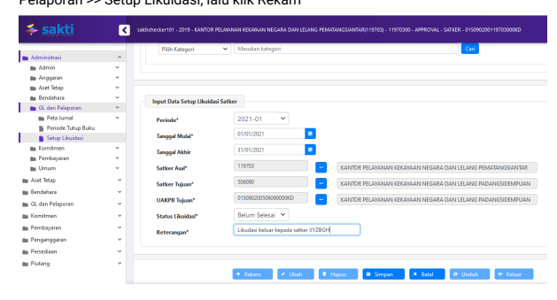
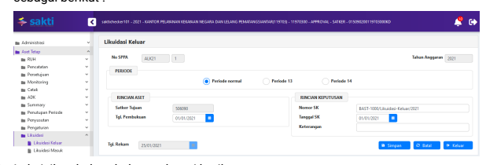
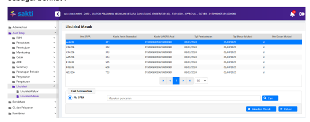

Petunjuk Teknis Aplikasi SAKTI
MODUL ASET TETAP
♦
→
→
♦

# Petunjuk Teknis Transaksi Bmn

## Likuidasi Aset Tetap

Likuidasi Keluar (Kode Transaksi *311, 312, 313, 314, 515, 608, 703)*
Menu Likuidasi Keluar digunakan untuk mencatat penyerahan semua aset tetap atau aset lainnya kepada UAKPB lain yang masih dalam satu entitas pelaporan akuntansi Pemerintah Pusat. Ilustrasi : Berdasarkan ketetapan pemerintah bahwa suatu satker dilakukan perubahan struktur organisasi yaitu terjadi perubahan kode satker dari satker A menjadi satker B. Maka perlu dilakukan proses likuidasi keluar atas aset tetap atau aset lainnya dari satker A ke satker B. Nama menu : Aset Tetap >> Likuidasi >> **Likuidasi Keluar** Beberapa hal yang perlu diperhatikan dalam proses likuidasi keluar yaitu : 1. Satker harus memastikan semua transaksi telah selesai direkam dan disetujui oleh approver.

2. Satker harus memastikan semua transaksi yang memerlukan pendetailan, memang telah dilakukan pendetailan, sehingga tidak boleh ada transaksi yang belum dilakukan pendetailan. Artinya semua transaksi harus dalam posisi sudah didetailkan semuanya.

3. Tanggal buku transaksi Likuidasi Keluar harus masih dalam periode bulan yang sama dengan periode bulan yang dipilih pada saat Setup Likuidasi dan masih dalam rentang antara tanggal mulai dan tanggal akhir yang telah direkam pada saat Setup Likuidasi.

4. Tanggal pembukuan transaksi Likuidasi Keluar harus sama atau lebih besar daripada tanggal pembukuan transaksi yang paling besar dari semua transaksi yang pernah direkam.

5. Satker memastikan semua transaksi Reklasifikasi Keluar telah ditindak lanjuti dengan transaksi Reklasifikasi Masuk sampai dengan status sudah sudah disetujui approver (jadi tidak boleh ada transaksi Reklasifikasi Keluar dengan status "menggantung")
6. Satker memastikan semua transaksi Transfer Masuk telah direkam dan telah disetujui oleh approver (jadi tidak boleh ada transaksi Transfer Masuk yang belum direkam)
Langkah perekaman transaksi Likuidasi Keluar ada 2 tahap yaitu : Pertama : Merekam setup likuidasi Kedua : Merekam transaksi Likuidasi Keluar Langkah perekaman Setup Likuiasi sebagai berikut : 1. Operator login menggunakan user Admin, lalu pilih menu Administrasi >> GL dan Pelaporan >> Setup Likuidasi, lalu klik Rekam

2. Lalu isikan kolom-kolom sebagai berikut :
1) Periode : diisi dengan periode bulan pembukuan transaksi likuidasi keluar 2) Tanggal Mulai dan Tanggal Akhir : diisi dengan range tanggal yang dapat dipilih sebagai tanggal buku transaksi likuidasi keluar, selama dalam periode bulan yang telah dipilih pada kolom sebelumnya 3) Satker Asal : dipilih satker asal atau satker pengirim atau satker yang mengalami likuidasi 4) Satker Tujuan : dipilih satker tujuan atau satker penerima aset tetap/aset lainnya 5) UAKPB Tujuan : dipilih UAKPB tujuan atau UAKPB penerima aset tetap/aset lainnya 6) Status Likuidasi : dipilih Sudah Selesai apabila semua modul telah selesai melakukan likuidasi keluar dan dipilih Belum Selesai apabila ada salah satu modul dari Modul Aset Tetap, Modul Persediaan dan Modul GLP ada yang belum selesai proses likuidasi keluar 7) Keterangan : diisi dengan penjelasan berupa keterangan yang diperlukan Langkah perekaman proses Likuidasi Keluar sebagai berikut : 1. Operator login menggunakan user operator Modul Aset Tetap, lalu pilih menu Aset Tetap >> Likuidasi >> Likuidasi Keluar, lalu klik Rekam, maka akan muncul tampilan sebagai berikut :

2. Lalu isikan kolom-kolom sebagai berikut :
1) Satker Tujuan : akan terisi otomatis dan disable sesuai dengan satker tujuan yang telah dipilih pada saat Setup Likuidasi. 

2) Tanggal Pembukuan : dipilih tanggal sesuai dengan dokumen sumber dan harus dalam rentang periode bulan dan antara tanggal mulai dan tanggal akhir sesuai yang direkam pada saat Setup Likuidasi 3) Nomor SK : diisi sesuai dengan nomor dokumen sumber, misalnya BAST Likuidasi atau dokumen sejenis 4) Tanggal SK : diisi dengan tanggal dokumen sumber, misalnya BAST Likuidasi atau dokumen sejenis 5) Keterangan : diisi dengan penjelasan singkat atau informasi singkat yang diperlukan 6) Klik Simpan

## Likuidasi Masuk (Kode Transaksi 131, 132, 133, 134, 516, 609, 704)

Menu Likuidasi Masuk digunakan untuk mencatat penerimaaan semua aset tetap atau aset lainnya, hasil kiriman dari UAKPB lain yang masih dalam satu entitas pelaporan akuntansi Pemerintah Pusat.

## Ilustrasi :

Berdasarkan ketetapan pemerintah bahwa suatu satker dilakukan perubahan struktur organisasi yaitu terjadi perubahan kode satker dari satker A menjadi satker B. Maka perlu dilakukan proses likuidasi keluar atas aset tetap atau aset lainnya dari satker A ke satker B. Sedangkan di satker B ketika menerima aset dari satker A dicatat melalui menu Likuidasi Masuk. Nama menu : Aset Tetap >> Likuidasi >> Likuidasi Masuk Langkah perekaman proses Likuidasi Masuk sebagai berikut : 1. Operator login menggunakan user operator Modul Aset Tetap, lalu pilih menu Aset Tetap >> Likuidasi >> Likuidasi Masuk, lalu klik Rekam, maka akan muncul tampilan sebagai berikut :

2. Lalu lakukan perekaman sebagai berikut :
1) Pilih salah satu transaksi Likuidasi Masuk 2) Lalu klik Likuidasi Masuk 3) Tanggal pembukuan Likuidasi Masuk akan dipilihkan secara otomatis oleh system dengan dua kondisi yaitu :
a) Tanggal pembukuan Likuidasi Masuk akan dipilihkan tanggal yang sama dengan tanggal pembukuan Likuidasi Keluar, apabila periode berkenaan masih buka.

b) Tanggal pembukuan Likuidasi Masuk akan dipilihkan ke bulan berikutnya dalam semester yang sama, apabila bulan berkenaan sudah tutup.