Petunjuk Teknis Aplikasi SAKTI
MODUL ASET TETAP
♦
→
→
♦

# Petunjuk Teknis Transaksi Persediaan

## Likuidasi Persediaan

Likuidasi Keluar Menu Likuidasi Keluar digunakan untuk mencatat penyerahan semua aset tetap atau aset lainnya dan Persediaan kepada UAKPB lain yang masih dalam satu entitas pelaporan akuntansi Pemerintah Pusat. Beberapa hal yang perlu diperhatikan dalam proses likuidasi keluar yaitu : 1. Satker harus memastikan semua transaksi telah selesai direkam dan disetujui oleh approver.

2. Satker harus memastikan semua transaksi yang memerlukan pendetailan, memang telah dilakukan pendetailan, sehingga tidak boleh ada transaksi yang belum dilakukan pendetailan. Artinya semua transaksi harus dalam posisi sudah didetailkan semuanya.

3. Tanggal buku transaksi Likuidasi Keluar harus masih dalam periode bulan yang sama dengan periode bulan yang dipilih pada saat Setup Likuidasi dan masih dalam rentang antara tanggal mulai dan tanggal akhir yang telah direkam pada saat Setup Likuidasi.

4. Tanggal pembukuan transaksi Likuidasi Keluar harus sama atau lebih besar daripada tanggal pembukuan transaksi yang paling besar dari semua transaksi yang pernah direkam.

5. Satker memastikan semua transaksi Reklasifikasi Keluar telah ditindak lanjuti dengan transaksi Reklasifikasi Masuk sampai dengan status sudah sudah disetujui approver (jadi tidak boleh ada transaksi Reklasifikasi Keluar dengan status "menggantung")
6. Satker memastikan semua transaksi Transfer Masuk telah direkam dan telah disetujui oleh approver (jadi tidak boleh ada transaksi Transfer Masuk yang belum direkam)
Langkah perekaman transaksi Likuidasi Keluar ada 2 tahap yaitu : Pertama : Merekam setup likuidasi Kedua : Merekam transaksi Likuidasi Keluar Langkah perekaman Setup Likuiasi sebagai berikut : 1. Operator login menggunakan user Admin, lalu pilih menu Administrasi >> GL dan 

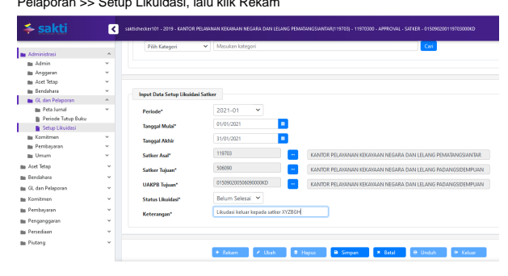

2. Lalu isikan kolom-kolom sebagai berikut :
1) Periode : diisi dengan periode bulan pembukuan transaksi likuidasi keluar 2) Tanggal Mulai dan Tanggal Akhir : diisi dengan *range* tanggal yang dapat dipilih sebagai tanggal buku transaksi likuidasi keluar, selama dalam periode bulan yang telah dipilih pada kolom sebelumnya 3) Satker Asal : dipilih satker asal atau satker pengirim atau satker yang mengalami likuidasi 4) Satker Tujuan : dipilih satker tujuan atau satker penerima aset tetap/aset lainnya 5) UAKPB Tujuan : dipilih UAKPB tujuan atau UAKPB penerima aset tetap/aset lainnya 6) Status Likuidasi : dipilih Sudah Selesai apabila semua modul telah selesai melakukan likuidasi keluar dan dipilih Belum Selesai apabila ada salah satu modul dari Modul Aset Tetap, Modul Persediaan dan Modul GLP ada yang belum selesai proses likuidasi keluar 7) Keterangan : diisi dengan penjelasan berupa keterangan yang diperlukan Langkah perekaman proses Likuidasi Keluar sebagai berikut : 1. Operator login menggunakan user operator Modul Aset Tetap, lalu pilih menu Aset 

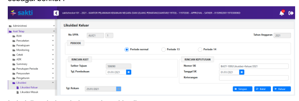

Tetap >> Likuidasi >> Likuidasi Keluar, lalu klik Rekam, maka akan muncul tampilan sebagai berikut :
2. Lalu isikan kolom-kolom sebagai berikut :
1) Satker Tujuan : akan terisi otomatis dan *disable* sesuai dengan satker tujuan yang telah dipilih pada saat Setup Likuidasi. 

2) Tanggal Pembukuan : dipilih tanggal sesuai dengan dokumen sumber dan harus dalam rentang periode bulan dan antara tanggal mulai dan tanggal akhir sesuai yang direkam pada saat Setup Likuidasi 3) Nomor SK : diisi sesuai dengan nomor dokumen sumber, misalnya BAST 
Likuidasi atau dokumen sejenis 4) Tanggal SK : diisi dengan tanggal dokumen sumber, misalnya BAST Likuidasi atau dokumen sejenis 5) Keterangan : diisi dengan penjelasan singkat atau informasi singkat yang diperlukan 6) Klik Simpan

## Likuidasi Keluar

Menu Likuidasi Keluar digunakan untuk mencatat penerimaaan semua barang persediaan, hasil kiriman dari UAKPB lain yang masih dalam satu entitas pelaporan akuntansi Pemerintah Pusat.

## Ilustrasi :

Berdasarkan ketetapan pemerintah bahwa suatu satker dilakukan perubahan struktur organisasi yaitu terjadi perubahan kode satker dari satker A menjadi satker B. Maka perlu dilakukan proses likuidasi keluar atas barang persediaan dari satker A ke satker B. Nama menu : Persediaan >> Transaksi Keluar >> Transfer Keluar Likuidasi UAKPB Ilustrasi : Berdasarkan ketetapan pemerintah bahwa suatu satker dilakukan perubahan struktur organisasi yaitu terjadi perubahan kode satker dari satker A menjadi satker B. Maka perlu dilakukan proses likuidasi keluar atas barang persediaan dari satker A ke satker B. 1. Setelah setup likuidasi di user admin sudah selesai dilakukan, maka pada user 

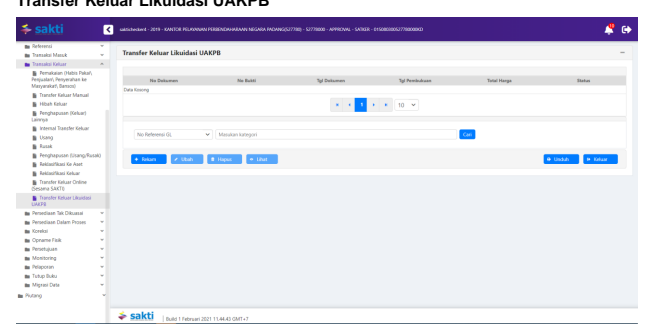 operator persediaan bisa masuk ke menu Persediaan >> Transaksi Keluar >> Transfer Keluar Likuidasi UAKPB 2. Klik tombol rekam, maka akan tampil form seperti dibawah ini. Silahakn isikan No 

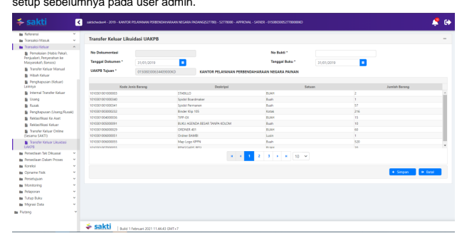 Bukti transaki likuidasi (Surat Ketetapan), serta memeriksa kesesuaian setup tanggal dokumen, tanggal buku serta kode UAKPB tujuan (kode satker tujuan) yang sudah di setup sebelumnya pada user admin.

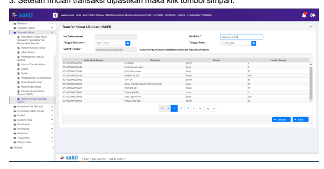

4. Dengan begitu proses likuidasi keluar sudah dilakukan perekamannya dan tinggal dilakuakn proses persetujuan di approval.

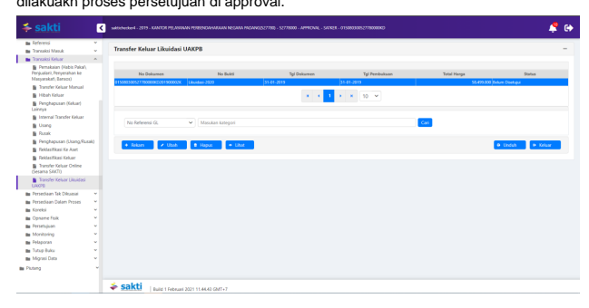

5. Masuk menggunakan user approval persediaan utuk melakukan proses persetujuan 

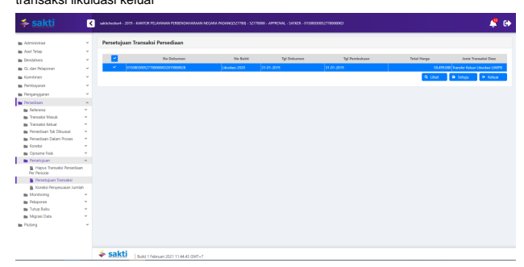 transaksi likuidasi keluar

## Likuidasi Masuk

Menu Likuidasi Masuk digunakan untuk mencatat penerimaaan semua barang persediaan, hasil kiriman dari UAKPB lain yang masih dalam satu entitas pelaporan akuntansi Pemerintah Pusat. Di satker B ketika menerima aset dari satker A dicatat melalui menu Likuidasi Masuk. Nama menu : Persediaan >> Transaksi Masuk **>> Transfer Masuk Likuidasi** UAKPB. 1. Pada user operator persediaan satker (UAKPB) tujuan, silahkan masuk pada menu 

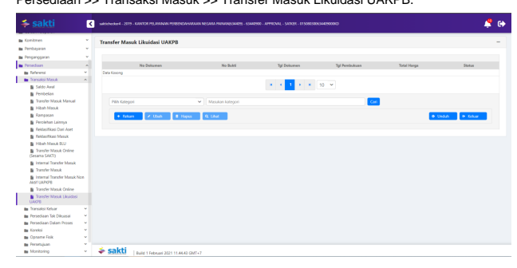 Persediaan >> Transaksi Masuk >> Transfer Masuk Likuidasi UAKPB. 

2. Kemudian Klik tombol rekam, maka akan ada pilihan transaksi likuidasi dari kode satker 
(UAKPB) yang sudah merekam transaksi transfer keluar likuidasi ke satker tujuan, silahkan 

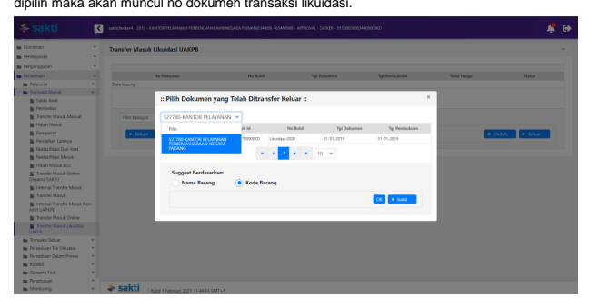 3. Setelah dipilih no dokumen transaksi transfer keluar likuidasi, maka silahkan klik tombol suggest berdasarkan nama barang **(dan mohon dipastikan untuk refrensi barang yang di** 
transfer keluar dari satker likuidasi sudah direkam terlebih dahulu di kode satker baru). 

Maka akan tampil form seperti dibawah ini. Pastikan semua kode barang dari satker likuidasi 

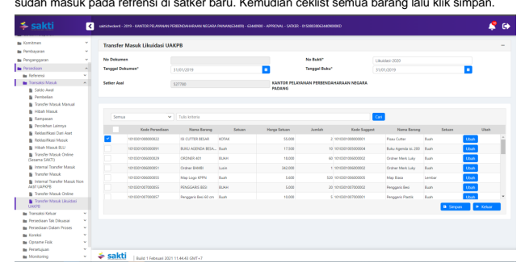

disetujui

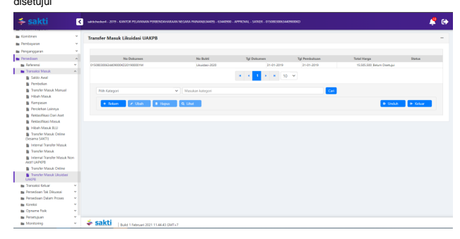

Setelah proses perekaman selesai, maka transaksi akan tersimpan dan statusnya belum 4. Masuk pada user approvall persediaan, untuk melakuakn proses persetujuan transaksi

transfer masuk likuidasi.

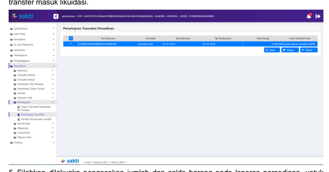

5. Silahkan dilakuakn pengecekan jumlah dan saldo barang pada laporan persediaan, untuk dibandingkan dengan bukti transaksi transfer keluar likuidasi dari satker asal.