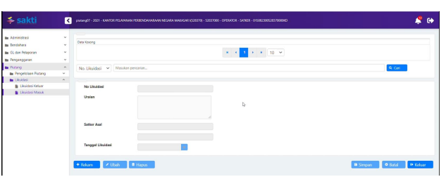

♦
Petunjuk Teknis Aplikasi SAKTI
×ODUL PIUTANG
♦
♦

# Petunjuk Teknis Transaksi Piutang

## Likuidasi Piutang Likuidasi Keluar

Menu Likuidasi Keluar digunakan untuk mencatat penyerahan semua Piutang kepada UAKPB lain yang masih dalam satu entitas pelaporan akuntansi Pemerintah Pusat. Beberapa hal yang perlu diperhatikan dalam proses likuidasi keluar yaitu : 1. Satker harus memastikan semua transaksi telah selesai direkam. 2. Tanggal buku transaksi Likuidasi Keluar harus masih dalam periode bulan yang sama dengan periode bulan yang dipilih pada saat Setup Likuidasi dan masih dalam rentang antara tanggal mulai dan tanggal akhir yang telah direkam pada saat Setup Likuidasi.

3. Tanggal pembukuan transaksi Likuidasi Keluar harus sama atau lebih besar daripada tanggal pembukuan transaksi yang paling besar dari semua transaksi yang pernah direkam.

4. Satker memastikan semua transaksi Transfer Masuk telah direkam. Langkah perekaman transaksi Likuidasi Keluar ada 2 tahap yaitu : Pertama : Merekam setup likuidasi Kedua : Merekam transaksi Likuidasi Keluar Langkah perekaman Setup Likuidasi sebagai berikut : 1. Operator login menggunakan user Admin, lalu pilih menu Administrasi >> GL dan 

Pelaporan >> Setup Likuidasi, lalu klik Rekam 2. Lalu isikan kolom-kolom sebagai berikut :
1) Periode : diisi dengan periode bulan pembukuan transaksi likuidasi keluar 1 2) Tanggal Mulai dan Tanggal Akhir : diisi dengan *range* tanggal yang dapat dipilih sebagai tanggal buku transaksi likuidasi keluar, selama dalam periode bulan yang telah dipilih pada kolom sebelumnya 3) Satker Asal : dipilih satker asal atau satker pengirim atau satker yang mengalami likuidasi 4) Satker Tujuan : dipilih satker tujuan atau satker penerima aset tetap/aset lainnya 5) UAKPB Tujuan : dipilih UAKPB tujuan atau UAKPB penerima aset tetap/aset lainnya 6) Status Likuidasi : dipilih Sudah Selesai apabila semua modul telah selesai melakukan likuidasi keluar dan dipilih Belum Selesai apabila ada salah satu modul dari Modul Aset Tetap, Modul Persediaan, Modul Piutang, dan Modul GLP ada yang belum selesai proses likuidasi keluar 7) Keterangan : diisi dengan penjelasan berupa keterangan yang diperlukan Langkah perekaman proses Likuidasi Keluar sebagai berikut : 1. Operator login menggunakan user operator Modul Piutang, lalu pilih menu Piutang

>> Likuidasi >> Likuidasi Keluar, lalu klik Rekam, maka akan muncul tampilan sebagai berikut :
2. Lalu isikan kolom-kolom sebagai berikut :
1) Uraian : diisi dengan uraian kegiatan likuidasi 2) Satker asal : klik tombol lookup, lalu pilih data likuidasi piutang sesuai dengan yang diinput pada saat setup likuidasi 3) Satker tujuan : akan otomatis terisi setelah memilih data pada lookup 

satker asal 4) Tanggal likuidasi : dipilih tanggal sesuai dengan dokumen sumber dan harus dalam rentang periode bulan dan antara tanggal mulai dan tanggal akhir sesuai yang direkam pada saat Setup Likuidasi 5) Klik simpan.

3. Maka data piutang yang telah dilikuidasi akan muncul pada tabel seperti di bawah.

## Likuidasi Masuk

Menu Likuidasi Masuk digunakan untuk mencatat penerimaaan semua data piutang hasil kiriman dari UAKPB lain yang masih dalam satu entitas pelaporan akuntansi Pemerintah Pusat. Di satker B ketika menerima piutang dari satker A dicatat melalui menu Likuidasi Masuk. 1. Pada user operator piutang satker (UAKPB) tujuan, silahkan masuk pada menu Piutang >> Likuidasi >> Likuidasi Masuk. 

2. Kemudian Klik tombol rekam, maka akan muncul daftar piutang yang akan dilikuidasi masuk.

3. Klik tombol likuidasi masuk, maka data piutang yang dilikuidasi masuk akan muncul pada 

tabel seperti berikut.

4. Silakan dilakukan pengecekan terhadap data piutang yang telah dilikuidasi masuk pada menu laporan, untuk dibandingkan dengan bukti transaksi transfer keluar likuidasi dari satker asal.