```
    KEMENTERIAN KEUANGAN REPUBLIK INDONESIA
        DIREKTORAT JENDERAL PERBENDAHARAAN
DIREKTORAT SISTEM INFORMASI DAN TEKNOLOGI PERBENDAHARAAN
GEDUNG PRIJADI PRAPTOSUHARDJO III LANTAI 3, JALAN DR. WAHIDIN II NOMOR 3, JAKARTA, 10710 TELEPON (021)
             3516976, 3524553 EXT. 5326 FAKSIMILE (021) 3516976


```

## Nota Dinas Nomor Nd-1865/Pb.8/2023

Yth. : 1. Para Kepala Kantor Wilayah Direktorat Jenderal Perbendaharaan

2. Para Kepala Kantor Pelayanan Perbendaharaan Negara

Dari : Direktur Sistem Informasi dan Teknologi Perbendaharaan Sifat : Sangat Segera Lampiran : Satu berkas Hal : Petunjuk Teknis Implementasi NPWP 16 Digit pada SPAN dan SAKTI Tanggal : 28 Desember 2023

Sehubungan dengan persiapan implementasi NPWP 16 digit pada SPAN dan SAKTI,
bersama ini disampaikan sebagai berikut:

```
1. Perubahan NPWP dari 15 menjadi 16 digit merupakan amanat UU Nomor 7 Tahun 2021
    tentang Harmonisasi Peraturan Perpajakan, Perpres Nomor 83 Tahun 2021 tentang
    Pencantuman dan Pemanfaatan Nomor Induk Kependudukan dan/atau Nomor Pokok Wajib
    Pajak dalam Pelayanan Publik, serta PMK Nomor 136 Tahun 2023 tentang Perubahan atas
    PMK Nomor 112/PMK.03/2022 tentang Nomor Pokok Wajib Pajak Orang Pribadi, Wajib Pajak
    Badan, dan Wajib Pajak Instansi Pemerintah.
2. Selanjutnya, berdasarkan pengumuman Direktur Penyuluhan, Pelayanan, dan Hubungan
    Masyarakat Direktorat Jenderal Pajak Nomor PENG-22/PJ.09/2023 tanggal 14 Desember
    2023, terhitung sejak 1 Januari 2024 layanan administrasi melalui SAKTI dan SPAN
    menggunakan NPWP 16 digit, sehingga Satker Instansi Pemerintah Pusat dan Wajib Pajak
    yang bertransaksi dengan Satker dimaksud untuk dapat menyesuaikan NPWP 16 digit.
3. Adapun layanan administrasi melalui SAKTI dan SPAN yang menggunakan NPWP 16 digit
    adalah sebagai berikut:
    a. Pelaksanaan pembayaran dengan mekanisme langsung, penyetoran PPh dilakukan
         dengan menggunakan Surat Perintah Pencairan Dana (SP2D) yang merupakan sarana
         administrasi lain yang disamakan dengan surat setoran pajak atas nama Instansi
         Pemerintah menggunakan NPWP format 16 digit melalui SPAN.
    b. Penerbitan SPM Kelebihan Pembayaran Pajak (SPMKP) dan SPM Imbalan Bunga
         (SPMIB) dalam aplikasi SAKTI; dan
    c. Penerbitan SPM dan SP2D dalam aplikasi SPAN.
4. Perubahan digit NPWP dari 15 menjadi 16 digit akan berdampak terhadap sistem informasi
    pada Direktorat Jenderal Perbendaharaan, yaitu:
    Pada SPAN:
    a. NPWP merupakan primary key yang digunakan untuk mengidentifikasi supplier yang
         masuk ke SPAN dan mengidentifikasi Kode Satker KPP agar data penerimaan pajaknya
         dapat ter-posting ke SPAN; dan
    b. Data supplier digunakan untuk proses bisnis pembayaran meliputi (pengelolaan supplier,
         manajemen kontrak dan penerbitan SP2D).
    Pada SAKTI:
    a. Berdampak major dan penyesuaian sistemnya relatif kompleks dan sistemik; dan
    b. Data supplier digunakan untuk proses bisnis pembayaran meliputi (pengelolaan supplier,
         manajemen kontrak dan penerbitan SPM).

5. Sebagai langkah tindak lanjut penyesuaian NPWP 16 digit pada SPAN dan SAKTI, dilakukan
    hal-hal sebagai berikut:
    Proses implementasi NPWP 16 digit pada SPAN:
    a. Dilakukan proses pemadanan/pasangan NPWP 16 digit atas NPWP 15 digit yang sudah
         terdaftar sebelumnya pada data supplier di SPAN. Proses pemadanan dilakukan secara
         terpusat oleh Direktorat SITP berdasarkan data yang disediakan oleh DJP pada Satu
         Layanan Data Kemenkeu (SLDK) dengan cut-off per tanggal 30 Desember 2023.
    b. Dilakukan proses open validation sebagai tindakan menonaktifkan validasi yang
         sebelumnya diterapkan pada NPWP 15 digit untuk memastikan kebenaran format,
         khususnya untuk digit 10 sampai dengan 12 yang merupakan Kode Satker KPP.
    Proses implementasi NPWP 16 Digit pada SAKTI:
    a. Dilakukan proses pemadanan NPWP secara terpusat pada aplikasi SAKTI melalui
         pengecekan NPWP lama (15 digit) ke sistem DJP kemudian menarik data NPWP 16 digit.
         Atas data supplier yang sudah memperoleh NPWP 16 digit, pengguna tidak perlu
         melakukan proses pendaftaran ulang karena data dimaksud sudah ter-update.
    b. Dalam hal saat proses pemadanan NPWP 16 digit tidak ditemukan, maka pengguna wajib
         melakukan penginputan NPWP 16 digit secara manual dan dilanjutkan dengan proses
         pendaftaran supplier ke KPPN mitra kerja.
6. Penjelasan lebih lanjut mengenai implementasi NPWP 16 Digit pada SPAN dan SAKTI adalah
    sebagaimana terlampir.
7. Sehubungan dengan hal-hal tersebut di atas, dengan ini diminta Saudara untuk memastikan
    proses penyesuaian data NPWP 16 digit terutama data supplier pada SPAN dan SAKTI pada
    Satker di wilayah kerja masing-masing agar dapat berjalan dengan baik dan lancar.

```

Demikian disampaikan, untuk dipedomani.

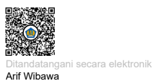

Tembusan: 1. Direktur Jenderal Perbendaharaan 2. Sekretaris Direktorat Jenderal Perbendaharaan 3. Para Direktur di Lingkungan Kantor Pusat Direktorat Jenderal Perbendaharaan

# Petunjuk Teknis Implementasi Npwp 16 Digit Pada Span

## A. Dasar Hukum

```
1. Undang-Undang nomor 7 tahun 2021 tentang Harmonisasi Peraturan Perpajakan/HPP
     a. pasal 2 ayat 1a yang menyatakan bahwa NPWP bagi Wajib Pajak Orang Pribadi
          yang merupakan penduduk Indonesia menggunakan Nomor Induk
          Kependudukan.
     b. Pasal 2 ayat 10 memberikan dasar interkoneksi data antara Direktorat Jenderal
          Pajak (DJP) dengan Kementerian Dalam Negeri dalam rangka penggunaan NIK
          sebagai NPWP, dimana menteri yang menyelenggarakan urusan pemerintahan
          dalam negeri memberikan data kependudukan dan data balikan dari pengguna
          kepada Menteri Keuangan untuk diintegrasikan dalam basis data perpajakan.

2. Peraturan Presiden nomor 83 tahun 2021 tentang Pencantuman dan Pemanfaatan
   Nomor Induk Kependudukan dan/atau Nomor Pokok Wajib Pajak dalam Pelayanan
   Publik.
3. Peraturan Menteri Keuangan nomor 136 Tahun 2023 tentang Perubahan atas Peraturan
   Menteri Keuangan Nomor 112/PMK.03/2022 tentang Nomor Pokok Wajib Pajak Orang
   Pribadi, Wajib Pajak Badan, dan Wajib Pajak Instansi Pemerintah. Pasal 2 ayat 6 yang
   menyatakan Nomor Pokok Wajib Pajak sebagaimana dimaksud pada ayat (1) dapat
   digunakan pada layanan administrasi perpajakan secara terbatas sampai dengan
   tanggal 30 Juni 2024.
4. Pengumuman Direktorat Jenderal Pajak nomor PENG-22/PJ.09/2023 tentang
   Penggunaan Nomor Induk Kependudukan Sebagai Nomor Pokok Wajib Pajak atau
   Nomor Pokok Wajib Pajak Dengan Format 16 (Enam Belas) Digit Secara Terbatas pada
   Sistem Aplikasi Keuangan Tingkat Instansi dan Sistem Perbendaharaan dan Anggaran
   Negara.

```

## B. Latar Belakang

Berdasarkan peraturan sebagaimana poin A, penggunaan NPWP 16 digit secara terbatas sampai dengan tanggal 30 Juni 2024, termasuk dalam penggunaan secara terbatas diantaranya penggunaan NPWP 16 digit dalam layanan administrasi melalui SAKTI dan SPAN, yang dilaksanakan terhitung mulai tanggal 1 Januari 2024. Perubahan digit NPWP dari 15 menjadi 16 digit akan berdampak terhadap sistem informasi

 pada Direktorat Jenderal Perbendaharaan, termasuk SPAN, yaitu:
a. NPWP merupakan primary key yang digunakan untuk mengidentifikasi *supplier* yang masuk ke SPAN dan mengidentifikasi kode satker KPP agar data penerimaan pajaknya dapat ter-*posting* ke SPAN;

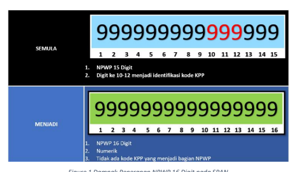

b. Data *supplier* digunakan untuk proses bisnis pembayaran meliputi (pengelolaan supplier, manajemen kontrak dan penerbitan SP2D).

Figure 1 Dampak Penerapan NPWP 16 Digit pada SPAN

## C. Ruang Lingkup Perubahan Pada Span 1. Pemadanan Dan Update Data Npwp

```
Pemadanan merupakan proses mencari padanan/ pasangan NPWP 16 digit atas NPWP 15
digit yang sudah terdaftar sebelumnya pada data supplier di SPAN. Proses pemadanan
dilakukan secara terpusat oleh Direktorat SITP berdasarkan data yang disediakan oleh DJP
pada Satu Layanan Data Kemenkeu (SLDK) dengan cut-off per tanggal 30 Desember 2023.
Hasil dari proses pemadanan adalah:

```

1) Berhasil, yaitu kondisi **ditemukannya** padanan NPWP 16 digit atas NPWP 15 digit eksisting serta telah dilakukan tindakan pembaruan pada basis data.

2) Gagal, yaitu kondisi tidak **ditemukannya** padanan NPWP 16 digit atas NPWP 15 digit eksisting sehingga tidak dapat dilakukan tindakan pembaruan pada basis data.

3) Pemadanan dan update data NPWP juga dilakukan pada supplier yang memiliki lebih dari 1 NRS sebagai akibat dari penghapusan NPWP cabang. Proses penggabungan tersebut akan melalui menu Merge Supplier pada aplikasi SPAN secara terpusat.

4) Proses penggabungan sebagaimana pada angka 3 akan menghasilkan status berhasil/match dan tidak berhasil/unmatch. 

5) Selain pada data *supplier,* pemadanan NPWP juga dilakukan terhadap data kontrak multiyear yang masih aktif dan SPM TA 2023 yang belum selesai (menggantung) sampai dengan tahun anggaran berakhir.

6) Penggunaan dan tindak lanjut dari hasil penggabungan sebagaimana tersebut di atas memerlukan petunjuk teknis untuk mendukung kelancaran pelaksanaannya di KPPN.

## 2. Open Validation

Open *validation* merupakan tindakan menonaktifkan validasi yang sebelumnya diterapkan pada NPWP 15 digit untuk memastikan kebenaran format, khususnya untuk digit 10 sampai dengan 12 yang merupakan kode KPP.

Untuk mendukung kelancaran pelaksanaan implementasi NPWP 16 digit paska *golive* di aplikasi SPAN perlu diperhatikan hal-hal sebagai berikut:
1. Terkait data *supplier*

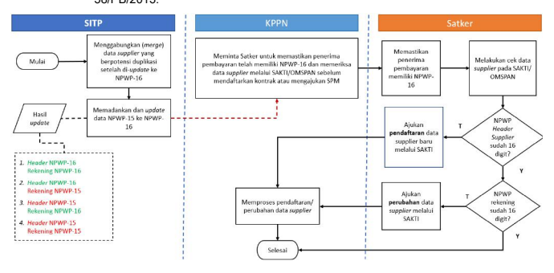

a. KPPN agar meminta Satker untuk memastikan penerima pembayaran telah memiliki NPWP 16 digit dan memeriksa data *supplier* melalui SAKTI/ OMSPAN sebelum mendaftarkan kontrak atau mengajukan SPM.

b. Jika NPWP pada informasi pokok (header) *supplier* masih berupa NPWP 15 digit, maka Satker harus mendaftarkan kembali *supplier* tersebut dengan NPWP 16 digit ke KPPN.

c. Jika NPWP pada informasi pokok (header) *supplier* sudah 16 digit namun NPWP pada informasi rekening tambahan masih 15 digit, maka Satker dapat mengajukan perbaikan ke KPPN dengan mekanisme perubahan data *supplier.*
d. Mekanisme pendaftaran dan perubahan data *supplier* mengikuti ketentuan dalam PER58/PB/2013.

```
2. Terkait data kontrak multiyear dan SPM dalam proses
    a. KPPN melakukan identifikasi kontrak multiyear yang masih aktif serta SPM dalam
        proses (khusus KPPN KPH) yang masih menggunakan NPWP 15 digit, kemudian
        hasilnya dikonfirmasi kepada Satker terkait.
    b. Atas dasar hasil identifikasi dari KPPN, Satker melakukan konfirmasi kepada Penyedia/
        Pihak Terkait untuk memperoleh NPWP 16 digit-nya.
    c. Jika Penyedia/ Pihak Terkait tidak memiliki/ mengetahui NPWP 16 digit-nya, Satker
        dapat mengarahkan Penyedia/ Pihak Terkait untuk dapat mengakses laman Direktorat
        Jenderal Pajak (DJP), menghubungi contact center DJP, atau Kantor Pelayanan Pajak
        (KPP) tempat Wajib Pajak terdaftar.
    d. Jika Penyedia/ Pihak Terkait telah memiliki NPWP 16 digit maka Satker dapat
        mendaftarkan kembali supplier tersebut dengan NPWP 16 digit ke KPPN.
    e. KPPN memproses pendaftaran supplier yang diajukan Satker.
    f. Setelah pendaftaran supplier berhasil diproses KPPN, Satker kemudian mengajukan
        permohonan penggabungan data supplier dari supplier yang lama (NPWP 15 digit) ke
        supplier baru (NPWP 16 digit) ke KPPN.

```

g. KPPN meneruskan permohonan penggabungan supplier dari Satker ke Dit. SITP
melalui HAI-DJPb untuk diproses lebih lanjut.

h.   Mekanisme pendaftaran dan penggabungan supplier mengikuti ketentuan dalam PER-

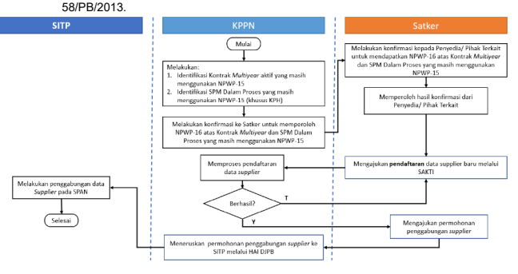

3. Rangkuman kondisi NPWP penerima pada rekening supplier (tipe 3, 5 dan 6) dan penggunaannya sebagai berikut

| Kondisi NPWP   | KONTRAK       |             |    |    |
|----------------|---------------|-------------|----|----|
| PMRT/SPM       | BCSR/REGISTER | BCSU/UPDATE |    |    |
| Kosong         | x             | x           | x  | X  |
| Tidak          |               |             |    |    |
| v              | V*            | x           |    |    |
| Diperkenankan* |               |             |    |    |
| v              | v             | v           | v  |    |
| 15 Digit       | v             | x           | x  | x  |

* Tidak sesuai dengan PMK no 136 tahun 2023 dan pengumuman DJP no PENG-22/PJ.09/2023, dapat mengakibatkan data yang sudah valid berubah menjadi dummy Untuk penggunaan BCSR atau pendaftaran supplier (pendaftaran rekening baru) agar diupayakan semaksimal mungkin menggunakan NPWP baru tidak menggunakan dummy sejalan dengan maksud pada PMK nomor 136 tahun 2023 untuk full implementasi NPWP 16 digit pada 1 Juli 2024 LAMPIRAN II
Nota Dinas Direktur Sistem Informasi dan Teknologi Perbendaharaan Nomor : Tanggal : 

# Petunjuk Teknis Implementasi Npwp 16 Digit Pada Sakti

## A. Pemadanan Npwp 16 Digit

Dalam rangka mendukung penerapan NPWP 16 digit, pada aplikasi SAKTI telah dilakukan pemadanan NPWP secara terpusat. Pemadanan dimaksud melakukan pengecekan NPWP lama (15 digit) ke sistem DJP kemudian menarik data NPWP 16 digit. Atas data supplier yang sudah memperoleh NPWP 16 digit, pengguna tidak perlu melakukan proses pendaftaran ulang karena data dimaksud sudah terupdate.

Dalam hal saat proses pemadanan NPWP 16 digit tidak ditemukan, maka pengguna wajib melakukan penginputan NPWP 16 digit secara manual dan dilanjutkan dengan proses pendaftaran supplier ke KPPN mitra kerja.

## A.1. Dasar Hukum

1. Undang-Undang nomor 7 tahun 2021 tentang Harmonisasi Peraturan Perpajakan/HPP 
a. Pasal 2 ayat 1a yang menyatakan bahwa NPWP bagi Wajib Pajak Orang Pribadi yang merupakan penduduk Indonesia menggunakan Nomor Induk Kependudukan. 

b. Pasal 2 ayat 10 memberikan dasar interkoneksi data antara Direktorat Jenderal Pajak (DJP) dengan Kementerian Dalam Negeri dalam rangka penggunaan NIK
sebagai NPWP, dimana menteri yang menyelenggarakan urusan pemerintahan dalam negeri memberikan data kependudukan dan data balikan dari pengguna kepada Menteri Keuangan untuk diintegrasikan dalam basis data perpajakan.

2. Peraturan Presiden nomor 83 tahun 2021 tentang Pencantuman dan Pemanfaatan Nomor Induk Kependudukan dan/atau Nomor Pokok Wajib Pajak dalam Pelayanan Publik. 

3. Peraturan Menteri Keuangan nomor 136 Tahun 2023 tentang Perubahan atas Peraturan Menteri Keuangan Nomor 112/PMK.03/2022 tentang Nomor Pokok Wajib Pajak Orang Pribadi, Wajib Pajak Badan, dan Wajib Pajak Instansi Pemerintah. 

PEMADANAN NPWP 16 DIGIT


4. Pengumuman Direktorat Jenderal Pajak nomor PENG-22/PJ.09/2023 tentang Penggunaan Nomor Induk Kependudukan Sebagai Nomor Pokok Wajib Pajak atau Nomor Pokok Wajib Pajak Dengan Format 16 (Enam Belas) Digit Secara Terbatas pada Sistem Aplikasi Keuangan Tingkat Instansi dan Sistem Perbendaharaan dan Anggaran Negara.

## A.2. Latar Belakang

Serangkaian peraturan sebagaimana poin A.1. telah mengamanatkan penggunaan NPWP 16 digit secara terbatas sampai dengan tanggal 30 Juni 2024. Termasuk dalam penggunaan secara terbatas itu adalah penggunaan NPWP 16 digit dalam layanan administrasi melalui SAKTI dan SPAN terhitung mulai tanggal 1 Januari 2024. 

Perubahan digit NPWP dari 15 menjadi 16 digit akan berdampak signifikan terhadap sistem informasi pada Direktorat Jenderal Perbendaharaan, termasuk SAKTI, yaitu:
a. Berdampak major dan penyesuaian sistemnya relatif kompleks dan sistemik; b. Data *supplier* digunakan untuk proses bisnis pembayaran meliputi (pengelolaan

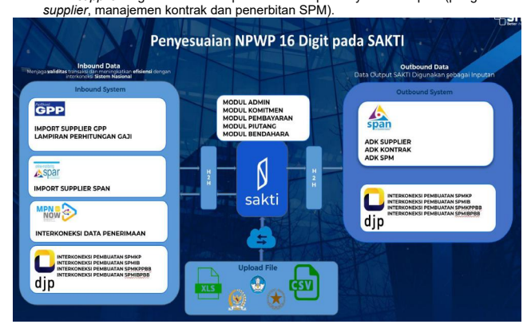

B. ALUR PEMADANAN NPWP 16 DIGIT

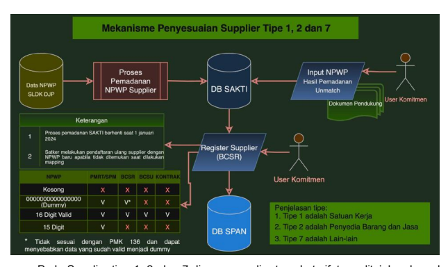

Pada Supplier tipe 1, 2, dan 7 dimana supplier tersebut sifatnya ditujukan kepada satu penerima, proses pemadanan dilakukan pada level Supplier Header. Proses pemadanan dilakukan secara terpusat pada aplikasi SAKTI. Namun setelah proses pemadanan tidak ditemukan NPWP 16 digit (Unmatch), pengguna dapat melakukan perekaman NPWP 16  digit secara manual pada Supplier Header terkait dilanjutkan dengan proses pembentukan ADK untuk diproses KPPN mitra kerja.

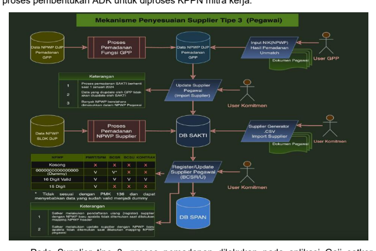

Pada Supplier tipe 3, proses pemadanan dilakukan pada aplikasi Gaji satker.

Apabila pemadanan pada aplikasi Gaji tidak menemukan NPWP 16 digit supplier terkait, maka pengguna dapat melakukan update data secara manual pada aplikasi Gaji. Atas pemadanan tersebut kemudian dilakukan Import pada aplikasi SAKTI. Dalam hal data

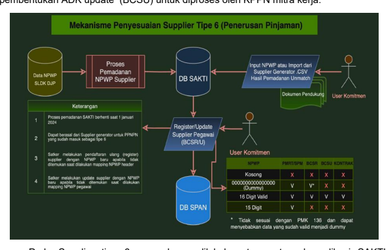 supplier tipe 3 tidak berasal dari aplikasi Gaji, maka pengguna dapat melakukan penyesuaian menggunakan ADK pegawai manual (SUPPUxxxxxxyyyymmdd.zip). Atas penyesuaian data NPWP supplier tipe 3, pengguna agar melanjutkan ke proses pembentukan ADK update (BCSU) untuk diproses oleh KPPN mitra kerja.

Pada Supplier tipe 6, pemadanan dilakukan terpusat pada aplikasi SAKTI.

Pemadanan dilakukan pada tab supplier banyak penerima. Dalam hal data NPWP 16 digit tidak ditemukan saat proses pemadanan, pengguna dapat melakukan update menggunakan mekanisme input manual ataupun menggunakan ADK update data supplier. Setelah dilakukan update, pengguna agar melanjutkan dengan proses pembentukan ADK BCSU untuk diproses KPPN mitra kerja.

Pada supplier tipe 4 dan 5, Dimana tipe supplier ini merupakan supplier banyak

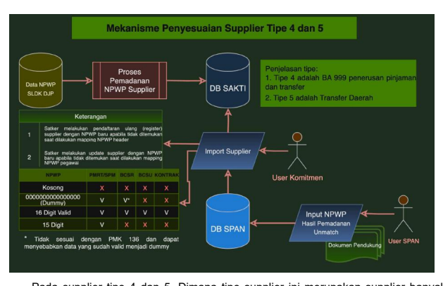

penerima, proses pemadanan NPWP 16 digit dilakukan secara terpusat pada aplikasi SAKTI dan SPAN. Dalam hal saat dilakukan pemadanan tidak ditemukan data NPWP 16 digit, maka user SPAN dapat melakukan input manual pada aplikasi SPAN. Pada aplikasi SAKTI, pengguna melakukan import data supplier melalui interkoneksi SPAN sehingga data supplier dapat terupdate.

## C. Proses Perekaman Npwp 16 Digit Manual Pada Aplikasi Sakti

Apabila pada saat proses pemadanan NPWP 16 digit yang dilakukan secara terpusat gagal, Pengguna dapat melakukan perekaman NPWP 16 digit secara manual pada aplikasi SAKTI. Atas perekaman tersebut, dilanjutkan dengan proses pendaftaran supplier ke KPPN mitra kerja agar data supplier dapat terdaftar pada aplikasi SPAN. Terdapat beberapa titik perekaman NPWP 16 digit pada aplikasi SAKTI, antara lain:

## C.1 Perekaman Npwp 16 Digit Pada Supplier Header

Dalam hal pemadanan NPWP pada level supplier header gagal, maka kolom NRS,
kolom NPWP, dan Kode Supplier pada tab Supplier Header akan berubah menjadi kosong sehingga perlu dilakukan perekaman secara manual. Untuk melakukan perekaman data NPWP 16 digit pada level Supplier Header, Bapak/Ibu

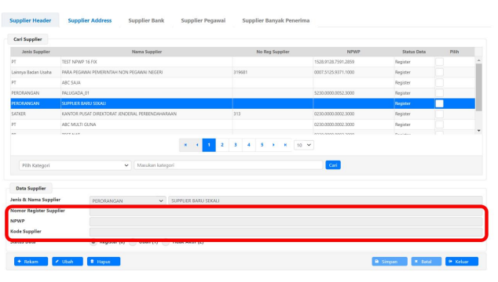 dapat melakukan Langkah berikut:
a. Pilih Supplier Header terkait;

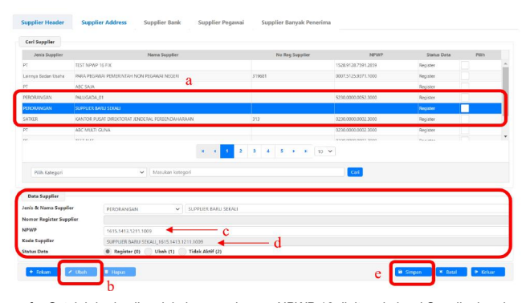 b. Klik tombol ubah; c. Masukkan NPWP 16 digit supplier terkait pada kolom NPWP; d. Untuk kolom Kode Supplier akan terbentuk secara otomatis setelah NPWP diinput; e. Lanjutkan dengan simpan; f. Setelah berhasil melakukan perekaman NPWP 16 digit pada level Supplier header, lanjutkan dengan proses pendaftaran supplier ke KPPN mitra kerja; g. Kolom NRS akan otomatis terisi setelah proses pendaftaran supplier berhasil dilakukan oleh KPPN mitra kerja; h. Dalam hal pendaftaran supplier berhasil diproses oleh KPPN mitra kerja namun Nomor Register Supplier tidak terupdate secara otomatis, Pengguna dapat melakukan pencatatan Nomor Register Supplir (NRS) secara manual.

## C.2 Perekaman Npwp 16 Digit Pada Supplier Pegawai

Dalam hal proses pemadanan pada supplier pegawai gagal dilakukan karena data NPWP 16 digit tidak ditemukan, data NPWP pada tab supplier pegawai akan berubah menjadi kosong. Untuk melakukan perekaman NPWP 16 digit secara manual pada supplier pegawai, dapat dilakukan dengan langkah berikut:

## C.2.1. Update Melalui Interkoneksi Gpp Terpusat

Dilakukan apabila data pegawai sudah dilakukan update NPWP 16 digit pada aplikasi Gaji Terpusat namun pemadanan pada aplikasi SAKTI gagal. Agar NPWP supplier pegawai dapat diupdate, pengguna dapat melakukan Langkah berikut:
a. Masuk ke menu Komitmen  Upload / Import  Import GPP Terpusat;

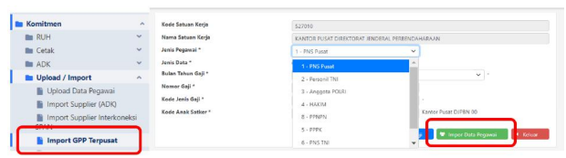

b. Lakukan import data Pegawai; c. Setelah import berhasil dilakukan, lanjutkan dengan membuka menu Supplier d. Pilih Supplier Header terkait, kemudian pindah ke tab Supplier Address; e. Pilih Supplier Address tipe 3, kemudian pindah ke tab Supplier Pegawai; f. Pada tab Supplier Pegawai, Pilih pegawai yang akan di update data NPWPnya g. Klik Ubah kemudian Simpan, sehingga status Supplier berubah menjadi Ubah;

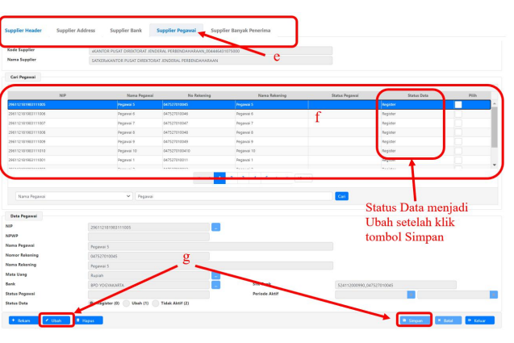


## C.2.2. Update Melalui Adk Supplier Manual (Suppxxxxxx)

Dilakukan apabila data pegawai tidak bersumber dari aplikasi gaji web. Berikut Langkah untuk melakukan proses update dimaksud: a. Melakukan pembentukan ADK Supplier manual dan menyimpan file dengan

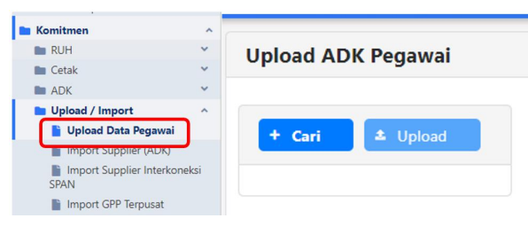

penamaan SUPPUxxxxxxyyyymmdd.zip (xxxxxx = kode satker, yyyy = tahun anggaran, mm = bulan pembuatan adk, dd = tanggal pembuatan adk);
b. Melakukan upload ADK SUPPU dimaksud melalui menu Komitmen  Upload /
Import  Upload Data Pegawai; d. Setelah berhasil melakukan upload ADK, lanjutkan dengan pengecekan kesesuaian data pada form Supplier; e. Lanjutkan dengan pembentukan ADK BCSU melalui user PPK
* Pembentukan ADK SUPPUxxxxxxyyyymmdd.zip dapat berpedoman pada petunjuk teknis terkait ( https://linktr.ee/CSVSAKTI )
C.3 Perekaman NPWP 16 digit pada supplier banyak penerima (Tipe 6)
Dalam hal proses pemadanan pada supplier banyak penerima (PPNPN/penerima beasiswa/penerima bantuan) gagal dilakukan karena data NPWP 16 digit tidak ditemukan, data NPWP pada tab supplier banyak penerima akan berubah menjadi kosong. Untuk melakukan perekaman NPWP 16 digit secara manual pada supplier banyak penerima, dapat dilakukan dengan Langkah berikut:

## C.3.1. Update Secara Manual

a. Masuk ke menu Komitmen  RUH  Supplier, kemudian pilih supplier header

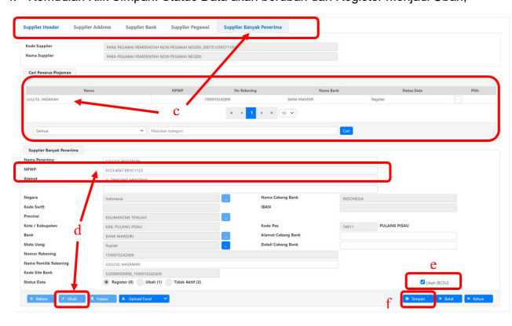

terkait; b. Pindah ke tab Supplier Address, kemudian pilih Supplier Address terkait (supplier tipe 6);
c. Klik tab Supplier Banyak Penerima, kemudian pilih supplier yang akan diupdate NPWP 16 digit; d. Klik Ubah, kemudian input data NPWP 16 digit pada kolom NPWP; e. Lanjutkan dengan centang checkbox Ubah (BCSU); f. Kemudian Klik Simpan. Status Data akan berubah dari Register menjadi Ubah; g. Lanjutkan dengan proses pembentukan ADK BCSU melalui user PPK.

C.3.2. Update Menggunakan ADK
a. Lakukan pembentukan ADK supplier banyak penerima;

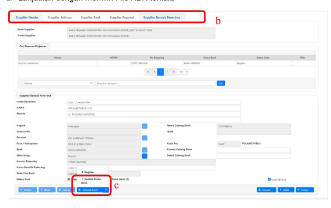

b. Masuk ke menu Supplier, tab Supplier Banyak Penerima; c. Klik tombol Upload Excel dan Pilih Update Status Data; d. Lanjutkan dengan memilih File ADK terkait; e. Setelah proses upload berhasil, lanjutkan dengan proses pembentukan ADK BCSU
melalui user PPK.

# D. Penyesuaian Data Kontrak Pasca Implementasi Npwp 16 Digit

Setelah penerapan implementasi NPWP 16 digit dilakukan, Pengguna agar melakukan penyesuaian data kontrak sehingga menggunakan Supplier dengan NPWP 16 digit. Dalam hal pemadanan secara terpusat berhasil dilakukan, maka pengguna tidak perlu melakukan apapun karena data supplier pada kontrak baik di sisi SAKTI maupun SPAN sudah diupdate dan sama. Apabila saat pemadanan dilakukan tidak ditemukan NPWP 16 digit, maka pengguna melakukan update secara manual kemudian melakukan pembentukan ADK BCSR/OTP ADK Supplier untuk diproses oleh KPPN mitra kerja.

Dalam hal terdapat data kontrak Multi Years yang masih berlanjut, kontrak Pra DIPA,
ataupun transaksi RPATA yang dilanjutkan melewati implementasi NPWP 16 digit, perlu dilakukan penyesuaian data.

## D.1 Penyesuaian Data Pada Kontrak Multi Years

Dalam hal pemadanan terpusat berhasil dilakukan, maka pengguna tidak perlu melakukan update kembali karena data di sisi satker dan KPPN sudah sama. Namun apabila update dilakukan secara manual, maka perlu dilakukan proses pendaftaran supplier ke KPPN mitra kerja, dilanjutkan dengan proses merge supplier sehingga data supplier lama (NPWP 15 digit) dilebur ke data supplier baru (NPWP 16 digit).

## D.2 Penyesuaian Data Pada Kontrak Pra Dipa/Rpata

Dalam hal pemadanan berhasil dilakukan, maka pengguna tidak perlu melakukan update kembali karena data di sisi satker dan KPPN sudah sama. Apabila Update dilakukan secara manual, maka pengguna melanjutkan dengan proses pendaftaran supplier ke KPPN mitra kerja, kemudian melakukan ubah data kontrak terkait. Setelah data kontrak terkait menggunakan data supplier dengan NPWP 16 digit, untuk kontrak Pra DIPA 
dapat dilanjutkan dengan proses pendaftaran kontrak ke KPPN. Untuk RPATA, dapat dilanjutkan proses perekaman BAST RPATAnya.

## E. Monitoring Data Pemadanan

Untuk mempermudah pengecekan data supplier atas proses pemadanan NPWP 16 digit yang dilakukan secara terpusat, telah disiapkan fitur Monitoring Data Pemadanan NPWP 16 Digit. Fitur dimaksud dapat diakses melalui menu Komitmen → Monitoring Data Pemadanan NPWP 16 Digit.

| Beranda                           |                            |                  |                         |                            |
|-----------------------------------|----------------------------|------------------|-------------------------|----------------------------|
| Dashboard                         |                            |                  |                         |                            |
| Anggaran                          |                            |                  |                         |                            |
| Komitmen                          | Komitmen                   |                  |                         |                            |
| Bendahara                         | >                          | o                | Daftar Kontrak          | Keterlambatan Penyelesaian |
| Kontrak (Belum BAST)              |                            |                  |                         |                            |
| Keterlambatan Pembayaran          | Keterlambatan Pembayaran   |                  |                         |                            |
| o                                 | BAST Kontraktual (Belum    | o                | BAST Kontraktual (Sudah |                            |
| SP)                               | SP)                        |                  |                         |                            |
| Monitoring Pengiriman Data        | Monitoring Pembayaran      |                  |                         |                            |
| o                                 | o                          |                  |                         |                            |
| Realisasi Kinerja Satker          | BAST KKP                   |                  |                         |                            |
| Monitoring Pembayaran             | Monitoring SPBy Belum      |                  |                         |                            |
| o                                 | o                          |                  |                         |                            |
| BAST Belum SPBY                   | Input P3DN                 |                  |                         |                            |
| Monitoring BAST Kontraktual       |                            |                  |                         |                            |
| Monitoring BAST                   |                            |                  |                         |                            |
| o                                 | Nonkontraktual Belum Input | Belum Input P3DN |                         |                            |
| P3DN                              |                            |                  |                         |                            |
| Monitoring SPP Belum Input        | Monitoring Data Kontrak    |                  |                         |                            |
| o                                 | o                          |                  |                         |                            |
| P3DN                              | RPATA                      |                  |                         |                            |
| Monitoring Data Pemadanan NPWP 16 |                            |                  |                         |                            |
| Digit                             |                            |                  |                         |                            |

Penjelasan atas Petunjuk Teknis Mitigasi Dampak Implementasi NPWP 16 Digit Pada SPAN Pasca Go-Live (1 Januari 2024)
Direktorat SITP


Desember 2023 I. Alur Tindak Lanjut Pemadanan dan Update NPWP 16 Digit A.

 Kontrak multiyears dan SPM dalam Proses II. Penjelasan Data Supplier dan penggunaannya A.

 Data supplier 


B.

 Struktur Data Supplier B.

 Penyesuaian Atribut Rekening E.

 Transisi dan Ruang Lingkup Mitigas Dampak C.

 Open Validation/ Penyesuaian Validasi SPAN
D.

 Mitigasi Transaksi Pasca Pemadanan NPWP
F.

 Dukungan Pasca Pemadanan

# Outline Alur Tindak Lanjut Pemadanan Dan Update Npwp 16 Digit - **Data Supplier** 


- **Kontrak multiyears dan SPM dalam Proses**


Memastikan

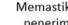

penerima

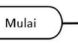


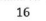

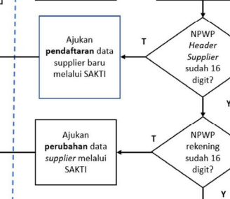

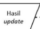

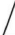

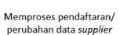

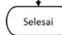


## Kppn Satker

 Sitp

Menggabungkan (merge)
data supplier yang berpotensi duplikasi

 setelah di-update ke NPWP-16 Meminta Satker untuk memastikan penerima pembayaran telah memiliki NPWP-16 dan memeriksa data supplier melalui SAKTI/OMSPAN sebelum mendaftarkan kontrak atau mengajukan SPM
Melakukan cek data supplier pada SAKTI/
OMSPAN
pembayaran memiliki NPWP-
Memadankan dan update data NPWP-15 ke NPWP-
16 1.  Header NPWP-16 Rekening NPWP-16 2.  Header NPWP-16 Rekening NPWP-15 3.  Header NPWP-15 Rekening NPWP-16 4.  Header NPWP-15 Rekening NPWP-15
-
-

-
-
-
-
-
-
-
-
i l
-

-

-


# Kontrak Multiyears Dan Spm Dalam Proses

## Sitp

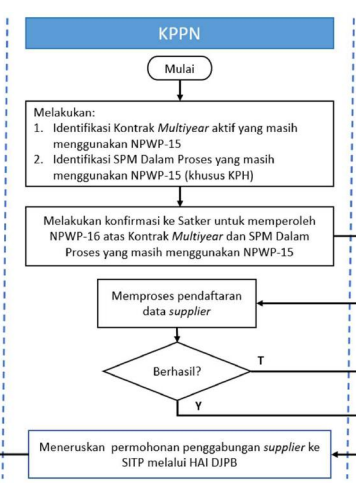

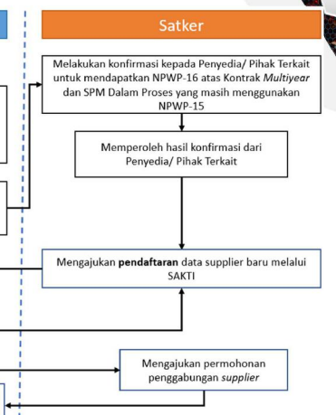

Melakukan penggabungan data Supplier pada SPAN

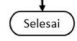

Penjelasan Data Supplier dan penggunaannya


- **Hasil Pasca Pemadanan**
- **Penggunaan** - Penyesuaian

# A **Struktur Data Supplier**


Kompenen Seluruh Tipe Supplier Primary Key


Mandatory 16 Digit Target Pemadanan Data Header Supplier (Informasi Pokok Supplier)
1. Nomor Register Supplier (NRS) 2. Nama Supplier **3. NPWP** 1. Nama Site 2. Tipe Supplier 3. Alamat 4. Kabupaten 5. Provinsi 6. Kode Pos 7. Negara 8. Nomor Telepon dan Alamat Email 9. Kode KPPN
Site Supplier (Informasi Lokasi Supplier)
Bank Supplier (Informasi Rekening Supplier)


1. Negara Bank 2. Nama Bank 3. Kode Bank 4. Nomor Rekening 5. Nama Cabang Bank 6. Nama Pemilik Rekening 7. Mata Uang 8. Kode SWIFT 9. Kode IBAN
Additional Bank Information (Informasi Rekening Tambahan)
1. Nama Pegawai/Pemerintah Daerah/Pengguna Dana 2. NPWP **3. NIP 4. Lokasi 5.** 
Alamat 6. Kabupaten/kota 7. Provinsi 8. Kode Pos 9. Negara Tambahan untuk Tipe 3,5,6 Non-Primary Key Mandatory 16 Digit/ NIK
Target Pemadanan Data


Transisi dan Ruang Lingkup Mitigas DampakSPAN
Transisi 1 Januari 2024 sd 30 Juni 2024 (layanan terbatas)
Go-Live Post Go Live **Implementasi Mitigasi Dampak**

- Validitas Data Entitas/ Header - **Validitas Data Penerima**

- **Mitigasi Implementasi NITKU**

Pemadanan Data 

NPWP

 Pemadanan Mandiri (DJP Online)
b.

 Pendaftaran Supplier (BCSU_SAKTI)
Data Supplier 1.

 Merge Supplier Verhasil 2.

 Merge Supplier Invalid
(bantuan haidjpb/ agent)
Data Kontrak Multiyears 1.

 Data Valid, Multy year harus kontrak dengan 16 Digit 2.

 Data Tidak valid, memperoleh 16 digit dan mendaftarkan.

Transaksi/ SPM
Open Validation Post Implementasi Data NPWP
1. Cond 1: Data Valid 2. Cond 2: Tidak Valid a.

Full Implementasi NPWP 16 Digit per 1 Juli 2024
- Penyesuaian 15 ke 16 Digit - **Tracing/ Rekonfirmasi Validasi** 
Standar pada SPAN
Open Validation orang pribadi yang merupakan penduduk Indonesia menggunakan Nomor Induk Kependudukan Pasal 2 ayat (6): NPWP 16 digit dapat digunakan **pada layanan administrasi perpajakan**
secara terbatas sampai dengan tanggal 30 Juni 2024. **UU HPP berlaku sejak tanggal diundangkan yaitu 29 Oktober 2021**
Saat implementasi NIK sebagai NPWP
Dasar Hukum UU Harmonisasi Peraturan Perpajakan No.7 Tahun 2021 Pasal 44E ayat (2) UU HPP: Penggunaan NIK sebagai NPWP akan diatur dengan Peraturan Menteri Keuangan Pasal 11 PMK-136/2023: NIK dan NPWP 16 digit berlaku sepenuhnya terhitung sejak 1 Juli 2024 Peng-22/PJ.09/2023: Terhitung mulai 1 Januari 2024, **NPWP 16 digit secara terbatas** digunakan dalam layanan administrasi melalui SAKTI dan SPAN.


| Header              |
|---------------------|
| Before              |
| After               |
| NRS                 |
| Tetap               |
| Tetap               |
| Nama Supplier       |
| Tetap               |
| Tetap               |
| NPWP                |
| 15                  |
| 15                  |
| Rekening            |
| Tipe Supplier 3,5,6 |
| Before              |
| After               |
| NPWP                |
| 15                  |
| 16                  |

# Pemadanan Data Pada Database Span (Before And After) Go-Live 1 Januari 2024

Pemadanan berhasil/ Normal

| Header              |
|---------------------|
| Before              |
| After               |
| NRS                 |
| Tetap               |
| Tetap               |
| Nama Supplier       |
| Tetap               |
| Tetap               |
| NPWP                |
| 15                  |
| 16                  |
| Rekening            |
| Tipe Supplier 3,5,6 |
| Before              |
| After               |
| NPWP                |
| 15                  |
| 16                  |

Pemadanan tidak berhasil (header dan rekening)

| Header              |
|---------------------|
| Before              |
| After               |
| NRS                 |
| Tetap               |
| Tetap               |
| Nama Supplier       |
| Tetap               |
| Tetap               |
| NPWP                |
| 15                  |
| 15                  |
| Rekening            |
| Tipe Supplier 3,5,6 |
| Before              |
| After               |
| NPWP                |
| 15                  |
| 15                  |

Pemadanan tidak berhasil (header)
Pemadanan tidak berhasil (rekening)

| Header              |
|---------------------|
| Before              |
| After               |
| NRS                 |
| Tetap               |
| Tetap               |
| Nama Supplier       |
| Tetap               |
| Tetap               |
| NPWP                |
| 15                  |
| 16                  |
| Rekening            |
| Tipe Supplier 3,5,6 |
| Before              |
| After               |
| NPWP                |
| 15                  |
| 15                  |

| NRS           |
|---------------|
| 456           |
| Nama Supplier |
| ABC           |
| NPWP          |
| 15b           |
| Rekening      |
| (n+1)         |
| Tipe Supplier |
| 3,5,6         |
| NPWP          |
| 15            |

B2


Pemadanan Data pada database SPAN (Before and After) Go-Live 1 Januari 2024 Merge Supplier/ Penggabungan

Header **Before**

| NRS           |
|---------------|
| 123           |
| Nama Supplier |
| ABC           |
| NPWP          |
| 15a           |
| Rekening      |
| (n)           |
| Tipe Supplier |
| 3,5,6         |
| NPWP          |
| 15            |

Before

Header **Before**

Before

Hasil: - NRS menggunakan NRS terkecil - **Seluruh rekening dan akumulasinya (n+1) akan terbawa**

menjadi data rekening site bank hasil penggabungan

- NPWP telah menggunakan 16 Digit - Seluruh Data kontrak **pada NRS 456 akan pindah ke NRS 123**

- Seluruh Data Invoice pada NRS 456 akan pindah ke NRS 123

After

| Header        |
|---------------|
| After         |
| NRS           |
| 123           |
| Nama Supplier |
| ABC           |
| NPWP          |
| 16            |
| Rekening      |
| (n+1)         |
| Tipe Supplier |
| 3,5,6         |
| MERGE         |
| NPWP          |
| 16            |

Pemadanan Informasi Supplier pada Data Kontrak Multiyears B3 Data Supplier tipe 2 (berhasil)

| Informasi Supplier   |
|----------------------|
| Komponen             |
| Before               |
| After                |
| Header               |
| Supplier             |
| Termin, Nilai dll    |

Data Kontrak MY

NRS Tetap **Tetap** Nama Tetap **Tetap**

Supplier

NPWP 15 16

Informasi Kontrak

NPWP hasil **pemadanan**


akan secara otomatis.

Komponen Before **After**

Header

Penyesuaian dilakukan 

dengan register kembali 

(BCSR).

NRS Tetap **Tetap** Nama Tetap **Tetap**

Supplier

| (BCSR).   |
|-----------|
| Komponen  |
| Before    |
| After     |
| Header    |
| Supplier  |

NPWP 15 15


NRS Tetap **Tetap** Nama Tetap **Tetap**

Supplier NPWP 15 16

Penyesuaian informasi kontrak dilakukan melalui merge supplier di kantor pusat Data Kontrak

NRS Tetap **Berubah** Nama Tetap **Tetap** Supplier

NPWP 15 16

Informasi Kontrak

Data Supplier tipe 2 (tidak berhasil) 

| Informasi Supplier   |
|----------------------|
| Komponen             |
| Before               |
| After                |
| Header               |
| Supplier             |
| Termin, Nilai dll    |

NRS Tetap **Tetap** Nama Tetap **Tetap**

Supplier

NPWP 15 16

| Komponen   |
|------------|
| Before     |
| After      |
| Header     |
| Supplier   |

# B4 **Pemadanan Data Transaksi In Process**


31 Desember 2023 1 Januari 2024

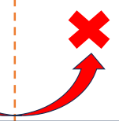

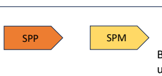

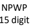

15 digit SPP SPM
Berlaku NPWP 16 digit

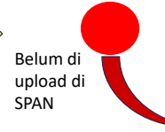 SPAN
Berlaku NPWP 16 digit Tidak **dapat dilanjutkan** Proses SP2D

NPWP
15 digit Pemadanan Data NPWP

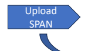

Invoice dalam process SPP SPM **Upload** 


SPAN
Invoice 

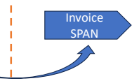

SPAN
Dapat dilanjutkan Proses SP2D
Kondisi berlaku untuk seluruh invoice dalam proses/ menggantung, termasuk diantaranya:
1.

 Pengesahan (UP/ TUP/ hibah dll)
2.

 Invoice menggantung dari sumber dana PHLN


## Open Validation/ Penyesuaian Validasi Span

- Validasi berlaku pada saat upload data ke SPAN. - **Tidak berlaku untuk data yang sebelum 1 Januari 2024** 

telah berada di database SPAN (hasil pemadanan yang 

belum match) - Upload data setelah tanggal 1 Januari 2024 **sangat** 

diharapkan **tidak menggunakan dummy ***

*Ket: Validasi 16 digit pada upload supplier untuk memastikan konsistensi dengan target full implementasi penuh 1 Juli 2024

- **Validasi berlaku pada saat upload data ke SPAN**


- Validasi NPWP header harus sama **dengan data** 

supplier pada SPAN (NPWP dan Nama Supplier) - Validasi NPWP Rekening **harus terisi, masih**

mengakomodasi 15 digit dan diharapkan tidak 

menggunakan dummy

- **Validasi NPWP header harus sama dengan data** 

supplier pada SPAN (NPWP, Nama Supplier dan Nomor 

Kontrak)

| diharapkan                                                                                                                                                                         |    |            |
|------------------------------------------------------------------------------------------------------------------------------------------------------------------------------------|----|------------|
| tidak menggunakan dummy *                                                                                                                                                          |    |            |
| SPAN                                                                                                                                                                               |    | -          |
| Validasi berlaku pada saat upload data ke SPAN                                                                                                                                     |    |            |
| -                                                                                                                                                                                  |    |            |
| Validasi NPWP header harus sama dengan data                                                                                                                                        |    |            |
| supplier pada SPAN (NPWP dan Nama Supplier)                                                                                                                                        |    |            |
| -                                                                                                                                                                                  |    |            |
| Validasi NPWP Rekening harus terisi, masih                                                                                                                                         |    |            |
| menggunakan dummy                                                                                                                                                                  |    |            |
| -                                                                                                                                                                                  |    |            |
| Validasi NPWP header harus sama dengan data                                                                                                                                        |    |            |
| supplier pada SPAN (NPWP, Nama Supplier dan Nomor                                                                                                                                  |    |            |
| Kontrak)                                                                                                                                                                           |    |            |
| Modul Komitmen                                                                                                                                                                     |    |            |
| Validasi Kode KPP                                                                                                                                                                  |    |            |
| Validasi 16 Digit                                                                                                                                                                  |    | Keterangan |
| Supplier                                                                                                                                                                           |    |            |
| Header                                                                                                                                                                             |    | x          |
| v                                                                                                                                                                                  |    |            |
| Rekening                                                                                                                                                                           |    |            |
| x                                                                                                                                                                                  |    |            |
| v                                                                                                                                                                                  |    |            |
| Kontrak                                                                                                                                                                            | x  |            |
| v                                                                                                                                                                                  |    |            |
| Ket: Validasi (x) 16 digit pada upload pmrt/SPM untuk layanan terbatas selama periode sd 30 Juni 2024 tetap dapat dilaksanakanModul Validasi Kode KPP Validasi 16 Digit Keterangan |    |            |
| Pembayaran                                                                                                                                                                         |    |            |
| PMRT                                                                                                                                                                               |    |            |
| NPWP header                                                                                                                                                                        |    |            |
| x                                                                                                                                                                                  |    |            |
| x                                                                                                                                                                                  |    |            |
| NPWP Rekening                                                                                                                                                                      |    |            |
| x                                                                                                                                                                                  |    |            |
| x                                                                                                                                                                                  |    |            |
| NPWP kontrak                                                                                                                                                                       |    |            |
| x                                                                                                                                                                                  |    |            |
| x                                                                                                                                                                                  |    |            |

# C1 **Pemadanan Data Dan Open Validation**

Pemadanan data berhasil

| Komponen      |       |
|---------------|-------|
| Header        |       |
| Tipe          |       |
| Supplier      |       |
| (All)         |       |
| Status        |       |
| Tipe Supplier |       |
| (All)         | SPM/  |
| Before        |       |
| After         |       |
| NRS           |       |
| Tetap         |       |
| 123           |       |
| 123           |       |
| Tetap         |       |
| Nama          | Tetap |
| ABC           |       |
| ABC           |       |
| Tetap         |       |
| Supplier      |       |
| NPWP          |       |
| Pemadanan     |       |
| 15            |       |
| 16            |       |
| 16            |       |
| Berhasil      |       |
| Rekening      |       |
| Tipe          |       |
| Supplier      |       |
| 3,5,6         |       |
| Tipe Supplier |       |
| (3,5,6)       | SPM/  |
| Before        |       |
| After         |       |
| NPWP          |       |
| Pemadanan     |       |
| 15            |       |
| 16            |       |
| 15 atau 16    |       |
| Berhasil      |       |


SPM/ 

PMRT

 Penggunaan NPWP rekening yang **telah berhasil**
dipadankan menjadi 16 digit **untuk pembayaran,** data pada **SPM bersifat opsional 15 atau 16** 
digit.

**Tidak diijinkan melakukan perubahan NPWP (file** 
BCSU), kecuali data NPWP 16 digit hasil pemadanan tidak valid, dibuktikan dengan dokumen pendukung 
(NIK/ KTP) di satker.

 Penggunaan NPWP header yang **telah** 
dipadankan menjadi 16 digit **untuk pembayaran,** 
data pada SPM **harus 16 digit.**
 **Jika satker/ supplier belum mengetahui/** 
memadankan data maka wajib memperoleh pemadanan data melalui DJP Online. 

SPM/ 
PMRT

## Untuk Rekening **Transisi Sd 30 Juni 2024**

# C2 **Pemadanan Data Dan Open Validation**


Pemadanan data tidak berhasil

 NPWP header yang belum berhasil **dipadankan**

(masih 15 digit ) dapat digunakan untuk 

pembayaran, dengan data SPM **harus 15 digit.**

 **Satker/ supplier dihimbau agar segera** 

melakukan pendaftaran dengan NPWP 16 Digit 

(file BCSR) pada SPAN.

 Penggunaan NPWP rekening yang **belum berhasil**

dipadankan (masih 15 digit), dapat digunakan dengan SPM 

yang menggunakan NPWP **15 atau 16 digit (bersifat** opsional).

 **Penerima agar segera melakukan pendaftaran NPWP 16** 

Digit (DJP online) dan mengajukan ke satker perubahannya

pada SAKTI. Selanjutnya satker mengajukan file BCSU 

menjadi 16 digit ke SPAN, dengan didahului perubahan 

NPWP pada header supplier/ oleh satker, jika diperlukan.

|                                                                                                                                                                  |       |
|-------------------------------------------------------------------------------------------------------------------------------------------------------------------|-------|
| NPWP header yang belum berhasil                                                                                                                                   |       |
| dipadankan                                                                                                                                                        |       |
| pembayaran, dengan data SPM harus 15 digit.                                                                                                                       |       |
| (file BCSR) pada SPAN.                                                                                                                                            |       |
|                                                                                                                                                                  |       |
| Penggunaan NPWP rekening yang belum berhasil yang menggunakan NPWP 15 atau 16 digit (bersifat opsional). NPWP pada header supplier/ oleh satker, jika diperlukan. |       |
| Komponen                                                                                                                                                          |       |
| Header                                                                                                                                                            |       |
| Tipe                                                                                                                                                              |       |
| Supplier                                                                                                                                                          |       |
| (All)                                                                                                                                                             |       |
| Status                                                                                                                                                            |       |
| Tipe Supplier                                                                                                                                                     |       |
| (All)                                                                                                                                                             | SPM/  |
| PMRT                                                                                                                                                              |       |
| Untuk                                                                                                                                                             |       |
| Header                                                                                                                                                            |       |
| Transisi sd 30 Juni 2024                                                                                                                                          |       |
| Before                                                                                                                                                            |       |
| After                                                                                                                                                             |       |
| NRS                                                                                                                                                               |       |
| Tetap                                                                                                                                                             |       |
| 123                                                                                                                                                               |       |
| 123                                                                                                                                                               |       |
| Tetap                                                                                                                                                             |       |
| Nama                                                                                                                                                              | Tetap |
| ABC                                                                                                                                                               |       |
| ABC                                                                                                                                                               |       |
| Tetap                                                                                                                                                             |       |
| Supplier                                                                                                                                                          |       |
| NPWP                                                                                                                                                              |       |
| Pemadanan                                                                                                                                                         |       |
| 15                                                                                                                                                                |       |
| 15                                                                                                                                                                |       |
| 15                                                                                                                                                                |       |
| Tidak                                                                                                                                                             |       |
| Berhasil                                                                                                                                                          |       |
| Rekening                                                                                                                                                          |       |
| Tipe                                                                                                                                                              |       |
| Supplier                                                                                                                                                          |       |
| 3,5,6                                                                                                                                                             |       |
| Tipe Supplier                                                                                                                                                     |       |
| (3,5,6)                                                                                                                                                           | SPM/  |
| PMRT                                                                                                                                                              |       |
| Before                                                                                                                                                            |       |
| After                                                                                                                                                             |       |
| NPWP                                                                                                                                                              |       |
| Pemadanan                                                                                                                                                         |       |
| 15                                                                                                                                                                |       |
| 15                                                                                                                                                                |       |
| 15 atau 16                                                                                                                                                        |       |
| Tidak                                                                                                                                                             |       |
| Berhasil                                                                                                                                                          |       |

# Penyesuaian Atribut Rekening (Supplier Tipe 3,5, Dan 6) D


Bank Supplier (Informasi Rekening Supplier)

1. Negara Bank 2. Nama Bank 3. Kode Bank 4. Nomor Rekening **5. Nama Cabang Bank** 6. Nama Pemilik Rekening 7. Mata Uang **8. Kode SWIFT 9. Kode IBAN**

Additional Bank Information (Informasi Rekening Tambahan)

1. Nama Pegawai/Pemerintah Daerah/Pengguna Dana 2. NPWP **3. NIP 4. Lokasi 5. Alamat** 

6. Kabupaten/kota 7. Provinsi 8. Kode Pos 9. Negara

Menambah rekening penerima baru/ BCSR

 Tidak menambah rekening penerima baru

/ dilakukan dengan BCSU

Contoh attribute selain 1 3 4 5 : - Nama penerima pegawai - NPWP pegawai - NIP pegawai - **Alamat**

Upload file BCSR, tidak akan menambah


rekening penerima baru dan tidak mengubah

atribut selain nomor 1,3,4,5

Penyesuaian


1. Negara Bank 

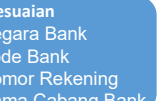 4. Nomor Rekening 5. Nama Cabang Bank
Penyesuaian **SELAIN**


1. Negara Bank 3. Kode Bank 4. Nomor Rekening 5. Nama Cabang Bank

D1


Penambahan dan Perubahan NPWP Rekening (Supplier Tipe 3,5, dan 6) pasca Pemadanan NPWP 1 Januari 2024

Pemadanan berhasil

Perubahan/ File BCSU 

dengan: - **16 tidak valid dan atau** 

Dummy/ lainnya tidak DIIZINKAN

- 15 (lama) akan **Tertolak**

Tipe 

Supplier 

3,5,6

| Komponen   |
|------------|
| Header     |
| Supplier   |
| Rekening   |
| NPWP       |
| 16 (valid) |

Tipe 

Supplier 

3,5,6

NRS **Tetap**

Nama **Satker A**

Supplier NPWP 16

Pegawai 

#A1

Penggunaan file BCSR harus dengan NPWP 

16 Digit:

Penggunaan NPWP 16 digit yang tidak 

valid, Dummy/ lainnya, tidak mengubah

data Npwp yang sudah benar.

NRS **Tetap**

Nama **Satker B**

Supplier

| Komponen   |
|------------|
| Header     |
| Supplier   |

NPWP 16

Pindah mutasi Penambahan pada Satker dan KPPN tertentu (assignment)

| Rekening   |
|------------|
| NPWP       |
| 16 (valid) |

Pegawai 

#B1

Pindah mutasi Dengan rekening baru Atau atribut rekening yang baru
(nama pemilik rekening, nama pegawai, nip)

Rekening **Pegawai #B1**

Baru

Tipe 

Supplier 

3,5,6

Rekening Lama **Pegawai #B1**

ganti atribut

| Komponen   |
|------------|
| Header     |
| Supplier   |

NRS **Tetap**

Penggunaan file BCSR harus menggunakan **NPWP 16 Digit.** Perubahan atribut selain nama bank, kode bank, negara 

bank, Nama Cabang, nomor rekening tidak akan

mengubah data yang ada sebelumnya

Nama **Satker B**

Supplier NPWP 16

NPWP **16 (valid)**
Penggunaan file BCSR harus menggunakan **NPWP 16 Digit**

NPWP **16 (valid)**

Penambahan dan Perubahan NPWP Rekening (Supplier 


Tipe 3,5, dan 6) pasca Pemadanan NPWP 1 Januari 2024 D2

| Komponen   |
|------------|
| Header     |
| Supplier   |
| Rekening   |

Pemadanan tidak berhasil

Tipe 

Supplier 

3,5,6

Perubahan/ File BCSU dengan 

NPWP Dummy/ lainnya Tidak 

DIIZINKAN

NRS **Tetap** Nama **Satker A**

Supplier NPWP 16

Pegawai 

#A1

NPWP **15 (T. valid)**

Perubahan/ File BCSU harus dengan NPWP 16 digit valid.

Tipe 

Supplier 

3,5,6

| Komponen   |
|------------|
| Header     |
| Supplier   |

NRS **Tetap**

Nama **Satker B**

Supplier

NPWP 16

Pindah mutasi

| Rekening   |
|------------|
| NPWP       |
| 16 (valid) |

Penambahan pada Satker dan KPPN tertentu (assignment)

Pegawai 

#B1

Rekening **Pegawai #B1**

Baru

Tipe 

Supplier 

3,5,6

Rekening Lama **Pegawai #B1**

ganti Atribut

Dengan 

rekening baru atau

atribut rekening 

yang baru

(nama pemilik

rekening, nama

pegawai, nip)

Penggunaan file BCSR harus dengan NPWP 

16 Digit: Penggunaan NPWP 16 digit yang 

valid, atau dummy/ lainnya, tidak 

mengubah data NPWP yang sebelumnya/ tidak benar/ 15 digit. Namun kondisi ini 

tidak mengakibatkan penolakan SPM**. Perubahan menjadi NPWP 16 digit hanya** 

bisa dengan file BCSU

NRS **Tetap**

| Baru       |
|------------|
| Komponen   |
| Header     |
| Supplier   |
| NPWP       |
| 16 (valid) |

Penggunaan file BCSR harus menggunakan **NPWP 16 Digit.** Perubahan atribut selain nama bank, kode bank, negara 

bank, Nama Cabang, nomor rekening tidak akan

mengubah data yang ada sebelumnya

Nama **Satker B**

Supplier NPWP 16

Pindah 

mutasi

Penggunaan file BCSR harus menggunakan **NPWP 16 Digit**

NPWP **16 (valid)**

Mitigasi Transaksi Pasca Pemadanan NPWP 1 Januari E **2024 - Gaji**


Harus sama dengan 


NPWP pada header (15 atau 16)

| NPWP pada header   |             |               |            |              |
|--------------------|-------------|---------------|------------|--------------|
| (15 atau 16)       |             |               |            |              |
| Komponen           |             |               |            |              |
| Header             |             | Tipe Supplier | PMRT/ SPM  |              |
| 3,5,6              |             |               |            |              |
| NRS                |             | Tetap         |            | Harus sama   |
| Nama Supplier      |             | Satker A      | Harus sama |              |
| NPWP               |             | 15 atau 16    |            |              |
| Rekening           | Pegawai #A1 |               |            |              |
| NPWP               |             | 15 (T. valid) |            | Harus terisi |
| (open validation)  |             |               |            |              |

NPWP Pegawai/ Penerima Tidak Padan


Mitigasi Transaksi Pasca Pemadanan NPWP 1 Januari 2024 - Gaji NPWP Pegawai/ Penerima tidak Padan NPWP Pegawai/ Penerima tidak Padan

Tindak Lanjut

Rekening Pegawai #A1b **Berubah**

BCSR

(lihat rule 

penggunaan)

| (lihat rule   |               |          |
|---------------|---------------|----------|
| penggunaan)   |               |          |
| Komponen      |               |          |
| Header        |               |          |
| Tipe Supplier | PMRT/ SPM     |          |
| 3,5,6         |               | Komponen |
| Header        |               |          |
| 3,5,6         |               |          |
| NRS           |               |          |
| Tetap         |               |          |
| Harus sama    |               |          |
| NRS           |               |          |
| Tetap         |               |          |
| Harus sama    | Nama Supplier |          |
| Satker A      |               |          |
| Harus sama    |               |          |
| Nama Supplier |               |          |
| Satker A      |               |          |
| Harus sama    | NPWP          |          |
| 15 atau 16    |               |          |
| Harus sama    |               |          |
| dengan NPWP   |               |          |
| (15 atau 16)  |               |          |
| NPWP          |               |          |
| 15 atau 16    |               |          |
| Harus sama    |               |          |
| dengan NPWP   |               |          |
| pada header   |               |          |
| (15 atau 16)  |               |          |
| Perubahan     |               |          |
| Rekening      |               |          |
| Pegawai #A1   |               | NPWP     |
| 16 valid      |               |          |
| NPWP          |               |          |
| 15 (T. valid) |               |          |
| Harus terisi  |               |          |
| (open         |               |          |
| validation)   |               | Rekening |
| Pegawai #A1   |               |          |
| Tetap         |               |          |
| NPWP          |               |          |
| 16 valid      |               |          |
| (lihat rule   |               |          |
| penggunaan)   |               |          |

Tipe Supplier PMRT/ SPM

3,5,6

Harus sama dengan NPWP 

pada header

(15 atau 16)

BCSU

(lihat rule penggunaan)

Mitigasi Transaksi Pasca Pemadanan NPWP 1 Januari 2024 - Pertanggungjawaban UP dan TUP (GUP Nihil dan PTUP)
E2


| Komponen          |          |            |            |
|-------------------|----------|------------|------------|
| Header            |          | 1          |            |
| NRS               |          | Tetap      | Harus sama |
| Nama Supplier     | Satker A |            |            |
| Harus sama        |          |            |            |
| NPWP              |          | 15 atau 16 |            |
| Harus sama dengan |          |            |            |
| NPWP pada header  |          |            |            |
| (15 atau 16)      |          |            |            |

Tipe Supplier PMRT/ SPM

1

- **SPP dan SPM pengesahan yang sudah diterima di KPPN harus sudah diupload ke SPAN sebelum** 

proses Go-Live 31 Desember 2023

- Lihat slide pemadanan NPWP transaksi in process/ menggantung. 

Mitigasi Transaksi Kontrak Tahunan Khusus- Pasca Pemadanan NPWP 1 Januari 2024 - Implementasi RPATA E3 Pembayaran RPATA 2023 **Pembayaran RPATA 2024**


Data Supplier tipe 2

Komponen **Before**

Header

NRS **Tetap**

Nama Tetap

Supplier

NPWP 15

Komponen Before **PMRT**

Header

NRS Tetap **Tetap** Nama Tetap **Tetap**

Supplier

NPWP 15 15

Data Supplier tipe 2 (Padan)

Informasi Supplier pada Data Kontrak

Komponen Before **After**

Header

Komponen Before After **PMRT**

Header

Harus 

sama

NRS Tetap **Tetap**

Harus 

sama

Nama Tetap **Tetap**

Supplier

NPWP 15 16 16

NPWP hasil pemadanan akan secara otomatis.

NRS Tetap **Tetap**

Nama Supplier Tetap **Tetap**

NPWP 15 16

Informasi Kontrak

Data Supplier tipe 2 (Tidak Padan)

Penyesuaian NPWP menjadi 16 digit maka 

perubahan dengan file BCSR

Informasi Supplier pada Data Kontrak

Komponen Before **After**

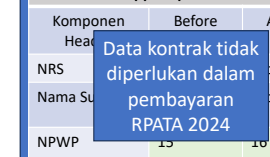

Data kontrak tidak 

diperlukan dalam 

pembayaran 

RPATA 2024

| Komponen          |
|-------------------|
| Before            |
| After             |
| Header            |
| Termin, Nilai dll |

Komponen Before After **PMRT**

Header

Harus 

sama

NRS Tetap **Tetap**

Harus 

sama

Nama Tetap **Tetap**

Supplier

NPWP 15 15 15

NRS Tetap **Tetap** Nama Supplier Tetap **Tetap**
NPWP 15 16
Informasi Kontrak


Termin, Nilai dll

# Mitigasi Transaksi Tipe 2 - Bansos Melalui Rpl E4


NPWP untuk Header tipe 5 semula dummy 15 digit menjadi dummy 16

Rekening Before After **PMRT**

| Komponen      |
|---------------|
| Before        |
| After         |
| PMRT          |
| Header        |
| NRS           |
| Tetap         |
| Tetap         |
| Harus sama    |
| Nama Supplier |
| Tetap         |
| Tetap         |
| Harus sama    |
| NPWP          |
| 15            |
| 16            |
| 16            |

| Rekening    |       |
|-------------|-------|
| Before      |       |
| After       |       |
| PMRT        |       |
| NPWP        | Tidak |
| menggunakan |       |
| NPWP        |       |
| Tidak       |       |
| menggunakan |       |
| NPWP        |       |
| Tidak       |       |
| divalidasi  |       |

# Mitigasi Transaksi Ba-Bun Tipe 5 E5


NPWP untuk Header tipe 5 semula dummy 15 digit menjadi dummy 16

Rekening Before After **PMRT**

| Komponen      |       |
|---------------|-------|
| Before        |       |
| After         |       |
| PMRT          |       |
| Header        |       |
| NRS           | Tetap |
| Tetap         |       |
| Harus sama    |       |
| Nama Supplier |       |
| Tetap         |       |
| Tetap         |       |
| Harus sama    |       |
| NPWP          |       |
| 15            |       |
| 16            |       |
| 16            |       |

Harus terisi (open validation)

| Rekening     |              |
|--------------|--------------|
| Before       |              |
| After        |              |
| PMRT         |              |
| NPWP         |              |
| 15           |              |
| 16           |              |
| Harus terisi |              |
| Rekening     |              |
| Before       |              |
| After        |              |
| PMRT         |              |
| NPWP         |              |
| 15           |              |
| 15           | Harus terisi |

Harus terisi

(open validation)

# Mitigasi Transaksi Tipe 6- Ppnpn E6

Komponen Before After **PMRT**

Header

NRS Tetap Tetap **Harus sama**

Nama Tetap Tetap **Harus sama**

Supplier

NPWP 15 16 16

Rekening Before After **PMRT**

Pemadanan Berhasil **Pemadanan Tidak Berhasil**


Penyesuaian rekening agar mengacu pada slide D

Komponen Before After **PMRT**

Header

NRS Tetap Tetap **Harus sama**

Nama Tetap Tetap **Harus sama**

Supplier

| NPWP         |
|--------------|
| 15           |
| 16           |
| Harus terisi |

NPWP 15 15 15

Perubahan/ File BCSU harus dengan NPWP 16 digit valid.

Pendaftaran/ File BCSR harus dengan NPWP 16 digit valid.

Perubahan/ File BCSU dan Pendaftaran dengan NPWP 
Dummy/ lainnya tidak DIIZINKAN

Rekening Before After **PMRT**

| NPWP         |
|--------------|
| 15           |
| 15           |
| Harus terisi |

# Dukungan Pasca Pemadanan F


 Daftar Satker dengan NPWP masih 15 Digit per KPPN
2.

 Daftar NRS Bansos 5.

1.

 Daftar Rekanan RPATA dengan NPWP masih 15 Digit 3.

 Daftar invoice dalam proses yang disesuaikan 16 Digit 4.

 Daftar Rekening Pemda (RKUD) dengan NPWP masih 15 Digit per KPPN
6.

 Daftar hasil pemadanan supplier tipe 2 di OM SPAN menu referensi supplier


Terima Kasih

```
  KEMENTERIAN KEUANGAN REPUBLIK INDONESIA
           DIREKTORAT JENDERAL PAJAK
  DIREKTORAT PENYULUHAN, PELAYANAN, DAN HUBUNGAN
                 MASYARAKAT
JALAN GATOT SUBROTO NOMOR 40-42 JAKARTA 12190 TELEPON (021) 5250208; FAKSIMILE (021) 5736088;
 SITUS www.pajak.go.id LAYANAN INFORMASI DAN PENGADUAN KRING PAJAK (021) 1500200 EMAIL
            pengaduan@pajak.go.id; informasi@pajak.go.id


```

## Pengumuman Nomor Peng-22/Pj.09/2023

```
                          TENTANG
 PENGGUNAAN NOMOR INDUK KEPENDUDUKAN SEBAGAI NOMOR POKOK WAJIB
PAJAK ATAU NOMOR POKOK WAJIB PAJAK DENGAN FORMAT 16 (ENAM BELAS) DIGIT
 SECARA TERBATAS PADA SISTEM APLIKASI KEUANGAN TINGKAT INSTANSI DAN
          SISTEM PERBENDAHARAAN DAN ANGGARAN NEGARA

```

Sehubungan dengan penggunaan Nomor Induk Kependudukan sebagai Nomor Pokok Wajib Pajak, dan Nomor Pokok Wajib Pajak dengan format 16 digit (NPWP 16 digit) secara terbatas sampai dengan tanggal 30 Juni 2024 sebagaimana dimaksud dalam Pasal 2 ayat (6) Peraturan Menteri Keuangan Nomor 136 Tahun 2023 tentang Perubahan atas Peraturan Menteri Keuangan Nomor 112/PMK.03/2022 tentang Nomor Pokok Wajib Pajak bagi Wajib Pajak Orang Pribadi, Wajib Pajak Badan, dan Wajib Pajak Instansi Pemerintah, kami sampaikan beberapa hal sebagai berikut: 1. Sistem Aplikasi Keuangan Tingkat Instansi (SAKTI) yang digunakan oleh Satuan Kerja
(Satker) dan Sistem Perbendaharaan dan Anggaran Negara (SPAN) pada Direktorat Jenderal Perbendaharaan, digunakan dalam rangka mengelola secara terintegrasi kegiatan perencanaan, pelaksanaan dan pertanggungjawaban Anggaran Pendapatan dan Belanja Negara (APBN). 

2. Layanan administrasi melalui SAKTI dan SPAN mensyaratkan penggunaan NPWP sebagai identitas bagi Satuan Kerja Instansi Pemerintah Pusat dan Wajib Pajak yang bertransaksi dengan Satuan Kerja.

3. Terhitung mulai 1 Januari 2024, NPWP yang digunakan dalam layanan administrasi melalui SAKTI dan SPAN menggunakan NPWP 16 digit.

4. Satuan Kerja Instansi Pemerintah Pusat dan Wajib Pajak yang bertransaksi dengan Satuan Kerja dimaksud untuk dapat menyesuaikan NPWP yang digunakan sebagaimana dimaksud pada nomor 3.

5. Dalam hal Satuan Kerja Instansi Pemerintah Pusat dan Wajib Pajak yang bertransaksi dengan Satker, belum mengetahui NPWP 16 digit yang dimilikinya, Satker dan Wajib Pajak yang bertransaksi dengan Satker dapat mengakses laman Direktorat Jenderal Pajak (DJP), menghubungi contact *center* DJP, atau Kantor Pelayanan Pajak (KPP) tempat Wajib Pajak terdaftar, untuk:
a. mengetahui NPWP 16 digit yang dimilikinya; atau b. khusus untuk Wajib Pajak Orang Pribadi yang status NIK sebagai NPWP-nya belum valid, agar segera melakukan pemutakhiran mandiri data Wajib Pajak sehingga menghasilkan data identitas Wajib Pajak telah padan dengan data kependudukan.

6. Dalam rangka pelaksanaan Peraturan Menteri Keuangan Nomor 59/PMK.03/2022 tentang Perubahan atas Peraturan Menteri Keuangan Nomor 231/PMK.03/2019 tentang Tata Cara Pendaftaran dan Penghapusan Nomor Pokok Wajib Pajak, Pengukuhan dan Pencabutan Pengukuhan Pengusaha Kena Pajak, serta Pemotongan dan/atau Pemungutan, Penyetoran, dan Pelaporan Pajak bagi Instansi Pemerintah, ditegaskan hal-hal sebagai berikut:
a. Bukti pemotongan atau pemungutan Pajak Penghasilan (PPh) yang diterbitkan oleh Instansi Pemerintah masih menggunakan NPWP format 15 digit; b. Faktur Pajak yang diterbitkan oleh Wajib Pajak rekanan Instansi Pemerintah masih menggunakan NPWP format 15 digit; c. Atas pelaksanaan pembayaran dengan mekanisme Uang Persediaan yang dilakukan oleh Instansi Pemerintah, Penyetoran PPh dilakukan dengan menggunakan surat setoran pajak masih menggunakan NPWP format 15 digit; d. Atas pelaksanaan pembayaran dengan mekanisme langsung, penyetoran PPh dilakukan dengan menggunakan Surat Perintah Pencairan Dana (SP2D) yang merupakan sarana administrasi lain yang disamakan dengan surat setoran pajak atas nama Instansi Pemerintah menggunakan NPWP format 16 digit melalui SPAN.

e. Pelaporan SPT Masa PPh dan SPT Masa Pemungut PPN dan PPnBM oleh Instansi Pemerintah Pusat menggunakan NPWP format 15 digit.

7. Dalam rangka pelaksanaan Peraturan Menteri Keuangan Nomor 244/PMK.03/2015 tentang Tata Cara Penghitungan dan Pengembalian Kelebihan Pembayaran Pajak, ditegaskan halhal sebagai berikut:
a. Penerbitan surat ketetapan pajak ataupun surat keputusan oleh Direktorat Jenderal Pajak, termasuk Surat Keputusan Pengembalian Kelebihan Pembayaran Pajak (SKPKPP) yang menjadi dasar pengembalian kelebihan pembayaran pajak masih menggunakan NPWP 15 digit.

b. Penerbitan SPMKP dalam aplikasi SAKTI menggunakan NPWP 16 digit. c. Penerbitan SPM dan SP2D dalam aplikasi SPAN menggunakan NPWP 16 digit.

8. Dalam rangka pelaksanaan pemberian imbalan bunga sebagaimana diatur dalam Peraturan Menteri Keuangan Nomor 18/PMK.03/2021 tentang Pelaksanaan Undang-Undang Nomor 11 Tahun 2020 tentang Cipta Kerja di Bidang Pajak Penghasilan, Pajak Pertambahan Nilai dan Pajak Penjualan atas Barang Mewah, serta Ketentuan Umum dan Tata Cara Perpajakan, ditegaskan hal-hal sebagai berikut:
a. Penerbitan Surat Keputusan Pemberian Imbalan Bunga (SKPIB) ataupun Surat Keputusan Perhitungan Pemberian Imbalan Bunga (SKPPIB) oleh Direktorat Jenderal Pajak yang menjadi dasar pemberian imbalan bunga masih menggunakan NPWP 15 digit.

b. Penerbitan Surat Perintah Membayar Imbalan Bunga (SPMIB) dalam aplikasi SAKTI
menggunakan NPWP 16 digit.

c. Penerbitan SPM dan SP2D dalam aplikasi SPAN menggunakan NPWP 16 digit.

9. Informasi dan tata kelola mengenai penggunaan NPWP 16 digit pada layanan administrasi melalui SAKTI dan SPAN akan diatur lebih lanjut dengan peraturan atau petunjuk teknis dari Direktorat Jenderal Perbendaharaan.

Pengumuman ini hendaknya dapat disebarluaskan.

Ditetapkan di Jakarta

 pada tanggal 14 Desember 2023 Direktur Penyuluhan, Pelayanan, dan Hubungan Masyarakat Ditandatangani secara elektronik Dwi Astuti