→
Petunjuk Teknis Aplikasi SAKTI)
PenatauSahaan Transaksi Hibah Kas
�
�

# Daftar Isi

| HALAMAN JUDUL                                                                                                                                                                                                                                         | 1                                                                            |    |
|-------------------------------------------------------------------------------------------------------------------------------------------------------------------------------------------------------------------------------------------------------|------------------------------------------------------------------------------|----|
| DAFTAR ISI                                                                                                                                                                                                                                            | 2                                                                            |    |
| DESKRIPSI SINGKAT                                                                                                                                                                                                                                     | 3                                                                            |    |
| I.                                                                                                                                                                                                                                                    | Overview Alur Transaksi Hibah Kas pada SAKTI                                 | 3  |
| II.                                                                                                                                                                                                                                                   | Pencatatan Penerimaan Kas Hibah ………………..……………………………………………………………………………………...4 |    |
| III.                                                                                                                                                                                                                                                  | Pencatatan Penerimaan Barang/Jasa Hibah ……………………………………………………………………… 6        |    |
| IV.                                                                                                                                                                                                                                                   | Perekaman Spby Transaksi Hibah ………………………….………………………….…………………………………………………..6  |    |
| V.                                                                                                                                                                                                                                                    | Perekaman Kuitansi Hibah ……………………………….….…………..…..……………………………………………………………….8  |    |
| VI. Perekaman DRPP Hibah …………………………………………………….….…………..…..………………………………………………8 VII. Perekaman SP2HL ………………………..…………………….….…………..…..……………………………………………………………..9 VIII. Pengembalian Kas Hibah dan Perekaman SP4HL …………………..……………….….…………..…..…………………..… 12 |                                                                              |    |

| DESKRIPSI SINGKAT Petunjuk Teknis Penatausahaan Transaksi Hibah Kas Petunjuk Teknis ini digunakan untuk pencatatan transaksi Hibah Kas bagi Satuan Kerja pengguna SAKTI Modul BEN Role User OPR, VAL, APR Modul Lain yang  KOM, PEM Terkait Transaksi yang  Pencatatan Penerimaan Barang/Jasa Hibah,  Tekait Perekaman SP2HL, Perekaman SP4HL Dokumen Input Pencatatan Penerimaan Kas Hibah Output SP2HL / SP4HL / LPJ Bendahara   |
|------------------------------------------------------------------------------------------------------------------------------------------------------------------------------------------------------------------------------------------------------------------------------------------------------------------------------------------------------------------------------------------------------------------------------------|

## - Overview Alur Transaksi Hibah Kas Pada Sakti

Hibah Pemerintah yang selanjutnya disingkat Hibah adalah setiap penerimaan negara dalam bentuk devisa, devisa yang dirupiahkan, rupiah, barang, Jasa dan/atau surat berharga yang diperoleh dari pemberi hibah yang tidak perlu dibayar kembali, yang berasal dari dalam negeri atau luar negeri. 

Tahapan dalam pengelolaan Hibah Kas adalah sebagai berikut:
1. Pengajuan Nomor Register Hibah 2. Pengajuan Persetujuan Pembukaan Rekening Hibah, dan 3. Revisi DIPA
Adapun Mekanisme pengelolaan hibah langsung bentuk Uang diatur dalam Peraturan Menteri Keuangan Nomor 99/PMK.05/2017 tentang Administrasi Pengelolaan Hibah. 

Pada Aplikasi SAKTI penatausahaan transaksi Hibah dilakukan pada kelompok modul pelaksanaan 

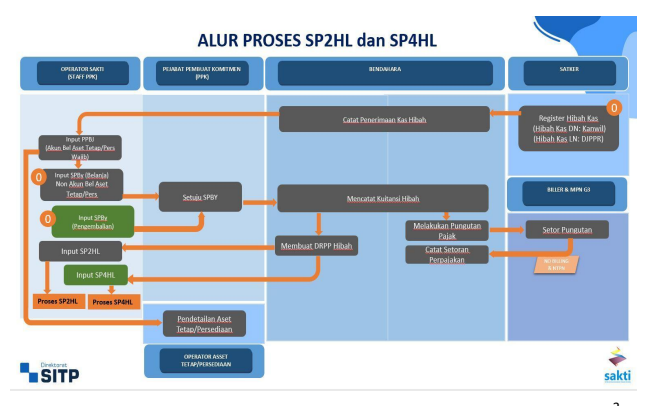

anggaran, yaitu pada modul Bendahara, Komitmen, dan Pembayaran. Jika digambarkan, alur transaksi Hibah Kas pada SAKTI dapat disampaikan sebagai berikut:

## - Pencatatan Penerimaan Kas Hibah

Langkah awal dalam penatausahaan kas hibah pada SAKTI yaitu dengan melakukan pencatatan penerimaan kas hibah yang sudah teregister, baik untuk hibah luar negeri (didaftarkan/register melalui DJPPR) maupun hibah kas dalam negeri (didaftarkan melalui Kanwil DJPb). Untuk memastikan bahwa hibah yang sudah ter-register tersebut sudah tersedia pada referensi SAKTI dan dapat digunakan untuk pencatatan penerimaan kas hibah, berikut adalah langkah-langkahnya:

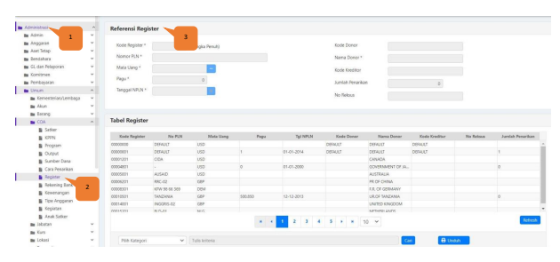

1. Login menggunakan user dengan **role admin**, Pilih ke menu Administrasi 2. Pilih Sub Menu Umum - Coa - **Register**
3. Pada tampilan Referensi Register akan muncul informasi daftar Hibah yang sudah ter-register Setelah memastikan bahwa Hibah telah ter-register dan sudah terdapat referensi pada SAKTI, selanjutnya dapat dilakukan perekaman penerimaan hibah kas pada modul Bendahara. Proses penerimaan Hibah Kas pada Bendahara ini bertujuan untuk membukukan kas masuk hibah pada Bendahara sehingga dapat dilakukan proses lanjutan perekaman transaksi kas yang menggunakan sumber dana hibah. Berikut adalah langkah dalam melakukan pencatatan penerimaan kas hibah: 
Melakukan perekaman rekening RPL untuk menampung kas hibah 1. Login menggunakan user operator yang memiliki role sebagai Bendahara Pengeluaran, pilih menu Bendahara 2. Pilih Sub menu Referensi, klik pada referensi detail rekening 3. Lakukan pengisian elemen data yang diperlukan pada detail rekening 4. Setelah diisi semua lakukan proses simpan

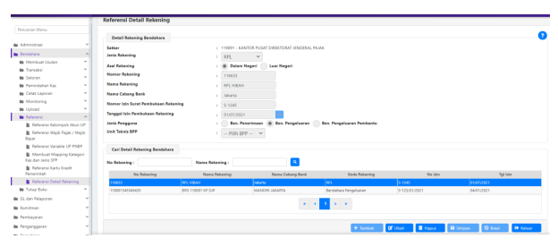

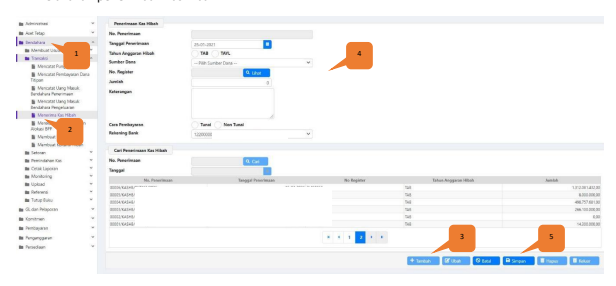

1. Login menggunakan user operator yang memiliki role sebagai Bendahara Pengeluaran, Pilih menu Bendahara 2. Pilih Submenu Transaksi - Menerima Kas Hibah 3. Pada tampilan form Penerimaan Kas Hibah, Klik tombol "Tambah" 4. Isi Infomasi yang dibutuhkan berupa:
1. Tanggal penerimaan kas hibah 2. Tahun anggaran hibah (Tahun Anggaran Berjalan/Tahun Anggaran Yang Lalu) 3. Sumber Dana (Hibah dalam negeri / luar negeri) 4. No Register Hibah (yang sudah terdapat pada referensi di SAKTI) 5. Jumlah Kas Hibah yang ditatausahakan 6. Keterangan 7. Cara Pembayaran 8. Rekening Hibah (Rekam pada menu Bendahara - Referensi - Referensi Detil Rekening)
5. Klik Tombol Simpan, maka transaksi akan tersimpan dan tampil pada tabel grid data pada bagian bawah form input Setelah penerimaan Kas Hibah telah berhasil di rekam, maka informasi saldo kas Bendahara akan menampilkan telah terdapat saldo kas pada kategori Kas Hibah. Pengecekan atas pencatatan penerimaan Kas Hibah dapat dilihat pada contoh tampilan berikut:
Modul Bendahara - submenu Pemindahan Kas - Kas Bank/Tunai Bendahara Pengeluaran - Cek Saldo Detil

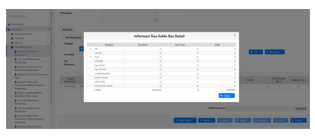

## - Pencatatan Penerimaan Barang/Jasa Hibah

Setelah melakukan pencatatan penerimaan kas hibah, selanjutnya dapat dilakukan perekaman transaksi atas kas hibah. Untuk transaksi kas hibah yang merupakan transaksi atas pembelian barang/menghasilkan aset/persediaan maka perlu dilakukan pencatatan penerimaan barang/jasa hibah (BAST Hibah Kas) pada modul komitmen terlebih dahulu. Hal tersebut bertujuan sebagai titik penjurnalan atas aset/persediaan yang diperoleh atas transaksi kas hibah tersebut (Pada pencatatan barang/jasa hibah dilakukan tahapan pendetilan kode barang). Sedangkan atas transaksi yang menghasilkan jasa maka pencatatan penerimaan barang/jasa bersifat opsional. 

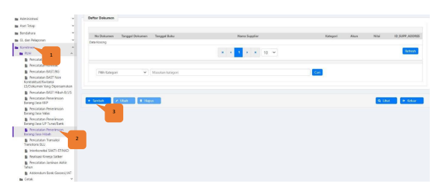

Berikut adalah langkah perekaman Penerimaan Barang/Jasa Hibah (BAST Hibah Kas) :
1. Login operator modul Komitmen 2. Pilih Submenu Pencatatan Peneirmaan Barang/Jasa Hibah 3. Klik tambah pada form grid hasil perekaman 4. Setelah itu akan tampil form perakaman BAST Hibah kas, lengkapi informasi yang dibutuhkan, lalu klik simpan NB: Pastikan mengisi kode KPPN dan No. Register Hibah dengan benar

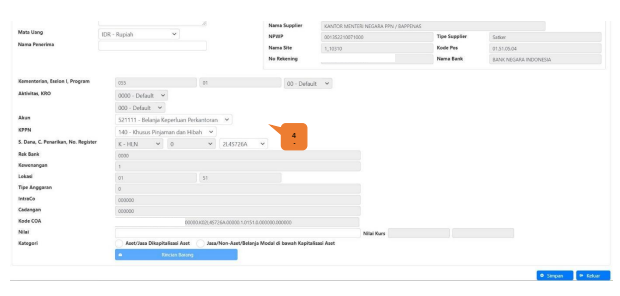

## Perekaman Spby Transaksi Hibah

Setelah perekaman penerimaan barang jasa hibah(BAST Hibah kas) dilakukan, langkah selanjutnya yaitu perekaman SPBY atas BAST yang telah direkam. Untuk merekam SPBy hibah langsung berikut adalah 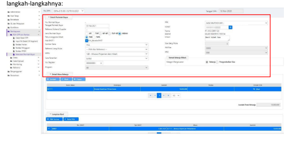

1. Login Operator dengan Role Pembayaran, masuk ke menu Pembayaran 2. Pilih Submenu RUH SPP dan Renkas - Mencatat Perintah Bayar 3. Pada Form Detail Perintah Bayar, isi keterangan yang dibutuhkan. Tanggal, Jenis: Hibah, Pilih Tahun Anggaran Hibah yang sesuai, PPK, NPWP penerima, 4. Ceklis Ada BAST (jika SPBY yang akan dibuat tanpa melalui BAST, maka abaikan langkah ini) 5. Jika parameter yang dipilih tepat, maka akan tampil informasi BAST pada grid bagian bawah, lalu centang 6. Pilih Kategori Pengeluaran Belanja. Detail Akun belanja akan otomatis terisi (jika SPBy tanpa BAST, detil akun belanja diiisi terlebih dahulu)
7. Rekam Potongan Pajak Jika ada 8. Simpan Setelah Simpan SPby, langkah selanjutnya sebelum membuat kuitansi Hibah adalah proses validasi SPBy oleh PPK. Login menggunakan user PPK modul pembayaran submenu Validasi  Validasi Perintah Bayar.

## - Perekaman Kuitansi Hibah 

Langkah selanjutnya setelah perekaman SPBy, Operator Bendahara melakukan perekaman kuitansi Hibah pada modul Bendahara - Transaksi - Membuat Kuitansi Hibah, kemudian pilih Nomor SPBy Hibah yang telah disetujui/divalidasi oleh PPK. Berikut adalah form contoh perekaman Kuitansi Hibah:

## - Perekaman Drpp Hibah

Perekaman DRPP Hibah ini digunakan sebagai dasar pembuatan SP2HL. Pastikan kuitansi sudah direkam sebelumnya.

Untuk perekaman DRPP Hibah langsung, lakukan langkah berikut: 1. Masuk ke Modul Bendahara → Membuat Usulan  Membuat DRPP Hibah. 

2. Pilih Nomor Register Hibah pada DRPP Header lalu Pada DRPP Detail, pilih akun kuitansi yang akan di rekam menjadi DRPP.

3. Pilih Kuitansi yang akan di rekam menjadi DRPP. Pastikan kuitansi-kuitansi yang dikehendaki sudah terceklist. Pastikan kuitansi yang dipilih akan disahkan pada satu COA 12 segmen (Akun dan RO yang sama).

4. Klik Simpan, jika berhasil data DRPP akan muncul pada grid. Selanjutnya DRPP dapat dibuat menjadi SP2HL

## - Perekaman Jenis Spp 512 - Sp2Hl

SP2HL (Surat Perintah Pengesahan Hibah Langsung) dibuat dalam rangka pengesahan pembukuan hibah langsung dan/atau belanja yang bersumber dari hibah langsung. Untuk Perekaman SP2HL dapat direkam di modul pembayaran dengan menggunakan user operator Pembayaran. Untuk pembuatan SP2HL pastikan telah melakukan perekaman pada menu "Menerima Kas Hibah" untuk Pendapatan atau "Membuat DRPP Hibah" pada modul Bendahara. Perekaman SP2HL dapat dilakukan dengan menggunakan jenis SPP 512 PENGESAHAN HIBAH sebagai gambar berikut:

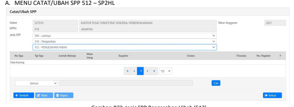

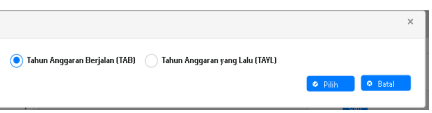

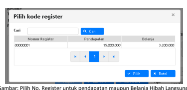

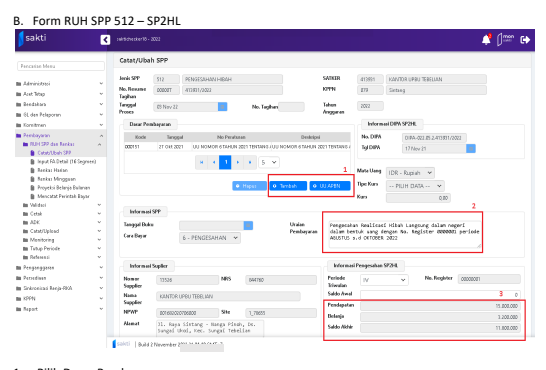

1.

## Pilih Dasar Pembayaran.

2.

Input Uraian Pembayaran 3.

Pastikan Nilai Saldo Awal, Pendapatan, Belanja dan Saldo Akhir telah sesuai.

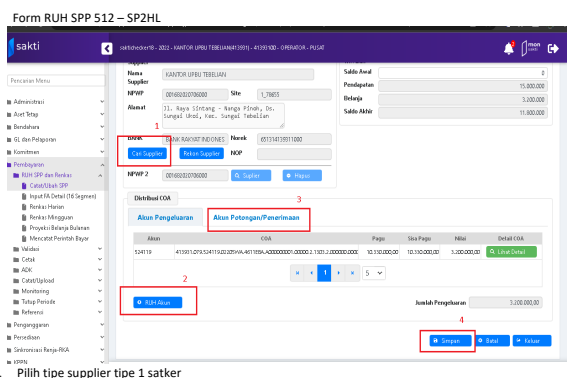

 
2. RUH Akun Pengeluaran atau Akun Potongan/Pendapatan 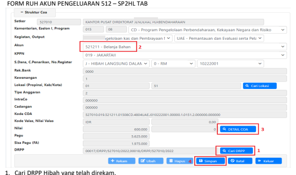

2. Pilih akun Pengeluaran 3. Lakukan pendetilan COA 4. Simpan, dan keluar menu RUH Akun Pengeluaran.

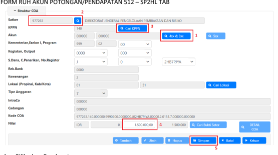

1. Pilih akun Pendapatan 2. Kode satker default DJPPR ( 977263) 3. Kode KPPN Default KPH (140) 4. Input nilai pendapatan 5. Klik "Simpan" dan keluar menu RUH Akun Potongan.

## E. Form Ruh Akun Pengeluaran 512 - Sp2Hl Tayl

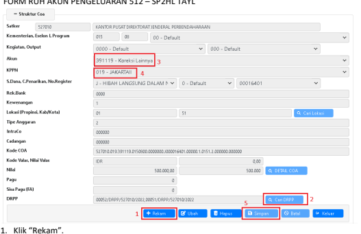 2. Cari DRPP Hibah yang telah direkam. 3. Akun Pengeluaran default 391119 - Koreksi Lainnya 4. Kode KPPN mitra satker (HLD), untuk Hibah Luar Negeri (HLL) Kode KPPN sesuai data DIPAnya 5. Klik "Simpan" dan keluar menu RUH Akun Pengeluaran.

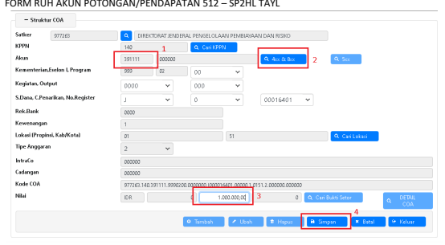

1. Akun Potongan default 391111 2. Pilih Akun Potongan 4xx untuk ubah akun potongan/pendapatan 3. Input nilai potongan/pendapatan 4. Klik "Simpan" dan keluar menu RUH Akun Potongan.

Pada form RUH SPP klik "Simpan" dan langkah selanjutnya adalah cetak SPP, Validasi SPP, Cetak SPM, upload dokumen pendukung, kirim ADK SPM dan Mencatat/Upload SP2D.

## - Pengembalian Kas Hibah Dan Perekaman Jenis Spp 514 - Sp4Hl

Sisa Hibah dapat langsung dikembalikan ke Pemberi Hibah, selanjutnya satker K/L harus membuat dokumen SP4HL (Surat Perintah Pengesahan Pengembalian Pendapatan Hibah Langsung) terkait pengembalian sisa hibah tersebut. Untuk pembuatan SP4HL pastikan telah terdapat SP2HL Pendapatan yang telah disahkan ataupun jika ada pengembalian belanja telah direkam pada perintah bayar dan DRPP untuk pengembalian sisa. Perekaman pengembalian sisa hibah dapat dilakukan dengan langkah sebagai berikut: 1. Login operator pembayaran - Menu RUH SPP dan Renkas - Mencatat Perintah Bayar 2. Rekam Perintah bayar dengan Kategori Pengeluaran **"Pengembalian Sisa", lalu simpan** 3. Selanjutnya lakukan proses validasi SPby oleh PPK, 4. Rekam Kuitansi Hibah oleh Bendahara, 5. Rekam Usulan/DRPP Hibah 6. Rekam SP4HL pada modul pembayaran RUH SPP dan Renkas - Pilih Jenis SPP 514 seperti contoh berikut:

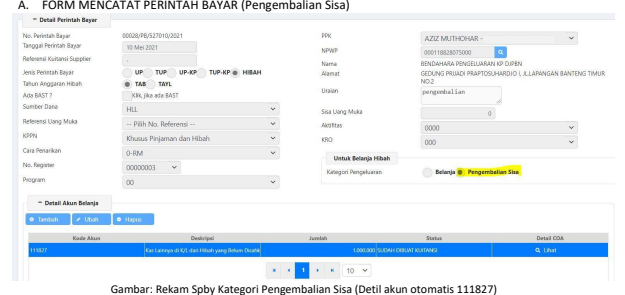

## Form Membuat Kwitansi Hibah B. Membuat Kwitansi Hibah

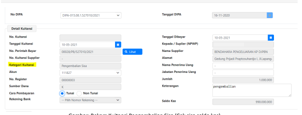

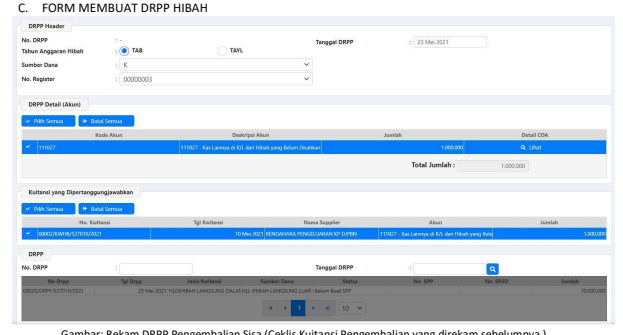

Gambar: Rekam DRPP Pengembalian Sisa (Ceklis Kuitansi Pengembalian yang direkam sebelumnya )

## Menu Catat/Ubah Spp 514 - Sp4Hl D.

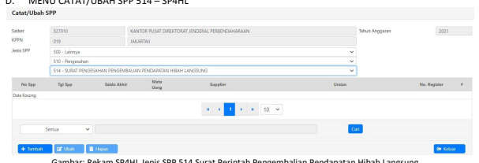

Gambar: Rekam SP4HL Jenis SPP 514 Surat Perintah Pengembalian Pendapatan Hibah Langsung
Pilih Tahun

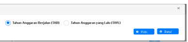

Gambar : Pilih jenis Tahun Anggaran Berjalan (TAB) atau Tahun Anggaran yang Lalu (TAYL)

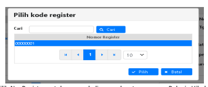

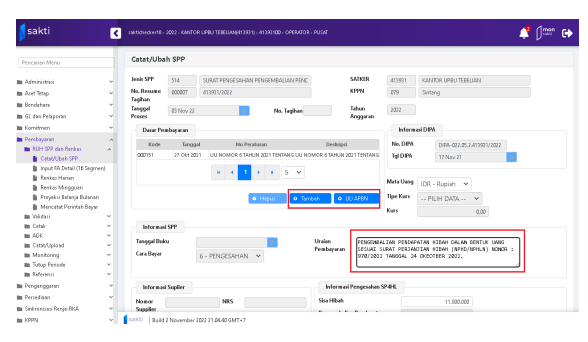

## E. Form Ruh Spp 514 - Sp4Hl

2. Input Uraian Pembayaran

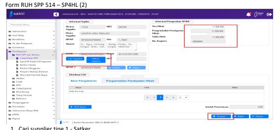

2.  Pastikan Sisa Hibah, Pengembalian Pendapatan dan Saldo akhir Pengembalian Hibah telah sesuai.

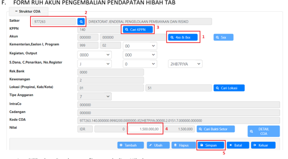

1. Pilih akun Pendapatan/Pengembalian Hibah 2. Kode satker DJPPR (977263) dan kode KPPN KPH (140) 3. Input nilai Pengembalian pendapatan 4. Klik "Simpan".

G. FORM RUH AKUN PENGEMBALIAN PENDAPATAN HIBAH TAYL

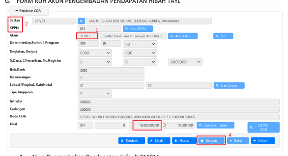

1. Akun Pengembalian Pendapatan default 311911 2. Kode satker yang bersangkutan dan kode KPPN Mitra Satker 3. Input nilai Pengembalian pendapatan 5. Klik "Simpan" dan keluar menu RUH Akun Pengembalian pendapatan.

Pada form RUH SPP klik "Simpan" dan langkah selanjutnya adalah cetak SPP, Validasi SPP, Cetak SPM, upload dokumen pendukung, kirim ADK SPM dan Mencatat/Upload SP2D.