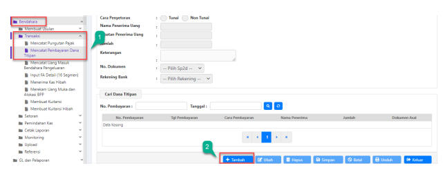

Petunjuk Teknis Aplikasi SAKTI
→
→
PENCATATAN PEMBAYARAN DANA TITIPAN
�
→

| Perekaman Pengambalian Belanja  No. 1 Modul   | BEN                     |                                                           |
|-----------------------------------------------|-------------------------|-----------------------------------------------------------|
| 2                                             | Role User               | OPR                                                       |
| 3                                             | Modul Lain yang Terkait | PEM                                                       |
| 4                                             | Transaksi yang Tekait   | PEM - Upload nomor SP2D otomatis                          |
| 5                                             | Dokumen Input           | Dokumen SPM LS Bendahara serta data SP2D SPM LS Bendahara |
| 6                                             | Output                  | Dokumen Pembayaran Dana Titipan                           |
| 7                                             | Validasi                | -                                                         |

## Pengantar

Petunjuk teknis ini menjelaskan tentang tata cara pencatatan pembayaran dana titipan. Dana titipan adalah dana yang berasal dari seluruh jenis SPM/SP2D LS Bendahara yang akan diteruskan pemberiannya ke pihak ketiga selaku penerima dana (bisa kepada pegawai atau rekanan). 

Bendahara pengeluaran merupakan pihak yang berwenang meneruskan pembayaran dana titipan yang berasal dari SPM/SP2D LS Bendahara tersebut (contoh: SPM dengan kode 231 dan 221), sehingga perlu dilakukan pencatatan pada aplikasi SAKTI Modul Bendahara sebagai bentuk pertanggungjawaban kas. Perlu diperhatikan bahwa sebelum melakukan pencatatan pembayaran data titipan, pastikan bahwa operator modul pembayaran telah melakukan catat SP2D otomatis atas seluruh SPM LS Bendahara sehingga bendahara pengeluaran dapat melanjutkan pencatatan pada menu pemindahan kas dan mencatat pembayaran dana titipan.

 - Secara Non Tunai -

2.  Klik tombol Rekam

1.  Pada kolom tanggal, isikan dengan tanggal diterimanya pencairan SP2D LS Bendahara di rekening BPG.

Kemudian untuk Jenis Aktifitas diisi dengan Terima SP2D dan kategori kas diisi dengan LS Bendahara.

2.  Klik tombol Cari pada kolom No. SP2D

1. Akan muncul pop up box yang berisi daftar SP2D LS Bendahara. Pilih salah satu yang akan dilakukan pencatatan. Pada contoh diatas, SP2D yang dipilih adalah tipe 231.

1. Setelah memilih nomor SP2D pada Langkah sebelumnya, maka secara otomatis kolom Jenis SP2D, 
Jumlah, dan sumber dana akan terisi (untuk kolom nomor uang muka silahkan dilewati saja karena menu ini digunakan oleh BPP). Pada kolom rekening bank, pilih nomor rekening BPG yang sudah didaftarkan pada menu Referensi Detail Rekening modul bendahara.

2. Isikan keterangan transaksi sesuai dengan kondisi riil.

1. Selanjutnya, lakukan pencatatan pada menu Mencatat Pembayaran Dana Titipan. Untuk Langkah ini akan dijelaskan tata cara penatatan pembayaran dana titipan secara non tunai. Dikarenakan pada langkahlangkah diatas, pencatatan terima SP2D LS Bendahara dilakukan pada menu kas bank bendahara pengeluaran.

2. Klik tombol Tambah.

1. Isikan tanggal pembayaran sesuai dengan tanggal dibayarkannya saldo LS bendahara ke pihak 

ketiga/penerima. Kolom nomor pembayaran akan terisi secara otomatis oleh sistem.

2. Isikan cara penyetoran dengan kategori Non Tunai.

3. Isikan nama penerima & jabatan penerima uang sesuai dengan kondisi riil penerima LS bendahara. 

Kemudian, isikan jumlah uang yang akan diberikan beserta keterangannya.

4. Kolom nomor dokumen berisi daftar nomor SP2D LS Bendahara yang sudah dicatat pada menu kas bank bendahara pengeluaran. Pilih nomor SP2D yang diinginkan kemudian lanjutkan dengan pemilihan nomor rekening bank BPG. Jika sudah, klik tombol Simpan.

1. Pada kolom Cari Dana Titipan, akan muncul seluruh transaksi pencatatan pembayaran dana titipan yang sudah disimpan.

1. Selanjutnya, juknis ini akan membahas Langkah-langkah pencatatan pembayaran dana titipan dengan cara tunai. Langkah pertama yang harus dilakukan adalah mencatat pemindahan kas kategori LS Bendahara dari kas bank ke kas tunai. Maka, pilih menu Kas Tunai Bendahara Pengeluaran.

2. Klik tombol Tambah.

1. Pada kolom tanggal, isikan dengan tanggal disetorkannya LS bendahara dari rekening BPG ke tunai. 

Kemudian, pilih jenis aktifitas Penarikan Uang dari Bank.

2. Pilih kategori kas LS Bendahara dan isikan jumlah saldo LS bendahara yang ditarik tunai pada kolom Jumlah.

3. Untuk kolom nomor uang muka silahkan dilewati saja karena menu ini digunakan pada saat transaksi UM 
oleh operator modul BPP. Kemudian kolom sumber dana akan terisi secara otomatis oleh sistem. Operator cukup mengisikan data pada kolom Rekening Bank dengan rekening BPG.

4. Isikan keterangan transaksi sesuai dengan kondisi riil pada kolom Uraian.

1. Sebelum melakukan pencatatan pembayaran dana titipan, lakukan pengecekan saldo terlebih dahulu 

dengan mengklik tombol Saldo Detail. Hal ini dimaksudkan untuk memastikan bahwa saldo LS 
bendahara sudah berhasil dipindahkan dari kas bank ke kas tunai.

1. Lanjutkan dengan mengakses menu Transaksi  Pencatatan pembayaran dana titipan sama seperti pada Langkah pencatatan non tunai sebelumnya. Klik tombol Tambah, kemudian isi tanggal pembayaran.

2. Cara penyetoran dipilih dengan Tunai.

3. Isikan kolom Nama & Jabatan penerima uang, jumlah uang LS bendahara yang akan diberikan, serta keterangan transaksi sesuai dengan kondisi riil.

4. Pilih nomor SP2D LS Bendahara pada kolom nomor dokumen sesuai dengan nomor SP2D yang dilakukan pencatatan pemindahan kas tunai pada Langkah sebelumnya. Jika sudah, langsung klik tombol Simpan 
(kolom rekening bank tidak perlu dilakukan pengisian dikarenakan transaksi dilakukan secara tunai. 

1. Pada transaksi kali ini, simulasinya adalah satu transaksi LS Bendahara (dari satu nomor SP2D yang sama) akan dibagikan ke pegawai dengan proporsi 130.100 secara tunai dan 13.000.000 secara non tunai. Asumsi masing-masing saldo diatas sudah berada di kas bank dan kas tunai sehingga langkah pemindahan kas pada transaksi ini dilewati dan langsung masuk ke menu mencatat pembayaran dana titipan. Klik tombol rekam  isikan kolom tanggal pembayaran, pilih cara penyetoran non tunai isikan nama dan jabatan penerima uang seperti pada gambar diatas.

2. Pada kolom nomor dokumen, pilih nomor SP2D LS Bendahara.

3. Secara otomatis kolom jumlah akan terisi, sesuaikan jumlah yang akan dibayar kemudian isikan keterangan transaksi. Jika sudah, klik Simpan.

1. Simulasi selanjutnya adalah pencatatan pembayaran dana titipan dengan cara tunai sebesar 130.000 
(sisa dari saldo SP2D LS nomor 2101913020114020). Masih di menu yang sama, klik tombol Rekam kemudian  isikan kolom tanggal pembayaran, pilih cara penyetoran tunai  isikan nama dan jabatan penerima uang seperti pada gambar diatas.

2. Pilih nomor SP2D LS yang sama. Kemudian secara otomatis pada kolom jumlah akan tertampil sisa saldo LS bendahara atas SP2D LS.

3. Sesuaikan jumlah yang akan dibayar kemudian isikan keterangan transaksi. Jika sudah, klik Simpan.