Petunjuk Teknis Aplikasi SAKTI
PENCATATAN TRANSAKSI TRANSITORIS
SURPLUS KAS BLU
�
�

# Daftar Isi

| HALAMAN JUDUL                                                                                                                                          |                                                                                                                                                                                |
|--------------------------------------------------------------------------------------------------------------------------------------------------------|--------------------------------------------------------------------------------------------------------------------------------------------------------------------------------|
| ..                                                                                                                                                     |                                                                                                                                                                                |
| DESKRIPSI SINGKAT                                                                                                                                      |                                                                                                                                                                                |
| Proses Bisnis Transaksi Transfer Kas berupa Surplus Anggaran antar BLU ...................................................3                            |                                                                                                                                                                                |
| l.                                                                                                                                                     |                                                                                                                                                                                |
| I.                                                                                                                                                     | Pencatan Kas Keluar Transitoris BLU .........................................................................................................................................4 |
| III.    Pencatatan Kas Masuk/Pemindahbukuan Kas BLU .................................................................................................6 |                                                                                                                                                                                |
| IV.    Pengesahan Kas Keluar Transitoris BLU .                                                                                                         |                                                                                                                                                                                |
| Pengesahan Kas Masuk / Pendapatan Transitoris BLU  .                                                                                                   |                                                                                                                                                                                |
| v.                                                                                                                                                     |                                                                                                                                                                                |

 DESKRIPSI SINGKAT 

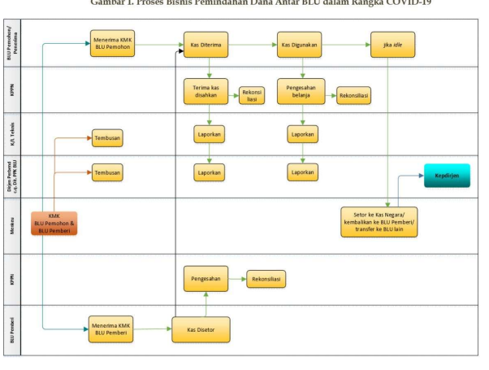

Petunjuk Teknis Pencatatan Transaksi Transitoris Surplus Kas BLU 
Petunjuk Teknis ini digunakan untuk pencatatan transaksi transitoris Kas pada Satker Badan Layanan Umum
 
I. **Proses Bisnis Transaksi Transfer Kas berupa Surplus Anggaran antar BLU** 
Proses Pemindahan Dana Antar BLU dalam Rangka COVID-19 dapat diuraikan sebagai berikut: 
1. **Keputusan Menteri Keuangan mengenai pemindahan surplus anggaran BLU yang sudah ditetapkan** 
disampaikan ke BLU Pemohon dan BLU Penerima, dengan ditembuskan ke DJPb/Direktorat PPK BLU dan K/L Teknis. 

2. **Atas dasar KMK tersebut BLU Pemberi memindahbukukan saldo surplus anggarannya sebesar yang** 
diperintahkan dalam KMK tersebut ke rekening BLU Penerima. 

3. **BLU Pemberi (dengan akun 82) dan BLU Pemohon (dengan akun 81) melakukan pengesahan (SP3B) atas** 
dana/kas yang dikeluarkan/diterima ke KPPN mitra kerja masing-masing. 

4. **Pengesahan oleh BLU Pemberi (dengan akun 82) dilakukan dengan ketentuan satu dokumen SP3B-BLU** 
untuk satu tujuan BLU penerima, dan sebaliknya pengesahan oleh BLU Penerima (dengan akun 81) 
dilakukan dengan ketentuan satu dokumen SP3B-BLU untuk satu sumber BLU Pemberi. 

5. **BLU Pemberi dan BLU Penerima melaporkan pengesahan atas pemindahan dana tersebut ke K/L Teknis dan** 
DJPb/Direktorat PPK BLU. 

6. **Setelah kas diterima, BLU Penerima dapat membelanjakan dan menyampaikan pengesahan (SP3B) belanja** 
ke KPPN mitra kerjanya. 

7. **BLU Penerima melaporkan pengesahan belanja tersebut ke K/L Teknis dan DJPb/Direktorat PPK BLU.** 8. **Berdasarkan hasil monitoring dan evaluasi yang dilakukan diketahui bahwa dana yang ditransfer tersebut** 
masih ada sisa, maka disetor ke kas Negara atau dikembalikan ke BLU Pemberi atau diteruspindahkan ke BLU lain yang lebih membutuhkan. 

## Ii. **Pencatatan Kas Keluar Transaksi Blu** 

Perekaman transaksi transitoris BLU dapat dilakukan dengan menggunakan user operator modul komitmen pada satuan kerja BLU. Berikut adalah langkah perekaman transaksi kas keluar transito BLU: 1. **Login menggunakan operator modul komitmen** 
2. Buka Modul Komitmen  RUH  **Pencatatan Transaksi Transitoris BLU** 
3. **Pada tampilan kertas kerja perekaman terdapat kolom Daftar Dokumen yang merupakan daftar hasil** 
perekaman transaksi dan kolom Input Informasi Dokumen yang berfungsi untuk detil perekaman transaksi Selanjutnya pada menu pencatatan Transaksi Transitoris BLU, perekeman detil transaksi dilakukan pada form input Informasi Dokumen dengan langkah berikut: 
1. **Klik Tombol Rekam** 

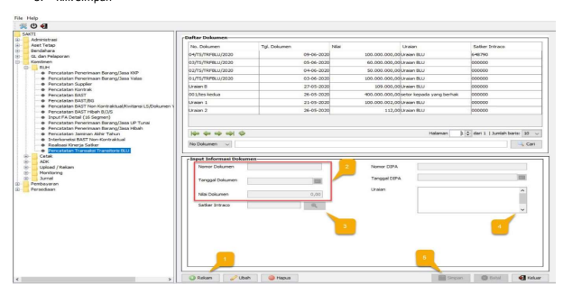

2. **Input Nomor Dokumen, Tanggal Dokumen, dan Nilai Dokumen (Nomor dan Tanggal DIPA otomatis)** 3. **Pilih Satuan Kerja Intraco ( Satuan Kerja yang akan menerima Kas Surplus BLU)** 
4. **Input uraian/keterangan atas dokumen yang direkam** 
5. Klik Simpan Berikut adalah contoh dan hasil perekaman transaksi kas keluar transitoris BLU: 

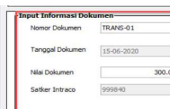

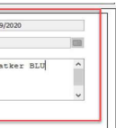

Pada Modul GLP, Hasil perekaman transaksi Kas Keluar Suprlus Anggaran BLU dapat dilihat pada menu 

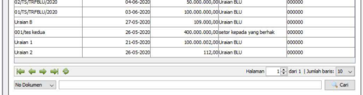 Monitoring Jurnal dengan langkah berikut: 
1. **Login User Operator GLP** 

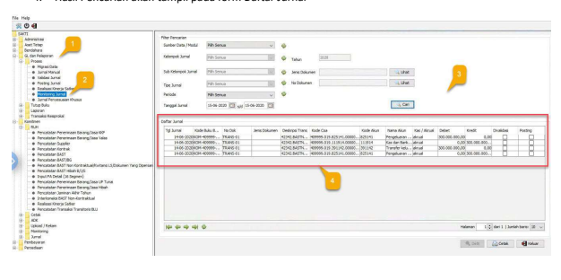

2. Masuk ke Menu GL dan Pelaporan  Proses  **Monitoring Jurnal** 
3. **Kemudian Filter Pencarian** 
4. Hasil Pencarian akan tampil pada form Daftar Jurnal 

## Iii. **Pencatatan Kas Masuk/Pemindahbukuan Kas Blu** 

Proses pencatatan kas masuk dilakukan oleh satuan kerja penerima uang atas pemindahbukuan kas BLU. 

Proses ini dilakukan pada modul Bendahara. Untuk langkah-langkahnya adalah sebagai berikut: 
1. Masuk ke modul Bendahara  Transakasi  **Mencatat Uang Masuk Bendahara Pengeluaran** 

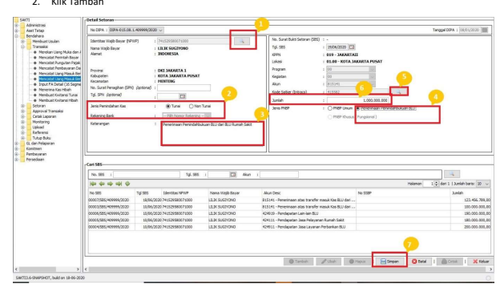

2. **Klik Tambah** 1. **Kemudian pilih NPWP menggunakan tombol kaca pembesar.** 2. **Setelah itu, pilih jenis pemindahan kas. Apabila memilih Non Tunai, maka pastikan memilih rekening** 
bank dimana uang tersebut diterima oleh satuan kerja. 

3. **Tambahkan keterangan pada kolom keterangan.** 4. **Silakan pilih jenis PNBP. Untuk Penerimaan Pemindahbukuan BLU silakan klik lingkaran di sebelah** 
tulisan Penerimaan Pemindahbukuan BLU. 

5. **Kemudian silakan pilih satker Pengirim dana tersebut. Silakan klik kaca pembesar di kolom Kode** 

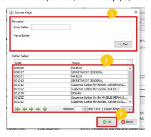

Satker (Intraco). Setelah di klik kaca pembesar, akan muncul pop up menu seperti berikut: 
1) **Masukkan kode satker atau nama satker pengirim dana pemindahbukuan kas. Lalu klik** 
tombol cari. 

2) **Setelah klik tombol cari, apabila telah memasukkan data kode satker atau nama satker** 
dengan benar, akan muncul pada daftar satker. Silakan di klik untuk memilih satkernya. 

3) **Setelah itu klik tombol OK. Maka akan kembali pada menu sebelumnya, dan kolom** 
satker intraco telah terisi. 

6. **Silakan masukkan jumlah penerimaan yang diterima pada kolom jumlah. Dan cek kembali tanggal** 
transaksi penerimaan. Isikan tanggal pada bagian Tgl SBS. 

7. **Jika data telah terisi semua dan telah dipastikan benar, lalu klik simpan.** 
Untuk memastikan Transaksi telah terinput secara benar, maka perlu dilakukan pengecekan oleh Operator GL 

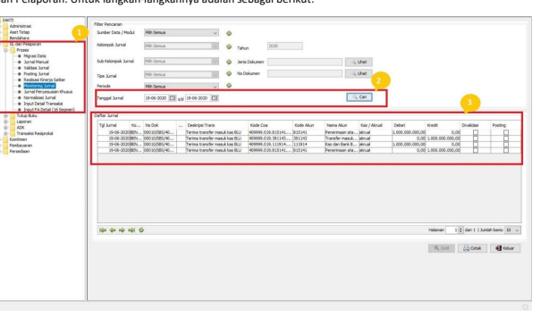

 dan Pelaporan. Untuk langkah-langkahnya adalah sebagai berikut: 
1. Pada modul GL dan Pelaporan, silakan masuk ke menu GL dan Pelaporan  Proses  **Monitoring** 
Jurnal. 

2. **Silakan isikan tanggal jurnal sesuai dengan tanggal penerimaan pemindahbukuan BLU. Lalu klik** 
tombol cari. 

3. **Apabila telah tercatat dengan benar, maka jurnal akan tampil pada form Daftar Jurnal.** 
IV. **Pengesahan Kas Keluar Transitoris BLU** 
Untuk proses Perekaman pengesahan kas keluar BLU akun 82 pada aplikasi SAKTI dilakukan oleh user operator modul Pembayaran. 

A. **Form Jenis SPP** 

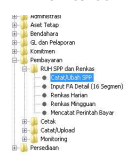

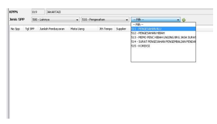

1. **Login menggunakan operator modul Pembayaran** 
2. Buka Modul Pembayaran  RUH SPP dan Renkas  **Catat/Ubah SPP** 
3. **Maka akan tampil form RUH SPP, pilih jenis SPP 511 - Pengesahan BLU** 

B. Jendela pop up **Ambil Data Pengesahan** 

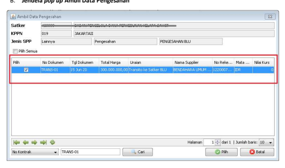

1. **Lakukan pencarian nomor Dokumen** 2. **Pilih/Centang No. Dokumen akun 82 yang telah diinput pada modul komitmen.** 3. Klik tombol pilih pada bagian bawah form. 

C. **Form RUH SPP** 

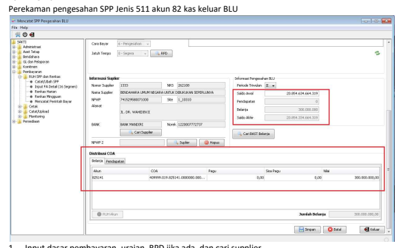

1. **Input dasar pembayaran, uraian, RPD jika ada, dan cari supplier.** 2. **Selanjutnya, Saldo Belanja pada informasi Pengesahan BLU dan Data COA Belanja pada form** 
Distribusi COA akan terinput secara otomatis sesuai dengan Nomor Dokumen pengesahan yang dipilih sebelumnya. 

3. **Kemudian klik "Simpan".** 

D. **Mencetak SPM** 

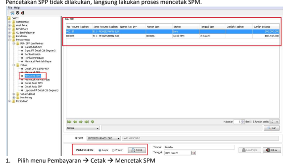

2. **Pilih No Resume Tagihan yang akan dicetak** 3. **Pilih PPSPM yang menandatangani, tempat dan tanggal** 
4. Klik tombol "Cetak". 

## E. **Validasi Spm**

Sebelum melakukan validasi lakukan upload dokumen pendukung oleh operator SPM, setelah itu 

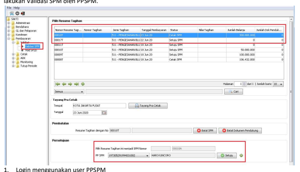

2. Pilih menu Pembayaran  Validasi  **Validasi SPM** 
3. **Pilih Nomor Resume Tahigan yang akan dilakukan Setuju SPM** 4. **Klik Tombol Setuju** 

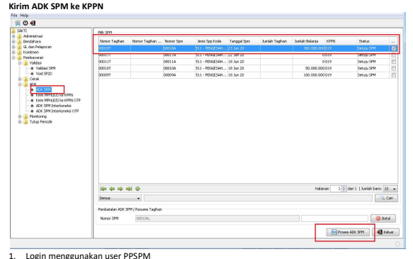

2. Pilih Menu Pembayaran ADK**ADK SPM** 
3. Klik "Proses ADK SPM" dan input PIN PPSM, maka adk terkirim ke KPPN. 

G. **Upload No. Pengesahan BLU** 

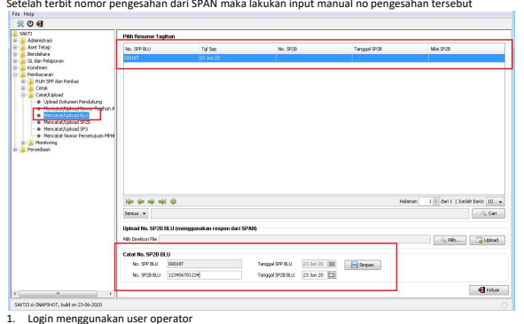

2. Piih menu Pembayaran  Catat/Upload  **Mencatat/Upload BLU** 
3. **Pilih No SPP BLU yang akan dicatat.** 
4. **Input no. Pengesahan dan tanggal pada kolom "Catat NO. SP2B BLU"** 5. **Klik "Simpan"** 

## V. **Pengesahan Kas Masuk/Pendapatan Transitoris Blu**

Untuk proses Perekaman pengesahan kas Masuk BLU akun 81 pada aplikasi SAKTI dilakukan oleh user operator modul Pembayaran. 

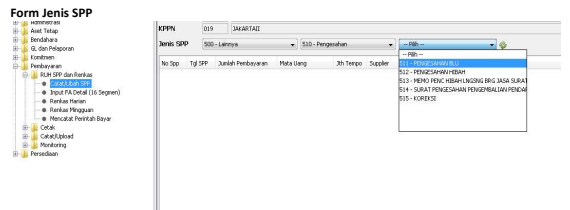

1. **Login menggunakan operator modul Pembayaran** 
2. Buka Modul Pembayaran  RUH SPP dan Renkas  **Catat/Ubah SPP** 
3. Maka akan tampil form RUH SPP, pilih jenis SPP 511 - Pengesahan BLU 

B. Jendela pop up **Ambil Data Pengesahan** 

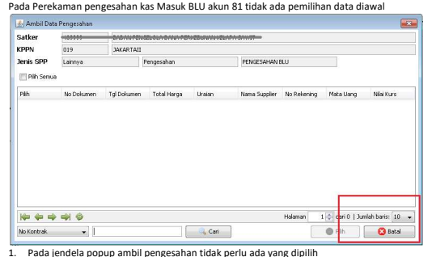

2. **Klik "Batal" untuk langsung masuk ke form RUH SPP.** 

C. **Form RUH SPP** 

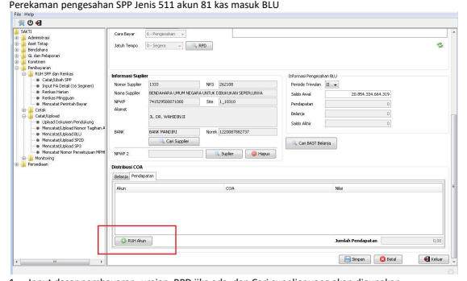

1. **Input dasar pembayaran, uraian, RPD jika ada, dan Cari supplier yang akan digunakan.** 
2. **Pilih tab Pendapatan pada Distribusi COA, kemudian klik "RUH Akun".** 3. Selanjutnya akan muncul form Pendapatan/Potongan/Penerimaan 

## D. **Form Pendapatan/Potongan/Penerimaan** 

1. **Pada form pendapatan/potongan/penerimaan klik tombol "Cari Bukti Setor"** 2. **Pilih No SBS akun 81 yang telah direkam pada modul Bendahara** 
3. **Kemudian klik "Pilih"** 
4. **Klik "Simpan"** 5. **Klik "Keluar" kembali ke form depan RUH SPP** 

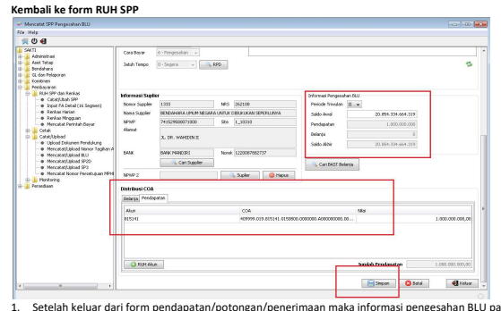

pendapatan dan Distribusi COA akan terisi. 

2. **Kemudian klik "Simpan"** 3. Langkah selanjutnya sama dengan penjelasan pada romawi "**IV. Pengesahan Kas Keluar Transitoris** 
BLU" point "IV.D. Mencetak SPM" dan seterusnya sampain poin "**IV.G. Upload No. Pengesahan** 
BLU." 