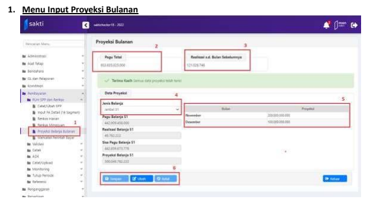
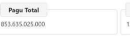
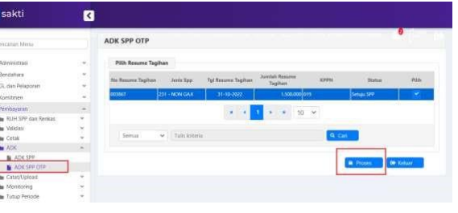
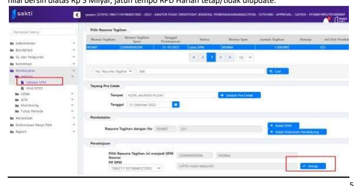
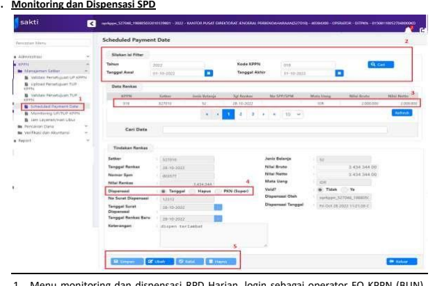

Petunjuk Teknis Aplikasi SAKTI)
→
�
PROYEKSI PENGELUARAN BULANAN
DAN RENCANA PENARIKAN DANA
HARIAN
→
�

## A. Deskripsi Singkat

| Modul           | SPM                                                                        |                                 |
|-----------------|----------------------------------------------------------------------------|---------------------------------|
| Role User       | OPR, VALIDATOR, APROVER                                                    |                                 |
| Modul Lain yang | -                                                                          | Administrator                   |
| Terkait         | -                                                                          | Sakti BUN                       |
| Transaksi yang  | SPM - Proyeksi Belanja Bulanan                                             |                                 |
| Tekait          | SPM - Adk SPP  SPM - Validasi SPM                                          |                                 |
| Dokumen Input   | -                                                                          | Proyeksi Pengeluaran bulanan    |
| -               | Validasi SPP dan Validasi SPM                                              |                                 |
| Output          | -                                                                          | Realisasi Belanja bulanan       |
| -               | Jatuh Tempo Pencairan                                                      |                                 |
| Validasi        | -                                                                          | Periode update Proyeksi Belanja |
| -               | Proyeksi selain jenis belanja 51, tidak boleh melebihi 100% .              |                                 |
| -               | Proyeksi untuk jenis belanja 51 tidak boleh melebihi 120% dari nilai pagu. |                                 |
| -               | Input Proyeksi tidak bisa kosong namun dapat diinput dengan nilai 0        |                                 |
| -               | Memajukan Jatuh tempo oleh KPPN harus dengan surat dispensasi              |                                 |
| B. ALUR PROSES  |                                                                            |                                 |

## Beberapa Hal Yang Perlu Diperhatikan: 

- Seluruh Satker pengguna aplikasi SAKTI membuat Proyeksi Pengeluaran Bulanan sesuai dengan ketentuan yang berlaku.

- Penginputan proyeksi pengeluaran bulanan tidak ada nilai default, sehingga satker diharuskan untuk melakukan input manual (jika di bulan berkenaan tidak terdapat rencana realisasi maka dapat diinput dengan nilai 0). 

- Satker dapat menyusun proyeksi pengeluaran bulanan di tanggal 1 - 5 setiap bulannya, dan dapat dimuktahirkan di tanggal 10 - 15 setiap bulannya atau dapat berubah sesuai dengan ketentuan yang berlaku.

- Proyeksi pengeluaran bulanan dapat berbeda dengan halaman III DIPA. 

- Satker menyusun RPD harian secara otomatis dan mempunyai jatuh tempo 5 (lima) Hari Kerja setelah tanggal setuju / validasi SPP. Jatuh tempo sebagaimana dimaksud dapat dimutakhirkan berdasarkan tanggal persetujuan SPM oleh PPSPM menjadi 2 (dua) Hari Kerja setelah tanggal persetujuan SPM oleh PPSPM apabila nilai bersih transaksi kurang dari Rp 5 Milyar. Apabila nilai bersih transaksi lebih dari Rp 5 Milyar, maka jatuh tempo SPM akan mengikuti jatuh tempo pada saat setuju SPP (tidak diupdate).

- Pengiriman ADK SPM tidak boleh melebihi tanggal jatuh tempo RPD Harian. - RPD Harian hanya berlaku untuk Jenis SPP, Jenis belanja dan Jenis tagihan tertentu. Berikut contoh transaksi yang tidak membentuk SPD sebagai berikut : SPM UP, SPM TUP, SPM Pengesahan, Gaji, PPP, sumber dana SBSN, transaksi Valas, SPM Koreksi. 

- Dalam hal batas-batas pengajuan SPM sehubungan dengan pengaturan pada Langkah-langkah akhir tahun, SPM dengan RPD Harian yang diajukan melebihi tanggal akhir pengajuan SPM akan terbentuk jatuh tempo *immediate* (segera)
- Pemberian dispensasi oleh Kepala KPPN dilakukan pada tahap setelah SPM disetujui dan sebelum ADK 
SPM dikirimkan. 

## C. Penjelasan Teknis Aplikasi

Pilih menu pada modul Pembayaran → RUH SPP dan Renkas → Proyeksi Belanja Bulanan 1. List menu "Proyeksi Belanja Bulanan". 

2. Pagu Total merupakan Pagu Total untuk jenis belanja terkait. 

3. Realisasi sampai dengan bulan sebelumnya sesuai dengan jumlah realisasi yang telah 4. Jenis Belanja sesuai dengan data di DIPA satuan kerja. 

5. Proyeksi Bulanan yang perlu diinput oleh satuan kerja.

6. Tombol Ubah, Simpan, Batal. 

Penjelasan Lebih lanjut penginputan Proyeksi Pengeluaran a. Tombol 

- Klik tombol Simpan untuk menyimpan hasil input Proyeksi. 

- Klik tombol batal untuk membatalkan hasil input Proyeksi. 

## B. Jenis Belanja. 

 
- Pilih Jenis belanja yang akan diinput nilai proyeksinya

## C. Data Proyeksi Bulanan

- Klik dan input pada kolom Proyeksi sesuai dengan bulan yang akan diinputkan nilai proyeksinya. 

Nilai proyeksi yang diinput adalah nilai bruto pengeluarannya.

d. Pagu dan Realisasi 

Telah dijelaskan pada "Menu Input Proyeksi". 

## 2. Mekanisme Pembentukan Rpd Harian

a. RPD Harian akan terbentuk secara otomatis setelah PPK berhasil melakukan persetujuan terhadap SPP yang akan dikirimkan (status SPP "Setuju SPP"). RPD Harian akan terbentuk dengan Jatuh tempo 5 hari kerja sejak tanggal setuju SPP.

b.  Jatuh tempo pada Cetakan SPP adalah 5 hari kerja / terjadwal.

| KEMENTERIAN KEUANGAN                                                  |                  |               |    |
|-----------------------------------------------------------------------|------------------|---------------|----|
| KANTOR PUSAT                                                          | HARAAN           |               |    |
| Nomor 00388T                                                          | Haman            | dari          | 1  |
| Kuasa Bendahara Umum                                                  |                  |               |    |
| Agar melakukan pembayaran tagihan seju                                | SATU J           | RIBU RUPIAH / |    |
| Tahun Anggaran                                                        | 2022             | NON GA        |    |
| Dasar Pembayara                                                       | Jatuh Tempo      | 5 Hari        |    |
| DIPA                                                                  | DIPA-015.08.11.5 |               |    |
| Nomor                                                                 |                  |               |    |
| Tanggal                                                               | 17-Nov-20        |               |    |
| UU NOMOR 6 TAHUN 202                                                  |                  |               |    |
| APBN TAHUN ANGGARAN                                                   | JUMLAH UANG      |               |    |
| 527010.019.524111.01508WA.4719EBA.A0060001.00000.1.0151.2.00000.00000 | 1.500.00.00      |               |    |

c.   Setelah PPSPM menyetujui SPM, maka untuk SPM dengan nilai bersih dibawah Rp 5 Milyar, RPD
Harian akan diupdate menjadi 2 hari kerja sejak tanggal setuju SPM. Namun untuk SPM dengan nilai bersih diatas Rp 5 Milyar, jatuh tempo RPD Harian tetap/tidak diupdate.

1. Menu monitoring dan dispensasi RPD Harian, login sebagai operator FO KPPN (BUN), 
masuk ke menu KPPN → Manajemen Satker → Scheduled Payment Date. 

2. Untuk memfilter data RPD Harian input kode KPPN, tanggal awal dan tanggal akhir. 3. Daftar RPD Harian yang sudah terbentuk dari satuan kerja 4. Fitur dipensasi, tombol tanggal digunakan untuk mengeser/menjadwalkan ulang tanggal RPD Harian, tombol hapus untuk melakukan hapus RPD Harian yang dapat digunakan oleh user dengan kewenangan khusus.

5. Tombol Simpan, Ubah, Batal, Hapus dispensasi. 