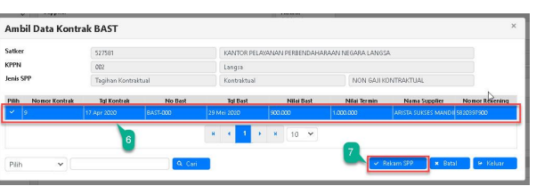
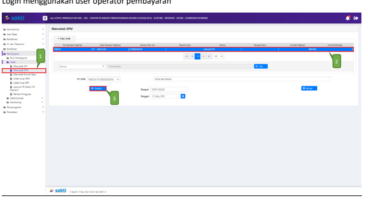

Petunjuk Teknis Aplikasi SAKTI
›PEREKAMAN SPM
KONTRAKTUAL
KEMENTERIAN KEUANGAN RI 
DITJEN PERBENDAHARAAN
�
�
→
→
♦

## I. Informasi Umum A. Deskripsi Transaksi

SPM Kontraktual 111 digunakan untuk membayar tagihan yang sifatnya kontraktual.

| Modul                  | PEM                                                                                               |
|------------------------|---------------------------------------------------------------------------------------------------|
| Role User              | OPR, VAL, APP                                                                                     |
| Modul Lain yang        | KOM                                                                                               |
| Terkait Transaksi yang | KOM - Pembuatan supplier type 2 dan type 6                                                        |
| Tekait                 | KOM - Pembuatan kontrak KOM - Pembuatan BAST Kontraktual PEM - Perekaman RPD                      |
| Dokumen Input          | SPP SPM KONTRAKTUAL                                                                               |
| Output                 | SP2D SPM KONTRAKTUAL                                                                              |
| Validasi               | Sebelum merekam SPP mohon dipastikan BAST Kontraktual telah direkam  sebelumnya di Modul Komitmen |

## B. Informasi Penting Lainnya

Beberapa hal yang perlu diperhatikan oleh satker (pengguna SAKTI):
1. SPM Kontraktual 111 diperuntukkan untuk tagihan kontraktual 2. Sebelum rekam SPP satker harus merekam Kontrak dan BAST Kontraktual terlebih dahulu 3. Perekaman BAST Kontraktual untuk mengakomodir penginputan kode barang baik Persediaan maupun Aset 4. Mohon ketika memilih jenis SPP Kontraktual 111 jangan lupa untuk memilih BAST Kontraktual yang telah dibuat sebelumnya.

## 1. Alur Proses

DIAGRAM ALUR PROSES

## A. Penjelasan Diagram Alur Proses

1) **Input Supplier**
Input Supplier mengacu pada Petunjuk Teknis tentang Perekaman Supplier.

2) **Input Kontrak**
Input Kontrak mengacu pada Petunjuk Teknis tentang Perekaman Kontrak.

3) **Input BAST**
Input BAST mengacu pada Petunjuk Teknis tentang perekaman BAST Kontraktual.

4) **Input SPP**
Login menggunakan user operator SPP/SPM

1. Masuk ke Modul Pembayaran → RUH SPP → Catat/Ubah SPP
2. Pilih Jenis SPP 111 NON GAJI KONTRAKTUAL
3. Klik tombol tambah Ambil Data Kontrak BAST

17 Apr 2020 29 Mei 200

4.

Pilih BAST Kontraktual 5.

Klik tombol "Pilih"

K Sebelum me

1. Pilih Dasar Pembayaran

 2. Uraian Pembayaran akan terisi otomatis ketika saudara memilih BAST Kontraktual. Namun, apabila perlu dilakukan penyesuaian, dapat langsung memperbaiki uraian tersebut pada kolom 
'Uraian Pembayaran' 3. Silahkan memilih RPD yang telah saudara buatsebelumnya, apabila nilai SPM melebihi 1 M (sesuai dengan Peraturan Menteri Keuangan Nomor 197/PMK.05/2017 tentang Rencana Penarikan Dana, Rencana Penerimaan Dana, dan Perencanaan Kas) dan silahkan dilewati saja (tidak perlu pilih RPD) 
apabila nilai SPM kurang dari 1 M.

4. Informasi Supplier akan terisi otomatis ketika saudara memilih BAST Kontraktual 5. Klik tombol Cari BAST (Pilih Bast Kontraktual yang ingin dibayar, maka Akun Pengeluaran akan terisi otomatis sesuai dengan waktu merekam BAST Kontraktual 6. Pilih BAST Kontraktual yang akan dibuat SPP-nya 7. Klik tombol "Rekam SPP"
8. Input Akun Potongan apabila ada potongan 9. Klik Tombol "Simpan"

## 5) Cetak Spp

Login menggunakan user operator pembayaran

1. Masuk ke Modul Pembayaran →Cetak→Mencetak SPP
2. Pilih SPP yang ingin dicetak 3. Pilih PPK
4. Pastikan Tempat dan Tanggal telah sesuai 5. Klik tombol "Unduh" untuk mencetak SPP.

## 6) Setuju Spp

Login menggunakan user PPK

1. Masuk ke Modul Pembayaran →Validasi→Validasi SPP
2. Pilih SPP yang ingin divalidasi 3. Klik tombol "Unduh Pra Cetak" untuk mencetak SPP yang akan divalidasi 4. Klik tombol "Setuju" untuk menyetujui SPP.

5. Klik tombol "Batal" apabila ingin membatalkan validasi atas SPP yang sudah divalidasi

## 7) Create Adk Spp

Login menggunakan user PPK
1. Masuk ke Modul Pembayaran →ADK→ADK SPP OTP
2. Pilih SPP yang ingin dibuat ADK SPP dengan melakukan ceklis pada kolom pilih. Dapat memilih lebih dari 1 SPP sekaligus apabila diperlukan.

3. Klik tombol "Proses" 4. Klik tombol 'Req OTP via SMS' untuk meminta kode OTP. 

5. Setelah menerima kode OTP, silakan input pada kolom 'Input OTP'.

## 8) Cetak Spm

Login menggunakan user operator pembayaran

1. Masuk ke Modul Pembayaran →Cetak→Mencetak SPM
2. Pilih SPM yang ingin dicetak 3. Klik tombol "Unduh"

## 9) Upload Dokumen Pendukung

Login menggunakan user operator pembayaran

1. Masuk ke Modul Pembayaran →Catat/Upload→Upload Dokumen Pendukung 2. Pilih SPM yang ingin diupload dokumen pendukungnya 3. Pilih jenis dokumen pendukung 4. Klik tombol "Pilih" untuk memilih file yang akan diupload 5. Klik tombol "Upload" 6. File yang akan diupload akan muncul 7. Klik tombol "View" apabila ingin melihat file yang telah diupload 8. Klik tombol "Hapus" apabila ingin menghapus file yang telah diupload

## 10) Setuju Spm

Login menggunakan user PPSPM

1. Masuk ke Modul Pembayaran →Validasi→Validasi SPM
2. Pilih SPM yang ingin divalidasi 3. Klik tombol "Unduh Pra Cetak" untuk mencetak SPM yang akan divalidasi 4. Klik tombol "Setuju" 5. Klik tombol "Batal SPM" apabila ingin membatalkan validasi atas SPM yang sudah divalidasi. 

Klik tombol "Batal Dokumen Pendukung" apabila ingin membatalkan dokumen pendukung yang telah di upload sebelumnya.

## 11) Create Adk Spm

Login menggunakan user PPSPM

1. Masuk ke Modul Pembayaran →ADK→ADK SPM OTP
2. Pilih SPM yang ingin dibuat ADK SPM. Dapat memilih lebih dari 1 sekaligus apabila diperlukan.

3. Klik tombol "Proses ADK SPM" 4. Klik tombol "Req OTP via SMS" untuk untuk meminta kode OTP. 

5. Setelah menerima kode OTP, silakan input pada kolom 'Input OTP'.

6. Klik tombol "Proses"

## 12) Proses Kppn

Proses di KPPN Mengacu pada Standar Operasional Prosedur Pemrosesan SPM menjadi SP2D pada KPPN.

## 13) Catat Sp2D

Login menggunakan user operator pembayaran

1. Masuk ke Modul Pembayaran →Catat/Upload→ Catat/Upload SP2D
2. Pilih SPM yang ingin dicatat No. SP2D 3. Klik tombol "Catat SP2D Otomatis"