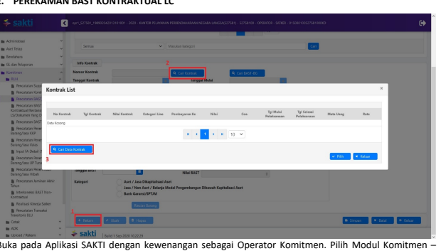

�
Petunjuk Teknis Aplikasi SAKTI
→
�
♦
SPD-LC
�

## I. Informasi Umum A. Deskripsi Transaksi

| Modul                   | PEMBAYARAN                                        |                               |
|-------------------------|---------------------------------------------------|-------------------------------|
| Role User               | OPR                                               |                               |
| Modul Lain terkait      | KOMITMEN                                          |                               |
| Transaksi yang Tekait   | SPD-LC                                            |                               |
| Dokumen Input           | Kontrak, BAST                                     |                               |
| Output                  | Pencatatan SP3-LC                                 |                               |
| Validasi                | -                                                 | Pengecekan data SP3-LC OMSPAN |
| -                       | Pencatatan SP3-LC dengan jenis SPP 133 SPD LC     |                               |
| -                       | Distibusi COA Cara Penarikan 4 - LC               |                               |
| -                       | Kategori Line Kontrak LC                          |                               |
| Petunjuk Teknis Terkait | KOM - Juknis Perekaman Supplier ADM - OTP Pejabat |                               |

## B. Informasi Penting Lainnya

1. Sebelum melakukan transaksi SPD-LC pastikan satker memiliki data FA (ketersediaan dana) 
dengan kode Cara Penarikan 4 –LC dapat dilihat pada laporan FA pada aplikasi SAKTI. 

2. Setelah SPAN menerbitkan SP3-LC, satker dapat melanjutkan dengan melakukan perekaman Kontrak dan BAST pada aplikasi SAKTI modul komitmen.

3. Satker dapat melakukan pencatatan SP3-LC pada aplikasi SAKTI modul pembayaran, jika data SP3-LC telah ada pada OMSPAN, pencatatan pada menu catat/upload -> Mencatat SP3 LC.

4. Kurs pada kontrak dan BAST maupun SP3-LC dapat berbeda sehingga dimungkinkan akan terjadi selisih kurs dikarenakan terdapat perbedaan waktu transaksi.

5. Satu kontrak dapat dibuat beberapa BAST dan pencatatan SP3-LC dapat dipilih banyak BAST.

## C. Alur Proses

 D.   Perekaman Kontrak Lc 1. Login Aplikasi

Aplikasi SAKTI dengan responsibility sebagai Operator Komitmen

## 2. Perekaman Kontrak

Masuk ke menu : Komitmen - RUH - Pencatatan Kontrak - Rekam

| 0111201711001.   | �                            |
|------------------|------------------------------|
| Percaran         |                              |
| Montoring        |                              |
| .umah            | | Build 12 Jun 2020 21.05.52 |

Lengkapi isian pada tab "Header Kontrak", khusus untuk kontrak tahunan yang berisikan antara lain :
- Tipe Kontrak (Annual Year).

- Tipe Komitmen (Kotrak).

- Isikan Supplier yang sudah mendapatkan NRS. - Nomor Kontrak dan tanggal kontrak diinput manual.

- Nilai kontrak pada contoh adalah sebesar 5 USD, namun terdapat 4 digit dibelakang koma sehingga pada aplikasi tertulis 5,0000.

- Kode KPPN sebagai kantor bayar.

- Mata Uang yang digunakan. - Nilai Rate/nilai kurs saat kontrak dibuat, pada contoh adalah Rp.14.000,- terdapat 4 digit dibelakang koma sehingga pada aplikasi menjadi 14.000,0000.

- Mata Uang Kontrak yang berbeda walaupun satu kontrak, harus direkam sebagai kontrak tersendiri.

- Data pinjaman atau hibah luar negeri (apabila sumber dana dari Loan/Hibah).

- Uraian Kontrak /uraian pekerjaan.

- Jangka waktu pelaksanaan (tanggal mulai dan berakhirnya kontrak dalam satu tahun anggaran yang sama).

- Jangka Waktu Pemeliharaan (untuk sementara belum digunakan).

- Uraian ketentuan dan sanksi (free text dan wajib diisi, dihindari penggunaan symbol kode ASCII 
seperti %, ‰, dan lain-lain).

- Cara Pembayaran (sekaligus atau bertahap).

- Hal-hal yang menyangkut Uang Muka dan Retensi (untuk sementara belum digunakan).

- Tekan tombol "Simpan" apabila data yang dibutuhkan sudah terisi semua.

Apabila Header Kontrak sudah tersimpan, maka tab rencana pembayaran (Contract Line) akan aktif.

- Contract Line hanya berisi satu baris apabila kontrak hanya membebani satu jenis kombinasi COA.

- Contract Line bisa berisi lebih dari satu baris apabila dalam satu kontrak membebani lebih dari satu kombinasi COA (beda akun/beda output/beda kegiatan/beda cara tarik/beda sumber dana, dll).

- Total jumlah nominal dari seluruh Contract Line yang ada harus mempunyai nilai yang sama dengan nilai kontrak.

Tekan tombol "Rekam" untuk melakukan perekaman rencana pembayaran (Contract Line). Lengkapi isian pada tab "Rencana Pembayaran" yang berisikan antara lain :
- Nomor Line (Sesuai urutan sesuai jumlah line yang akan kita rekam).

- Tipe Belanja -> Belanja/Biaya (Default). - Deskripsi Line.

- Kategori Line (Cara Tarik -> LC).

- Untuk kolom Uang Muka dan Retensi (untuk sementara belum digunakan).

Tekan tombol simpan apabila data yang dibutuhkan sudah terisi semua.

Jadwal Pembayaran (Payment Schedule) berisikan rincian/termin dari tiap line contract dengan ketentuan :
- Jumlah nominal seluruh termin harus sama dengan nominal line contract yang menjadi induknya.

- Apabila terdapat perbedaan dari kombinasi COA, agar termin direkam dalam contract line yang berbeda.

- Uang Muka dan Retensi masih menggunakan metode netto, dan direkam sebagai termin.

Tekan tombol "Rekam" untuk melakukan perekaman Jadwal Pembayaran (termin). Lengkapi isian pada tab Jadwal Pembayaran yang berisikan antara lain :
- Nilai Line (nominal nilai Line yang menjadi induknya).

- Nomor Jadwal Pembayara (nomor termin yang akan kita rekam).

- Deskripsi pembayaran (uraian pembayaran dari termin, missal : uang muka, termin1, dst.).

- Uang Muka (untuk sementara tidak digunakan). - Tanggal Pembayaran (tanggal rencana termin yang berkenaan dibayarkan, dengan ketentuan pembayara pertama harus sama atau lebih dari tanggal kontrak dan pembayaran terkahir bisa melebihi tanggal berakhirnya kontrak namun masih dalam tahun anggaran yang sama).

- Nilai Pembayaran (nilai nominal dari termin).

Apabila kontrak terdiri lebih dari satu termin, lakukan rekam kembali untuk termin berikutnya. Tekan tombol "Simpan" apabila data yang dibutuhkan sudah terisi semua.

Perekaman distribusi COA dilakukan dengan ketentuan :
- Tiap termin/Jadwal pembayaran hanya berisika satu distribusi COA.

- Nilai nominal dalam distribusi COA harus sama dengan nilai Termin-nya.

Pilih termin yang akan direkam distribusi COA-nya. Tekan tombol "Rekam" untuk melakukan perekaman Distribusi COA.

Lengkapi isian pada tab Struktur COA dengan memilih kombinasi segment COA : Kode Satker, Kementerian, Eselon I, Program, Kegiatan, Output, Akun, Segmen Dana, dll.

Sumber Dana pilih B - PLN, Cara Penarikan 4 - LC dan pilih No. Register yg telah terdaftar Lengkapi Pendetilan COA sampai dengan level item (16 segmen)
Tekan tombol "Simpan" apabila data yang dibutuhkan sudah terisi semua. Perekaman data Kontrak pada Responsibility Operator sudah selesai, dan bisa melakukan pencetakan Karwas Kontrak.

Proses selanjutnya pada Responsibility PPK untuk membuat ADK dan mengirimkanya ke Portal untuk selanjutnya di proses di SPAN.

## 7. Pembentuk Adk Bcka (Adk Kontrak)

Login aplikasi SAKTI dengan responsibility sebagai Pejabat Pembuat Komitmen. Masuk pada Komitmen

 - ADK - ADK Kontrak Interkoneksi. Pilih kontrak yang akan dibentuk ADK-nya kemudian tekan tombol proses. Akan muncul kotak dialog Validasi ADK, silahkan menginput PIN pada kolom yang tersedia dan klik tombol "Proses".

Atas ADK BCKA yang telah dibentuk, maka pihak KPPN akan melakukan proses pendaftara Data Kontrak pada SPAN mengacu pada SOP yag berlaku. Setelah mendapat persetujuan dari SPAN, Data Kontrak tersebut akan mendapatkan nomor CAN (Commitment Aplication Number) atau NRK (Nomor Register Kontrak).

## E. Perekaman Bast Kontraktual Lc

RUH - Pencatatan BAST/BG.

1. Klik tombol "Rekam" untuk merekam BAST Kontraktual yang baru.

2. Klik tombol "Cari Kontrak" untuk mencari Data Kontrak yang akan digunakan.

3. Kemudian muncul Pop Up Box, klik tombol "Cari Data Kontrak" untuk melihat daftar Data Kontrak yang akan digunakan.

1. Kemudian muncul *Pop Up Box* daftar kontrak yang dapat digunakan dalam perekaman BAST 
Kontraktual, pilih Kontrak yang digunakan.

2. Klik tombol "Pilih" atas Kontrak yang digunakan. 1. Pada Form Data BAST, input secara manual untuk Nomor BAST.

2. Pada kolom Progress Pekerjaan, input progress atas pembayaran BAST tersebut.

3. Nilai kurs saat BAST dibuat, pada contoh adalah sebesar 14.500,00 (dua digit dibelakang koma)
sehingga terdapat selisih kurs antara Kontrak dan BAST.

4. Pilih Kategori untuk menentukan BAST akan menghasilkan BMN atau tidak. 

5. Klik "Rincian Barang" untuk melakukan pemilihan Aset yang dihasilkan.

6. Klik tombol "Simpan" untuk menyimpan BAST Kontraktual yang telah direkam.

## F. Pencatatan Sp3-Lc

1. Menu **catat SP3 LC** 

dibuatkan BAST, langkah-langkah berikutnya adalah sbb: 1. Klik tombol "Cari Kontrak".

2. Kemudian muncul Pop Up *Box,* pilih data kontrak LC yang akan dilakukan pencatatan SP3-LC.

3. Klik "Pilih", akan muncul data-data BAST pada grid.

Berikutnya adalah pencarian dan pemilihan No. SP3 LC sbb:
1. Klik pada tombol "Cari SP3" 2. Kemudian muncul Pop Up Box daftar SP3 yang akan dicatat, silahkan pilih salah satu No. SP3.

3. Pada contoh Nilai Kurs SP3-LC adalah sebesar Rp.14.700 sehingga terdapat selisih kurs antara Kontrak, BAST dan SP3-LC.

4. Klik "Pilih" akan muncul nomor dan tanggal SP3 pada menu mencatat SP3 LC.

Penandatangan dapat dipilih apabila telah dilakukan perekaman pada referensi pejabat dan referensi penandatangan pada menu administrator, selanjutnya silahkan:
1. Pilih Pejabat penandatangan sebagai PPK, akan muncul nama PPK disebelah kanan.

2. Pilih Pejabat penandatangan sebagai PPSPM, akan muncul nama PPSPM disebelah kanan.

3. Kemudian klik tombol "Simpan" maka proses pencatatan SP3-LC telah selesai.

dilakukan pencatatan SP3-LC di SAKTI, dengan penjelasan sbb:
1. Jenis Tagihan adalah 133 - APD LC.

2. Pada contoh diatas nilai belanja adalah 5 USD dengan nilai kurs 14.700,-.

3. Statusnya adalah "Upload SP2D". 4. Jika terdapat banyak data dan kesulitan dalam pencarian data, silahkan lakukan pencarian pada form pencarian dengan tombol "Cari".