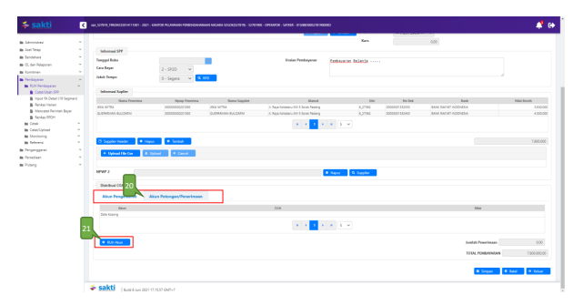

→
→
Petunjuk Teknis Aplikasi SAKTI)
♦ PEREKAMAN SPM
GAJI PEJABAT NEGARA
�
�
�

## I. Informasi Umum A. Deskripsi Transaksi

Jenis SPM:214-Gaji Pejabat Negara digunakan untuk Pembayaran atas Gaji Pejabat Negara

| Modul                  | PEM                                                                                                                                                                                                                                                                                                                                                                  |
|------------------------|----------------------------------------------------------------------------------------------------------------------------------------------------------------------------------------------------------------------------------------------------------------------------------------------------------------------------------------------------------------------|
| Role User              | OPR, VAL, APP                                                                                                                                                                                                                                                                                                                                                        |
| Modul Lain yang        | KOM                                                                                                                                                                                                                                                                                                                                                                  |
| Terkait Transaksi yang | KOM - Pembuatan supplier tipe 3                                                                                                                                                                                                                                                                                                                                      |
| Tekait Dokumen Input   | SPP SPM 214-Gaji Pejabat Negara                                                                                                                                                                                                                                                                                                                                      |
| Output                 | SP2D Gaji Pejabat Negara                                                                                                                                                                                                                                                                                                                                             |
| Validasi               | User harus memastikan data supplier tipe 3 sebagai penerima pembayaran atas  Gaji Pejabat Negara telah direkam sebelumnya di pencatatan data supplier  dalam Modul Komitmen. User harus memilih Header Supplier atas data supplier tipe 3 sebelum  melakukan input penerima pembayaran atas Gaji Pejabat Negara pada kolom  informasi supplier dalam form catat SPP. |

## B. Informasi Penting Lainnya

Beberapa hal yang perlu diperhatikan oleh satker (pengguna SAKTI):
1) *User* harus memastikan data supplier tipe 3 sebagai penerima pembayaran atas Gaji Pejabat Negara telah direkam sebelumnya di pencatatan data supplier dalam Modul Komitmen.

2) *User* harus memilih Header Supplier atas data supplier tipe 3 sebelum melakukan input penerima pembayaran atas Gaji Pejabat Negara pada kolom informasi supplier dalam form catat SPP.

3) Input penerima pembayaran atas Gaji Pejabat Negara pada kolom informasi supplier dalam form catat SPP, dilakukan dengan input penerima dan nilai bersih pembayaran atas Gaji Pejabat Negara.

## Ii. Alur Proses

A. **DIAGRAM ALUR PROSES**

## B. Penjelasan Diagram Alur Proses

1) **Input Supplier**
Input Supplier mengacu pada Petunjuk Teknis tentang Perekaman Supplier.

2) **Input SPP**
Login sebagai pengguna dengan kewenangan operator pada Modul Pembayaran.

1. Masuk ke Modul Pembayaran → RUH SPP → Catat/Ubah SPP
2. Pilih Jenis SPP 214 - Gaji Pejabat Negara 3. Klik tombol tambah

## 1. Pilih Dasar Pembayaran.

2. Pilih Cara Bayar: SP2D. 3. Pilih RPD yang telah dibuat sebelumnya, apabila nilai SPM melebihi 1 M (sesuai dengan Peraturan Menteri Keuangan Nomor 197/PMK.05/2017 tentang Rencana Penarikan Dana, Rencana Penerimaan Dana, dan Perencanaan Kas) dan lewati proses ini, apabila nilai SPM 
kurang dari 1 M.

4. Uraian pembayaran diisi sesuai jenis SPP-SPM yang telah dipilih.

5. Klik tombol "Supplier Header" untuk memilih supplier header.

6. Klik tombol "Tambah", untuk input secara manual penerima dan nilai bersih pembayaran atas Gaji Pejabat Negara.

Pilih data supplier tipe 3, atas Supplier Header untuk pembayaran atas Gaji Pejabat Negara. Dan isi Kolom nilai bersih pada informasi *supplier* dengan nilai bersih yang diterima oleh penerima (setelah dikurangi potongan).

7. Apabila hendak melakukan upload file CSV, setelah memilih supplier header (langkah 5), 
silakan klik tombol "Upload File CSV". Nama penerima dan nilai pembayaran akan muncul secara otomatis sesuai dengan file CSV yang diupload.

8. Silakan klik pada "Akun Pengeluaran" apabila hendak melakukan perekaman akun pengeluaran, dan/atau klik "Akun Potongan/Penerimaan" apabila hendak merekam potongan/penerimaan.

9. Klik tombol "RUH Akun" untuk menginput Akun Pengeluaran / Akun Potongan.

10. Klik Tombol "Rekam" untuk menambah Akun.

11. Pilih Akun yang akan digunakan.

12. Klik Tombol "Detail Coa"

13. Klik tombol "Tambah".

14. Klik tombol "Kaca Pembesar" untuk mencari Segmen 15/16nya. Pilih Segmen tersebut.

15. Masukkan nilai per detail segmen tersebut.

16. Klik tombol "Simpan". Apabila dalam akun yang sama terdapat lebih dari satu segmen 15/16, maka silakan ulangi langkah nomor 13-16.

17. Klik tombol "Keluar" untuk kembali ke halaman sebelumnya.

18. Klik tombol "Simpan" untuk menyimpan nilai akun yang digunakan. Apabila terdapat lebih dari satu akun, silakan ulangi langkah nomor 10-18.

19. Klik tombol "Keluar" untuk kembali ke perekaman SPP.

20. Klik tab "Akun Potongan/Penerimaan" untuk merekam potongan SPM. *(Apabila tidak terdapat* potongan SPM, bisa langsung menyimpan SPP tersebut dengan klik tombol "Simpan")
21. Klik tombol "RUH Akun".

22. Klik Tombol "Tambah" untuk menambah akun potongan/penerimaan. 23. Cari akun yang akan digunakan. Apabila akun yang ingin direkam diawali dengan angka 4xx dan 8xx, maka silakan klik tombol "4xx & 8xx ". Namun apabila akun yang hendak direkam merupakan akun dengan awalan 5xx, maka silakan cari akun tersebut dengan klik tombol "5xx".

24. Apabila menggunakan akun 4xx atau 8xx, maka silakan isikan nilai potongan SPM atas akun tersebut di kolom Nilai.

Apabila menggunakan akun 5xx, maka silakan klik tombol "Detail COA" untuk merekam nilai potongan SPM atas akun tersebut.

25. Jika sudah selesai, klik tombol "Simpan". Apabila hendak menambahkan akun lainnya, silakan ulangi langkah nomor 22-24.

26. Klik tombol "Keluar" apabila perekaman potongan telah selesai dilakukan, untuk melanjutkan perekaman SPM tersebut.

## 3) Cetak Spp

Login menggunakan user operator pembayaran 1. Masuk ke Modul Pembayaran →Cetak→Mencetak SPP
2. Pilih SPP yang ingin dicetak 3. Pilih PPK
4. Pastikan Tempat dan Tanggal telah sesuai 5. Klik tombol "Unduh" untuk mencetak SPP.

6. Klik tombol "SSP" apabila ingin mencetak SSP

## 4) Setuju Spp

Login sebagai pengguna PPK selaku *validator* pada Modul Pembayaran.

1. Masuk ke Modul Pembayaran →Validasi→Validasi SPP
2. Pilih SPP yang ingin divalidasi 3. Klik tombol "Unduh Pra Cetak" untuk mencetak SPP yang akan divalidasi 4. Klik tombol "Setuju" untuk menyetujui SPP.

5. Klik tombol "Batal" apabila ingin membatalkan validasi atas SPP yang sudah divalidasi

## 5) Buat Adk Spp

Login sebagai pengguna PPK selaku *validator* pada Modul Pembayaran.

1. Masuk ke Modul Pembayaran →ADK→ADK SPP OTP
2. Pilih SPP yang ingin dibuat ADK SPP dengan melakukan ceklis pada kolom pilih. Dapat memilih lebih dari 1 SPP sekaligus apabila diperlukan.

3. Klik tombol "Proses" 4. Klik tombol 'Req OTP via SMS' untuk meminta kode OTP. 

5. Setelah menerima kode OTP, silakan input pada kolom 'Input OTP'.

6. Klik tombol "Proses"

## 6) Cetak Spm

Login sebagai pengguna dengan kewenangan operator pada Modul Pembayaran.

1. Masuk ke Modul Pembayaran →Cetak→Mencetak SPM
2. Pilih SPM yang ingin dicetak 3. Klik tombol "Unduh"

## 7) Upload Dokumen Pendukung

Login sebagai pengguna dengan kewenangan operator pada Modul Pembayaran.

1. Masuk ke Modul Pembayaran →Catat/Upload→Upload Dokumen Pendukung 2. Pilih SPM yang ingin diupload dokumen pendukungnya 3. Pilih jenis dokumen pendukung 4. Klik tombol "Pilih" untuk memilih file yang akan diupload 5. Klik tombol "Upload" 6. File yang akan diupload akan muncul 7. Klik tombol "View" apabila ingin melihat file yang telah diupload 8. Klik tombol "Hapus" apabila ingin menghapus file yang telah diupload sebelumnya

## 8) Setuju Spm

Login sebagai pengguna PPSPM selaku *approver* pada Modul Pembayaran.

1. Masuk ke Modul Pembayaran →Validasi→Validasi SPM
2. Pilih SPM yang ingin divalidasi 3. Klik tombol "Unduh Pra Cetak" untuk mencetak SPM yang akan divalidasi 4. Klik tombol "Setuju" 5. Klik tombol "Batal SPM" apabila ingin membatalkan validasi atas SPM yang sudah divalidasi. 

Klik tombol "Batal Dokumen Pendukung" apabila ingin membatalkan dokumen pendukung yang telah di upload sebelumnya.

## 9) Buat Adk Spm

Login sebagai pengguna PPSPM selaku *approver* pada Modul Pembayaran.

1. Masuk ke Modul Pembayaran →ADK→ADK SPM OTP
2. Pilih SPM yang ingin dibuat ADK SPM. Dapat memilih lebih dari 1 sekaligus apabila diperlukan.

3. Klik tombol "Proses ADK SPM"
4. Klik tombol "Req OTP via SMS" untuk untuk meminta kode OTP. 

5. Setelah menerima kode OTP, silakan input pada kolom 'Input OTP'. 6. Klik tombol "Proses"

## 10) Proses Kppn

Proses di KPPN Mengacu pada Standar Operasional Prosedur Pemrosesan SPM menjadi SP2D 
pada KPPN.

## 11) Catat Sp2D

Login sebagai pengguna dengan kewenangan operator pada Modul Pembayaran.

1. Masuk ke Modul Pembayaran →Catat/Upload→ Catat/Upload SP2D
2. Pilih SPM yang ingin dicatat No. SP2D
3. Klik tombol "Catat SP2D Otomatis".