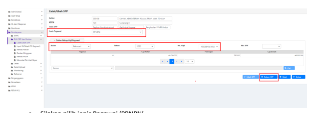

�
�
Petunjuk Teknis Aplikasi SAKTI)

�
♦ PEREKAMAN SPM
PENGHASILAN PPNPN INDUK
�
�

## I. Informasi Umum A. Deskripsi Transaksi

SPM Penghasilan PPNPN Induk (217) digunakan untuk membayar pembayaran belanja pegawai bagi Pegawai Pemerintah Non Pegawai Negeri (PPNPN), Yang dimaksud dengan PPNPN adalah pegawai tidak tetap, pegawai honorer, staf khusus, dan pegawai lain yang penghasilannya dibebankan pada APBN, antara lain:
1. Satpam, Pengemudi, Petugas Kebersihan, dan Pramubakti pada satker yang membuat perjanjian kerja/kontrak dengan KPA/PPK untuk melaksanakan kegiatan operasional kantor; 2. PPPK/staf khusus/staf ahli non pegawai negeri pada Kementerian Negara/ Lembaga; 3. Komisioner/pegawai non pegawai negeri pada lembaga nonstruktural; 4. Dokter/Bidan PTT;
5. Dosen/Guru Tidak Tetap; dan, 6. Pegawai non pegawai negeri lainnya yang penghasilannya bersumber dari APBN.

Dalam hal ini, PPNPN tidak termasuk :
1. Pegawai pada BLU yang penghasilannya dibayarkan dari pendapatan BLU; 2. Pegawai tidak tetap/penerima honorarium yang ditugaskan terkait output kegiatan. Sesuai Peraturan Direktur Jenderal Perbendaharan Nomor Per-8/PB/2019 tentang Perubahan Peraturan Direktur Jenderal Perbendaharaan Nomor PER-31/PB/2016 tentang Tata Cara Pembayaran Penghasilan Bagi PPNPN Yang Dibebankan Pada APBN, bahwa prinsip pembayaran penghasilan PPNPN: 1. Penghasilan PPNPN dibayarkan pada bulan berikutnya; 2. Penghasilan PPNPN dapat dibayarkan pada bulan berkenaan setelah mendapat persetujuan Direktur Jenderal Perbendaharaan; 3. Pembayaran Penghasilan PPNPN yang dilakukan sebelum penyelesaian pelaksanaan tugas harus disertai SPTJM;
Dalam rangka pembayaran penghasilan PPNPN pada hari pertama sebagaimana dimaksud dalam angka 2 huruf b, dilaksanakan dengan ketentuan:
1. SPM menggunakan jenis SPM "Penghasilan PPNPN Induk" (Jenis SPP:217-Penghasilan PPNPN 
Induk);
2. SPM ditambahkan lampiran berupa SPTJM yang ditandatangani KPA/PPK;
3. Satker harus menyampaikan SPM ke KPPN pada tanggal 21 s.d. 26 bulan berkenaan; 4. Dalam hal terdapat SPM penghasilan bulan berkenaan yang disampaikan pada tanggal 1 s.d. 

20 dan tanggal 27 s.d. tanggal akhir bulan berkenaan, maka SPM tidak dapat diproses menjadi SP2D (dikembalikan);
5. Proses penerbitan SP2D dilakukan mulai tanggal 21 s.d. 26 bulan berkenaan dan diberi tanggal 1 bulan berikutnya.

| Modul                  | PEM                                                                                                                                                                                                                                                      |
|------------------------|----------------------------------------------------------------------------------------------------------------------------------------------------------------------------------------------------------------------------------------------------------|
| Role User              | OPR, VAL, APP                                                                                                                                                                                                                                            |
| Modul Lain yang        | KOM                                                                                                                                                                                                                                                      |
| Terkait Transaksi yang | KOM - Pembuatan supplier                                                                                                                                                                                                                                 |
| Tekait Dokumen Input   | SPP SPM Penghasilan PPNPN Induk                                                                                                                                                                                                                          |
| Output                 | SP2D Penghasilan PPNPN Induk                                                                                                                                                                                                                             |
| Validasi               | User harus memastikan data supplier sebagai penerima pembayaran atas  Penghasilan PPNPN Induk telah direkam sebelumnya di pencatatan data  supplier dalam Modul Komitmen. User telah melakukan mapping COA SPM PPNPN, sebelum melakukan  perekaman SPP . |

## B. Informasi Penting Lainnya

Beberapa hal **yang perlu diperhatikan oleh satker (pengguna SAKTI):**
1) *User* harus memastikan data supplier sebagai penerima pembayaran atas Penghasilan PPNPN 
Induk telah direkam sebelumnya di pencatatan data supplier dalam Modul Komitmen.

2) *User* telah melakukan pengiriman ADK / Rekonsiliasi data penghasilan PPNPN dengan KPPN 
sebelum melakukan transaksi pada aplikasi SAKTI. Apabila tidak/belum melakukan rekonsiliasi, maka satuan kerja tidak dapat melakukan perekaman SPP penghasilan PPNPN Induk.

3) *User* telah melakukan mapping COA SPM PPNPN, sebelum melakukan perekaman SPP . Untuk melakukan mapping, user dapat login menggunakan user operator Pembayaran.

1. Masuk melalui menu Pembayaran >> Referensi >> Mapping COA SPM.

2. Silakan klik tab PPNPN.

3. Silakan pilih kode COA yang akan digunakan sebagai COA pembayaran PPNPN. Untuk mempermudah, dapat memanfaatkan kolom pencarian.

4. Untuk data yang sudah dipilih, maka akan muncul pada tabel *'List Assigned COA PPNPN'*.

## Ii. Alur Proses

 A. Diagram Alur Proses B. Penjelasan Diagram Alur Proses

0) **Pembuatan Data:**
Pembuatan data PPNPN serta data pembayaran, dilakukan pada aplikasi PPNPN yang terpisah dari SAKTI.

1) **Input Supplier**
Input Supplier mengacu pada Petunjuk Teknis tentang Perekaman Supplier.

## 2) Pencatatan Spp-Spm: Data Gaji

Login sebagai pengguna dengan kewenangan operator pada Modul Komitmen. Pilih Modul Komitmen - Import GPP Terpusat

1. Masuk ke Modul Komitmen →ADK→IMPORT GPP TERPUSAT
2. Pilih jenis pegawai PPNPN.

3. Setelah memilih jenis pegawai PPNPN, maka akan muncul tombol 'Cari Supplier'. Silakan 

pilih supplier PPNPN yang akan digunakan.

4. Pilih jenis data: Data Gaji 5. Input informasi:
a. Tahun bulan gaji b. Nomor gaji c. Kode anak satker (otomatis terisi)
d. Kode jenis gaji (otomatis terisi)
6. Klik import

## Pencatatan Spp

Login sebagai pengguna dengan kewenangan operator pada Modul Pembayaran.

1. Masuk ke Modul Pembayaran → RUH SPP → Catat/Ubah SPP

2. Pilih Jenis SPP 217 SPM Penghasilan PPNPN Induk 3. Klik tombol tambah. Maka selanjutnya akan diarahkan ke form pemilihan data gaji yang akan dilakukan perekaman SPPnya.

- Silakan pilih jenis Pegawai 'PPNPN'
- Isikan bulan Gaji, Tahun, dan Nomor Gaji PPNPN. Untuk nomor gaji PPNPN, hanya bisa dipilih 1. (Satu nomor gaji, satu SPM)
- Jika sudah dipilih, dapat melanjutkan perekaman dengan klik Rekam SPP.

## Perekaman Pendetailan Segmen Coa

Selanjutnya, ketika masuk ke dalam halaman perekaman SPP, akan muncul jendela untuk melakukan pendetailan segmen COA terlebih dahulu, sebelum melanjutkan perekaman SPP.

- Silakan pilih detail akun yang akan diisi nilai pendetailannya.

- Klik tombol 'Ubah'. - Masukkan nilai yang akan dibebankan pada detail segmen COA tersebut.

- Klik tombol 'Simpan'.

- Jika sudah semua detail segmen dilakukan perekaman, maka silakan klik tombol 'Keluar'. 

Catatan: Apabila terdapat detail segmen COA yang tidak digunakan/bernilai 0, maka silakan hapus detail segmen COA tersebut, dengan cara klik/pilih detail segmen COA yang akan dihapus*, lalu klik tombol 'Hapus'*

## Pencatatan Spp (Lanjutan)

Setelah melakukan pendetailan segmen COA, maka langkah selanjutnya adalah sebagai berikut:

2. Uraian pembayaran akan terisi secara otomatis. Dalam hal diperlukan penyesuaian, silakan lakukan perubahan pada bagian uraian.

3. Pastikan jumlah penerima dan nilai yang diterima oleh masing-masing pegawai telah sesuai. 

5. Silakan lakukan pengecekan kembali atas akun pengeluaran dan akun potongan/penerimaan. Untuk akun pengeluaran akan terisi berdasarkan pendetailan segmen COA yang dilakukan di awal perekaman SPP. Untuk akun Potongan, akan terisi secara otomatis berdasarkan data yang diterima dari aplikasi PPNPN.

6. Pastikan nilai bersih total pada bagian informasi supplier, telah sama dengan ilia total pembayaran. 

7. Apabila seluruh data telah sesuai, maka satuan kerja dapat menyimpan SPP dengan klik tombol 'Simpan'.

## 3) Cetak Spp

Login sebagai pengguna dengan kewenangan operator pada Modul Pembayaran.

1. Masuk ke Modul Pembayaran →Cetak→Mencetak SPP
2. Pilih SPP yang ingin dicetak 3. Pilih PPK
4. Pastikan Tempat dan Tanggal telah sesuai 5. Klik tombol "Unduh" untuk mencetak SPP.

6. Klik tombol "SSP" apabila ingin mencetak SSP

## 4) Setuju Spp

Login sebagai pengguna PPK selaku *validator* pada Modul Pembayaran.

1. Masuk ke Modul Pembayaran →Validasi→Validasi SPP
2. Pilih SPP yang ingin divalidasi 3. Klik tombol "Unduh Pra Cetak" untuk mencetak SPP yang akan divalidasi 4. Klik tombol "Setuju" untuk menyetujui SPP.

5. Klik tombol "Batal" apabila ingin membatalkan validasi atas SPP yang sudah divalidasi

## 5) Buat Adk Spp

Login sebagai pengguna PPK selaku *validator* pada Modul Pembayaran.

1. Masuk ke Modul Pembayaran →ADK→ADK SPP OTP
2. Pilih SPP yang ingin dibuat ADK SPP dengan melakukan ceklis pada kolom pilih. Dapat memilih lebih dari 1 SPP sekaligus apabila diperlukan.

3. Klik tombol "Proses" 4. Klik tombol 'Req OTP via SMS' untuk meminta kode OTP. 5. Setelah menerima kode OTP, silakan input pada kolom 'Input OTP'.

6. Klik tombol "Proses"

## 6) Cetak Spm

Login sebagai pengguna dengan kewenangan operator pada Modul Pembayaran.

1. Masuk ke Modul Pembayaran →Cetak→Mencetak SPM
2. Pilih SPM yang ingin dicetak 3. Klik tombol "Unduh"

## 7) Upload Dokumen Pendukung

Login sebagai pengguna dengan kewenangan operator pada Modul Pembayaran.

1. Masuk ke Modul Pembayaran →Catat/Upload→Upload Dokumen Pendukung 2. Pilih SPM yang ingin diupload dokumen pendukungnya 3. Pilih jenis dokumen pendukung 4. Klik tombol "Pilih" untuk memilih file yang akan diupload 5. Klik tombol "Upload" 6. File yang akan diupload akan muncul 7. Klik tombol "View" apabila ingin melihat file yang telah diupload 8. Klik tombol "Hapus" apabila ingin menghapus file yang telah diupload sebelumnya

## 8) Setuju Spm

Login sebagai pengguna PPSPM selaku *approver* pada Modul Pembayaran.

1. Masuk ke Modul Pembayaran →Validasi→Validasi SPM
2. Pilih SPM yang ingin divalidasi 3. Klik tombol "Unduh Pra Cetak" untuk mencetak SPM yang akan divalidasi 4. Klik tombol "Setuju" 5. Klik tombol "Batal SPM" apabila ingin membatalkan validasi atas SPM yang sudah divalidasi. 

Klik tombol "Batal Dokumen Pendukung" apabila ingin membatalkan dokumen pendukung yang telah di upload sebelumnya.

## 9) Buat Adk Spm

Login sebagai pengguna PPSPM selaku *approver* pada Modul Pembayaran.

1. Masuk ke Modul Pembayaran →ADK→ADK SPM OTP
2. Pilih SPM yang ingin dibuat ADK SPM. Dapat memilih lebih dari 1 sekaligus apabila diperlukan.

3. Klik tombol "Proses ADK SPM" 4. Klik tombol "Req OTP via SMS" untuk untuk meminta kode OTP. 

5. Setelah menerima kode OTP, silakan input pada kolom 'Input OTP'. 6. Klik tombol "Proses"

## 10) Proses Kppn

Proses di KPPN Mengacu pada Standar Operasional Prosedur Pemrosesan SPM menjadi SP2D 
pada KPPN.

## 11) Catat Sp2D

Login sebagai pengguna dengan kewenangan operator pada Modul Pembayaran.

1. Masuk ke Modul Pembayaran →Catat/Upload→ Catat/Upload SP2D
2. Pilih SPM yang ingin dicatat No. SP2D
3. Klik tombol "Catat SP2D Otomatis".