yang mengan
�
→
Petunjuk Teknis Aplikasi SAKTI)
�
♦ PEREKAMAN SPM
GAJI LAINNYA
KEMENTERIAN KEUANGAN RI
�
→

## I. Informasi Umum A. Deskripsi Transaksi

Jenis SPM 221 - Gaji Lainnya digunakan untuk Pembayaran atas Uang Makan dan Uang Lembur, yang perhitungan data gajinya menggunakan aplikasi GPP satker.

| Modul                  | PEM                                                                                                                                                                   |
|------------------------|-----------------------------------------------------------------------------------------------------------------------------------------------------------------------|
| Role User              | OPR, VAL, APP                                                                                                                                                         |
| Modul Lain yang        | KOM                                                                                                                                                                   |
| Terkait Transaksi yang | KOM - Pembuatan supplier tipe 3                                                                                                                                       |
| Tekait Dokumen Input   | SPP SPM 221-Gaji Lainnya                                                                                                                                              |
| Output                 | SP2D Gaji Lainnya                                                                                                                                                     |
| Validasi               | User harus memastikan data supplier tipe 3 sebagai penerima pembayaran atas  Gaji Lainnya telah direkam sebelumnya di pencatatan data supplier dalam  Modul Komitmen. |

Beberapa hal yang perlu diperhatikan oleh satker (pengguna SAKTI):
1) *User* harus memastikan data supplier tipe 3 sebagai penerima pembayaran atas Gaji Lainnya Negara telah direkam sebelumnya di pencatatan data supplier dalam Modul Komitmen.

## Ii. Alur Proses

A. **DIAGRAM ALUR PROSES**

## B. Penjelasan Diagram Alur Proses

1) **Input Supplier**
Input Supplier mengacu pada Petunjuk Teknis tentang Perekaman Supplier.

## 2) Pencatatan Spp-Spm Gaji Lainnya Pada Aplikasi Sakti Data Gaji

Login sebagai pengguna dengan kewenangan operator pada Modul Komitmen.

Pada Aplikasi Sakti Pilih Modul Komitmen - ADK Data Pegawai

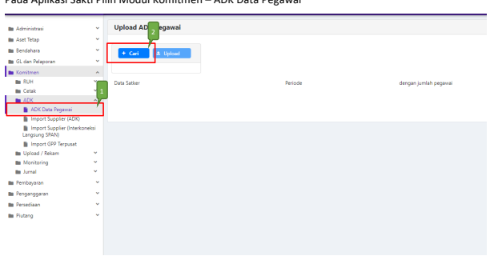

1. Masuk ke Modul Komitmen →ADK→ADK Data Pegawai

2. Klik tombol 'Cari' untuk memilih file ADK yang akan diupload.

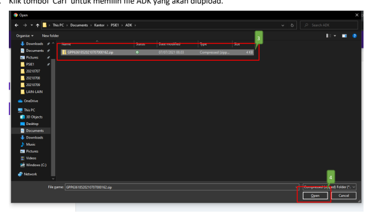

3. Cari lokasi dan pilih file ADK GPP yang akan diupload.

4. Klik tombol 'Open'

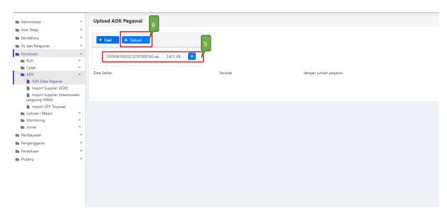

5. Pastikan nama file ADK yang akan digunakan telah sesuai. Jika tidak sesuai, silakan klik tombol 
'X', dan silakan untuk mencari kembali file ADK yang sesuai.

6. Klik tombol 'Upload'

## Pencatatan Spp

Login sebagai pengguna dengan kewenangan operator pada Modul Pembayaran.

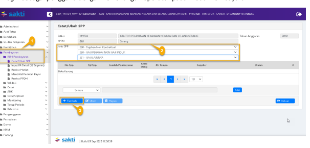

1. Masuk ke Modul Pembayaran → RUH SPP → Catat/Ubah SPP
2. Pilih Jenis SPP 221 - Gaji Lainnya 3. Klik tombol "Tambah" Login sebagai pengguna dengan kewenangan operator pada Modul Pembayaran.

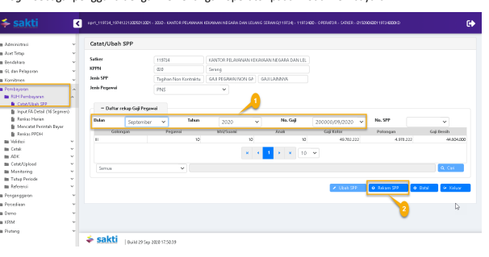 1. Input informasi: Bulan, Tahun dan No. Gaji 2. Klik Rekam SPP

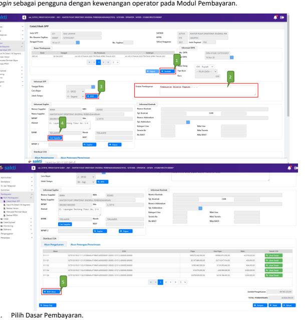

2. Uraian pembayaran diisi sesuai dengan ketentuan uraian SPP/SPM yang berlaku.

3. Pilih RPD yang telah dibuat sebelumnya, apabila nilai SPM melebihi 1 M (sesuai dengan Peraturan Menteri Keuangan Nomor 197/PMK.05/2017 tentang Rencana Penarikan Dana, Rencana Penerimaan Dana, dan Perencanaan Kas) dan lewati proses ini, apabila nilai SPM kurang dari 1 M.

4. Klik tombol "Cari Supplier" untuk memilih supplier tipe:3-pegawai sebagai penerima atas pembayaran Gaji Lainnya.

5. Klik tombol 'RUH Akun' untuk melakukan perekaman pendetailan segmen 15/16 atas COA yang ada (Distribusi COA secara otomatis terisi dari hasil import ADK GPP, namun pendetailan segmen tetap perlu dilakukan. Namun apabila terdapat akun yang tidak termapping secara otomatis, silakan untuk menambahkan pada menu 'RUH Akun'). 

## Perekaman Pendetailan Segmen 15/16 Coa

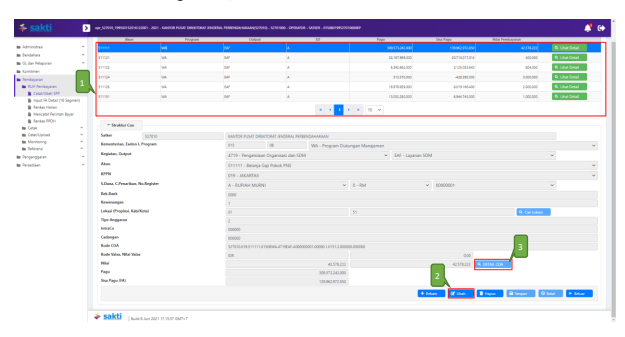

1. Pilih akun yang hendak dilakukan pendetailan.

2. Klik tombol 'Ubah' (Apabila akun tidak muncul, maka silakan klik 'Rekam')

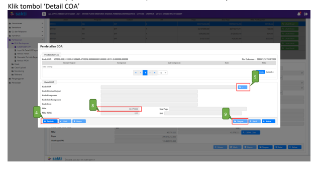

4. Klik tombol "Tambah" untuk melakukan perekaman pendetailan.

5. Klik tombol 'kaca pembesar' untuk memilih detail segmen 15/16

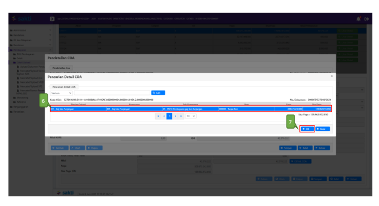

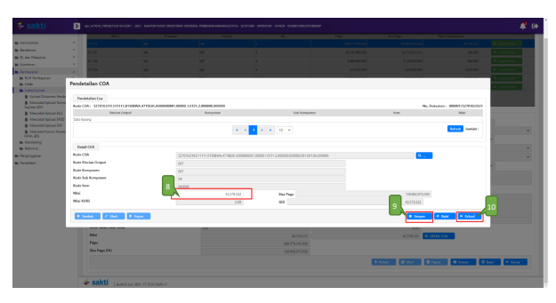

8. Nilai pendetailan akan terisi secara otomatis. Namun apabila perlu disesuaikan, silakan disesuaikan dengan nilai per masing-masing segmen 15/16 nya.

9. Klik Tombol "Simpan".

10. Klik Tombol "Keluar" untuk kembali ke halaman sebelumnya.

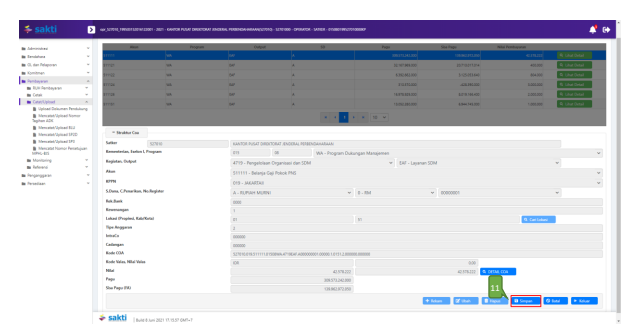

tersebut.

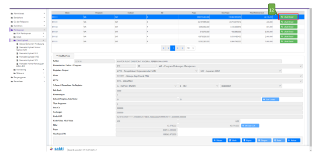

12. Klik tombol "Lihat Detail" untuk melihat nilai pendetailan atas Akun yang digunakan tersebut.

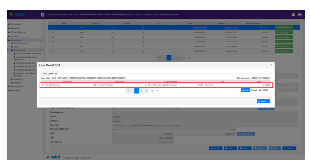

Pada tampilan berikutnya, nilai pendetailan akan terisi apabila pendetailan segmen 15/16 telah terisi dengan benar. Apabila kosong, maka pendetailan atas akun tersebut belum tersimpan / 
belum dilakukan.

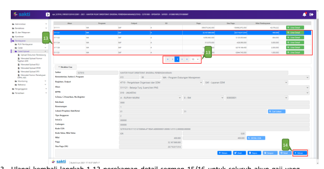

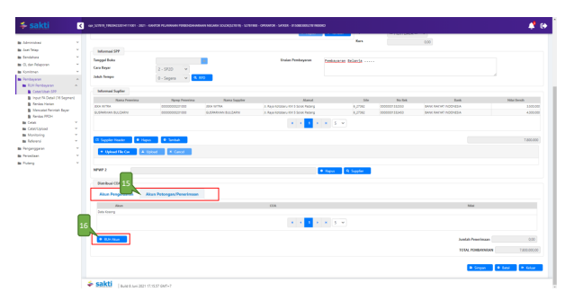

15. Klik tab "Akun Potongan/Penerimaan" untuk merekam potongan SPM. *(Apabila tidak terdapat* potongan SPM, bisa langsung menyimpan SPP tersebut dengan klik tombol "Simpan")
16. Klik tombol "RUH Akun".

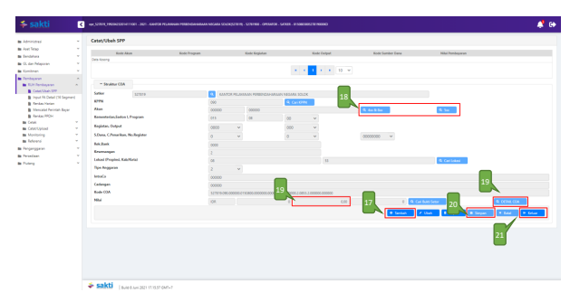

17. Klik Tombol "Tambah" untuk menambah akun potongan/penerimaan.

18. Cari akun yang akan digunakan. Apabila akun yang ingin direkam diawali dengan angka 4xx dan 8xx, maka silakan klik tombol "4xx & 8xx ". Namun apabila akun yang hendak direkam merupakan akun dengan awalan 5xx, maka silakan cari akun tersebut dengan klik tombol 
"5xx".

19. Apabila menggunakan akun 4xx atau 8xx, maka silakan isikan nilai potongan SPM atas akun tersebut di kolom Nilai.

Apabila menggunakan akun 5xx, maka silakan klik tombol "Detail COA" untuk merekam nilai potongan SPM atas akun tersebut.

20. Jika sudah selesai, klik tombol "Simpan". Apabila hendak menambahkan akun lainnya, silakan ulangi langkah nomor 18-20.

21. Klik tombol "Keluar" apabila perekaman potongan telah selesai dilakukan, untuk melanjutkan perekaman SPM tersebut.

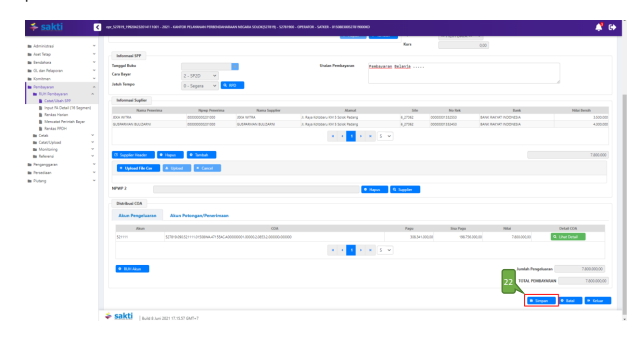

## 3) Cetak Spp

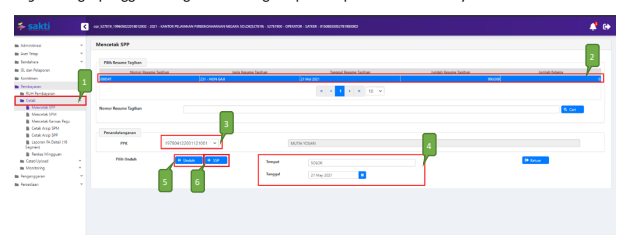

Login sebagai pengguna dengan kewenangan operator pada Modul Pembayaran.

1. Masuk ke Modul Pembayaran →Cetak→Mencetak SPP
2. Pilih SPP yang ingin dicetak 3. Pilih PPK
4. Pastikan Tempat dan Tanggal telah sesuai 5. Klik tombol "Unduh" untuk mencetak SPP. 6. Klik tombol "SSP" apabila ingin mencetak SSP

## 4) Setuju Spp

Login sebagai pengguna PPK selaku *validator* pada Modul Pembayaran.

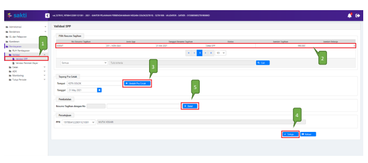

1. Masuk ke Modul Pembayaran →Validasi→Validasi SPP.

2. Pilih SPP yang ingin divalidasi.

3. Klik tombol "Unduh Pra Cetak" untuk mencetak SPP yang akan divalidasi. 4. Klik tombol "Setuju".

5. Klik tombol "Batal" apabila ingin membatalkan validasi atas SPP yang sudah dilakukan proses validasi SPP.

## 5) Buat Adk Spp

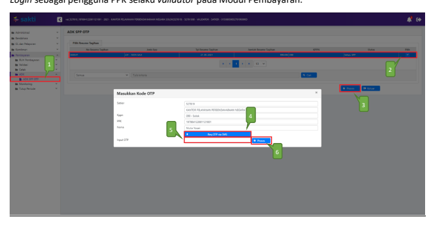

Login sebagai pengguna PPK selaku *validator* pada Modul Pembayaran.

1. Masuk ke Modul Pembayaran →ADK→ADK SPP OTP
2. Pilih SPP yang ingin dibuat ADK SPP dengan melakukan ceklis pada kolom pilih. Dapat memilih lebih dari 1 SPP sekaligus apabila diperlukan.

3. Klik tombol "Proses". 4. Klik tombol 'Req OTP via SMS' untuk meminta kode OTP. 

5. Setelah menerima kode OTP, silakan input pada kolom 'Input OTP'.

6. Klik tombol "Proses".

## 6) Cetak Spm

Login sebagai pengguna dengan kewenangan operator pada Modul Pembayaran.

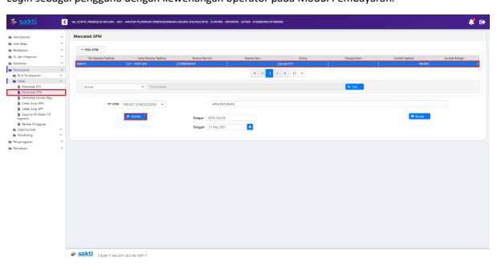

1. Masuk ke Modul Pembayaran →Cetak→Mencetak SPM
2. Pilih SPM yang ingin dicetak 3. Klik tombol "Unduh"

## 7) Upload Dokumen Pendukung

Login sebagai pengguna dengan kewenangan operator pada Modul Pembayaran.

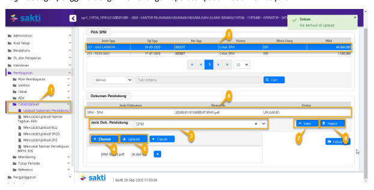

1. Masuk ke Modul Pembayaran →Catat/Upload→Upload Dokumen Pendukung.

2. Pilih SPM yang akan diupload dokumen pendukungnya. 3. Pilih jenis dokumen pendukung.

4. Klik tombol "Pilih" untuk memilih file yang akan diupload.

5. Klik tombol "Upload".

6. File yang akan diupload akan muncul.

7. Klik tombol "View" apabila ingin melihat file yang telah diupload.

8. Klik tombol "Hapus" apabila ingin menghapus file yang telah diupload sebelumnya.

## 8) Setuju Spm

Login sebagai pengguna PPSPM selaku *approver* pada Modul Pembayaran.

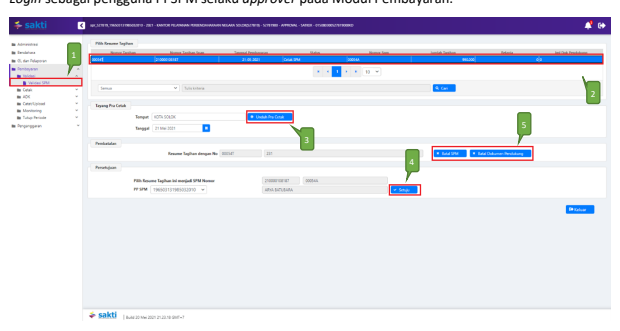

1. Masuk ke Modul Pembayaran →Validasi→Validasi SPM
2. Pilih SPM yang ingin divalidasi 3. Klik tombol "Unduh Pra Cetak" untuk mencetak SPM yang akan divalidasi 4. Klik tombol "Setuju" 5. Klik tombol "Batal SPM" apabila ingin membatalkan validasi atas SPM yang sudah divalidasi. 

Klik tombol "Batal Dokumen Pendukung" apabila ingin membatalkan dokumen pendukung yang telah di upload sebelumnya.

## 9) Buat Adk Spm

Login sebagai pengguna PPSPM selaku *approver* pada Modul Pembayaran.

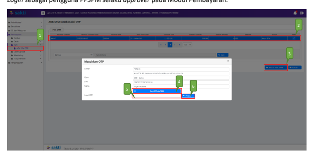

1. Masuk ke Modul Pembayaran →ADK→ADK SPM OTP
2. Pilih SPM yang ingin dibuat ADK SPM. Dapat memilih lebih dari 1 sekaligus apabila diperlukan.

3. Klik tombol "Proses ADK SPM" 4. Klik tombol "Req OTP via SMS" untuk untuk meminta kode OTP. 

5. Setelah menerima kode OTP, silakan input pada kolom 'Input OTP'.

6. Klik tombol "Proses"

## 10) Proses Kppn

Proses di KPPN Mengacu pada Standar Operasional Prosedur Pemrosesan SPM menjadi SP2D 
pada KPPN.

## 11) Catat Sp2D

Login sebagai pengguna dengan kewenangan operator pada Modul Pembayaran.

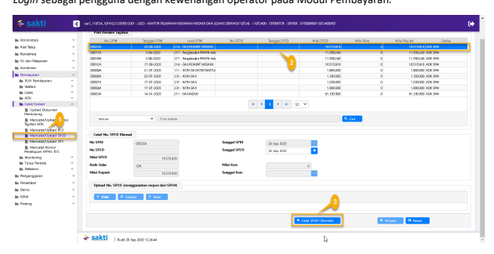

1. Masuk ke Modul Pembayaran →Catat/Upload→ Catat/Upload SP2D
2. Pilih SPM yang ingin dicatat No. SP2D
3. Klik tombol "Catat SP2D Otomatis".