.

Petunjuk Teknis Aplikasi SAKTI
PEREKAMAN SPM NON GAJI
BAST
�
�
�

## I. Informasi Umum A. Deskripsi Transaksi

SPM Non Gaji 231 BAST digunakan untuk membayar tagihan yang sifatnya Non Gaji yang menggunakan Berita Acara Serah Terima Barang (BAST).

| Modul                  | PEM                                                                                   |
|------------------------|---------------------------------------------------------------------------------------|
| Role User              | OPR, VAL, APP                                                                         |
| Modul Lain yang        | KOM                                                                                   |
| Terkait Transaksi yang | KOM - Pembuatan supplier type 2 dan type 6                                            |
| Tekait                 | KOM - Pembuatan BAST Non Kontraktual PEM - Perekaman RPD                              |
| Dokumen Input          | SPP SPM NON GAJI BAST                                                                 |
| Output                 | SP2D SPM NON GAJI BAST                                                                |
| Validasi               | Sebelum merekam SPP mohon dipastikan BAST telah direkam sebelumnya di  Modul Komitmen |

## B. Informasi Penting Lainnya

Beberapa hal yang perlu diperhatikan oleh satker (pengguna SAKTI): 1. SPM Non Gaji 231 BAST diperuntukkan untuk tagihan non kontraktual, terutama tagihan yang menggunakan akun Persediaan (521811) dan Belanja Modal/Aset (53)
2. Sebelum rekam SPP satker harus merekam BAST Non Kontraktual terlebih dahulu 3. Perekaman BAST Non Kontraktual untuk mengakomodir penginputan kode barang baik Persediaan maupun Aset 4. Mohon ketika memilih jenis SPP Non Gaji 231 jangan lupa untuk memilih BAST yang telah dibuat sebelumnya.

## 1. Alur Proses

DIAGRAM ALUR PROSES

## A. Penjelasan Diagram Alur Proses

1) **Input Supplier**
Input Supplier mengacu pada Petunjuk Teknis KOM-00... tentang Input Supplier.

2) **Input BAST**
Input BAST mengacu pada Petunjuk Teknis KOM-00... tentang Input BAST.

3) **Input SPP**
Login menggunakan user operator SPP/SPM

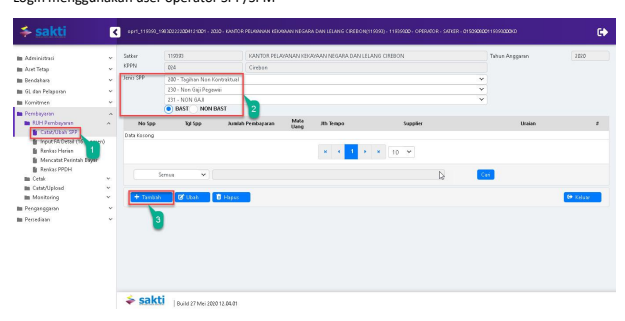

1. Masuk ke Modul Pembayaran → RUH SPP → Catat/Ubah SPP
2. Pilih Jenis SPP 231 SPM NON GAJI BAST
3. Klik tombol tambah

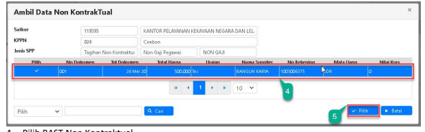

## Pilih Bast Non Kontraktual 4. Klik Tombol "Pilih" 5.

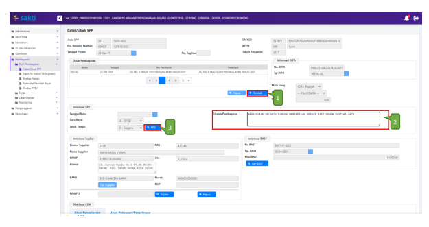

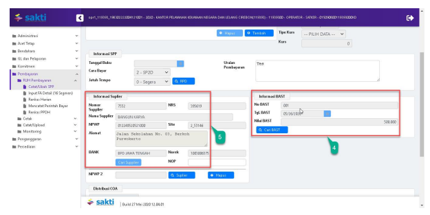

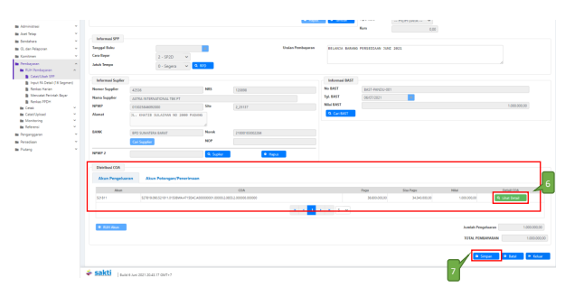

## 1. Pilih Dasar Pembayaran

2. Uraian pembayaran akan terisi otomatis sesuai dengan BAST Non Kontraktual yang telah dipilih. 

Apabila terdapat perubahan, dapat langsung menyesuaikan pada kolom 'Uraian Pembayaran' 3. Silahkan memilih RPD yang telah dibuat sebelumnya, apabila nilai SPM melebihi 1 M (sesuai dengan Peraturan Menteri Keuangan Nomor 197/PMK.05/2017 tentang Rencana Penarikan Dana, Rencana Penerimaan Dana, dan Perencanaan Kas) dan silahkan dilewati saja (tidak perlu pilih RPD) apabila nilai SPM kurang dari 1 M.

4. Klik tombol "Cari BAST" (Pilih Bast Non Kontraktual yang ingin dibayar, maka Akun Pengeluaran akan terisi otomatis sesuai dengan waktu merekam BAST Non Kontraktual 5. Supplier akan terisi otomatis sesuai dengan BAST Non Kontraktual yang telah dipilih 6. Input Akun Potongan apabila ada potongan. Apabila ingin melihat detail akun, bisa klik tombol 
'Lihat Detail'.

7. Klik Tombol "Simpan"

## 4) Cetak Spp

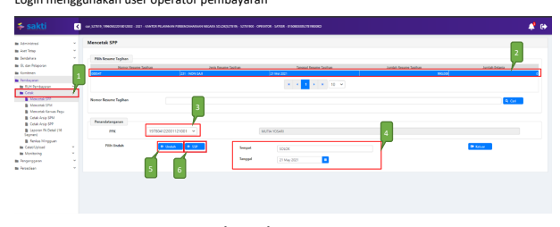

3. Pilih PPK 4. Pastikan Tempat dan Tanggal telah sesuai 5. Klik tombol "Unduh" untuk mencetak SPP.

6. Klik tombol "SSP" apabila ingin mencetak SSP

## 5) Setuju Spp

Login menggunakan user PPK

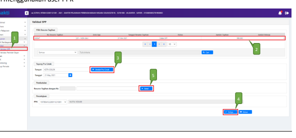

1. Masuk ke Modul Pembayaran →Validasi→Validasi SPP
2. Pilih SPP yang ingin divalidasi 3. Klik tombol "Unduh Pra Cetak" untuk mencetak SPP yang akan divalidasi 4. Klik tombol "Setuju" untuk menyetujui SPP.

5. Klik tombol "Batal" apabila ingin membatalkan validasi atas SPP yang sudah divalidasi

## 6) Create Adk Spp

Login menggunakan user PPK

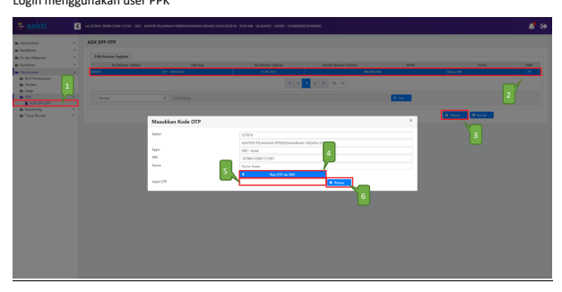

1. Masuk ke Modul Pembayaran →ADK→ADK SPP OTP
2. Pilih SPP yang ingin dibuat ADK SPP dengan melakukan ceklis pada kolom pilih. Dapat memilih lebih dari 1 SPP sekaligus apabila diperlukan.

3. Klik tombol "Proses" 4. Klik tombol 'Req OTP via SMS' untuk meminta kode OTP. 

5. Setelah menerima kode OTP, silakan input pada kolom 'Input OTP'.

6. Klik tombol "Proses"

## 7) Cetak Spm

Login menggunakan user operator pembayaran

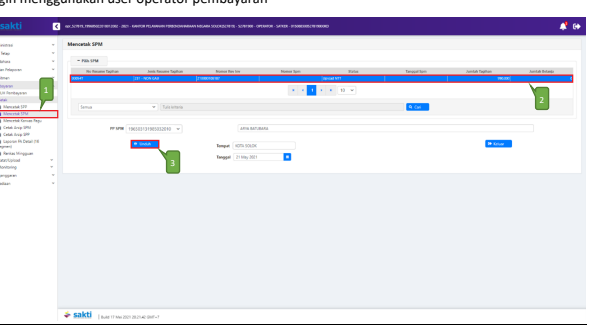

1. Masuk ke Modul Pembayaran →Cetak→Mencetak SPM
2. Pilih SPM yang ingin dicetak 3. Klik tombol "Unduh"

## 8) Upload Dokumen Pendukung

Login menggunakan user operator pembayaran

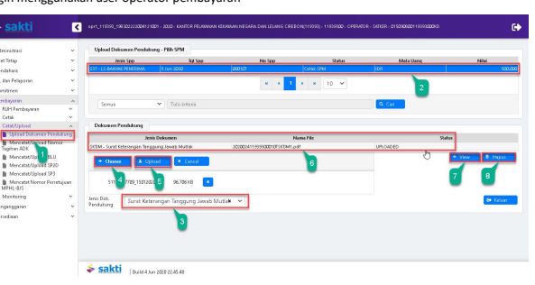

1. Masuk ke Modul Pembayaran →Catat/Upload→Upload Dokumen Pendukung 2. Pilih SPM yang ingin diupload dokumen pendukungnya 3. Pilih jenis dokumen pendukung 4. Klik tombol "Pilih" untuk memilih file yang akan diupload 5. Klik tombol "Upload" 6. File yang akan diupload akan muncul 7. Klik tombol "View" apabila ingin melihat file yang telah diupload 8. Klik tombol "Hapus" apabila ingin menghapus file yang telah diupload sebelumnya

## 9) Setuju Spm

Login menggunakan user PPSPM

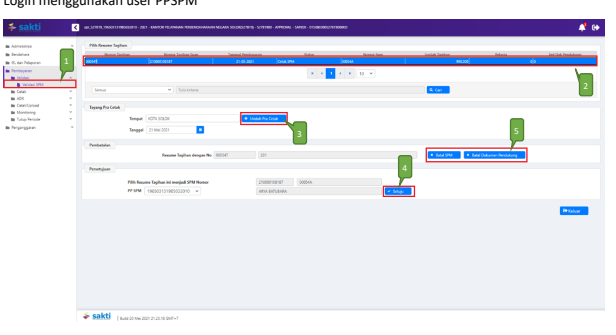

1. Masuk ke Modul Pembayaran →Validasi→Validasi SPM
2. Pilih SPM yang ingin divalidasi 3. Klik tombol "Unduh Pra Cetak" untuk mencetak SPM yang akan divalidasi 4. Klik tombol "Setuju" 5. Klik tombol "Batal SPM" apabila ingin membatalkan validasi atas SPM yang sudah divalidasi. 

Klik tombol "Batal Dokumen Pendukung" apabila ingin membatalkan dokumen pendukung yang telah di upload sebelumnya.

## 10) Create Adk Spm

Login menggunakan user PPSPM

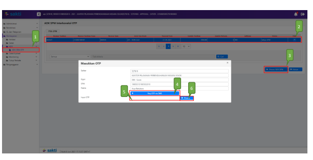

1. Masuk ke Modul Pembayaran →ADK→ADK SPM OTP
2. Pilih SPM yang ingin dibuat ADK SPM. Dapat memilih lebih dari 1 sekaligus apabila diperlukan.

3. Klik tombol "Proses ADK SPM"
4. Klik tombol "Req OTP via SMS" untuk untuk meminta kode OTP. 

5. Setelah menerima kode OTP, silakan input pada kolom 'Input OTP'.

6. Klik tombol "Proses"

## 11) Proses Kppn

Proses di KPPN Mengacu pada Standar Operasional Prosedur Pemrosesan SPM menjadi SP2D pada KPPN.

## 12) Catat Sp2D

Login menggunakan user operator pembayaran

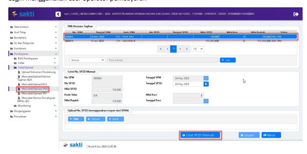

1. Masuk ke Modul Pembayaran →Catat/Upload→ Catat/Upload SP2D
2. Pilih SPM yang ingin dicatat No. SP2D
3. Klik tombol "Catat SP2D Otomatis".