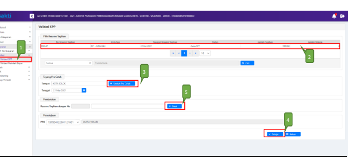

→
→
Petunjuk Teknis Aplikasi SAKTI
�
PEREKAMAN SPM NON GAJI
NON BAST
→
�

## I. Informasi Umum A. Deskripsi Transaksi

SPM Non Gaji 231 Non BAST digunakan untuk membayar tagihan yang sifatnya Non Gaji tanpa menggunakan Berita Acara Serah Terima Barang (BAST).

| Modul                  | PEM                                        |
|------------------------|--------------------------------------------|
| Role User              | OPR, VAL, APP                              |
| Modul Lain yang        | KOM                                        |
| Terkait Transaksi yang | KOM - Pembuatan supplier tipe 2 dan tipe 6 |
| Tekait                 | PEM - Perekaman RPD                        |
| Dokumen Input          | SPP SPM NON GAJI NON BAST                  |
| Output                 | SP2D SPM NON GAJI NON BAST                 |
| Validasi               | -                                          |

## B. Informasi Penting Lainnya

Beberapa hal yang perlu diperhatikan oleh satker (pengguna SAKTI):
1. SPM Non Gaji 231 Non BAST diperuntukkan untuk tagihan non kontraktual 2. Satker bisa langsung rekam SPP tanpa harus merekam BAST Non Kontraktual terlebih dahulu 3. Tagihan yang menggunakan akun Persediaan (52) dan Belanja Modal/Aset (53) harus memilih jenis SPP Non Gaji BAST, dengan terlebih dahulu merekam BAST, perekaman BAST Non Kontraktual untuk mengakomodir penginputan kode barang baik Persediaan maupun Aset

## 1. Alur Proses Diagram Alur Proses

 A. Penjelasan Diagram Alur Proses

1) **Input Supplier**
Input Supplier mengacu pada Petunjuk Teknis KOM-00... tentang Input Supplier.

2) **Input SPP**
1. Masuk ke Modul Pembayaran → RUH SPP → Catat/Ubah SPP

2. Pilih Jenis SPP 231 SPM NON GAJI
3. Pilih "NON BAST"
4. Klik tombol tambah Login menggunakan user operator SPP/SPM

## 1. Pilih Dasar Pembayaran

2. Input Uraian pembayaran 3. Silahkan memilih RPD yang telah saudara buatsebelumnya, apabila nilai SPM melebihi 1 M (sesuai dengan Peraturan Menteri Keuangan Nomor 197/PMK.05/2017 tentang Rencana Penarikan Dana, Rencana Penerimaan Dana, dan Perencanaan Kas) dan silahkan dilewati saja (tidak perlu pilih RPD) 
apabila nilai SPM kurang dari 1 M.

4. Klik tombol "Cari Supplier" untuk memilih supplier 5. Klik tombol "RUH Akun" untuk menginput Akun Pengeluaran dan Akun Potongan apabila ada potongan.

6. Klik Tombol 'Rekam' untuk melakukan perekaman akun yang akan digunakan. Kemudian diikuti dengan perekaman data akun (mulai dari Program, hingga Nomor Register).

7. Untuk merekam nilai per akun yang akan digunakan, silakan klik tombol 'Detail COA' untuk merekam nilai pendetailan di masing-masing akun.

8. Klik Tombol 'Tambah' 9. Klik Tombol 'Kaca Pembesar' untuk memilih detail Kode COA yang akan digunakan.

10. Setelah memilih Detail COA yang digunakan, silakan isikan nilai Detail COA yang dipilih tersebut di kolom Nilai.

11. Apabila telah terisi semua, klik Tombol 'Simpan'. 

(Apabila terdapat detail COA yang lain, silakan ulangi langkah nomor 8-11.)

12. Setelah menginput nilai detail COA, maka akan kembali ke halaman sebelumnya. Untuk menyimpan data, silakan klik tombol 'Simpan'
(Apabila terdapat akun yang lain, silakan ulangi dari langkah ke 6)
13. Klik Tombol 'Keluar' untuk melanjutkan perekaman.

14. Apabila ada potongan SPM, maka silakan klik sub menu 'Akun Potongan/Penerimaan', kemudian klik tombol 'Ruh Akun'. (Apabila tidak terdapat potongan, dapat langsung melanjutkan ke langkah nomor 21)

15. Klik tombol 'Tambah' 16. Klik tombol '4xx & 8xx' untuk akun dengan potongan dengan awalan 4 dan 8, atau klik tombol 
'5xx' untuk akun dengan awalan 5 (pengembalian belanja).

17. Untuk akun 4xx dan 8xx, silakan isikan nilai potongan di kolom nilai. Setelah input nilai, lanjut ke langkah 19.

18. Untuk akun 5xx, untuk mengisi nilai potongan/pengembalian, silakan klik tombol 'Detail COA', 
dan melakukan input nilai potongan seperti pada langkah nomor 8-11.

19. Klik tombol 'Simpan' untuk menyimpan akun potongan.

Apabila terdapat akun potongan lain, silakan ulangi langkah 15-19.

20. Klik tombol 'Keluar' untuk melanjutkan perekaman SPP.

## 3) Cetak Spp

Login menggunakan user operator pembayaran

1. Masuk ke Modul Pembayaran →Cetak→Mencetak SPP
2. Pilih SPP yang ingin dicetak 3. Pilih PPK
4. Pastikan Tempat dan Tanggal telah sesuai 5. Klik tombol "Unduh" untuk mencetak SPP.

6. Klik tombol "SSP" apabila ingin mencetak SSP

## 4) Setuju Spp

Login menggunakan user PPK

1. Masuk ke Modul Pembayaran →Validasi→Validasi SPP
2. Pilih SPP yang ingin divalidasi 3. Klik tombol "Unduh Pra Cetak" untuk mencetak SPP yang akan divalidasi 4. Klik tombol "Setuju" untuk menyetujui SPP.

5. Klik tombol "Batal" apabila ingin membatalkan validasi atas SPP yang sudah divalidasi

## 5) Create Adk Spp

Login menggunakan user PPK

1. Masuk ke Modul Pembayaran →ADK→ADK SPP OTP
2. Pilih SPP yang ingin dibuat ADK SPP dengan melakukan ceklis pada kolom pilih. Dapat memilih lebih dari 1 SPP sekaligus apabila diperlukan.

3. Klik tombol "Proses" 4. Klik tombol 'Req OTP via SMS' untuk meminta kode OTP. 

5. Setelah menerima kode OTP, silakan input pada kolom 'Input OTP'.

6. Klik tombol "Proses"

## 6) Cetak Spm

Login menggunakan user operator pembayaran 1. Masuk ke Modul Pembayaran →Cetak→Mencetak SPM
2. Pilih SPM yang ingin dicetak 3. Klik tombol "Unduh"

## 7) Upload Dokumen Pendukung

Login menggunakan user operator pembayaran

1. Masuk ke Modul Pembayaran →Catat/Upload→Upload Dokumen Pendukung 2. Pilih SPM yang ingin diupload dokumen pendukungnya 3. Pilih jenis dokumen pendukung 4. Klik tombol "Choose" untuk memilih file yang akan diupload 5. Klik tombol "Upload" 6. File yang akan diupload akan muncul 7. Klik tombol "View" apabila ingin melihat file yang telah diupload 8. Klik tombol "Hapus" apabila ingin menghapus file yang telah diupload sebelumnya

## 8) Setuju Spm

Login menggunakan user PPSPM

1. Masuk ke Modul Pembayaran →Validasi→Validasi SPM
2. Pilih SPM yang ingin divalidasi 3. Klik tombol "Unduh Pra Cetak" untuk mencetak SPM yang akan divalidasi 4. Klik tombol "Setuju" 5. Klik tombol "Batal SPM" apabila ingin membatalkan validasi atas SPM yang sudah divalidasi. 

Klik tombol "Batal Dokumen Pendukung" apabila ingin membatalkan dokumen pendukung yang telah di upload sebelumnya.

## 9) Create Adk Spm

Login menggunakan user PPSPM
1. Masuk ke Modul Pembayaran →ADK→ADK SPM OTP
2. Pilih SPM yang ingin dibuat ADK SPM. Dapat memilih lebih dari 1 sekaligus apabila diperlukan.

3. Klik tombol "Proses ADK SPM" 4. Klik tombol "Req OTP via SMS" untuk untuk meminta kode OTP. 

5. Setelah menerima kode OTP, silakan input pada kolom 'Input OTP'.

6. Klik tombol "Proses"

## 10) Proses Kppn

Proses di KPPN Mengacu pada Standar Operasional Prosedur Pemrosesan SPM menjadi SP2D pada KPPN.

## 11) Catat Sp2D

Login menggunakan user operator pembayaran

1. Masuk ke Modul Pembayaran →Catat/Upload→ Catat/Upload SP2D
2. Pilih SPM yang ingin dicatat No. SP2D 3. Klik tombol "Catat SP2D Otomatis".