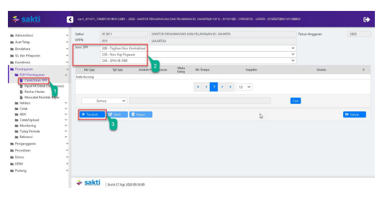
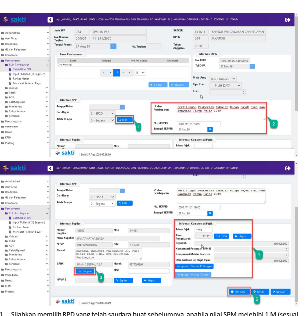
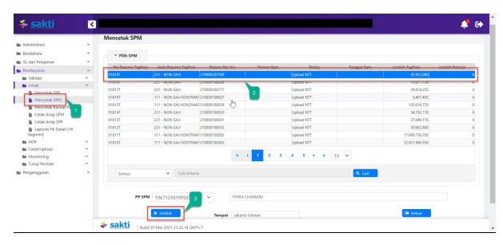
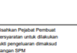
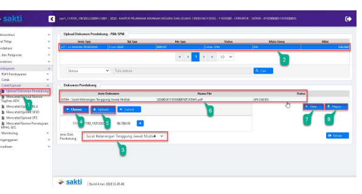
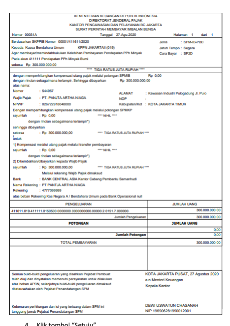
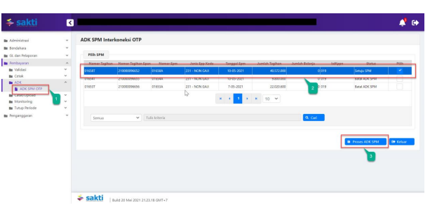

Petunjuk Teknis Aplikasi SAKTI)
�
PEREKAMAN SPM-IB-PBB
(Imbalan Bunga Pajak Bumi dan Bangunan)
→

## I. Informasi Umum A. Deskripsi Transaksi

SPM-IB-PBB digunakan untuk membayar tagihan Imbalan Bunga Pajak Bumi dan Bangunan.

| Modul                  | PEM                                      |
|------------------------|------------------------------------------|
| Role User              | OPR, APP                                 |
| Modul Lain yang        | KOM, PEM                                 |
| Terkait Transaksi yang | KOM - Pembuatan supplier type 2, 6 dan 7 |
| Tekait                 | PEM - Perekaman RPD                      |
| Dokumen Input          | SPP SPM-IB-PBB                           |
| Output                 | SP2D SPM-IB-PBB                          |
| Validasi               |                                          |

## B. Informasi Penting Lainnya

Beberapa hal yang perlu diperhatikan oleh satker (pengguna **SAKTI):**
1. SPM-IB-PBB menggunakan supplier type 2, 6 dan 7 2. SPM-IB-PBB diapprove oleh user KPA

## 1. Alur Proses

DIAGRAM ALUR PROSES

## A. Penjelasan Diagram Alur Proses

 1) Input Supplier

Input Supplier mengacu pada Petunjuk Teknis KOM-00... tentang Input Supplier.

## 2) Input Spp

Login menggunakan user operator SPP/SPM

1. Masuk ke Modul Pembayaran  RUH SPP  Catat/Ubah SPP
2. Pilih Jenis SPP 234 SPM-IB-PBB
3. Klik tombol tambah

1. Silahkan memilih RPD yang telah saudara buatsebelumnya, apabila nilai SPM melebihi 1 M (sesuai 

dengan Peraturan Menteri Keuangan Nomor 197/PMK.05/2017 tentang Rencana Penarikan Dana, Rencana Penerimaan Dana, dan Perencanaan Kas) dan silahkan dilewati saja (tidak perlu pilih RPD) 
apabila nilai SPM kurang dari 1 M
2. Input:
a. Uraian pembayaran b. No. SKPPIB c. Tanggal SKPPIB
3. Klik tombol "Cari Supplier" untuk memilih supplier 4. Input Informasi Kompensasi Pajak:
a. Tahun Pajak b. Akun Pengeluaran c. Kompensasi Melalui Potongan dan Kompensasi Melalui Transfer (apabila ada)
5. Klik Tombol "Simpan"

## 3) Cetak Spm

Login menggunakan user operator pembayaran

1. Masuk ke Modul Pembayaran CetakMencetak SPM
2. Pilih SPM yang ingin dicetak 3. Klik tombol "Unduh"

|  KEMENTERIAN KEUANGAN REPUBLIK INDONESIA   |
|--------------------------------------------|
| DIREKTORAT JENDERAL PAJAK                  |
| KANTOR PENGAWASAN DAN PELAYANAN BC JAKARTA |
| SURAT PERINTAH MEMBAYAR IMBALAN BUNGA      |
| Tanggal    27-Agu-2020                     |

dari 1

| Semua bukti-bukti pengeluaran yang disahkan Pejabat Pembuat     | KOTA JAKARTA PUSAT, 27 Agustus 2020   |
|-----------------------------------------------------------------|---------------------------------------|
| telah diuji dan dinyatakan memenuhi persyaratan untuk dilakukan | an Menteri Keuangan                   |
| atas beban APBN, selanjutnya bukti-bukti pengeluaran dimaksud   | Kepala Kantor                         |
| ditatausahakan oleh Pejabat Penandatangan SPM                   |                                       |
| Kebenaran perhitungan dan isi yang tertuang dalam SPM ini       | DEWI USWATUN CHASANAH                 |
| tanggung jawab Pejabat Penandatangan SPM                        | NP 196906281990012001                 |

## 4)   Upload Dokumen Pendukung

Login menggunakan user operator pembayaran 1. Masuk ke Modul Pembayaran Catat/UploadUpload Dokumen Pendukung

2. Pilih SPM yang ingin diupload dokumen pendukungnya 3. Pilih jenis dokumen pendukung 4. Klik tombol "Pilih" untuk memilih file yang akan diupload

5. Klik tombol "Upload"
6. File yang akan diupload akan muncul 7. Klik tombol "View" apabila ingin melihat file yang telah diupload 8. Klik tombol ""Hapus" apabila ingin menghapus file yang telah diupload sebelumnya

1.    Masuk ke Modul Pembayaran →Validasi→Validasi SPM
2.

Pilih SPM yang ingin divalidasi 3.

 Klik tombol "Unduh Pra Cetak" untuk mencetak SPM yang akan divalidasi

4.   Klik tombol "Setuju"
5.    Klik tombol "Batal" apabila ingin membatalkan validasi atas SPM yang sudah divalidasi 6.   Klik tombol "Batal Dokumen Pendukung" apabila ingin membatalkan dokumen pendukung yang sudah diupload

## 6)   Create Adk Spm

Login menggunakan user KPA
1. Masuk ke Modul Pembayaran ADKADK SPM OTP

2. Pilih SPP yang ingin dibuat ADK SPM

3. Klik tombol "Proses ADK SPM"

4. Klik tombol "Req OTP via SMS"
5. Input OTP pejabat KPA
6. Klik tombol "Proses"

## 7) Proses Kppn

Proses di KPPN Mengacu pada Standar Operasional Prosedur Pemrosesan SPM menjadi SP2D pada KPPN.

## 8) Catat Sp2D

Login menggunakan user operator pembayaran

1.    Masuk ke Modul Pembayaran →	Catat/Upload → Catat/Upload SP2D
2.    Pilih SPM yang ingin dicatat No. SP2D
Klik tombol "Catat SP2D Otomatis".

3.