Petunjuk Teknis Aplikasi SAKTI)
PEREKAMAN SPM LS BANYAK
PENERIMA NON BAST
�
�
�
.

�
KEMENTERIAN KEUANGAN RI
DITJEN PERBENDAHARAAN

## I. Informasi Umum A. Deskripsi Transaksi

SPM LS Banyak Penerima 237 Non BAST digunakan untuk membayar tagihan yang sifatnya Non Gaji LS Banyak Penerima tanpa menggunakan Berita Acara Serah Terima Barang (BAST).

| Modul                  | PEM                                        |
|------------------------|--------------------------------------------|
| Role User              | OPR, VAL, APP                              |
| Modul Lain yang        | KOM                                        |
| Terkait Transaksi yang | KOM - Pembuatan supplier tipe 3 dan tipe 6 |
| Tekait                 | PEM - Perekaman RPD                        |
| Dokumen Input          | SPP SPM LS BANYAK PENERIMA NON BAST        |
| Output                 | SP2D SPM LS BANYAK PENERIMA NON BAST       |
| Validasi               | -                                          |

## B. Informasi Penting Lainnya

Beberapa hal yang perlu diperhatikan oleh satker (pengguna SAKTI):
1. SPM LS Banyak Penerima 237 Non BAST diperuntukkan untuk tagihan non gaji non kontraktual 2. Satker bisa langsung rekam SPP tanpa harus merekam BAST Non Kontraktual terlebih dahulu 3. Tagihan yang menggunakan akun Belanja Modal/Aset (53) harus memilih jenis SPP LS Banyak Penerima BAST, dengan terlebih dahulu merekam BAST, perekaman BAST Non Kontraktual untuk mengakomodir penginputan kode barang Aset

## 1. Alur Proses

DIAGRAM ALUR PROSES

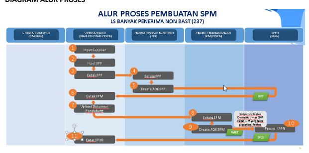

## A. Penjelasan Diagram Alur Proses

1) **Input Supplier**
Input Supplier mengacu pada Petunjuk Teknis tentang Perekaman Supplier.

2) **Input SPP**
Login menggunakan user operator SPP/SPM

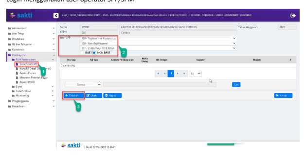

1. Masuk ke Modul Pembayaran → RUH SPP → Catat/Ubah SPP
2. Pilih Jenis SPP 237 LS Banyak Penerima "NON BAST"
3. Klik tombol tambah

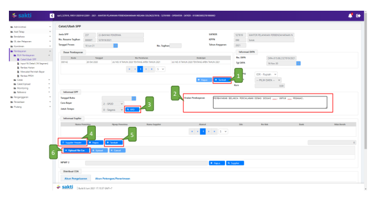

## 1. Pilih Dasar Pembayaran

2. Input Uraian pembayaran 3. Silahkan memilih RPD yang telah saudara buatsebelumnya, apabila nilai SPM melebihi 1 M (sesuai dengan Peraturan Menteri Keuangan Nomor 197/PMK.05/2017 tentang Rencana Penarikan Dana, Rencana Penerimaan Dana, dan Perencanaan Kas) dan silahkan dilewati saja (tidak perlu pilih RPD) 
apabila nilai SPM kurang dari 1 M.

4. Klik tombol "Supplier Header" untuk memilih supplier header 5. Klik tombol "Tambah" untuk menambah rekening penerima (apabila tidak menggunakan fitur upload CSV). Setelah klik tambah, silakan isikan jumlah nilai bersih yang diterima oleh masingmasing pegawai.

6. Klik tombol "Upload File CSV" untuk mengupload file ADK CSV yang berisi data nama penerima, jumlah uang yang diterima dan data lain yang berkaitan. (Mohon dipastikan nama supplier header dalam file ADK CSV sama dengan suppler header yang dipilih)

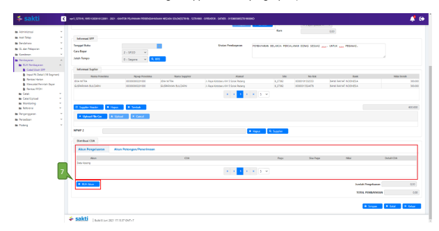

7. Klik tombol "RUH Akun" untuk menginput Akun Pengeluaran dan/atau Akun Potongan (apabila ada potongan)

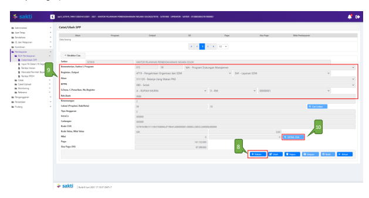

8. Klik Tombol "Rekam" untuk menambah Akun.

9. Pilih Akun yang akan digunakan. 10. Klik Tombol "Detail Coa"

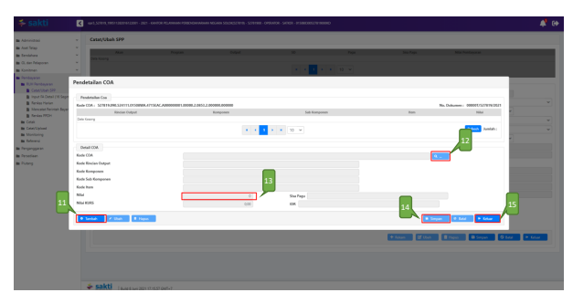

11. Klik tombol "Tambah".

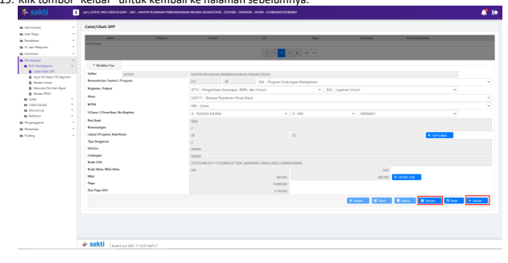 12. Klik tombol "Kaca Pembesar" untuk mencari Segmen 15/16nya. Pilih Segmen tersebut. 13. Masukkan nilai per detail segmen tersebut.

14. Klik tombol "Simpan". Apabila dalam akun yang sama terdapat lebih dari satu segmen 15/16, maka silakan ulangi langkah nomor 11-14.

15. Klik tombol "Keluar" untuk kembali ke halaman sebelumnya. 16. Klik tombol "Simpan" untuk menyimpan nilai akun yang digunakan. Apabila terdapat lebih dari satu akun, silakan ulangi langkah nomor 8-16.

17. Klik tombol "Keluar" untuk kembali ke perekaman SPP.

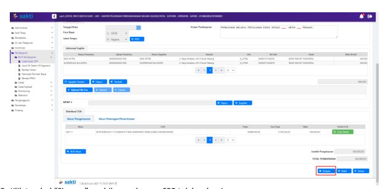

## 3) Cetak Spp

Login menggunakan user operator pembayaran

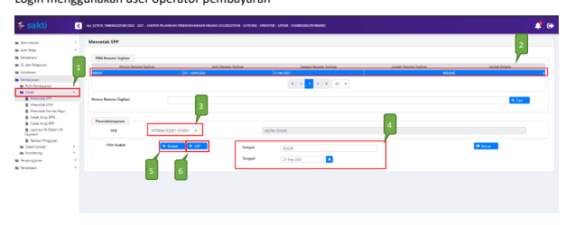

1. Masuk ke Modul Pembayaran →Cetak→Mencetak SPP
2. Pilih SPP yang ingin dicetak 3. Pilih PPK
4. Pastikan Tempat dan Tanggal telah sesuai 5. Klik tombol "Unduh" untuk mencetak SPP. 6. Klik tombol "SSP" apabila ingin mencetak SSP

## 4) Setuju Spp

Login menggunakan user PPK

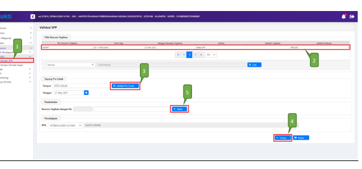

1. Masuk ke Modul Pembayaran →Validasi→Validasi SPP
2. Pilih SPP yang ingin divalidasi 3. Klik tombol "Unduh Pra Cetak" untuk mencetak SPP yang akan divalidasi 4. Klik tombol "Setuju" untuk menyetujui SPP.

5. Klik tombol "Batal" apabila ingin membatalkan validasi atas SPP yang sudah divalidasi

## 5) Create Adk Spp

Login menggunakan user PPK

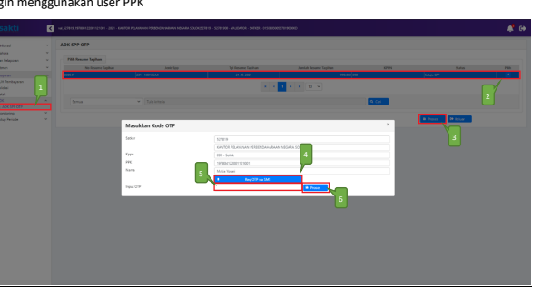

1. Masuk ke Modul Pembayaran →ADK→ADK SPP OTP
2. Pilih SPP yang ingin dibuat ADK SPP dengan melakukan ceklis pada kolom pilih. Dapat memilih lebih dari 1 SPP sekaligus apabila diperlukan.

3. Klik tombol "Proses" 4. Klik tombol 'Req OTP via SMS' untuk meminta kode OTP. 

5. Setelah menerima kode OTP, silakan input pada kolom 'Input OTP'.

6. Klik tombol "Proses"

## 6) Cetak Spm

Login menggunakan user operator pembayaran

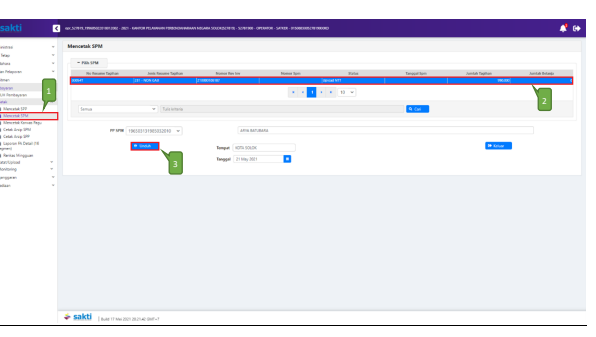

1. Masuk ke Modul Pembayaran →Cetak→Mencetak SPM
2. Pilih SPM yang ingin dicetak 3. Klik tombol "Unduh"

## 7) Upload Dokumen Pendukung

Login menggunakan user operator pembayaran

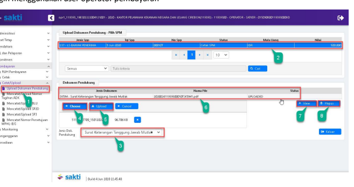

1. Masuk ke Modul Pembayaran →Catat/Upload→Upload Dokumen Pendukung 2. Pilih SPM yang ingin diupload dokumen pendukungnya 3. Pilih jenis dokumen pendukung 4. Klik tombol "Pilih" untuk memilih file yang akan diupload 5. Klik tombol "Upload" 6. File yang akan diupload akan muncul 7. Klik tombol "View" apabila ingin melihat file yang telah diupload 8. Klik tombol "apus" apabila ingin menghapus file yang telah diupload sebelumnya 8) **Setuju SPM**

Login menggunakan user PPSPM

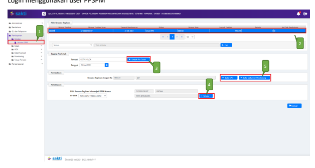

1. Masuk ke Modul Pembayaran →Validasi→Validasi SPM
2. Pilih SPM yang ingin divalidasi 3. Klik tombol "Unduh Pra Cetak" untuk mencetak SPM yang akan divalidasi 4. Klik tombol "Setuju" 5. Klik tombol "Batal SPM" apabila ingin membatalkan validasi atas SPM yang sudah divalidasi. 

Klik tombol "Batal Dokumen Pendukung" apabila ingin membatalkan dokumen pendukung yang telah di upload sebelumnya.

## 9) Create Adk Spm

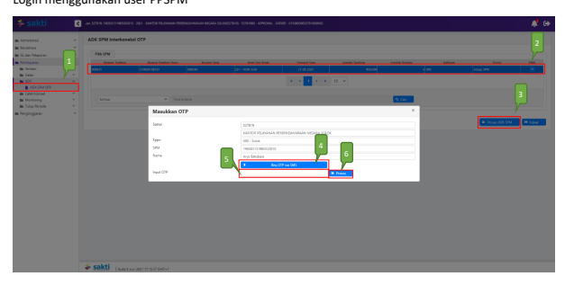

Login menggunakan user PPSPM
1. Masuk ke Modul Pembayaran →ADK→ADK SPM OTP
2. Pilih SPM yang ingin dibuat ADK SPM. Dapat memilih lebih dari 1 sekaligus apabila diperlukan.

3. Klik tombol "Proses ADK SPM"
4. Klik tombol "Req OTP via SMS" untuk untuk meminta kode OTP. 

5. Setelah menerima kode OTP, silakan input pada kolom 'Input OTP'. 6. Klik tombol "Proses"

## 10) Proses Kppn

Proses di KPPN Mengacu pada Standar Operasional Prosedur Pemrosesan SPM menjadi SP2D pada KPPN.

## 11) Catat Sp2D

Login menggunakan user operator pembayaran

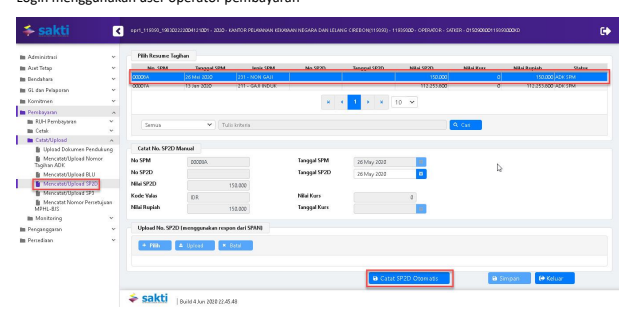

1. Masuk ke Modul Pembayaran →Catat/Upload→ Catat/Upload SP2D
2. Pilih SPM yang ingin dicatat No. SP2D 3. Klik tombol "Catat SP2D Otomatis".