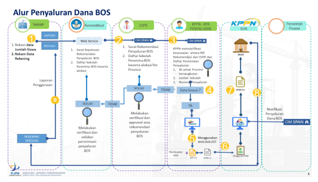
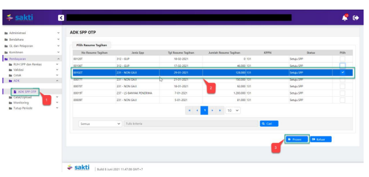

''
�
�
Petunjuk Teknis Aplikasi SAKTI)
�
→
PEREKAMAN SPM
PENYALURAN DANA BOS
KEMENTERIAN KEUANGAN RI
DITJEN PERBENDAHARAAN
�
�

## I. Informasi Umum A. Deskripsi Transaksi

Bantuan Operasional Sekolah atau BOS adalah bantuan pendidikan berbentuk dana yang diberikan kepada sekolah dan madrasah untuk kepentingan nonpersonalia. Dana BOS diberikan berdasarkan jumlah siswa yang dimiliki sebuah sekolah.

Mendikbud menetapkan Permendikbud 8 tahun 2020 tentang Juknis BOS Reguler adalah untuk melaksanakan ketentuan Pasal 59 ayat (1) Peraturan Pemerintah Nomor 55 Tahun 2005 tentang Dana Perimbangan perlu menetapkan Peraturan Menteri Pendidikan dan Kebudayaan tentang Petunjuk Teknis Bantuan Operasional Sekolah Reguler. Sebagaimana kita ketahui bahwa Dana BOS adalah pelaksanaan Dana Alokasi Khusus. Permendikbud 8 tahun 2020 tentang Petunjuk Teknis Bantuan Operasional Sekolah Reguler ditetapkan pada tanggal 5 Februari 2020 di Jakarta oleh Mendikbud dan diundangkan di Jakarta pada tanggal 6 Februari 2020 oleh Dirjen Peraturan Perundang-Undangan Kemenkumham.

| Modul                  | PEM                                                                                                         |
|------------------------|-------------------------------------------------------------------------------------------------------------|
| Role User              | OPR, VAL, APR                                                                                               |
| Modul Lain             | KOM                                                                                                         |
| terkait Transaksi yang | KOM - Import supplier type 6                                                                                |
| Tekait                 | PEM - Perekaman RPD                                                                                         |
| Dokumen Input          | Data elektronik dari aplikasi OMSPAN                                                                        |
| Output                 | SP2D SPM penyaluran dana BOS                                                                                |
| Validasi               | Sebelum merekam SPP mohon dipastikan supplier type 6 telah diimport dari  aplikasi OMSPAN ke aplikasi SAKTI |

## B. Informasi Penting Lainnya

Beberapa hal yang perlu diperhatikan oleh KPPN selaku KPA penyalur **(pengguna SAKTI):** 1. Penyaluran Dana BOS menggunakan data supplier sekolah yang telah terekam pada aplikasi SPAN dan SAKTI.

2. Data supplier sekolah untuk keperluan penyaluran dana BOS adalah supplier type 6 yang dimport dari data OMSPAN dengan nama supplier header "Penyaluran Dana BOS".

3. Perubahan supplier dilaksanakan oleh KPPN selaku KPA penyalur. 4. Jenis SPP 237 - LS Banyak Penerima penyaluran dana BOS, menggambil data interkoneksi dari aplikasi OMSPAN.

5. Jenis SPP 237 - LS Banyak Penerima penyaluran dana BOS, menggunakan supplier type 6 dengan sisi pengeluaran menggunakan akun 654311 tanpa adanya potongan.

6. SPM 237 - LS Banyak Penerima penyaluran dana BOS, dibuat per-bank (4 bank Himbara dan 1 bank non-Himbara) sesuai dengan permohonan penyaluran pada OMSPAN.

7. Terkait renkas harian, SPM penyaluran dana BOS berpedoman pada Peraturan Menteri Keuangan Republik Indonesia Nomor 197/PMK.05/2017 tentang Rencana Penarikan Dana, Rencana Penerimaan Dana dan Perencanaan Kas, dengan memperhatikan hal-hal sebagai berikut:

## A. Rekam Renkas Harian

Apabila ingin merubah tanggal jatuh tempo renkas harian, silahkan ajukan surat dispensasi perubahan tanggal jatuh tempo ke KPPN, setelah KPPN merubah tanggal jatuh tempo renkas harian, silahkan satker merekam SPP dengan memilih renkas harian yang jatuh temponya telah diupdate oleh KPPN.

b. Renkas otomatis Apabila ingin merubah tanggal jatuh tempo renkas harian, silahkan ajukan surat dispensasi perubahan tanggal jatuh tempo ke KPPN, setelah KPPN merubah tanggal jatuh tempo renkas harian, silahkan seksi bank menyesuaikan tanggal PPR sesuai dengan tanggal renkas harian yang jatuh temponya telah diupdate oleh KPPN.

## 1. Alur Proses

DIAGRAM ALUR PROSES

## A. Penjelasan Diagram Alur Proses

 1) Input Supplier

Input Supplier mengacu pada Petunjuk Teknis KOM-00... tentang Input Supplier.

## 2) Pengajuan Tagihan

Pengajuan tagihan dari OM-SPAN silahkan lihat petunjuk teknis pengajuan dana BOS pada user manual OM-SPAN

## 3) Input Spp

Login menggunakan user operator SPP/SPM

1. Masuk ke Modul Pembayaran  RUH SPP  Catat/Ubah SPP
2. Pilih Jenis SPP 237 - LS-BANYAK PENERIMA 3. Klik tombol tambah

## 4. Pilih Jenis Dana : Bos

5. Cari data transaksi pada baris data Lokasi, tahap dan Nilai pada form 6. Klik tombol Pilih

## 1. Pilih Dasar Pembayaran

2. Silahkan memilih RPD yang telah saudara buat sebelumnya, apabila nilai SPM melebihi 1 M (sesuai dengan Peraturan Menteri Keuangan Nomor 197/PMK.05/2017 tentang Rencana Penarikan Dana, Rencana Penerimaan Dana, dan Perencanaan Kas) dan silahkan dilewati saja (tidak perlu pilih RPD) apabila nilai SPM kurang dari 1 M
3. Uraian pembayaran akan terisi secara otomatis 4. Informasi supplier akan terisi secara otomatis 5. Distribusi COA akan terisi secara otomati (Klik "Lihat Detail" untuk melihat detail COA) 6. Klik Tombol "Simpan"

## 4) Cetak Spp

Login menggunakan user operator pembayaran

1. Masuk ke Modul Pembayaran CetakMencetak SPP
2. Pilih SPP yang ingin dicetak 3. Pilih Penandatangan PPK
4. Klik tombol "Unduh"

## 5) Setuju Spp

Login menggunakan user PPK

1. Masuk ke Modul Pembayaran ValidasiValidasi SPP
2. Pilih SPP yang ingin divalidasi 3. Klik tombol "Unduh Pra Cetak" untuk mencetak SPP yang akan divalidasi 4. Klik tombol "Setuju" 5. Klik tombol "Batal" apabila ingin membatalkan validasi atas SPP yang sudah divalidasi

## 6) Create Adk Spp

Login menggunakan user PPK

1.    Masuk ke Modul Pembayaran →ADK→ADK SPP OTP
2.

Pilih SPP yang ingin dibuat ADK SPP
3.   Klik tombol "Proses"

Klik tombol "Req OTP via SMS"
4.

5.   Input OTP pejabat PPK
6.   Klik tombol "Proses"

## 7)   Cetak Spm

Login menggunakan user operator pembayaran

5.   Masuk ke Modul Pembayaran →	Cetak→	Mencetak SPM 6.    Pilih SPM yang ingin dicetak 7.   Klik tombol "Unduh"

|  KEMENTERIAN KEUANGAN REPUBLIK INDONESIA                             |                                                            |                                     |                                       |
|----------------------------------------------------------------------|------------------------------------------------------------|-------------------------------------|---------------------------------------|
| DIREKTORAT JENDERAL BEA DAN CUKAI                                    |                                                            |                                     |                                       |
| KANTOR PENGAWASAN DAN PELAYANAN BC JAKARTA                           |                                                            |                                     |                                       |
| SURAT PERINTAH MEMBAYAR KEMBALI PUNGUTAN EKSPOR (SPMKPE)             |                                                            |                                     |                                       |
| Nomor 00032A                                                         | Tanggal   03-Sep-2020                                      | Halaman    1                        | dari 1                                |
| MEMERINTAHKAN KEPADA                                                 |                                                            |                                     |                                       |
| KPPN   JAKARTAII (019)                                               |                                                            |                                     |                                       |
| Untuk membayar                                                       | PUNGUTAN EKSPOR (SPMKPE) Pada akun penge                   | ialian pendapatan bea kelu          |                                       |
| 412211 Pendapatan Bea Keluar                                         | Tahun 2020                                                 |                                     |                                       |
| Sejumlah  Rp 15.000.000,00                                           | '''''' Lima BELAS Juta Rupiah '''''                        |                                     |                                       |
| Tahun Anggara                                                        | : 2020                                                     | Jenis Tagihan    :  SPMKBE / SPMKBK |                                       |
| Nomor SKPPE                                                          | : 001/411611/2020                                          | Jatuh Tempo                         | : Segera                              |
| Tanggal SKPPE                                                        | : 10-08-2020                                               | Cara Bayar                          | : SP2D                                |
| PENGELUARAN                                                          | JUMLAH UANG                                                |                                     |                                       |
| 411611.019.412211.0150500.000000.0000000.0000.2.0151.7.00000.        | 15.000.000.00                                              |                                     |                                       |
| Jamlah Pengelaaran                                                   | 15.000.000,00                                              |                                     |                                       |
| TOTAL PEMBAYARAN                                                     | 15.000.000,00                                              |                                     |                                       |
| Kapada:                                                              |                                                            |                                     |                                       |
| Nomor Suppler                                                        | 484250                                                     | Bara                                | :  BANK HSBC INDONESIA,  PT Bank HSBC |
| Nama Suppler                                                         | :  PT EXCLUSIVE NETWORKS INDONESIA                         | Rekering                            | 01565674001                           |
| Aamat                                                                | :  Menara Anugrah Lantai 18 Jl. Mega Kuningan Lot. 8.6-8.7 | Nema Pemilik Rek                    | PT EXCLUSIVE NETWORKS INDONESIA       |
| NPWP                                                                 |                                                            |                                     |                                       |
| Semua bukti-bukti pengeluaran yang disahkan Pejabat Pembuat Komitmen | KOTA JAKARTA PUSAT, 3 September                            |                                     |                                       |
| telah diuji dan dinyatakan memenuhi persyaratan untuk dilakukan      | a.n Menteri Keuangan Republik Indonesia                    |                                     |                                       |
| atas beban APBN, selanjutnya bukti-bukti pengeluaran dimaksud dis    | Kepala KANTOR PENGAWASAN DAN                               |                                     |                                       |
| ditatausahakan oleh Pejabat Penandatangan SPM                        | PELAYANAN BC JAKARTA                                       |                                     |                                       |
| Kebenaran perhitungan dan isi yang tertuang dalam SPM ini menjadi    | CHAIRUL SALEH                                              |                                     |                                       |
| NIP 196401271986011001                                               |                                                            |                                     |                                       |
| tanggung jawab Pejabat Penandatangan SPM                             |                                                            |                                     |                                       |

## 8)   Upload Dokumen Pendukung

Login menggunakan user operator pembayaran 1. Masuk ke Modul Pembayaran Catat/UploadUpload Dokumen Pendukung

2. Pilih SPM yang ingin diupload dokumen pendukungnya 3. Pilih jenis dokumen pendukung 4. Klik tombol "Pilih" untuk memilih file yang akan diupload

5. Klik tombol "Upload"
6. File yang akan diupload akan muncul 7. Klik tombol "View" apabila ingin melihat file yang telah diupload 8. Klik tombol ""Hapus" apabila ingin menghapus file yang telah diupload sebelumnya

1.    Masuk ke Modul Pembayaran →Validasi→Validasi SPM
 Pilih SPM yang ingin divalidasi 2.

3.

 Klik tombol "Unduh Pra Cetak" untuk mencetak SPM yang akan divalidasi

| KEMENTERIAN KEUANGAN REPUBLIK INDONESIA                      |                                    |               |                   |
|--------------------------------------------------------------|------------------------------------|---------------|-------------------|
| DIREKTORAT JENDERAL BEA DAN CUKAI                            |                                    |               |                   |
| KANTOR PENGAWASAN DAN PELAYANAN BC JAKARTA                   |                                    |               |                   |
| Nomor 00032A                                                 | ropal    03-Sep-2                  |               |                   |
| EMERINTAHKAN KEPA                                            |                                    |               |                   |
| JAKARTA!! (019                                               |                                    |               |                   |
| 412211 Pendapatan                                            |                                    |               |                   |
| Rp 15.000.000.00                                             |                                    |               |                   |
| Tahun Anggara                                                | 2020                               | s Tagihan     | : SPMKBE / SPMKBK |
| 01/411611/2020                                               |                                    |               |                   |
| toal SKPPP                                                   | : 10-08-2020                       | SP20          |                   |
| PENGELLIARAN                                                 | JUMLAH UANG                        | 15.000.000.00 |                   |
| 411611.019.412211.0150500.000000.0000000.00000.2.0151.7.0000 | 15.000.000.00                      |               |                   |
| 15.000.000,00                                                |                                    |               |                   |
| Nomor Supplie                                                |                                    |               |                   |
| Nama Supréer                                                 | PT EXCLUSIVE NETW                  |               |                   |
| Armal                                                        | Memana Amad                        |               |                   |
| i bukti-bukti pengeluaran yang disahk                        | KOTA JAKARTA PUSAT. 3 September    |               |                   |
| lui dan dinyatakan me                                        | n Menteri Keuangan Republik Indone |               |                   |
| iepala KANTOR PENGAWASAN DAN                                 |                                    |               |                   |
| PELAYANAN BC JAKARTA                                         |                                    |               |                   |
| TAIRUI, SALEH                                                |                                    |               |                   |
| NIP 196401271985011001                                       |                                    |               |                   |

4.   Klik tombol "Setuju" 5.   Klik tombol "Batal" apabila ingin membatalkan validasi atas SPM yang sudah divalidasi 6.   Klik tombol "Batal Dokumen Pendukung" apabila ingin membatalkan dokumen pendukung yang sudah diupload

## 10) Create Adk Spm

Login menggunakan user KPA
7. Masuk ke Modul Pembayaran ADKADK SPM OTP

8. Pilih SPP yang ingin dibuat ADK SPM
9. Klik tombol "Proses ADK SPM"

10. Klik tombol "Req OTP via SMS"
11. Input OTP pejabat KPA
12. Klik tombol "Proses"

## 11) Proses Kppn

Proses di KPPN Mengacu pada Standar Operasional Prosedur Pemrosesan SPM menjadi SP2D pada KPPN.

## 12) Catat Sp2D

Login menggunakan user operator pembayaran

1.    Masuk ke Modul Pembayaran →	Catat/Upload → Catat/Upload SP2D
2.    Pilih SPM yang ingin dicatat No. SP2D
Klik tombol "Catat SP2D Otomatis".

3.