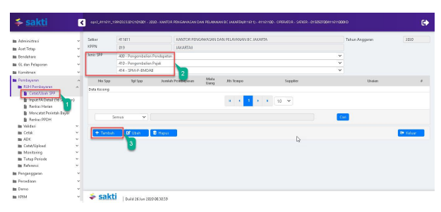
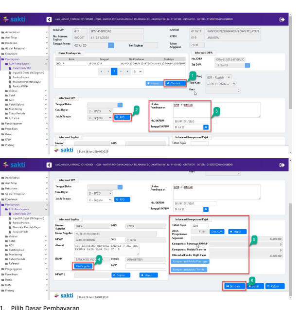
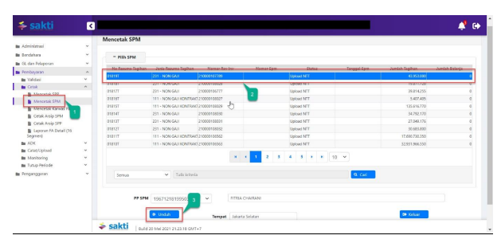
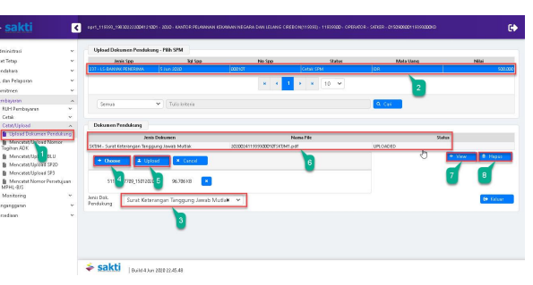
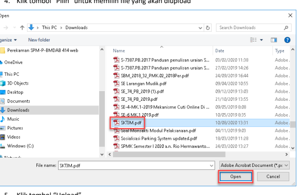
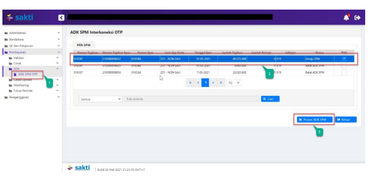
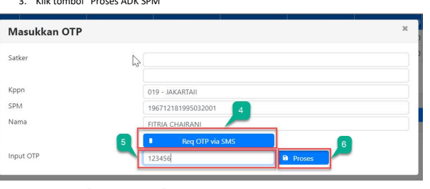
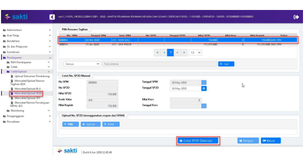

Petunjuk Teknis Aplikasi SAKTI)
�
PEREKAMAN SPM-P-BMDAB
(Pengembalian Bea Masuk Denda Administrasi dan/atau Bunga)
→

## I. Informasi Umum A. Deskripsi Transaksi

SPM P BMDAB digunakan untuk membayar tagihan Pengembalian Bea Masuk Denda Administrasi dan/atau bunga.

| Modul                  | PEM                                    |
|------------------------|----------------------------------------|
| Role User              | OPR, APP                               |
| Modul Lain yang        | KOM                                    |
| Terkait Transaksi yang | KOM - Pembuatan supplier type 1, 2 & 7 |
| Tekait                 | PEM - Perekaman RPD                    |
| Dokumen Input          | SPP SPM-P-BMDAB                        |
| Output                 | SP2D SPM-P-BMDAB                       |
| Validasi               |                                        |

## B. Informasi Penting Lainnya

Beberapa hal yang perlu diperhatikan oleh satker (pengguna SAKTI):
1. SPM-P-BMDAB menggunakan supplier type 1, 2 & 7 2. SPM-P-BMDAB diapprove oleh user KPA

## 1. Alur Proses

DIAGRAM ALUR PROSES

## A. Penjelasan Diagram Alur Proses

 1) Input Supplier

Input Supplier mengacu pada Petunjuk Teknis KOM-00... tentang Input Supplier.

## 2) Input Spp

Login menggunakan user operator SPP/SPM

1. Masuk ke Modul Pembayaran  RUH SPP  Catat/Ubah SPP
2. Pilih Jenis SPP 414 SPM-P-BMDAB
3. Klik tombol tambah

1. Pilih Dasar Pembayaran

2. Silahkan memilih RPD yang telah saudara buatsebelumnya, apabila nilai SPM melebihi 1 M (sesuai dengan Peraturan Menteri Keuangan Nomor 197/PMK.05/2017 tentang Rencana Penarikan Dana, Rencana Penerimaan Dana, dan Perencanaan Kas) dan silahkan dilewati saja (tidak perlu pilih RPD) 
apabila nilai SPM kurang dari 1 M
3. Input:
a. Uraian pembayaran b. No. SKPBM
c. Tanggal SKPBM
4. Klik tombol "Cari Supplier" untuk memilih supplier 5. Input Informasi Kompensasi Pajak:
a. Tahun Pajak b. Akun Pengeluaran c. Kompensasi Melalui Potongan dan Kompensasi Melalui Transfer (apabila ada)
6. Klik Tombol "Simpan"

## 3) Cetak Spm

Login menggunakan user operator pembayaran

1. Masuk ke Modul Pembayaran CetakMencetak SPM
2. Pilih SPM yang ingin dicetak 3. Klik tombol "Unduh"

| KEMENTERIAN KEUANGAN REPUBLIK INDONESIA                                       |                                    |                      |                      |
|-------------------------------------------------------------------------------|------------------------------------|----------------------|----------------------|
| DIREKTORAT JENDERAL BEA DAN CUKAI                                             |                                    |                      |                      |
| KANTOR PENGAWASAN DAN PELAYANAN BC JAKARTA                                    |                                    |                      |                      |
| SURAT PERINTAH MEMBAYAR KEMBALI BEA MASUK, DENDA ADMINISTRASI, DAN/ATAU BUNGA |                                    |                      |                      |
| Nomor 0002&A                                                                  | Tanggal    22-Jul-2020             | Halaman    1         | dari 1               |
| Tahun                                                                         | :2020                              | Jenis Taghan         | : SPM-P-BMDAB        |
| Nomor SKPBM :001/411611/2020                                                  | Jatuh Tempo                        | : Segera             |                      |
| Cara Bayar                                                                    | : SP2D                             |                      |                      |
| Tanggal                                                                       | :01-07-2020                        | MEMERINTAHKAN KEPADA |                      |
| KPPN   JAKARTAII (019)                                                        |                                    |                      |                      |
| Untuk membayar kembalimemindahbukukan PENGEMBALIAN BEA MASUK, DENDA ADMINISTRASI DAN/ATAU BUNGA pada
 Mata Anggaran Pengembalian Pendapatan Bea Masuk                                                                               |                                    |                      |                      |
| 412111 Pendapatan Bea Masuk Tahun 2020                                        |                                    |                      |                      |
| sejumlah  Rp 57.000.000,00                                                    | *** LIMA PULUH TUJUH JUTA RUPIAH * |                      |                      |
| PENGELUARAN                                                                   | JUMLAH UANG                        |                      |                      |
| 411611.019.412111.0150500.000000.00000000.0000.2.0151.7.00000.00000           | 57.000.000,00                      |                      |                      |
| Jumlah Pengeluaran                                                            | 57.000.000,00                      |                      |                      |
| TOTAL PEMBAYARAN                                                              | 57.000.000.00                      |                      |                      |
| Kapada:                                                                       | BANK HSBC INDONESIA                |                      |                      |
| Nomor Suppler                                                                 | : 27319                            | Bank / Pun           |                      |
| Nama Wajib Pajak :                                                            | PT. M. TECH PRODUCTS               | 01043975001          |                      |
| Rekering                                                                      |                                    |                      |                      |
| NPWP                                                                          | : 024143679056000                  | Nema Per             | PT. M. TECH PRODUCTS |
| Alamat                                                                        | GD. ARICEIMO SENTRAL LANTAI 7 JL.
RASUNA SAID BLOK X-2 NO. 5                                    |                      |                      |
| Semua bukti-bukti pengeluaran yang disahkan Pejabat Pembuat Komitmen          | KOTA JAKARTA PUSAT, 22 Juli 2020   |                      |                      |
| telah diuji dan dinyatakan memenuhi persyaratan untuk dilakukan               | a.n Menteri Keuangan Republik      |                      |                      |
| atas beban APBN, selanjutnya bukti-bukti pengeluaran dimaksud da              | Kepala Kantor                      |                      |                      |
| ditatausahakan oleh Pejabat Penandatangan SPM                                 |                                    |                      |                      |
| Kebenaran perhitungan dan isi yang tertuang dalam SPM ini me                  | CHAIRUL SALEH                      |                      |                      |
| tanggung jawab Pejabat Penandatangan SPM                                      | NIP 196401271986011001             |                      |                      |

## 4)   Upload Dokumen Pendukung

Login menggunakan user operator pembayaran 1. Masuk ke Modul Pembayaran Catat/UploadUpload Dokumen Pendukung

2. Pilih SPM yang ingin diupload dokumen pendukungnya 3. Pilih jenis dokumen pendukung 4. Klik tombol "Pilih" untuk memilih file yang akan diupload

5. Klik tombol "Upload"
6. File yang akan diupload akan muncul 7. Klik tombol "View" apabila ingin melihat file yang telah diupload 8. Klik tombol ""Hapus" apabila ingin menghapus file yang telah diupload sebelumnya

1.    Masuk ke Modul Pembayaran →Validasi→Validasi SPM
2.

Pilih SPM yang ingin divalidasi 3.

 Klik tombol "Tayang Pra Cetak" untuk mencetak SPM yang akan divalidasi

| MENTERIAN KELIANGAN REPUBLIK INDONESI                                         |                                  |                              |           |               |
|-------------------------------------------------------------------------------|----------------------------------|------------------------------|-----------|---------------|
| DIREKTORAT JENDERAL BEA DAN CUKAI                                             |                                  |                              |           |               |
| KANTOR PENGAWASAN DAN PELAYANAN BC JAKARTA                                    |                                  |                              |           |               |
| SURAT PERINTAH MEMBAYAR KEMBALI BEA MASUK, DENDA ADMINISTRASI, DAN/ATAU BUNGA |                                  |                              |           |               |
| Nomor 000284                                                                  | Halaman                          |                              |           |               |
| 2-Jul-2020                                                                    |                                  |                              |           |               |
| :2020                                                                         | nis Tagihan                      | : SPM-P-BMDAE                |           |               |
| Tahun                                                                         |                                  |                              |           |               |
| Nomor SKPBM   : 001/411611/2020                                               | Jatuh Tempa                      | : Segera                     |           |               |
| : SP2D                                                                        |                                  |                              |           |               |
| Tanggal                                                                       | : 01-07-2020                     |                              |           |               |
| KPPN   JAKARTAII (019)                                                        |                                  |                              |           |               |
| Untuk membayar kembali/memindahbukukan PENGEMBALIAN BEA MASUK, DENG           | NISTRASI DAN/ATAU BUNGA          |                              |           |               |
| Anggaran Pengembalian Pendapatan Bea Ma                                       |                                  |                              |           |               |
| 412111 Pendapatan Bea Masuk Tahun 2020                                        |                                  |                              |           |               |
| sejumlah                                                                      | Rp 57.000.000,00                 | LIMA PULUH TUJUH JUTA RUPU   |           |               |
| PENGELUARAN                                                                   | JUMLAH UANG                      | 57.000.000.00                |           |               |
| 411611.019.412111.0150500.0000                                                | cc.c                             | 0.2.0151.7.00                | rilah Per | 57.000.000,00 |
| 57.000.000,00                                                                 |                                  |                              |           |               |
| TOTAL PEMBAYARAN                                                              |                                  |                              |           |               |
| Nomor Supplier                                                                | 27319                            | BANK HSBC INDONE             |           |               |
| 01043975001                                                                   |                                  |                              |           |               |
| NPWP                                                                          | PT. M. TECH PRI                  |                              |           |               |
| 02/4145879058500                                                              |                                  |                              |           |               |
| nua bukti-bukti pengeluaran yang disahkan Pejabat Pembuat Ki                  | KOTA JAKARTA PUSAT, 22 Juli 2020 |                              |           |               |
| lah diuji dan dinyatakan memenuhi p                                           | rvaratan untuk di                | an Menteri Keuangan Republik |           |               |
| beban APBN, selanjutnya bukti-bukti pe                                        | CHAIRUL SALEH                    |                              |           |               |
| tanggung ja                                                                   | NIP 195401271986011001           |                              |           |               |
| Klik tombol "Setuju"                                                          |                                  |                              |           |               |
| 4.                                                                            |                                  |                              |           |               |

5.    Klik tombol "Batal" apabila ingin membatalkan validasi atas SPM yang sudah divalidasi 6.   Klik tombol "Batal Dokumen Pendukung" apabila ingin membatalkan dokumen pendukung yang sudah diupload

## 6)   Create Adk Spm

Login menggunakan user KPA
1. Masuk ke Modul Pembayaran ADKADK SPM OTP

2. Pilih SPP yang ingin dibuat ADK SPM

3. Klik tombol "Proses ADK SPM"

4. Klik tombol "Req OTP via SMS"
5. Input OTP pejabat KPA
6. Klik tombol "Proses"

## 7) Proses Kppn

Proses di KPPN Mengacu pada Standar Operasional Prosedur Pemrosesan SPM menjadi SP2D pada KPPN.

## 8) Catat Sp2D

Login menggunakan user operator pembayaran

1.    Masuk ke Modul Pembayaran →	Catat/Upload → Catat/Upload SP2D
2.    Pilih SPM yang ingin dicatat No. SP2D
Klik tombol "Catat SP2D Otomatis".

3.