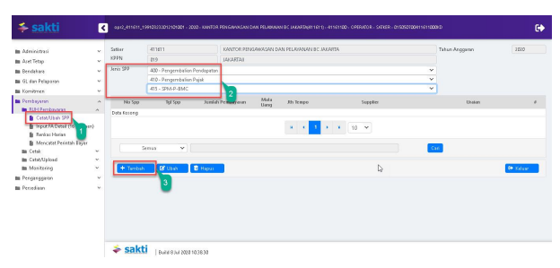

Petunjuk Teknis Aplikasi SAKTI)
�
PEREKAMAN SPM-P- BMC
(Pengembalian Bea Masuk dan/atau Cukai)
→

## I. Informasi Umum A. Deskripsi Transaksi

SPM P BMC digunakan untuk membayar tagihan Pengembalian Bea Masuk dan/atau Cukai.

| Modul                  | PEM                                    |
|------------------------|----------------------------------------|
| Role User              | OPR, APP                               |
| Modul Lain yang        | KOM, PEM                               |
| Terkait Transaksi yang | KOM - Pembuatan supplier type 1, 2 & 7 |
| Tekait                 | PEM - Perekaman RPD                    |
| Dokumen Input          | SPP SPM-P-BMC                          |
| Output                 | SP2D SPM-P-BMC                         |
| Validasi               |                                        |

## B. Informasi Penting Lainnya

Beberapa hal yang perlu diperhatikan oleh satker (pengguna SAKTI):
1. SPM-P-BMC menggunakan supplier type 1, 2 & 7 2. SPM-P-BMC diapprove oleh user KPA

## 1. Alur Proses

DIAGRAM ALUR PROSES

## A. Penjelasan Diagram Alur Proses

 1) Input Supplier

Input Supplier mengacu pada Petunjuk Teknis KOM-00... tentang Input Supplier.

## 2) Input Spp

Login menggunakan user operator SPP/SPM

1. Masuk ke Modul Pembayaran  RUH SPP  Catat/Ubah SPP
2. Pilih Jenis SPP 415 SPM-P-BMC
3. Klik tombol tambah

1. Pilih Dasar Pembayaran

2. Silahkan memilih RPD yang telah saudara buatsebelumnya, apabila nilai SPM melebihi 1 M (sesuai dengan Peraturan Menteri Keuangan Nomor 197/PMK.05/2017 tentang Rencana Penarikan Dana, Rencana Penerimaan Dana, dan Perencanaan Kas) dan silahkan dilewati saja (tidak perlu pilih RPD) 
apabila nilai SPM kurang dari 1 M

## 3. Input:

a. Uraian pembayaran b. No. SKPFP-BMC
c. Tanggal SKPFP-BMC
4. Klik tombol "Cari Supplier" untuk memilih supplier 5. Input Informasi Kompensasi Pajak:
a. Tahun Pajak b. Akun Pengeluaran c. Kompensasi Melalui Potongan dan Kompensasi Melalui Transfer (apabila ada)

## 3)   Cetak Spm

Login menggunakan user operator pembayaran

1.    Masuk ke Modul Pembayaran →	Cetak→	Mencetak SPM
2.    Pilih SPM yang ingin dicetak 3.   Klik tombol "Unduh" KEMENTERIAN KEUANGAN REPUBLIK INDONESIA
DIREKTORAT JENDERAL BEA DAN CUKAI
KANTOR PENGAWASAN DAN PELAYANAN BC JAKARTA
dari    1

| SURAT PERINTAH MEMBAYAR KEMBALI BEA MASUK DAN/ATAU CUKAI                                           |                        |                               |          |
|----------------------------------------------------------------------------------------------------|------------------------|-------------------------------|----------|
| Nomor  00029A                                                                                      | Tanggal    10-Agu-2020 | Halaman    1                  |          |
| Tahun Anggaran                                                                                     | : 2020                 | Jenis Tagihan    :  SPM-P-BMC |          |
| Nomor SKPFP-BMC                                                                                    | : 001/411611/2020      | Jatuh Tempo                   | : Segera |
| Tanggal SKPPFP-BMC : 01-07-2020                                                                    | Cara Bayar             | : SP2D                        |          |
| Berdasarkan Surat Keputusan Pembayaran Fasilitas Pengembalian Bea Masuk dan/atau Cukai Kanwil DJBC |                        |                               |          |

dalam rangka Kemudahan Impor Tujuan Ekspor (KITE)
MEMERINTAHKAN KEPADA
KPPN JAKARTAIY
(019)
Untuk membayar kembali/memindahbukukan PEMBAYARAN PENGEMBALIAN BEA MASUK, DAN/ATAU CUKAI pada Mata Anggaran Pengembalian Pendapatan Bea Masuk dan/atau Cukai : 412112 Pendapatan Bea Masuk Ditanggung Pemerintah atas Hibah (SPM Nihil) Tahun 2020 Sejumlah Rp  7.000.000,00
*** TUJUH JUTA RUPIAH ***

| PENGELUARAN                                                         | JUMLAH UANG   |
|---------------------------------------------------------------------|---------------|
| 411611.019.412112.0150500.000000.00000000.0000.2.0151.7.00000.00000 | 7.000.000,00  |
| Jumlah Pengeluaran                                                  | 7.000.000.00  |
| TOTAL PEMBAYARAN                                                    | 7.000.000,00  |

| Kepada:         |                                              |                                                        |                                                 |
|-----------------|----------------------------------------------|--------------------------------------------------------|-------------------------------------------------|
| Nomor Supplier  | : 484950                                     | Kode Bank                                              | : 523087000990                                  |
| Nama Perusahaan | :  PT EXCLUSIVE NETWORKS INDONESIA           | Nama Bank                                              | :  BANK HSBC INDONESIA PT Bank HSBC Kantor      |
| NPWP            | :021944723058000                             | Atemat Bank                                            | : World Trade Center 1 lantai 8-9, Jl. Jenderal |
| NIPER           | Nomor Rekening                               | : 001568674001                                         |                                                 |
| ALAMAT          | : Menara Anugrah Lantai 18 Jl. Mega Kuningan | Nama Pemilik Rek    :  PT EXCLUSIVE NETWORKS INDONESIA |                                                 |

| Semua bukti-bukti pengeluaran yang disahkan Pejabat Pembuat Komitmen   |
|------------------------------------------------------------------------|
| telah diuji dan dinyatakan memenuhi persyaratan untuk dilakukan        |
| atas beban APBN, selanjutnya bukti-bukti pengeluaran dimaksud disimpan |
| ditatausahakan oleh Pejabat Penandatangan SPM                          |

KOTA JAKARTA PUSAT, 10 Agustus 2020 a.n Menteri Keuangan Republik Indonesia Kepala KANTOR PENGAWASAN DAN

| Kebenaran perhitungan dan isi yang tertuang dalam SPM ini menjadi   |
|---------------------------------------------------------------------|
| tanggung jawab Pejabat Penandatangan SPM                            |

| CHAIRUL SALEH          |
|------------------------|
| NIP 196401271986011001 |

## 4)   Upload Dokumen Pendukung

Login menggunakan user operator pembayaran 1. Masuk ke Modul Pembayaran Catat/UploadUpload Dokumen Pendukung

2. Pilih SPM yang ingin diupload dokumen pendukungnya 3. Pilih jenis dokumen pendukung 4. Klik tombol "Pilih" untuk memilih file yang akan diupload

5. Klik tombol "Upload"
6. File yang akan diupload akan muncul 7. Klik tombol "View" apabila ingin melihat file yang telah diupload 8. Klik tombol ""Hapus" apabila ingin menghapus file yang telah diupload sebelumnya

1.    Masuk ke Modul Pembayaran →Validasi→Validasi SPM
2.

Pilih SPM yang ingin divalidasi 3.

 Klik tombol "Tayang Pra Cetak" untuk mencetak SPM yang akan divalidasi

| KEMENTERIAN KEUANGAN REPUBLIK INDONESIA   |                                                 |               |             |
|-------------------------------------------|-------------------------------------------------|---------------|-------------|
| DIREKTORAT JENDERAL BEA DAN CUKAI         |                                                 |               |             |
| KANTOR                                    | JASAN DAN PELAYANAN RC JAKA                     |               |             |
| SURAT PERINTAH M                          | BAYAR KEMBALI BEA MASUK DAN/ATAU CUKAI          |               |             |
| Nomor  00029A                             | Halaman    1                                    | dari          |             |
| Tahun Anggaran                            | : 2020                                          | Jenis Tagihan | : SPM-P-BMC |
| Nomor SKPFP-BMC                           | : 001/411611/2020                               |               |             |
| Tanggal SKPPFP-BMC : 01-07-2020           | SP2D                                            |               |             |
| Berdasarkan Surat Keputusan Pen           | ngembalian Bea Masuk dan/atau Cukai Kanwil DJBC |               |             |

1 dalam rangka Kemudahan Impo TEMERINTAHKAN KEPA
Untuk membayar kemb KYARAN PENGEMBALIAN BE
SUK, DAN/ATAU CUKAI pada Mata Anggaran Pengembal uk dan/atau Cukai nerintah atas Hibah (SPM Nihil) Tahun 412112 Pendapatan B
luk Ditang Sejumlah Rp  7.000.00
** TUJUH JUTA RUPIAH ***

| ** TUJUH JUTA RUPIAH ***                                            |                               |                                   |                                                 |
|---------------------------------------------------------------------|-------------------------------|-----------------------------------|-------------------------------------------------|
| PENGELUARAN                                                         | JUMLAH UANG                   |                                   |                                                 |
| 411611.019.412112.0150500.000000.00000000.0000.2.0151.7.00000.00000 | 7.000.000,00                  |                                   |                                                 |
| 7.000.000.00                                                        |                               |                                   |                                                 |
| Jumlah Pengeluaran                                                  |                               |                                   |                                                 |
| TOTAL PEMBAYARAN                                                    | 7.000.000,00                  |                                   |                                                 |
| Kepada                                                              |                               |                                   |                                                 |
| Nomor Supplier                                                      | Kode Barat                    | 523087000990                      |                                                 |
| Nama Perusahaan                                                     | : PT EXCLUSIVE NETWORKS INDON | Nama Bank                         | : BANK HSBC INDONESIA PT Bank HSBC Kanto        |
| NPWP                                                                | 021944723058000               | Asmat Bank                        | : World Trade Center 1 lantai 8-9, Jl. Jenderal |
| NIPER                                                               | Nomor Rekeni                  | : 001568674001                    |                                                 |
| ALAMAT                                                              | Nema Pemilik Rek              | : PT EXCLUSIVE NETWORKS INDONESIA |                                                 |

| Semua bukti-bukti pengeluaran yang disahkan P                     | KOTA JAKARTA PUSAT, 10 Agustus 2020     |
|-------------------------------------------------------------------|-----------------------------------------|
| telah diuji dan dinyatakan memenuhi persyaratan untuk dilaku      | a.n Menteri Keuangan Republik Indonesia |
| atas beban APBN, selanjutnya bukti-bukti pengeluaran dimaksud d   | Kepala KANTOR PENGAWASAN DAN            |
| ditatausahakan oleh Pejabat Penandat                              |                                         |
| Kebenaran perhitungan dan isi yang tertuang dalam SPM ini menjadi | CHAIRUL SALEH                           |
| tanggung jawab Pejabat Penandatanga                               | NIP 196401271986011001                  |

4.   Klik tombol "Setuju" Klik tombol "Batal" apabila ingin membatalkan validasi atas SPM yang sudah divalidasi 5.

6.   Klik tombol "Batal Dokumen Pendukung" apabila ingin membatalkan dokumen pendukung yang sudah diupload

## 6)   Create Adk Spm

Login menggunakan user KPA

1. Masuk ke Modul Pembayaran ADKADK SPM OTP
2. Pilih SPP yang ingin dibuat ADK SPM
3. Klik tombol "Proses ADK SPM"

4. Klik tombol "Req OTP via SMS"
5. Input OTP pejabat KPA
6. Klik tombol "Proses"

## 7) Proses Kppn

Proses di KPPN Mengacu pada Standar Operasional Prosedur Pemrosesan SPM menjadi SP2D pada KPPN.

## 8) Catat Sp2D

Login menggunakan user operator pembayaran

1.    Masuk ke Modul Pembayaran →	Catat/Upload → Catat/Upload SP2D
2.    Pilih SPM yang ingin dicatat No. SP2D
Klik tombol "Catat SP2D Otomatis".

3.