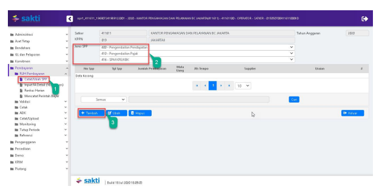
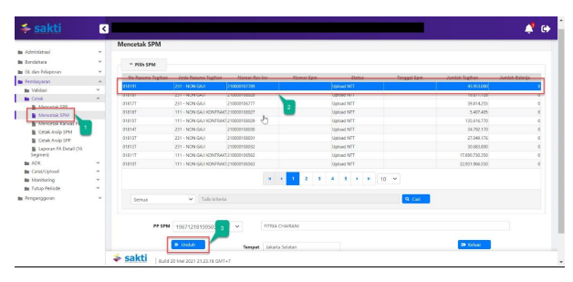
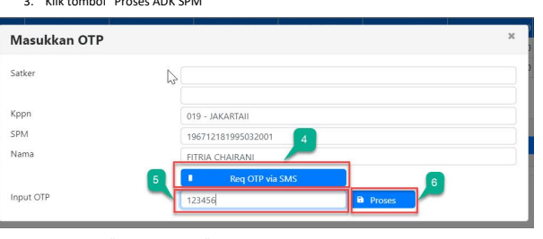
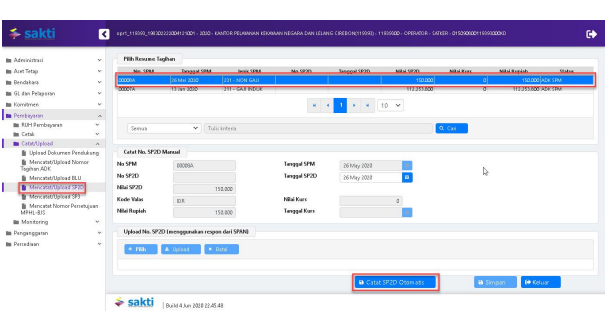

Petunjuk Teknis Aplikasi SAKTI)
�
PEREKAMAN SPM KPE/KBK
(Kembali Pungutan Ekspor/Kembali Bea Keluar)

## I. Informasi Umum A. Deskripsi Transaksi

SPM KPE/KBK digunakan untuk membayar tagihan Kembali Pungutan Ekspor/Kembali Bea Keluar.

| Modul                  | PEM                                       |
|------------------------|-------------------------------------------|
| Role User              | OPR, APP                                  |
| Modul Lain yang        | KOM, PEM                                  |
| Terkait Transaksi yang | KOM - Pembuatan supplier type 1, 2, 4 & 7 |
| Tekait                 | PEM - Perekaman RPD                       |
| Dokumen Input          | SPP SPM KPE/KBK                           |
| Output                 | SP2D SPM KPE/KBK                          |
| Validasi               |                                           |

## B. Informasi Penting Lainnya

Beberapa hal yang perlu diperhatikan oleh **satker (pengguna SAKTI):**
1. SPM KPE/KBK menggunakan supplier type 1, 2, 4 & 7 2. SPM KPE/KBK diapprove oleh user KPA

## 1. Alur Proses

DIAGRAM ALUR PROSES

## A. Penjelasan Diagram Alur Proses

 1) Input Supplier

Input Supplier mengacu pada Petunjuk Teknis KOM-00... tentang Input Supplier.

## 2) Input Spp

Login menggunakan user operator SPP/SPM

1. Masuk ke Modul Pembayaran  RUH SPP  Catat/Ubah SPP
2. Pilih Jenis SPP 416 SPM KPE/KBK
3. Klik tombol tambah

| 😉 sakti                         | an di sebelum pertama di sebelum dari sebelum pertama di sebelum dari sebelum dari sebelum di se   | �                                                                                                                                            |                                                                 |                               |                          |           |
|----------------------------------|----------------------------------------------------------------------------------------------------|----------------------------------------------------------------------------------------------------------------------------------------------|-----------------------------------------------------------------|-------------------------------|--------------------------|-----------|
| a                                | Jenis SPP                                                                                          | sater                                                                                                                                        |                                                                 |                               |                          |           |
| m Administrati                   | 416                                                                                                | SPM KPE,KIK                                                                                                                                  | .411611                                                         | KANTOR PENGAMASAN DAN PELAYAN |                          |           |
| m Are: Tetap                     | Ns. Resume
Taghan                                                                                                    | 000T                                                                                                                                         | 411611/2020                                                     | KPPN                          | 019                      | JAKASTAII |
| ta Berdakan                      | Tenggel Proses                                                                                     | Teben
Anggaran                                                                                                                                              | 2020                                                            |                               |                          |           |
| m GL dan Pelayanan               | 22 Jul 20                                                                                          | h, Indonesia.                                                                                                                                |                                                                 |                               |                          |           |
| an Kombres                       | Dala Pembayaran                                                                                    | International DEN                                                                                                                            |                                                                 |                               |                          |           |
| m Pentiyang                      | >                                                                                                  | Kode                                                                                                                                         | Deskitasi                                                       | Ns. DIPA                      | 094-815.05.2.411611.V2X  |           |
| an SUH Pembagian s               | n                                                                                                  | tota K0184 p                                                                                                                                 | TI DIPA                                                         | . 13 Nov 15                   | l                        |           |
| lih Catat/Ubah 222               |                                                                                                    |                                                                                                                                              |                                                                 |                               |                          |           |
| II UNGGUNG DENGAN 116 Selamati S |                                                                                                    |                                                                                                                                              |                                                                 |                               |                          |           |
| ll   8 min Harim                 | Masa Univers                                                                                       | IDR » Rupish                                                                                                                                 |                                                                 |                               |                          |           |
| lih Murcatat Putintah Bayar      | O  M                                                                                               | O T                                                                                                                                          | Tipe: Kurs                                                      | - PILIH DATA --               |                          |           |
| m William                        | >                                                                                                  |                                                                                                                                              |                                                                 |                               |                          |           |
| m Cetak                          | Kors                                                                                               | 0                                                                                                                                            |                                                                 |                               |                          |           |
| II ADK                           | laformasi SPP                                                                                      | L                                                                                                                                            |                                                                 |                               |                          |           |
| in Catab/Upload                  | s                                                                                                  |                                                                                                                                              |                                                                 |                               |                          |           |
| m Mantering                      | Tanggal Duku                                                                                       | n                                                                                                                                            | Uraisn
Pembaparan                                                                 | 12 H KPR/KPR                  |                          |           |
| an Titap Periode                 | Cara Bayar                                                                                         | 2 - SP2D                                                                                                                                     | >                                                               |                               |                          |           |
| m Referensi                      |                                                                                                    |                                                                                                                                              |                                                                 |                               |                          |           |
| ttt Penganggang                  | han Tenga                                                                                          | 0 - Segera                                                                                                                                   | O  FFF                                                          | No. SKIPPE                    | 03/411611/2020           |           |
| m Pertediam                      | Tergal SKPPE                                                                                       | 01 MA 24                                                                                                                                     | l                                                               |                               |                          |           |
| m Deno                           |                                                                                                    |                                                                                                                                              |                                                                 |                               |                          |           |
| m KSIM                           | Informal Sup                                                                                       | Informasi Kompernasi Pajak                                                                                                                   |                                                                 |                               |                          |           |
| m Prancis                        | Kangessasi Patengan SPMKF                                                                          |                                                                                                                                              |                                                                 |                               |                          |           |
| Nomor                            | nas                                                                                                | o                                                                                                                                            |                                                                 |                               |                          |           |
| →                                | | Barat 18.1a1 2000 18.09.03                                                                       |                                                                                                                                              |                                                                 |                               |                          |           |
| 😉 sakti                         | a                                                                                                  | an Jamah Timur 19620 Mengan 2001 - 2000 - KANTOR PENGANAN DAN PELASURAN BELAZARDAH 1610 - ATHENISOL OPERATOR - CATER - DIRIZATOON 19621000 D | �                                                               |                               |                          |           |
| m Administrati                   | Informati SPP                                                                                      |                                                                                                                                              |                                                                 |                               |                          |           |
| m Aren Tetap                     | Tersebabkan                                                                                        |                                                                                                                                              | Urahan                                                          | 2 H KPE/KIR                   |                          |           |
| m Bendatas                       | Cara Bayar                                                                                         | 2 - SP20                                                                                                                                     | ›                                                               |                               |                          |           |
| m Gl dan Pelapang                |                                                                                                    |                                                                                                                                              |                                                                 |                               |                          |           |
| n Kominan                        | labah Tampa                                                                                        | 0 - Seqara                                                                                                                                   | >                                                               | a IND                         | NI, SKPPE                | 000,00    |
| an Pentikyang                    | Tanggal SKPPE                                                                                      | p perusa                                                                                                                                     | la                                                              |                               |                          |           |
| an 8.00 Pembayaran               | »                                                                                                  |                                                                                                                                              |                                                                 |                               |                          |           |
| lih Catat/Ubah 222               | Informasi Supace                                                                                   | li formasi Kompensi Pajal                                                                                                                    |                                                                 |                               |                          |           |
| lih Trest FA Detail 116 Septemb  |                                                                                                    |                                                                                                                                              |                                                                 |                               |                          |           |
| ll   8 mkxx Home                 | Nomor
Supplic                                                                                                    | 406                                                                                                                                          | NIS                                                             | :54:057                       | Kampangan Potengan SPMKP | o         |
| lih Murcatat Putintah Bayar      | Kompensasi Melalui Trandar                                                                         | o                                                                                                                                            |                                                                 |                               |                          |           |
| m 1964 seb                       | Nama                                                                                               | IANITA ARTHA NAGA                                                                                                                            | Doksi menalikan karena perjalanan perjalanan perjalanan Pajakan |                               |                          |           |
| In  Cetak                        | a                                                                                                  |                                                                                                                                              |                                                                 |                               |                          |           |
| NPNP                             | ER672281001000                                                                                     | | Site                                                                                                                                       | 7_                                                              |                               |                          |           |
| m ADK                            | Kecaman Melawan                                                                                    | 2                                                                                                                                            |                                                                 |                               |                          |           |
| Anan d                           |                                                                                                    |                                                                                                                                              |                                                                 |                               |                          |           |
| m CatabUpload                    | Kavasan Indonesi Pulogadang Jl. Pulog
Sidik Blok R No. 291 Kelurahan                                                                                                    |                                                                                                                                              |                                                                 |                               |                          |           |
| m Maskaring                      | Kereman Mebih Torser                                                                               |                                                                                                                                              |                                                                 |                               |                          |           |
|                                  | JATI DEDIKA                                                                                        |                                                                                                                                              |                                                                 |                               |                          |           |
| an Tutap Periode                 |                                                                                                    |                                                                                                                                              |                                                                 |                               |                          |           |
| m Referensi                      | BHK                                                                                                | SANK CENTRAL                                                                                                                                 | Norek                                                           | 477119999                     |                          |           |
| m Penganggang                    | tem kepaber                                                                                        | NOP                                                                                                                                          |                                                                 |                               |                          |           |
| ta Pertediam                     | NPWP 2                                                                                             |                                                                                                                                              |                                                                 |                               |                          |           |
| ta Deno                          | a                                                                                                  | l 0 Hyd                                                                                                                                      |                                                                 |                               |                          |           |
| m IPIM                           |                                                                                                    |                                                                                                                                              |                                                                 |                               |                          |           |
| m Pranal                         | Distribusi COM                                                                                     |                                                                                                                                              |                                                                 |                               |                          |           |
| 🙂 sakti                         | | Bundi 18 Jul 2000 18 09:03                                                                       |                                                                                                                                              |                                                                 |                               |                          |           |
| 😉 sakti                         | B                                                                                                  | april #11611_1962094152001 - 2000 - KANTOR PENGARAN DAN PELEBIAN BC LUDATINAH 16110 - #1161100 - OPERATOR - SATER - DIRIZETOON 110000 D      | �                                                               |                               |                          |           |
| angan menganti                   |                                                                                                    |                                                                                                                                              |                                                                 |                               |                          |           |
| Nema                             | PANITA ARTHA NAGA                                                                                  | Dice mbulikan kx: YY dib Pajak                                                                                                               |                                                                 |                               |                          |           |
| la Administrati                  | o                                                                                                  |                                                                                                                                              |                                                                 |                               |                          |           |
| NPN7                             | E11672231004000                                                                                    | s                                                                                                                                            | J_12201                                                         |                               |                          |           |
| m Aren Tetap                     | KONG SOLO MARA P                                                                                   |                                                                                                                                              |                                                                 |                               |                          |           |
| An men                           |                                                                                                    |                                                                                                                                              |                                                                 |                               |                          |           |
| ta Berdakan                      | Kavaran Indontri Pulopadang Jl. Pulo
Sidik Diok R No. 291 Kelurahan                                                                                                    | Angan Melalui Melalui                                                                                                                        |                                                                 |                               |                          |           |
| m GL dan Pelapasa                | Jatingara                                                                                          |                                                                                                                                              |                                                                 |                               |                          |           |
| an Kombres                       | BHK                                                                                                | EAN: CENTRAL ASIA                                                                                                                            | Norek                                                           | 47719999                      |                          |           |
| m Pentikana                      | Can Supplier                                                                                       | NOP                                                                                                                                          |                                                                 |                               |                          |           |
| an SUH Pembagian                 | n                                                                                                  |                                                                                                                                              |                                                                 |                               |                          |           |
| ly Catab/Ubah 222                | NPWP 2                                                                                             |                                                                                                                                              |                                                                 |                               |                          |           |
| lih Trest FA Detail 116 Septemb  | . O. Liha                                                                                          |                                                                                                                                              |                                                                 |                               |                          |           |
| lil  Sankas Harma                |                                                                                                    |                                                                                                                                              |                                                                 |                               |                          |           |
| B  Mercatat Perintah Bayar       | Doteleni CON                                                                                       |                                                                                                                                              |                                                                 |                               |                          |           |
| m William                        | Akun Pengeluaran                                                                                   | Akus Potongan/Penerimaan                                                                                                                     |                                                                 |                               |                          |           |
| m Cetsk                          |                                                                                                    |                                                                                                                                              |                                                                 |                               |                          |           |
| m ADK                            | k                                                                                                  |                                                                                                                                              |                                                                 |                               |                          |           |
| m Catat/Upload                   | AKAN                                                                                               | OA                                                                                                                                           | Pacu                                                            | Sisa Pagu                     | Nitai                    |           |
| m Maskaring                      | -                                                                                                  | 40211                                                                                                                                        | ::                                                              | 1.00.00                       |                          |           |
| ll                               | ..                                                                                                 |                                                                                                                                              |                                                                 |                               |                          |           |
| m Referensi                      |                                                                                                    |                                                                                                                                              |                                                                 |                               |                          |           |
| m Penganggang                    | 0 SINGAP                                                                                           | lankh Pengda                                                                                                                                 | 7.500.000                                                       |                               |                          |           |
| m Perredam                       |                                                                                                    |                                                                                                                                              |                                                                 |                               |                          |           |
| m Deno                           | TOTAL PIMILKIARAN                                                                                  | 7.500 000                                                                                                                                    |                                                                 |                               |                          |           |
| Ch                               |                                                                                                    |                                                                                                                                              |                                                                 |                               |                          |           |
| n IPIM                           |                                                                                                    |                                                                                                                                              |                                                                 |                               |                          |           |
| m Pranala                        | B Simpan                                                                                           | 918                                                                                                                                          | a 201                                                           |                               |                          |           |
| 🙂 sakti | Bunung 200 18:09:03   |                                                                                                    |                                                                                                                                              |                                                                 |                               |                          |           |

1. Silahkan memilih RPD yang telah saudara buat sebelumnya, apabila nilai SPM melebihi 1 M (sesuai dengan Peraturan Menteri Keuangan Nomor 197/PMK.05/2017 tentang Rencana Penarikan Dana, Rencana Penerimaan Dana, dan Perencanaan Kas) dan silahkan dilewati saja (tidak perlu pilih RPD) 
apabila nilai SPM kurang dari 1 M
2. Input:
a. Uraian pembayaran b. No. SKPPE
c. Tanggal SKPPE
3. Klik tombol "Cari Supplier" untuk memilih supplier 4. Klik tombol "RUH Akun" untuk menginput Distribusi CoA (Akun Pengeluaran dan Akun Potongan)
5. Klik Tombol "Simpan"

## 3) Cetak Spm

Login menggunakan user operator pembayaran

1. Masuk ke Modul Pembayaran CetakMencetak SPM
2. Pilih SPM yang ingin dicetak 3. Klik tombol "Unduh"

| KEMENTERIAN KEUANGAN                                                                          |                                                                         |                                   |          |
|-----------------------------------------------------------------------------------------------|-------------------------------------------------------------------------|-----------------------------------|----------|
| DITJEN BEA DAN CUKAI                                                                          |                                                                         |                                   |          |
| KANTOR PENGAWASAN DAN PELAYANAN BC JAKARTA                                                    |                                                                         |                                   |          |
| SURAT PERINTAH MEMBAYAR KEMBALI BEA KELUAR DANIATAU SANKSI ADMINISTRASI BERUPA DENDA (SPMKBK) |                                                                         |                                   |          |
| Nomor 00030A                                                                                  | Tanggal   10-Agu-2020                                                   | Halaman    1                      | dari 1   |
| MEMERINTAHKAN KEPADA                                                                          |                                                                         |                                   |          |
| KPPN   JAKARTAII (019)                                                                        |                                                                         |                                   |          |
| Untuk membayar                                                                                | BEA KELUAR DAN/ATAU SANKSI ADMINISTRASI BERUPA DENDA (SPMKBK) Pada akun |                                   |          |
| 412211 Pendapatan Bea Keluar                                                                  | Tahun 2020                                                              |                                   |          |
| Sejumlah  Rp 7.500.000,00                                                                     | *** TUJUH JUTA LIMA RATUS RIBU RUPIAH '                                 |                                   |          |
| Tahun Anggara                                                                                 | : 2020                                                                  | Jenis Tagihan    :  SPM KPE/KBK   |          |
| Nomor SKPBK                                                                                   | : 003/411611/2020                                                       | Jatuh Tempo                       | : Segera |
| Tanggal SKPBK                                                                                 | : 01-07-2020                                                            | Cara Bayar                        | : SP2D   |
| PENGELUARAN                                                                                   | JUMLAH UANG                                                             |                                   |          |
| 411611.019.412211.0150500.000000.0000000.0000.2.0151.7.000000.                                | 7.500.000,00                                                            |                                   |          |
| Jamlah Pengeluaran                                                                            | 7.500.000,00                                                            |                                   |          |
| TOTAL PEMBAYARAN                                                                              | 7.500.000,00                                                            |                                   |          |
| Kepada:                                                                                       |                                                                         |                                   |          |
| Nomor Supplier                                                                                | : 544/67                                                                | BANK CENTRAL ASIA,  Kantor Cabang |          |
| Nama Suppler                                                                                  | :  PT. PANJTA ARTHA NIAGA                                               | 4777019202                        |          |
| Alamat                                                                                        | :  Kawasan Industri Pulogadung Jl. Pulo Sidik Bisk R.No. 20             | PT PANTJA ARTHA NIAGA             |          |
| NPWP                                                                                          |                                                                         |                                   |          |
| Semua bukti-bukti pengeluaran yang disahkan Pejabat Pembuat Komis                             | KOTA JAKARTA PUSAT, 10 Agustus                                          |                                   |          |
| n                                                                                             |                                                                         |                                   |          |
| telah diuji dan dinyatakan memenuhi persyaratan untuk dilakukan                               | an Menteri Keuangan Republik Indonesia                                  |                                   |          |
| Kepala KANTOR PENGAWASAN DAN                                                                  |                                                                         |                                   |          |
| atas beban APBN, selanjutnya bukti-bukti pengeluaran dimaksud da                              |                                                                         |                                   |          |
| ditatausahakan oleh Pejabat Penandatangan SPM                                                 | PELAYANAN BC JAKARTA                                                    |                                   |          |
| Kebenaran perhitungan dan isi yang tertuang dalam SPM ini menjadi                             | CHAIRUL SALEH                                                           |                                   |          |
| tanggung jawab Pejabat Penandatangan SPM                                                      | NIP 196401271986011001                                                  |                                   |          |

## 4)   Upload Dokumen Pendukung

Login menggunakan user operator pembayaran 1. Masuk ke Modul Pembayaran Catat/UploadUpload Dokumen Pendukung

2. Pilih SPM yang ingin diupload dokumen pendukungnya 3. Pilih jenis dokumen pendukung 4. Klik tombol "Pilih" untuk memilih file yang akan diupload

5. Klik tombol "Upload"
6. File yang akan diupload akan muncul 7. Klik tombol "View" apabila ingin melihat file yang telah diupload 8. Klik tombol ""Hapus" apabila ingin menghapus file yang telah diupload sebelumnya

1.    Masuk ke Modul Pembayaran →Validasi→Validasi SPM
2.

 Pilih SPM yang ingin divalidasi 3.

 Klik tombol "Tayang Pra Cetak" untuk mencetak SPM yang akan divalidasi

| MENTERIAN KEUANGAN                             |                                                        |                                |             |
|------------------------------------------------|--------------------------------------------------------|--------------------------------|-------------|
| EN REA DAN CUKAI                               |                                                        |                                |             |
| SURAT PERINTAH MEMBAYAR KEMBALI BE             | LIAR DANIATAU SANKSI ADMINISTRASI BERUPA DENDA (SPMKBK |                                |             |
| Nomor 00030/                                   |                                                        |                                |             |
| KPPN JAKARTA!! (019                            |                                                        |                                |             |
| 12211 Pendapatan Bea Kelu                      |                                                        |                                |             |
| Rp 7.500.000.00                                |                                                        |                                |             |
| 2020                                           |                                                        |                                |             |
| Tahun Anggr                                    |                                                        |                                |             |
| or SKPER                                       | 03/411611/2020                                         |                                |             |
| Tanggal SKPBR                                  | 01-07-2020                                             | PENGELUARAN                    | JUMLAH UANG |
| 1611.019.412211.0150500.000000.00000000.0000.2 | 7.500.00.00                                            |                                |             |
| 7.500.00.00                                    |                                                        |                                |             |
| 7.500.000.00                                   |                                                        |                                |             |
| Nomor Superb                                   | 544267                                                 |                                |             |
| Nama Supple                                    | PT. PANUTA AR                                          | KOTA JAKARTA PUSAT, 10 Agustus |             |
| u bukti-bukti pengeluaran yang dis             | a.n Menteri Keuangan Republik Indone                   |                                |             |
| lepala KANTOR PENGAWASAN DAN                   |                                                        |                                |             |
| PELAYANAN BC JAKARTA                           |                                                        |                                |             |
| HAIRUL SALEH                                   |                                                        |                                |             |
| NIP 196401271986011001                         |                                                        |                                |             |
| tanggung jawab Pejab                           |                                                        |                                |             |
| 4.   Klik tombol "Setuju"                      |                                                        |                                |             |

5.    Klik tombol "Batal" apabila ingin membatalkan validasi atas SPM yang sudah divalidasi 6.   Klik tombol "Batal Dokumen Pendukung" apabila ingin membatalkan dokumen pendukung yang sudah diupload

## 6)   Create Adk Spm

Login menggunakan user KPA
1. Masuk ke Modul Pembayaran ADKADK SPM OTP

2. Pilih SPP yang ingin dibuat ADK SPM

3. Klik tombol "Proses ADK SPM"

4. Klik tombol "Req OTP via SMS"
5. Input OTP pejabat KPA
6. Klik tombol "Proses"

## 7) Proses Kppn

Proses di KPPN Mengacu pada Standar Operasional Prosedur Pemrosesan SPM menjadi SP2D pada KPPN.

## 8) Catat Sp2D

Login menggunakan user operator pembayaran

1.    Masuk ke Modul Pembayaran →	Catat/Upload → Catat/Upload SP2D
2.    Pilih SPM yang ingin dicatat No. SP2D
Klik tombol "Catat SP2D Otomatis".

3.