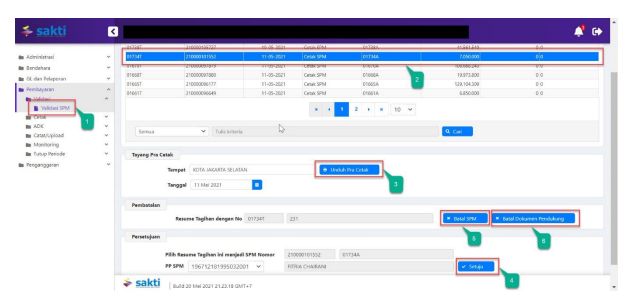

Petunjuk Teknis Aplikasi SAKTI)
PEREKAMAN SPM-P-PNBP
(Pengembalian Penerimaan Negara Bukan Pajak)
→
�

�
�
KEMENTERIAN KEUANGAN RI
DITJEN PERBENDAHARAAN

## I. Informasi Umum A. Deskripsi Transaksi

SPM-P-PNBP digunakan untuk membayar tagihan Pengembalian Penerimaan Negara Bukan Pajak.

| Modul                  | PEM                             |
|------------------------|---------------------------------|
| Role User              | OPR, APP                        |
| Modul Lain yang        | KOM, PEM                        |
| Terkait Transaksi yang | KOM - Pembuatan supplier type 2 |
| Tekait                 | PEM - Perekaman RPD             |
| Dokumen Input          | SPP SPM-P-PNBP                  |
| Output                 | SP2D SPM-P-PNBP                 |
| Validasi               |                                 |

## B. Informasi Penting Lainnya

Beberapa hal yang perlu diperhatikan oleh satker (pengguna SAKTI):
1. SPM-P-PNBP menggunakan supplier type 1, 2, 4 & 7 2. SPM-P-PNBP diapprove oleh user KPA

## 1. Alur Proses

DIAGRAM ALUR PROSES

## A. Penjelasan Diagram Alur Proses

1) **Input Supplier**
Input Supplier mengacu pada Petunjuk Teknis KOM-00... tentang Input Supplier.

## 2) Input Spp

Login menggunakan user operator SPP/SPM

1. Masuk ke Modul Pembayaran  RUH SPP  Catat/Ubah SPP
2. Pilih Jenis SPP 421 SPM-P-PNBP
3. Klik tombol tambah

2. Silahkan memilih RPD yang telah saudara buat sebelumnya, apabila nilai SPM melebihi 1 M (sesuai dengan Peraturan Menteri Keuangan Nomor 197/PMK.05/2017 tentang Rencana Penarikan Dana, Rencana Penerimaan Dana, dan Perencanaan Kas) dan silahkan dilewati saja (tidak perlu pilih RPD) apabila nilai SPM kurang dari 1 M
3. Input Uraian pembayaran 4. Klik tombol "Cari Supplier" untuk memilih supplier 5. Klik tombol "RUH Akun" untuk menginput Distribusi CoA (Akun Pengeluaran dan Akun Potongan)
6. Klik Tombol "Simpan"

## 3) Cetak Spm

Login menggunakan user operator pembayaran

1.   Masuk ke Modul Pembayaran →	Cetak→	Mencetak SPM 2.    Pilih SPM yang ingin dicetak 3.   Klik tombol "Unduh"

| KEMENTERIAN KEUANGAN                                                                          |                                     |              |                          |
|-----------------------------------------------------------------------------------------------|-------------------------------------|--------------|--------------------------|
| KANTOR PELAYANAN KEKAYAAN NEGARA DAN LELANG CIREBON                                           |                                     |              |                          |
| SURAT PERINTAH MEMBAYAR PENGEMBALIAN PENERIMAAN NEGARA BUKAN PAJAK                            |                                     |              |                          |
| Nomor 00014A                                                                                  | Tanggal    01-Sep-2020              | Halaman    1 | dari 1                   |
| MEMERINTAHKAN KEPADA                                                                          |                                     |              |                          |
| KPPN   Cirebon (024)                                                                          |                                     |              |                          |
| Untuk membayar kembali/memindahbukukan Pengembalian PNBP pada Mata Anggaran :                 |                                     |              |                          |
| 421111 Pendapatan Minyak Bumi Tahun 2020                                                      |                                     |              |                          |
| Sejumlah   Rp  500.000,00                                                                     | *** LIMA RATUS RIBU RUPIAH ***      |              |                          |
| Tahun Anggaran:    2020                                                                       | Jenis Tagihan                       | : SPM-P-PNBP |                          |
| Dasar Pembayaran                                                                              | Jatuh Tempo                         | : Segera     |                          |
| DIPA                                                                                          | Cara Bayar                          | : SP2D       |                          |
| Nomor : DIPA-015.09.2.119393/2020                                                             |                                     |              |                          |
| Tanggal :  13-11-2019                                                                         |                                     |              |                          |
| PMK NO. 96/PMK.05/2017 TENTANG TATA                                                           |                                     |              |                          |
| CARA PEMBAYARAN ATAS TRANSAKSI                                                                |                                     |              |                          |
| PENGELUARAN                                                                                   | JUMLAH UANG                         |              |                          |
| 119.99.3.024.421111.0150900.000000.00000000.0000 2.0254.7.00000.00000                         | 500,000,00                          |              |                          |
| 500.000.00                                                                                    |                                     |              |                          |
| Jamlah Pengeluaran                                                                            |                                     |              |                          |
| TOTAL PEMBAYARAN                                                                              | 500,000,00                          |              |                          |
| Kepada:                                                                                       |                                     |              |                          |
| Nomor Supplier                                                                                | : 477407                            | Bank / Pos   | : BANK MANDIRI           |
| Nama Supplier                                                                                 | : PT. COBAS PERKAKAS JAYA           | Rekening     | : 1270009991058          |
| NPWP                                                                                          | : 828826230047000                   | Nama PemER   | : PT COBAS PERKAKAS JAYA |
| ALAMAT                                                                                        | Kapuk Utara 2 No. 5 Gedung A, Kapuk |              |                          |
| Muara, Penjaringan, Jakarta Utara, DKI                                                        |                                     |              |                          |
| Alas beban rekening kas Negara A Bendahara Umum pada Bank Operasional I KPPN di Cirebon (024) |                                     |              |                          |
| Semua bukti-bukti pengeluaran yang disahkan Pejabat Pembuat Komit                             | KOTA CIREBON, 01 September 2020     |              |                          |
| telah diuji dan dinyatakan memenuhi persyaratan untuk dilakukan                               | a.n Menteri/Ketua Lembaga           |              |                          |
| atas beban APBN, selanjutnya bukti-bukti pengeluaran dimaksud da                              | Kuasa Pengguna Anggaran,            |              |                          |
| ditatausahakan oleh Pejabat Penandatangan SPM                                                 |                                     |              |                          |
| Kebenaran perhitungan dan isi yang tertuang dalam SPM ini menjadi                             | DWI WAHYUDI                         |              |                          |
| tanggung jawab Pejabat Penandatangan SPM                                                      | NP 197501131995031002               |              |                          |

## 4)   Upload Dokumen Pendukung

Login menggunakan user operator pembayaran 1. Masuk ke Modul Pembayaran Catat/UploadUpload Dokumen Pendukung

2. Pilih SPM yang ingin diupload dokumen pendukungnya 3. Pilih jenis dokumen pendukung 4. Klik tombol "Pilih" untuk memilih file yang akan diupload

5. Klik tombol "Upload"
6. File yang akan diupload akan muncul 7. Klik tombol "View" apabila ingin melihat file yang telah diupload 8. Klik tombol ""Hapus" apabila ingin menghapus file yang telah diupload sebelumnya

1.    Masuk ke Modul Pembayaran →Validasi→Validasi SPM
2.

Pilih SPM yang ingin divalidasi 3.

 Klik tombol "Tayang Pra Cetak" untuk mencetak SPM yang akan divalidasi

| ENTERIAN KEUANGAN                                             |                        |                   |
|---------------------------------------------------------------|------------------------|-------------------|
| EKAYAAN NEGARA DAN LELANG CI                                  |                        |                   |
| SURAT PERINTAH MEMB                                           |                        |                   |
| Sejumlah  Rp 500.000,00                                       |                        |                   |
| Tahun Anggaran:    2020                                       |                        |                   |
| Dasar Pembayaran                                              |                        |                   |
| DIPA                                                          | DIPA-015.09.2.119393/2 |                   |
| nggal :  13-11-2019                                           |                        |                   |
| PMK NO. 96/PMK.05/2017 TENTANG TAT                            |                        |                   |
| CARA PEMBAYARAN ATAS TRANSAKSI                                |                        |                   |
| PENGELUARAN                                                   | JUMLAH UANG            |                   |
| 11.0393.024.421111.0150900.000000.000000000.0000 2.0254.7.000 | 500.00.00              |                   |
| 500.00.00                                                     |                        |                   |
| 500,000,00                                                    |                        |                   |
| Kepada:                                                       |                        |                   |
| Nomor Supplie                                                 | 477407                 | BANK MANDIRI      |
| Nama Supplie                                                  | PT. COBAS PERKAKAS JAY | 1270009991058     |
| NPWP                                                          | 828826230047000        | PT COBAS PERKAKAS |
| IOTA CIREBON, 01 Septem                                       |                        |                   |
| tanggung ja                                                   | NP 197501131995031002  |                   |
| 4.                                                            | Klik tombol "Setuju"   |                   |

5.    Klik tombol "Batal" apabila ingin membatalkan validasi atas SPM yang sudah divalidasi 6.   Klik tombol "Batal Dokumen Pendukung" apabila ingin membatalkan dokumen pendukung yang sudah diupload

## 6)    Create Adk Spm

Login menggunakan user KPA
1. Masuk ke Modul Pembayaran ADKADK SPM

2. Pilih SPM yang ingin dibuat ADK SPM
3. Klik tombol "Proses ADK SPM"

4. Klik tombol "Req OTP via SMS"
5. Input OTP pejabat KPA
6. Klik tombol "Proses"

## 7) Proses Kppn

Proses di KPPN Mengacu pada Standar Operasional Prosedur Pemrosesan SPM menjadi SP2D pada KPPN.

## 8) Catat Sp2D

Login menggunakan user operator pembayaran

1.    Masuk ke Modul Pembayaran →	Catat/Upload → Catat/Upload SP2D
2.    Pilih SPM yang ingin dicatat No. SP2D
Klik tombol "Catat SP2D Otomatis".

3.