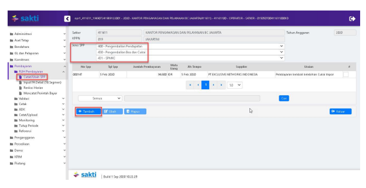
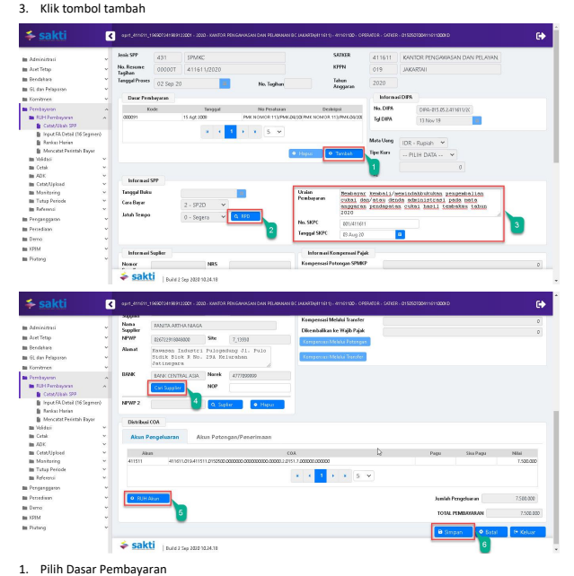
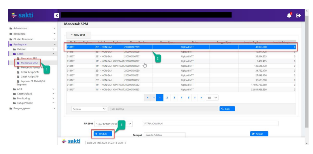
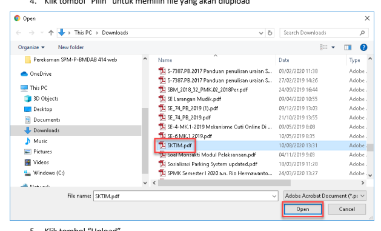
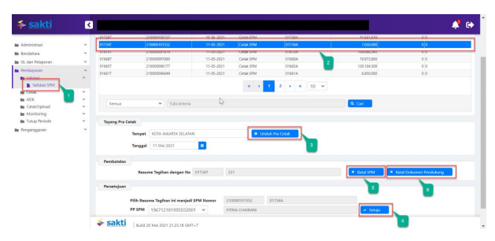
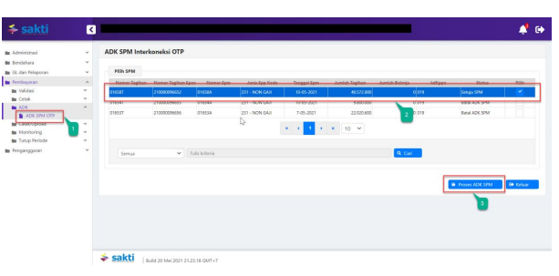

''
�
�
Petunjuk Teknis Aplikasi SAKTI)
�
PEREKAMAN SPMKC
(Kembali Cukai)
KEMENTERIAN KEUANGAN RI DITJEN PERBENDAHARAAN
→
�

## I. Informasi Umum A. Deskripsi Transaksi

SPMKC digunakan untuk membayar tagihan Kembali Cukai.

| Modul                  | PEM                                       |
|------------------------|-------------------------------------------|
| Role User              | OPR, APP                                  |
| Modul Lain yang        | KOM, PEM                                  |
| Terkait Transaksi yang | KOM - Pembuatan supplier type 1, 2, 4 & 7 |
| Tekait                 | PEM - Perekaman RPD                       |
| Dokumen Input          | SPP SPMKC                                 |
| Output                 | SP2D SPMKC                                |
| Validasi               |                                           |

## B. Informasi Penting Lainnya

Beberapa hal yang perlu diperhatikan oleh satker (pengguna SAKTI):
1. SPMKC menggunakan supplier type 1, 2, 4 & 7 2. SPMKC diapprove oleh user KPA

## 1. Alur Proses

DIAGRAM ALUR PROSES

## A. Penjelasan Diagram Alur Proses

 1) Input Supplier

Input Supplier mengacu pada Petunjuk Teknis KOM-00... tentang Input Supplier.

## 2) Input Spp

Login menggunakan user operator SPP/SPM

1. Masuk ke Modul Pembayaran  RUH SPP  Catat/Ubah SPP
2. Pilih Jenis SPP 431 SPMKC

2. Silahkan memilih RPD yang telah saudara buat sebelumnya, apabila nilai SPM melebihi 1 M (sesuai dengan Peraturan Menteri Keuangan Nomor 197/PMK.05/2017 tentang Rencana Penarikan Dana, Rencana Penerimaan Dana, dan Perencanaan Kas) dan silahkan dilewati saja (tidak perlu pilih RPD) apabila nilai SPM kurang dari 1 M
3. Input :
a. Uraian pembayaran b. Nomor SKPC
c. Tanggal SKPC
4. Klik tombol "Cari Supplier" untuk memilih supplier 5. Klik tombol "RUH Akun" untuk menginput Distribusi CoA (Akun Pengeluaran dan Akun Potongan)

## 3) Cetak Spm

Login menggunakan user operator pembayaran

1. Masuk ke Modul Pembayaran CetakMencetak SPM
2. Pilih SPM yang ingin dicetak 3. Klik tombol "Unduh"

| KEMENTERIAN KEUANGAN REPUBLIK INDONESIA                                                                   |                                                        |                           |                                   |
|-----------------------------------------------------------------------------------------------------------|--------------------------------------------------------|---------------------------|-----------------------------------|
| DIREKTORAT JENDERAL BEA DAN CUKAI                                                                         |                                                        |                           |                                   |
| KANTOR PENGAWASAN DAN PELAYANAN BC JAKARTA                                                                |                                                        |                           |                                   |
| SURAT PERINTAH MEMBAYAR KEMBALI CUKAI DAN/ATAU SANKSI ADMINISTRASI BERUPA DENDA                           |                                                        |                           |                                   |
| Nomor 00014A                                                                                              | Tanggal    05-Feb-2020                                 | Halaman    1              | dari    1                         |
| MEMERINTAHKAN KEPADA                                                                                      |                                                        |                           |                                   |
| KPPN    JAKARTAII (019)                                                                                   |                                                        |                           |                                   |
| Untuk membayar kembali,memindahbukukan PENGEMBALIAN CUKAI DANIATALI SANKSI ADMINISTRASI BERUPA DENDA pada |                                                        |                           |                                   |
| Mata Anggaran Pengembalian                                                                                | Cukai                                                  |                           |                                   |
| 411512 Pendapatan Cukai Ethyl Alkohol                                                                     | Tahun 2020                                             |                           |                                   |
| Sejumlah Rp 100.000.00                                                                                    | ***  SERATUS RIBU RUPIAH ***                           |                           |                                   |
| Tahun Anggara                                                                                             | : 2020                                                 | Jenis Tagihan    :  SPMKC |                                   |
| Nomor SKPC                                                                                                | : SKPC-001/2020                                        | Jatuh Tempo               | : Segera                          |
| Tanggal SKPC                                                                                              | : 06-01-2020                                           | Cara Bayar                | : SP2D                            |
| PENGELUARAN                                                                                               | JUMLAH UANG                                            |                           |                                   |
| 411611.019.411512.0150500.000000.0000000.0000.2.0151.7.000000.                                            | 100,00,00                                              |                           |                                   |
| Jamlah Pengelaaran                                                                                        | 100.000,00                                             |                           |                                   |
| TOTAL PEMBAYARAN                                                                                          | 100.000,00                                             |                           |                                   |
| Kepada:                                                                                                   |                                                        |                           |                                   |
| Nomor Supplier                                                                                            | : 484950                                               | Bank / Pos                | BANK HSBC INDONESIA PT Bank HSBC  |
| Nama Supplier                                                                                             | : PT EXCLUSIVE NETWORKS INDONESIA                      | 01568674001               |                                   |
| NPWP                                                                                                      | :021944723058000                                       | Nama Pemilik              | : PT EXCLUSIVE NETWORKS INDONESIA |
| NPPBKC                                                                                                    |                                                        |                           |                                   |
| ALAMAT                                                                                                    | : Menara Anugrah Lantai 18 Jl. Mega Kuningan Lot. 8.6- |                           |                                   |
| 8.7 Kawasan Mega Kuningan Setiabudi                                                                       |                                                        |                           |                                   |
| Semua bukti-bukti pengeluaran yang disahkan Pejabat Pembuat Komitmen                                      | KOTA JAKARTA PUSAT, 5 Februari 2020                    |                           |                                   |
| telah diuji dan dinyatakan memenuhi persyaratan untuk dilakukan                                           | a.n Menteri Keuangan Republik Indonesia                |                           |                                   |
| Kepala KANTOR PENGAWASAN DAN                                                                              |                                                        |                           |                                   |
| atas beban APBN, selanjutnya bukti-bukti pengeluaran dimaksud disimpan                                    | PELAYANAN BC JAKARTA                                   |                           |                                   |
| ditatausahakan oleh Pejabat Penandatangan SPM                                                             |                                                        |                           |                                   |
| Kebenaran perhitungan dan isi yang tertuang dalam SPM ini menjadi                                         | CHAIRUL SALEH                                          |                           |                                   |
| NIP 196401271986011001                                                                                    |                                                        |                           |                                   |
| tanggung jawab Pejabat Penandatangan SPM                                                                  |                                                        |                           |                                   |

## 4)   Upload Dokumen Pendukung

Login menggunakan user operator pembayaran 1. Masuk ke Modul Pembayaran Catat/UploadUpload Dokumen Pendukung

2. Pilih SPM yang ingin diupload dokumen pendukungnya 3. Pilih jenis dokumen pendukung 4. Klik tombol "Pilih" untuk memilih file yang akan diupload

5. Klik tombol "Upload"
6. File yang akan diupload akan muncul 7. Klik tombol "View" apabila ingin melihat file yang telah diupload 8. Klik tombol ""Hapus" apabila ingin menghapus file yang telah diupload sebelumnya

1.    Masuk ke Modul Pembayaran →Validasi→Validasi SPM
2.

Pilih SPM yang ingin divalidasi 3.

 Klik tombol "Unduh Pra Cetak" untuk mencetak SPM yang akan divalidasi

| KEMENTERIAN KEUANGAN REPUBLIK INDONESIA                      |                                                    |             |            |
|--------------------------------------------------------------|----------------------------------------------------|-------------|------------|
| DIREKTORAT JENDERAL BEA DAN CUKAI                            |                                                    |             |            |
| IR PENGAWASAN DAN PELAYANAN BC JAKARTA                       |                                                    |             |            |
| SURAT PERINTAH MEMBAYAR KE                                   | LI CUKAI DAN/ATAU SANKSI ADMINISTRASI BERUPA DENDA |             |            |
| Nomor 00014A                                                 | Haman                                              |             |            |
| JAKARTAII (019)                                              |                                                    |             |            |
| Untuk membayar kembali/memin                                 | NISTRASI BERUPA DENDA                              |             |            |
| Mata Anggaran Pengembalian                                   |                                                    |             |            |
| 411512 Pendapatan Cukai Ethyl Alko                           |                                                    |             |            |
| Sejumlah Rp 100.000.00                                       | SERATUS RUSU RU                                    |             |            |
| un Anggara                                                   | 2020                                               | : SPMKC     |            |
| ns Taghan                                                    |                                                    |             |            |
| nor SKPC                                                     | SKPC-001/2020                                      |             |            |
| 06-01-2020                                                   | SP2D                                               |             |            |
| Tanggal SKPC                                                 | PENGELUARAN                                        | JUMLAH UANG | 100.000,00 |
| 411611.019.411512.0150500.000000.0000000.0000.2.0151.7.00000 | 100.000,00                                         |             |            |
| 100.000,00                                                   |                                                    |             |            |
| Nomor Suppl                                                  |                                                    |             |            |
| Nama Supplier                                                | PT EXCLUSIVE NETV                                  |             |            |
| NPWF                                                         | PT EXCLUSIVE NETWORKS INDONESIA                    |             |            |
| NPPBKC                                                       |                                                    |             |            |
| ALAMAT                                                       | KOTA JAKARTA PUSAT, 5 Februari 2020                |             |            |
| ua bukti-bukti pengeluaran yang disah                        | a.n Menteri Keuangan Republik Indone               |             |            |
| telah diuji dan dinyatakan memenuhi persyaratan untuk di     | epala KANTOR PENGAWASAN DAN                        |             |            |
| beban APBN, selanjutnya bukti-bukti pe                       | PELAYANAN BC JAKARTA                               |             |            |
| sahakan oleh Pejabat Pena                                    | NIP 196401271966011001                             |             |            |
| tanggung                                                     |                                                    |             |            |
| 4.   Klik tombol "Setuju"                                    |                                                    |             |            |

5.    Klik tombol "Batal" apabila ingin membatalkan validasi atas SPM yang sudah divalidasi 6.   Klik tombol "Batal Dokumen Pendukung" apabila ingin membatalkan dokumen pendukung yang sudah diupload

## 6)   Create Adk Spm

Login menggunakan user KPA
1. Masuk ke Modul Pembayaran ADKADK SPM OTP

2. Pilih SPP yang ingin dibuat ADK SPM

3. Klik tombol "Proses ADK SPM"

4. Klik tombol "Req OTP via SMS"
5. Input OTP pejabat KPA
6. Klik tombol "Proses"

## 7) Proses Kppn

Proses di KPPN Mengacu pada Standar Operasional Prosedur Pemrosesan SPM menjadi SP2D pada KPPN.

## 8) Catat Sp2D

Login menggunakan user operator pembayaran

1.    Masuk ke Modul Pembayaran →	Catat/Upload → Catat/Upload SP2D
2.    Pilih SPM yang ingin dicatat No. SP2D
 Klik tombol "Catat SP2D Otomatis".

3.