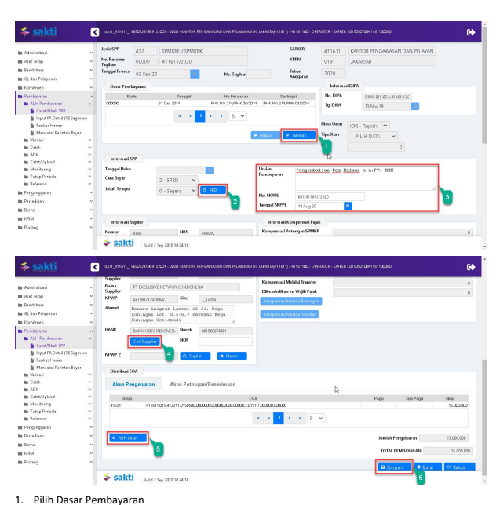
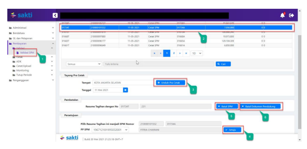

Petunjuk Teknis Aplikasi SAKTI)
�
PEREKAMAN SPMKBE/KBK
(Kembali Bea Ekspor/Kembali Bea Keluar)
→

## I. Informasi Umum A. Deskripsi Transaksi

SPMKBE/KBK digunakan untuk membayar tagihan Kembali Bea Ekspor/Kembali Bea Keluar.

| Modul                  | PEM                                       |
|------------------------|-------------------------------------------|
| Role User              | OPR, APP                                  |
| Modul Lain yang        | KOM, PEM                                  |
| Terkait Transaksi yang | KOM - Pembuatan supplier type 1, 2, 4 & 7 |
| Tekait                 | PEM - Perekaman RPD                       |
| Dokumen Input          | SPP SPMKBE/KBK                            |
| Output                 | SP2D SPMKBE/KBK                           |
| Validasi               |                                           |

## B. Informasi Penting Lainnya

Beberapa hal yang perlu diperhatikan oleh satker (pengguna SAKTI):
1. SPMKBE/KBK menggunakan supplier type 1, 2, 4 & 7 2. SPMKBE/KBK diapprove oleh user KPA

## 1. Alur Proses

DIAGRAM ALUR PROSES

## A. Penjelasan Diagram Alur Proses

 1) Input Supplier

Input Supplier mengacu pada Petunjuk Teknis KOM-00... tentang Input Supplier.

## 2) Input Spp

Login menggunakan user operator SPP/SPM

1. Masuk ke Modul Pembayaran  RUH SPP  Catat/Ubah SPP
2. Pilih Jenis SPP 432 SPMKBE/KBK
3. Klik tombol tambah

2. Silahkan memilih RPD yang telah saudara buat sebelumnya, apabila nilai SPM melebihi 1 M (sesuai dengan Peraturan Menteri Keuangan Nomor 197/PMK.05/2017 tentang Rencana Penarikan Dana, Rencana Penerimaan Dana, dan Perencanaan Kas) dan silahkan dilewati saja (tidak perlu pilih RPD) 
apabila nilai SPM kurang dari 1 M
3. Input :
a. Uraian pembayaran b. Nomor SKPPE c. Tanggal SKPPE
4. Klik tombol "Cari Supplier" untuk memilih supplier 5. Klik tombol "RUH Akun" untuk menginput Distribusi CoA (Akun Pengeluaran dan Akun Potongan)
6. Klik Tombol "Simpan"

## 3)   Cetak Spm

Login menggunakan user operator pembayaran

1.   Masuk ke Modul Pembayaran →	Cetak→	Mencetak SPM 2.    Pilih SPM yang ingin dicetak 3.   Klik tombol "Unduh"

|  KEMENTERIAN KEUANGAN REPUBLIK INDONESIA                             |                                                            |                                     |                                       |
|----------------------------------------------------------------------|------------------------------------------------------------|-------------------------------------|---------------------------------------|
| DIREKTORAT JENDERAL BEA DAN CUKAI                                    |                                                            |                                     |                                       |
| KANTOR PENGAWASAN DAN PELAYANAN BC JAKARTA                           |                                                            |                                     |                                       |
| SURAT PERINTAH MEMBAYAR KEMBALI PUNGUTAN EKSPOR (SPMKPE)             |                                                            |                                     |                                       |
| Nomor 00032A                                                         | Tanggal   03-Sep-2020                                      | Halaman    1                        | dari 1                                |
| MEMERINTAHKAN KEPADA                                                 |                                                            |                                     |                                       |
| KPPN   JAKARTAII (019)                                               | PUNGUTAN EKSPOR (SPMKPE) Pada akun penge                   |                                     |                                       |
| Untuk membayar                                                       | mbalian pendapatan bea kelua                               |                                     |                                       |
| 412211 Pendapatan Bea Keluar                                         | Tahun 2020                                                 |                                     |                                       |
| Sejumlah  Rp 15.000.000,00                                           | *** LIMA BELAS JUTA RUPIAH ****                            |                                     |                                       |
| Tahun Anggara                                                        | : 2020                                                     | Jenis Tagihan    :  SPMKBE / SPMKBK |                                       |
| Nomor SKPPE                                                          | : 001/411611/2020                                          | Jatuh Tempo                         | : Segera                              |
| Tanggal SKPPE                                                        | : 10-08-2020                                               | Cara Bayar                          | : SP2D                                |
| PENGELUARAN                                                          | JUMLAH UANG                                                |                                     |                                       |
| 411611.019.412211.0150500.000000.0000000.0000.2.0151.7.00000.        | 15.000.000.00                                              |                                     |                                       |
| Jamlah Pengelaaran                                                   | 15.000.000,00                                              |                                     |                                       |
| TOTAL PEMBAYARAN                                                     | 15.000.000,00                                              |                                     |                                       |
| Kapada:                                                              |                                                            |                                     |                                       |
| Nomor Suppler                                                        | : 484160                                                   | Bara                                | :  BANK HSBC INDONESIA,  PT Bank HSBC |
| Nama Suppler                                                         | :  PT EXCLUSIVE NETWORKS INDONESIA                         | Rekering                            | 01568674001                           |
| Aamat                                                                | :  Menara Anugrah Lantai 18 Jl. Mega Kuningan Lot. 8.6-8.7 | Nema Pemilik Rek                    | PT EXCLUSIVE NETWORKS INDONESIA       |
| NPWP                                                                 |                                                            |                                     |                                       |
| Semua bukti-bukti pengeluaran yang disahkan Pejabat Pembuat Komitmen | KOTA JAKARTA PUSAT, 3 September                            |                                     |                                       |
| telah diuji dan dinyatakan memenuhi persyaratan untuk dilakukan      | a.n Menteri Keuangan Republik Indonesia                    |                                     |                                       |
| atas beban APBN, selanjutnya bukti-bukti pengeluaran dimaksud dal    | Kepala KANTOR PENGAWASAN DAN                               |                                     |                                       |
| ditatausahakan oleh Pejabat Penandatangan SPM                        | PELAYANAN BC JAKARTA                                       |                                     |                                       |
| Kebenaran perhitungan dan isi yang tertuang dalam SPM ini menjadi    | CHAIRUL SALEH                                              |                                     |                                       |
| NIP 196401271986011001                                               |                                                            |                                     |                                       |
| tanggung jawab Pejabat Penandatangan SPM                             |                                                            |                                     |                                       |

## 4)   Upload Dokumen Pendukung

Login menggunakan user operator pembayaran 1. Masuk ke Modul Pembayaran Catat/UploadUpload Dokumen Pendukung

2. Pilih SPM yang ingin diupload dokumen pendukungnya 3. Pilih jenis dokumen pendukung 4. Klik tombol "Pilih" untuk memilih file yang akan diupload

5. Klik tombol "Upload"
6. File yang akan diupload akan muncul 7. Klik tombol "View" apabila ingin melihat file yang telah diupload 8. Klik tombol ""Hapus" apabila ingin menghapus file yang telah diupload sebelumnya

1.    Masuk ke Modul Pembayaran →Validasi→Validasi SPM
2.

 Pilih SPM yang ingin divalidasi 3.

 Klik tombol "Unduh Pra Cetak" untuk mencetak SPM yang akan divalidasi

| KEMENTERIAN KEUANGAN REPUBLIK INDONESIA                      |                                       |               |                   |
|--------------------------------------------------------------|---------------------------------------|---------------|-------------------|
| DIREKTORAT JENDERAL BEA DAN CUKAI                            |                                       |               |                   |
| KANTOR PENGAWASAN DAN PELAYANAN BC JAKARTA                   |                                       |               |                   |
| Nomor 00032A                                                 | Tanggal    03-Sep-21                  |               |                   |
| IEMERINTAHKAN KEPAD                                          |                                       |               |                   |
| PN   JAKARTA!! (019)                                         |                                       |               |                   |
| u membayar                                                   |                                       |               |                   |
| 412211 Pendapatan                                            |                                       |               |                   |
| Rp 15.000.000.00                                             |                                       |               |                   |
| Sejumlah                                                     | UMA BELAS JUTA RU                     |               |                   |
| Tahun Anggara                                                | 2020                                  | ns Taghan     | : SPMKBE / SPMKBK |
| or SKPPP                                                     | 01/411611/2020                        |               |                   |
| Tanggal SKPPE                                                | : 10-08-2020                          | SP2D          |                   |
| PENGELLIARAN                                                 | JUMLAH UANG                           | 15.000.000.00 |                   |
| 411611.019.412211.0150500.000000.0000000.0000.2.0151.7.00000 | 15.000.000.00                         |               |                   |
| 15.000.000,00                                                |                                       |               |                   |
| KADALA                                                       |                                       |               |                   |
| Nomor Supple                                                 | 484950                                |               |                   |
| Nama Supréer                                                 | PT EXCLUSIVE NETWORK                  |               |                   |
| Aamat                                                        | Manara Anugrah Lantai 18 Ji, M        |               |                   |
| sa bukti-bukti pengeluaran yang disahkan Pel                 | KOTA JAKARTA PUSAT. 3 September       |               |                   |
| duli dan dinyatakan me                                       | an Menteri Keuangan Republik Indonesi |               |                   |
| Kepala KANTOR PENGAWASAN DAN                                 |                                       |               |                   |
| PELAYANAN BC JAKARTA                                         |                                       |               |                   |
| CHAIRUL SALEH                                                |                                       |               |                   |
| tanggung ja                                                  | NIP 196401271985011001                |               |                   |
| 4.   Klik tombol "Setuju"                                    |                                       |               |                   |

5.    Klik tombol "Batal" apabila ingin membatalkan validasi atas SPM yang sudah divalidasi 6.   Klik tombol "Batal Dokumen Pendukung" apabila ingin membatalkan dokumen pendukung yang sudah diupload

## 6)   Create Adk Spm

Login menggunakan user KPA
1. Masuk ke Modul Pembayaran ADKADK SPM OTP

2. Pilih SPP yang ingin dibuat ADK SPM

3. Klik tombol "Proses ADK SPM"

4. Klik tombol "Req OTP via SMS"
5. Input OTP pejabat KPA
6. Klik tombol "Proses"

## 7) Proses Kppn

Proses di KPPN Mengacu pada Standar Operasional Prosedur Pemrosesan SPM menjadi SP2D pada KPPN.

## 8) Catat Sp2D

Login menggunakan user operator pembayaran

1.    Masuk ke Modul Pembayaran →	Catat/Upload → Catat/Upload SP2D
2.    Pilih SPM yang ingin dicatat No. SP2D
Klik tombol "Catat SP2D Otomatis".

3.