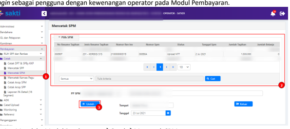

Petunjuk Teknis Aplikasi SAKTI
♦
SPM KOREKSI
�
�
�

## I. Informasi Umum A. Deskripsi Transaksi

Prosedur mengenai Koreksi Data Transaksi Keuangan telah diatur dalam Peraturan Direktur Jenderal Perbendaharaan nomor PER-16/PB/2014 tentang Tata Cara Koreksi Data Transaksi Keuangan pada Sistem Perbendaharaan dan Anggaran Negara. Satuan kerja yang hendak melakukan perubahan atau Koreksi/Ralat atas SPM yang telah diterbitkan SP2Dnya oleh KPPN wajib berpedoman pada peraturan tersebut. Koreksi Data adalah proses memperbaiki data transaksi tanpa mengubah data awal dan hasil koreksi membentuk history.

SPM 515 digunakan untuk mengkoreksi SPM yang telah menjadi SP2D

| Modul                  | PEM                                          |
|------------------------|----------------------------------------------|
| Role User              | OPR, VAL, APR                                |
| Modul Lain yang        | -                                            |
| Terkait Transaksi yang | -                                            |
| Tekait Dokumen Input   | Data Elektronik dari OMSPAN                  |
| Output                 | SPM Koreksi 515                              |
| Validasi               | SPM Koreksi tidak boleh mengubah nilai netto |

## B. Informasi Penting Lainnya

Beberapa hal yang perlu diperhatikan oleh satker (pengguna SAKTI):
1) Sesuai Peraturan Direktur Jenderal Perbendaharaan nomor PER-16/PB/2014 tanggal 11 Juni 2014 tentang Tata Cara Koreksi Data Transaksi Keuangan pada Sistem Perbendaharaan dan Anggaran Negara. Koreksi data transaksi pengeluaran dilakukan terhadap:
a. BAS, sepanjang tidak mengakibatkan perubahan jumlah uang dan sisa pagu anggaran pada DIPA menjadi minus; Semua segmen BAS dapat diubah kecuali segmen 1 dan segmen 2, yaitu kode satker dan kode kppn.

b. Pembebanan Rekening Khusus, dilakukan terhadap SP2D sebelum pembebanan pada rekening khusus berkenaan; c. Deskripsi/uraian pengeluaran 2) SPM yang bisa dikoreksi adalah SPM yang sudah menjadi SP2D dan sudah dilakukan pencatatan nomor SP2D.

3) **SPM Koreksi 515 memerlukan pencatatan tanggal SP2D koreksi** pada aplikasi SAKTI setelah KPPN selesai memproses SPM Koreksi, namun SP2D yang dicatat tidak berubah (masih menggunakan SP2D awal).

4) Jika koreksi dilakukan hanya pada level detail COA (15/16 Segmen), gunakan jenis SPP 516.

## I.  Alur Proses

A.   DIAGRAM ALUR PROSES

# Alur Proses Pembuatan Spm Koreksi (515)

## B.   Penjelasan Diagram Alur Proses

Pencatatan SPP Login sebagai pengguna dengan kewenangan operator pada Modul Pembayaran.

1.    Masuk ke Modul Pembayaran → RUH SPP → Catat/Ubah SPP
2.

Pilih Jenis SPP 515 - Koreksi Klik tombol Tambah 3.

4. Pilih SP2D yang akan dibuatkan koreksi. SPP yang belum memiliki nomor SP2D tidak akan muncul 

pada form tersebut.

5. Klik Pilih Setelah itu akan muncul halaman perekaman (Catat/Ubah) SPP. Isian yang bisa diubah adalah jenis isian yang diperbolehkan untuk dikoreksi sesuai dengan ketentuan yang berlaku. Silakan ubah sesuai dengan keperluan.

Perekaman Akun dan Pendetailan Segmen 15/16 COA

1. Pada bagian Distribusi COA, silakan klik "RUH Akun" untuk melakukan perubahan pada akun keluaran/potongan. Khusus akun keluaran, koreksi dilakukan sampai dengan detail COA (15/16 Segmen).

| Catat/Ubah SPP                   | Cutpul                                                      | SD                | Paga          | Sa Pagu   |
|----------------------------------|-------------------------------------------------------------|-------------------|---------------|-----------|
| 521111                           | 1.175.586.000                                               | 1.165.972.361     | 1.500.000     |           |
| = Struktur Coa                   |                                                             |                   |               |           |
| Satken                           |                                                             |                   |               |           |
| nenterian, Eselon I, Program     | WA - Program Dukungan Mana                                  |                   |               |           |
| Kegiatan, Output                 | 4719 - Pengelolaan Organisasi dan SDM                       | EAF - Layanan SDM | >             |           |
| Akun                             | 511129 - Belanja Uang Makan PNS                             |                   |               |           |
| KPPN                             |                                                             |                   |               |           |
| S.Dana, C.Penarikan, No.Register | A - RUPIAH MURNI                                            | 0 - RM            | 0000001       | >         |
| 000                              |                                                             |                   |               |           |
| si, Kab/Kota)                    | 01                                                          | 5                 |               |           |
| Tipe Anggara                     | 00000                                                       |                   |               |           |
| 00000                            | 511129.01508WA.4719EAF.A0000001.00000.2.0155.2.00000.000000 |                   |               |           |
| Kode Valas, Nilai Valas          | IDR                                                         | 0,00              |               |           |
| NIIah                            | o                                                           | o                 | R  DETAIL COA |           |
| Pagu                             | 707.940.000                                                 |                   |               |           |
| Sisa Pagu (FA)                   | 607.940.000                                                 |                   |               |           |
| t Pelan                          | i Han                                                       | 9 Keluar          |               |           |

## Pilih Akun Yang Akan Dilakukan Koreksi 2. Klik Tombol "Rekam/Ubah/Hapus" Sesuai Dengan Kebutuhan Koreksi M.

 Catat/Ubah SPP

|  1.5000                                    |                                        |                                                             |                 |         |
|--------------------------------------------|----------------------------------------|-------------------------------------------------------------|-----------------|---------|
| 2111                                       | 1,17%SE%D1                             | 1.165.972.361                                               | 9. Lihat Detail |         |
| -  Struktur Coa                            |                                        |                                                             |                 |         |
| Satken                                     | nterian, Eselon I, Program             | WA - Program Dukungan Manajemen                             |                 |         |
| Kegiatan, Output                           | >                                      |                                                             |                 |         |
| 4715 - Pengelolaan Keuangan, BMN, dan Umum | EAC - Layanan Umum                     | ,                                                           |                 |         |
| Akun                                       | 521111 - Belanja Keperluan Perkantoran |                                                             |                 |         |
| KPPN                                       | s                                      |                                                             |                 |         |
| S.Dana, C.Penarikan, No.Register           | A - RUPIAH MURNI                       | 0 - RM                                                      | 0000001         |         |
| Rek.Bank                                   | 000                                    |                                                             |                 |         |
| 2                                          |                                        |                                                             |                 |         |
| Lokasi (Propinsi, Kab/Kota)                | 01                                     |                                                             |                 |         |
| Tipe Anggar                                | 2                                      |                                                             |                 |         |
| IntraCo                                    | 00000                                  |                                                             |                 |         |
| Cadangan                                   | 0000                                   | 2.521111.01508WA.4715EAC.A0000001.0000.2.0155.2.00000.00000 |                 |         |
| Kode COA                                   |                                        |                                                             |                 |         |
| Kode Valas, Nilai Valas                    | IDR                                    | 0,00                                                        |                 |         |
| Nilai                                      | 1.500.000                              | 1.500.000                                                   | 9.  DETAIL COA  |         |
| Pagu                                       | 1.175.586.000                          |                                                             |                 |         |
| Sisa Pagu (FA)                             | 1.164.138.361                          |                                                             |                 |         |
| di Refer                                   | C Ubah                                 | B Simpan                                                    | O Rata          | 8 Kelum |

4. Jika melakukan "Rekam/Ubah", silakan melakukan pemilihan/penyesuaian struktur COA yang 

dibutuhkan.

5. Klik tombol "Detail COA" untuk mengisi/mengubah detail COA serta mengisi/mengubah nilai pada akun yang dipilih.

7. Klik tombol "Rekam/Ubah/Hapus" sesuai dengan kebutuhan. 8. Klik tombol 'Kaca Pembesar' untuk memilih detail COA.

9. Isikan nilai untuk detail yang dipilih. Nilai ini akan digunakan untuk mengisi nilai akun pada form sebelumnya.

10. Klik "Simpan" untuk menyimpan perubahan. 11. Silakan lakukan Langkah 6 - 10 untuk melakukan pengubahan/perekaman detail COA lainnya. 

Lalu klik "Keluar" untuk keluar dari form Pendetailan COA.

14. Klik "Keluar" untuk kembali ke halaman depan Catat/Ubah SPP lalu klik "Simpan" untuk menyimpan SPP Koreksi yang telah dibuat.

## Cetak Spp

Login sebagai pengguna dengan kewenangan operator pada Modul Pembayaran.

 Masuk ke Modul Pembayaran →	Cetak→	Mencetak SPP
1.

2.

 Pilih SPP yang ingin dicetak Pilih PPK
3.

Klik tombol "Unduh" untuk mencetak SPP.

4.

Terdapat 2 dokumen yang dihasilkan dari menu ini, 1) SPP Koreksi 2) Lampiran SPP Koreksi berupa matriks perubahan (semula - menjadi) atas koreksi SPP

| Nomor SPP                                                  | : 00090T                                 | Halaman :  1  dari  1   |            |
|------------------------------------------------------------|------------------------------------------|-------------------------|------------|
| 02-Juli-2021                                               |                                          |                         |            |
| No                                                         | Detail Coa                               | Nilai Awal              | Nilai Baru |
| Ro.Komp.Subkomp.Item - Uraian                              |                                          |                         |            |
| PENGELUARAN                                                |                                          |                         |            |
| .521111.01508WA.4715EAC.A0000001.0000.2.0155.2.00000.00000 |                                          |                         |            |
| 04.002.0A.00011-Keperluan Sehari-hari Perkantora           | 1.000.000,00                             | 1.000.000,00            |            |
| 1                                                          |                                          |                         |            |
| 2                                                          | 04.002.0A.000113-Kertas Berharga/Materai | 500.000,00              | 0,00       |
| 1.500.000,00                                               | 1.000.000,00                             |                         |            |
| 521114.01508WA.4715EAC.A0000001.0000.2.0155.2.00000.00000  |                                          |                         |            |
| 001.002.0B.000125-Pos/Pengepakan/Pengiriman/Pengangkutan   | 0,00                                     | 500.000,00              |            |
| 1                                                          | Jumlah                                   | 0,00                    | 500.000,00 |
| TOTAL PENGELUARAN                                          | 1.500.000,00                             | 1.500.000,00            |            |
| POTONGAN                                                   |                                          |                         |            |

1. Masuk ke Modul Pembayaran →Validasi→Validasi SPP.

2. Pilih SPP yang ingin divalidasi.

3. Klik tombol "Unduh Pra Cetak" untuk mencetak SPP yang akan divalidasi.

4. Klik tombol "Setuju".

5. Klik tombol "Batal" apabila ingin membatalkan validasi atas SPP yang sudah dilakukan proses validasi SPP.

## Buat Adk Spp

6. Setelah menerima kode OTP, silakan input pada kolom 'Input OTP'.

7. Klik tombol "Proses".
Login sebagai pengguna PPK selaku *validator* pada Modul Pembayaran.

Cetak SPM

Masuk ke Modul Pembayaran →Cetak→Mencetak SPM
1.

2.

Pilih SPM yang ingin dicetak Klik tombol "Unduh" untuk mencetak SPM.

3.

Terdapat 2 dokumen yang dihasilkan dari menu ini, 1) SPM Koreksi 2) Lampiran SPM Koreksi berupa matriks perubahan (semula - menjadi) atas koreksi SPM
[Kode : KOR515]

| Nomor SPM                                                   | : 00090A                                                 |              |              |
|-------------------------------------------------------------|----------------------------------------------------------|--------------|--------------|
| Tanggal                                                     | Halaman :  1  dari  1                                    |              |              |
| : 02-Juli-2021                                              | Detail Coa                                               |              |              |
| No                                                          | Nilai Awal                                               | Nilai Baru   |              |
| Ro.Komp.Subkomp.Item - Uraian                               |                                                          |              |              |
| PENGELUARAN                                                 |                                                          |              |              |
| 521111.01508WA.4715EAC.A0000001.00000.2.0155.2.00000.000000 |                                                          |              |              |
| 1                                                           | 04.002.0A.00011-Keperluan Sehari-hari Perkantoran        | 1.000.000,00 | 1.000.000,00 |
| 2                                                           | 04.002.0A.000113-Kertas Berharga/Materai                 | 500.000,00   | 0,00         |
| Jumlah                                                      | 1.500.000,00                                             | 1.000.000,00 |              |
| 521114.01508WA.4715EAC.A0000001.0000.2.0155.2.00000.00000   |                                                          |              |              |
| 1                                                           | 001.002.0B.000125-Pos/Pengepakan/Pengiriman/Pengangkutan | 0,00         | 500.000,00   |
| Jumlah                                                      | 0,00                                                     | 500.000,00   |              |
| TOTAL PENGELUARAN                                           | 1.500.000,00                                             | 1.500.000,00 |              |
| POTONGAN                                                    |                                                          |              |              |
| TOTAL POTONGAN                                              | 0,00                                                     | 0,00         |              |

## Upload Dokumen Pendukung

Login sebagai pengguna dengan kewenangan operator pada Modul Pembayaran.

1. Masuk ke Modul Pembayaran →Catat/Upload→Upload Dokumen Pendukung.

2. Pilih SPM yang akan diupload dokumen pendukungnya.

3. Pilih jenis dokumen pendukung. 4. Klik tombol "Choose" untuk memilih file yang akan diupload. 5. Klik tombol "Upload".

File yang akan diupload akan muncul.

Klik tombol "View" apabila ingin melihat file yang telah diupload.

## Setuju Spm

Login sebagai pengguna PPSPM selaku *approver* pada Modul Pembayaran.

2. Pilih SPM yang ingin divalidasi 3. Klik tombol "Unduh Pra Cetak" untuk mencetak SPM yang akan divalidasi

## Buat Adk Spm

Login sebagai pengguna PPSPM selaku *approver* pada Modul Pembayaran.

meminta kode OTP.

6. Setelah menerima kode OTP, silakan input pada kolom 'Input OTP'.

7. Klik tombol "Proses".

8.

Catat SP2D Koreksi

1. Masuk ke Modul Pembayaran → Catat/Upload → Mencatat Tanggal SP2D Koreksi 2. Pilih SPM Koreksi yang akan dicatat SP2D Koreksi 3. Klik tombol "Cari". 

Data SP2D akan tayang jika SPM Koreksi telah selesai diproses di KPPN.

Pilih data SP2D yang ada.
4.

5.

Klik tombol "Simpan".

6.    Pastikan Tanggal SP2D Koreksi sudah terisi
7.

Klik tombol "Simpan" untuk mengakhiri proses.

Setelah proses catat tanggal SP2D koreksi dilakukan, status SPM akan menjadi 'Upload SP2D'.