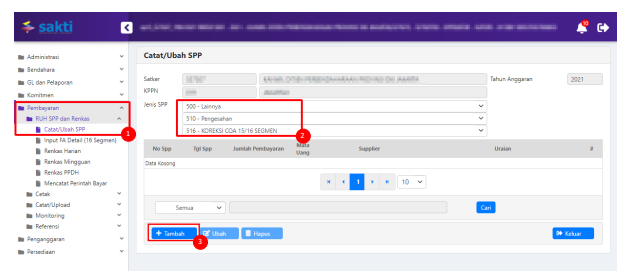
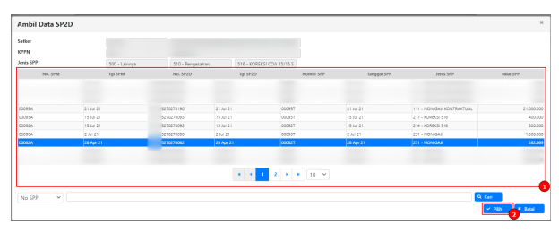
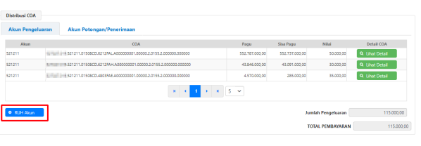
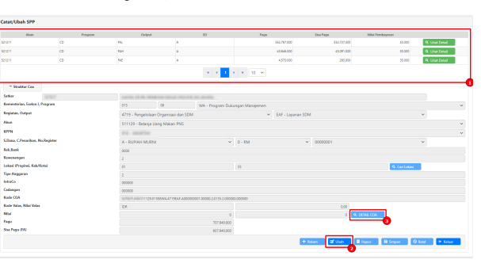
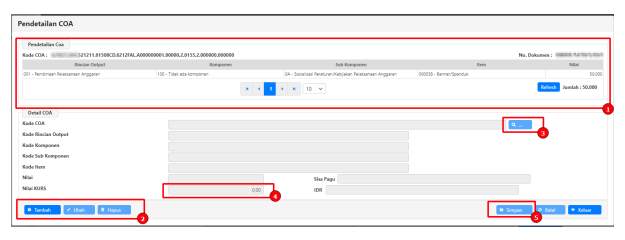
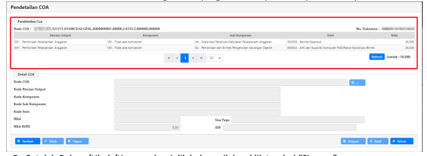
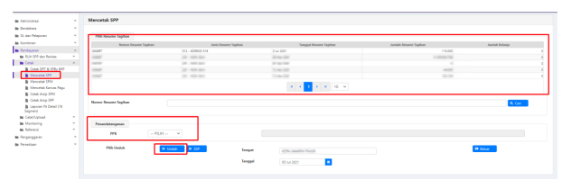
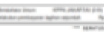
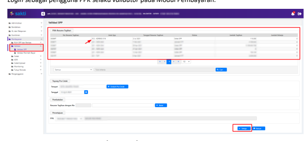

Petunjuk Teknis Aplikasi SAKTI
.

KOREKSI COA 15/16 SEGMEN
�
�
�

## I. Informasi Umum A. Deskripsi Transaksi

Jenis SPP:516-Koreksi COA 15/16 Segmen digunakan untuk koreksi SPM pada Detail COA level 13 s.d. 

16 Segmen (RO, Komponen, Sub Komponen, Item)

| Modul                  | PEM                                                                                                                            |
|------------------------|--------------------------------------------------------------------------------------------------------------------------------|
| Role User              | OPR, VAL                                                                                                                       |
| Modul Lain yang        | -                                                                                                                              |
| Terkait Transaksi yang | -                                                                                                                              |
| Tekait Dokumen Input   | Semua SPM yang memiliki Pagu dan COA Detail                                                                                    |
| Output                 | Koreksi COA 15/16 Segmen                                                                                                       |
| Validasi               | User harus memastikan data yang akan dikoreksi memiliki pagu (bukan akun 4  dan/atau 8 serta memiliki COA Detail 15/16 Segmen) |

Beberapa hal yang perlu diperhatikan oleh satker (pengguna SAKTI):
1) Koreksi COA 15/16 Segmen diperuntukkan untuk melakukan **koreksi COA** pada segmen RO, 
Komponen, Sub Komponen, dan Item (segmen 13-16).

2) Koreksi COA 15/16 Segmen hanya mengubah COA pada segmen 13 - 16, oleh karena itu **tidak** 
perlu disampaikan ke KPPN.

3) Untuk melakukan koreksi 12 Segmen, seperti Program, Kegiatan, KRO, dan Akun dapat menggunakan jenis SPP 515 - Koreksi dan disampaikan ke KPPN.

## Ii. Alur Proses

A. DIAGRAM ALUR PROSES

## B. Penjelasan Diagram Alur Proses

Pencatatan SPP
Login sebagai pengguna dengan kewenangan operator pada Modul Pembayaran.

1. Masuk ke Modul Pembayaran → RUH SPP → Catat/Ubah SPP
2. Pilih Jenis SPP 516 - Koreksi COA 15/16 Segmen 3. Klik tombol Tambah

 1. Pilih SP2D yang akan dibuatkan koreksi. SPP yang belum memiliki nomor SP2D tidak akan muncul pada form tersebut.

2. Klik Pilih Setelah itu akan muncul halaman perekaman (Catat/Ubah) SPP, namun hanya Distribusi COA yang bisa dilakukan ubah (untuk mengubah detail coa).

Klik RUH Akun untuk melakukan koreksi detail

## Perekaman Pendetailan Segmen 15/16 Coa

1.  Pilih akun yang hendak dilakukan pendetailan.

2.  Klik tombol 'Ubah' 3.  Klik tombol 'Detail COA'

2. Klik tombol "Tambah" untuk melakukan perekaman pendetailan atau klik "Ubah"/"Hapus" jika 

ingin mengubah atau menghapus.

Ubah detail hanya untuk mengubah nilai, jika ingin mengganti detail, silakan hapus terlebih dahulu lalu rekam ulang dengan detail yang baru.

3. Klik tombol 'kaca pembesar' untuk memilih detail segmen 15/16 dan pilih detail segmen yang akan digunakan, lalu klik tombol "OK"
4. Kolom nilai akan terisi sesuai dengan isian yang dilakukan pada tahap sebelumnya.

5. Setelah Rekam/Ubah/Hapus selesai dilakukan, silakan klik tombol "Simpan".

6. Klik Tombol "Keluar" untuk kembali ke halaman sebelumnya.

7. Klik tombol "Simpan" untuk menyimpan perekaman pendetailan segmen COA 15/16 atas akun tersebut.

8. Ulangi kembali langkah 1-7 untuk melakukan pengubahan detail yang lainnya (jika diperlukan).

9. Jika sudah selesai, klik tombol "Keluar" untuk melanjutkan perekaman SPP.

10. Klik tombol "Simpan" apabila perekaman SPP telah selesai

## 1) Cetak Spp

Login sebagai pengguna dengan kewenangan operator pada Modul Pembayaran.

1. Masuk ke Modul Pembayaran →Cetak→Mencetak SPP
2. Pilih SPP yang ingin dicetak 3. Pilih PPK
4. Pastikan Tempat dan Tanggal telah sesuai 5. Klik tombol "Unduh" untuk mencetak SPP.

SPP yang tercetak memiliki format tersendiri yang berbeda dengan SPP lainnya. SPP ini berisikan informasi umum terkait SPP Koreksi tersebut beserta matriks perubahan (semula - menjadi) atas detail COA yang dikoreksi.

[Kode : KOR516]
KOREKSI COA DETAIL 15/16SEG

Nomor SPP
:00089T
Tanggal

: 02-Juli-2021 Halaman :  1  dari  2

| Jenis Tagihan                                                | KOREKSI GUP                               |            |           |
|--------------------------------------------------------------|-------------------------------------------|------------|-----------|
| Jatuh Tempo                                                  | Segera                                    |            |           |
| Cara Bayar                                                   |                                           |            |           |
| Detail COA                                                   |                                           |            |           |
| No                                                           | Nilai Awal                                | Nilai Baru |           |
| Ro.Komp.Subkomp.Item - Uraian                                |                                           |            |           |
| PENGELUARAN                                                  |                                           |            |           |
| l.521211.01508CD.4803FAE.A0000001.00000.2.0155.2.00000.00000 |                                           |            |           |
| 01.100.0A.00001-ATK dan supplies Komputer                    | 35.000,00                                 | 35.000,00  |           |
| 1                                                            | Jumlah                                    | 35.000,00  | 35.000,00 |
| 00                                                           |                                           |            |           |
| 02.100.0C.00029-Konsumsi Peserta                             | 30.000,00                                 | 30.000,00  |           |
| 1                                                            | Jumlah                                    | 30.000,00  | 30.000,00 |
| 00                                                           |                                           |            |           |
| 01.100.0A.00038-Banner/Spanduk                               | 50.000,00                                 | 25.000,00  |           |
| 1                                                            | 01.100.0C.00043-ATK dan Supplies Komputer | 25.000,00  |           |
| 2                                                            | 0,00                                      |            |           |
| FGD/Rakor/Sosialisasi/Bimtek                                 |                                           |            |           |
| Jumlah                                                       | 50.000,00                                 |            |           |
| 50.000,00                                                    |                                           |            |           |
| TOTAL PENGELUARAN                                            | 15.000,00                                 | 15.000,00  |           |
| POTONGAN                                                     |                                           |            |           |
| | Jumlah                                                     | 0,00                                      | 0,00       |           |

## 2) Setuju Spp

Login sebagai pengguna PPK selaku *validator* pada Modul Pembayaran.

1. Masuk ke Modul Pembayaran →Validasi→Validasi SPP.

2. Pilih SPP yang ingin divalidasi.

3. Klik tombol "Unduh Pra Cetak" untuk mencetak SPP yang akan divalidasi.

4. Klik tombol "Setuju".

5. Pada tahap ini, status SPP akan menjadi "Catat SP2D" dan proses koreksi detail COA telah selesai dilakukan.