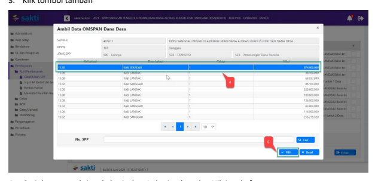
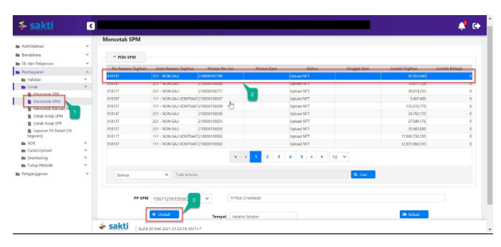

Petunjuk Teknis Aplikasi SAKTI)
→
♦
PEREKAMAN SPM
PEMOTONGAN & 
PENYALURAN DANA DESA
KEMENTERIAN KEUANGAN RI
DITJEN PERBENDAHARAAN
→

## I. Informasi Umum A. Deskripsi Transaksi

SPM 523 - Pemotongan Dana Transfer dan SPM 524 - Penyaluran Dana Transfer digunakan untuk membayar tagihan yang terkait penyaluran Dana Desa.

| Modul                  | PEM                                                                      |                                                                                                            |
|------------------------|--------------------------------------------------------------------------|------------------------------------------------------------------------------------------------------------|
| Role User              | OPR, VAL, APR                                                            |                                                                                                            |
| Modul Lain             | KOM                                                                      |                                                                                                            |
| terkait Transaksi yang | KOM - Import supplier tipe 6                                             |                                                                                                            |
| Tekait Dokumen Input   | Data Elektronik pada aplikasi OMSPAN                                     |                                                                                                            |
| Output                 | -                                                                        | SPM 523 - Pemotongan Dana Transfer                                                                         |
| -                      | SPM 524 - Penyaluran Dana Transfer                                       |                                                                                                            |
| Validasi               | -                                                                        | SPM 523 tidak dapat diubah atau dihapus apabila terdapat SPM 524 yang  masih melekat pada SPM 523 tersebut |
| -                      | Pembuatan adk SPM Jenis SPM 523 dan 524 dimaksud harus secara  bersamaan |                                                                                                            |

## B. Informasi Penting Lainnya

Beberapa hal yang perlu diperhatikan oleh KPPN selaku KPA penyalur **(pengguna SAKTI):**
1. Penyaluran Dana Desa menggunakan data supplier yang telah terekam di SPAN dan SAKTI.

2. Data supplier untuk keperluan penyaluran Dana Desa terdiri dari:
a. Supplier Pemda adalah supplier tipe 5 yang telah ada pada aplikasi SAKTI dengan nama supplier Header "Transfer Dana Desa".

b. Supplier Desa adalah supplier tipe 6 yang dimport dari data OMSPAN dengan nama supplier Header "Penyaluran Dana Desa".

3. Perubahan supplier dilaksanakan oleh KPPN selaku KPA Penyalur. 4. NPWP Header Penyaluran Dana Desa disamakan dengan NPWP supplier Transfer Dana Desa.

5. Jenis SPP 523 - Pemotongan Dana Transfer, menggambil data interkoneksi dari aplikasi OMSPAN. 6. Jenis SPP 523 - Pemotongan Dana Transfer, menggunakan supplier tipe 5 dengan sisi pengeluaran menggunakan akun 662111 dan sisi potongan menggunakan akun 817717.

7. Jenis SPP 524 - Penyaluran Dana Transfer, menggunakan tipe supplier 6 dengan sisi pengeluaran menggunakan akun 827717 tanpa adanya potongan.

8. SPM 524 dibuat setelah SPM 523 diinputkan, SPM 523 tidak dapat diubah atau dihapus apabila terdapat SPM 524 yang masih melekat pada SPM 523 tersebut.

9. SPM 523 dan 524 dibuat per Pemda sesuai dengan permohonan penyaluran pada OMSPAN. 10. SPM 523 dan 524 diajukan secara bersamaan oleh PPSPM pada saat membuat adk SPM ke KPPN 
( inject pin ppspm).

11. Untuk SPM 524 yang mempunyai perencanaan Kas maka tanggal jatuh tempo adk SPM (pmrt) 523 akan diupdate sesuai tanggal jatuh tempo SPM 524, walaupun cetakan pada SPM 523 tanggal jatuh tempo segera.

12. SPM 523 dan 524 dapat diajukan sebelum jatuh tempo perencanaan kas. 13. Apabila SPM 523 dan 524 salah satu SPMnya ditolak oleh KPPN maka kedua SPM tersebut harus ditolak.

14. Terkait renkas harian, SPM pemotongan dan Penyaluran Dana Desa berpedoman pada Peraturan Menteri Keuangan Republik Indonesia Nomor 197/PMK.05/2017 tentang Rencana Penarikan Dana, Rencana Penerimaan Dana dan Perencanaan Kas, dengan memperhatikan hal-hal sebagai berikut: a. Rekam renkas harian Apabila ingin merubah tanggal jatuh tempo renkas harian, silahkan ajukan surat dispensasi perubahan tanggal jatuh tempo ke KPPN, setelah KPPN merubah tanggal jatuh tempo renkas harian, silahkan satker merekam SPP dengan memilih renkas harian yang jatuh temponya telah diupdate oleh KPPN.

b. Renkas otomatis Apabila ingin merubah tanggal jatuh tempo renkas harian, silahkan ajukan surat dispensasi perubahan tanggal jatuh tempo ke KPPN, setelah KPPN merubah tanggal jatuh tempo renkas harian, silahkan seksi bank menyesuaikan tanggal PPR sesuai dengan tanggal renkas harian yang jatuh temponya telah diupdate oleh KPPN.

## 1. Alur Proses

DIAGRAM ALUR PROSES

## A. Penjelasan Diagram Alur Proses

 1) Input Supplier

Input Supplier mengacu pada Petunjuk Teknis KOM-00... tentang Input Supplier.

## 2) Pengajuan Tagihan

Pengajuan tagihan dari OM-SPAN silahkan lihat petunjuk teknis pengajuan Dana Desa pada user manual OM-SPAN
3) Input Jenis SPP 523 Pemotongan Dana Transfer

1. Masuk ke Modul Pembayaran  RUH Pembayaran  Catat/Ubah SPP
2. Pilih Jenis SPP 523 - Pemotongan Dana Transfer 3. Klik tombol tambah

5. Klik tombol Pilih

1. Pilih Dasar Pembayaran

2. Uraian pembayaran akan terisi secara otomatis 3. Klik Tombol "Supplier Header" untuk memilih supplier header 4. Klik Tombol "Tambah" untuk memilih supplier 5. Distribusi COA akan terisi secara otomatis (Klik "Lihat Detail" untuk melihat detail COA)
6. Klik Tombol "Simpan"

## 4) Input Jenis Spp 524 Penyaluran Dana Transfer

Login menggunakan user operator SPP/SPM

1. Masuk ke Modul Pembayaran  RUH Pembayaran  Catat/Ubah SPP
2. Pilih Jenis SPP 524 - Penyaluran Dana Transfer 3. Klik tombol tambah

2. Silahkan memilih RPD yang telah saudara buat sebelumnya, apabila nilai SPM melebihi 1 M (sesuai dengan Peraturan Menteri Keuangan Nomor 197/PMK.05/2017 tentang Rencana Penarikan Dana, Rencana Penerimaan Dana, dan Perencanaan Kas) dan silahkan dilewati saja (tidak perlu pilih RPD) 
apabila nilai SPM kurang dari 1 M
3. Uraian pembayaran akan terisi secara otomatis 4. Informasi Supplier akan terisi secara otomatis 5. Distribusi COA akan terisi secara otomatis (Klik "Lihat Detail" untuk melihat detail COA)
6. Klik Tombol "Simpan"

## 5) Cetak Spp

Login menggunakan user operator pembayaran

1. Masuk ke Modul Pembayaran CetakMencetak SPP
2. Pilih SPP yang ingin dicetak 3. Pilih Penandatangan PPK 4. Klik tombol "Unduh"

## 6) Setuju Spp

Login menggunakan user PPK
1. Masuk ke Modul Pembayaran ValidasiValidasi SPP

2. Pilih SPP yang ingin divalidasi 3. Klik tombol "Unduh Pra Cetak" untuk mencetak SPP yang akan divalidasi 4. Klik tombol "Setuju"

## 7) Create Adk Spp

Login menggunakan user PPK

1. Masuk ke Modul Pembayaran ADKADK SPP OTP
2. Pilih SPP yang ingin dibuat ADK SPP (wajib memilih jenis SPP 523 & 524 secara berpasangan, tidak bisa membuat ADK SPP hanya untuk salah satu jenis SPP)
3. Klik tombol "Proses"

Klik tombol "Req OTP via SMS"
4.

5.   Input OTP pejabat PPK
6.   Klik tombol "Proses"

## 8)   Cetak Spm

Login menggunakan user operator pembayaran

5.    Masuk ke Modul Pembayaran →	Cetak→	Mencetak SPM
6.   Pilih SPM yang ingin dicetak 7.   Klik tombol "Unduh"

|  KEMENTERIAN KEUANGAN REPUBLIK INDONESIA                             |                                                            |                                     |                                       |
|----------------------------------------------------------------------|------------------------------------------------------------|-------------------------------------|---------------------------------------|
| DIREKTORAT JENDERAL BEA DAN CUKAI                                    |                                                            |                                     |                                       |
| KANTOR PENGAWASAN DAN PELAYANAN BC JAKARTA                           |                                                            |                                     |                                       |
| SURAT PERINTAH MEMBAYAR KEMBALI PUNGUTAN EKSPOR (SPMKPE)             |                                                            |                                     |                                       |
| Nomor 00032A                                                         | Tanggal   03-Sep-2020                                      | Halaman    1                        | dari 1                                |
| MEMERINTAHKAN KEPADA                                                 |                                                            |                                     |                                       |
| KPPN   JAKARTAII (019)                                               |                                                            |                                     |                                       |
| Untuk membayar                                                       | PUNGUTAN EKSPOR (SPMKPE) Pada akun penge                   | ialian pendapatan bea kelu          |                                       |
| 412211 Pendapatan Bea Keluar                                         | Tahun 2020                                                 |                                     |                                       |
| Sejumlah  Rp 15.000.000,00                                           | '''''' Lima BELAS Juta Rupiah '''''                        |                                     |                                       |
| Tahun Anggara                                                        | : 2020                                                     | Jenis Tagihan    :  SPMKBE / SPMKBK |                                       |
| Nomor SKPPE                                                          | : 001/411611/2020                                          | Jatuh Tempo                         | : Segera                              |
| Tanggal SKPPE                                                        | : 10-08-2020                                               | Cara Bayar                          | : SP2D                                |
| PENGELUARAN                                                          | JUMLAH UANG                                                |                                     |                                       |
| 411611.019.412211.0150500.000000.0000000.0000.2.0151.7.00000.        | 15.000.000.00                                              |                                     |                                       |
| Jamlah Pengelaaran                                                   | 15.000.000,00                                              |                                     |                                       |
| TOTAL PEMBAYARAN                                                     | 15.000.000,00                                              |                                     |                                       |
| Kapada:                                                              |                                                            |                                     |                                       |
| Nomor Suppler                                                        | : 484160                                                   | Bara                                | :  BANK HSBC INDONESIA,  PT Bank HSBC |
| Nama Suppler                                                         | :  PT EXCLUSIVE NETWORKS INDONESIA                         | Rekering                            | 01565674001                           |
| Aamat                                                                | :  Menara Anugrah Lantai 18 Jl. Mega Kuningan Lot. 8.6-8.7 | Nema Pemilik Rek                    | PT EXCLUSIVE NETWORKS INDONESIA       |
| NPWP                                                                 |                                                            |                                     |                                       |
| Semua bukti-bukti pengeluaran yang disahkan Pejabat Pembuat Komitmen | KOTA JAKARTA PUSAT, 3 September                            |                                     |                                       |
| telah diuji dan dinyatakan memenuhi persyaratan untuk dilakukan      | a.n Menteri Keuangan Republik Indonesia                    |                                     |                                       |
| atas beban APBN, selanjutnya bukti-bukti pengeluaran dimaksud dis    | Kepala KANTOR PENGAWASAN DAN                               |                                     |                                       |
| ditatausahakan oleh Pejabat Penandatangan SPM                        | PELAYANAN BC JAKARTA                                       |                                     |                                       |
| Kebenaran perhitungan dan isi yang tertuang dalam SPM ini menjadi    | CHAIRUL SALEH                                              |                                     |                                       |
| NIP 196401271986011001                                               |                                                            |                                     |                                       |
| tanggung jawab Pejabat Penandatangan SPM                             |                                                            |                                     |                                       |

## 9)   Upload Dokumen Pendukung

Login menggunakan user operator pembayaran 1. Masuk ke Modul Pembayaran Catat/UploadUpload Dokumen Pendukung

2. Pilih SPM yang ingin diupload dokumen pendukungnya 3. Pilih jenis dokumen pendukung 4. Klik tombol "Pilih" untuk memilih file yang akan diupload

5. Klik tombol "Upload"
6. File yang akan diupload akan muncul 7. Klik tombol "View" apabila ingin melihat file yang telah diupload 8. Klik tombol ""Hapus" apabila ingin menghapus file yang telah diupload sebelumnya

1.    Masuk ke Modul Pembayaran →Validasi→Validasi SPM
2.

 Pilih SPM yang ingin divalidasi 3.   Klik tombol "Unduh Pra Cetak" untuk mencetak SPM yang akan divalidasi

| KEMENTERIAN KEUANGAN REPUBLIK INDONESIA                      |                                       |                                 |                   |
|--------------------------------------------------------------|---------------------------------------|---------------------------------|-------------------|
| DIREKTORAT JENDERAL BEA DAN CUKAI                            |                                       |                                 |                   |
| KANTOR PENGAWASAN DAN PELAYANAN BC JAKARTA                   |                                       |                                 |                   |
| Nomor 00032A                                                 | ngal    03-Sep-2                      |                                 |                   |
| EMERINTAHKAN KEPA                                            |                                       |                                 |                   |
| JAKARTA!! (019                                               |                                       |                                 |                   |
| 412211 Pendapatan                                            |                                       |                                 |                   |
| Rp 15.000.000.00                                             |                                       |                                 |                   |
| Tahun Anggara                                                | 2020                                  | s Tagihan                       | : SPMKBE / SPMKBK |
| 01/411611/2020                                               |                                       |                                 |                   |
| cal SKPPP                                                    | : 10-08-2020                          | SP20                            |                   |
| PENGELLIARAN                                                 | JUMLAH UANG                           | 15.000.000.00                   |                   |
| 411611.019.412211.0150500.000000.0000000.00000.2.0151.7.0000 | 15.000.000,00                         |                                 |                   |
| 15.000.000,00                                                |                                       |                                 |                   |
| Nomor Supplie                                                |                                       |                                 |                   |
| Nama Supréer                                                 | PT EXCLUSIVE NETW                     |                                 |                   |
| Armal                                                        | i bukti-bukti pengeluaran yang disahk | KOTA JAKARTA PUSAT. 3 September |                   |
| n dinyatakan me                                              | n Menteri Keuangan Republik Indone    |                                 |                   |
| iepala KANTOR PENGAWASAN DAN                                 |                                       |                                 |                   |
| PELAYANAN BC JAKARTA                                         |                                       |                                 |                   |
| TAIRUI, SALEH                                                |                                       |                                 |                   |
| NIP 196401271985011001                                       |                                       |                                 |                   |

4.   Klik tombol "Setuju" 5.    Klik tombol "Batal" apabila ingin membatalkan validasi atas SPM yang sudah divalidasi 6.   Klik tombol "Batal Dokumen Pendukung" apabila ingin membatalkan dokumen pendukung yang sudah diupload

## 1) Create Adk Spm

Login menggunakan user PPSPM

## 1. Masuk Ke Modul Pembayaran Adkadk Spm Otp

2. Pilih SPM yang ingin dibuat ADK SPM (wajib memilih jenis SPM 523 & 524 secara berpasangan, tidak bisa membuat ADK SPM hanya untuk salah satu jenis SPM)
3. Klik tombol "Proses ADK SPM"

4. Klik tombol "Req OTP via SMS"
5. Input OTP pejabat PPSPM
6. Klik tombol "Proses"

## 12) Proses Kppn

Proses di KPPN Mengacu pada Standar Operasional Prosedur Pemrosesan SPM menjadi SP2D pada KPPN.

## 13) Catat Sp2D

Login menggunakan user operator pembayaran

1.    Masuk ke Modul Pembayaran →	Catat/Upload → Catat/Upload SP2D
2.    Pilih SPM yang ingin dicatat No. SP2D
Klik tombol "Catat SP2D Otomatis".

3.