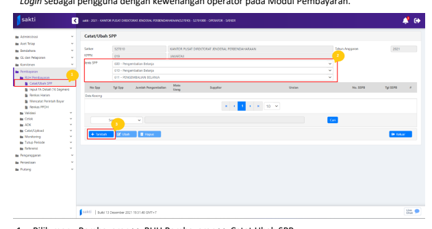
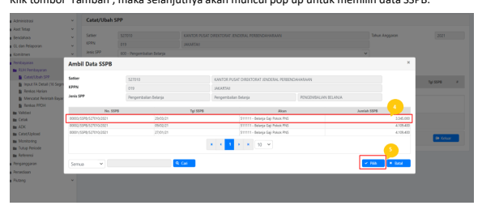
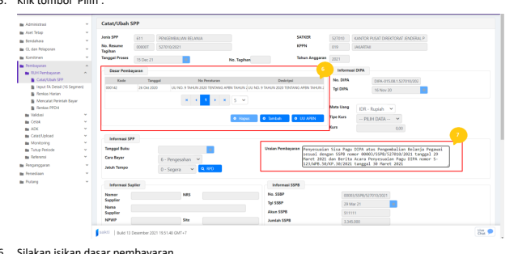
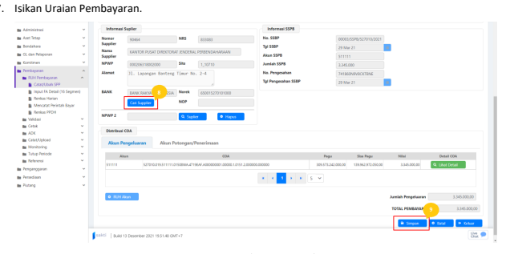
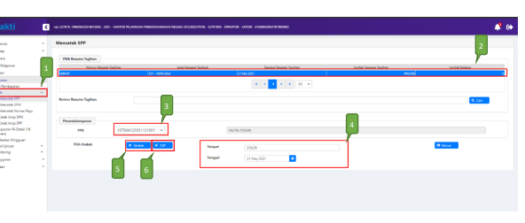
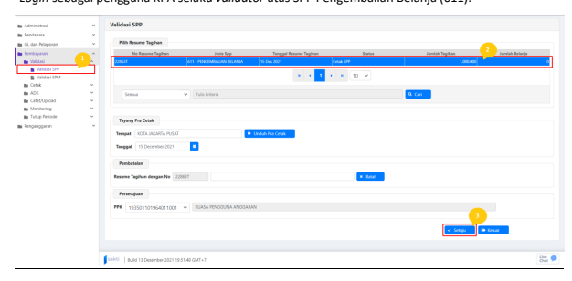

�
�

Petunjuk Teknis Aplikasi SAKTI)
�
♦ PEREKAMAN SPP
PENGEMBALIAN BELANJA
�
�

## I. Informasi Umum A. Deskripsi Transaksi

SPP Pengembalian Belanja (611) digunakan untuk menyesuaikan pagu atas pengembalian belanja tahun anggaran berjalan yang telah disetorkan ke Kas Negara dan telah menerima Berita Acara Penyesuaian Pagu dari KPPN. Proses ini dilakukan apabila penyesuaian pagu di KPPN telah selesai.

| Modul                  | PEM                                                                                                                                                                                                 |
|------------------------|-----------------------------------------------------------------------------------------------------------------------------------------------------------------------------------------------------|
| Role User              | OPR, KPA                                                                                                                                                                                            |
| Modul Lain yang        | BEN                                                                                                                                                                                                 |
| Terkait Transaksi yang | BEN - Setoran Pengembalian Belanja                                                                                                                                                                  |
| Tekait Dokumen Input   | SPP Pengembalian Belanja                                                                                                                                                                            |
| Output                 | Pemulihan Pagu                                                                                                                                                                                      |
| Validasi               | Satker telah melakukan input SSPB pada aplikasi SAKTI modul Bendahara, serta  telah mengajukan permohonan penyesuaian pagu ke KPPN, dan telah  mendapatkan Berita Acara Penyesuaian Pagu dari KPPN. |

## Ii. Alur Proses

A. DIAGRAM ALUR PROSES

## B. Penjelasan Diagram Alur Proses

1) **Pengembalian Belanja dan Perekaman SSPB:**
Bendahara/Satker melakukan penyetoran atas pengembalian belanja. Selanjutnya Operator SAKTI modul Bendahara/Bendahara, melakukan perekaman pada aplikasi SAKTI untuk setoran pengembalian belanja yang telah dilakukan sebelumnya. Proses lebih lanjut atas transaksi ini dapat mengacu pada petunjuk teknis mengenai setoran pengembalian belanja.

## 2) Permohonan Pengembalian Belanja

KPA mengajukan permohonan pemulihan pagu ke KPPN. Proses ini dilakukan sesuai dengan ketentuan yang berlaku terkait dengan penyesuaian sisa pagu atas setoran pengembalian belanja.

3) **Proses KPPN**
KPPN akan melakukan verifikasi atas permohonan pemulihan/penyesuaian sisa pagu DIPA 
dari Satuan Kerja. Apabila permohonan diterima lengkap dan sesuai, KPPN akan melakukan penyesuaian sisa pagu DIPA dan menyampaikan pemberitahuan kepada satuan kerja dengan menyampaikan Berita Acara penyesuaian sisa pagu DIPA.

## 4) Pencatatan Spp:

Login sebagai pengguna dengan kewenangan operator pada Modul Pembayaran.

1. Pilih menu Pembayaran >> RUH Pembayaran >> Catat Ubah SPP. 2. Pilih Jenis SPP 611 - Pengembalian Belanja 3. Klik tombol 'Tambah', maka selanjutnya akan muncul pop up untuk memilih data SSPB.

4. Silakan pilih data SSPB yang akan digunakan. 5. Klik tombol 'Pilih'.

6. Silakan isikan dasar pembayaran.

8. Silakan isikan supplier tipe 1, dengan klik tombol 'Cari Supplier' 9. Setelah dipastikan data telah terisi dengan benar dan lengkap, klik tombol 'Simpan'.

## 5) Cetak Spp

Login sebagai pengguna dengan kewenangan operator pada Modul Pembayaran.

1. Masuk ke Modul Pembayaran >> Cetak >> Mencetak SPP
2. Pilih SPP yang ingin dicetak 3. Pilih PPK
4. Pastikan Tempat dan Tanggal telah sesuai 5. Klik tombol "Unduh" untuk mencetak SPP.

6. Klik tombol "SSP" apabila ingin mencetak SSP

## 6) Setuju Spp

Login sebagai pengguna KPA selaku *validator* atas SPP Pengembalian Belanja (611).

1. Masuk ke Modul Pembayaran >> Validasi >> Validasi SPP
2. Pilih SPP yang ingin divalidasi 3. Klik tombol "Setuju" untuk menyetujui SPP.

Setelah disetujui oleh KPA, maka proses perekaman SPP pengembalian belanja telah selesai dan pagu pada Aplikasi SAKTI telah dilakukan penyesuaian.