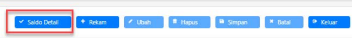

→
Petunjuk Teknis Aplikasi SAKTI)
d
�
�
SIKLUS TRANSAKSI UP BPP
�

DESKRIPSI SINGKAT 

Siklus Transaksi UP 

BPP Pentunjuk Teknis ini digunakan sebagai panduan untuk **merekam** 

UPBPP

| BPP Pentunjuk Teknis ini digunakan sebagai panduan untuk merekam  UPBPP No. 1 Modul BEN Role User OPR Modul Lain yang  KOM, PEM Terkait Transaksi yang  Mencatat Uang Muka, Mencatat Perintah Bayar, Membuat Kuitansi, Mencatat  Tekait DRPP, Pungutan/Setoran Pajak, Cetak LPJ Bendahara Pengeluaran PEM - Perekaman Renkas,  RUH SPP GUP   |
|----------------------------------------------------------------------------------------------------------------------------------------------------------------------------------------------------------------------------------------------------------------------------------------------------------------------------------------------|

## Pendahuluan

Petunjuk teknis ini digunakan untuk perekaman siklus transaksi UP BPP yang sebelumnya masih menggunakan konsep Uang Muka. Konsep baru ini merupakan penyempurnaan mekanisme penyaluran alokasi UP BPP yang berjalan sebelumnya. Sebelumnya pada Aplikasi SAKTI, perekaman UPBPP menggunakan konsep Uang Muka. Sehingga setiap kali akan melakukan *revolving*, BPP harus menyetor sisa Uang Muka yang dikelolanya ke Bendahara Pengeluaran. Dengan konsep baru ini BPP 
tidak perlu lagi mengembalikan sisa dana UP yang dikelolanya untuk mengajukan *revolving* ke Bendahara Pengeluaran. 

# Petunjuk Teknis Perekaman Upbpp

A. *Langkah Awal Memulai Aplikasi Bendahara Pengeluaran Pembantu* Sebelum memulai menggunakan Aplikasi Bendahara Pengeluaran Pembantu, pastikan Kode Unit Teknis sudah dibuat oleh user administrator. Berikut adalah tampilan perekaman Kode Unit Teknis: 

Langkah-langkah perekaman kode Unit Teknis adalah sebagai berikut: 
1. Pilih modul Administrasi  Bendahara  Unit Teknis 2. Klik <Rekam> 
3. Pilih Jenis Unit Teknis BPP 
4. Lengkapi isian Kode Unit Teknis, Nama Satker, dan Deskripsi Unit Teknis 5. Klik <Simpan> 
Setelah unit teknis dibuat, user administrator dapat mengajukan pembuatan user operator Bendahara Pengeluaran Pembantu ke https://hai. kemenkeu.go.id/
Langkah selanjutnya adalah penetapan kode unit teknis user BPP pada user administrator menu 

adminpengelolaan pengguna dan control aksespengelolaan pengguna (SATKER) :
Setelah user operator BPP ditetapkan kode unit teknisnya, selanjutnya adalah merekam referensi 

bendaharawan. Langkah-langkah perekaman referensi Bendaharawan adalah sebagai berikut: 

1. Pilih modul Administrasi  Bendahara  Bendaharawan
2. Klik <Rekam> 3. Lengkapi isian Pangkat NIP, NIP, Tampil Cetak NIP, Nama, Jabatan, dan NPWP. 4. Klik <Simpan> 

## B. Merekam Alokasi Up Bpp

Sebelum memulai transaksi menggunakan uang persediaan pada BPP, pastikan user **Bendahara**
telah melakukan perekaman Uang Muka kepada BPP dengan menggunakan Kode Unit Teknis yang telah dibuat oleh administrator lokal. 

field : 
- No DIPA : diisi dengan No DIPA untuk satker yang login. - Tgl DIPA : terisi ketika No DIPA dipilih oleh pengguna, menampilkan tanggal DIPA untuk revisi DIPA terakhir. 

- No Uang Muka : di-*generate* secara otomatis oleh sistem ketika data disimpan ke database, memiliki format "00001/UPBPP/411724/2019", dimana: 
 00001 = No Urut UPBPP = ID Form 411724 = Kode Satker 2019 = Tahun Anggaran Untuk setiap Kode unit teknis BPP akan memiliki satu nomor Uang Muka yang bisa di-*revolving*
- Tanggal Uang Muka : tanggal dibuatnya data Uang Muka, secara default terisi tanggal system 
- Tanggal Jatuh Tempo : tanggal jatuh tempo penggunaan Uang Muka, secara default terisi tanggal sistem. 

- Jangka Waktu : jumlah hari berlakunya Uang Muka, didapat dari (Tanggal Jatuh Tempo -
Tanggal Uang Muka) + 1 
- Jenis Uang Muka : jenis dari Uang Muka (UP/TUP/LS/UPKP) 
- Sumber Dana :akan menentukan Program, Kegiatan, Output, dan Akun DIPA yang boleh digunakan untuk Uang Muka. 

- Program, Kegiatan, Output : diambil dari DIPA berdasarkan No DIPA dan Sumber Dana. 

- Jumlah Yang Diminta :akumulasiJumlah untuk semua akun dalam grid tabel Detail Akun. 

- Keterangan : keterangan dari Uang Muka. 

- Cara Pembayaran : cara dibayarkannya Uang Muka, berupa tunai (cash) atau non tunai 
(melalui bank). 

- Rekening Bank : Rekening Bank yang digunakan Bendahara Pengeluaran untuk menampung UP
- Unit Teknis :Unit Teknis yang akan menerima Uang Muka. **Sebagai catatan, Bendahara** 
Pengeluaran Pembantu (BPP) harus tercatat sebagai BPP di data Unit Teknis. Perekaman data Unit Teknis dilakukan di Modul Administrasi dengan menu >> Administrasi >> Bendahara >> Unit Teknis.

- NIP : NIP dari Unit Teknis. 

- Nama : Nama dari Unit Teknis. 

- Jabatan : Jabatan dari Unit Teknis. 

- Alamat : Alamat dari Unit Teknis. 

- No Telpon : No Telpon dari Unit Teknis. 

- No HP : No HP dari Unit Teknis. 

Langkah-langkah Perekaman Alokasi UP ke BPP adalah:

1. Memilih menu Bendahara>>Transaksi>>Merekam Uang Muka **dan Alokasi BPP BARU** 2. Klik <Rekam> 3. Lengkapi isian Tanggal Uang Muka, Tanggal Jatuh Tempo, Jenis Uang Muka, Sumber Dana, Jumlah UPBPP yang diminta, Keterangan.

4. Kemudian pilih cara pembayaran UPBPP, apabila dilakukan secara Non Tunai maka pilih Rekening Bendahara Pengeluaran yang digunakan.

5. Pilih Kode Unit Teknis BPP dan lengkapi NIP, Nama, Jabatan, Alamat, No Telepon, No HP
6. Klik <Simpan>
C. Mencatat Pemindahan Kas Bendahara Pegeluaran Pembantu 

Form ini digunakan untuk mencatat transaksi kas Bendahara Pengeluaran Pembantu, baik kas tunai maupun kas bank, termasuk diantaranya penarikan dari/penyetoran ke bank, penerimaan jasa/giro, dan pengembalian sisa uang muka BPP.

Langkah awal yang dilakukan adalah memilih menu **Pemindahan Kas >> Kas Bank Bendahara** Pengeluaran atau menu **Pemindahan Kas >> Kas Tunai Bendahara Pengeluaran**:
D. Pemindahan Kas Bank Bendahara Pengeluaran Pembantu 

Berikut adalah form dari Mencatat Pemindahan Kas Bank Bendahara Pengeluaran Pembantu: 

Penjelasan field : 
- Tanggal : tanggal transaksi kas. 

- Jenis Aktifitas : jenis aktifitas dari transaksi kas. 

- Terima SP2D, yaitu dana yang masuk ke kas bank yang berasal dari transaksi SP2D dari Modul Pembayaran. Namun menu ini dinonaktifkan untuk user BPP
- Terima Transfer Masuk, yaitu dana yang masuk ke kas bank yang bukan berasal dari transaksi SP2D (Contoh: Dana Kas masuk dari Bendahara ke BPP). 

- Transfer Keluar, yaitu dana yang keluar dari kas bank BPP (Contoh: Dana Kas dari BPP ke Bendahara). 

- Kategori Kas : kategori dari kas yang dikelola oleh Bendahara Pengeluaran Pembantu, terdiri dari UP, TUP, UPKP, LS, Lainnya (Dropping). 

- No SP2D : SP2D yang didapat dari Modul Pembayaran. Pencarian No SP2D akan menampilkan Jenis SP2D dan Jumlah SP2D. 

- Jenis SP2D : jenis dari SP2D yang akan dicatat. 

- Jumlah : jumlah dari SP2D atau jumlah transaksi kas. 

- No Uang Muka : referensi No Uang Muka, yang digunakan untuk pengembalian sisa Uang Muka. Untuk setiap Kode uint teknis BPP akan memiliki satu nomor Uang Muka yang bisa di-*revolving*
- Sumber Dana : sumber dana dari transaksi kas. 

- Keterangan : keterangan dari transaksi kas. 

Berikut ini merupakan langkah-langkah untuk melakukan transaksi kas bank : 

1. Klik tombol <Tambah>, Tanggal terisi tanggal sistem. 

2. Pilih Jenis Aktifitas: 
1) Terima Transfer Masuk (UM/Dropping) 
a) Pilih Kategori Kas, yang bisa dipilih adalah UP, TUP, LS, UPKP, Lainnya (Dropping). 

b) Isi Jumlah, akan terisi otomatis jika kategori kasnya adalah UP atau TUP dan telah dipilih No. Uang Muka. 

c) Jika akan melakukan pengembalian uang muka, pilih No Uang Muka. Jika tidak, 

hanya isi Jumlah. 

2) TransferKeluar a) Pilih Kategori Kas, hanya tersedia pilihan Lainnya (Dropping) b) Isi Jumlah. 

Isi Keterangan. 

3. Klik tombol <Simpan>untuk menyimpan data. Atau klik button <Batal> untuk membatalkan transaksi kas. 

E. Pemindahan Kas Tunai Bendahara Pengeluaran Pembantu Berikut adalah form dari Mencatat Pemindahan Kas Tunai Bendahara Pengeluaran Pembantu: 

Penjelasan field : 
- Tanggal : tanggal transaksi kas. 

- Jenis Aktifitas : jenis aktifitas dari transaksi kas. 

- Penyetoran ke bank, yaitu pemindahan kas dari tunai ke bank. - Penarikan dari Bank, yaitupemindahan kas dari bank ke tunai. 

- Kas Tunai Masuk, yaitu dana yang masuk ke kas tunaiyang berasal dari pengembalian uang muka atau dana dropping. 

- Kas Tunai Keluar Keluar, yaitu dana yang keluar dari kas tunai untuk penyerahan dana dropping ke yang berhak. 

- Kategori Kas : kategori dari kas yang dikelola oleh Bendahara Pengeluaran Pembantu, terdiri dari UP, TUP, UPKP, LS, Lainnya (Dropping). 

- Jumlah : jumlah transaksi kas. 

- No Uang Muka : referensi No Uang Muka, yang digunakan untuk pengembalian sisa Uang Muka. 

- Sumber Dana : sumber dana dari transaksi kas. 

- Keterangan : keterangan dari transaksi kas. 

1. Klik tombol <Tambah>, Tanggal terisi tanggal sistem. 

2. Pilih Jenis Aktifitas: 
1) Penyetoran ke Bank a) Pilih Kategori Kas, yang bisa dipilih adalah UP, TUP, UPKP, LS, dan Lainnya 
(Dropping). 

b) Isi Jumlah. 

c) Pilih Sumber Dana. 

2) Penarikan dari Bank a) Pilih Kategori Kas, yang bisa dipilih adalah UP, TUP, UPKP, LS, dan Lainnya 
(Dropping). 

b) Isi Jumlah. 

c) Pilih Sumber Dana. 

3) Kas Tunai Masuk a) Pilih Kategori Kas, yang bisa dipilih adalah UP, TUP, Lainnya (Dropping). 

b) Isi Jumlah, akan terisi otomatis jika kategori kasnya adalah UP atau TUP dan telah dipilih No. Uang Muka. 

c) Jika akan melakukan pengembalian uang muka, pilih No Uang Muka. Jika tidak, 

hanya isi Jumlah. 

4) Kas Tunai Keluar c) Pilih Kategori Kas, hanya tersedia pilihan Lainnya (Dropping) 
d) Isi Jumlah. 

3. Isi Keterangan. 

4. Klik tombol <Simpan> untuk menyimpan data. Atau klik button <Batal> untuk membatalkan transaksi kas. 

Setelah melakukan pencatatan approval transaksi kas, BPP dapat melakukan transaksi selanjutnya yaitu pembuatan perintah bayar, kuitansi, pungutan dan setoran pajak, pembayaran dana titipan, dan penyusunan LPJ BPP. Perlu diperhatikan bahwa saldo yang tertera pada pojok kiri bawah form pemindahan kas bank maupun kas tunai terdiri dari beberapa kategori kas dan tidak bias menjadi patokan untuk mengetahui saldo yang bisa dibelanjakan (bisa jadi tidak sepenuhnya kategori UP).

Untuk melihat sisa saldo detail kas klik tombol <Saldo Detail>, akan tampil form berikut: 

Form Mencatat Perintah Bayar digunakan untuk mencatat detail akun belanja, detail akun potongan, dan data lainnya yang nantinya akan dibuat Kuitansi dan Pungutan Pajak. Sebelum dibuat kuitansi atau pungutan pajak, harus dibuat dulu Perintah Bayarnya. Perintah Bayar juga terkait dengan pencatatan data Supplier di form Referensi Wajib Pajak/Wajib Setor. Perlu diperhatikan juga bahwa saldo UPBPP akan berkurang ketika Perintah Bayar di Simpan.

F.1 Referensi Wajib Pajak/Wajib Setor Langkah yang dilakukan adalah dengan memilih menu **Referensi>> Referensi Wajib Pajak/Wajib** 

 Setor: 
Berikut adalah form dari Referensi Wajib Pajak/Wajib Setor : 

Penjelasan fiel : 
- Kode Wajib Pajak / Wajib Setor: di*generate* secara otomatis oleh sistem ketika data disimpan ke database, memiliki format "00001/WP/119440/2019", dimana:
 00001 = No Urut WP = ID Form 119440 = Kode Satker 2019 = Tahun Anggaran
- Jenis Wajib Pajak/Wajib Setor: Wajib Pajak terdiri dari Supplier dan Wajib Bayar, sedangkan Wajib Setor terdiri dari Bendahara Penerimaan, Bendahara Pengeluaran, dan Bendahara Pengeluaran Pembantu. Memilih Bendahara Penerimaan/Pengeluaran/BPP, akan menampilkan Nama dan NPWP yang diambil dari form Referensi Bendaharawan di Modul Administrasi, dengan Kelompok Jabatan = Bendahara dan Jabatan = Bendahara Penerimaan / Pengeluaran/BPP. 

Berikut merupakan langkah-langkah untuk melakukan penambahan data Referensi Wajib Pajak / 
Wajib Setor: 
1. Klik tombol <Tambah> 
2. Pilih Jenis Wajib Pajak/Wajib Setor. 

3. Isi Nama dan NPWP, jika memilih Supplier / Wajib Bayar / Bendahara Pengeluaran Pembantu. Jika memilih Bendahara Penerimaan/Pengeluaran/BPP, Nama dan NPWP akan terisi otomatis dari referensi Bendaharawan di Modul Administrasi. 

4. Isi Nomor Rekening. 5. Pilih Bank. 

6. Isi Cabang, No Telpon, No HP, Alamat. 

7. Pilih Provinsi, akan mengaktifkan daftar Kabupaten. 

8. Pilih Kabupaten, akan mengaktifkan daftar Kecamatan. 

9. Pilih Kecamatan, akan mengaktifkan daftar Kodepos. 

10. Isi Email dan Website (jika ada). 

11. Centang Non Aktif, jika data Wajib Pajak/Setor tidak aktif, dan hilangkan centang jika data Wajib Pajak/Setor aktif. 

F.2 Mencatat Perintah Bayar (SPBy)

Mencatat perintah bayar ada pada menu Pembayaran >> RUH Pembayaran >> Mencatat Perintah Bayar. Oleh karena itu, untuk bisa merekam perintah bayar pastikan sudah mengajukan penambahan role Operator Pembayaran pada user BPP.

Berikut adalah penjelasan form menu SPBy:

Penjelasan field : 

- No DIPA :diisi dengan No DIPA untuk satker yang login.

- Tgl DIPA : terisi ketika No DIPA dipilih oleh pengguna, menampilkan tanggal DIPA untuk revisi DIPA terakhir.

- No Perintah Bayar : di*generate* secara otomatis oleh sistem ketika data disimpan ke database, memiliki format "00001/PB/119440/2019", dimana :
 00001 = No Urut PB = ID Form 119440 = Kode Satker 2019 = Tahun Anggaran
- Tanggal Perintah Bayar : tanggal dibuatnya data Perintah Bayar.

- Referensi Kuitansi Supplier : No Kuitansi dari Supplier.

- Jenis Perintah Bayar : jenis dari Perintah Bayar (UP/TUP/UPKP/TUPKP/HIBAH).

- Tahun Anggaran Hibah : jika berasal dari dana Hibah
- Ada BAST? : dipilih jika ada BAST penerimaan barang/jasa
- Sumber Dana : sumber dana dari Perintah Bayar. - Referensi Uang Muka : digunakan untuk pengembalian Uang Muka, harus diisi jika Perintah Bayar didahului dengan pembayaran Uang Muka.

- Program, Kegiatan, Output :diambil dari DIPA berdasarkan No DIPA dan Sumber Dana yang dipilih pengguna.

- NPWP :NPWP dari supplier.

- Nama, Alamat, Provinsi, Kabupaten, Kecamatan : data-data dari supplier, ditampilkan setelah dilakukan pencarian NPWP.

Berikut adalah langkah-langkah mencatat SPBy pada BPP untuk transaksi UP non BAST: 
a. Masuk pada Menu Pembayaran - RUH SPP dan Renkas - Mencatat Perintah Bayar; b. Klik tombol 'Tambah' untuk melakukan perekaman data SPBy. Lengkapi form perintah bayar seperti Tanggal Perintah Bayar, PPK, NPWP, Referensi Kuitansi Supplier (opsional) Jenis Perintah Bayar, Sumber Dana, KPPN, Cara Penarikan, Nomor Register, Program, Kegiatan, Output, dan Uraian.

c. Pada kolom Detail Akun Belanja, klik tombol Tambah untuk mendetilkan COA.

Pilih akun belanja pada kolom akun kemudian klik tombol Pendetailan. Pasca implementasi RSPP, 

kolom Jumlah akan ter-*disable* sehingga user tidak dapat langsung diisikan nominal (harus dilakukan pendetilan COA terlebih dahulu).

Klik tombol Tambah pada kolom Pendetailan COA, kemudian klik pada tombol icon kaca 

pembesar pada kolom Kode COA.

Pilih detail COA sesuai dengan kondisi riil kemudian klik tombol OK jika sudah yakin benar.

a. Transaksi akan kembali ke menu Pendetilan COA. Pastikan kembali pada kolom Detail COA, data yang terisi pada Kode COA, Kode Rincian Output, Kode Komponen, Kode Sub Komponen, dan Item terisi dengan benar. 

b. Lanjutkan dengan mengisi kolom Nilai sesuai dengan nominal belanja SPBy yang akan dilakukan. Jika sudah, klik tombol Simpan.

Transaksi akan Kembali ke menu Input/Ubah Akun Belanja dengan kondisi kolom Jumlah 

 sudah terisi sesuai dengan nilai yang direkam pada pendetilan COA di langkah sebelumnya. 

Lanjutkan dengan klik tombol Simpan.

Perekaman kode akun dan jumlah pada langkah sebelumnya akan tertampil di kolom Detail Akun Belanja. User dapat mengklik tombol Lihat pada kolom Detail COA untuk melakukan cek ulang/memastikan bahwa data pendetilan COA yang direkam telah benar. Lanjutkan perekaman detail akun potongan (jika ada) kemudian klik tombol Simpan. Selanjutnya, SPBy dapat dilakukan validasi persetujuan dengan login menggunakan user PPK.

# Berikut Adalah Langkah-Langkah Mencatat Spby Pada Bpp Untuk Transaksi Up Dengan Bast **Up:**

a. Masuk ke Menu Komitmen - RUH - Pencatatan Penerimaan barang/Jasa UP Tunai; b. Klik tombol Tambah untuk memulai proses perekaman;

a. Lengkapi kolom Info Dokumen seperti Tanggal Dokumen, Uraian, Mata Uang, dan nama 

Penerima. Kolom Nomor Dokumen akan terisi secara otomatis oleh sistem setelah melakukan Simpan.

b. Lengkapi kolom Informasi Supplier dengan mengklik tombol Cari Supplier (isikan dengan supplier tipe 1/satker) dan tombol Cari Wajib Pajak (isikan dengan supplier penyedia B/J yang diinginkan).

c. Pilih Program, Aktivitas, KRO, Akun, KPPN, Sumber Dana, Cara Penarikan, dan Nomor Register.

Kolom IntraCo, Cadangan, dan Kode COA akan terisi secara otomatis oleh sistem. Selanjutnya, lakukan pendetilan dengan mengkil tombol "Pendetilan COA"

a.  Klik tombol Tambah b.  Klik tombol icon kaca pembesar untuk merekam detil COA
Pilih detil COA yang diinginkan (pastikan detil COA sama dengan akun belanja persediaan/aset/jasa lainnya yang akan direkam pada BAST UP), kemudian klik tombol OK.

a. Pastikan kolom Kode COA, kode RO, Kode Komponen, Kode Sub Komponen, Item, dan Sisa Pagu telah terisi secara otomatis oleh sistem. Selanjutnya, lakukan perekaman pada kolom Nilai sesuai nilai belanja yang akan dilakukan.

b. Jika sudah, klik Tombol Simpan dan Keluar untuk kembali ke form BAST UP.

a. Pastikan kolom Nilai sudah terisi sesuai dengan nilai yang diinput pada pendetilan COA. b. Lanjutkan dengan memilih kategori belanja pada BAST UP. Setelah itu, pilih jenis kas (UP/TUP) 
dan klik tombol Rincian Barang.

a.Pilih kategori barang sesuai dengan pemilihan akun dan pendetilan COA yang sudah dilakukan di langkah sebelumnya kemudian klik tombol icon kaca pembesar untuk mencari jenis/kode barang.

b.Isikan kolom harga satuan dan harga total (nilai harga total harus sama dengan nilai pendetilan COA) kemudian klik tombol Simpan dan tombol Keluar.

a. Masuk ke menu Pembayaran - RUH SPP dan Renkas - Mencatat Perintah Bayar, klik tombol Rekam b. Isikan kolom Detail Perintah Bayar seperti Tanggal Perintah Bayar, Referensi Kuitansi Supplier 
(opsional), Jenis Perintah Bayar (jika pada BAST UP memilih UP maka pada SPBy juga harus dipilih UP), Nama PPK yang akan melakukan validasi SPBy, serta NPWP Supplier (harus sama dengan NPWP supplier penyedia B/J yang dipilih pada saat merekam BAST UP).

c. Isikan uraian SPBy.

d. Pada opsi "Ada BAST?" lakukan centang/klik pada kotak disamping tulisan "Klik, jika ada BAST". 

Sistem akan secara otomatis mengisi kolom PKO.

a. Pada kolom Lampiran BAST, klik nomor BAST UP yang akan dilakukan perekaman pada SPBy.

b. Setelah user melakukan klik, detail akun dan nominal BAST UP akan tertampil pada kolom Detail Akun Belanja. User dapan memastikan bahwa detail COA pada BAST UP tersebut sudah benar dengan mengklik tombol Lihat pada kolom Detail COA. Pada perekaman SPBy dengan BAST UP, 
pendetailan COA dilakukan pada saat merekam BAST UP sehingga hanya tersedia tombol Lihat pada form SPBy. Jika ada kesalahan pada detail COA, maka user harus melakukan hapus/batal perekaman SPBy terlebih dahulu kemudian melakukan perbaikan dengan mengkil tombol 
"Ubah" di menu BAST UP.

c. Jika sudah, lanjutkan dengan mengisi akun potongan (jika ada) dan klik Simpan. Langkah selanjutnya adalah validasi/persetujuan SPBy oleh PPK.

Berikut adalah langkah-langkah merekam kuitansi pada modul bendahara: 
a. Masuk ke Menu Bendahara - Transaksi - Membuat Kuitansi.

b. Klik tombol Tambah untuk merekam kuitansi.

a. Isikan Tanggal Kuitansi dan Tanggal Dibayar.

 b. Klik tombol Cari kemudian pilih SPBy yang akan diteruskan menjadi kuitansi.

a. Isikan Nama Penerima dan Jumlah Penerima Uang. Isikan juga kolom Keterangan dan Cara 

Pembayaran.

b. Kolom Jumlah, PKO, Akun, Jenis Kuitansi, dan Sumber Dana sudah terisi secara otomatis oleh Sistem.

c. Selanjutnya, user dapat mengklik tombol Detail COA untuk melakukan cek kembali apakah pendetilan COA transaksi tersebut sudah benar. 

a. Berikut adalah tampilan Detail COA pada menu kuitansi. Perlu diingat bahwa perubahan atas 

detail COA tidak bisa dilakukan pada menu kuitansi, sehingga user harus melakukan batal validasi SPBy - ubah SPBy (untuk SPBy belanja jasa) atau batal validasi SPBy - hapus SPBy - ubah BAST UP 
(untuk SPBy belanja asset/persediaan) jika ingin melakukan ubah pendetilan COA.

b. Selanjutnya, user dapat mengkil tombol Simpan dan melanjutkan perekaman transaksi DRPP.

Berikut adalah langkah-langkah merekam DRPP **pada modul BPP:**
a. Masuk ke Menu Bendahara - Membuat Usulan - Membuat DRPP

 b. Lengkapi kolom PPK, Sumber Dana, KPPN, Cara Penarikan, dan Nomor Register c. Pilih jenis kuitansi. Pada contoh ini, jenis yang dipilih adalah UP sesuai dengan perekaman Kuitansi UP di tahap sebelumnya d. Klik tombol Cari PKO
Pilih Program, Kegiatan, dan Output kemudian jika sudah selesai klik Pilih. Kolom Nomor DIPA, 

tanggal DIPA, Fungsi, Sub Fungsi, dan PKO pada form DRPP akan terisi secara otomatis sesuai dengan data yang dipilih pada langkah Cari PKO ini.

a. Klik centang/pilih semua pada kolom DRPP Detail (Akun)

b. Klik centang/pilih semua pada kolom Kuitansi yang Dipertanggungjawabkan c. Kotak Jumlah pada kolom DRPP Detail (Akun) akan terisi dengan jumlah kuitansi yang dipilih. 

Satker dapat melihat detail COA dengan mengkil tombol icon kaca pembesar "Lihat" di kolom Detail COA.

Berikut adalah tampilan kolom Detail COA pada DRPP. Sama seperti pada transaksi kuitansi, 

 perubahan atas detail COA tidak bisa dilakukan pada menu DRPP, sehingga jika ada perubahan terkait pendetilan COA user harus melakukan pembatalan secara mundur yaitu hapus DRPP - hapus kuitansi - batal validasi SPBy - ubah SPBy (untuk SPBy belanja jasa) atau hapus DRPP - hapus kuitansi - batal validasi SPBy - hapus SPBy - ubah BAST UP (untuk SPBy belanja aset/persediaan).

I. Mencatat Pengembalian Uang Muka BPP
Pengembalian uang muka BPP dilakukan ketika terdapat kelebihan uang muka pada BPP yang tidak digunakan oleh BPP pada akhir periode/tahun dan akan dikembalikan kepada Bendahara Pengeluaran. 

Langkah-langkah dalam merekam pengembalian BPP dilakukan pada menu **Pemindahan Kas >> Kas** 

 Bank Bendahara Pengeluaran atau menu **Pemindahan Kas >> Kas Tunai Bendahara Pengeluaran**:
Berikut adalah contoh perekaman pengembalian uang muka secara non tunai: 

Gambar **Form Mencatat Pengembalian UM non tunai**
1. Klik tombol <Tambah>,
2. Tentukan tanggal transaksi. 

3. Pilih Jenis Aktifitas Transfer Keluar (UM/Dropping) 
a) Pilih Kategori Kas, yang bisa dipilih adalah UP, TUP, LS, UPKP, Lainnya (Dropping). 

b) Isi Jumlah, akan terisi otomatis jika kategori kasnya adalah UP atau TUP dan telah dipilih No. Uang Muka. 

c) Isi Keterangan. 

4. Klik tombol <Simpan>untuk menyimpan data. Atau klik button <Batal> untuk membatalkan transaksi kas. 

Berikut adalah contoh perekaman pengembalian uang muka secara tunai: 

Gambar Form Mencatat Pengembalian UM tunai 1. Klik tombol <Tambah>,
2. Tentukan tanggal transaksi. 

3. Pilih Jenis Aktifitas Kas Tunai Keluar (UM BPP/Kas Lainnya) 
a) Pilih Kategori Kas, yang bisa dipilih adalah UP, TUP, LS, UPKP, Lainnya (Dropping). 

b) Isi Jumlah, akan terisi otomatis jika kategori kasnya adalah UP atau TUP dan telah dipilih No. Uang Muka. 

c) Isi Keterangan. 

4. Klik tombol <Simpan>untuk menyimpan data. Atau klik button <Batal> untuk membatalkan transaksi kas. 