Petunjuk Teknis Aplikasi SAKTI)
→
♦ Reklasifikasi Metode Pembayaran BAST
dan Transaksi BMN
v.1.0

## Kementerian Keuangan Ri Ditjen Perbendaharaan

→
�
→

## Deskripsi Singkat

| Reklasifikasi Metode Pembayaran BAST dan Transaksi BMN Menu ini digunakan untuk melakukan Perubahan Cara Pembayaran pada BAST dan Perubahan  Transaksi yang menghasilkan BMN No. Uraian 1 Modul KOM 2 Role User OPR 3 Modul Lain yang Terkait AST, PER 4 Transaksi yang Terkait KOM - Pencatatan BAST pada Modul Komitmen AST - Pendetilan Aset PER - Pendetilan Persediaan 5 Dokumen Input Data sesuai Parameter Reklasifikasi 6 Output Data hasil Reklasifikasi, Nomor dokumen Baru(nomor terakhir + 1)  dengan penambahan sequence "/R" 7 Validasi - Data yang sudah pernah dilakukan Reklasifikasi  Pembayaran/BMN tidak dapat di reklasifikasi Kembali. Proses  reklas bersifat final.  - Data yang dapat di reklasifikasi metode pembayaran yaitu BAST  yang status pendetilan aset/persediaan telah didetilkan namun  belum di-SPP-kan - Data yang dapat di reklasifikasi BMN yaitu data BAST yang  telah di-SP2D-kan namun belum dilakukan pendetilan  aset/persediaan   |
|----------------------------------------------------------------------------------------------------------------------------------------------------------------------------------------------------------------------------------------------------------------------------------------------------------------------------------------------------------------------------------------------------------------------------------------------------------------------------------------------------------------------------------------------------------------------------------------------------------------------------------------------------------------------------------------------------------------------------------------------------------------------------------------------------------------------------------------------------------------------------------------------------------------------------------------------------------------------------------|

## Petunjuk Teknis Reklasifikasi Metode Pembayaran Bast Dan Transaksi Bmn

Petunjuk teknis ini berisikan Langkah-langkah dalam melakukan perubahan cara pembayaran pada BAST (Non Kontraktual) yang telah direkam pada SAKTI dan perubahan pendetilan barang atas BAST yang menghasilkan Aset/Persediaan yang sudah tidak bisa diubah secara mandiri melalui menu Pencatatan Barang/Jasa/BAST karena terkena validasi pendetilan barang atau telah dilakukan transaksi lanjutan s.d. SP2D. Sebelum melakukan proses reklasifikasi, terdapat beberapa poin yang perlu diperhatikan, antara lain: 
1. Kriteria Dokumen yang dapat dilakukan proses reklasifikasi 2. Parameter data yang dapat dilakukan perubahan 3. Nomor dokumen baru hasil perubahan/reklasifikasi 4. Validasi proses reklasifikasi

## A. Reklasifikasi Metode Pembayaran Bast

| Reklasifikasi Metode Pembayaran BAST dapat dilakukan dengan kriteria BAST berikut:  Fungsi Perubahan metode/kategori pembayaran BAST Jenis BAST BAST/Penerimaan Barang Jasa Non Kontraktual Status Pendetilan Sudah Pendetilan Aset/Persediaan Status Pembayaran Belum SPP / Belum dibuat SPby   |
|--------------------------------------------------------------------------------------------------------------------------------------------------------------------------------------------------------------------------------------------------------------------------------------------------|

| Matriks Variasi perubahan metode pembayaran: No Semula Menjadi   | Parameter yang dapat diubah   |             |                                                          |
|------------------------------------------------------------------|-------------------------------|-------------|----------------------------------------------------------|
| 1                                                                | BAST UP                       | BAST TUP    | Supplier, Ref WP/WB, Unit  Teknis, Uraian, Nama Penerima |
| 2                                                                | BAST UP                       | BAST LS Non | Supplier, Uraian, Nomor                                  |
| Kontraktual                                                      | Dokumen                       |             |                                                          |
| 3                                                                | BAST TUP                      | BAST UP     | Supplier, Ref WP/WB, Unit  Teknis, Uraian, Nama Penerima |
| 4                                                                | BAST TUP                      | BAST LS Non | Supplier, Uraian, Nomor                                  |
| Kontraktual                                                      | Dokumen                       |             |                                                          |
| 5                                                                | BAST LS Non                   | BAST UP     | Supplier, Ref WP/WB, Unit                                |
| Kontraktual                                                      | Teknis, Uraian, Nama Penerima |             |                                                          |
| 6                                                                | BAST LS Non                   | BAST TUP    | Supplier, Ref WP/WB, Unit                                |
| Kontraktual                                                      | Teknis, Uraian, Nama Penerima |             |                                                          |

2. Teknis Reklasifikasi Metode Pembayaran BAST pada SAKTI
Perekaman reklasifikasi Metode Pembayaran BAST dilakukan pada modul komitmen oleh user operator yang memiliki kewenangan KOMITMEN_OPERATOR. Untuk melakukan proses reklasifikasi metode pembayaran menu yang digunakan adalah menu "Reklasifikasi BAST/BMN". Berikut langkah-langkah proses reklasifikasi metode pembayaran: a. Login User Operator Komitmen lalu buka menu Komitmen RUH Reklasifikasi 

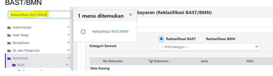

b. Pada Form Reklasifikasi Metode Pembayaran BAST/BMN terdapat 3 sub kelompok form 

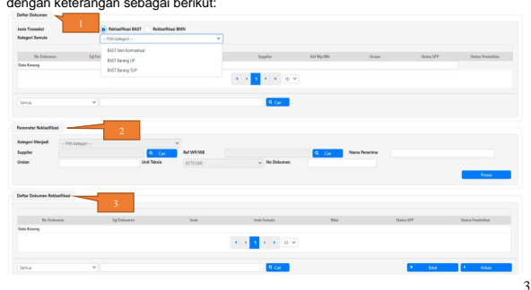

1.) Daftar Dokumen, terdiri dari filter jenis fungsi yang akan dilakukan, kategori BAST 
Semula yang akan dilakukan perubahan, serta daftar Dokumen BAST yang memenuhi kriteria untuk dilakukan proses reklas.

-Kriteria 2.) Parameter Reklasifikasi, terdiri dari parameter yang dapat dilakukan proses perubahan atas dokumen yang akan di reklas. Parameter ini berbeda-beda tiap jenis BAST yang akan di reklasifikasi.

3.) Daftar Dokumen Reklasifikasi, menampilkan daftar BAST hasil reklasifikasi dengan menggunakan sequence nomor hasil reklasifikasi.

c. Pada sub form Daftar Dokumen, pilih jenis Transaksi "**Reklasifikasi BAST**" lalu lakukan langkah berikut: 

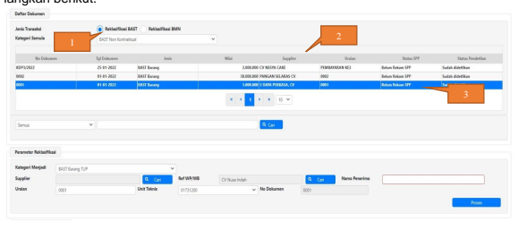

1.) Pilih 'Kategori Semula' 2.) Pada daftar grid dokumen, akan tampil daftar dokumen yang memenuhi kriteria untuk dilakukan proses reklas 3.) Pilih dokumen d. Isi/Lengkapi parameter reklasifikasi, lalu klik tombol **'Proses'**

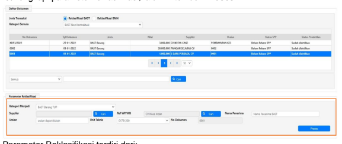

Parameter Reklasifikasi terdiri dari: 
1) Perubahan Kategori Tujuan 2) Perubahan Supplier 3) Perubahan Uraian 4) Perubahan Referensi Wajib Pajak/Wajib Bayar/Setor 5) Perubahan Kode Unit Teknis 6) Perubahan Nomor Dokumen 7) Perubahan Nama Penerima BAST
Note: Parameter data yang dapat diubah berbeda-beda sesuai Matriks Variasi Perubahan Metode Pembayaran pada Poin A.1 Petunjuk Teknis ini.

e. Setelah melengkapi data parameter reklasifikasi tujuan, klik tombol **Proses** lalu akan 

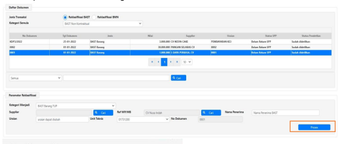

muncul pesan konfirmasi sebagai berikut:
Note: Proses reklas **hanya dapat dilakukan satu kali (tidak dapat dilakukan koreksi ulang)**, 
mohon untuk memastikan parameter reklasifikasi yang direkam sudah benar. 

f. Setelah proses konfirmasi perekaman berhasil dilakukan, data hasil reklasifikasi akan tampil pada Daftar Dokumen Reklasifikasi dengan membentuk Nomor Dokumen baru dengan tambahan sequencer "/R". 

Sebagai contoh pada juknis ini, nomor dokumen 00001 kategori LS Non Kontraktual di 

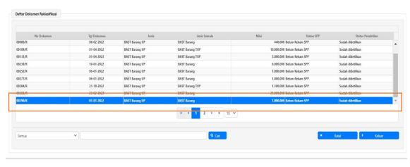 reklasifikasi menjadi Kategori UP dengan nomor 00290/R. 

g. Untuk memastikan hasil reklasifikasi telah sesuai, dapat dilakukan pengcekan pada menu 

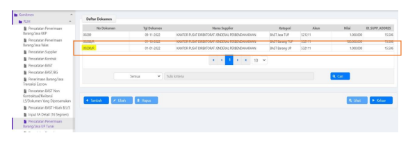

perekaman terkait. Contoh, atas nomor dokumen 00290/R hasil reklasifikasi dapat dilihat di menu *"Pencatatan Penerimaan Barang/Jasa UP Tunai".*

B. **Reklasifikasi Transaksi BMN** 1. Ketentuan Reklasifikasi

Fungsi Perubahan detil rincian barang pada BAST

| 1.   | Ketentuan Reklasifikasi Fungsi Perubahan detil rincian barang pada BAST Jenis BAST 1. Pencatatan BAST Non Kontraktual 2. Pencatatan Penerimaan Barang/Jasa UP Tunai 3. Pencatatan Penerimaan Barang/Jasa KKP 4. Pencatatan Penerimaan Barang/Jasa Valas Status Pendetilan Belum Pendetilan Aset/Persediaan Status Pembayaran Sudah SP2D Perubahan detil rincian barang yang dapat dilakukan: No Perubahan Keterangan 1 Kode Barang a. Meja Rapat menjadi Kursi Besi b. Gedung dan Bangunan Kantor Permanen  menjadi Gedung dan Bangunan Dalam  Pengerjaan (atau sebaliknya) c. Meja Rapat menjadi Barang Persediaan (atau sebaliknya) 2 Jumlah atau kuantitas barang (nilai  total akhir tetap sama dengan  sebelumnya)  3 Nilai atau harga satuan barang  (nilai total akhir tetap sama dengan  sebelumnya)   |
|------|----------------------------------------------------------------------------------------------------------------------------------------------------------------------------------------------------------------------------------------------------------------------------------------------------------------------------------------------------------------------------------------------------------------------------------------------------------------------------------------------------------------------------------------------------------------------------------------------------------------------------------------------------------------------------------------------------------------------------------------------------------------------------------------------------------------|

2. Teknis Reklasifikasi BMN pada BAST/Penerimaan Barang di Modul Komitmen Perekaman Reklasifikasi BMN dilakukan pada modul komitmen oleh user operator yang memiliki kewenangan KOMITMEN_OPERATOR. Untuk melakukan proses Reklasifikasi BMN menggunakan menu "Reklasifikasi BAST/BMN". 

Berikut langkah-langkah proses Reklasifikasi BMN: 

a. Login User Operator Komitmen lalu buka menu Komitmen RUH Reklasifikasi 

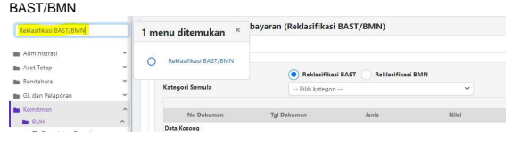

b. Pada form Reklasifikasi BMN terdapat 3 sub kelompok form dengan keterangan sebagai 

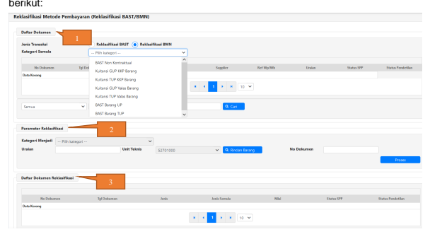

## 1.) Daftar Dokumen, Terdiri :

a) Jenis Transaksi lalu pilih Reklasifikasi BMN
b) Kategori Semula adalah jenis BAST/Penerimaan Barang yang akan dilakukan perubahan kode atau nilai BMN dan akan ditampilkan daftar dokumen BAST yang memenuhi kriteria untuk dilakukan proses Reklasifikasi BMN.

2.) Parameter Reklasifikasi, terdiri dari :
a) Kategori Menjadi pilih jenis BAST/Penerimaan Barang yang akan dilakukan perubahan kode atau nilai BMN dan harus sama dengan kategori BAST semula.

b) Rincian Barang adalah button untuk melakukan perubahan kode, jumlah dan nilai satuan barang yang telah direkam sebelumnya c) Proses adalah button menyelesaikan proses perekaman perubahan kode, jumlah dan nilai satuan barang yang baru.

3.) Daftar Dokumen Reklasifikasi, menampilkan daftar BAST hasil reklasifikasi dengan menggunakan sequence nomor hasil reklasifikasi.

c. Pada sub form Daftar Dokumen, pilih Jenis Transaksi **Reklasifikasi BMN** lalu lakukan langkah berikut: 

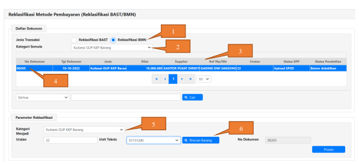

1) Pilih Jenis Transaksi : Reklasifikasi BMN
2) Pada Kategori Semula : pilih jenis BAST/Penerimaan Barang 3) Pada daftar grid dokumen, akan tampil daftar dokumen BAST/Penerimaan Barang yang memenuhi kriteria untuk dilakukan proses Reklasifikasi BMN
4) Pilih salah satu BAST/Penerimaan Barang yang akan diubah kode, jumlah atau nilai satuan BMN
5) Pada sub form Parameter Reklasifikasi, untuk Kategori Menjadi pilih jenis BAST/Penerimaan Barang yang sama dengan jenis BAST/Penerimaan Barang semula 6) Lalu klik Rincian Barang untuk melakukan perekaman kode, jumlah dan nilai satuan BMN yang baru dan akan muncul tampilan sebagai berikut :

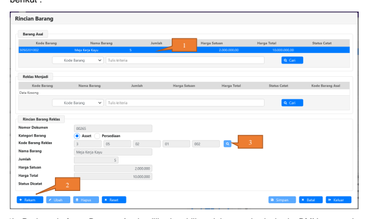

d. Setelah klik Rincian Barang, maka muncul tampilan form baru Rincian Barang sebagai berikut :
2) Lalu klik Rekam 3) Lalu pada Kode Barang Reklas klik button kotak biru kecil (gambar kaca pembesar)
dan akan muncul tampilan pilihan rincian barang yang baru sebagai berikut :

e. Setelah klik tombol kotak biru kecil pada Kode Barang Reklas, muncul tampilan form baru 

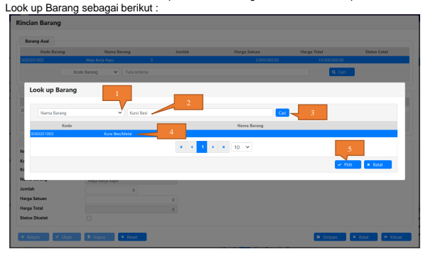

1) Pilih kategori pencarian berdasarkan Nama Barang atau Kode Barang 2) Pada kolom isian, isikan nama barang atau kode barang yang baru 3) Lalu klik Cari, maka barang yang dicari akan tampil di daftar grid barang 4) Lalu klik dan pilih barang sesuai dengan hasil pencarian 5) Lalu klik Pilih, maka akan muncul tampilan sebagai berikut :
f. Setelah klik Pilih pada Look up Barang, maka akan kembali form Rincian Barang sebagai berikut :

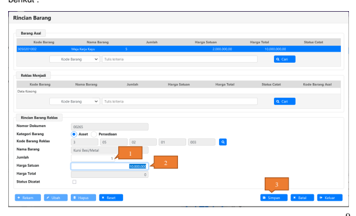

1) Pada isian Jumlah : isikan jumlah barang seharusnya 2) Pada isian Harga Satuan : isikan harga satuan seharusnya 3) Lalu klik Simpan, dan apabila perekaman rincian barang telah selesai, klik Keluar.

g. Setelah klik selesai perekaman Rincian Barang yang baru dan telah klik Keluar, maka kembali ke form awal sebagai berikut dan klik Proses, maka akan muncul pesan sebagai berikut ;

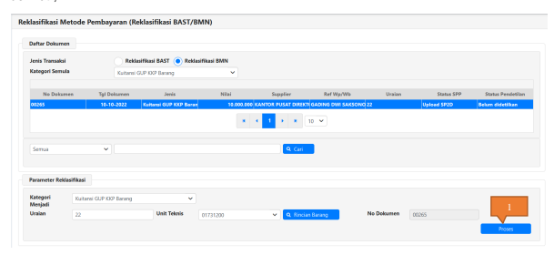

Catatan *: Reklasifikasi BMN ini hanya dapat dilakukan sekali saja atas satu dokumen* 

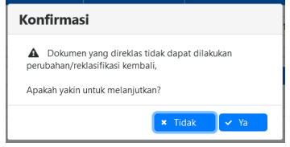

BAST/Penerimaan Barang. Jadi, BAST/Penerimaan Barang yang pernah dilakukan Reklasifikasi BMN, maka tidak dapat dilakukan Reklasifikasi BMN lagi *atas* BAST/Penerimaan Barang yang sama. Maka, agar dipastikan perekaman rincian barang yang baru telah sesuai dengan dokumen sumber *dan substansi pengadaan barang sesungguhnya.*
h. Setelah proses konfirmasi perekaman berhasil dilakukan, data hasil reklasifikasi akan tampil pada Daftar Dokumen Reklasifikasi dengan membentuk Nomor Dokumen baru dengan tambahan sequencer "/R". 

Sebagai contoh pada juknis ini, Penerimaan Barang dari KKP GUP nomor dokumen 00265 di-reklasifikasi BMN maka BAST/Penerimaan Barang berubah *nomornya* menjadi 00291/R. 

i. Untuk memastikan hasil reklasifikasi telah sesuai, dapat dilakukan pengcekan pada menu 

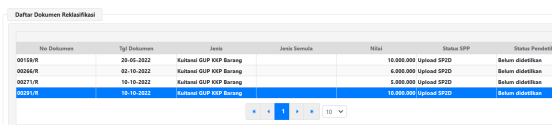

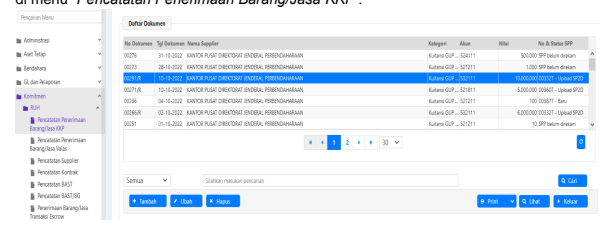

perekaman terkait. Contoh, atas nomor dokumen 00291/R hasil reklasifikasi dapat dilihat di menu *"Pencatatan Penerimaan Barang/Jasa KKP".*

## C. Catatan Penting

1. Pastikan dokumen/BAST yang akan dilakukan reklasifikasi telah memenuhi kriteria pada poin A.1 dan/atau B.1 2. Proses reklasifikasi tidak dapat diulang, sebelum proses reklasifikasi agar berkoordinasi terlebih dahulu dengan modul terkait (Komitmen/Aset/Persediaan)
3. Proses reklasifikasi akan membentuk nomor dokumen baru(nomor terakhir+1) dengan tambahan sequence "/R". 

4. Hasil reklasifikasi dapat dilihat pada Menu Pencatatan penerimaan Barang/Jasa Terkait. 5. Ketika disimpan Reklasifikasi BAST/BMN maka akan membalik jurnal BAST/Penerimaan Barang yang lama dengan nomor dokumen lama, dan akan membentuk jurnal baru dengan nomor dokumen yang baru (/R)
6. Jurnal Reklasifikasi BAST/BMN akan terbentuk pada periode bulan GLP yang masih buka. Misal : BAST tanggal buku 12-07-2022, lalu ketika melakukan Reklasifikasi BAST/BMN Modul GLP sudah tutup sampai dengan bulan 09-2022, maka jurnal balik dan jurnal baru Reklasifikasi BAST/BMN akan terbentuk pada bulan GLP yang masih buka yaitu bulan 10-2022.