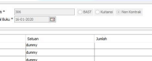
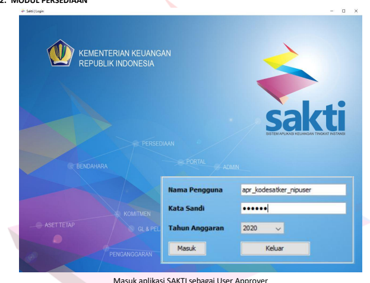
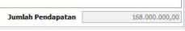
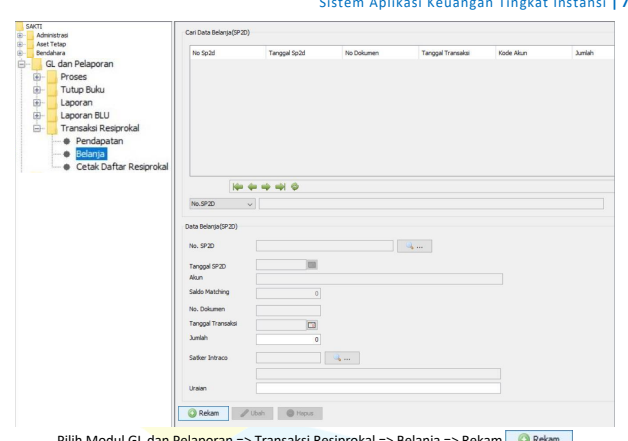

PETUNJUK TEKNIS

skti

# Badan Layanan Umum

O   DIREKTORAT JENDERAL PERBENDAHARAAN

# Daftar Isi Petunjuk Teknis Aplikasi Sakti Untuk Satuan Kerja Badan Layanan Umum

| ..                                                                           | i   |
|------------------------------------------------------------------------------|-----|
| OVERVIEW SAKTI                                                               | i   |
| Modul Aplikasi SAKTI .                                                       | ii  |
| A.  Modul Administrator…                                                     | ii  |
| B.  Modul Penganggaran .                                                     | ii  |
| C.  Modul Komitmen .                                                         | ii  |
| D.  Modul Bendahara                                                          | iv  |
| E.   Modul Pembayaran                                                        | iv  |
| F.  Modul Persediaan .                                                       | iv  |
| G.  Modul Aset Tetap .                                                       | iv  |
| H.  Modul GL dan Pelaporan                                                   | iv  |
| Petunjuk Teknis Aplikasi SAKTI untuk Transaksi Satker BLU                    | 1   |
| I.   Pengelolaan Aset                                                        | 2   |
| lustrasi Pembelian dan Pencatatan Aset                                       | 5   |
| I.   Pengelolaan Persediaan                                                  | 16  |
| lustrasi Pencatatan Persediaan .                                             | 18  |
| A.  Transaksi Masuk/Pembelian                                                | 23  |
| B.  Transaksi Keluar/Pemakaian .                                             | 27  |
| II.   Pengelolaan Penerimaan Negara Bukan Pajak (PNBP) .                     | 30  |
| lustrasi Pencatatan Penerimaan Negara Bukan Pajak (PNBP) .                   | 31  |
| IV.   Penerbitan Surat Perintah Pengesahan Pendapatan dan Belanja (SP3B)     | 3   |
| lustrasi Pencatatan Surat Perintah Pengesahan Pendapatan dan Belanja (SP3B). | 35  |
| lustrasi Pencatatan Surat Perintah Pencairan Dana (SP2D) .                   | 48  |
| V.  Pelaporan                                                                | 51  |
| lustrasi Jurnal Manual .                                                     | 54  |
| lustrasi Validasi Jurnal .                                                   | 59  |
| lustrasi Posting Jurnal…                                                     | 61  |
| lustrasi Monitoring Jurnal                                                   | 63  |
| lustrasi Pengisian Realisasi Kinerja Satker.                                 | 64  |
| lustrasi Tutup Buku…                                                         | 6   |
| lustrasi Laporan .                                                           | 71  |
| lustrasi Transaksi Resiprokal                                                | 73  |
| VI. Penganggaran                                                             | 78  |
| lustrasi Penganggaran                                                        | 78  |

# Overview Sakti

SAKTI (Sistem Aplikasi Keuangan Tingkat Instansi) merupakan aplikasi yang mengintegrasikan seluruh aplikasi yang digunakan satker yaitu mulai dari perencanaan, pelaksanaan hingga pertanggungjawaban anggaran yang menerapkan konsep single database dan dilakukan secara sistem elektronik. Berbagai modul yang ada di SAKTI meliputi Modul Penganggaran, Modul Komitmen, Modul Pembayaran, Modul Bendahara, Modul Persediaan, Modul Aset Tetap, Modul GL dan Pelaporan serta Modul Administrasi.

Pada Tahun 2016, implementasi SAKTI telah dilakukan pada seluruh satuan kerja dan satuan kerja Badan Layanan Umum lingkup Ditjen Perbendaharaan Kementerian Keuangan. Kemudian secara bertahap, mulai Tahun 2017 implementasi SAKTI telah dilakukan pada seluruh satuan kerja lingkup Eselon I lainnya pada Kementerian Keuangan dan pada satuan kerja Kementerian/Lembaga.

Perbedaan SAKTI dengan aplikasi satuan kerja sebelumnya adalah menggunakan satu database terpusat; memiliki tingkat keamanan yang lebih tinggi dengan adanya proses enkripsi/dekripsi Arsip Data Komputer (ADK); dapat di *install* di beberapa sistem operasi (misal Windows, *Linux*); lebih mudah digunakan (*user friendly*); dapat dijalankan dalam spesifikasi PC/Laptop yang minimum; serta kinerja aplikasi yang lebih konsisten.

Untuk menjamin keamanan data, semua data yang dipertukarkan dalam interkoneksi antara SAKTI dan SPAN harus memenuhi syarat keamanan data sebagai berikut:
1. Kerahasiaan Data ADK yang keluar dari SAKTI akan dienkripsi untuk menjamin ADK hanya dapat dibaca oleh pihak pengirim dan penerima pesan. Selain itu dilakukan pula pembatasan akses ke Portal SPAN melalui registrasi user sehingga hanya orang yang terdaftar saja yang dapat melakukan pengiriman dan pengambilan data.

2. Integritas Data ADK SAKTI akan menggunakan pengamanan berupa hash code untuk masing-masing data, sehingga isi dan jumlah data yang disampaikan tidak akan berubah selama proses perpindahan data.

3. Keaslian Data Setiap ADK akan dijamin keasliannya menggunakan PIN. Penggunakan PIN memastikan bahwa ADK telah diketahui dan disetujui oleh pejabat yang berwenang.

Oleh karena itu, pengoperasian SAKTI banyak melibatkan pengguna dengan kewenangan yang berbedabeda, mulai dari pengguna sebagai Kuasa Pengguna Anggaran (KPA), Bendahara, Pejabat Pembuat Komitmen 
(PPK), Pejabat Penandatangan Surat Perintah Membayar (PPSPM) dan operator masing-masing modul. ADK suatu modul tidak akan terbentuk bilamana semua pengguna yang berwenang belum terlibat dan melakukan persetujuan terhadap suatu proses yang dikerjakan.

Petunjuk Teknis SAKTI Badan Layanan Umum (BLU) ini disusun untuk memberikan panduan kepada para pengguna dalam mengimplementasikan SAKTI pada satuan kerja BLU. Secara garis besar, akan dijelaskan modul-modul SAKTI beserta ilustrasi yang akan digunakan oleh satuan kerja BLU sehingga operator masing-masing modul pada satuan kerja BLU dapat memahami dan mengoperasikan SAKTI dengan baik dan lancar.

# Modul Aplikasi Sakti

Sistem Aplikasi Keuangan Tingkat Instansi (SAKTI) mencakup seluruh proses pengelolaan keuangan negara pada satuan kerja dimulai dari proses Penganggaran, Pelaksanaan, sampai dengan Pelaporan. Masingmasing proses pengelolaan keuangan diperankan oleh modul-modul aplikasi sebagai berikut: 1. Proses Perencanaan Anggaran diperankan oleh Modul Penganggaran; 2. Proses Pelaksanaan Anggaran diperankan oleh Modul Komitmen, Modul Bendahara, Modul Pembayaran, Modul Persediaan dan Modul Aset Tetap; 3. Proses Pertanggungjawaban Anggaran diperankan oleh Modul GL dan Pelaporan.

Modul-modul yang terdapat pada SAKTI antara lain sebagai berikut:

## A. Modul Administrator

Modul yang diperuntukan bagi Administrator dalam mengelola data referensi yang akan digunakan oleh modul-modul lain, data user, user manual dan database SAKTI. Ruang lingkup Modul Administrator meliputi: 1. Administrator Pemelihara Sistem Bertugas untuk mengelola referensi pusat, distribusi referensi dan pengembangan sistem. Berada pada Kementerian Keuangan (Ditjen Perbendaharaan).

2. Administrator Server Bertugas mengelola konfigurasi sistem, akun pengguna, hak akses, update referensi, backup/ restore database, database SAKTI, user manual dan keamanan. Dilakukan oleh instansi yang mengelola database SAKTI.

3. Administrator Lokal Bertugas mengelola referensi pejabat dan referensi lokal internal satker. Dilakukan oleh instansi yang tidak mengelola database SAKTI.

## B. Modul Penganggaran

Modul yang memuat semua proses penyusunan Rencana Kerja Anggaran sampai dengan penyusunan Dokumen Pelaksanaan Anggaran termasuk perencanaan realisasi anggaran dan penerimaan untuk periode 1 (satu) tahun anggaran.

Ruang lingkup Modul Penganggaran meliputi:
1. Fungsi Penyusunan Anggaran (Kertas Kerja/RKAKL-DIPA)
Belanja, Pendapatan/Penerimaan, Informasi BLU, Informasi Valas/PHLN, KPJM, Terima Data Pegawai.

2. Fungsi Penyusunan Rencana Penarikan Belanja dan Penerimaan/Pendapatan Rencana Penarikan Belanja meliputi POK/Hal III DIPA dan Perencanaan Kas (Renkas) harian dan Rencana Penerimaan/Pendapatan.

3. Fungsi Penyusunan Revisi Anggaran Revisi POK dan Revisi DIPA.

Output dari Modul Penganggaran adalah ADK RKAKL, ADK Revisi DIPA.

## C. Modul Komitmen

Modul yang memuat pengelolaan aktivitas pencatatan dan perikatan/kontrak dalam rangka pelaksanaan APBN untuk mendukung pengelolaan data pagu, perencanaan kas dan referensi dalam pelaksanaan pembayaran. Ruang lingkup Modul Komitmen meliputi Manajemen Supplier dan Manajemen Kontrak.

Output dari Modul Komitmen adalah ADK Supplier dan ADK Kontrak.

## D. Modul Bendahara

Modul yang memuat penatausahaan penerimaan dan pengeluaran negara melalui Bendahara. Ruang lingkup Modul Bendahara meliputi: 1. Pengelolaan UP/GUP dan TUP/GTUP. 2. Pengelolaan dana titipan/ LS bendahara. 3. Pengelolaan penerimaan PNBP Umum. 4. Pengelolaan penerimaan PNBP Fungsional. 5. Penyusunan LPJ Bendahara. Output dari Modul Bendahara adalah LPJ Bendahara.

## E. Modul Pembayaran

Modul yang memuat proses bisnis pembayaran yang diajukan oleh satker melalui Surat Perintah Membayar (SPM) untuk mencairkan/membayar sejumlah dana dari rekening pemerintah kepada pihak yang berhak untuk diajukan ke KPPN melalui proses penerbitan Surat Perintah Pencairan Dana (SP2D).

Output dari Modul Pembayaran adalah: a. Dokumen SPP, SPM, SP3B atau yang dipersamakan. b. ADK Resume Tagihan, ADK SPM atau yang dipersamakan.

## F. Modul Persediaan

Modul yang memuat proses bisnis pencatatan transaksi barang persediaan, pembuatan jurnal transaksi, pengiriman data ke modul aset tetap dan pembuatan laporan. Ruang lingkup Modul Persediaan meliputi: 1. Pengelolaan persediaan di Unit Akuntansi Kuasa Pengguna Barang (UAKPB) sebagai satker induk. 2. Pengelolaan persediaan di Unit Akuntansi Pembantu Kuasa Pengguna Barang (UAPKPB) sebagai satker pembantu.

3. Transaksi persediaan bisa dilakukan di UAKPB atau UAPKPB (jika ada), sedangkan yang melakukan pelaporan persediaan adalah UAKPB.

4. Komunikasi data antar UAKPB dan UAPKPB melalui mekanisme Kirim/Terima ADK. Output dari Modul Persediaan adalah Laporan Persediaan.

Modul untuk melaksanakan pengelolaan barang milik negara berupa aset tetap, aset tak berwujud dan aset lain-lain pada Kementerian Negara/Lembaga (UAPB dan UAPPBE1, UAPPBW, UAKPB, UAPKPB). Output dari Modul Aset Tetap adalah Laporan Barang Milik Negara.

## H. Modul Gl Dan Pelaporan

Modul dalam aplikasi SAKTI yang memuat keseluruhan proses yang terkait dengan akuntansi dan pelaporan (UAPA, UAPPAE1, UAPPAW, UAKPA). Fungsi Modul GL dan Pelaporan adalah: 1. Membuat jurnal yang ditrigger oleh transaksi yang dihasilkan oleh modul lain (Sub ledger). 2. Membuat penyesuaian dan jurnal yang tidak dihasilkan modul lain. 3. Posting jurnal dalam rangka pembentukan laporan. 4. Tutup Periode. 5. Membuat Laporan Keuangan sebagai bahan untuk pertanggungjawaban. 6. Rekonsiliasi, Konfirmasi, dan Konsolidasi. Output dari Modul GL dan Pelaporan adalah Laporan Keuangan.

# Petunjuk Teknis Aplikasi Sakti Untuk Transaksi Satker Blu

Satuan Kerja Badan Layanan Umum (BLU) adalah instansi di lingkungan Pemerintah Pusat yang dibentuk untuk memberikan pelayanan kepada masyarakat berupa penyediaan barang dan/atau jasa yang dijual tanpa mengutamakan mencari keuntungan dan dalam melakukan kegiatannya didasarkan pada prinsip efisiensi dan produktivitas. Pengendalian secara ketat dalam perencanaan dan penganggaran, pelaksanaan serta pertanggungjawaban menjadi karakteristik penting pada satker yang menerapkan pola pengelolaan keuangan BLU untuk mengimbangi kekhususan dan fleksibilitas pengelolaan keuangan BLU.

Dalam rangka pertanggungjawaban pelaporan keuangan BLU selaku pengelolaan kekayaan negara yang tidak dipisahkan, satker BLU wajib menyusun laporan keuangan berdasarkan Standar Akuntansi Pemerintahan (SAP). Laporan keuangan dimaksud memenuhi Peraturan Menteri Keuangan Nomor 217 /PMK.05/2015 tentang Pernyataan Standar Akuntansi Pemerintah Berbasis Akrual Nomor 13 (PSAP 13) 
tentang Penyajian Laporan Keuangan Badan Layanan Umum. Laporan Keuangan Satker BLU sesuai PSAP 13 disusun dan disajikan untuk kebutuhan pelaporan keuangan bertujuan umum, dan selanjutnya dapat digunakan, baik untuk penyusunan laporan keuangan konsolidasian pada laporan keuangan Kementerian Negara/Lembaga yang membawahi secara vertikal satker BLU maupun untuk analisis dan penyusunan laporan keuangan yang lebih khusus dengan tujuan tertentu.

Sistem Akuntansi dan Pelaporan Keuangan BLU (SA BLU) merupakan bagian dari Sistem Akuntansi Instansi (SAI) pada Kementerian Negara/Lembaga dan untuk menjalankan SA BLU tersebut perlu dibentuk Unit Akuntansi Kuasa Pengguna Anggaran (UAKPA) di satker BLU. UAKPA secara umum melaksanakan sistem, subsistem dan prosedur akuntansi atas kejadian transaksional, dan mendukung kebutuhan penyajian data dan informasi dalam rangka penyusunan laporan keuangan BLU secara periodik dalam kerangka SAI, serta menyusun dan menyajikan laporan keuangan BLU sesuai dengan Standar Akuntansi Pemerintahan.

Dalam rangka mendukung implementasi SPAN untuk melakukan pengelolaan keuangan yang meliputi tahapan perencanaan hingga pertanggungjawaban anggaran, satker BLU sebagai entitas akuntansi dan entitas pelaporan Kementerian Negara/Lembaga wajib menggunakan SAKTI. Secara umum, transaksi yang biasa dilakukan oleh satker BLU adalah sebagai berikut:
1. Pengelolaan Aset 2. Pengelolaan Persediaan 3. Pengelolaan Penerimaan Negara Bukan Pajak (PNBP)
4. Penerbitan Surat Perintah Pengesahan Pendapatan dan Belanja (SP3B) 5. Pelaporan 6. Penganggaran Pada Petunjuk Teknis SAKTI untuk satker BLU ini akan dijelaskan panduan dan cara pengoperasian SAKTI sesuai transaksi-transaksi yang biasa dilakukan oleh satker BLU.

## I. Pengelolaan Aset 1. Modul Komitmen A. Merekam Bast Non Kontraktual

Hal-hal yang perlu diperhatikan dalam menginput BAST Non Kontraktual: 1) BAST Non Kontraktual diinput tanpa didahului pencatatan kontrak. 2) Kategori BAST Non Kontraktual dipilih Aset/Jasa Dikapitalisasi Aset jika menghasilkan BMN
intrakomptabel/BMN ekstrakomptabel, dan dipilih Jasa/Non Aset/Belanja Modal Pengembangan di Bawah Kapitalisasi Aset jika merupakan pengadaan jasa, atau termasuk pengembangan BMN dengan nilai di bawah kapitalisasi aset.

3) Dalam hal BAST Non Kontraktual merupakan pengembangan BMN, kode sub-sub kelompok barang yang digunakan mengikuti kode sub-sub kelompok barang induk yang dikembangkan.

4) Dalam hal merekam BAST Non Kontraktual barang, untuk aset dengan kode sub-sub kelompok barang yang sama namun memiliki harga satuan yang berbeda, asetnya harus direkam terpisah dengan harga satuannya masing-masing.

5) Modul Aset Tetap dapat melakukan pendetailan barang dan Modul Pembayaran dapat membuat SP3B (Surat Perintah Pengesahan Pendapatan dan Belanja), setelah BAST Non Kontraktual direkam.

1) Masuk aplikasi SAKTI sebagai User Operator. 2) Pilih Modul Komitmen, masuk menu RUH => Pencatatan BAST Non Kontraktual => Tambah. 3) Rekam Informasi Dokumen secara lengkap, pada kolom Kategori pilih Aset/Jasa Dikapitalisasi Aset. 4) Rekam Rincian Barang untuk melakukan pendetailan aset sesuai kode barang dan jumlah. 5) Setelah selesai melakukan perekaman dengan benar kemudian Simpan.

Melakukan Pendetailan Aset **Tetap** Proses pendetailan aset tetap bertujuan untuk melaksanakan pembukuan data detail BMN yang diperoleh melalui pembelian yang berasal dari modul komitmen (BAST Non Kontraktual). Penjelasan Proses Pendetailan Aset Tetap dari Pembelian:

a. Analisa Transaksi *Pembelian* Proses pendetailan pembelian dapat dilakukan untuk beberapa transaksi: 1) Perolehan BMN Pembelian Digunakan untuk pencatatan aset yang diperoleh dari pembelian dimana sifat aset sudah dalam bentuk jadi.

2) Perolehan BMN Penyelesaian Pembangunan Langsung Digunakan untuk pencatatan aset yang diperoleh dari pembelian dimana sifat pembeliannya untuk pembangunan yang proses pembangunannya sekali jadi.

3) Perubahan BMN Pengembangan Langsung Digunakan untuk pencatatan aset dimana aset yang diperoleh akan digunakan untuk pengembangan aset yang sudha ada. Penentuan kodifikasi aset yang dimasukkan harus sesuai dengan aset yang akan di kembangkan (Misal: Walaupun wujudnya harddisk tetapi akan digunakan untuk pengembangan PC maka harus dipilih kodefikasi asetnya sebagai harddisk).

4) Perolehan Konstruksi Dalam Pengerjaan (KDP)
Digunakan untuk pencatatan pembelian dimana sifat dari asetnya berupa pembangunan yang dilakukan dalam beberapa termin ataupun aset yang dihasilkan belum sepenuhnya selesai (masih dalam bentuk KDP).

5) Pengembangan Konstruksi Dalam Pengerjaan KDP
Digunakan untuk pencatatan pembelian dimana sifat pembeliannya merupakan kelanjutan pembangunan Aset KDP yang pernah ada.

6) Perolehan Aset Tetap Renovasi dengan Pembelian Digunakan untuk pencatatan aset tetap renovasi yang diperoleh dengan pembelian.

7) Perolehan Aset Tetap Renovasi dengan Pembangunan Langsung Digunakan untuk pencatatan aset tetap renovasi yang diperoleh dengan Pembangunan Langsung.

1) Masuk aplikasi SAKTI sebagai User Operator. 2) Pilih Modul Aset Tetap, berdasar analisa dari jenis transaksi lakukan proses penginputan:
a) Perolehan BMN Pembelian RUH => Transaksi BMN => Perolehan => Pembelian b) Perolehan BMN Penyelesaian Pembangunan Langsung RUH => Transaksi BMN => Perolehan => Penyelesaian Pembangunan Langsung c) Perubahan BMN Pengembangan Langsung RUH => Transaksi BMN => Perubahan => Pengembangan Langsung d) Perolehan Konstruksi Dalam Pengerjaan (KDP)
RUH => Transaksi KDP => Perolehan e) Pengembangan Konstruksi Dalam Pengerjaan KDP
RUH => Transaksi KDP => Pengembangan f) Perolehan Aset Tetap Renovasi dengan Pembelian RUH => Transaksi Aset Tetap Renovasi => Pembelian g) Perolehan Aset Tetap Renovasi dengan Pembangunan Langsung RUH => Transaksi Aset Tetap Renovasi => Pembangunan Langsung

## C. Validasi Aset

1) Masuk aplikasi SAKTI sebagai User Validator. 2) Pilih Modul Aset Tetap, masuk menu Persetujuan => Validasi. 3) Lakukan proses verifikasi apakah transaksi yang diinputkan ke dalam sistem telah sama dengan dokumen sumber yang ada.

4) Jika sudah sesuai lakukan proses validasi dan apabila belum sesuai kembalikan dokumen sumber beserta catatan hasil validasi.

## D. Approver Aset

1) Masuk aplikasi SAKTI sebagai User Approver. 2) Pilih Modul Aset Tetap, masuk menu Persetujuan => Persetujuan Transaksi.

Sistem Aplikasi Keuangan Tingkat Instansi | 4 3) Lakukan proses persetujuan transaksi dan pada saat persetujuan transaksi maka transaksi yang disetujui telah final dan tidak bisa dilakukan perbaikan. Setelah persetujuan tersebut dilakukan, maka terbentuk penjurnalan pada Modul GL dan Pelaporan.

ILUSTRASI PEMBELIAN DAN PENCATATAN ASET
1.  MODUL KOMITMEN

Pilih Modul Komitmen => RUH => Pencatatan BAST Non Kontraktual => Tambah

Isi Info Dokumen secara lengkap dan benar, antara lain:
- Nomor Dokumen - Tanggal Dokumen
- Uraian Dokumen : gunakan kode Output untuk mempermudah pencarian saat membuat SP3B
- Mata Uang
- Informasi Supplier
- Kementerian, Eselon I, Program - Kegiatan, Output
- Akun
- KPPN
- Sumber Dana, Cara Penarikan, No Register
- Nilai dikosongi saja
- Kategori pilih Aset/Jasa Dikapitalisasi Aset jika menghasilkan BMN intrakomptabel/BMN 
ekstrakomptabel

Pilih Rincian Barang untuk melakukan pendetailan aset dan Konfirmasi Yes

Rekam aset sesuai Kode Barang, Jumlah dan Harga Satuan.
untuk mencari Nama Barang Pada saat memilih Kode Barang dapat menggunakan tombol yang diinginkan.

> Rincian Barang

| Kode Barang   | Nama Barang   | Jumlah   |  Harga Satuan   | Harga Total   |  Status Catat   |
|---------------|---------------|----------|-----------------|---------------|-----------------|

Setelah selesai melakukan perekaman klik tombol Simpan dan Konfirmasi Yes X

# Sistem Aplikasi Keuangan Tingkat Instansi | 10

Rindan Barang
--
4 Keluar Klik tombol Simpan 2.  MODUL ASET TETAP

SKT

Pilih Non Kontrak/Penerimaan Barang => pilih aset yang akan dicatat => Catat

Pilih Kode Barang/Nama Barang => Catat

Isi Tanggal Pembukuan, Merk/Type dan Keterangan => Simpan 13

=> Setuju

## Ii. Pengelolaan Persediaan 1. Modul Komitmen A. Merekam Bast Non Kontraktual

Hal-hal yang perlu diperhatikan dalam menginput BAST Non Kontraktual: 1) BAST Non Kontraktual diinput tanpa didahului pencatatan kontrak. Analisa jenis transaksi yang akan digunakan sesuai dokumen sumber yang berasal dari pembelian persediaan.

2) Kategori BAST Non Kontraktual dipilih Aset/Jasa Dikapitalisasi Aset. 3) Modul Persediaan dapat melakukan pendetailan barang dan Modul Pembayaran dapat membuat SP3B (Surat Perintah Pengesahan Pendapatan dan Belanja), setelah BAST Non Kontraktual direkam.

1) Masuk aplikasi SAKTI sebagai User Operator.

2) Pilih Modul Komitmen, masuk menu RUH => Pencatatan BAST Non Kontraktual => Tambah.

3) Rekam Informasi Dokumen secara lengkap, pada kolom Kategori pilih Aset/Jasa Dikapitalisasi Aset. 4) Rekam Rincian Barang untuk melakukan pendetailan persediaan sesuai kode barang dan jumlah. 5) Setelah selesai melakukan perekaman dengan benar kemudian Simpan.

## 2. Modul Persediaan A. Transaksi Masuk Pembelian

Proses transaksi masuk pembelian berfungsi untuk melakukan penambahan barang persediaan yang berasal dari pembelian persediaan. Penjelasan proses terkait adalah sebagai berikut: a. Analisa Proses *Transaksi* Analisa jenis transaksi yang akan digunakan sesuai dokumen sumber. Dokumen sumber yang digunakan berasal dari pembelian yang berkaitan dengan transaksi persediaan.

1) Masuk aplikasi SAKTI sebagai User Operator. 2) Pilih Modul Persediaan, masuk menu Transaksi Masuk => Pembelian => Rekam. 3) Berdasar analisa dari jenis transaksi lakukan proses penginputan.

## C. Approver

1) Masuk aplikasi SAKTI sebagai User Approver. 2) Pilih Modul Persediaan, masuk Menu Persetujuan => Persetujuan Transaksi.

3) Pilih dokumen kemudian lakukan proses persetujuan transaksi dan pada saat persetujuan transaksi maka transaksi yang disetujui telah final dan tidak bisa dilakukan perbaikan. Setelah persetujuan tersebut dilakukan, maka terbentuk penjurnalan dalam Modul GL dan Pelaporan.

## B. Transaksi Keluar Pemakaian

Proses transaksi keluar habis pakai berfungsi untuk mencatat pemakaian barang persediaan. Penjelasan proses terkait adalah sebagai berikut: a. Analisa *Transaksi* Analisa jenis transaksi yang akan digunakan sesuai dokumen sumber. Dokumen sumber yang digunakan berupa daftar permintaan barang persediaan.

1) Masuk aplikasi SAKTI sebagai User Operator. 2) Pilih Modul Persediaan, masuk menu Transaksi Keluar => Pemakaian => Rekam. 3) Berdasar analisa transaksi lakukan proses penginputan.

## C. Approver Aset

1) Masuk Modul Persediaan dengan User sebagai Approver. 2) Masuk Menu Persetujuan => Persetujuan Transaksi.

3) Pilih dokumen kemudian lakukan proses persetujuan transaksi dan pada saat persetujuan transaksi maka transaksi yang disetujui telah final dan tidak bisa dilakukan perbaikan. Setelah persetujuan tersebut dilakukan, maka terbentuk penjurnalan dalam Modul GL dan Pelaporan.

ILUSTRASI PENCATATAN PERSEDIAAN
1.  MODUL KOMITMEN

Pilih Modul Komitmen => RUH => Pencatatan BAST Non Kontraktual => Tambah

Isi Info Dokumen secara lengkap dan benar, antara lain:
- Nomor Dokumen
- Tanggal Dokumen - Uraian Dokumen : gunakan kode Output untuk mempermudah pencarian saat membuat SP3B
- Mata Uang
- Informasi Supplier
- Kementerian, Eselon I, Program
- Kegiatan, Output
- Akun
- KPPN
- Sumber Dana, Cara Penarikan, No Register
- Nilai dikosongi saja
- Kategori pilih Aset/Jasa Dikapitalisasi Aset jika menghasilkan BMN intrakomptabel/BMN 
ekstrakomptabel

Rincian Barang

| Kode Bara   | Nama Barang               | Jumlah                    | Harga Satuan              | Harga Total                | Status Catat   |
|-------------|---------------------------|---------------------------|---------------------------|----------------------------|----------------|
| 577.500,00  | 5.775.000,00Belum Dicatat |                           |                           |                            |                |
| 101030400   | 10                        | 605.000,00                | 6.050.000.00Belum Dicatat |                            |                |
| 10          | 605.000,00                |                           |                           |                            |                |
| 1010304004  | Tinta/Toper/Printer       | 6.050.000.00Belum Dicatat |                           |                            |                |
| 10          | 605.000,00                | 6.050.000.00Belum Dicatat |                           |                            |                |
| 101030400   | Tinta/Tonen Printe        |                           |                           |                            |                |
| 101030400   | Tinta/Toner: Printer      | 10                        | 605.000,00                | 6.050.000,00 Belum Dicatat |                |

Rekam persediaan sesuai Kode Barang, Jumlah dan Harga Satuan.

 Pada saat memilih Kode Barang dapat menggunakan tombol untuk mencari Nama Barang yang diinginkan.

Rincian Barang X

| Kode Barang   | Nama Barang       | Jumlah   |  Harga Satuan   | Harga Total                | Status Catat   |
|---------------|-------------------|----------|-----------------|----------------------------|----------------|
| 010004        | Unta/Toner Ennter | 10       | 577.500,00      | 5.775.000.00 Belum Dicatat |                |
| 10            | 605.000,00        |          |                 |                            |                |
| 10            | 605.000,00        |          |                 |                            |                |
| 10            | 605.000,00        |          |                 |                            |                |
| 10            | 605.000,00        |          |                 |                            |                |

X

# Sistem Aplikasi Keuangan Tingkat Instansi | 22

Rindan Barang | Smpan
😉 Keluar Klik tombol Simpan

## A.  Transaksi Masuk Pembelian

1.  MODUL PERSEDIAAN

Pilih Modul Persediaan => Transaksi Masuk => Pembelian => Rekam

Pilih Non Kontraktual => pilih persedian yang akan dicatat => Pilih

Isi Tanggal Buku, pilih Kode Sub-Sub Kelompok yang akan didetailkan => Tambah

Pilih Kode Persediaan sesuai klasifikasi, isi Jumlah Barang, Harga Satuan => Simpan.

Bila **semua** Kode Sub-Sub Kelompok barang persediaan sudah didetailkan sesuai Kode Persediaan maka klik tombol Selesai dan Konfirmasi Yes.

Muncul keterangan pembelian persediaan yang sudah didetailkan berhasil disimpan

## 2.  Modul Persediaan

Pilih Modul Persediaan => Persetujuan => Persetujuan Transaksi => Pilih persediaan yang akan disetujui  😉 => Setuju

## B.  Transaksi Keluar Pemakaian 1.  Modul Persediaan

Pilih Modul Persediaan => Transaksi Keluar => Pemakaian => Rekam

Isi Informasi Pemakaian barang persediaan secara lengkap dan benar, antara lain:

- No Bukti - Tanggal Dokumen
- Tanggal Buku
- Tambah
- Kode Persediaan
- Jumlah Barang
- Simpan - Bila semua pemakaian barang persediaan telah direkam maka klik tombol Selesai

## 2.  Modul Persediaan

yang akan disetujui 😉=> Setuju

## Iii. Pengelolaan Penerimaan Negara Bukan Pajak (Pnbp) Modul Bendahara

Mencatat Uang Masuk Kegiatan ini dilakukan oleh Bendahara Penerimaan untuk merekam setoran PNBP Fungsional yang disetorkan oleh Wajib Bayar/Wajib Setor ke Rekening Kas Satuan Kerja Badan Layanan Umum melalui Bank Persepsi. Setelah dilakukan pencatatan maka akan dihasilkan Surat Bukti Setor (SBS) sebagai bukti setoran yang dilakukan Wajib Bayar. Proses pencatatan dapat langsung dilakukan apabila PNBP telah diterima atau telah masuk ke Rekening Kas Satuan Kerja Badan Layanan Umum.

1) Masuk aplikasi SAKTI sebagai User Bendahara. 2) Pilih Modul Bendahara, masuk menu Transaksi => Mencatat Uang Masuk Bendahara Pengeluaran => 
Tambah.

3) Rekam Informasi Dokumen secara lengkap pada kolom Detail Setoran. 4) Setelah selesai melakukan perekaman dengan benar kemudian Simpan.

ILUSTRASI PENCATATAN PENERIMAAN NEGARA BUKAN PAJAK (PNBP)
MODUL BENDAHARA

Isi Informasi Detail Setoran secara lengkap dan benar, antara lain:

- No DIPA
- Identitas Wajib Bayar (NPWP)
- Jenis Pemindahan Kas pilih Non Tunai - Keterangan - Jenis PNBP pilih PNBP Umum - Tanggal SBS - Program - Kegiatan
- Akun
- Jumlah
- Simpan Klik tombol Ya untuk menyimpan data

Klik tombol OK dan data berhasil disimpan IV. PENERBITAN **SURAT PERINTAH PENGESAHAN PENDAPATAN DAN BELANJA (SP3B)**

## 1. Modul Komitmen A. Merekam Bast Non Kontraktual

Hal-hal yang perlu diperhatikan dalam menginput BAST Non Kontraktual: 1) BAST Non Kontraktual diinput tanpa didahului pencatatan kontrak. 2) Kategori BAST Non Kontraktual dipilih Aset/Jasa Dikapitalisasi Aset jika menghasilkan BMN
intrakomptabel/BMN ekstrakomptabel, dan dipilih Jasa/Non Aset/Belanja Modal Pengembangan di Bawah Kapitalisasi Aset jika merupakan pengadaan jasa, atau termasuk pengembangan BMN dengan nilai di bawah kapitalisasi aset.

3) Dalam hal BAST Non Kontraktual merupakan pengembangan BMN, kode sub-sub kelompok barang yang digunakan mengikuti kode sub-sub kelompok barang induk yang dikembangkan.

4) Dalam hal merekam BAST Non Kontraktual barang, untuk aset dengan kode sub-sub kelompok barang yang sama namun memiliki harga satuan yang berbeda, asetnya harus direkam terpisah dengan harga satuannya masing-masing.

5) Modul Aset Tetap dan Modul Persediaan dapat melakukan pendetailan barang dan Modul Pembayaran dapat membuat SP3B (Surat Perintah Pengesahan Pendapatan dan Belanja), setelah BAST Non Kontraktual direkam.

1) Masuk aplikasi SAKTI sebagai User Operator.

2) Pilih Modul Komitmen, masuk menu RUH => Pencatatan BAST Non Kontraktual => Tambah.

3) Rekam Informasi Dokumen secara lengkap, pada kolom Kategori pilih Aset/Jasa Dikapitalisasi Aset untuk merekam transaksi yang menghasilkan aset atau barang persediaan dan pilih Jasa/Non Aset/Belanja Modal di Bawah Kapitalisasi Aset untuk merekam transaksi yang tidak menghasilkan aset atau barang persediaan.

4) Rekam Info Dokumen secara lengkap dan benar.

5) Setelah selesai melakukan perekaman dengan benar kemudian Simpan.

## 2. Modul Pembayaran A. Proses R/U/H Pembayaran

1) Masuk aplikasi SAKTI sebagai User Operator.

2) Pilih Modul Pembayaran, masuk menu RUH Pembayaran => Catat/Ubah SPP => Pilih Jenis SPP 
dengan benar yaitu 511 - Pengesahan BLU => Tambah.

3) Pilih Dokumen yang akan diproses menjadi SP3B. 4) Rekam Informasi Dokumen secara lengkap dan benar. 5) Setelah selesai melakukan perekaman dengan benar kemudian Simpan.

## B. Validasi Pembayaran

1) Masuk aplikasi SAKTI sebagai User PPSPM. 2) Pilih Modul Pembayaran, masuk menu Validasi => Validasi SPM. 3) Lakukan proses verifikasi apakah transaksi yang diinputkan ke dalam sistem telah sama dengan dokumen sumber yang ada, pilih SP3B yang akan diverifikasi => Tayang Pra Cetak.

4) Jika sudah sesuai lakukan proses persetujuan SP3B. 5) Setelah SP3B disetujui, masuk menu ADK => ADK SPM, pilih SP3B yang akan dikirimkan ke KPPN => 

Proses ADK SPM.

6) Muncul otorisasi PIN PPSPM, masukkan PIN PPSPM dengan benar kemudian Proses. 7) Untuk melihat ADK SP3B yang telah diproses, masuk menu Monitoring => Monitoring ADK, akan muncul ADK SP3B yang telah berhasil dikirimkan kepada KPPN.

## C. Pencatatan Sp2D

1) Buka browser internet, ketik https://spanint.kemenkeu.go.id/ 2) Pilih Modul Pembayaran => Daftar SP2D, pilih SP3B yang telah terbit SP2D nya => Unduh XML. 3) Masuk aplikasi SAKTI sebagai User Operator. 4) Pilih Modul Pembayaran => Catat/Upload => Mencatat/Upload BLU, pilih SP3B yang akan dicatat SP2D nya.

5) Pilih Direktori File tempat Unduhan XML SP2D kemudian Upload.

 ILUSTRASI PENCATATAN SURAT PERINTAH PENGESAHAN PENDAPATAN DAN BELANJA (SP3B)
1.  MODUL KOMITMEN

Pilih Modul Komitmen => RUH => Pencatatan BAST Non Kontraktual => Tambah

Isi Info Dokumen secara lengkap dan benar, antara lain:
- Nomor Dokumen
- Tanggal Dokumen - Uraian Dokumen : gunakan kode Output untuk mempermudah pencarian saat membuat SP3B
- Mata Uang
- Informasi Supplier
- Kementerian, Eselon I, Program
- Kegiatan, Output
- Akun
- KPPN
- Sumber Dana, Cara Penarikan, No Register
- Nilai
- Kategori pilih Jasa/Non Aset/Belanja Modal Pengembangan di Bawah Kapitalisasi Aset
- Simpan 

## 2.  Modul Pembayaran

Pilih Modul Pembayaran => RUH Pembayaran => Catat/Ubah SPP
=> Jenis SPP 511 (Pengesahan BLU) => Tambah
& Ambil Data Pengesahan

| Satker        |  BADAN PENGELOLA DANA PERKEBUNAN KELAPA SAWIT   |                    |             |     |    |
|---------------|-------------------------------------------------|--------------------|-------------|-----|----|
| 409999        |                                                 |                    |             |     |    |
| KPPN          | 019                                             |                    |             |     |    |
| Lainnya       | ENGESAHAN BLU                                   |                    |             |     |    |
| No Dokumen    | Tal Dokume                                      | Mata Uang          | Nilai Kurs  |     |    |
| DR            | 0                                               |                    |             |     |    |
| IDR           | 0                                               |                    |             |     |    |
| 425           | 31 Agu 20                                       | 8.325.000.00 Out   |             |     |    |
| 463           | 01 Okt 20                                       | 100.000.00.00 Outp | RNDAHARA... | IDR | 0  |
| 464           | 01 Okt 20                                       | IDR                | 0           |     |    |
| 45            | 01 Okt 20                                       | 20.000.00.00.Out   | IDR         | 0   |    |
| 66            | 01 Okt 20                                       | IDR                | 0           |     |    |
| (ENDAHARA --- |                                                 |                    |             |     |    |

Halama Pilih Data Pengesahan sesuai Output Apabila terdapat beberapa Dokumen dengan Output yang sama maka pilih 🙂 semua Data tersebut

Isi Informasi Dasar Pembayaran secara lengkap dan benar, klik Tambah x

*Dokumen Dasar Pembayaran berubah setiap tahun sesuai Peraturan yang berlaku, misal:
1. UU Nomor 12 Tahun 2018 tentang APBN 2019 2. UU Nomor 20 Tahun 2019 tentang APBN 2020 Jadi pilih Dokumen Dasar Pembayaran sesuai peraturan yang berlaku pada tahun anggaran tersebut.

Isi Informasi Pengesahan BLU secara lengkap dan benar, pilih Periode Triwulan, sesuaikan Saldo Awal sesuai Saldo Akhir Kas yang lalu Distribusi COA

| Distribusi COA   |                            |                   |                  |               |
|------------------|----------------------------|-------------------|------------------|---------------|
| Belanja          | Pendapatan                 |                   |                  |               |
| Akun             | COA                        | Pagu              | Sisa Pagu        | Nilai         |
| 525112           | 40999.019.525112.015030... | 20.000.000,00     |                  |               |
| 6.666.228.000,00 | 4.445.251.305,00           |                   |                  |               |
| 525113           | 40999.019.525113.015080... | 18.832.451.000,00 | 7.427.456.117,00 | 30.000.000,00 |

🙂 RUH Akun

| Jumlah Belanja   |
|------------------|

Periksa dan teliti Distribusi COA kolom Belanja apakah sudah benar atau belum

| 50.000.000,00   |
|-----------------|

Apabila terdapat PNBP yang akan disahkan maka klik kolom Pendapatan => RUH Akun
🙂 RUH Akun

Kode Akun Kode Program Kode Kegiatan Kode Output Kode Sumber Dana Nilai Pembayaran Sruktur COA
Satk

Penarikan. No.Register Nlai
🙂 Tambah Klik Tambah
=> Cari Bukti Setor
🙂 Tambah Q, Cari Bukti Setor Ambil Data SBS
X

| Nilai              |                           |                |
|--------------------|---------------------------|----------------|
| Pish               | No SBS                    | Akun           |
| 0047/SBS/409999... | 424138                    | 123.000.000,00 |
| 2                  | 0048/SBS/40999..   424911 | 45.000.000,00  |

Halaman 10 Pilih 😉 PNBP yang akan disahkan => Pilih 😉

🙂 Pilih
=> Simpan Simpan Apabila semua PNBP telah disimpan maka klik Keluar
� Kelua

| Nilai   |
|---------|

Pada Informasi Pengesahan BLU akan terisi Pendapatan yang akan disahkan dan pad O kolom Pendapatan akan terisi Akun Pendapatan yang akan disahkan => Simpan

X

Apabila masih terdapat Dokumen yang akan disahkan klik Tambah, apabila sudah selesai klik Keluar

Pilih Modul Pembayaran => Cetak => Mencetak SPM => Pilih SP3B yang akan dicetak =>
Pilih PPSPM => Pilih Cetak Ke Layar/Printer => Cetak .

Akan muncul hardcopy cetakan Surat Perintah Pengesahan Pendapatan dan Belanja BLU (SP3B BLU) yang harus ditandatangan oleh PPSPM dan Surat Pernyataan Tanggung Jawab (SPTJ) yang harus ditandatangan oleh KPA. Setelah SP3B BLU ditandatangan oleh PPSPM dan SPTJ ditandatangan oleh KPA, maka scan dokumen tersebut agar menjadi softcopy SP3B BLU dan SPTJ.

Pilih Modul Pembayaran => Catat/Upload => Upload Dokumen Pendukung => Pilih SP3B =>
Pilih Direktori File cari softcopy file SP3B dan SPTJ yang akan diupload Dokumen Pendukungnya => 
Pilih Jenis Dok. Pendukung **SPM hasil scan yang telah ditandatangani PPSPM** => Upload .

Muncul Informasi File Berhasil di Upload, klik OK

## 3.  Modul Pembayaran

Muncul Konfirmasi Anda yakin akan melakukan proses setuju, klik Yes

Pilih Modul Pembayaran => Monitoring => Monitoring ADK
ADK SPM yang telah berhasil dikirim akan muncul pada Dashboard Monitoring ADK dengan Status Berhasil.

ILUSTRASI PENCATATAN SURAT PERINTAH PENCAIRAN DANA (SP2D)
Monitoring terbitnya SP2D atas SP3B yang telah dikirimkan kepada KPPN dapat dilihat pada omspan. Buka browser internet, ketik https://spanint.kemenkeu.go.id/

Muncul tampilan seperti ini, ketik Nama Pengguna kode satker dan Kata Sandi omspan anda, jangan lupa isikan Kode Captcha dengan lengkap dan benar => Masuk

Klik menu beranda pada pojok kiri tampilan omspan

Data Ketersediaan Dana (F...

Pilih Modul Pembayaran => Daftar SP2D
 Daftar SP2D Satken

| BLAI SP20                  | MATA
LIANG                    | pati             | NELAI 19:22   |  KNIS SI M             | 181000      | JENES
 SP1D            |                              |       |      |                          |     |    |
|----------------------------|--------------------|------------------|---------------|------------------------|-------------|------------|------------------------------|-------|------|--------------------------|-----|----|
| 200
 2000                            | 203,535,603,000.00 | IDA              | 50
 2020               | 213,535,693,00         | PENGESAHA   | 24-23      | a                            |       |      |                          |     |    |
| 8                          |                    |                  |               |                        |             |            |                              |       |      |                          |     |    |
| an                         | 50                 | i II Tahun Argen |               |                        |             |            |                              |       |      |                          |     |    |
| ibn                        | 2-09               | 1.455.244.351    | PENGESAR      | a                      |             |            |                              |       |      |                          |     |    |
| M                          |                    |                  |               |                        |             |            |                              |       |      |                          |     |    |
| 200                        | 020                | an               | s             |                        |             |            |                              |       |      |                          |     |    |
| lan II Tahun Area          |                    |                  |               |                        |             |            |                              |       |      |                          |     |    |
| 25-03-200                  | 4                  | 585.952.000.00   | 100           | 2-02                   | 585,952,000 | PENSESAHAN | 01131/40972                  | 24-23 | LARA | nyakan Kasembilanguluhan | Cel | a  |
| 2020                       | 20                 | an               | 200           | idapatan dan latau Bel | anja 0.11   | KUN        |                              |       |      |                          |     |    |
| wan II Tahun Anggaran 2020 |                    |                  |               |                        |             |            |                              |       |      |                          |     |    |
| 2-03-2021                  |                    | IDA              | 2:00          | 2,200,000              | PENGESAHAN  | 24-23      | Pengasahan Kesembilanguh hog | Cek   | a    |                          |     |    |
| lendapatan dan latau Belanja III.
Inwulan II Tahun Anggaran 2020                            |                    |                  |               |                        |             |            |                              |       |      |                          |     |    |
| 20                         | 20                 | an               |               |                        |             |            |                              |       |      |                          |     |    |
| PENSESA                    | a                  |                  |               |                        |             |            |                              |       |      |                          |     |    |
| utan dan latas Belanja D
n III Tahun Anggoran 200                            |                    |                  |               |                        |             |            |                              |       |      |                          |     |    |

Muncul Daftar SP2D Satker, pilih SP3B yang telah terbit SP2D nya 🔁 => Unduh XML
Periksa Unduhan XML pada folder Downloads di komputer anda, apabila telah berhasil maka muncul file PMSP
MODUL PEMBAYARAN

Pilih Modul Pembayaran => Catat/Upload => Mencatat/Upload BLU =>

Pilih semua SP3B yang akan dicatat SP2D nya => Pilih Direktori File .

cari file PMSPxxxxxxxxxxxxxxxxxxxx.XML => Upload .

## V. Pelaporan 1. Jurnal Manual

Kegiatan ini dilakukan untuk memproses pencatatan perubahan saldo akun sehingga saldo mencerminkan jumlah yang sebenarnya. Jurnal yang diinput adalah jurnal yang tidak dibentuk oleh *Sub-Ledger (*Modul). Kelompok Jurnal yang bisa diinput adalah: a. Pendapatan diterima di muka b. Pendapatan yang masih harus diterima c. Beban dibayar di muka d. Beban yang masih harus dibayar e. Penyisihan Piutang f. Penghapusan Piutang Hal-hal yang harus diperhatikan:
1. Jurnal bisa berbasis akrual atau kas.

2. Jurnal *adjustment* yang diproses adalah untuk tahun berjalan. 3. Jurnal Manual tidak bisa menginput nilai *negative* (-). Jika nilai yang tercantum pada Jurnal Umum SAIBA adalah *negative* (-), maka ayat jurnal yang diinput di SAKTI harus *opposite* atau dibalik posisi Debit-Kreditnya.

4. Jurnal Manual dilakukan dengan tanggal dokumen 30 Juni dan 31 Desember dengan menginput nilai positif (+).

5. Jurnal pembalik dilakukan dengan tanggal dokumen 1 Januari dan 1 Juli dengan menginput nilai positif 
(+). Ayat jurnal yang diinput di SAKTI sesuai dengan Jurnal Manual tanggal dokumen 30 Juni dan 31 Desember tetapi *opposite* atau dibalik posisi Debit-Kreditnya.

## 2. Validasi Jurnal

Kegiatan ini dilakukan untuk memvalidasi dan pengecekan jurnal yang telah terbentuk oleh modul. Sebelum divalidasi, dipastikan jurnal terbentuk dengan benar, seimbang dan masuk ke periode yang sesuai. Validasi Jurnal dilakukan dengan mencentang jurnal yang akan divalidasi lalu mengklik tombol >> Proses Validasi. Hal-hal yang harus diperhatikan: a. Jika jurnal yang dipilih hanya satu baris jurnal (D/K) maka jurnal pasangannya (dalam 1 ID Buku Besar) 
otomatis tervalidasi.

b. Jurnal yang telah tervalidasi akan tetap muncul di daftar validasi jurnal sebelum jurnal tersebut dilakukan *posting* (bisa batal validasi). Jika jurnal tersebut telah di*posting*, jurnal akan hilang dalam daftar validasi jurnal namun tetap ada di form *monitoring* jurnal.

## 3. Posting Jurnal

Kegiatan ini dilakukan untuk mem*posting* jurnal yang telah divalidasi sebelumnya sehingga muncul di laporan. *Posting* Jurnal dilakukan dengan mencentang jurnal yang sudah divalidasi dan akan di*posting* lalu mengklik tombol >> Proses. Hal-hal yang harus diperhatikan: a. Jurnal yang bisa di*posting* hanya jurnal yang sudah tervalidasi.

b. Jika jurnal tersebut telah di*posting*, jurnal akan hilang dalam daftar *posting* jurnal namun tetap ada di form *monitoring* jurnal.

c. Jurnal yang telah di*posting* akan masuk ke dalam laporan keuangan.

## 4. Monitoring Jurnal

Kegiatan ini dilakukan untuk melihat jurnal yang telah terbentuk dan status jurnal tersebut (sudah atau belum validasi/*posting*). a. **Monitoring Jurnal (operator GL SAKTI)**
Monitoring Jurnal dilakukan dengan mem*filter* jurnal yang ingin dilihat. Pada proses ini juga bisa dilakukan *tracing* jurnal. Jurnal tersebut dihasilkan oleh modul (subledger) pada titik pengakuan jurnal.

b. **Tracing Jurnal (operator GL SAKTI)**
Operator dapat melakukan *tracing* jurnal untuk menelusuri sumber jurnal melalui menu Monitoring Jurnal dengan mengklik tombol >> Detail >> *View Data* di Aplikasi SAKTI.

## 5. Realisasi Kinerja Satker

Realisasi kinerja adalah proses input capaian kinerja satker (per bulan) berdasarkan program, kegiatan, dan output sesuai dengan target yang telah ditetapkan. Pengisian realisasi kinerja satker dilakukan pada Modul Komitmen >> RUH >> Realisasi Kinerja Satker. Hal-hal yang harus diperhatikan: a. Realisasi kinerja diisikan dengan periode bulanan. b. Realisasi kinerja diinput per output. c. Realisasi kinerja bisa melebihi target.

## 6. Tutup Buku

Tutup buku merupakan akhir dari siklus akuntansi. Kegiatan ini dimaksudkan untuk melakukan *cut-off* antar periode. Tutup buku ini terbagi atas tutup sementara dan tutup permanen.

Hal-hal yang harus diperhatikan:
a. Tutup buku sementara dilakukan sebagai syarat pembuatan ADK Rekonsiliasi. Tutup sementara bisa dibuka kembali jika perlu dilakukan perbaikan atas tindak lanjut rekonsiliasi.

b. Jika tutup buku untuk suatu periode telah dilakukan tutup permanen maka transaksi tidak bisa dilakukan koreksi untuk semua modul dalam periode tersebut.

c. Untuk melakukan tutup buku pada Modul GL dan Pelaporan, diharapkan koordinasi sebelumnya dengan semua operator modul. Modul Aset Tetap dan Modul Persediaan harus sudah ditutup buku oleh Approver sebelum melakukan tutup buku pada Modul GL dan Pelaporan.

## 7. Laporan

Laporan terbentuk hanya untuk jurnal-jurnal yang telah dilakukan posting. Sedangkan jurnal yang bisa diposting hanya jurnal yang telah divalidasi sebelumnya. Laporan yang dihasilkan merupakan laporan berbasis akrual dan kas. Hal-hal yang harus diperhatikan:
a. Jurnal yang masuk ke laporan hanya jurnal yang sudah dilakukan *posting*.

b. Untuk membawa saldo laporan periode sebelumnya dan diakumulasi dengan periode laporan yang ingin dihasilkan, maka harus dilakukan tutup periode untuk periode sebelumnya.

## 8. Transaksi Resiprokal

Transaksi Resiprokal merupakan transaksi antara satker BLU/Non BLU Pemberi Kerja dan Satker BLU Penerima Kerja yang menggunakan dana APBN sehingga harus dieliminasi di tingkat Laporan Keuangan Kementerian Negara/Lembaga (LKKL) dan Laporan Keuangan Pemerintah Pusat (LKPP).

## Hal-Hal Yang Harus Diperhatikan:

a. Satker BLU Penerima Kerja melakukan identifikasi transaksi yang memenuhi karakteristik timbal balik 
(resiprokal) pendapatan BLU dari entitas pemerintah pusat. Selanjutnya Satker BLU Penerima Kerja mencatat dan mengesahkan penerimaan kas dari Satker Entitas Pemerintah Pusat Pemberi Kerja menggunakan akun khusus Pendapatan dari Pelayanan BLU yang bersumber dari Entitas Pemerintah Pusat dan wajib melakukan perekaman informasi Satker Pemberi Kerja pada Aplikasi SAKTI.

b. Berdasarkan permintaan konfirmasi dan/atau data rekonsiliasi pada menu Monitoring Lainnya Aplikasi e-Rekon&LK, Satker Non-BLU atau Satker BLU Pemberi Kerja merespon konfirmasi dimaksud dengan melakukan identifikasi SP3B/SP2B-BLU (selaku pemberi kerja) yang terindikasi sebagai pembayaran barang/jasa kepada Satker BLU Penerima Kerja. Transaksi realisasi belanja kepada BLU Penerima Kerja terekam sebagai Pendapatan BLU di monitoring Aplikasi e-Rekon&LK.

c. Satker Non-BLU atau Satker BLU Pemberi Kerja yang telah melakukan identifikasi transaksi dan memenuhi karakteristik resiprokal pengeluaran belanja secara langsung ke BLU Penerima Kerja kemudian melakukan perekaman pendetailan informasi Satker BLU Penerima Kerja pada Aplikasi SAKTI.

d. Apabila data transaksi belanja resiprokal yang tercantum pada Aplikasi e-Rekon&LK bukan milik Satker Pemberi Kerja dimaksud atau tidak memenuhi transaksi belanja resiprokal, Satker Pemberi Kerja dapat merespon dengan meminta Satker BLU Penerima Kerja untuk melakukan ralat/menghapus data transaksi resiprokal pada Aplikasi e-Rekon&LK.

ILUSTRASI JURNAL MANUAL
 MODUL GL dan PELAPORAN

Pilih Modul GL dan Pelaporan => Proses => Jurnal Manual => Pilih Periode => Rekam

- Tanggal Dokumen
- Tanggal Transaksi
- No Dokumen
- Pilih Jenis Jurnal Kas atau Akrual
- Isi Deskripsi Jurnal dengan jelas
Isi Data Akun secara lengkap dan benar, antara lain:
- Kode COA
- Posisi Akun Debet atau Kredit
- Nominal

Pada saat Input COA akan muncul Form Input COA, ketik Akun atau klik .

Operator dapat melakukan pencarian akun sesuai Kode Akun atau Nama Akun kemudian klik Cari Data. 
Muncul akun yang diinginkan kemudian klik 2x pada akun tersebut.

 Setelah Data Dokumen dan Data Akun diisi dengan lengkap dan benar klik Simpan Aku

Rekam Jurnal sampai muncul di Daftar Jurnal dengan posisi Debet dan Kredit Balance

), Cari

Tampilan Daftar Jurnal Manual akan berubah terisi Jurnal yang telah direkam ILUSTRASI VALIDASI JURNAL

Pilih Modul GL dan Pelaporan =>

| lol Juma      | ho Dokumen   | Jenis Doku.   | Sumber Data   | Kode Buku ...   | Kode Akun   | Nama Akun   | Kas/Akrua   |
|---------------|--------------|---------------|---------------|-----------------|-------------|-------------|-------------|
| 0150801994... | PR-40999...  | |593111       | eban Perse.   |                 |             |             |             |
| 0150801994    | PR-409099    | 1711          |               |                 |             |             |             |
| 015050193     | a            | 593111        | ban Perse...  | 20,0            |             |             |             |
| 150501004     | 99-40999     | 17111         |               |                 |             |             |             |
| 0120801994.   |              | +09999        | 59111         | 0,00            |             |             |             |
| 1711          |              |               |               |                 |             |             |             |
| 429595        |              |               |               |                 |             |             |             |
|               | 593111       | tan Perse...  |               |                 |             |             |             |
| 150501994     | FR-409999    | 17111         |               |                 |             |             |             |
| 593111        |              |               |               |                 |             |             |             |
| 01            | ban Perse... | e             |               |                 |             |             |             |
| 4000000       | 1711         |               |               |                 |             |             |             |

Pilih Semua Jurnal, Pilih Semua Halaman => Proses Validasi Validasi Jurnal

x Apakah Anda yakin akan melakukan proses Validasi Semua Jurnal?

Ya

Tidak Muncul Notifikasi Validasi Jurnal, klik Ya

Proses Validasi Jurnal Berhasil, klik OK

ILUSTRASI POSTING JURNAL

| Sumber    | Kredi     |      |          |
|-----------|-----------|------|----------|
| 58.658.00 |           |      |          |
| 0.00      |           |      |          |
| PER       | 30.250.00 | 0.00 |          |
| 0,00      |           |      |          |
| PER       | 800,00    | 0,00 |          |
| PER       | krua      | 0,00 | 0.800,00 |
| PER       | 548,00    | 0.00 |          |
| PER       | 0,00      |      |          |
| PER       | 0.00      |      |          |

Pilih Semua Jurnal, Pilih Semua Halaman => Proses Posting Jurnal

X
Apakah Anda yakin akan melakukan proses Posting Semua Jurnal?

Muncul Notifikasi Posting Jurnal, klik Ya

Proses Posting Jurnal Berhasil, klik OK

ILUSTRASI MONITORING JURNAL

Pilih Modul GL dan Pelaporan => Proses => Monitoring Jurna ILUSTRASI PENGISIAN REALISASI KINERJA SATKER
MODUL KOMITMEN

Pilih Modul Komitmen => RUH => Realisasi Kinerja Satker => Pilih Periode => Pilih Output

Klik Output pada Data Kumulatif Realisasi Kinerja Satker => Tambah Realisasi .

Isi Data secara lengkap dan benar, antara lain:
- Penambahan Realisasi Volume - Penambahan Progress Capaian - Bukti Dokumen 

silahkan pilih Referensi Capaian yang sesuai dengan keadaan satker anda
- Keterangan
- Simpan ILUSTRASI TUTUP BUKU
1.  MODUL ASET TETAP

Konfirmasi X

Muncul Konfirmasi Tutup Periode, klik Yes

2.  MODUL PERSEDIAAN

Pilih Modul Persediaan => Tutup Buku => Tutup Periode Persediaan => Pilih Periode => Simpan
X

Proses tutup buku Modul Persediaan berhasil disimpan, klik OK
3.  MODUL GL dan PELAPORAN

Tutup Buku X

Muncul Konfirmasi Tutup Buku Sementara, klik Ya Tutup Buku

X

Proses tutup buku Modul GL dan Pelaporan berhasil, klik OK

ILUSTRASI LAPORAN
 MODUL GL dan PELAPORAN

Pilih Modul GL dan Pelaporan => Laporan
Pilih Laporan yang diinginkan, pilih Periode yang ingin dihasilkan kemudian Cetak

Misal: Pilih Laporan Realisasi Anggaran => Jenis Laporan => Pilih Periode => Penandatangan => Cetak

Pilih Laporan yang diinginkan, pilih Periode yang ingin dihasilkan kemudian Cetak ILUSTRASI TRANSAKSI RESIPROKAL
1.  SATKER BLU PENERIMA KERJA
MODUL GL dan PELAPORAN

Isi Data Pendapatan BLU secara lengkap dan benar, antara lain:
- No. SP2D - Jumlah - Satker Intraco - Uraian - Simpan 2. SATKER NON BLU atau SATKER BLU PEMBERI KERJA
MODUL GL dan PELAPORAN

Pilih Modul GL dan Pelaporan => Transaksi Resiprokal => Belanja => Rekam .

Isi Data Belanja (SP2D) secara lengkap dan benar, antara lain:
- No. SP2D 
- Jumlah
- Satker Intraco - Uraian
- Simpan 

## 3. Cetak Daftar Resiprokal

MODUL GL dan PELAPORAN

Pilih Modul GL dan Pelaporan => Transaksi Resiprokal => Cetak Daftar Resiprokal =>
Pilih Tahun => Pilih Jenis Cetakan Transaksi Resiprokal => Cetak .

## Vi. Penganggaran

MODUL PENGANGGARAN Modul Penganggaran meliputi: 1. Fungsi Penyusunan Anggaran (Kertas Kerja/RKAKL-DIPA)
Belanja, Pendapatan/Penerimaan, Informasi BLU, Informasi Valas/PHLN, KPJM, Data Pegawai.

2. Fungsi Penyusunan Rencana Penarikan Belanja dan Penerimaan Dana Rencana Penarikan Belanja meliputi Hal III DIPA dan Perencanaan Kas (Renkas) harian per bulan dalam satu tahun dan Rencana Penerimaan/Pendapatan.

3. Fungsi Pembuatan Usulan Revisi Anggaran Revisi POK (satker) dan Revisi DIPA (Kanwil DJPb/DJA).

Terdapat beberapa cara dalam proses penyusunan RKAKL menggunakan aplikasi SAKTI, yaitu:
1. Migrasi Data RKAKL dari data DIPA terakhir tahun anggaran sebelumnya.

2. Upload ADK RKAKL dari Aplikasi RKAKL.

3. Input data RKAKL dari awal. 4. Unit meng*copy* template RKAKL antar satker-satkernya.

Revisi Anggaran pada DIPA Petikan BLU terdiri dari:
a. Penggunaan anggaran belanja di atas pagu APBN.

1. Revisi DIPA Petikan BLU penambahan pagu dalam ambang batas maupun melampaui ambang batas; 2. Revisi DIPA Petikan BLU Penggunaan Saldo Awal Kas.

b. Pergeseran rincian anggaran dalam hal pagu anggaran tetap, dapat berupa pergeseran:
1. Dalam 1 Keluaran (*output*), 1 Kegiatan dan 1 Satker.

2. Antar Keluaran (*output*), 1 Kegiatan dan 1 Satker; dan/atau 3. Antar Kegiatan dan 1 Satker.

c. Perubahan akibat hal-hal khusus.

1. Revisi DIPA Petikan BLU berupa Pencantuman Saldo Awal Kas; 2. Revisi DIPA Petikan BLU Penggunaan Saldo Awal Kas dalam rangka Mismatch; 3. Revisi DIPA Petikan BLU berupa penetapan satker menjadi satker BLU dan penetapan BLU bertahap menjadi BLU penuh; 4. Revisi DIPA Petikan BLU akibat Penerimaan Hibah Langsung; 5. Revisi DIPA Petikan BLU akibat Pemindahan Dana BLU.

Revisi anggaran pada Aplikasi SAKTI-Web terdiri dari revisi anggaran kewenangan satker (revisi POK), revisi anggaran kewenangan kanwil (revisi DIPA) dan revisi Halaman III DIPA. Petunjuk Teknis Modul Penganggaran pada Aplikasi SAKTI-Web telah disusun dan dapat diunduh pada http://kppnmetro.org/juknis-sakti-web/.

ILUSTRASI PENGANGGARAN

MODUL PENGANGGARAN

<
lm  Administrasi Im  Aset Tetap

>
 >
c s
<
<

Sistem Aplikasi Keuangan
Pilih Modul Penganggaran Pada Modul Penganggaran, menu yang sering digunakan satker BLU antara lain:
1. Menu RUH, 2. Menu ADK, 3. Menu Monitoring, 4. Menu Utility, dan 5. Menu Laporan/Cetak.

Menu ADK pada Modul Penganggaran

 Pegawai Utility

Monitoring SSB

Monitoring Pagu Satken Monitoring Revisi

Laporan / Cetak Penelaahan RKAKL
Menu Monitoring pada Modul Penganggaran

Penelaahan RKAKL

Selamat datang di Sistem Aplikasi Keuangan Tingkat Instansi Selamat datang di

Sistem Aplikasi Keuangan Tingkat Instansi Menu Utility pada Modul Penganggaran n

c K
>

<

Pegawai

 Laporan / Cetak D  RKA Satker
😀 Rincian Kertas Kerja Satker li  Cetak Kontrol Pagu Di  Halaman III DIPA
li  Summary Akun li  Matriks Usulan Revisi
🙂 Petikan DIPA 😀   Cetak Detail Akun Dipa 🙂 Laporan per Unit llllll  Laporan per Lokasi li  Laporan per Program li   Laporan per Fungsi/Sub Fungsi li   Laporan per Lokasi Program li   Laporan per PHLN/PNBP
li  Laporan per Register li  Laporan per Akun 🙂 Laporan per Blokin Di  Persetujuan RKAKL
an  Penelaahan RKAKL

Selamat datang di Sistem Aplikasi Keuangan Tingkat Instansi Menu Laporan pada Modul Penganggaran