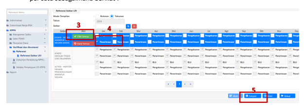
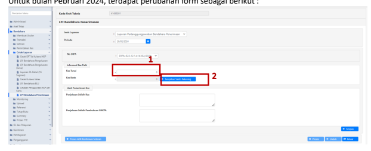
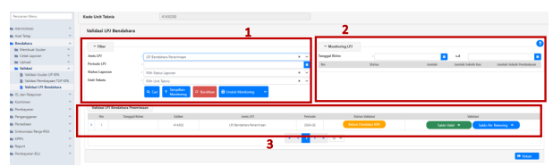
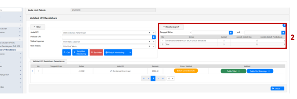
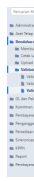
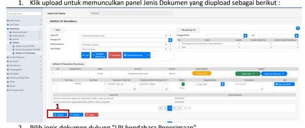
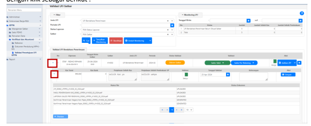
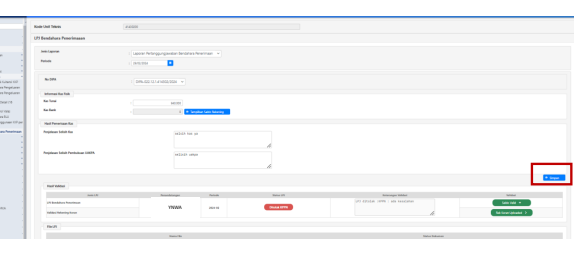

→
�
Petunjuk Teknis Aplikasi SAKTI)
�
→
Laporan Pertanggungjawaban Bendahara Penerimaan Konsep Baru Versi tanggal : 04/04/2024
�
→

# Daftar Isi

Bagian 1 - Setup Referensi Satker LPJ di KPPN
Bagian 2 - Penyusunan LPJ Bendahara Penerimaan Konsep Baru Bagian 3 - Validasi LPJ Bendahara oleh KPA Satker Bagian 4 - Validasi LPJ Bendahara KPPN Pada Staff KPPN
Bagian 5 - Validasi LPJ Bendahara KPPN Pada Kasi KPPN
Bagian 6 - Validasi Tolak LPJ Bendahara oleh KPPN BAGIAN 1 Setup Referensi Satker LPJ di KPPN KPPN dapat melakukan pengaturan aktif/inaktif satker wajib LPJ pada menu KPPN - Verifikasi dan Akuntasi - Referensi - Referensi Satker LPJ. Tampilan dengan filter mode tampilan bulanan adalah 

Sedangkan tampilan dengan filter mode tampilan tahunan adalah sebagai berikut :

1. Ceklis pada satker yang dipilih. 2. Klik tombol "Ubah".

3. Klik "Pilih Semua" untuk memilih seluruh jenis LPJ pada satker yang diceklis untuk 1 tahun penuh.

4.    Ceklis pada bulan dan jenis LPJ tertentu jika akan melakukan pemilihan secara manual satu per satu sebagaimana berikut :

5.    Klik "Simpan" untuk menyimpan data.

BAGIAN 2 Penyusunan LPJ Bendahara **Penerimaan Konsep Baru**
Agar mempermudah penjelasan, pada juknis ini **diasumsikan** LPJ bendahara penerimaan konsep baru mulai diimplementasikan pada Bulan Pebruari **2024**. Maka LPJ untuk bulan Januari 2024 tetap dapat 

Untuk bulan Pebruari 2024, terdapat perubahan form sebagai berikut :

1. Informasi Kas Fisik pada kolom Kas Tunai diisi angka.

 2. Informasi Kas Fisik pada kolom Kas Bank diisikan per detail rekening dengan klik tombol 
"Tampilkan Saldo Rekening". Nilai kumulatif akan ditampilkan pada kolom Kas Bank. Berikut tampilan pada sub menu Informasi Kas Fisik Per Rekening. 

Jika terdapat selisih Kas lakukan perekaman penjelasan selisih sebagai berikut. Setelah informasi kas 

Akan muncul sub-menu Form Cari Penandatangan. Silahkan pilih KPA penandatangan LPJ, kemudian 

1. Status LPJ akan ditampilkan "Belum Dikirim Bendahara". 

2. Status validasi data "Dalam Antrian Pembuatan Konsep". Klik berkala tombol ini untuk melakukan refresh status pembuatan konsep LPJ. Setelah proses antrian selesai, maka tombol berubah menjadi "Antrian Diproses" sebagai berikut :

3. Status Upload rekening koran "Belum Upload 3 Rek Koran" mengindikasikan jumlah rekening koran yang belum diupload sesuai jumlah rekening yang dikelola Bendahara Penerimaan.

4. Status file konsep LPJ beserta lampirannya "Diproses".

1. Tombol Validasi saldo akan menampilkan "Saldo Valid" dan berwarna hijau jika pengujian saldo dengan data LPJ bulan lalu telah valid. Tombol validasi saldo akan menampilkan "Saldo Tidak Valid" dan berwarna merah jika masih terdapat saldo yang belum valid.

2. Pada kolom "Keterangan Validasi" akan ditampilkan keterangan saldo yang belum valid, maupun keterangan tolakan dari KPA atau dari KPPN.

3. File LPJ Bendahara Penerimaan, hasil pemeriksaan kas dan Laporan Detail Rekening menjadi berstatus "Konsep". Status ini berarti file cetakan PDF telah selesai dihasilkan SAKTI namun masih berupa konsep yang belum divalidasi oleh KPA. File Konfirmasi Penerimaan negara dan suplemen LPJ berstatus "Generated" berarti telah selesai dihasilkan SAKTI.

Untuk melihat hasil validasi saldo, dapat dilakukan sebagai berikut :

2. Pada sub menu Verifikasi, SAKTI secara otomatis melakukan perbandingan data. Keterangan hasil perbandingan data sebagai berikut : - Jika hasil perbandingan antar saldo sama maka akan ditampilkan keterangan "Nilai Sama" dengan warna hijau dan LPJ dapat dikirimkan ke KPA. 

- Jika hasil perbandingan antar saldo berbeda namun perbedaan tersebut dapat dilanjutkan 
(contohnya perbedaan saldo kas tunai dengan hasil pemeriksaan) maka akan ditampilkan keterangan "Nilai Tidak Sama" dan LPJ tetap dapat dikirimkan ke KPA. 

- Jika hasil perbandingan antar saldo berbeda dan tidak dapat dilanjutkan (contohnya perbedaan saldo kas bank dengan hasil pemeriksaan) maka akan ditampilkan keterangan "Nilai Tidak Sama" dan LPJ tidak dapat dikirimkan ke KPA. Lakukan perbaikan transaksi pada pencatatan bendahara dan "Simpan" ulang untuk membentuk data LPJ Kembali.

Klik "Tutup" untuk kembali ke menu LPJ Bendahara.

Setelah validasi saldo valid, langkah selanjutnya adalah upload rekening koran sebagai berikut :

2. Akan terbuka daftar rekening yang wajib dilaporkan Bendahara Penerimaa ke KPPN . Lakukan 

3. Klik tombol "Choose" untuk memilih. File yang dapat diupload hanya dalam format **.pdf**. 

Rekening koran dalam format **.pdf** yang dapat diunggah maksimal sebesar **5 MB**. Terdapat validasi sebagai berikut jika dokumen yang dipilih lebih besar :

6. Setelah seluruh rekening koran di unggah, maka statusnya akan menjadi "Rek Koran Uploaded" 

Setelah unggah rekening koran selesai langkah selanjutnya yaitu cetak LPJ beserta lampiranlampirannya untuk disampaikan ke KPA. Langkah-langkah pencetakan dokumen sebagai berikut :

1. Pilih dokumen yang akan dipilih, dalam contoh diatas dipilih konsep LPJ Bendahara Penerimaan.

2. Klik "Preview" untuk membuka "menu Preview Konsep".

3. Pada menu "Preview Konsep" ditampilkan konsep LPJ bendahara Penerimaan. Bendahara dapat melakukan pengecekan pada saldo yang ditampilkan. Klik daftar dokumen untuk melihat konsep dokumen lainnya sebagai berikut :
4. Jika konsep cetakan dianggap sudah sesuai, klik "Unduh" untuk mengunduh dokumen

cetakan. Klik "Unduh" pula pada masing-masing dokumen.

5. Klik tombol "Tutup" di sudut kanan bawah atau tombol "x" di sudut kanan atas untuk keluar menu preview dan Kembali ke menu LPJ sebagai berikut :

Langkah terakhir setelah dokumen diunduh, Bendahara Penerimaan melakukan kirim LPJ ke KPA

2. Setelah kirim berhasil, maka status LPJ akan berubah menjadi "Dikirim Bendahara".

3. Kirim LPJ ke KPA masih dapat dibatalkan jika KPA belum melakukan validasi setuju atau tolak 

Bila saat kirim KPA muncul peringatan belum unduh , agar dilakukan klik preview kemudian download masing-masing dokumen untuk ditandatangani terlebih dahulu. Pastikan semua daftar dokumen sudah di download)

BAGIAN 3 Validasi LPJ Bendahara oleh KPA **Satker** Pada konsep baru, LPJ harus di validasi oleh KPA Satker. Validasi LPJ dapat dilakukan pada menu 

 Bendahara - Validasi - Validasi LPJ Bendahara, sebagai berikut : 
Menu validasi LPJ Bendahara terdiri dari beberapa panel sebagai berikut :

1.

Panel "Filter" digunakan untuk menerapkan filter tampilan data LPJ yang akan ditampilkan.

Secara default LPJ akan ditampilkan untuk semua jenis LPJ di satker tersebut dalam 1 tahun anggaran login. Filter yang dapat diterapkan yaitu Jenis LPJ, Periode LPJ, Status Laporan, dan Unit Teknis. Terdapat juga tombol "Unduh Monitoring" yang dapat mencetak lembar monitoring dalam format .pdf dan .xlsx sebagai berikut :

Monitoring LPJ
Tahun  : 2024

| NO    | JENIS LPJ                |  DESKRIPSI             | JUMLAH   |  SELISIH BUKU   |  SELISIH KAS   |
|-------|--------------------------|------------------------|----------|-----------------|----------------|
| 1     | LPJ Bendahara Penerimaan | Belum Dibuat Bendahara | a        | 0               |                |
| Total | 3                        |                        |          |                 |                |

Tanggal/Jam Cetak : 25-04-2024 08:35 Halaman : 1/1

| Detail Monitoring LPJ                  |               |                        |                           |         |        |              |             |
|----------------------------------------|---------------|------------------------|---------------------------|---------|--------|--------------|-------------|
| Tahun  : 2024                          |               |                        |                           |         |        |              |             |
| NO                                     | Jenis LPJ     | Kode Satker            | Deskripsi                 | Perlode | Jumlah | Selisih Buku | Selisih Kas |
| LPJ Bendahara
Penerimaan                                        | 41430200      | Belum Dibuat Bendahara | 2024-02, 2024-03, 2024-04 | 3       | o      |              |             |
| 1                                      | Total         | o                      |                           |         |        |              |             |
| 3                                      | 0             |                        |                           |         |        |              |             |
| Tanggal/Jam Cetak :  25-04-2024  08:35 | Halaman : 1/1 |                        |                           |         |        |              |             |

2.

Panel "Rekapitulasi LPJ" berisi informasi seluruh LPJ per status masing-masing pada tahun anggaran login.

4. Terdapat tombol "Saldo Valid" dan "Saldo Per Rekening". Kedua tombol ini memiliki fungsi yang sama dengan tombol pada menu bendahara. Tombol "Saldo Valid" dapat di klik untuk membuka sub-menu "Verifikasi Laporan Pertanggung Jawaban PER-3/PB/204 pasal 11 Ayat 3". Saldo Per Rekening dapat di klik untuk menampilkan saldo rekening dan mengunduh rekening 

Tanggal validasi secara *default* ditampilkan hari ini (*sysdate*). Tanggal validasi dapat diubah dan 

Jika dilakukan validasi setuju, status validasi akan berubah dari sebelumnya "Belum Divalidasi KPA" 

menjadi "Divalidasi KPA". Status data akan berubah menjadi "Antrian Diproses". Klik tombol "Antrian Diproses", untuk mengetahui jika proses validasi KPA sudah selesai dan tombol berubah menjadi "Saldo Valid".

Setelah antrian LPJ diproses maka LPJ bendahara, buku pemeriksaan kas dan laporan detail rekening berstatus konsep akan dihapus otomatis. Tersisa suplemen LPJ dan konfirmasi penerimaan negara, yang tidak dihapus otomatis berstatus "generated". Dokumen ini tidak memerlukan tanda tangan 

Sedangkan LPJ bendahara, buku pemeriksaan kas dan laporan detail rekening yang sudah ditandatangani oleh KPA harus di *upload* kembali.

2. Pilih jenis dokumen dukung "LPJ bendahara Penerimaan". 3. Klik "Choose" untuk memilih dokumen. Jenis dokumen yang dapat di unggah hanya **.pdf**

 

6. Lakukan proses unggah juga untuk hasil pemeriksaan kas dan laporan detail rekening yang telah ditandatangani KPA. Terdapat juga pilihan dokumen "Lainnya" untuk mengunggah dokumen lain yang diperlukan/dipersyaratkan KPPN. Jika terdapat lebih dari 1 dokumen 

7. Selain dari menu Validasi LPJ Bendahara pada *user* KPA, unggah dokumen bertanda tangan juga dapat dilakukan dari user Bendahara Penerimaan sebagai berikut. 

8. Setelah seluruh dokumen bertanda tangan di unggah, klik "Kirim ke KPPN" untuk mengirim LPJ 

9. Status validasi akan berubah menjadi "Dikirim ke KPPN".

10. Tanggal upload akan terisi sesuai tanggal kirim ke KPPN.

BAGIAN 4 Validasi LPJ Bendahara KPPN **Pada Staff KPPN**
Validasi LPJ Bendahara di KPPN dilakukan 2 tahap yaitu oleh staff KPPN dan kepala seksi KPPN. Akses di SAKTI dilakukan melalui menu KPPN - Verifikasi dan Akuntasi - Validasi Persetujuan LPJ sebagai  Menu "Validasi Persetujuan LPJ KPPN" terdiri dari 3 panel utama sebagai berikut :

1. Panel "Filter" digunakan untuk menerapkan filter tampilan data LPJ yang akan ditampilkan. 

Secara *default* LPJ ditampilkan untuk jenis LPJ Bendahara Penerimaan satker-satker dalam lingkup KPPN dalam 1 tahun anggaran login. Filter yang dapat diterapkan yaitu Jenis LPJ, 
Periode LPJ, Status Laporan, dan satker. Terdapat juga tombol "Unduh Monitoring" yang dapat mencetak lembar monitoring dalam format .pdf dan .xlsx.

2. Panel "Rekapitulasi LPJ" berisi informasi seluruh LPJ per status masing-masing pada tahun anggaran login. Pada tahap awal hanya LPJ Bendahara Penerimaan yang ditampilkan. 

3. Panel "Validasi LPJ Bendahara Penerimaan" berisi LPJ Bendahara Penerimaan satker-satker di lingkup KPPN pada tahun anggaran login. 

Untuk melakukan validasi LPJ, klik "*Assign*" agar data LPJ tersebut dikunci dan tidak dapat di validasi oleh *user* staff KPPN yang lainnya.

Tombol "Assign" akan menjadi warna hijau dan pada kolom "Diproses" ditampilkan nama staf serta 

  Pada sisi kanan panel menu terdapat tombol "Jadikan ZIP". Tombol ini dapat digunakan untuk 

 mengunduh dokumen .pdf LPJ dalam 1 file ZIP tunggal. Untuk mengunduh file ZIP lengkap dengan lampiran rekening koran dapat klik "Rekening Koran". Sedangkan untuk mengunduh file ZIP berisi LPJ, buku pemeriksaan kas dll tanpa rekening koran dapat klik "Selain Rekening Koran" . Berikut contoh isi file ZIP lengkap dengan rekening koran yang di unggah satker :
Untuk melakukan validasi dan membuka detail lampiran LPJ, staff KPPN dapat melakukan *expand* data 

 dengan klik sebagai berikut :
Klik slider validasi ke warna hijau untuk menyetujui, atau ke warna merah untuk tolak.

Tanggal validasi secara *default* ditampilkan hari ini (*sysdate*). Tanggal validasi dapat diubah dan keterangan dapat diisi sebagai berikut :
Untuk menampilkan cetakan LPJ ataupun lampirannya secara satu per satu dapat dilakukan dengan 

 memilih (*select*) file LPJ Bendahara dilanjutkan klik preview sebagai berikut : 

BAGIAN 5 Validasi LPJ Bendahara KPPN Pada Kasi KPPN
Validasi LPJ Bendahara pada kepala seksi KPPN dapat diakses melalui menu KPPN - Verifikasi dan 

Akuntasi - Validasi Persetujuan LPJ KPPN sebagai berikut.

Tampilan menu validasi persetujuan LPJ KPPN pada user kasi KPPN sama dengan pada user staff KPPN. Untuk melakukan validasi dan membuka detail lampiran LPJ, kasi KPPN dapat melakukan *expand* data  Tanggal validasi secara *default* ditampilkan hari ini (*sysdate*). Tanggal validasi dapat diubah dan keterangan dapat diisi sebagai berikut :
Untuk menampilkan cetakan LPJ ataupun lampirannya secara satu per satu dapat dilakukan dengan 

 memilih (*select*) file LPJ Bendahara dilanjutkan klik preview sebagai berikut : 

BAGIAN 6 Validasi Tolak LPJ Bendahara oleh KPPN
Beberapa hal terkait validasi tolak LPJ Bendahara adalah sebagai berikut :

A. Staff atau Kasi KPPN dapat melakukan validasi tolak saat LPJ satker masih berstatus "Dikirim Satker", "Divalidasi Staff KPPN", ataupun ditolak kembali setelah sudah berstatus "Divalidasi Kasi KPPN". Validasi tolak oleh user KPPN dilakukan sebagai berikut :
1. Klik slider validasi ke warna merah untuk tolak.

2. Kolom keterangan wajib diisi jika melakukan validasi tolak. 3. Klik "Simpan".

Selanjutnya, status validasi akan berubah menjadi "Ditolak KPPN" sebagai berikut :

 Validasi tolak yang dilakukan oleh staff KPPN atau kasi KPPN sama-sama menghasilkan status validasi 
"Ditolak KPPN".

B. Jika status LPJ "Ditolak KPPN" maka Bendahara Penerimaan dapat melakukan pembentukan ulang data LPJ dengan klik "Simpan" sebagai berikut :

Status LPJ berubah Kembali menjadi "Belum Dikirim Bendahara"
C. Jika satker melakukan perubahan data LPJ pada periode yang telah disetujui sebelumnya, KPPN 
harus melakukan validasi tolak secara berurutan. Sebagai contoh, LPJ satker telah diterima KPPN dari periode 2024-01 sampai dengan 2024-04. Satker akan melakukan perubahan transaksi dan LPJ pada periode 2024-02, maka KPPN perlu memberikan validasi tolak pada LPJ periode 2024-04 sampai dengan 2024-02 secara berurutan. 

-Selamat bertransaksi LPJ bendahara dengan konsep baruBila ada kendala terkait LPJ bendahara SAKTI , silahkan menghubungi KPPN Mitra kerja atau HAIDJPb