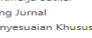
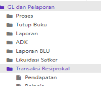

1
2020 Petunjuk Teknis

# Aplikasi Sakti

Modul Persediaan Modul GL & Pelaporan MODUL GLP

# Daftar Isi

| HALAMAN JUDUL              |
|----------------------------|
| DAFTAR ISI                 |
| Jurnal Manual              |
| Validasi Jurnal            |
| Posting Jurnal .           |
| Monitoring Jurnal          |
| Jurnal Penyesuaian Khusus  |
| Jurnal Balik .             |
| Monitoring Tutup Transaksi |
| T THE THE STAT             |
| Transaksi Resiprokal       |
| Laporan                    |

2

# Jurnal Manual Deskripsi Singkat

## Jurnal Manual

Jurnal Manual adalah fasilitas yang disediakan oleh modul GLP untuk mecatat jurnal manual melalui modul GL yang tidak terkait dan tidak mengikuti aturan di peta jurnal, dapat digunakan untuk membuat semua jurnal yang tidak terdapat pada menu Jurnal Penyesuaian Khusus.

| No.     | Uraian                           | Penjelasan                                                                                                                                                                                                                                                                       |                    |
|---------|----------------------------------|----------------------------------------------------------------------------------------------------------------------------------------------------------------------------------------------------------------------------------------------------------------------------------|--------------------|
| 1       | Nama Menu                        | GL dan Pelaporan >Proses>Jurnal Manual                                                                                                                                                                                                                                           |                    |
| 2       | Deskripsi Menu                   | Jurnal Manual adalah fasilitas yang disediakan oleh modul  GLP untuk mecatat jurnal manual melalui modul GL yang  tidak terkait dan tidak mengikuti aturan di peta jurnal, dapat  digunakan untuk membuat semua jurnal yang tidak  terdapat pada menu Jurnal Penyesuaian Khusus. |                    |
| 3       | Role User                        | OPR GLP                                                                                                                                                                                                                                                                          |                    |
| 4       | Modul dan Transaksi Lain yang    | BEN; KOM; PEM; PER; MAT;                                                                                                                                                                                                                                                         |                    |
| Terkait |                                  |                                                                                                                                                                                                                                                                                  |                    |
| 5       | Dokumen Sumber                   | Memo Jurnal                                                                                                                                                                                                                                                                      |                    |
| 6       | Validasi                         | Nilai jurnal harus seimbang Debet dan Kredit, periode  buku                                                                                                                                                                                                                      |                    |
| 7       | Tata cara perekaman              | - pada menu GL dan Pelaporan >Proses>Jurnal Manual - Pilih periode Jurnal Manual yang diinginkan - Rekam jurnal manual                                                                                                                                                           |                    |
| 8       | Kriteria yang wajib diperhatikan | - Nilai Debet dan Kredit harus diperhatikan                                                                                                                                                                                                                                      |                    |
| 9       | Output                           | -                                                                                                                                                                                                                                                                                | - Laporan Keuangan |

Langkah-langkah membuat jurnal manual 1. Login menggunakan user operator GLP pada menu GL dan Pelaporan >Proses>Jurnal Manual 3

MODUL GLP

4

2. Pilih periode Jurnal Manual yang diinginkan

5. Pilih tanngal dokumen, tanggal transaksi, isi No. Dokumen, isi deskripsi, cari akun,posisi akun Debet (default), isikan Nominal, dan simpan.

40999.019.53311.0150800.00000.000000.0000.0000.1.0100.2.00000.0000

| Kode COA    |
|-------------|
| Posisi Akun |
| Nominal     |

| 40999.019.391116.0150800.000000.00000000.0000.1.0100.2.00000.00000   |
|----------------------------------------------------------------------|
| 9                                                                    |

Simpan data akun pilih ya, simpan berhasil, disini kita sudah merekam jurnal 1 baris sisi debet DAFTAR JURNAL
9.019.533111.0150800.00000.00.

Selanjutnya kita tambahkan sisi kredit, klik tambah akun DAFTAR JURNAL
Sisi Data Dokumen (kiri atas) tidak perlu diubah, sisi Data Akun (kanan atas) ubah akun,posisi akun kredit, nominal sama dengan sisi Debet, kemudian Simpan Akun Setelah kita simpan akun debet dan kredit kita lakukan simpan (bawah), jika berhasil jurnal akan masuk ke Buku Besar, lakukan Validasi dan Posting Jurnal agar masuk di Laporan.

osisi Akur

MODUL GLP

DATA AKUN
Kode Col 93

1

DATA AKUN
5 MODUL GLP

# Validasi Jurnal

Deskripsi Singkat

## Validasi Jurnal

Pada SAKTI validasi jurnal dilakukan otomasi secara terjadwal, namun demikian jika operator ingin mencetak laporan keuangan lebih cepat dapat dilakukan validasi jurnal secara mandiri yang kemudian dilanjutkan dengan posting jurnal. Setelah pengguna melakukan input data jurnal, pengguna dapat melakukan validasi data jurnal yang telah masuk kedalam Buku Besar di Modul GLP, baik melalui data-data jurnal yang berasal dari modul-modul lainnya maupun data jurnal yang diinput melalui modul GLP. 

| No.   |
|-------|

| 1                       | Modul   | GLP   |
|-------------------------|---------|-------|
| Role User               | OPR     |       |
| Modul Lain yang Terkait | -       |       |
| Transaksi yang Tekait   |         |       |

Dokumen Input

Output Laporan Keuangan

Langkah-langkah melakukan validasi jurnal:

1. Login menggunakan user operator GLP pada menu GL dan Pelaporan >Proses>Validasi Jurnal 2. Filter pencarian sesuai kebutuhan jurnal yang akan validasi 6

| Validasi   |
|------------|

MODUL GLP

PiEb Semua Hala

| S   | EN-402299-2   |
|-----|---------------|

| 2020-03     | 02/285/4     |
|-------------|--------------|
| the control |              |
| 2020-01     | 10001/585/40 |
| 1020.01     |              |
| 2029-03     |              |

| 21211        |
|--------------|
| in the state |
| 11711        |
| 471111       |
| 11626        |
| 33333        |

| KAN/Akru    | Debe       | Kredit        |               |               |              |      |
|-------------|------------|---------------|---------------|---------------|--------------|------|
| uber Data   |            |               |               |               |              |      |
| 00          | BEN        | 8N-42000-2.   | 111826        | ANA           | 15,002,00,00 | 0,00 |
| BEN         | RN-42000-2 | 421211        | Anua          | 00            | 15,002,00,00 |      |
| BEN         | 313121     | Aknun         | 15,002,000,00 | 00            |              |      |
| 0001/SBS/40 | BEN        | 11711         | Aour          | 10.00.00.00   | 0.00         |      |
| BEN         | 421512     | Aous          | 0,00          | 10.002.000.00 |              |      |
| on          | 11820      | 0.00          | 15,002,00,00  |               |              |      |
| er          | 313121     | 15,000,000,00 | 0,00          |               |              |      |
| --          |            |               |               |               |              |      |

| Tgl Jurnal   |
|--------------|
| 1-03-2020    |
| 1-03-2025    |
| 1-03-2025    |
| 1-05-2021    |

| Printing   |
|------------|
| 2020-03    |
| 2020-03    |
| 200-03     |
| 2020-03    |
| 2020-03    |
| 2020-05    |
| 2020-03    |

Validasi Daftar Jurnal 11.032.978.327,00 11,032,978,327,00 Konfirmasi pilih Ya 4.

Konfirmasi Apakah Anda yakin akan melakukan proses Validasi A
Semua Jurnal?

5.   Validasi berhasil Pilih OK, maka jurnal siap diposting Validasi Jurnal x Proses Validasi Jurnal berhasil A
 Validasi jurnal dapat dilakukan perhalaman atau semua halaman (idealnya semua 3.

halaman), pilih semua (kanan atas) lalu pilih semua halaman (kanan bawah), Klik Proses Proses Validat Balal MIN
Jah Debet Jumlah Kredit S
7 MODUL GLP

# Posting Jurnal

Deskripsi Singkat POSTING JURNAL
Posting jurnal dilakukan otomasi secara terjadwal, namun demikian jika operator ingin mencetak laporan keuangan lebih cepat dapat dilakukan posting jurnal secara mandiri yang didahului dengan validasi jurnal. Data jurnal yang telah diposting ke Neraca Saldo 
(Trial Balance) & Neraca Percobaan tersebut akan menjadi data acuan dalam proses pembuatan laporan.

No.

| 1               | Modul   | GLP   |
|-----------------|---------|-------|
| Role User       | OPR     |       |
| Modul Lain yang | -       |       |
| Terkait         |         |       |

Transaksi yang Tekait Dokumen Input Validasi

| Output   | LO,LPE,NERACA,LRA   |
|----------|---------------------|

Langkah-langkah melakukan validasi jurnal:
1. Login menggunakan user operator GLP pada menu GL dan Pelaporan >Proses>Posting Jurnal 2. Pilih semua halaman

 3. Pilih semua halaman 4. Klik Proses 8 MODUL GLP

| Filter Pencarian   |               |             |    |
|--------------------|---------------|-------------|----|
| Sumber Data/Modul  | ����          |             |    |
| Pilih Semua        |               |             |    |
| Kelompok Jurnal    | Pilin Semua   |             |    |
| Sub Kelompok Jumal | Jenis Dokumen |             |    |
| Pith Semua         |               |             |    |
| Tipe Jurnal        | Pilin Semua   | No. Dokumen |    |
| Periode            | Pilis Service |             |    |
| Tanggal Jurnal     | a             | s/d         | e  |

  
 Q. Libat Q. Cari Daftar Jurnal

| Daftar Jurnal   | 2 Pile Se   |                              |             |                  |           |                   |                        |            |            |    |
|-----------------|-------------|------------------------------|-------------|------------------|-----------|-------------------|------------------------|------------|------------|----|
| Kode Buku       |             |                              |             |                  |           |                   |                        |            |            |    |
| Tol Jurnal      | Periode     | No. Dokumen    Jeris Dokumen | Sumber Data | Kode Akun        | Nama Akum | Kas/Akrual        | Debet                  | Kredit     | Posting    |    |
| 31-12-2019      | 2019-12     | 123                          | GLP         | GLP-119752-80... | 139111    | Aset Tetap yan..  | Akrust                 | 999,000,00 | 0,00       | s  |
| 31-12-2019      | 2019-12     | 123                          | GLP         | GLP-119752-80..  | 532111    | Belaria Modal ... | Akrust                 | 0,00       | 999,000,00 |    |
| .               | .           | -                            | .           | x                | 10        | ,                 | 1  Pilih Semua Halaman |            |            |    |

1  Pilih Semua Halaman 4 Process Cessi
- Kelusr MODUL GLP
Monitoring Jurnal Deskripsi Singkat MONITORING JURNAL
Semua transaksi data jurnal yang telah masuk ke modul GL dan Pelaporan dapat di lihat melalui fitur ini, monitoring jurnal dapat juga berfungsi untuk melakukan penelusuran data transaksi ke dokumen sumber dari semua modul dalam rangka melakukan telaah Laporan Keuangan No.

| 1               | Modul                | GLP   |
|-----------------|----------------------|-------|
| Role User       | OPR                  |       |
| Modul Lain yang | KOM;PER;MAT;BEN;PEM; |       |
| Terkait         |                      |       |

Transaksi yang Tekait Dokumen Input Output Validasi

A. Langkah-langkah melakukan monitoring jurnal.

1. Login menggunakan user operator GLP pada menu GL dan Pelaporan >Proses>Monitoring Jurnal 2. Muncul form seperti dibawah ini, pilih parameter untuk mempermudah pencariaan jurnal 

transaksi.

10 MODUL GLP

| 211          |        |        |               |       |      |
|--------------|--------|--------|---------------|-------|------|
| 21           |        |        |               |       |      |
| 0011         | 425151 | 0,00   |               |       |      |
| 1112-112752. | 0011   | 211    | 525513.1188   | 51111 | 0.00 |
| 0011         | 21     | 212111 | 0,00          |       |      |
| .20018.1188  |        |        |               |       |      |
| 211          |        |        |               |       |      |
| 011          | sssss  |        |               |       |      |
| 21           | 21211  |        |               |       |      |
| 0011         | 211    | 51112  | 10,422,150,00 |       |      |

B. Hal-hal yang dapat dilakukan dengan monitoring jurnal.

1.

Melihat status validasi jurnal, apakah jurnal tersebut sudah dilakukan proses validasi atau belum. Jika sudah divalidasi, kolom Divalidasi akan tercentang.

| Jealt   |        |       |             |          |     |      |
|---------|--------|-------|-------------|----------|-----|------|
| 211     | Arun   |       |             |          |     |      |
| 115212  |        |       |             |          |     |      |
| 21      | 425131 | AAA   | 0,00        | 1.462,00 |     |      |
| 211     | ..     | 51111 | 19752.009.5 | AAA      | 000 | 0,00 |
| 21      | 212111 | AY    | 0.00        |          |     |      |
| 211     | 511115 | AY    | 65,00       | 0.00     |     |      |
| 21      | AAA    | 00    |             |          |     |      |
| 211     |        |       |             |          |     |      |

belum. Jika sudah diposting, kolom Posting akan tercentang.
2. 3.

Melihat detil-histori jurnal, detil jurnal terutama yang berasal dari submodul dapat telusuri datanya. Klik baris jurnal kemudian klik detil, aplikasi akan membawa ke form sumber data transaksi.

11 MODUL GLP

| Dafter Jumel   | Kode Buku    |
|----------------|--------------|
| Tgl Jurnal     | Secon        |
| 01-01-2020     | SPM-119752-  |
| OLOGIC         | ISMITHISM    |
| 01-01-2220     | SPM-119752-. |
| 01-2220        | SPM-119752-. |
| 01-01-2020     | SPM-119752-1 |
| 01-01-2020     | SPM-119752-, |
| 01-01-2020     | SPM-119752-. |
| ..             |              |

| Jenis   |  Deskripgi   |               |           |                                    |              |                     |            |      |    |
|---------|--------------|---------------|-----------|------------------------------------|--------------|---------------------|------------|------|----|
| No Dok  | Kode Akun    | Kode Cos      | Nama Akun | Kas/Akrusl                         | Debet        | Kredit              | Validasi   |      |    |
| Dekum   | Itan         |               |           |                                    |              |                     |            |      |    |
| 0011    | 211          | $$            | 15212     | 19752023.1.                        | Patters Lamp | Abus                | 519.462.00 | 0,00 | s  |
| ....... | 211          | 11            | ' POR     | 119152018.4. Pendspelan S.         | Acus         | ..                  | 2184201    |      |    |
| 001T    | 211          | 596818.11888. | 51111     | 119752.009.5   Belania Gaji P.,    | Akrual       | 204,404,900,00      | 0,00       | S    |    |
| 0011    | 211          | 555515.11888. | 212111    | 119752.009.2  Belaria pega         | Acust        | 0.00 204.404.901.00 | <          |      |    |
| 001T    | 211          | 555515.11888. | 51119     | 119752.009.5  Belanja Pemb..       | Akrusi       | 3,625,00            | 0,00       | <    |    |
| s       |              |               |           |                                    |              |                     |            |      |    |
| 0011    | 211          | 555518.11888. | 212111    | 119752/009.2                       | Acust        | 0,00                | 3,625,00   |      |    |
| 001T    | 211          | 598818.11888. | 511121    | 119752.009.5 ... Belania Tuni. ... | Arust        | 10.499.150,00       | 0,00       | s    |    |
| ----    | ...          | ---------     | ..        | ---                                |              |                     |            |      |    |
| l       | 2            |               | 4         | s                                  | 10 >         |                     |            |      |    |

| Vasdasi   |
|-----------|
| eding     |
| n         |
| <         |
| <         |
| <         |
| >         |
| <         |

D Yellar Menampilkan data jurnal permodul, per-kelompok jurnal hinga yang lebih detil.

| Filter Pencarian   |                  |             |       |
|--------------------|------------------|-------------|-------|
| Sumber Data/Modul  | AST - Aset Tetap | c           |       |
| Kelompok Jurnal    | Pain Semua       | c           | Tahun |
| Jen's Dokumen      |                  |             |       |
| Sub Kelompok Jumal | Pilih Semus      | >           | o     |
| Tipe Juma          | <                | No. Dokumen |       |
| Plih Senua         | 3                |             |       |
| Periode            | PITh Semua       |             |       |
| Tangeal Jurnal     | s/d              |             |       |

9. Linet 9. Lest

 9  Cari

## 4.

| Daftar Jurnal             | Kode Buku   | No Dok     | Jetis         | Deskripsi   | Kode Akan                     | Kode Coa   |  Nama Akun   |  Kas/Aknel   | Debet   | Kredit   | Validad   | V35d25   |
|---------------------------|-------------|------------|---------------|-------------|-------------------------------|------------|--------------|--------------|---------|----------|-----------|----------|
| Tgl Jumal                 | Besar       | Dokamer    | Trans         | Posting     |                               |            |              |              |         |          |           |          |
| 01-01-2020 SPM-119752-... | 001T        | 211        | 599918.45993. | 115212      | 19752.009.1... Pistang Lainn. | Akrual     | 519.462,00   | 0,00         | -       | s        |           |          |
| 01-01-2020 SPM-119752-    | 00011       | 21         | 555518.45393. | 425131      | 119752.009.4. Perdapatan S.   | <          | <            |              |         |          |           |          |
| Acust                     | 0,00        | 519.462.02 |               |             |                               |            |              |              |         |          |           |          |

## 5. Mencari Data Jurnal Berdasarkan Jenis Dan Nomor Dokumen.

| Filter Pencarian    |                |             |
|---------------------|----------------|-------------|
| Sumber Data/Modul   | Pilih Semua    |             |
| Kelompok Jurnal     | Tahun          |             |
| Pilih Semua         | >              | o           |
| Sub Kelompok Jurnal | Jenis Dokument |             |
| Plin Semua          | c              |             |
| Tipe Jumal          | a              | No. Dokumen |
| Pilin Semua         | <              |             |
| Periode             | Pilin Server   | >           |
| Tanggal Jumal       | s/d            |             |

| 2020     | 9. Liber   |
|----------|------------|
| 9. Liber |            |

 9 Cari Daftar Jurnal

| Kode Buku              | Jenis       | Deskripsi   | Videoi        |               |                               |                               |        |            |      |    |
|------------------------|-------------|-------------|---------------|---------------|-------------------------------|-------------------------------|--------|------------|------|----|
| Tgl Jumal              | No Dok      | Kode Aloun  | Kode Coa      | Nama Akun     | Kas/Akrus/                    | Detet                         | Kredit | Validasi   |      |    |
| Beser                  | Doloument   | Trans       | Posting       |               |                               |                               |        |            |      |    |
| 01-01-2020             | SPM-119752- | 0011        | 211           | 555518.45893. | 15212                         | 119752.009.1..  Piutarg Lains | Akrual | 513.462,00 | 0,00 | A  |
| 01-01-2020 SPM-119752. | 001T        | 21          | 555518.45883. | 425131        | 119752.009.4... Pendapatan S. | Arus                          | 00     | 519.452.01 | <    |    |

# Jurnal Penyesuaian Khusus

## Deskripsi Singkat Jurnal Penyesuaian Khusus

| Fitur ini digunakan untuk mempermudah pengguna dalam melakukan jurnal penyesuaian,  jurnal penyesuaian khusus akan memberikan pasangan jurnal secara otomatis sesuai  dengan referensi pasangan jurnal yang sudah dipastikan, jurnal yang terbentuk adalah  berbasis akrual.   |                                  |                                                                                                                                                                                                                                                                                 |                    |
|--------------------------------------------------------------------------------------------------------------------------------------------------------------------------------------------------------------------------------------------------------------------------------|----------------------------------|---------------------------------------------------------------------------------------------------------------------------------------------------------------------------------------------------------------------------------------------------------------------------------|--------------------|
| No.                                                                                                                                                                                                                                                                            | Uraian                           | Penjelasan                                                                                                                                                                                                                                                                      |                    |
| 1                                                                                                                                                                                                                                                                              | Nama Menu                        | GL dan Pelaporan >Proses>Jurnal Penyesuaian Khusus                                                                                                                                                                                                                              |                    |
| 2                                                                                                                                                                                                                                                                              | Deskripsi Menu                   | Fitur ini digunakan untuk mempermudah pengguna  dalam melakukan jurnal penyesuaian, jurnal  penyesuaian khusus akan memberikan pasangan  jurnal secara otomatis sesuai dengan referensi  pasangan jurnal yang sudah dipastikan, jurnal yang  terbentuk adalah berbasis akrual.. |                    |
| 3                                                                                                                                                                                                                                                                              | Role User                        | OPR GLP                                                                                                                                                                                                                                                                         |                    |
| 4                                                                                                                                                                                                                                                                              | Modul dan Transaksi Lain yang    | BEN; KOM; PEM; PER; MAT;                                                                                                                                                                                                                                                        |                    |
| Terkait                                                                                                                                                                                                                                                                        |                                  |                                                                                                                                                                                                                                                                                 |                    |
| 5                                                                                                                                                                                                                                                                              | Dokumen Sumber                   | Memo Jurnal                                                                                                                                                                                                                                                                     |                    |
| 6                                                                                                                                                                                                                                                                              | Validasi                         | AkunjJurnal telah disediakan pasangannya, Nilai jurnal  harus seimbang Debet dan Kredit, periode buku                                                                                                                                                                           |                    |
| 7                                                                                                                                                                                                                                                                              | Tata cara perekaman              | - pada menu GL dan Pelaporan >Proses>Jurnal  Manual - Pilih periode Jurnal Manual yang diinginkan - Rekam jurnal manual                                                                                                                                                         |                    |
| 8                                                                                                                                                                                                                                                                              | Kriteria yang wajib diperhatikan | - Nilai Debet dan Kredit harus diperhatikan                                                                                                                                                                                                                                     |                    |
| 9                                                                                                                                                                                                                                                                              | Output                           | -                                                                                                                                                                                                                                                                               | - Laporan Keuangan |

Langkah-langkah membuat jurnal penyesuaian khusus:
1. Login menggunakan user operator GLP pada menu GL dan Pelaporan >Proses>Jurnal Penyesuaian Khusus MODUL GLP
2. Muncul form seperti dibawah ini, pilih periode yang akan dijurnal, isi No. Dokumen kemudian Rekam.

3. Isikan Data Dokumen dan Data Akun seperti dibawah ini secara berurutan nomor 1 s.d 5

## Jurnal Khusus

A
Simpan data Jurnal?

28 s Ya x Tidak 4.

Setelah itu jangan lupa simpan kanan bawah

14 MODUL GLP
Jurnal Penyesuaian Khusus x A Data Jurnal Penyesuaian Khusus dengan kode buku besar GLP-119752-8042995 berhasil disimpan o 5. Data jurnal berhasil masuk ke Buku Besar dengan status belum validasi dan posting (lihat petunjuk validasi dan posting jurnal).

Jurnal Balik MODUL GLP
Deskripsi Singkat JURNAL BALIK
Jurnal Balik pada umumnya digunakan untuk membalik jurnal penyesuaian **yang** dilakukan pada awal periode setelah penutupan buku besar serta membuat neraca saldo setelah penutupan di periode sebelumnya dan dapat juga digunakan pada TAB 
karena kesalahan membuat jurnal.

No.

| 1         | Modul   | GLP   |
|-----------|---------|-------|
| Role User | OPR     |       |

Modul Lain yang Terkait Transaksi yang Tekait Dokumen Input

| Output   |
|----------|

Validasi A. Langkah-langkah membuat jurnal balik awal tahun misal 2020:

1. Login TA 2019 menggunakan user operator GLP pada menu GL dan Pelaporan 
>Proses>Jurnal Penyesuaian Khusus/Manual (dalam juknis ini dicontohkan membalik jurnal penyesuaian khusus)

MODUL GLP
2. Pilih Jurnal yang telah dibuat di Desember 2019 pada menu Jurnal Manual atau 

Penyesuaian Khusus yang akan dibalik diawal 2020, Maka tombol Jurnal Balik akan aktif 

3. Pilih Tanggal transaksi, isi No. Dokumen, Keterangan, kemudian proses

Proses berhasil klik Oke
4. Logout dan login TA 2020, status jurnal balik adalah belum validasi ,lakukan validasi dan posting untuk kebutuhan cetak Laporan Keuangan.

17 MODUL GLP
Daftar Jurnal

| Pilih Semua   |         |                                         |           |                 |            |                  |        |           |           |
|---------------|---------|-----------------------------------------|-----------|-----------------|------------|------------------|--------|-----------|-----------|
| Kode Buku     |         |                                         |           |                 |            |                  |        |           |           |
| Tgl Jumal     | Periode | No. Dokumen  Jenis Dokumen  Sumber Data | Kode Akun | Nama Akun       | Kas/Akrual | Debet            | Kredit | Validasi  |           |
| Besar         |         |                                         |           |                 |            |                  |        |           |           |
| 01-01-2020    | 2020-01 | 01 belik                                | e         | GLP-119752-80.. | 425131     | Pendapatan Sell  | Akrual | 0,00      | 12.000.00 |
| 01-01-2020    | 2020-01 | 01 belik                                | G         | GLP-119752-80.  | 219211     | Pendapetan Se... | Acrual | 12,000,00 | 0,00      |
| N             | l       | AAAA                                    | 10 ^      |                 |            |                  |        |           |           |

Pilih Semua Halaman Q Deti
✔ Proses Validasi 0  Ratal Validasi O   Betal Pila 8  Cetak
  

MODUL GLP
Monitoring Tutup Transaksi Deskripsi Singkat MONITORING TUTUP TRANSAKSI
Menu ini digunakan untuk melakukan monitoring tutup periode masing-masing modul untuk memastikan submodul telah tutup sebelum melakukan tutup periode GLP.

No.

| 1         | Modul   | GLP   |
|-----------|---------|-------|
| Role User | OPR     |       |

Modul Lain yang Terkait Transaksi yang Tekait Dokumen Input Output Validasi Langkah-langkah melakukan monitoring tutup transaksi:

1. Login menggunakan user operator GLP pada menu GL dan Pelaporan >Tutup Buku>Monitoring Tutup Transaksi.

2. Muncul form seperti dibawah ini MODUL GLP
20

1. Monitoring tutup transaksi perperiode 2. Menunjukkan periode yang diitutup 3. Menunjukkan Modul yang ditutup 4. Menunjukkan tanggal dilakukan tutup buku 5. Halaman terakhir menunjukkan monitoring tutup buku paling terakhir MODUL GLP

# Tutup Buku

Deskripsi Singkat TUTUP BUKU
Menu ini digunakan untuk tutup buku atau buka buku modul GLP sementara atau permanen.

No.

| 1               | Modul   | GLP   |
|-----------------|---------|-------|
| Role User       | OPR     |       |
| Modul Lain yang |         |       |

Modul Lain yang 

Terkait

Transaksi yang Tekait Dokumen Input Validasi

| Output   |
|----------|

A. Tutup Buku GLP Sementara.

Tutup Buku GLP Sementara digunakan untuk memindahkan saldo neraca periode sebelumnya ke awal bulan dan untuk keperluan *push* data interkoneksi rekonsiliasi bulanan SAKTI dengan e-Rekon. Selama status tutup periode sementara, operator GLP masih bisa melakukan buka periode kembali jika diperlukan.

Syarat-syarat melukan tutup buku GLP Sementara:
1. Modul Persediaan dan Aset Tetap telah dilakukan tutup buku 2. Modul Piutang telah tutup periode khusus bulan Juni dan Desember 3. Jurnal transaksi telah diposting Langkah-langkah melakukan tutup buku GLP Sementara: 3. Login menggunakan user operator GLP pada menu GL dan Pelaporan >Tutup Buku>Tutup Buku.

21

| Kode Periode #             | Kode Akun 14   | Nana Akan t                   | Sakido Akhir Debet 4   | Saldo Akhir Kredit S   |                  |
|----------------------------|----------------|-------------------------------|------------------------|------------------------|------------------|
| 2319-12                    | 11             | Kas di Bendahara Pengeluar... | SON                    | 200.000.00             | 200.00.00.00     |
| 2319-12                    | 11821          | Kas Lainnya di Bendahara Pea  | . Novel                | 1,474,659251,00        | 1,474,659,251,02 |
| 22                         | 115121         | 1,732,871,854,00              | 3325341,00             |                        |                  |
| 2019-12                    | 115122         | Putano PPh Passi 22           | NOUN                   | 3,705,248,00           | 0,00             |
| 2019-12                    | 115124         | 1,06,479,212,00               | 1.172.04.00            |                        |                  |
| Vistang PPh Passi 25       |                |                               |                        |                        |                  |
| 2019-12                    | 115125         | Pluting PPh P8581 25/29 On    | 340319.179.00          | 12 212 816,00          |                  |
| 219-12                     | 115126         | 58.3%6.431.8%3.00             | 16.392.769.00          |                        |                  |
| Pistang PPh Pasal 25/29 Ba |                |                               |                        |                        |                  |
| 2019-12                    | 115127         | 200560,00                     | 290560,00              |                        |                  |
| 10                         |                |                               |                        |                        |                  |

4.

Muncul form seperti dibawah ini:
Pilih periode yang akan ditutup (1), klik Tutup Sementara (2)
Filter Pencarian 

DES 2019

Daftar Tutsp Buku

## Tutup Buku

x A Akan melakukan Tutup Buku Sementara?

x

 Tidak

5.   Pilih Ya , setelah berhasil tombol Tutup Sementara menjadi tidak aktif

Status Monitoring tutup transaksi Filter Pencarian Periode DES 2019 9 Car 2

| Daftar Tutup Buku   | Periode          | Nama Modul   | Tanggal Penutupen   |
|---------------------|------------------|--------------|---------------------|
| DES 2015            | Administrasi     | 22-06-2020   |                     |
| DES 2015            | Arggarat         | 2-16-2020    |                     |
| DES 2015            | 222220           |              |                     |
| DES 2019            | Aset Tetap       | 29-05-2020   |                     |
| DES 2019            | Bendahara        | 22246:2020   |                     |
| DES 2019            | GL dan Pelaporan | 2 16:5020    |                     |
| DES 2015            | INTERKONEKSI     | 22-16-2020   |                     |
| 22-16:2020          |                  |              |                     |
| DES 2015            | Komitner         |              |                     |
| DES 2019            | Perseciaan       | 15-01-2020   |                     |

8 Celak 8 Keluar

| Tutap B   |
|-----------|
| bula      |
| buka      |
| but       |
| bc        |
| bcx       |
| tuki      |
| bka       |

B. Buka Periode GLP

Buka periode GLP dapat dilakukan sepanjang statusnya adalah sementara, pembukaan periode GLP mengakibatkan terbukanya semua modul yang periodenya dibuka kecuali modul Aset periode Juni dan Desember.

Langkah melakukan buka periode GLP:
1. Pada menu Tutup Buku pilih periode yang akan dibuka (1), klik Buka Periode (2)

## 2. Pilih Ya

3. Jika berhasil semua modul akan terbuka kecuali modul Aset Tetap bulan Juni dan 

Desember. Tombol Tutup Sementara akan aktif kembali 4. Lakukan dengan cara yang sama untuk pembukaan periode buka dibulan lainnya sesuai kebutuhan.

C. Tutup Permanen GLP
23

#  Modul Glp

Menu ini digunakan untuk melakukan tutup periode GLP secara permanen dan tidak dapat dibuka kembali, idealnya penutupan permanen dilakukan setelah penyusunan Laporan Keuangan telah usai. Langkah-langkah Tutup Permanen GLP:
1. Pilih periode GLP yang akan ditutup permanen 2. Klik Tutup Permanen 24 MODUL GLP
Transaksi Resiprokal Deskripsi Singkat TRANSAKSI RESIPROKAL
Menu Transaksi Resiprokal digunakan oleh satker BLU/Non BLU Pemberi Kerja ke Satker BLU dan satker BLU Penerima Kerja yang menerima Pendapatan dari Satker Lain.Transaksi Resiprokal BLU terdiri dari :
1. Transaksi Resiprokal Pendapatan digunakan oleh Satker BLU penerima kerja atas belanja dari satker BLU/Non BLU. 2. Transaksi Resiprokal Belanja digunakan oleh **Satker Non BLU/BLU pemberi kerja** 
Satker BLU (lain).

No.

| 1         | Modul   | GLP   |
|-----------|---------|-------|
| Role User | OPR     |       |

Modul Lain yang Terkait Transaksi yang Tekait

Dokumen Input SP2D,SP3B Output Daftar Resiprokal Pendapatan dan Belanja

| Validasi   |
|------------|

A. Transaksi Resiprokal Pendapatan.

Langkah-langkah merekam Transaksi Resiprokal Pendapatan:
1. Login menggunakan user operator GLP (Khusus Satker BLU) pada menu GL dan Pelaporan 
>Transaksi Resiprokal>Pendapatan.

2. Muncul form seperti dibawah ini klik rekam

25 MODUL GLP
3.

Pilih SP3B (1), pilih tanggal transaksi (2), pilih Satker intraco (3), isi uraian (4), kemudian

Simpan (5).

Success

A Sukses Simpan!

v Oke Klik Oke.

Data akan ditampilkan di grid Cari Data Pendapatan BLU/SP3BLU
Cari Data Pendapatan BLU(SP3BLU)

| Index Unit Str   |              |                |           |       |
|------------------|--------------|----------------|-----------|-------|
| No SP2D          | Tanopal SP20 | 10:21 Transaks | (ode Akun | 015.0 |
| 015.0            |              |                |           |       |

B.  Transaksi Resiprokal Belanja.

Langkah-langkah merekam Transaksi Resiprokal Pendapatan:
26 1. Login menggunakan user operator GLP (Khusus Satker BLU) pada menu GL dan Pelaporan >Transaksi Resiprokal>Pendapatan.

•

-
2.

## Muncul Form Seperti Dibawah Ini Klik Rekam

3.

Pilih SP2D/SP3B(1), pilih tanggal transaksi (2), pilih Satker intraco (3), isi uraian (4),
kemudian Simpan (5).

A Sukses Simpan!

✓ Oke 27 Klik Oke.

Data akan ditampilkan di grid Cari Data Pendapatan BLU/SP3BLU
Cari Data Belanja (SP2D)

| Kode Unit Sation   |              |                               |          |                        |                    |                        |
|--------------------|--------------|-------------------------------|----------|------------------------|--------------------|------------------------|
| No SP2D            | T2rcgal SP2D | No Dolana                     | Iode Aun | Junkh                  | Satian Internation | Rstrolal Belma         |
| Intraco            |              |                               |          |                        |                    |                        |
| 190191908013751    | 2.07.2019    | 0001/0LJ477190/201531-12-2019 | 522141   | 2735,629,600,00,440751 | 015.08             | Resproxial belaria 440 |

C.  Cetak Daftar Resiprokal.

Langkah-langkah mencetak Daftar Transaksi Resiprokal Pendapatan:
1. Login menggunakan user operator GLP (Khusus Satker BLU) pada menu GL dan Pelaporan >Transaksi Resiprokal>Cetak Daftar Resiprokal

>
2. Pilih tahun (1), Jenis pilih Pendapatan (2), kemudian cetak (3)

Anggaran : 2019

| 5                                  | EMENTERIAN KELLANGAN      |                                 |                                   |                             |                  |
|------------------------------------|---------------------------|---------------------------------|-----------------------------------|-----------------------------|------------------|
| AN PENDINKAN DAN PRI ATHAN KELLANG | : RESSLUCT                |                                 |                                   |                             |                  |
| 00                                 |                           |                                 |                                   |                             |                  |
| SATUAN KERN                        | 47198                     | POLITEKNIK KEUANGAN NEGARA STAN | Junian                            | System                      | U                |
| PENDAPATAV                         | st an Ked.13 Triwilan Def |                                 |                                   |                             |                  |
| 27.08                              | 0001/PEN477198/2          | 27-06                           | 424112 - Pendapatan Jasa Pelayana | lanja dan Perdapetan Safxer |                  |
| 34,067,610,001                     | $27110                    | 015.08                          |                                   |                             |                  |
| 2019                               | steknik Yeuargan Neg      |                                 |                                   |                             |                  |
| SIAN Tabun Angearan 2019           |                           |                                 |                                   |                             |                  |
| 2 1901880700000                    | 00011PEN4771962           | 31.12                           | 588,750,001 440731                | 015.08                      | Resprokel 443781 |
| Total                              | 34,627,360,000            |                                 |                                   |                             |                  |

Langkah-langkah mencetak Daftar Transaksi Resiprokal Belanja:
1. Login menggunakan user operator GLP (Khusus Satker BLU) pada menu GL dan Pelaporan >Transaksi Resiprokal>Cetak Daftar Resiprokal 28 MODUL GLP
2. Pilih tahun (1), Jenis pilih Pendapatan (2), kemudian cetak (3)

Tahun Anggaran : 2019

| TAHUN : 2019                          |                       |                                |                                         |                       |               |       |        |                           |
|---------------------------------------|-----------------------|--------------------------------|-----------------------------------------|-----------------------|---------------|-------|--------|---------------------------|
| KEMENTERIAN NEGARALEVBAGA :       015 | KEMENTERIAN KELIANGAN |                                |                                         |                       |               |       |        |                           |
| ESELON 1                              | :                     | 1                              | BADAN PENDIDIKAN DAN PELATIFAN KEUANGAN | Kode Lap : RESBLU01   |               |       |        |                           |
| INSTANSI PUSAT                        | : 23-06-2021          |                                |                                         |                       |               |       |        |                           |
| WLAYAHPROPINSI                        | :                     | 0139                           | Targgal                                 |                       |               |       |        |                           |
| SATUAN KERIA                          | 477196                | POUTEKNIK KEUANGAN NEGARA STAN | HOLOGICAL                               | :1                    |               |       |        |                           |
| Targon                                | Tanggal
 Transaks                       | System                         | Unit System                             |                       |               |       |        |                           |
| No                                    | N SP20                | No Dokumer                     | Aun                                     | Junish                | Usian         |       |        |                           |
| Irtrace                               | Intrace               |                                |                                         |                       |               |       |        |                           |
| 88888                                 | 201.
2011                       |                                |                                         |                       |               |       |        |                           |
| 1                                     | 1901913030/13751      | 0001BLJ4779320                 | 31-12                                   | 522141 - Belanja Seva | 2,735,629,600 | 40781 | 015.08 | Resiprokal belanja 440781 |
| 2015                                  | Total                 | 2,735,629,600                  |                                         |                       |               |       |        |                           |

Langkah-langkah mencetak Daftar Transaksi Resiprokal Pendapatan dan Belanja proses sama, pilihan jenis All

| KEMENTERIAN NEGARALEMBAGA : 015   | KEVENTERIAN KELIANGAN   |                                         |                                    |                                    |                         |
|-----------------------------------|-------------------------|-----------------------------------------|------------------------------------|------------------------------------|-------------------------|
| ESELON 1                          | : 11                    | BADAN PENDIDIKAN DAN PELATIHAN KEJANGAN | Kode Lao : PESSLU01                |                                    |                         |
| MLAYAHPROPINSI                    | : 019                   | INSTANSI PUSAT                          | Tangel                             | : 2346-2020                        |                         |
| SATUNIKERIA                       | :                       | 47138                                   | POLITEKNIK KELIANGAN NEGARA STAN   | Home                               | :                       |
| Satker                            | Unit Satkar             |                                         |                                    |                                    |                         |
| N SP20                            | Tangga                  | Targgel                                 | Junish                             |                                    |                         |
| NA                                | No Dokumen              | Aun                                     | Unish                              |                                    |                         |
| SP20                              | Trarsatsi               | Intraco                                 | Intraco                            |                                    |                         |
| PENDAPATAN                        | 2.09                    | 00                                      | 31.12                              | 424112 - Pendapetan Jasa Pelayanan |                         |
| 190153307000001                   | 589,750,001             | 40781                                   | 015.08                             | Resprekal 441781                   |                         |
| 2.19                              | a                       | 2.19                                    | Penddkan                           | Pangesahan Kedua Triwulan Dua      |                         |
| 27-06-                            | 0001PEN4771962          | 27-06                                   | 424112 - Pendapetan Jasa Pelayanan | Belania dan Pendapatan Salker      |                         |
| 2 1901900000031                   | 34,057,610,001          | 527011                                  | 01508                              |                                    |                         |
| 219                               | e                       | 2.2019                                  | Penddkan                           | BLU Politainik Kouargan Negara     |                         |
| STAN Tahun Anggaran 2019          |                         |                                         |                                    |                                    |                         |
| Total                             | 34,627,360,002          |                                         |                                    |                                    |                         |
| BEBAN                             | 207.                    | (0001181                                |                                    |                                    |                         |
| 11190191303013751                 | 31.12                   | 522141 - Belania Sewa                   | 2,735,829,600 440781               | 015.08                             | Resprekal beanja 443781 |
| 2019                              | 19                      | Total                                   | 2,735,629,600                      |                                    |                         |

DAFTAR TRANSAKSI RESIPROKAL
TAHUN : 2019 MODUL GLP

# Laporan

Deskripsi Singkat

## Laporan

Laporan di GL merupakan laporan keuangan berdasarkan periode buku tertentu, Menu Laporan terdiri dari laporan tingkat satker, laporan tingkat wilayah, laporan tingkat eselon1 dan laporan tingkat kementerian, tingkatan laporan tersebut ditentukan pada saat setup user-login dan setup hak akses yang diberikan kepada masing-masing user.

No.

| 1         | Modul   | GLP   |
|-----------|---------|-------|
| Role User | OPR     |       |

Modul Lain yang Terkait Transaksi yang Tekait Dokumen Input Output Validasi A. Transaksi Resiprokal Pendapatan.

Langkah-langkah merekam Transaksi Resiprokal Pendapatan:
1. Login menggunakan user operator GLP GL dan Pelaporan >Laporan. 2. Muncul tampilan jenis Laporan sesuai dengan tingkatannya

MODUL GLP

3.   Cetak Laporan sesuai kebutuhan

31 KEMENTERIAN KEUANGAN RI

DITJEN PERBENDAHARAAN