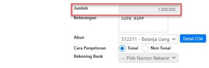
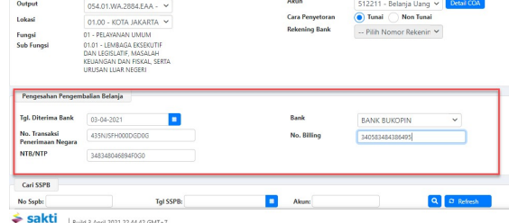

Petunjuk Teknis Aplikasi SAKTI
→
�
SETORAN PENGEMBALIAN BELANJA
(SSPB)
→
→
Perekaman Pengambalian **Belanja**

| No. 1   | Modul                   | BEN                                                                               |
|---------|-------------------------|-----------------------------------------------------------------------------------|
| 2       | Role User               | OPR                                                                               |
| 3       | Modul Lain yang Terkait | PEM                                                                               |
| 4       | Transaksi yang Tekait   | PEM - Perekaman SPP Pemulihan Pagu                                                |
| 5       | Dokumen Input           | Dokumen bukti setoran pengembalian belanja yang memuat kode billing, NTPN, danNTB |
| 6       | Output                  | Nomor Setoran Pengembalian Belanja (SSPB)                                         |
| 7       | Validasi                | -                                                                                 |

## Informasi **Penting**

1. Pasca implementasi RSPP, pada menu setoran pengembalian belanja terdapat fitur tambahan yaitu tombol pendetilan COA 15/16 segmen yang akan dijelaskan pada isi juknis.

2. Perekaman setoran pengembalian belanja yang sudah disimpan tidak dapat dilakukan ubah/edit. Jika ada kesalahan data, maka user harus melakukan hapus dan kemudian rekam ulang. Hal ini bertujuan untuk menghindari anomali data jurnal di sisi modul GLP SAKTI.

## Pengantar

Petunjuk teknis ini menjelaskan tentang bagaimana langkah yang harus dilakukan dalam hal pengembalian belanja sebelum dilakukannya pemulihan pagu pada aplikasi SAKTI. Sebelum satker melakukan perekaman SPP Pemulihan pagu, pastikan satker terlebih dahulu sudah melakukan penyetoran pengembalian belanja ke kas negara dengan dibuktikan melalui NTPN yang telah terbit kemudian merekam pada menu setoran SSPB dimodul bendahara.

Adapun langkah yang perlu dilakukan dalam pengembalian belanja dan pemulihan pagu adalah sebagai berikut:
1. Satker/Penyetor melakukan penyetoran pengembalian belanja melalui bank persepsi/pos 2. Satker mencatat kelengkapan setoran yang teridiri dari NTPN, NTB, kode billing, akun, dan nominal atas pengembalian belanja tersebut pada aplikasi SAKTI modul bendahara 3. Satker melakukan konfirmasisetoran pengembalian belanja ke KPPN 4. Satker mengajukan surat dari KPA Satker kepada KPPN selaku BUN perihal "pemulihan pagu", selanjutnya KPPN akanmelakukan proses pemulihan pagu pada sisi aplikasi SPAN.

5. Setelah pagu pada SPAN/OM SPAN telah kembali, selanjutnya buat SPP Pengembalian Belanja dengan jenis SPP 611 pada aplikasi SAKTI.

6. Proses SPP 611 Pengembalian Belanja hanya sampai validasi SPP oleh KPA. SPP 611 tidak perlu dikirimkan ke KPPN.

Pada juknis ini, akan dibahas mengenai langkah-langkah pencatatan setoran pengembalian belanja
(SSPB) pada modul bendahara (poin 2). Sementara untuk langkah-langkah pembuatan SPP
pemulihan pagu (poin 5 dan 6) akan dibahas pada juknis berbeda terkait perekaman SPP
pemulihan pagu pada modul pembayaran.

Langkah-langkah dalam perekaman setoran pengembalian belanja pada SAKTI adalah sebagai berikut:
a. Masuk ke Menu Bendahara - Setoran - Pengembalian Belanja kemudian klik tombol Tambah.

a. Lengkapi kolom KPPN, Lokasi, Kementerian, Unit Organisasi, Nomor SP2D (jika pengembalian belanja bukan berasal dari SP2D LS Bendahara maka lewati saja langkah ini), Sumber Dana, Program Kegiatan Output, Lokasi, Fungsi, dan Sub Fungsi.

b. Lengkapi kolom Nomor SSPB, Tanggal SSPB, NPWP Bendahara, Nama Bendahara, Alamat, dan Keterangan. Untuk kolom jumlah akan terisi 0 karena baru akan terbentuk setelah user melakukan pendetilan COA.

c. Pilih Cara Penyetoran Tunai/Non Tunai.

d. Pilih akun yang akan dilakukan pengembalian belanja, kemudian klik tombol Detail COA.

 Klik tombol Tambah kemudian klik tombol icon kaca pembesar untuk memilih kode detail COA.

 Pilih detail COA sesuai dengan Program, Kegiatan, Output, dan Akun yang sudah dipilih sebelumnya pada form SSPB.

 Tampilan pada aplikasi akan kembali ke form Pendetailan COA. Pastikan Kode COA sudah sesuai dengan Kode COA Pengembalian yang dipilih, kemudian Isikan Nilai/nominal transaksi pendetilan pada kolom Nilai. Jika sudah, klik Simpan.

a. Kolom jumlah pada form SSPB akan terisi secara otomatis sesuai dengan nilai yang diinput pada saat pendetilan COA di langkah sebelumnya.

b. Lanjutkan dengan perekaman detil Pengesahan Pengembalian Belanja seperti tanggal setoran diterima bank, NTPN, NTB, Nama Bank, dan Kode Billing. Jika sudah lengkap, klik Simpan.

c. Selanjutnya user dapat melanjutkan transaksi perekaman SPP Pemulihan Pagu di Modul Pembayaran.

Juknis perekeman SPP Pemulihan Pagu akan dibuat terpisah pada Modul Pembayaran.

�
�

Petunjuk Teknis Aplikasi SAKTI)
�
♦ PEREKAMAN SPP
PENGEMBALIAN BELANJA
�
�

## I. Informasi Umum A. Deskripsi Transaksi

SPP Pengembalian Belanja (611) digunakan untuk menyesuaikan pagu atas pengembalian belanja tahun anggaran berjalan yang telah disetorkan ke Kas Negara dan telah menerima Berita Acara Penyesuaian Pagu dari KPPN. Proses ini dilakukan apabila penyesuaian pagu di KPPN telah selesai.

| Modul                  | PEM                                                                                                                                                                                                 |
|------------------------|-----------------------------------------------------------------------------------------------------------------------------------------------------------------------------------------------------|
| Role User              | OPR, KPA                                                                                                                                                                                            |
| Modul Lain yang        | BEN                                                                                                                                                                                                 |
| Terkait Transaksi yang | BEN - Setoran Pengembalian Belanja                                                                                                                                                                  |
| Tekait Dokumen Input   | SPP Pengembalian Belanja                                                                                                                                                                            |
| Output                 | Pemulihan Pagu                                                                                                                                                                                      |
| Validasi               | Satker telah melakukan input SSPB pada aplikasi SAKTI modul Bendahara, serta  telah mengajukan permohonan penyesuaian pagu ke KPPN, dan telah  mendapatkan Berita Acara Penyesuaian Pagu dari KPPN. |

## Ii. Alur Proses

A. DIAGRAM ALUR PROSES

## B. Penjelasan Diagram Alur Proses

1) **Pengembalian Belanja dan Perekaman SSPB:**
Bendahara/Satker melakukan penyetoran atas pengembalian belanja. Selanjutnya Operator SAKTI modul Bendahara/Bendahara, melakukan perekaman pada aplikasi SAKTI untuk setoran pengembalian belanja yang telah dilakukan sebelumnya. Proses lebih lanjut atas transaksi ini dapat mengacu pada petunjuk teknis mengenai setoran pengembalian belanja.

## 2) Permohonan Pengembalian Belanja

KPA mengajukan permohonan pemulihan pagu ke KPPN. Proses ini dilakukan sesuai dengan ketentuan yang berlaku terkait dengan penyesuaian sisa pagu atas setoran pengembalian belanja.

3) **Proses KPPN**
KPPN akan melakukan verifikasi atas permohonan pemulihan/penyesuaian sisa pagu DIPA 
dari Satuan Kerja. Apabila permohonan diterima lengkap dan sesuai, KPPN akan melakukan penyesuaian sisa pagu DIPA dan menyampaikan pemberitahuan kepada satuan kerja dengan menyampaikan Berita Acara penyesuaian sisa pagu DIPA.

## 4) Pencatatan Spp:

Login sebagai pengguna dengan kewenangan operator pada Modul Pembayaran.

1. Pilih menu Pembayaran >> RUH Pembayaran >> Catat Ubah SPP. 2. Pilih Jenis SPP 611 - Pengembalian Belanja 3. Klik tombol 'Tambah', maka selanjutnya akan muncul pop up untuk memilih data SSPB.

4. Silakan pilih data SSPB yang akan digunakan. 5. Klik tombol 'Pilih'.

6. Silakan isikan dasar pembayaran.

8. Silakan isikan supplier tipe 1, dengan klik tombol 'Cari Supplier' 9. Setelah dipastikan data telah terisi dengan benar dan lengkap, klik tombol 'Simpan'.

## 5) Cetak Spp

Login sebagai pengguna dengan kewenangan operator pada Modul Pembayaran.

1. Masuk ke Modul Pembayaran >> Cetak >> Mencetak SPP
2. Pilih SPP yang ingin dicetak 3. Pilih PPK
4. Pastikan Tempat dan Tanggal telah sesuai 5. Klik tombol "Unduh" untuk mencetak SPP.

6. Klik tombol "SSP" apabila ingin mencetak SSP

## 6) Setuju Spp

Login sebagai pengguna KPA selaku *validator* atas SPP Pengembalian Belanja (611).

1. Masuk ke Modul Pembayaran >> Validasi >> Validasi SPP
2. Pilih SPP yang ingin divalidasi 3. Klik tombol "Setuju" untuk menyetujui SPP.

Setelah disetujui oleh KPA, maka proses perekaman SPP pengembalian belanja telah selesai dan pagu pada Aplikasi SAKTI telah dilakukan penyesuaian.