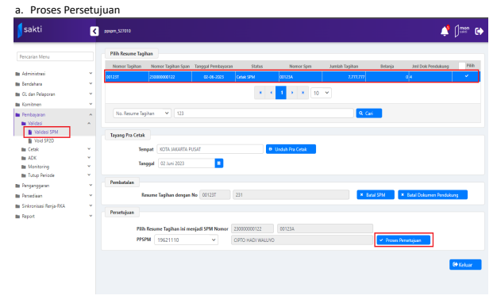
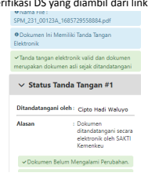

Petunjuk Teknis Aplikasi SAKTI)
→
�
TANDA TANGAN ELEKTRONIK (TTE)
TERSERTIFIKASI/ DIGITAL SIGNATURE (DS)
PADA APLIKASI SAKTI
KEMENTERIAN KEUANGAN RI
�

## I. Informasi Umum A. Deskripsi

| Update aplikasi SAKTI versi 3 Juni 2023 Modul PEMBAYARAN Role User Operator, Validator dan Approver Modul Lain terkait ADM BENDAHARA Transaksi yang Terkait PEM : - Validasi SPP - Validasi SPM - Monitoring Dokumen Pendukung Dokumen Input SPP,SPM dan dokumen pendukung Output TTE SPP, TTE SPM dan TTE Dokumen Pendukung Validasi Verifikasi pengguna DS, Persetujuan SPP, Persetujuan SPM Petunjuk Teknis Terkait ADM - Pendaftaran User DS SAKTI   |
|----------------------------------------------------------------------------------------------------------------------------------------------------------------------------------------------------------------------------------------------------------------------------------------------------------------------------------------------------------------------------------------------------------------------------------------------------------|

## B. Informasi Penting Lainnya

1. Penyelenggara tanda tangan digital yang digunakan pada aplikasi SAKTI saat ini adalah Badan Siber dan Sandi Negara (BSSN);
2. Pastikan pengguna Tanda Tangan Elektronik (TTE)/ Digital Signature telah terdaftar di BSSN dan telah diaktifkan;

## C. Alur Proses Proses Bisnis Tte/Ds Aplikasi Sakti

## D.  Surat Permintaan Pembayaran (Spp) Tte

1. Login user PPK

e 8 sakti.kemenkr

## 2. Status Ds

| sakti                 | K   | A To Do Lists   |
|-----------------------|-----|-----------------|
| 99                    |     |                 |
| inkronisasi SX112 AKA |     |                 |

Gambar 3
PPK/PPSPM dapat melihat status Digital Signature (DS) pada halaman utama setelah login aplikasi SAKTI Klik pada list berwarna hijau untuk melihat detail status DS (Gambar 3).

1. Informasi Digital Signature: Nama, Nomor HP, NIK, Email, kadaluarsa, status registrasi BSSN; 2. Informasi status Sertifikat Digital Signature BSSN : Merah, Orange dan Hijau; 3. Informasi syarat pendaftaran, Email, perpanjangan kadaluarsa, dsb. 4. Tombol untuk Reset Passphrase DS BSSN

4. Dokumen Pendukung TTE Eksternal **(SPP)**

Jika terdapat dokumen file pdf yang berasal dari luar aplikasi SAKTI yang akan digunakan sebagai lampiran/ dokumen pendukung pada SPP yang juga dibutuhkan Tanda Tangan Elektronik (TTE)/ DS, maka pengguna aplikasi SAKTI dapat mengupload file pdf tersebut login sebagai operator Pembayaran dengan status "Cetak SPP", kemudian lakukan hal-hal sebagai berikut (Gambar 5):
1. Ke menu Pembayaran -> Catat/Upload -> Upload Dokumen Pendukung; 2. Pilih data SPP yang akan dilampirkan dokumen pendukung; 3. Pilih Jenis Dok. Pendukung; 4. Klik "Choose" pilih file pdf yang akan dilakukan TTE; 5. Kemudian klik "Upload".

Masih pada menu Upload dokumen Pendukung, silahkan lakukan langkah-langkah sebagai berikut (Gambar 6):
1. Pilih Dokumen pendukung SPP; 2. Pilih "Penandatangan", pejabat yang menandatangani dokumen pendukung tersebut; 3. Klik "Tambah", dapat dipilih beberapa pejabat;

Login sebagai pejabat yang menandatangani dokumen pendukung tersebut, kemudian lakukan hal sebagai berikut:
1. Ke menu Pembayaran -> Monitoring Dokumen pendukung; 2. Klik "Preview"; 3. Klik "Daftar Dokumen"; 4. Lakukan proses TTE klik pada icon pensil (Gambar 7);
d. Input Passphrase

1. Akan muncul popup form "Proses Setuju" Input Passphrase: 2. Jika Passphrase yang diinput benar akan muncul notif "TTE berhasil", maka dokumen pendukung telah berhasil di TTE, kemudian klik tutup.

5. Validasi SPP

Setelah operator melakukan upload dokumen pendukung TTE maka PPK dapat melakukan validasi SPP, pilih nomor SPP yang akan dilakukan Proses Persetujuan (Gambar 8), silahkan login sebagai Validator (PPK) penandatangan SPP tersebut lakukan langkah-langkah sebagai berikut: 1. Ke Menu Pembayaran-> Validasi -> Validasi SPP; 2. Pilih data SPP yang akan divalidasi; 3. Klik "Proses Persetujuan" untuk menampilkan data detail SPP;

## B. Informasi Spp

Gambar 9 Pejabat pembuat komitmen (PPK) dapat melakukan pengecekan/pengujian SPP secara elektronik sebelum melakukan validasi SPP. 1. Informasi Utama : Satker, KPPN, Jenis Dokumen, Mata Uang, No SPP/SPM, Jatuh Tempo, Cara Bayar Tanggal SPP/SPM dan uraian; 2. Dasar Pembayaran, Nomor DIPA; 3. Informasi Supplier, beserta lampiran SPP; 4. Daftar dokumen pendukung, menampilkan data dokumen pendukung pada SPP tersebut; 5. Daftar penandatangan dokumen Eksternal, merupakan informasi pejabat penandatangan dokumen pendukung Eksternal beserta status TTE.

6. Untuk memilih maju mundur nomor SPP klik "sebelumnya" atau "lewati"; 7. Untuk memilih SPP yang akan divalidasi klik "Tandai setuju & lanjut"; 8. Jika SPP yang akan diproses telah dipilih dan ditandai lakukan klik "Proses".

## C. Input Passphrase Spp

1. Akan muncul popup form "Proses Setuju" Input Passphrase: 2. Jika Passphrase yang diinput benar, akan muncul notif "Proses Setuju resume tagihan berhasil",

maka status SPP akan berubah menjadi "Setuju SPP" dan akan terbentuk SPP dengan TTE.

6. Verifikasi SPP TTE

Untuk melakukan pengecekan SPP yang telah ditandatangani menggunakan TTE (Gambar 10) silahkan: 1. Ke menu Pembayaran -> Cetak -> Cetak Arsip SPP;
atau Pembayaran -> Monitoring -> Monitoring Dok.Pendukung; 2. Pilih pada daftar, SPP yang akan dilakukan pengecekan; 3. Klik tombol "Preview".

Dokumen SPP maupun lampiran yang berasal dari aplikasi SAKTI akan secara otomatis terbentuk TTE setelah dilakukan validasi/persetujuan SPP DS, pada dokumen pdf akan membentuk QR Code yang dapat diuji keasliannya melalui link kemenkeu (Gambar 11). 1. Tombol "Daftar Dokumen" merupakan list dokumen hasil bentukan aplikasi SAKTI yang telah dilakukan TTE;
2. Info Penandatangan, menampilkan Jenis Dokumen, Nama file (dok. TTE); 3. Tools dokumen (navigasi), digunakan untuk mengkostumisasi dokumen mulai dari memperbesar

memperkecil dokumen, rotasi, pencarian halaman dan sebagainya.

4. Daftar dokumen yang telah diproses tanda tangan Elektronik TTE berupa informasi jenis dokumen dan Tandatangan Eksternal.

5. Dokumen pdf yang telah di TTE dengan QR Code link kemenkeu.go.id 6. Verifikasi DS, merupakan informasi verifikasi DS yang diambil dari link situs kominfo Berupa informasi:
1. Pernyataan dokumen asli 2. Penandatangan DS 3. Lokasi 4. Alasan 5. Waktu ditandatangani 6. Penyelenggara DS 7. Info perubahan dokumen 8. Verifikasi identitas penandatangan 9. Stempel Waktu

## E. Surat Perintah Membayar Tte (Spm)

1. Dokumen Pendukung TTE Eksternal **(SPM)**

Jika terdapat dokumen file pdf yang berasal dari luar aplikasi SAKTI yang akan digunakan sebagai lampiran/ dokumen pendukung pada SPM yang juga dibutuhkan Tanda Tangan Elektronik (TTE)/ DS, maka pengguna aplikasi SAKTI dapat mengupload file pdf tersebut login sebagai operator Pembayaran dengan status "Cetak SPM", kemudian lakukan hal-hal sebagai berikut (Gambar 12):
1. Ke menu Pembayaran -> Catat/Upload -> Upload Dokumen Pendukung; 2. Pilih data SPM yang akan dilampirkan dokumen pendukung; 3. Pilih Jenis Dok. Pendukung; 4. Klik "Choose" pilih file pdf yang akan dilakukan TTE; 5. Kemudian klik "Upload".

b. Tambah Pejabat dan Kirim KPPN Dokumen Pendukung TTE

Masih pada menu Upload dokumen Pendukung, silahkan lakukan langkah-langkah sebagai berikut (Gambar 13):
1. Pilih Dokumen pendukung SPM; 2. Pilih Penandatangan, pejabat yang menandatangani dokumen pendukung tersebut; 3. Klik "Tambah", dapat dipilih beberapa pejabat; 4. Operator SPM dapat mencentang dan hapus centang pada kolom "Kirim KPPN" untuk memilih dokumen pendukung mana yang akan dikirim ke KPPN.

c. Proses TTE Dokumen Pendukung SPM

Login sebagai pejabat yang menandatangani dokumen pendukung tersebut, kemudian lakukan hal sebagai berikut:
1. Ke menu Pembayaran -> Monitoring Dokumen pendukung; 2. Klik "Preview"; 3. Klik "Daftar Dokumen"; 4. Lakukan proses TTE klik pada icon pensil (Gambar 14);

## D. Input Passphrase

1. Akan muncul popup form "Proses Setuju" Input Passphrase: 2. Jika Passphrase yang diinput benar akan muncul notif "TTE berhasil", maka dokumen pendukung telah berhasil di TTE, kemudian klik tutup.

2. Validasi SPM

Gambar 15 Setelah operator melakukan upload dokumen pendukung TTE maka PPSPM dapat melakukan validasi SPM, pilih nomor SPP yang akan dilakukan Proses Persetujuan (Gambar 15), silahkan login sebagai Approver (PPSPM) penandatangan SPM tersebut lakukan langkah-langkah sebagai berikut: 1. Ke Menu Pembayaran-> Validasi -> Validasi SPM; 2. Pilih data SPP yang akan disetujui; 3. Klik "Proses Persetujuan" untuk menampilkan data detail SPM;

Pejabat penandatangan SPM (PPSPM) dapat melakukan pengecekan/pengujian SPM secara elektronik sebelum melakukan persetujuan SPM. 1. Informasi Utama : Satker, KPPN, Jenis Dokumen, Mata Uang, No. SPM, Jatuh Tempo, Cara Bayar; 2. Dasar Pembayaran, Nomor DIPA; 3. Informasi Supplier, beserta lampiran SPM; 4. Daftar dokumen pendukung, menampilkan jumlah dan data dokumen pendukung SPM, pada menu ini PPSPM dapat mencentang dan hapus centang pada kolom "Kirim KPPN" untuk menentukan dokumen pendukung mana yang akan dikirim ke KPPN;
5. Daftar penandatangan dokumen Eksternal, merupakan informasi pejabat penandatangan dokumen pendukung Eksternal beserta status TTE.

6. Untuk memilih maju mundur nomor SPM klik "sebelumnya" atau "lewati"; 7. Untuk memilih SPM yang akan divalidasi klik "Tandai setuju & lanjut"; 8. Jika SPM yang akan diproses telah dipilih dan ditandai lakukan klik "Proses".

## C. Input Passphrase Spm

1. Akan muncul popup form "Proses Setuju" Input Passphrase: 2. Jika Passphrase yang diinput benar, akan muncul notif "Proses Setuju SPM berhasil", maka status SPM akan berubah menjadi "Setuju SPM" dan akan terbentuk SPM dengan TTE.

## 3.  Verifikasi Spm Tte

Untuk melakukan pengecekan SPP yang telah ditandatangani menggunakan TTE silahkan: 1.   Ke menu Pembayaran -> Cetak -> Cetak Arsip SPM
atau Pembayaran ->  Monitoring -> Monitoring Dok.Pendukung; 2.   Pilih pada list SPM yang akan dilakukan pengecekan; Klik tombol "Preview";
3.

b.   Verifikasi DS

Dokumen SPM maupun lampiran yang berasal dari aplikasi SAKTI akan secara otomatis terbentuk TTE
setelah dilakukan validasi/persetujuan SPM TTE, pada dokumen pdf akan membentuk QR Code yang dapat diuji keasliannya melalui link kemenkeu.

1.   Tombol "Daftar Dokumen" merupakan list dokumen hasil bentukan aplikasi SAKTI;
 Info Penandatangan, menampilkan Jenis Dokumen, Nama file (dok. TTE);
2.

is Dokumen : SPM TTE
PM_231_00123A_168572955888
🙂 Klik tombol verifikasi DS untuk informasi penandatangan 3. Tools dokumen (navigasi), digunakan untuk mengkostumisasi dokumen mulai dari memperbesar

memperkecil dokumen, rotasi, pencarian halaman dan sebagainya; 4. Daftar dokumen yang telah diproses tanda tangan Elektronik TTE berupa informasi jenis dokumen dan Tandatangan Eksternal; 5. Dokumen pdf yang telah di TTE dengan QR Code link kemenkeu.go.id; 6. "Verifikasi DS", merupakan informasi verifikasi DS yang diambil dari link situs kominfo Berupa informasi:
1. Pernyataan dokumen asli 2. Penandatangan DS 3. Lokasi 4. Alasan 5. Waktu ditandatangani 6. Penyelenggara DS
7. Info perubahan dokumen 8. Verifikasi identitas penandatangan 9. Stempel Waktu.

Proses terakhir untuk SPM diproses oleh KPPN adalah pengiriman adk SPM ke KPPN:
1.Ke menu Pembayaran -> ADK -> ADK SPM Interkoneksi OTP; 2.Pilih data SPM yang akan dikirim ke KPPN; 3.Klik "Proses ADK SPM"; 4.Catat SP2D otomatis.