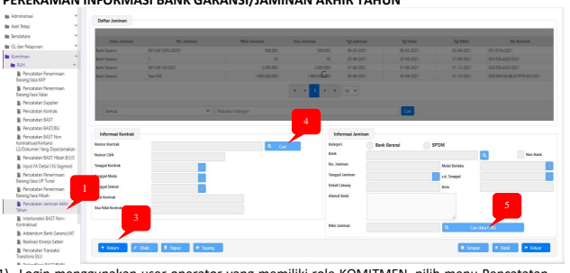
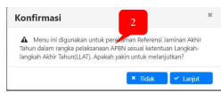
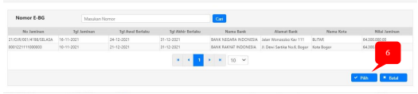
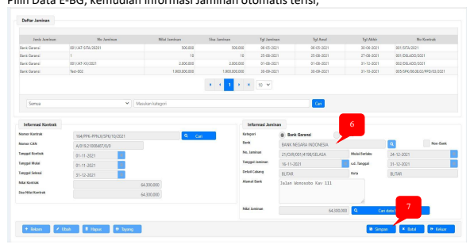
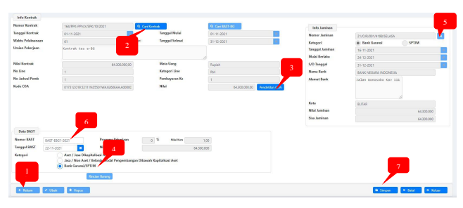
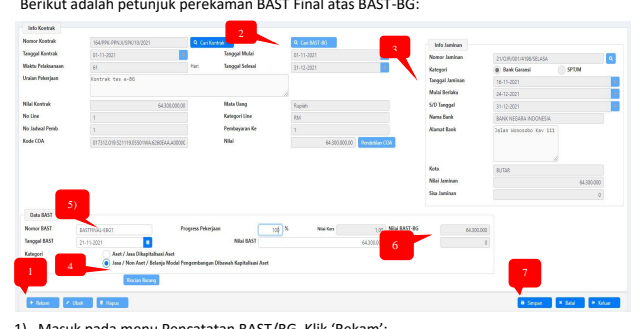
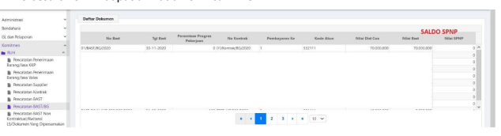
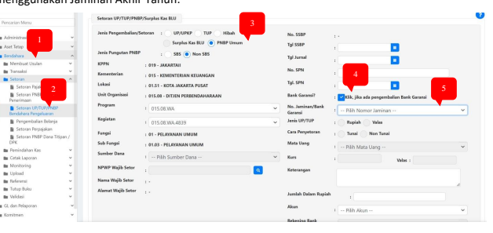

�
Petunjuk Teknis Aplikasi SAKTI
�
�
TRANSAKSI KONTRAKTUAL DENGAN PENCATATAN
JAMINAN AKHIR TAHUN/BANK GARANSI
�
�

## I. Informasi Umum A. Deskripsi Transaksi

| Modul                   | KOM, PEM                                                                                                           |                                                                      |
|-------------------------|--------------------------------------------------------------------------------------------------------------------|----------------------------------------------------------------------|
| Role User               | OPR, VAL, APR                                                                                                      |                                                                      |
| Modul Lain terkait      | KOM, PEM, GLP                                                                                                      |                                                                      |
| Transaksi yang Tekait   | KOM - Pencatatan Kontrak PEM - Catat/Ubah SPP                                                                      |                                                                      |
| Dokumen Input           | Data Kontrak, Data Jaminan Akhir  Tahun, Data BAST Bank Garansi                                                    |                                                                      |
| Output                  | BAST dengan Bank Garansi s.d. Pengajuan SPM                                                                        |                                                                      |
| Validasi                | -                                                                                                                  | Data kontrak sudah mendapatkan CAN (Commitment Application  Number); |
| -                       | Perekaman BAST Final dapat dilakukan setelah SPM Kontraktual  telah catat SP2D;                                    |                                                                      |
| -                       | Input nilai desimal tidak dapat dilakukan untuk nilai harga yang  menggunakan mata uang Rupiah.                    |                                                                      |
| Petunjuk Teknis Terkait | KOM - Petunjuk Perekaman Supplier Tipe 1, 2, dan 7 KOM - Perekaman Kontrak Tahunan PEM - Perekaman SPM Kontraktual |                                                                      |

## I. Pendahuluan

Petunjuk teknis ini digunakan untuk penatausahaan transaksi kontraktual pada akhir tahun anggaran dengan menggunakan Jaminan Akhir Tahun(JAT)/Bank Garansi(BG) baik yang menggunakan mekanisme Bank Garansi Elektronik(BRI, Mandiri, dan BNI) maupun non elektronik. Transaksi Kontraktual pada akhir tahun anggaran yang diatur dalam petunjuk teknis ini yaitu:
a. Pencatatan Jaminan Akhir Tahun/Bank Garansi b. Perekaman BAST Bank Garansi(BAST-BG) c. Perekaman SPM Kontraktual dengan Bank Garansi d. Perekaman BAST Final atas SPM dengan BAST-BG e. Penyetoran atas Selisih BAST BG dengan BAST Final atau SPNP (Surat Penetapan Nilai Pengembalian)

## A. Diagram Alur Proses

Gambar diatas merupakan flow perekaman SPM LS Kontraktual, dimulai dari tahapan perekaman kontrak sampai dengan pendetilan atas aset/persediaan yang dihasilkan. Atas data kontrak yang telah direkam pada SAKTI dan telah mendapatkan NRK / CAN, selanjutnya untuk transaki pembayaran/SPP, satker melakukan pencatatan jaminan akhir tahun dengan mekanisme konfirmasi e-BG pada OMSPAN(Apabila Bank penerbit Bank Garansi merupakan Bank Peserta Piloting Bank Garansi yaitu BRI, Mandiri, dan BNI). 

Note: Untuk transaksi yang menggunakan Bank Garansi yang diterbitkan selain dari Bank Peserta Piloting E-BG, maka jaminan akhir tahun dapat direkam langsung pada aplikasi SAKTI tanpa mekanisme Konfirmasi E-BG pada OMSPAN.

Setelah Perekaman Jaminan Akhir Tahun, tahapan pada SAKTI adalah sebagai berikut:
1. Merekam BAST dengan Bank Garansi yang selanjutnya disebut dengan BAST-BG; 2. Merekam SPP Kontraktual s.d. Catat SP2D; 3. Merekam BAST Final sebagai pendetilan atas transaksi dengan BAST-BG. 4. Melakukan penyetoran SPNP apabila terdapat selisih antara BAST BG dengan BAST 
Final(Realisasi Pekerjaan)

## B. Penjelasan Diagram Alur Proses

## 1. Perekaman Informasi Bank Garansi/Jaminan Akhir Tahun

1) Login menggunakan user operator yang memiliki role KOMITMEN, pilih menu Pencatatan Jaminan Akhir Tahun; 2) Sebelum form pencatatan Jaminan Akhir Tahun terbuka, akan muncul dialog box konfirmasi perekaman Jaminan Akhir Tahun sesuai dengan periode LLAT. Klik Lanjut.

3) Setelah Form Pencatatan Jaminan Akhir Tahun Terbuka, Klik 'Rekam'; 4) Cari data kontrak (termin kontrak) yang akan di BAST-BG kan; 5) Pada Sub Informasi Jaminan, Klik Tombol Cari data E-BG kemudian akan muncul form daftar Jaminan yang telah dikonfirmasi melalui OMSPAN, Lalu pilih data E-BG kemudian klik "Pilih":

Untuk pencatatan Jaminan Akhir Tahun/Bank Garansi yang diterbitkan selain dari Bank Peserta Piloting *E-BG* **(BRI, BNI, dan Mandiri), perekaman JAT/Bank Garansi dapat** dilakukan secara manual tanpa melakukan pencarian data Bank Garansi pada tombol "Cari data E-BG" lalu simpan data jaminan akhir **tahun.**

## 6) Pilih Data E-Bg, Kemudian Informasi Jaminan Otomatis Terisi;

7) Klik 'Simpan'. Maka selanjutnya data jaminan akhir tahun telah berhasil terekam dan dapat digunakan untuk perekaman BAST Bank Garansi.

## 2. Perekaman Bast Dengan Bank Garansi

BAST-BG merupakan dokumen sumber sebagai triger untuk perekaman SPP Kontraktual dengan bank garansi. Untuk merekam BAST-BG sebagai dasar perekaman SPP LS Kontraktual, berikut langkah-langkahnya:

1) Masuk ke menu pencatatan BAST/BG, Klik 'Rekam'; 2) Cari data kontrak (termin kontrak) yang akan di BAST-BG kan dan telah dilakukan perekaman jaminan akhir tahun; 3) Rekam Pendetilan Coa; 4) Pada Kategori BAST, pilih Bank Garansi/SPTJM; 5) Cari jaminan akhir tahun yang telah direkam sebelumnya; 6) Lengkapi isian keterangan data BAST sesuai dengan dokumen sumber (Nomor BAST, 
Tanggal BAST, dan Nilai BAST-BG); Note: Nomor BAST dapat diisikan dengan Nomor BAPP/BAKP/Nomor dokumen pendukung lainnya atas BAST Bank Garansi. Untuk penomoran BAST terdapat validasi bahwa Nomor BAST BG tidak boleh sama dengan Nomor BAST Final (pendetilan barang/jasa)
7) Klik 'Simpan'. Selanjutnya data BAST-BG dapat digunakan untuk perekaman SPP LS 
Kontraktual. Note: Pada BAST BG tidak terdapat pendetilan Barang, dikarenakan progres pekerjaan yang belum final dan belum ada serah terima barang.

## 3. Perekaman Spp Kontraktual S.D. Catat Sp2D

Langkah-langkah perekam SPP Kontraktual berpedoman pada *Petunjuk Teknis Perekaman* SPM *Kontraktual* yang dapat diunduh melalui aplikasi mobile "panduSakti" pada playstore/app store. Secara singkat, SPP yang digunakan adalah SPP dengan jenis dokumen 111- NON GAJI KONTRAKTUAL lalu pilih BAST BG yang telah direkam sebelumnya. 

(PembayaranRUH PembayaranCatat/Ubah SPP Pilih Jenis SPP 111 - **NON GAJI KONTRAKTUAL)**

## 4. Perekaman Bast Final Sebagai Pendetilan Atas Transaksi Dengan Bast-Bg

Setelah proses catat SP2D, langkah selanjutnya yang harus dilakukan adalah dengan merekam BAST Final atas BAST-BG yang pernah direkam sebelumnya. BAST Final adalah Dokumen Serah Terima final atas transaksi kontraktual yang menggunakan jaminan akhir tahun/Bank Garansi. Pada BAST Final terdapat pendetilan Jasa/Barang. BAST Final ini hanya dapat direkam setelah transaksi atas BAST-BG telah dilakukan proses pencatatan SP2D. 

1) Masuk pada menu Pencatatan BAST/BG. Klik 'Rekam'; 2) Cari BAST-BG yang telah digunakan sampai proses catat SP2D, pilih BAST-BG tersebut; 3) Kolom Info Jaminan akan secara otomatis terisi; 4) Pada isian Data BAST, pilih kategori BAST yang akan didetilkan. Jika memilih Kategori Asset/Jasa Dikapitalisasi Aset maka rekam terlebih dahulu kode barang pendetilanya; 5) Lengkapi Isian Data BAST (Nomor BAST Final, Tanggal BAST Final, dan Progress Pekerjaan); 6) Jika Nilai BAST-BG sama dengan nilai data kontrak (termin kontrak), maka nilai SPNP 
(Surat Penetapan Nilai Pengembalian) adalah 0; 7) Simpan BAST.

## 5. Penyetoran Spnp

Jika Nilai BAST Final < BAST BG maka akan terdapat Nilai SPNP (Surat Penetapan Nilai Pengembalian) untuk dikembalikan kepadan Negara (disetorkan). Info besaran SPNP dapat dilihat di form cari BAST.

Penyetoran SPNP dapat menggunakan menu: 1. Bendahara -> Setoran Pengembalian Belanja (tahun anggaran berjalan); 2. Bendahara -> Setoran UP/TUP/PNBP Bendahara Pengeluaran (jika disetorkan lewat tahun anggaran).

Berikut tampilan Aplikasi menu setoran jika terdapat SPNP atas transaksi kontraktual dengan 

 menggunakan Jaminan Akhir Tahun:

1) Login user Operator Bendahara 2) Pilih Menu Setoran Setoran UP/TUP/PNBP Bendahara Pengeluaran untuk setoran yang dilakukan di tahun anggaran berikutnya atau masuk menu Setoran pengembalian belanja jika disetor di tahun yang sama dengan proses perekaman bast final.

3) Pilih Jenis Pengembalian PNBP Umum  Non SBS
4) Lengkapi parameter lalu klik tombol konfirmasi pada parameter Bank Garansi 5) Pilih Jaminan lalu lengkapi informasi setoran, kemudian klik Simpan

## C. Faq

Q: Apakah 1 BG dapat digunakan untuk beberapa akun? A: Ya, 1 BG melekat pada 1 kontrak. Dapat berupa kontrak yang memiliki satu akun(line) atau lebih Q: Apakah 1 BG dapat digunakan untuk beberapa BAST? A: Ya, BG pada menggunakan konsep saldo, selama masih terdapat saldo jaminan, dapat digunakan untuk beberapa BAST dalam 1 kontrak yang dijaminkan Q: Data Bank Garansi Elektronik (E-BG) tidak muncul pada pencarian data E-BG A: Pastikan data Bank Garansi telah selesai dilakukan proses Konfirmasi pada OMSPAN Q: Data BAST BG tidak muncul pada saat akan dilakukan perekaman BAST Final A: Pastikan SPM atas BAST BG telah dilakukan proses upload Sp2d Q: Jika dalam 1 termin terakhir akan dijadikan 2 BAST, BAST tanpa BG dan BAST dengan BG, bagaimana perlakuannya? A: Pastikan membuat BAST tanpa BG terlebih dahulu sebelum BAST-BG, dengan progress pekerjaan proporsional sesuai nilai pembayaran. (Jika Progress Pekerjaan telah direkam dengan nilai 100% pada BAST Tanpa BG, maka pada perekaman BAST-BG akan terkena validasi)