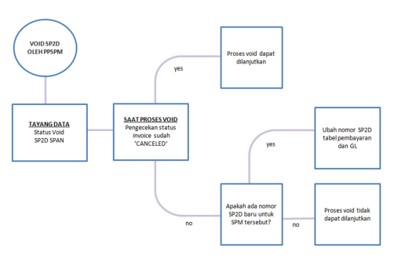

Petunjuk Teknis Aplikasi SAKTI)
�
�
VOID SP2D
ALIKASI SAKTI
KEMENTERIAN KEUANGAN RI
DITJEN PERBENDAHARAAN
Void SP2D Aplikasi SAKTI Menu ini digunakan untuk mengupload dokumen pendukung (SPM dan **Lampiran)**

| No.                                                     |               |
|---------------------------------------------------------|---------------|
| 1                                                       |               |
| Modul                                                   | PEM           |
| Role User                                               |               |
| APR                                                     |               |
| Modul Lain                                              |               |
| terkait                                                 |               |
| -                                                       |               |
| Transaksi yang Tekait                                   |               |
| PEM -                                                   |               |
| Void SP2D                                               |               |
| Dokumen Input                                           |               |
| Informasi Void SP2D dari KPPN                           |               |
| Output                                                  |               |
| Update status SPM pada aplikasi SAKTI menjadi VOID SP2D |               |
| Validasi                                                | Approve PPSPM |

Beberapa hal yang perlu diperhatikan: 

1. **Proses void dapat dilakukan setelah terdapat void SP2D pada SPAN** 
2. Terdapat scheduler untuk mengupdate status SPM yang divoid pada SPAN 

## A. **Menu Void Sp2D Pada Aplikasi Sakti** 

Login menggunakan user PPSPM, Pilih Folder Pembayaran Menu Validasi  **submenu Void SP2D** 

## B. **Void Sp2D Oleh Ppspm** 

1. **Pilih nomor SPP yang telah divoid SP2D** 2. **Klik tombol Void SPM** 
3. Klik Yes. 

Void jika saat dibatal ada nomor SP2D alias di ppr ulang
- Validasi SPM

No SP2D baru ditemukan. No SP2D tercatat berhasil diperbaharui Void jika saat dicek statusnya tidak ditemukan nomor invoice pada interface SPAN, perlu konfirm ke tim OMSPAN
- Validasi SPM

 Status invoice tidak ditemukan, silakan coba beberapa saat lagi.

Void jika saat di cek status invoicenya belum "CANCELED" , perlu konfirm ke tim OMSPAN
- Validasi SPM

Status invoice belum dibatalkan. Silahkan hubungi KPPN untuk membatalkan invoice pada SPAN.

