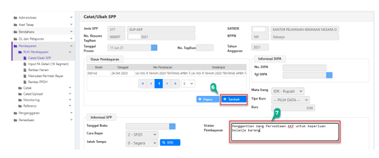

→
�
→
→
.

Petunjuk Teknis Aplikasi SAKTI
→
KRTU KREDIT PEMERINTAH .

e

# Daftar Isi

## Halaman Judul

| HALAMAN JUDUL                                                                                                                                              |                                                                                                                                       |
|------------------------------------------------------------------------------------------------------------------------------------------------------------|---------------------------------------------------------------------------------------------------------------------------------------|
| ..                                                                                                                                                         |                                                                                                                                       |
| DAFTAR ISI                                                                                                                                                 |                                                                                                                                       |
| DESKRIPSI SINGKAT                                                                                                                                          |                                                                                                                                       |
| ALUR PROSES                                                                                                                                                |                                                                                                                                       |
| Membuat Usulan UP KKP                                                                                                                                      |                                                                                                                                       |
| l.                                                                                                                                                         |                                                                                                                                       |
| I.                                                                                                                                                         | Merekam Supplier/Penerima Barang Jasa KKP                                                                                             |
| II.                                                                                                                                                        | Merekam Penerimaan barang/Jasa KKP .................................................................................................4 |
| IV.                                                                                                                                                        | Mencetak Perintah Bayar, Kuitansi, dan DPT KKP ................................................................................9      |
| Merekam SPM GUP KKP.                                                                                                                                       |                                                                                                                                       |
| V.                                                                                                                                                         |                                                                                                                                       |
| VI.                                                                                                                                                        | Merekam usulan TUP KKP .                                                                                                              |
| VII.    Merekam SPP/SPM PTUP KKP                                                                                                                           |                                                                                                                                       |
| VIII.   Mencatat SP2D GUP/PTUP KKP ..................................................................... Error! Bookmark not defined.                      |                                                                                                                                       |
| Merekam Transaksi Pajak KKP ............................................................................................................................17 |                                                                                                                                       |
| IX.                                                                                                                                                        |                                                                                                                                       |

## Deskripsi Singkat

Juknis ini menjelaskan tentang siklus UP KKP, mulai dari pembuatan usulan UP KKP pertama kali, melakukan transaksi UP KKP, Membuat SPP - SPM KKP hingga melakukan transaksi pungut dan setor pajak KKP.

| Siklus Uang Persediaan Kartu Kredit Pemerintah Modul ini digunakan untuk mengelola Uang Persediaan (UP) yang menggunakan mekanisme Kartu  Kredit Pemerintah (KKP). Kode Juknis BEN-001 Modul BEN Role User OPR Modul Lain yang terkait BEN, PEM, KOM Transaksi yang terkait Membuat BAST/Penerimaan Barang Jasa, Pungut Pajak, Setor  Pajak, Membuat SPP-SPM Dokumen Input Usulan UP KKP, Surat Persetujuan UP KKP, BAST/ Penerimaan  Barang/Jasa UP KKP. Output Cetakan Karwas UP KKP, Perintah Bayar KKP, Kuitansi KKP, Daftar  Pembayaran Tagihan KKP Validasi -   |
|-----------------------------------------------------------------------------------------------------------------------------------------------------------------------------------------------------------------------------------------------------------------------------------------------------------------------------------------------------------------------------------------------------------------------------------------------------------------------------------------------------------------------------------------------------------------------|

## Alur Proses

Berikut adalah alur proses Transaksi KKP
A. Merekam Supplier/Penerima Barang Jasa KKP

Sebelum melakukan transaksi KKP, satuan kerja diwajibkan untuk merekam terlebih dahulu rekanan/supplier tersebut. Data NPWP yang dihasilkan akan digunakan oleh Direktorat Jenderal Pajak sebagai data sumber, sehingga NPWP yang diinputkan harus merupakan NPWP yang valid.

Langkah ini hanya perlu dilakukan sekali untuk setiap supplier/rekanan yang digunakan. Apabila 

bertransaksi dengan rekanan yang baru, maka langkah ini harus dilakukan kembali. Adapun langkahlangkahnya adalah sebagai berikut:
a. Login menggunakan user operator Bendahara Pengeluaran, kemudian pilih menu

Bendahara > Referensi > Referensi Wajib Pajak/Wajib Bayar.

b. Klik tombol <Tambah>
1. Pilih Jenis Wajib Pajak/Wajib Bayar : Rekanan Transaksi KKP
2. Lengkapi kolom isian nama wajib pajak/wajib setor, NPWP yang valid, NIK, nomor rekening, bank, cabang bank, nomor telepon, dan nomor HP (dapat diisi tanda '-' bila tidak ada)
3. Isikan kolom alamat dengan alamat kantor, kemudian lengkapi semua kolom pilihan provinsi, kabupaten, kecamatan, dan kode pos. 

4. Isikan email dan website satker (boleh dikosongkan atau diberi tanda '-' jika tidak ada) 5. Klik <Simpan> untuk menyimpan data B. Merekam Penerimaan barang/Jasa KKP
Setelah *plafond* UP KKP sudah tersedia (melalui mekanisme perekaman Usulan UP tunai dan KKP di modul Bendahara dan mengajukan SPM UP ke KPPN), selanjutnya *user* dapat melanjutkan untuk melakukan perekaman penerimaan barang/jasa atas belanja yang dilakukan dengan menggunakan KKP. Output dari perekaman ini adalah Hasil Cetakan SPBy dan Kuitansi KKP.

Apabila saat mengakses menu Penerimaan Barang/Jasa KKP muncul notifikasi peringatan, maka silahkan periksa pada point 1 sampai 3 langkah apa yang belum dilaksanakan. Pada umumnya dikarenakan nomor surat persetujuan UP KKP belum direkam pada modul Bendahara di menu Menghitung Usul UP. Berikut langkah-langkah untuk merekam nomor surat 

1. Login menggunakan user Bendahara Pengeluaran

Klik menu Bendahara > Membuat Usulan > Menghitung Usul UP
2. Klik Usulan UP yang telah direkam 3. Klik tombol <Ubah Proporsi Tunai & KKP> **(bukan menu Ubah)** 4. Isikan nomor dan tanggal Surat Persetujuan KKP dari KPPN. Apabila besaran UP KKP nya tidak sesuai dengan proporsi yaitu selain 40%, maka silahkan menginput nomor Surat Dispensasi Proporsi KKP dari Kanwil Ditjen Perbendaharaan 5. Klik tombol <Simpan> dan user operator Komitmen dapat melanjutkan dalam perekaman penerimaan barang/jasa KKP.

Langkah-langkah untuk melakukan pencatatan penerimaan barang/jasa KKP adalah sebagai berikut:

1. Login dengan menggunakan user operator Komitmen

Klik menu Komitmen > RUH > Pencatatan Penerimaan Barang/Jasa KKP
2. Klik tombol Tambah.

3. Kolom nomor dokumen akan terisi secara otomatis oleh sistem. Isikan Tanggal Dokumen : Tanggal dokumen sumber pembelian Uraian dokumen : Isikan uraian transaksi belanja persediaan/asset tersebut Mata Uang : Terisi otomatis apabila satker hanya mengelola dana UP RM
Nama Penerima : Nama penerima pembayaran atas transaksi belanja asset/persediaan tersebut 4. Lengkapi kolom Informasi Supplier dengan mengklik tombol <Cari Supplier> (isikan dengan supplier tipe 1/satker). Apabila hanya terdapat 1 supplier tipe1/Satker pada menu RUH Supplier di Modul Komitmen, maka tombol pilih tidak aktif dan terisi otomatis.

5. Pada kolom informasi supplier klik tombol <Cari Wajib Pajak/Wajib setor>, dan akan muncul pop up box yang berisi daftar wajib pajak/wajib setor yang telah direkam oleh user sebelumnya pada referensi wajib pajak/wajib bayar.

6. Selanjutnya pilih Program, Aktivitas, KRO, Akun, KPPN, Sumber Dana, Cara Penarikan, dan Nomor 

Register. Kolom COA akan terisi otomatis ketika kita sudah memilih pada akun sebelumnya.

7. Kolom intraCo, Cadangan, dan Kode COA akan terisi secara otomatis oleh sistem. Selanjutnya, 

lakukan pemilihan detail COA dengan mengklik tombol <Pendetilan COA>.

8. Klik tombol <Tambah> 

 9. Klik tombol ikon kaca pembesar untuk merekam detil COA dan pilih detil COA yang diinginkan 
(pastikan detil COA sama dengan akun belanja persediaan/asset/jasa lainnya yang akan direkam pada BAST UP), kemudian klik tombol OK.

10. Isikan nilai belanja total 11. Klik tombol <Simpan>
12. Klik tombol <Keluar>
13. Pilih jenis Kas UP atau TUP sesuai dengan sumber dana yang akan digunakan untuk belanja, 

kemudian klik tombol Rincian Barang. Akan muncul *pop up box* Rincian Barang seperti gambar di bawah ini.

a. Klik tombol <Rekam> untuk mengaktifkan menu-menu pada *pop up box* rincian barang.

 b. Pilih kategori barang, misal: Persediaan, karena akun yang digunakan merupakan akun belanja barang persediaan (521811). Apabila akun yang digunakan dan belanja yang dilakukan merupakan belanja yang menghasilkan asset tetap, maka silahkan pilih **Asset.**
c. Klik tombol ikon kaca pembesar untuk memilih kode barang yang akan dicatat.

Ketikkan filter berupa nama barang/kode barang untuk mempercepat dan mempermudah proses perekaman. Klik Cari dan kemudian pilih barangnya.

d. Lanjut pengisian Jumlah dan Harga satuan barang yang sudah dipilih pada langkah sebelumnya. Nominal pada kolom harga total akan terisi secara otomatis oleh sistem ketika sudah dilakukan pengisian jumlah dan harga satuan barang.

e. Ulangi langkah a-d apabila transaksi lebih dari satu jenis barang. Apabila terdapat barang yang sama namun dengan harga berbeda, silakan diinput kembali barang tersebut dengan kode barang yang sama. Apabila sudah selesai diinput seluruh barang, klik <Simpan>, *pop up box* akan tertutup dan akan kembali ke form Pencatatan Penerimaan Barang/Jasa KKP.

14. Sebelum disimpan, pastikan nilai yang total belanja sudah sesuai dengan yang seharusnya. Cek kembali pada kolom nilai. Setelah dipastikan seluruh data telah terisi dengan benar, klik tombol <Simpan>, maka akan muncul notifikasi data perekaman penerimaan barang/jasa KKP telah berhasil disimpan dan dapat dilanjutkan ke langkah selanjutnya, yaitu mencetak Perintah Bayar, Kuitansi, dan DPT KKP.

C. Mencetak Perintah Bayar, Kuitansi, dan DPT KKP

Pencetakan perintah bayar, DPT, dan kuitansi atas belanja yang menggunakan KKP dapat dilakukan setelah proses perekaman penerimaan barang/jasa telah dilakukan dan sebelum dilakukan perekaman SPP GUP KKP. Apabila telah direkam SPP, maka data cetakan DPT KKP akan kosong. DPT 
merupakan daftar hasil verifikasi PPK yang memuat rincian belanja menggunakan KKP, lengkap sampai dengan kode kegiatan, kode output, kode komponen, akun, uraian, dan nominal jumlah belanja yang harus dibayarkan kepada bank penerbit Kartu Kredit Pemerintah. Langkah-langkah pencetakannya adalah sebagai berikut:
1. Masih pada menu Pencatatan Penerimaan Barang/Jasa KKP di modul komitmen.

2. Klik nomor dokumen yang akan dilakukan cetak 3. Klik pada menu *dropdown* print di bagian bawah, kemudian pilih ingin mencetak DPT KKP, SPBy, atau Kuitansi KKP
5. Klik tombol OK. Kemudian akan muncul *pop up* yang berisi lembar cetakan DPT/Kuitansi/SPBy 

KKP. Catatan: Opsi cetak kuitansi hanya muncul pada operator yang memiliki *role* bendahara. Opsi cetak SPBy hanya muncul pada operator yang memiliki role Pembayaran. Pada operator komitmen, yang muncul hanya cetak DPT. 

Contoh cetakan Kuitansi KKP

# Kementerian Keuangan

| 2   |
|-----|
| (1) |
| i   |

# Ditjen Kekayaan Negara Kantor Pelayanan Kekayaan

, KAB. SIDOARJO
Telepon:   Faksimil DAFTAR PEMBAYARAN TAGIHAN KARTU KREDIT PEMERINTAH

BANK NEGARA INDONESIA
Contoh cetakan DPT KKP
[Kode : KOM005]
KEMENTERIAN KEUANGAN

| Pembatanan Anggaran   | Jumlah                   |                      |                     |        |     |            |
|-----------------------|--------------------------|----------------------|---------------------|--------|-----|------------|
| Nama                  | Nomor Kartu Kredit
       Pemerintah                          | Jenis Belanja Barang | Rincian Pengeluaran | Pembayaran
(dalam rupian)        |     |            |
| Kode
Kegiata                       | Kode Output              | Kode Komponen dari   | Uraian Akun         |        |     |            |
| (6)                   | a                        | (10)                 |                     |        |     |            |
| (2)                   | 3)                       | (4)                  | (5)                 | (8)    | (9) |            |
| Belanja Barang Non
Operasional                       | Buya pembelan ATK kantor | a                    | E                   | 521211 | ilanja Barang
Persediaan Barang
Consumsi     | 2,89,89.69 |

KANTOR PELAYANAN KEKAYAAN NEGARA
LAMPIRAN DETIL COA 16 SEGMEN  BAST KKP
Nomor BAST
: 00029

| Tanggal                                                           | : 10-Juni-2021                            | Halaman :  1  dari  1   |
|-------------------------------------------------------------------|-------------------------------------------|-------------------------|
| Detail COA                                                        |                                           |                         |
| NO                                                                | Nilai                                     |                         |
| Ro.Komp.Subkomp.Item - Uraian                                     |                                           |                         |
| .165.521811.01509WA.4701EAC.A00000001.00000.2.0503.2.00000.000000 |                                           |                         |
| 1                                                                 | 01.002.0A.000072-ATK dan Komputer suplies | 2.000.000,00            |
| Jumlah                                                            | 2.000.000,00                              |                         |
| Jumlah                                                            | 2.000.000,00                              |                         |

SIDOARJO, 11-Juni-2021 a.n. Kuasa Pengguna Anggaran Pejabat Pembuat Komitmen Contoh cetakan Lampiran detil COA BAST KKP

## Contoh Cetakan Spby Kkp

 D. Merekam Spp-Spm Gup Kkp

Untuk melakukan revolving GUP KKP, silahkan lakukan langkah-langkah dibawah ini:
1. Login menggunakan user operator Pembayaran.

Klik menu Pembayaran > RUH Pembayaran > Catat/Ubah SPP
2. Pilih jenis SPP dengan mengklik tombol *dropdown* sebagai berikut:
300 - UP dan TUP 310 - UP dan GUP 317 - GUP KKP
3. Klik tombol Tambah.

4. Akan muncul *pop up box* seperti pada gambar diatas. *Pop up box* akan menampilkan data-data 

dokumen penerimaan barang/jasa menggunakan KKP yang sudah disimpan sebelumnya. Klik centang pada box pilih untuk memilih Dokumen yang hendak dibuatkan SPP GUP KKP. Apabila lebih dari satu, maka akan dijadikan satu SPP GUP KKP.

5. Klik tombol Pilih.

6. Klik tombol <Tambah> pada kolom dasar pembayaran, kemudian pilih dasar pembayaran sama 

dengan dasar pembayaran yang digunakan dalam pembuatan SPM GUP tunai (non KKP).

7. Uraian SPP akan otomatis mengambil uraian pada BAST KKP, akan tetapi dapat diubah sesuai dengan ketentuan yang berlaku.

8. Untuk data pada kolom informasi *supplier* dan distribusi COA silahkan diabaikan saja dan tidak perlu dilakukan ubah. Namun, pastikan total pembayaran yang tercantum dalam SPP sudah sesuai dengan nominal total pembayaran pada dokumen penerimaan barang/jasa KKP
9. Klik tombol <Simpan>.

Setelah simpan, lanjutkan proses cetak SPP, validasi SPP, sampai dengan menjadi SPM dan upload SP2D pada modul Pembayaran dengan langkah-langkah yang sama seperti pembuatan SPP tipe lainnya. 

E. Mencatat SP2D KKP oleh Bendahara Pengeluaran

Setelah melakukan catat/upload SP2D pada modul pembayaran, selanjutnya lakukan catat SP2D pada pemindahan kas modul bendahara. Berikut adalah langkah-langkahnya:
1. Login aplikasi SAKTI dengan user Bendahra Pengeluaran

Akses menu Bendahara > Pemindahan Kas > Kas Bank Bendahara Pengeluaran 2. Klik tombol <Rekam> 3. Tanggal dokumen akan otomatis terisi mengikuti tanggal SP2D.

Jenis Aktivitas : Terima SP2D
Kategori Kas : GUP KKP
4. Klik menu <Cari>, maka akan muncul *pop up box* pencarian SP2D. Akan muncul daftar SP2D GUP 
KKP yang belum dicatat oleh satker. Pilih Nomor SP2D atas jenis SPP GUP KKP (Jenis Kode SPP 317) dan klik <OK>

Setelah mengklik tombol <OK>, maka isian tanggal, nomor SP2D, Jenis SP2D, Jumlah, Sumber Dana, dan Rekening Bank akan terisi otomatis. Kemudian ilsikan Uraian Transaksi.

5.    Klik <Simpan> untuk menyimpan dan akan muncul keterangan Data berhasil disimpan. Klik <OK>.

6.

Transaksi yang disimpan akan muncul pada grid daftar transaksi.

Lakukan pengecekan pada saldo detail dengan mengklik menu <Saldo Detail>, pastikan saldo kas bank kategori GUP KKP telah bertambah.

x

| Informasi Kas   |            |             |    |
|-----------------|------------|-------------|----|
| Kategori        | Total      |             |    |
| 177.837.914     | 162.086    | 178.000.000 |    |
| 2.000.000       | 0          | 2.000.000   |    |
| 8.000.000       |            |             |    |
| 20.000.000      | 28.000.000 |             |    |
| 0               | 0          | 0           |    |
| Kas UP-KP       | 0          | 0           | 0  |

F.

Mencatat Pembayaran Tagihan KKP oeh Bendahara Pengeluaran Setelah dana GUP KKP masuk ke rekening Bendahara Pengeluaran, kemudian dilanjutkan melakukan pembayaran tagihan KKP kepada pihak perbankan melalui mekanisme transfer/non tunai. Pada contoh ini misalnya dari GUP KKP sebesar 2.000.000, dibayarkan ke perbankan sebesar 1.900.000 dan kewajiban perpajakan PPh pasal 23 sebesar 100.000.

Berikut langkah-langkah untuk membukukan pembayaran tagihan KKP kepada pihak perbankan:

1.    Login aplikasi SAKTI dengan user Bendahra Pengeluaran Akses menu Bendahara > Pemindahan Kas > Kas Bank Bendahara Pengeluaran 2.   Klik tombol <Rekam>
3. Isikan tanggal pembayaran tagihan yang sesuai dengan rekening Koran dan pilih jenis aktivitas 

<Transfer Keluar (UM/Kas Lainnya/KKP)>
4. Isikan jumlah pembayaran tagihan KKP, yaitu sebesar tagihan dari pihak perbankan tanpa pajak sebesar 1.900.000 5. Isikan uraian keterangan.

## 6. Klik <Simpan>

7. Transaksi yang disimpan akan muncul pada grid daftar transaksi. Lakukan pengecekan pada saldo detail dengan mengklik menu <Saldo Detail>, pastikan saldo kas bank kategori UP KKP telah berkurang sejumlah nilai yang dibukukan dan masih bersisa sejumlah nilai pajak. Saldo KKP ini nantinya akan divalidasi pada saat merekam pungutan pajak KKP.

G. Merekam Transaksi Pajak KKP
Apabila dalam pembelanjaan menggunakan KKP terdapat pajak (PPh pasal 23), maka *user* dapat melakukan perekaman transaksi pungutan pajak pada modul bendahara.

Berikut adalah langkah-langkah untuk mencatat pungutan pajak KKP pada modul Bendahara:

1. Login menggunakan user Bendahara

Klik menu Bendahara > Transaksi > Mencatat Pungutan Pajak 2. Klik <Tambah> untuk mengaktifkan form detail bukti pungut.

3. Pada kolom tanggal pungut, isikan tanggal sesuai dengan tanggal ketika pungutan pajak dilakukan dan pilih dasar **pungutan GUP KKP**. Sistem akan membaca saldo atas SP2D GUP KKP yang sudah dicatat pada menu pemindahan kas bank bendahara pengeluaran.

4. Pada kolom identitas wajib pajak, klik pada tombol titik tiga kemudian sistem akan memunculkan data wajib pajak/wajib bayar yang sebelumnya telah direkam pada modul bendahara menu referensi > referensi wajib pajak/wajib bayar.

5. Isikan keterangan sesuai dengan kebutuhan transaksi 6. Pilih jenis pemindahan kas **non tunai** dan pilihan nomor rekening akan muncul. 7. Klik tombol Tambah pada kolom akun pajak, akan muncul kotak dialog Pencarian Akun seperti pada gambar berikut dan hanya menampilkan pilihan potongan PPh pasal 23:
Pilih akun pajak dan isikan jumlah potongan pajak kemudian klik <Simpan>

8. Klik tombol <Simpan> untuk menyimpan pungutan pajak dan data pungutan akan masuk pada 

grid Daftar Pungutan Pajak.
H. Merekam Setoran Pajak KKP
Langkah ini dilakukan untuk mencatat setoran pajak yang telah dilakukan pungut pajak pada langkah sebelumnya. Langkahnya sama seperti langkah merekam setoran pajak untuak transaksi GUP Tunai.

Berikut adalah langkah-langkah untuk merekam setoran pajak KKP pada aplikasi SAKTI:

1. Login dengan menggunakan user Bendahara

Klik menu Bendahara > Setoran > Setoran Pajak.

2. Klik <Tambah> untuk mengaktifkan form setoran pajak.

3. Pada menu Akun Pajak, klik tombol *dropdown,* akan muncul pilihan jenis akun yang telah dicatat 

pungutan pajak sebelumnya, klik akun pajak yang akan dicatat setorannya.

4. Pilih NPWP Supplier dengan cara mengklik tombol *dropdown* dan memilih NPWP supplier yang sesuai. 

5. Pilih cara penyetoran **non tunai** untuk pajak KKP, dan isian rekening bank akan aktif. Selain itu juga akan memunculkan data pungutan pajak yang telah direkam dengan dibatasi parameter NPWP dan akun pajak yang telah dipilih sebelumnya. 

6. Pilih dengan memberikan tanda centang pada pungutan pajak yang akan direkam setorannya. 

Isian jumlah setoran pajak akan terisi otomatis mengikuti data pungutan pajak yang dipilih oleh user. Pastikan agar pungutan pajak tercentang agar tidak error datanya.

7. Data isian NPWP, Nama Wajib Pajak, dan alamat wajib pajak akan terisi otomatis mengikuti pilihan NPWP pada langkah 4. Selanjutnya isikan nomor ketetapan pajak : isikan nomor ketetapan pajak jika ada/ isikan tanda -- masa pajak : pilih masa pajak sesuai dengan masa pajaknya tanggal setoran pajak : Isikan tanggal setoran *sesuai dengan tanggal setoran* yang tertera pada cetakan Bukti Penerimaan Negara 
(BPN)
nomor objek pajak : silahkan isikan nomor objek pajaknya, apabila tidak ada isikan tanda --
alamat objek pajak : isikan data alamat objek pajaknya jenis setoran : Isikan kode jenis setoran sesuai dengan data pada billing/BPN
keterangan : isikan keterangan penyetoran pajaknya 8. Isikan data-data pengesahan setoran berupa tanggal diterima bank : tanggal sesuai yang tertera pada cetakan Bukti Penerimaan Negara (BPN)
NTPN : isikan 16 digit kode NTPN yang bersumber dari BPN
NTB/NTP : isikan NTB/NTP berdasarkan cetakan BPN
bank : pilih bank yang digunakan untuk melakukan penyetoran penerimaan Negara id biling : isikan 15 digit ID billing sesuai dokumen billing/BPN

